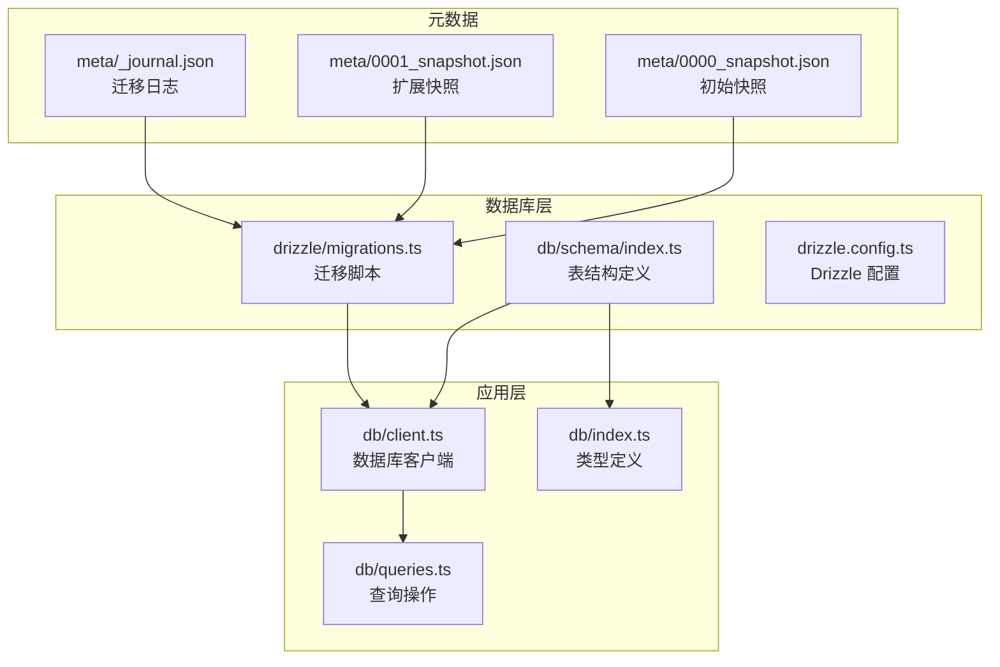
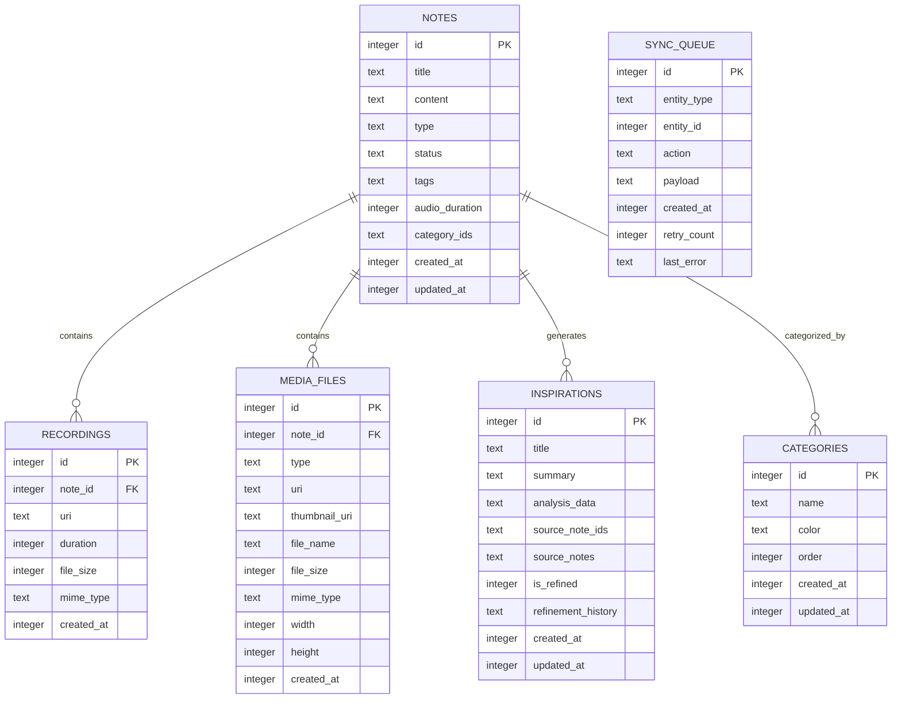
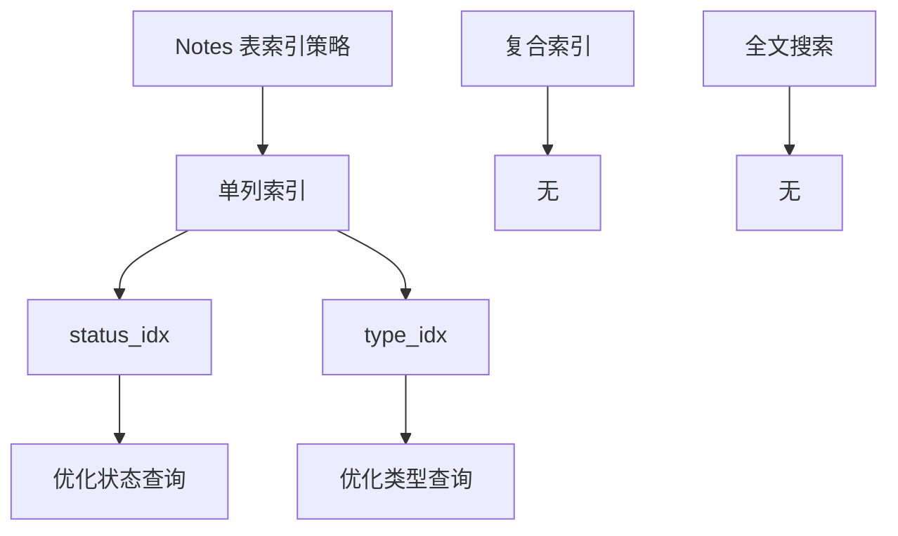
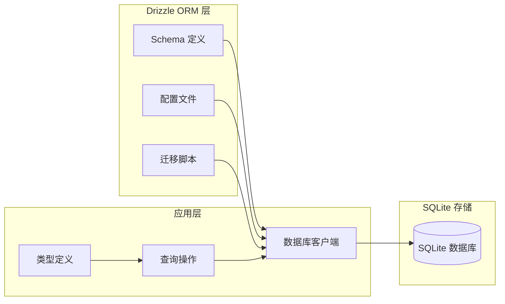
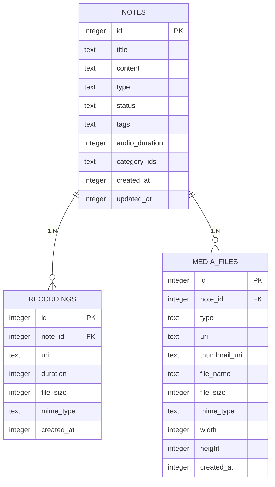
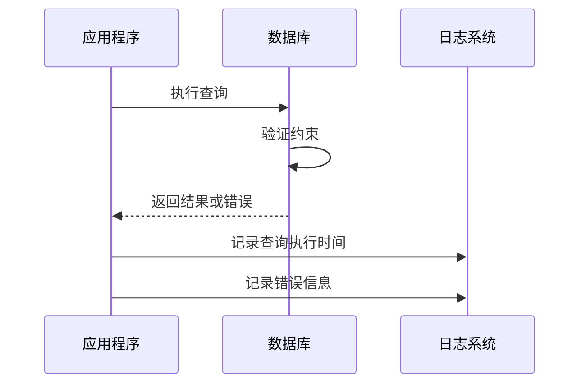

# 表结构定义

<cite>
**本文档引用的文件**
- [db/schema/index.ts](file://db/schema/index.ts)
- [drizzle/migrations.ts](file://drizzle/migrations.ts)
- [drizzle/0001_overjoyed_punisher.sql](file://drizzle/0001_overjoyed_punisher.sql)
- [drizzle/0002_category_support.sql](file://drizzle/0002_category_support.sql)
- [drizzle/meta/0000_snapshot.json](file://drizzle/meta/0000_snapshot.json)
- [drizzle/meta/0001_snapshot.json](file://drizzle/meta/0001_snapshot.json)
- [drizzle.config.ts](file://drizzle.config.ts)
- [db/client.ts](file://db/client.ts)
- [db/queries.ts](file://db/queries.ts)
- [db/index.ts](file://db/index.ts)
</cite>

## 目录
1. [简介](#简介)
2. [项目结构](#项目结构)
3. [核心组件](#核心组件)
4. [架构概览](#架构概览)
5. [详细组件分析](#详细组件分析)
6. [依赖关系分析](#依赖关系分析)
7. [性能考虑](#性能考虑)
8. [故障排除指南](#故障排除指南)
9. [结论](#结论)

## 简介

VoiceNote 是一个基于 React Native 和 Expo SQLite 的语音笔记应用。本文件档详细记录了数据库表结构定义，包括每个表的字段定义、数据类型、约束条件和索引策略。文档涵盖了主键、外键、唯一性约束和检查约束的使用，解释了时间戳字段的设计机制，阐述了索引策略（单列索引、复合索引），提供了 SQL DDL 语句示例，并解释了 JSON 字段的存储格式和查询方法。

## 项目结构

VoiceNote 使用 Drizzle ORM 来管理数据库结构，采用模块化的数据库设计：



**图表来源**
- [db/schema/index.ts:1-75](file://db/schema/index.ts#L1-L75)
- [drizzle/migrations.ts:1-83](file://drizzle/migrations.ts#L1-L83)
- [drizzle.config.ts:1-12](file://drizzle.config.ts#L1-L12)

**章节来源**
- [db/schema/index.ts:1-75](file://db/schema/index.ts#L1-L75)
- [drizzle/migrations.ts:1-83](file://drizzle/migrations.ts#L1-L83)
- [drizzle.config.ts:1-12](file://drizzle.config.ts#L1-L12)

## 核心组件

VoiceNote 数据库包含以下核心表结构：

### 主要表结构概览

| 表名 | 描述 | 记录数量 | 外键关系 |
|------|------|----------|----------|
| notes | 笔记主表 | 核心业务实体 | 无 |
| recordings | 录音文件表 | 媒体附件 | 外键到 notes |
| media_files | 媒体文件表 | 媒体附件 | 外键到 notes |
| sync_queue | 同步队列表 | 异步同步 | 无 |
| inspirations | 灵感笔记表 | AI 分析功能 | 无 |
| categories | 分类表 | 分类管理 | 无 |

**章节来源**
- [db/schema/index.ts:3-75](file://db/schema/index.ts#L3-L75)
- [drizzle/migrations.ts:8-82](file://drizzle/migrations.ts#L8-L82)

## 架构概览



**图表来源**
- [db/schema/index.ts:3-75](file://db/schema/index.ts#L3-L75)
- [drizzle/migrations.ts:8-82](file://drizzle/migrations.ts#L8-L82)

## 详细组件分析

### Notes 表（笔记主表）

Notes 表是系统的核心表，存储所有笔记的基本信息和元数据。

#### 字段定义

| 字段名 | 数据类型 | 约束 | 默认值 | 描述 |
|--------|----------|------|--------|------|
| id | integer | PRIMARY KEY, AUTOINCREMENT, NOT NULL | 无 | 主键，自增标识符 |
| title | text | NOT NULL | 无 | 笔记标题 |
| content | text | NULL | 无 | 笔记内容（可选） |
| type | text | NOT NULL | 'text' | 笔记类型枚举：text、voice、camera、attachment |
| status | text | NOT NULL | 'active' | 笔记状态枚举：active、archived、snoozed |
| tags | text | NULL | 无 | JSON 数组，存储标签信息 |
| audio_duration | integer | NULL | 无 | 音频时长（毫秒），用于语音笔记 |
| category_ids | text | NULL | 无 | JSON 数组，存储分类 ID 列表 |
| created_at | integer | NOT NULL | 无 | 创建时间戳 |
| updated_at | integer | NOT NULL | 无 | 更新时间戳 |

#### 索引策略



**图表来源**
- [db/schema/index.ts:14-17](file://db/schema/index.ts#L14-L17)
- [drizzle/migrations.ts:36-37](file://drizzle/migrations.ts#L36-L37)

#### 时间戳设计

Notes 表使用整数时间戳存储，通过 Drizzle 的 `mode: 'timestamp'` 配置实现自动转换：

- `created_at`: 记录创建时的时间戳
- `updated_at`: 记录更新时的时间戳

在查询操作中，应用层会自动设置这些时间戳值。

**章节来源**
- [db/schema/index.ts:3-17](file://db/schema/index.ts#L3-L17)
- [db/queries.ts:35-53](file://db/queries.ts#L35-L53)

### Recordings 表（录音文件表）

Recordings 表存储与笔记关联的音频录制文件信息。

#### 字段定义

| 字段名 | 数据类型 | 约束 | 默认值 | 描述 |
|--------|----------|------|--------|------|
| id | integer | PRIMARY KEY, AUTOINCREMENT, NOT NULL | 无 | 主键，自增标识符 |
| note_id | integer | NULL | 无 | 外键，关联到 notes 表 |
| uri | text | NOT NULL | 无 | 文件 URI 路径 |
| duration | integer | NOT NULL | 无 | 音频时长（毫秒） |
| file_size | integer | NULL | 无 | 文件大小（字节） |
| mime_type | text | NULL | 无 | MIME 类型 |
| created_at | integer | NOT NULL | 无 | 创建时间戳 |

#### 外键约束

- 外键：`note_id` → `notes.id`
- 删除行为：CASCADE（当删除笔记时，关联的录音也会被删除）

**章节来源**
- [db/schema/index.ts:19-27](file://db/schema/index.ts#L19-L27)
- [drizzle/migrations.ts:38-47](file://drizzle/migrations.ts#L38-L47)

### Media Files 表（媒体文件表）

Media Files 表存储与笔记关联的各种媒体文件信息。

#### 字段定义

| 字段名 | 数据类型 | 约束 | 默认值 | 描述 |
|--------|----------|------|--------|------|
| id | integer | PRIMARY KEY, AUTOINCREMENT, NOT NULL | 无 | 主键，自增标识符 |
| note_id | integer | NULL | 无 | 外键，关联到 notes 表 |
| type | text | NOT NULL | 无 | 媒体类型枚举：image、video、document |
| uri | text | NOT NULL | 无 | 文件 URI 路径 |
| thumbnail_uri | text | NULL | 无 | 缩略图 URI 路径 |
| file_name | text | NULL | 无 | 文件原始名称 |
| file_size | integer | NULL | 无 | 文件大小（字节） |
| mime_type | text | NULL | 无 | MIME 类型 |
| width | integer | NULL | 无 | 图像宽度（像素） |
| height | integer | NULL | 无 | 图像高度（像素） |
| created_at | integer | NOT NULL | 无 | 创建时间戳 |

#### 外键约束

- 外键：`note_id` → `notes.id`
- 删除行为：CASCADE（当删除笔记时，关联的媒体文件也会被删除）

**章节来源**
- [db/schema/index.ts:29-41](file://db/schema/index.ts#L29-L41)
- [drizzle/migrations.ts:9-22](file://drizzle/migrations.ts#L9-L22)

### Sync Queue 表（同步队列表）

Sync Queue 表用于处理异步同步操作，支持重试机制。

#### 字段定义

| 字段名 | 数据类型 | 约束 | 默认值 | 描述 |
|--------|----------|------|--------|------|
| id | integer | PRIMARY KEY, AUTOINCREMENT, NOT NULL | 无 | 主键，自增标识符 |
| entity_type | text | NOT NULL | 无 | 实体类型枚举：note、recording、media |
| entity_id | integer | NOT NULL | 无 | 实体 ID |
| action | text | NOT NULL | 无 | 操作类型枚举：create、update、delete |
| payload | text | NULL | 无 | JSON 字符串，存储操作载荷 |
| created_at | integer | NOT NULL | 无 | 创建时间戳 |
| retry_count | integer | NULL | 0 | 重试次数，默认为 0 |
| last_error | text | NULL | 无 | 最后一次错误信息 |

**章节来源**
- [db/schema/index.ts:43-52](file://db/schema/index.ts#L43-L52)
- [drizzle/migrations.ts:49-58](file://drizzle/migrations.ts#L49-L58)

### Inspirations 表（灵感笔记表）

Inspirations 表用于存储 AI 分析生成的灵感内容。

#### 字段定义

| 字段名 | 数据类型 | 约束 | 默认值 | 描述 |
|--------|----------|------|--------|------|
| id | integer | PRIMARY KEY, AUTOINCREMENT, NOT NULL | 无 | 主键，自增标识符 |
| title | text | NOT NULL | 无 | 标题 |
| summary | text | NOT NULL | 无 | 摘要 |
| analysis_data | text | NOT NULL | 无 | JSON：EnhancedAIAnalysisResult 结果 |
| source_note_ids | text | NOT NULL | 无 | JSON：number[]，源笔记 ID 列表 |
| source_notes | text | NOT NULL | 无 | JSON：AISourceNote[]，源笔记详情 |
| is_refined | integer | NOT NULL | false | 是否已优化（布尔值存储） |
| refinement_history | text | NULL | 无 | JSON：string[]，优化历史记录 |
| created_at | integer | NOT NULL | 无 | 创建时间戳 |
| updated_at | integer | NOT NULL | 无 | 更新时间戳 |

**章节来源**
- [db/schema/index.ts:63-75](file://db/schema/index.ts#L63-L75)
- [drizzle/0001_overjoyed_punisher.sql:1-13](file://drizzle/0001_overjoyed_punisher.sql#L1-L13)

### Categories 表（分类表）

Categories 表用于管理笔记分类功能。

#### 字段定义

| 字段名 | 数据类型 | 约束 | 默认值 | 描述 |
|--------|----------|------|--------|------|
| id | integer | PRIMARY KEY, AUTOINCREMENT, NOT NULL | 无 | 主键，自增标识符 |
| name | text | NOT NULL | 无 | 分类名称 |
| color | text | NULL | 无 | 分类颜色 |
| order | integer | NOT NULL | 0 | 排序权重，默认为 0 |
| created_at | integer | NOT NULL | 无 | 创建时间戳 |
| updated_at | integer | NULL | 无 | 更新时间戳 |

**章节来源**
- [db/schema/index.ts:54-61](file://db/schema/index.ts#L54-L61)
- [drizzle/0002_category_support.sql:1-8](file://drizzle/0002_category_support.sql#L1-L8)

## 依赖关系分析



**图表来源**
- [db/client.ts:1-15](file://db/client.ts#L1-L15)
- [drizzle.config.ts:1-12](file://drizzle.config.ts#L1-L12)
- [db/queries.ts:1-286](file://db/queries.ts#L1-L286)

### 外键关系图



**图表来源**
- [db/schema/index.ts:19-41](file://db/schema/index.ts#L19-L41)

**章节来源**
- [db/schema/index.ts:19-41](file://db/schema/index.ts#L19-L41)
- [drizzle/migrations.ts:9-22](file://drizzle/migrations.ts#L9-L22)

## 性能考虑

### 索引优化策略

1. **现有索引**
   - `notes_status_idx`: 在 status 字段上的单列索引
   - `notes_type_idx`: 在 type 字段上的单列索引

2. **潜在优化建议**
   ```mermaid
flowchart TD
A[性能优化建议] --> B[添加复合索引]
B --> C[status + updated_at]
B --> D[type + updated_at]
B --> E[category_ids 查询优化]
F[查询模式分析] --> G[按状态过滤]
F --> H[按类型过滤]
F --> I[时间范围查询]
F --> J[JSON 查询优化]
```

3. **时间戳索引**
   - 考虑在 `created_at` 和 `updated_at` 上建立索引以优化排序查询
   - 注意：SQLite 不支持部分索引，需要权衡索引数量

### JSON 字段查询优化

1. **当前实现**
   - 所有 JSON 字段都以 TEXT 类型存储
   - 使用 JSON.parse() 进行解析

2. **优化方案**
   - 对于频繁查询的 JSON 字段，考虑添加计算列
   - 使用 SQLite 的 JSON 函数进行原生查询

### 外键约束影响

1. **CASCADE 删除**
   - 自动清理关联数据，但可能影响删除性能
   - 建议在批量删除时考虑事务处理

2. **外键完整性**
   - 确保数据一致性
   - 可能影响插入性能

**章节来源**
- [db/schema/index.ts:14-17](file://db/schema/index.ts#L14-L17)
- [db/queries.ts:230-245](file://db/queries.ts#L230-L245)

## 故障排除指南

### 常见问题及解决方案

1. **迁移失败**
   - 检查 `meta/_journal.json` 中的迁移状态
   - 确认数据库版本与代码一致

2. **JSON 解析错误**
   - 检查 `category_ids` 字段的数据格式
   - 确保 JSON 字符串的有效性

3. **外键约束冲突**
   - 检查关联数据的一致性
   - 确认删除顺序（先删除子表，再删除父表）

### 调试工具



**图表来源**
- [db/queries.ts:136-164](file://db/queries.ts#L136-L164)

**章节来源**
- [db/queries.ts:136-164](file://db/queries.ts#L136-L164)

## 结论

VoiceNote 的数据库设计采用了清晰的分层架构，使用 Drizzle ORM 提供了类型安全的数据库操作。主要特点包括：

1. **清晰的表结构**：每个表都有明确的职责和约束
2. **合理的索引策略**：针对常见查询模式进行了优化
3. **灵活的 JSON 支持**：通过 TEXT 类型存储 JSON 数据
4. **完善的外键关系**：确保数据一致性
5. **时间戳设计**：统一的时间戳管理机制

未来可以考虑的改进方向：
- 添加更多复合索引以优化复杂查询
- 考虑使用 SQLite 的 JSON 函数进行原生 JSON 查询
- 实现更精细的缓存策略
- 添加数据库监控和性能分析工具

这个数据库设计为 VoiceNote 应用提供了坚实的基础，支持从基础笔记管理到高级 AI 功能的完整需求。