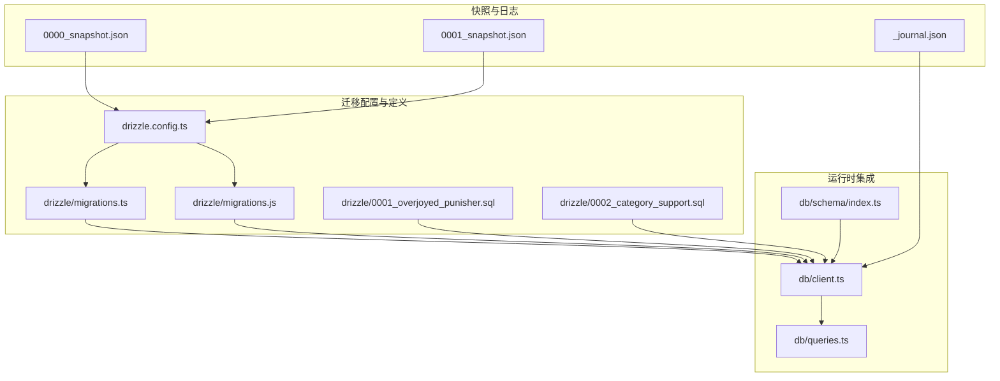
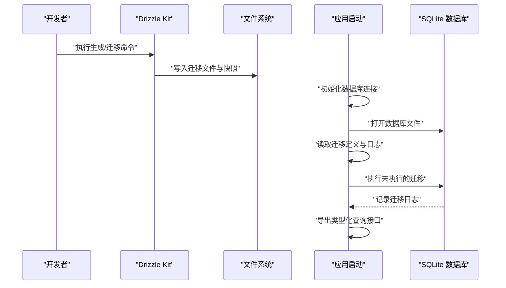
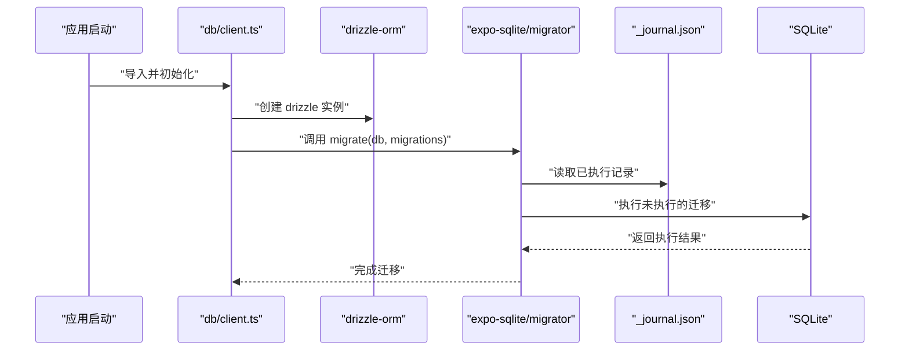
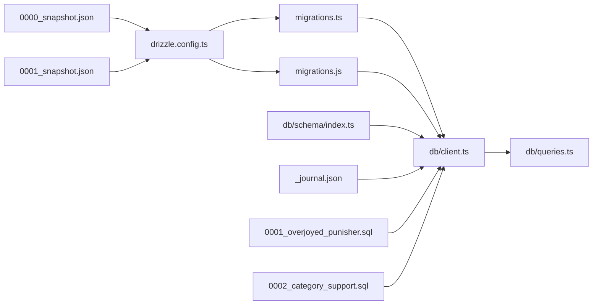

# 迁移管理

<cite>
**本文引用的文件**
- [drizzle.config.ts](file://drizzle.config.ts)
- [migrations.ts](file://drizzle/migrations.ts)
- [migrations.js](file://drizzle/migrations.js)
- [client.ts](file://db/client.ts)
- [schema/index.ts](file://db/schema/index.ts)
- [_journal.json](file://drizzle/meta/_journal.json)
- [0000_snapshot.json](file://drizzle/meta/0000_snapshot.json)
- [0001_snapshot.json](file://drizzle/meta/0001_snapshot.json)
- [0001_overjoyed_punisher.sql](file://drizzle/0001_overjoyed_punisher.sql)
- [0002_category_support.sql](file://drizzle/0002_category_support.sql)
- [queries.ts](file://db/queries.ts)
- [package.json](file://package.json)
</cite>

## 目录
1. [简介](#简介)
2. [项目结构](#项目结构)
3. [核心组件](#核心组件)
4. [架构总览](#架构总览)
5. [详细组件分析](#详细组件分析)
6. [依赖关系分析](#依赖关系分析)
7. [性能考量](#性能考量)
8. [故障排除指南](#故障排除指南)
9. [结论](#结论)
10. [附录](#附录)

## 简介
本文件面向 VoiceNote 项目的数据库迁移管理，围绕基于 Drizzle ORM 的迁移体系进行系统化说明。内容涵盖迁移架构与工作流程、迁移文件命名与版本管理、执行顺序与回滚策略、迁移脚本编写规范、快照与版本控制、命令与自动化、测试与生产部署注意事项、故障排除与兼容性保障等。

## 项目结构
VoiceNote 的数据库迁移采用 Drizzle Kit 生成与管理，结合 Expo/React Native 的 SQLite 迁移器在应用启动时自动执行。关键目录与文件如下：
- 配置：drizzle.config.ts 指定 schema、输出目录、方言与驱动
- 迁移定义：drizzle/migrations.ts（TS 内联 SQL）与 drizzle/migrations.js（SQL 文件映射）
- 快照与日志：drizzle/meta 下的 _journal.json 与各版本快照
- 实际 SQL：drizzle/*.sql 文件
- 数据库客户端：db/client.ts 在应用启动时加载并执行迁移
- 模式定义：db/schema/index.ts 使用 Drizzle ORM 类型化定义表结构
- 查询层：db/queries.ts 基于 schema 提供 CRUD 与聚合查询

**图表来源**
- [drizzle.config.ts:1-12](file://drizzle.config.ts#L1-L12)
- [migrations.ts:1-83](file://drizzle/migrations.ts#L1-L83)
- [migrations.js:1-14](file://drizzle/migrations.js#L1-L14)
- [client.ts:1-15](file://db/client.ts#L1-L15)
- [schema/index.ts:1-75](file://db/schema/index.ts#L1-L75)
- [_journal.json:1-27](file://drizzle/meta/_journal.json#L1-L27)
- [0000_snapshot.json:1-349](file://drizzle/meta/0000_snapshot.json#L1-L349)
- [0001_snapshot.json:1-430](file://drizzle/meta/0001_snapshot.json#L1-L430)
- [0001_overjoyed_punisher.sql:1-13](file://drizzle/0001_overjoyed_punisher.sql#L1-L13)
- [0002_category_support.sql:1-11](file://drizzle/0002_category_support.sql#L1-L11)

**章节来源**
- [drizzle.config.ts:1-12](file://drizzle.config.ts#L1-L12)
- [client.ts:1-15](file://db/client.ts#L1-L15)
- [schema/index.ts:1-75](file://db/schema/index.ts#L1-L75)

## 核心组件
- 迁移配置：drizzle.config.ts 定义 schema 路径、输出目录、SQLite 方言与 Expo 驱动，并通过 dbCredentials 指定数据库文件名。
- 迁移定义：
  - migrations.ts：在 TS 中内联 SQL，便于 Metro 打包器直接处理。
  - migrations.js：将 SQL 文件映射为迁移对象，满足 Expo/React Native SQLite 迁移器要求。
- 快照与日志：_journal.json 记录已执行迁移的顺序与时间戳；0000_snapshot.json、0001_snapshot.json 记录每个版本的数据库结构快照。
- 应用启动迁移：db/client.ts 创建数据库连接并调用 migrate 执行迁移。
- 模式与查询：schema/index.ts 定义表结构与索引；queries.ts 基于 schema 提供查询封装。

**章节来源**
- [drizzle.config.ts:1-12](file://drizzle.config.ts#L1-L12)
- [migrations.ts:1-83](file://drizzle/migrations.ts#L1-L83)
- [migrations.js:1-14](file://drizzle/migrations.js#L1-L14)
- [client.ts:1-15](file://db/client.ts#L1-L15)
- [schema/index.ts:1-75](file://db/schema/index.ts#L1-L75)
- [_journal.json:1-27](file://drizzle/meta/_journal.json#L1-L27)
- [0000_snapshot.json:1-349](file://drizzle/meta/0000_snapshot.json#L1-L349)
- [0001_snapshot.json:1-430](file://drizzle/meta/0001_snapshot.json#L1-L430)

## 架构总览
下图展示从配置到运行时迁移的整体流程，以及迁移与模式、查询层的关系。

**图表来源**
- [drizzle.config.ts:1-12](file://drizzle.config.ts#L1-L12)
- [migrations.ts:1-83](file://drizzle/migrations.ts#L1-L83)
- [migrations.js:1-14](file://drizzle/migrations.js#L1-L14)
- [client.ts:1-15](file://db/client.ts#L1-L15)
- [schema/index.ts:1-75](file://db/schema/index.ts#L1-L75)

## 详细组件分析

### 迁移配置与生成
- 配置项要点：
  - schema：指向 db/schema/index.ts，用于生成迁移与推断快照。
  - out：迁移输出目录为 drizzle。
  - dialect：sqlite。
  - driver：expo（适配 React Native SQLite）。
  - dbCredentials.url：数据库文件名 voicenote.db。
- 生成与迁移命令：
  - 生成：npm 脚本 db:generate。
  - 迁移：npm 脚本 db:migrate。
  - 推送：npm 脚本 db:push（直接对数据库应用变更，谨慎使用）。
  - Studio：npm 脚本 db:studio（可视化调试）。

最佳实践建议：
- 在 schema/index.ts 中完成所有表结构与索引定义，避免在 SQL 文件中遗漏类型约束。
- 生成迁移前先确保 schema 已稳定，减少不必要的快照差异。

**章节来源**
- [drizzle.config.ts:1-12](file://drizzle.config.ts#L1-L12)
- [package.json:15-18](file://package.json#L15-L18)

### 迁移文件与命名规范
- 文件命名：
  - SQL 文件：以四位递增序号加描述的格式命名，如 0001_overjoyed_punisher.sql、0002_category_support.sql。
  - TS 内联迁移：migrations.ts。
  - JS 映射迁移：migrations.js。
- 版本管理：
  - _journal.json 维护已执行迁移的顺序、版本与时间戳。
  - 快照文件（0000_snapshot.json、0001_snapshot.json）记录每次迁移后的数据库结构。
- 执行顺序：
  - 由 _journal.json 的 entries 数组顺序决定，按 idx 升序执行。
  - 若存在中断或部分执行，迁移器会跳过已记录的条目，仅执行缺失项。

**章节来源**
- [migrations.js:1-14](file://drizzle/migrations.js#L1-L14)
- [migrations.ts:1-83](file://drizzle/migrations.ts#L1-L83)
- [_journal.json:1-27](file://drizzle/meta/_journal.json#L1-L27)
- [0000_snapshot.json:1-349](file://drizzle/meta/0000_snapshot.json#L1-L349)
- [0001_snapshot.json:1-430](file://drizzle/meta/0001_snapshot.json#L1-L430)

### 迁移脚本编写规范
- 表创建：
  - 在 schema/index.ts 中定义表结构与索引，确保字段类型、默认值、外键约束与索引完备。
  - 在 SQL 文件中补充索引创建语句，保持与 schema 一致。
- 修改与删除：
  - 优先通过 schema 定义与迁移器生成 SQL，避免手写 ALTER 语句导致不一致。
  - 如需手动 ALTER，请同时更新 schema 与快照，确保后续生成不会回退。
- 可逆性与幂等性：
  - 迁移应幂等，重复执行不应产生副作用。
  - 尽量避免破坏性变更；必要时提供回滚方案并在团队内评审。

示例参考路径：
- 表创建与索引：[schema/index.ts:1-75](file://db/schema/index.ts#L1-L75)
- 新增表 inspirations：[0001_overjoyed_punisher.sql:1-13](file://drizzle/0001_overjoyed_punisher.sql#L1-L13)
- 新增表 categories 并扩展 notes：[0002_category_support.sql:1-11](file://drizzle/0002_category_support.sql#L1-L11)

**章节来源**
- [schema/index.ts:1-75](file://db/schema/index.ts#L1-L75)
- [0001_overjoyed_punisher.sql:1-13](file://drizzle/0001_overjoyed_punisher.sql#L1-L13)
- [0002_category_support.sql:1-11](file://drizzle/0002_category_support.sql#L1-L11)

### 运行时迁移执行
- 启动流程：
  - db/client.ts 创建数据库连接并使用 drizzle-orm/expo-sqlite 初始化数据库实例。
  - 调用 migrate(db, migrations) 执行迁移，迁移器会根据 _journal.json 判断是否需要执行。
- 迁移来源：
  - migrations.ts（内联 SQL）与 migrations.js（SQL 文件映射）均可被迁移器识别。
- 错误处理：
  - 迁移失败会抛出异常，应用需捕获并上报；可清理数据库文件后重试或修复迁移脚本。

**图表来源**
- [client.ts:1-15](file://db/client.ts#L1-L15)
- [migrations.ts:1-83](file://drizzle/migrations.ts#L1-L83)
- [migrations.js:1-14](file://drizzle/migrations.js#L1-L14)
- [_journal.json:1-27](file://drizzle/meta/_journal.json#L1-L27)

**章节来源**
- [client.ts:1-15](file://db/client.ts#L1-L15)

### 回滚机制与错误处理
- 回滚能力：
  - 当前实现未提供自动回滚脚本；回滚通常通过“向前迁移”新增修正迁移来实现。
  - 若必须撤销，建议备份数据库后手工回滚，并重新生成迁移。
- 错误处理策略：
  - 在应用层捕获迁移异常，记录错误信息并提示用户重试或联系支持。
  - 对于破坏性变更，建议在 schema 层先添加新字段/表，再迁移数据，最后删除旧结构。

**章节来源**
- [client.ts:1-15](file://db/client.ts#L1-L15)

### 命令与自动化
- 常用命令：
  - 生成迁移：npm run db:generate
  - 执行迁移：npm run db:migrate
  - 直接推送：npm run db:push（慎用）
  - 启动 Studio：npm run db:studio
- 自动化建议：
  - CI 中先执行 db:generate 与 db:migrate，确保迁移可执行且无冲突。
  - 生产构建前校验迁移文件完整性与 _journal.json 一致性。

**章节来源**
- [package.json:15-18](file://package.json#L15-L18)

### 快照与版本控制
- 快照作用：
  - 0000_snapshot.json、0001_snapshot.json 记录每次迁移后的数据库结构，用于生成增量迁移与比对差异。
- 版本控制策略：
  - 将快照与迁移文件纳入版本控制，确保团队共享一致的数据库结构视图。
  - 合并分支时关注快照差异，避免 schema 与快照脱节。

**章节来源**
- [_journal.json:1-27](file://drizzle/meta/_journal.json#L1-L27)
- [0000_snapshot.json:1-349](file://drizzle/meta/0000_snapshot.json#L1-L349)
- [0001_snapshot.json:1-430](file://drizzle/meta/0001_snapshot.json#L1-L430)

### 迁移测试方法
- 单元测试：
  - 使用 Jest 测试查询层逻辑，验证 CRUD 与聚合查询在不同迁移阶段的行为。
- 集成测试：
  - 在测试环境中执行 db:migrate，然后运行端到端测试，覆盖关键业务流程。
- 结构验证：
  - 对比快照与当前 schema，确保生成的 SQL 与预期一致。

**章节来源**
- [queries.ts:1-286](file://db/queries.ts#L1-L286)

### 生产环境部署注意事项
- 预检查：
  - 确认数据库文件权限与存储空间充足。
  - 在部署前执行 db:migrate，确保迁移成功。
- 回滚预案：
  - 准备备份与回滚迁移脚本，演练恢复流程。
- 监控与告警：
  - 记录迁移日志，监控失败率与耗时。

**章节来源**
- [client.ts:1-15](file://db/client.ts#L1-L15)

### 向后兼容性与数据迁移策略
- 兼容性保障：
  - 优先使用可选字段与默认值，避免破坏性变更。
  - 通过 schema 定义枚举与约束，确保数据一致性。
- 数据迁移：
  - 对于复杂数据转换，先在 schema 中添加新字段，迁移数据后再删除旧字段。
  - 使用事务包裹关键步骤，失败即回滚。

**章节来源**
- [schema/index.ts:1-75](file://db/schema/index.ts#L1-L75)
- [queries.ts:200-286](file://db/queries.ts#L200-L286)

## 依赖关系分析

**图表来源**
- [drizzle.config.ts:1-12](file://drizzle.config.ts#L1-L12)
- [migrations.ts:1-83](file://drizzle/migrations.ts#L1-L83)
- [migrations.js:1-14](file://drizzle/migrations.js#L1-L14)
- [client.ts:1-15](file://db/client.ts#L1-L15)
- [schema/index.ts:1-75](file://db/schema/index.ts#L1-L75)
- [_journal.json:1-27](file://drizzle/meta/_journal.json#L1-L27)
- [0000_snapshot.json:1-349](file://drizzle/meta/0000_snapshot.json#L1-L349)
- [0001_snapshot.json:1-430](file://drizzle/meta/0001_snapshot.json#L1-L430)
- [0001_overjoyed_punisher.sql:1-13](file://drizzle/0001_overjoyed_punisher.sql#L1-L13)
- [0002_category_support.sql:1-11](file://drizzle/0002_category_support.sql#L1-L11)
- [queries.ts:1-286](file://db/queries.ts#L1-L286)

**章节来源**
- [drizzle.config.ts:1-12](file://drizzle.config.ts#L1-L12)
- [client.ts:1-15](file://db/client.ts#L1-L15)
- [schema/index.ts:1-75](file://db/schema/index.ts#L1-L75)

## 性能考量
- 迁移性能：
  - 大表重建或大量数据迁移时，尽量分批处理并使用事务。
  - 避免在迁移中执行复杂计算，提前准备数据或在应用层处理。
- 查询性能：
  - schema 中已定义索引（如 notes_status_idx、notes_type_idx），确保查询效率。
  - 合理使用复合条件与范围查询，避免全表扫描。

**章节来源**
- [schema/index.ts:14-17](file://db/schema/index.ts#L14-L17)
- [queries.ts:1-286](file://db/queries.ts#L1-L286)

## 故障排除指南
- 常见问题与解决：
  - 迁移失败：检查 _journal.json 与迁移文件是否匹配；确认数据库文件可写；清理缓存后重试。
  - 快照不一致：对比 0000_snapshot.json、0001_snapshot.json 与当前 schema，重新生成迁移。
  - 索引缺失：在 schema 中补充索引定义，并生成新的迁移文件。
- 调试建议：
  - 使用 npm run db:studio 查看数据库结构与数据。
  - 在应用层捕获异常并记录详细日志，定位具体迁移步骤。

**章节来源**
- [_journal.json:1-27](file://drizzle/meta/_journal.json#L1-L27)
- [0000_snapshot.json:1-349](file://drizzle/meta/0000_snapshot.json#L1-L349)
- [0001_snapshot.json:1-430](file://drizzle/meta/0001_snapshot.json#L1-L430)

## 结论
VoiceNote 的迁移体系以 Drizzle Kit 为核心，结合 Expo/React Native SQLite 迁移器，在应用启动时自动执行迁移。通过 schema 驱动的快照与迁移文件、严格的命名与版本管理、以及完善的命令与自动化，实现了可维护、可追溯、可回滚的数据库演进路径。建议在开发与生产中遵循本文规范，确保迁移安全与稳定。

## 附录
- 命令速查：
  - 生成迁移：npm run db:generate
  - 执行迁移：npm run db:migrate
  - 直接推送：npm run db:push
  - 启动 Studio：npm run db:studio
- 关键文件清单：
  - 配置：drizzle.config.ts
  - 迁移定义：migrations.ts、migrations.js
  - SQL 文件：0001_overjoyed_punisher.sql、0002_category_support.sql
  - 快照与日志：_journal.json、0000_snapshot.json、0001_snapshot.json
  - 运行时：db/client.ts、db/schema/index.ts、db/queries.ts