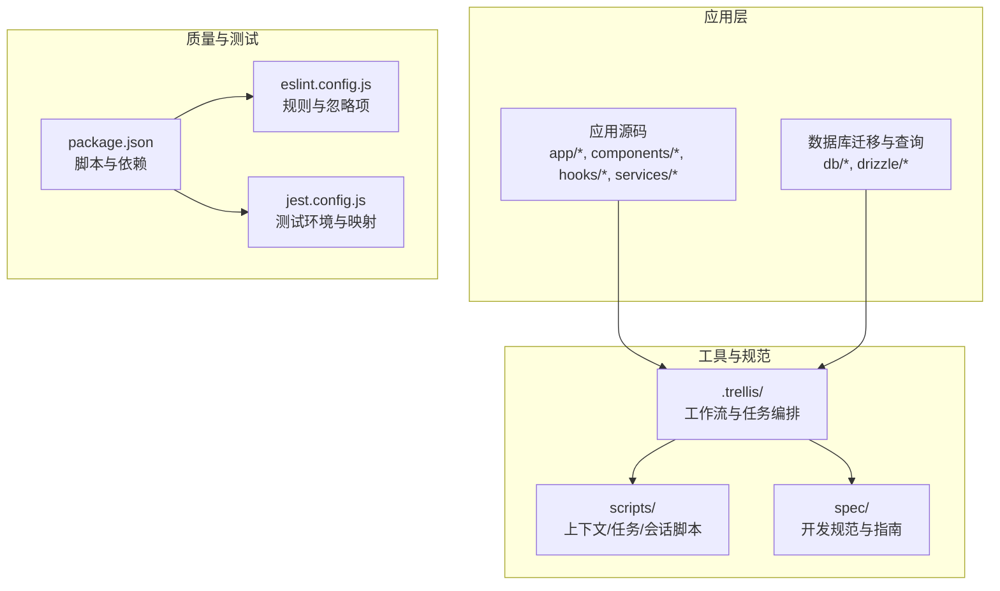
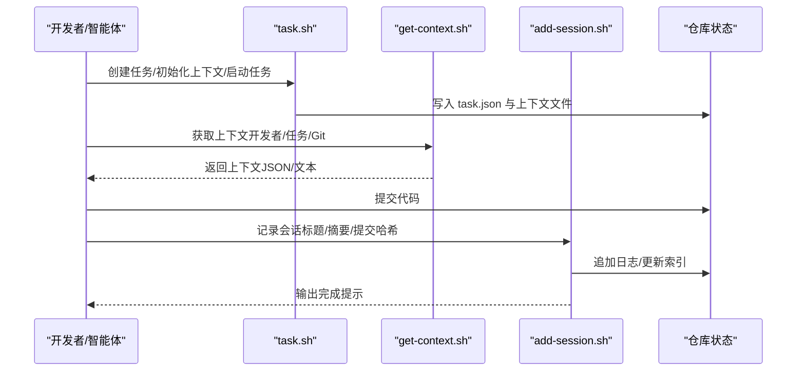
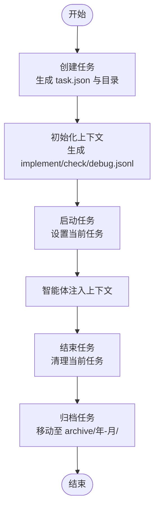
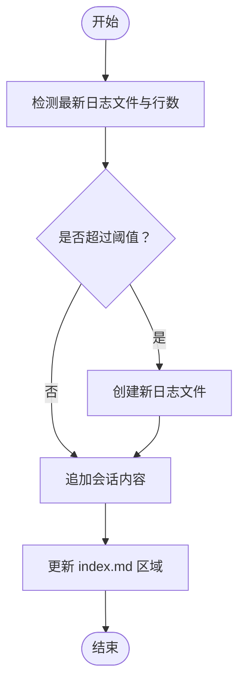
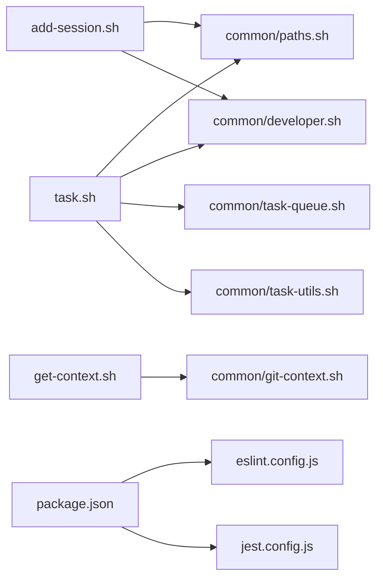

# CI/CD 自动化

<cite>
**本文引用的文件**
- [.trellis/workflow.md](file://.trellis/workflow.md)
- [.trellis/scripts/task.sh](file://.trellis/scripts/task.sh)
- [.trellis/scripts/get-context.sh](file://.trellis/scripts/get-context.sh)
- [.trellis/scripts/add-session.sh](file://.trellis/scripts/add-session.sh)
- [package.json](file://package.json)
- [eslint.config.js](file://eslint.config.js)
- [jest.config.js](file://jest.config.js)
</cite>

## 目录
1. [简介](#简介)
2. [项目结构](#项目结构)
3. [核心组件](#核心组件)
4. [架构总览](#架构总览)
5. [详细组件分析](#详细组件分析)
6. [依赖关系分析](#依赖关系分析)
7. [性能考虑](#性能考虑)
8. [故障排查指南](#故障排查指南)
9. [结论](#结论)
10. [附录](#附录)

## 简介
本文件面向 VoiceNote 的 CI/CD 自动化，聚焦于 Trellis 工作流与任务编排，系统性阐述从开发到测试、构建与部署的流水线设计，并结合现有仓库中的脚本与配置，给出在 GitHub Actions 或其他 CI 平台上的落地建议。同时覆盖代码质量检查、安全扫描与依赖审计的自动化流程、环境与密钥管理最佳实践、部署策略（蓝绿与滚动更新）的自动化实现思路、监控告警与故障自动恢复的配置要点，以及常见问题与性能优化建议。

## 项目结构
VoiceNote 仓库采用以功能域为中心的组织方式，前端基于 Expo + React Native 技术栈；.trellis 目录提供了多智能体协作的工作流与任务编排能力，配套脚本负责上下文采集、任务生命周期管理与会话记录等。

图表来源
- [.trellis/workflow.md:103-138](file://.trellis/workflow.md#L103-L138)
- [package.json:5-18](file://package.json#L5-L18)
- [eslint.config.js:1-84](file://eslint.config.js#L1-L84)
- [jest.config.js:1-47](file://jest.config.js#L1-L47)

章节来源
- [.trellis/workflow.md:103-138](file://.trellis/workflow.md#L103-L138)
- [package.json:5-18](file://package.json#L5-L18)

## 核心组件
- Trellis 工作流与规范：定义“先读再写、增量开发、即时记录、文档上限”的原则，配套 .trellis/spec 下的前端/后端指南与思考导引。
- 任务管理脚本：提供任务创建、上下文初始化、校验、启动/结束、归档、分支与 PR 关联等能力，支撑多智能体流水线。
- 上下文采集脚本：统一输出当前仓库的开发者身份、任务状态、Git 上下文等信息，便于 AI 智能体注入上下文。
- 会话记录脚本：按日程生成/轮换日志文件，自动更新索引，支持单次提交与批量内容追加。
- 质量与测试：通过 package.json 中的 lint、typecheck、test 等脚本，配合 ESLint 与 Jest 配置，形成可重复的质量门禁。

章节来源
- [.trellis/workflow.md:95-102](file://.trellis/workflow.md#L95-L102)
- [.trellis/scripts/task.sh:134-268](file://.trellis/scripts/task.sh#L134-L268)
- [.trellis/scripts/get-context.sh:1-8](file://.trellis/scripts/get-context.sh#L1-L8)
- [.trellis/scripts/add-session.sh:259-353](file://.trellis/scripts/add-session.sh#L259-L353)
- [package.json:5-18](file://package.json#L5-L18)
- [eslint.config.js:38-43](file://eslint.config.js#L38-L43)
- [jest.config.js:18-46](file://jest.config.js#L18-L46)

## 架构总览
下图展示从任务创建到会话记录的端到端工作流，体现 Trellis 在多智能体协作中的角色与脚本间的调用关系。

图表来源
- [.trellis/scripts/task.sh:134-268](file://.trellis/scripts/task.sh#L134-L268)
- [.trellis/scripts/get-context.sh:1-8](file://.trellis/scripts/get-context.sh#L1-L8)
- [.trellis/scripts/add-session.sh:259-353](file://.trellis/scripts/add-session.sh#L259-L353)

## 详细组件分析

### 组件一：任务管理与上下文注入（task.sh）
- 功能要点
  - 任务创建：自动生成带日期前缀的任务目录与 task.json，支持优先级、指派、描述等元数据。
  - 上下文初始化：根据开发类型（前端/后端/全栈/测试/文档）生成 implement.jsonl、check.jsonl、debug.jsonl，注入项目工作流与规范文件路径。
  - 校验与列表：对 JSONL 文件进行格式与存在性校验；支持列出/筛选/归档任务。
  - 启动/结束：设置当前任务，使钩子或智能体注入上下文；结束时清理当前任务。
  - 分支与 PR：设置分支名，为后续多智能体流水线与 PR 创建做准备。
- 复杂度与性能
  - 文件读写与 JSONL 解析为 O(n)（n 为条目数），校验阶段逐行解析，整体开销可控。
  - 使用临时文件与原子替换减少竞态风险。
- 错误处理
  - 参数缺失、路径不存在、JSON 格式错误均给出明确错误信息并退出。
- 优化建议
  - 对大型 JSONL 可考虑分片或缓存已验证路径，避免重复 IO。
  - 增加并发安全锁（如 flock）以避免多实例竞争。

图表来源
- [.trellis/scripts/task.sh:134-268](file://.trellis/scripts/task.sh#L134-L268)
- [.trellis/scripts/task.sh:274-334](file://.trellis/scripts/task.sh#L274-L334)
- [.trellis/scripts/task.sh:448-477](file://.trellis/scripts/task.sh#L448-L477)
- [.trellis/scripts/task.sh:529-564](file://.trellis/scripts/task.sh#L529-L564)
- [.trellis/scripts/task.sh:570-625](file://.trellis/scripts/task.sh#L570-L625)

章节来源
- [.trellis/scripts/task.sh:134-268](file://.trellis/scripts/task.sh#L134-L268)
- [.trellis/scripts/task.sh:274-334](file://.trellis/scripts/task.sh#L274-L334)
- [.trellis/scripts/task.sh:448-477](file://.trellis/scripts/task.sh#L448-L477)
- [.trellis/scripts/task.sh:529-564](file://.trellis/scripts/task.sh#L529-L564)
- [.trellis/scripts/task.sh:570-625](file://.trellis/scripts/task.sh#L570-L625)

### 组件二：上下文采集（get-context.sh）
- 功能要点
  - 统一入口脚本，委托给公共模块实现 Git 上下文采集，便于 AI 智能体在不同阶段注入上下文。
- 复杂度与性能
  - 依赖 Git 命令与文件系统读取，时间复杂度与仓库规模近似线性。
- 错误处理
  - 若未初始化开发者身份或仓库根目录不可达，将提示并退出。
- 优化建议
  - 缓存最近一次上下文结果，避免频繁重复计算。

章节来源
- [.trellis/scripts/get-context.sh:1-8](file://.trellis/scripts/get-context.sh#L1-L8)

### 组件三：会话记录（add-session.sh）
- 功能要点
  - 自动检测当前日志文件行数，超过阈值则轮换新文件；支持标题、摘要、提交哈希、额外内容输入。
  - 更新个人索引文件中的“当前状态”“活动文档”“会话历史”区域，保持进度可视化。
- 复杂度与性能
  - 文件轮换与索引更新为 O(n)（n 为行数），使用临时文件与原子替换保证一致性。
- 错误处理
  - 缺少必要参数、索引模板标记缺失、文件不存在等情况均给出明确错误。
- 优化建议
  - 支持并发写入时的互斥锁；对大文件追加可采用异步写入策略。

图表来源
- [.trellis/scripts/add-session.sh:29-49](file://.trellis/scripts/add-session.sh#L29-L49)
- [.trellis/scripts/add-session.sh:329-353](file://.trellis/scripts/add-session.sh#L329-L353)
- [.trellis/scripts/add-session.sh:154-253](file://.trellis/scripts/add-session.sh#L154-L253)

章节来源
- [.trellis/scripts/add-session.sh:29-49](file://.trellis/scripts/add-session.sh#L29-L49)
- [.trellis/scripts/add-session.sh:329-353](file://.trellis/scripts/add-session.sh#L329-L353)
- [.trellis/scripts/add-session.sh:154-253](file://.trellis/scripts/add-session.sh#L154-L253)

### 组件四：代码质量与测试（ESLint + Jest）
- 质量门禁
  - Lint：通过 package.json 中的 lint 脚本执行 ESLint；规则覆盖 TS/TSX、React、React Native 等场景。
  - 类型检查：通过 typecheck 脚本执行 TypeScript 编译器类型检查。
  - 测试：通过 test/test:watch/test:coverage 执行 Jest 测试，配置了模块别名与 Expo 模块 Mock。
- 复杂度与性能
  - Lint 与类型检查为 O(n)（n 为文件数），测试受用例数量与覆盖率收集影响。
- 错误处理
  - 失败时返回非零退出码，便于 CI 中断流水线。
- 优化建议
  - 将测试拆分为快速路径与全量路径；对大型项目启用并行测试与缓存。

章节来源
- [package.json:10-18](file://package.json#L10-L18)
- [eslint.config.js:38-43](file://eslint.config.js#L38-L43)
- [eslint.config.js:45-53](file://eslint.config.js#L45-L53)
- [jest.config.js:18-46](file://jest.config.js#L18-L46)

## 依赖关系分析
- 脚本耦合
  - task.sh 依赖 common 路径与开发者管理脚本，负责任务生命周期与上下文生成。
  - get-context.sh 仅作为转发器，实际逻辑在 common/git-context.sh。
  - add-session.sh 依赖开发者与路径工具，负责日志轮换与索引更新。
- 规范与质量
  - .trellis/spec 为开发规范与指南，被 task.sh 初始化上下文时注入 JSONL。
  - 质量脚本由 package.json 统一调度，ESLint 与 Jest 配置分别位于各自配置文件中。

图表来源
- [.trellis/scripts/task.sh:34-38](file://.trellis/scripts/task.sh#L34-L38)
- [.trellis/scripts/get-context.sh:1-8](file://./.trellis/scripts/get-context.sh#L1-L8)
- [.trellis/scripts/add-session.sh:10-12](file://.trellis/scripts/add-session.sh#L10-L12)
- [package.json:5-18](file://package.json#L5-L18)
- [eslint.config.js:1-84](file://eslint.config.js#L1-L84)
- [jest.config.js:1-47](file://jest.config.js#L1-L47)

章节来源
- [.trellis/scripts/task.sh:34-38](file://.trellis/scripts/task.sh#L34-L38)
- [.trellis/scripts/get-context.sh:1-8](file://.trellis/scripts/get-context.sh#L1-L8)
- [.trellis/scripts/add-session.sh:10-12](file://.trellis/scripts/add-session.sh#L10-L12)
- [package.json:5-18](file://package.json#L5-L18)

## 性能考虑
- 任务与上下文
  - JSONL 条目较多时，建议分批生成与校验，避免一次性加载过多内容。
  - 对频繁读取的规范文件可引入缓存层，减少磁盘 IO。
- 日志轮换
  - 大文件追加时建议使用异步写入与缓冲区合并，降低阻塞。
- 质量检查
  - 将 lint 与类型检查拆分为“快速预检”和“完整检查”，在 CI 中按需触发。
  - Jest 测试可启用并行与缓存，缩短回归时间。
- CI 并发
  - 任务间尽量无共享状态；若必须共享，使用互斥锁或队列控制。

## 故障排查指南
- 任务创建失败
  - 现象：提示缺少参数或 slug 生成失败。
  - 排查：确认是否已初始化开发者身份；检查标题与 slug 是否为空。
  - 参考
    - [.trellis/scripts/task.sh:176-209](file://.trellis/scripts/task.sh#L176-L209)
- 上下文为空
  - 现象：get-context.sh 返回空或报错。
  - 排查：确认仓库根目录与 Git 状态；确保 common/git-context.sh 可执行。
  - 参考
    - [.trellis/scripts/get-context.sh:1-8](file://.trellis/scripts/get-context.sh#L1-L8)
- 会话记录失败
  - 现象：索引模板标记缺失、文件不存在、超出阈值未轮换。
  - 排查：检查 index.md 是否包含必需标记；确认日志文件命名与权限。
  - 参考
    - [.trellis/scripts/add-session.sh:174-177](file://.trellis/scripts/add-session.sh#L174-L177)
    - [.trellis/scripts/add-session.sh:329-353](file://.trellis/scripts/add-session.sh#L329-L353)
- 质量检查失败
  - 现象：ESLint/Jest 报错导致 CI 中断。
  - 排查：查看具体规则与忽略项；确认测试用例与模块映射配置正确。
  - 参考
    - [eslint.config.js:38-43](file://eslint.config.js#L38-L43)
    - [jest.config.js:18-46](file://jest.config.js#L18-L46)

章节来源
- [.trellis/scripts/task.sh:176-209](file://.trellis/scripts/task.sh#L176-L209)
- [.trellis/scripts/get-context.sh:1-8](file://.trellis/scripts/get-context.sh#L1-L8)
- [.trellis/scripts/add-session.sh:174-177](file://.trellis/scripts/add-session.sh#L174-L177)
- [.trellis/scripts/add-session.sh:329-353](file://.trellis/scripts/add-session.sh#L329-L353)
- [eslint.config.js:38-43](file://eslint.config.js#L38-L43)
- [jest.config.js:18-46](file://jest.config.js#L18-L46)

## 结论
VoiceNote 的 Trellis 工作流通过任务管理、上下文注入与会话记录三大脚本，形成了可复用的多智能体协作框架。结合现有的 lint/typecheck/test 能力，可在 CI 中建立稳定的质量门禁。建议在此基础上扩展自动化测试矩阵、安全扫描与依赖审计，并在部署环节引入蓝绿/滚动更新策略与监控告警，以进一步提升交付效率与稳定性。

## 附录

### A. 在 GitHub Actions 中的落地建议
- 触发策略
  - push 到主分支：运行 lint、typecheck、测试与安全扫描。
  - pull_request：运行快速 lint 与测试，跳过部署步骤。
- 步骤建议
  - 安装依赖与缓存
  - 运行 lint/typecheck/test
  - 安全扫描：使用 trivy 或 npm audit
  - 依赖审计：使用 npm audit 或 osv-scanner
  - 构建与打包：根据平台选择 Android/iOS/Web
  - 部署：蓝绿/滚动更新策略，结合健康检查与回滚机制
- 密钥管理
  - 使用 GitHub Secrets 存储敏感信息；在 CI 中按需注入。
- 环境变量
  - 通过 Actions 的环境变量与仓库设置管理不同环境的配置。

### B. 代码质量检查、安全扫描与依赖审计的自动化流程
- 代码质量
  - ESLint：在 CI 中执行 lint 脚本，失败即中断。
  - TypeScript：执行 typecheck，确保类型安全。
- 安全扫描
  - 依赖漏洞：npm audit 或 trivy 扫描 package-lock.json。
  - 代码安全：ESLint 安全规则与 SonarQube/CodeQL。
- 依赖审计
  - 使用 osv-scanner 或 npm audit-ci 持续审计依赖变更。

### C. 环境管理与密钥管理最佳实践
- 环境隔离
  - 开发/测试/预发布/生产使用独立配置与密钥。
- 密钥轮换
  - 定期轮换 CI 密钥；最小权限原则。
- 配置注入
  - 通过环境变量与密文文件注入，避免硬编码。

### D. 部署策略（蓝绿部署、滚动更新）的自动化实现
- 蓝绿部署
  - 两套环境并行运行，流量切换通过负载均衡器或网关完成；失败时回滚到旧版本。
- 滚动更新
  - 分批次替换实例，结合健康检查与超时保护，失败时停止或回滚。
- CI 集成
  - 在 CI 成功后触发部署作业，部署完成后发送通知与指标。

### E. 监控告警与故障自动恢复
- 监控
  - 指标：部署成功率、失败率、响应时间、错误率。
  - 日志：集中化日志与结构化日志。
- 告警
  - 阈值告警与趋势告警；区分严重与一般级别。
- 自动恢复
  - 失败自动重试、超时回滚、扩缩容与熔断。