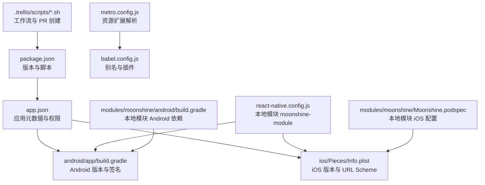
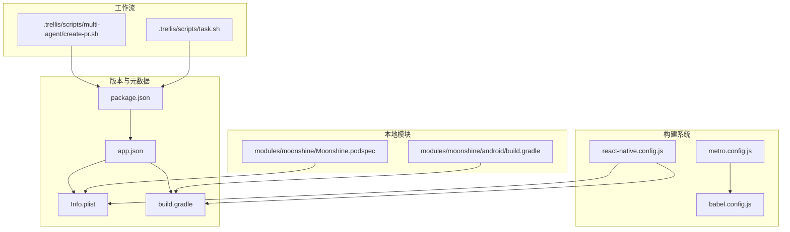
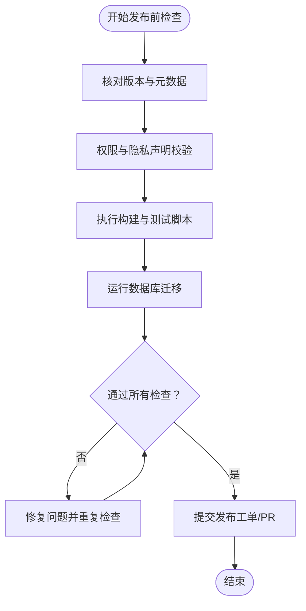
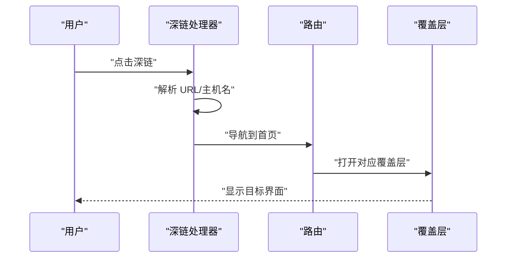
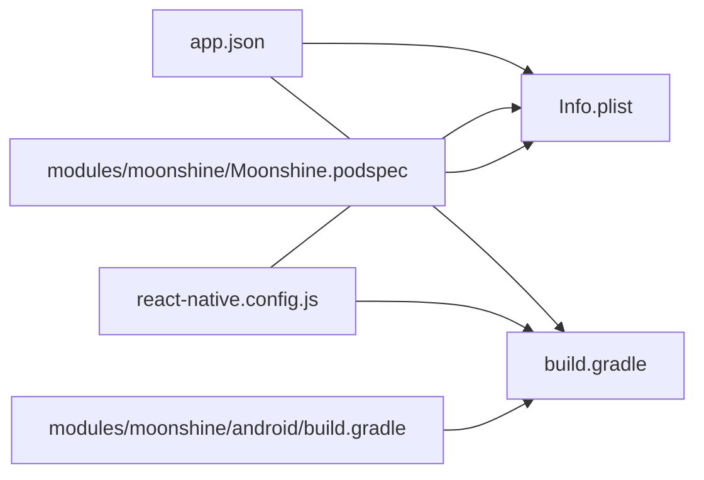

# 发布流程

<cite>
**本文引用的文件**
- [package.json](file://package.json)
- [app.json](file://app.json)
- [react-native.config.js](file://react-native.config.js)
- [metro.config.js](file://metro.config.js)
- [babel.config.js](file://babel.config.js)
- [android/app/build.gradle](file://android/app/build.gradle)
- [ios/Pieces/Info.plist](file://ios/Pieces/Info.plist)
- [modules/moonshine/android/build.gradle](file://modules/moonshine/android/build.gradle)
- [modules/moonshine/Moonshine.podspec](file://modules/moonshine/Moonshine.podspec)
- [.trellis/scripts/multi-agent/create-pr.sh](file://.trellis/scripts/multi-agent/create-pr.sh)
- [.trellis/scripts/task.sh](file://.trellis/scripts/task.sh)
- [store/useRecordingStore.ts](file://store/useRecordingStore.ts)
- [hooks/useDeepLinkHandler.ts](file://hooks/useDeepLinkHandler.ts)
- [app/(tabs)/settings.tsx](file://app/(tabs)/settings.tsx)
- [drizzle/meta/_journal.json](file://drizzle/meta/_journal.json)
</cite>

## 目录
1. [简介](#简介)
2. [项目结构](#项目结构)
3. [核心组件](#核心组件)
4. [架构总览](#架构总览)
5. [详细组件分析](#详细组件分析)
6. [依赖关系分析](#依赖关系分析)
7. [性能考量](#性能考量)
8. [故障排查指南](#故障排查指南)
9. [结论](#结论)
10. [附录](#附录)

## 简介
本文件面向 VoiceNote（应用名：Pieces）的应用发布流程，覆盖版本管理与语义化版本控制、应用商店发布流程（Apple App Store 与 Google Play Store）、内部测试与公开发布差异、发布前质量检查清单与自动化验证、热更新（OTA）配置与使用、发布回滚与紧急修复流程、发布渠道管理与 A/B 测试配置，以及发布后的监控与用户反馈收集机制。文档基于仓库中的实际配置与代码进行梳理，并提供可视化图示帮助理解。

## 项目结构
该工程采用 Expo + React Native 技术栈，结合本地模块（Moonshine）与数据库迁移工具 Drizzle。发布相关的关键配置集中在以下位置：
- 版本与元数据：package.json、app.json、Info.plist、Android 构建脚本
- 构建与打包：Metro 配置、Babel 别名、React Native 配置
- 平台特定配置：iOS Info.plist、Android build.gradle
- 本地模块集成：react-native.config.js、Moonshine 模块 Gradle 与 Podspec
- 工作流与 PR 创建：.trellis 脚本

图表来源
- [package.json:1-83](file://package.json#L1-L83)
- [app.json:1-86](file://app.json#L1-L86)
- [android/app/build.gradle:1-183](file://android/app/build.gradle#L1-L183)
- [ios/Pieces/Info.plist:1-89](file://ios/Pieces/Info.plist#L1-L89)
- [metro.config.js:1-8](file://metro.config.js#L1-L8)
- [babel.config.js:1-27](file://babel.config.js#L1-L27)
- [react-native.config.js:1-31](file://react-native.config.js#L1-L31)
- [modules/moonshine/android/build.gradle:1-37](file://modules/moonshine/android/build.gradle#L1-L37)
- [modules/moonshine/Moonshine.podspec:1-32](file://modules/moonshine/Moonshine.podspec#L1-L32)

章节来源
- [package.json:1-83](file://package.json#L1-L83)
- [app.json:1-86](file://app.json#L1-L86)
- [android/app/build.gradle:1-183](file://android/app/build.gradle#L1-L183)
- [ios/Pieces/Info.plist:1-89](file://ios/Pieces/Info.plist#L1-L89)
- [metro.config.js:1-8](file://metro.config.js#L1-L8)
- [babel.config.js:1-27](file://babel.config.js#L1-L27)
- [react-native.config.js:1-31](file://react-native.config.js#L1-L31)
- [modules/moonshine/android/build.gradle:1-37](file://modules/moonshine/android/build.gradle#L1-L37)
- [modules/moonshine/Moonshine.podspec:1-32](file://modules/moonshine/Moonshine.podspec#L1-L32)

## 核心组件
- 版本与元数据
  - npm 包版本与脚本：用于统一管理版本号与构建脚本入口。
  - Expo 应用元数据：定义应用名称、slug、版本、权限、插件等。
  - iOS/Android 平台版本：分别在 Info.plist 与 build.gradle 中维护。
- 构建与打包
  - Metro 配置：扩展资源后缀以支持模型文件。
  - Babel 配置：模块别名与 Reanimated 插件。
  - React Native 配置：本地模块 moonshine-module 的平台映射。
- 本地模块集成
  - Android：通过 Gradle 配置本地模块依赖。
  - iOS：通过 Podspec 与主工程集成，Swift Package Manager 引入 MoonshineVoice SDK。
- 工作流与 PR 创建
  - Trellis 脚本：自动化创建草稿 PR，便于发布前审查与合并。

章节来源
- [package.json:1-83](file://package.json#L1-L83)
- [app.json:1-86](file://app.json#L1-L86)
- [android/app/build.gradle:1-183](file://android/app/build.gradle#L1-L183)
- [ios/Pieces/Info.plist:1-89](file://ios/Pieces/Info.plist#L1-L89)
- [metro.config.js:1-8](file://metro.config.js#L1-L8)
- [babel.config.js:1-27](file://babel.config.js#L1-L27)
- [react-native.config.js:1-31](file://react-native.config.js#L1-L31)
- [modules/moonshine/android/build.gradle:1-37](file://modules/moonshine/android/build.gradle#L1-L37)
- [modules/moonshine/Moonshine.podspec:1-32](file://modules/moonshine/Moonshine.podspec#L1-L32)
- [.trellis/scripts/multi-agent/create-pr.sh:165-212](file://.trellis/scripts/multi-agent/create-pr.sh#L165-L212)
- [.trellis/scripts/task.sh:949-987](file://.trellis/scripts/task.sh#L949-L987)

## 架构总览
下图展示发布流程中涉及的主要组件与交互路径，包括版本管理、构建打包、平台配置与工作流自动化。

图表来源
- [package.json:1-83](file://package.json#L1-L83)
- [app.json:1-86](file://app.json#L1-L86)
- [ios/Pieces/Info.plist:1-89](file://ios/Pieces/Info.plist#L1-L89)
- [android/app/build.gradle:1-183](file://android/app/build.gradle#L1-L183)
- [metro.config.js:1-8](file://metro.config.js#L1-L8)
- [babel.config.js:1-27](file://babel.config.js#L1-L27)
- [react-native.config.js:1-31](file://react-native.config.js#L1-L31)
- [modules/moonshine/android/build.gradle:1-37](file://modules/moonshine/android/build.gradle#L1-L37)
- [modules/moonshine/Moonshine.podspec:1-32](file://modules/moonshine/Moonshine.podspec#L1-L32)
- [.trellis/scripts/multi-agent/create-pr.sh:165-212](file://.trellis/scripts/multi-agent/create-pr.sh#L165-L212)
- [.trellis/scripts/task.sh:949-987](file://.trellis/scripts/task.sh#L949-L987)

## 详细组件分析

### 版本管理与语义化版本控制
- 当前版本
  - npm 包版本：见 [package.json:3](file://package.json#L3)。
  - Expo 应用版本：见 [app.json:5](file://app.json#L5)。
  - iOS 短版本字符串与 Bundle Version：见 [ios/Pieces/Info.plist:21-36](file://ios/Pieces/Info.plist#L21-L36)。
  - Android 版本名称与版本代码：见 [android/app/build.gradle:95-96](file://android/app/build.gradle#L95-L96)。
- 语义化版本建议
  - 建议遵循语义化版本规范（主.次.修订），并在发布分支上统一提升版本号。
  - 对于重大变更或破坏性更新，提升主版本；新增向后兼容功能提升次版本；修复问题提升修订版本。
- 版本一致性检查
  - 发布前需核对上述多处版本字段保持一致，避免平台侧不一致导致的审核或分发问题。

章节来源
- [package.json:1-83](file://package.json#L1-L83)
- [app.json:1-86](file://app.json#L1-L86)
- [ios/Pieces/Info.plist:1-89](file://ios/Pieces/Info.plist#L1-L89)
- [android/app/build.gradle:1-183](file://android/app/build.gradle#L1-L183)

### 应用商店发布流程（Apple App Store 与 Google Play Store）
- Apple App Store
  - 必备信息
    - Bundle Identifier：见 [app.json:18](file://app.json#L18) 与 [ios/Pieces/Info.plist:13-14](file://ios/Pieces/Info.plist#L13-L14)。
    - 系统版本要求：见 [ios/Pieces/Info.plist:37-38](file://ios/Pieces/Info.plist#L37-L38)。
    - 权限与隐私描述：见 [app.json:19-24](file://app.json#L19-L24) 与 [ios/Pieces/Info.plist:48-55](file://ios/Pieces/Info.plist#L48-L55)。
    - URL Scheme：见 [app.json:10](file://app.json#L10) 与 [ios/Pieces/Info.plist:25-33](file://ios/Pieces/Info.plist#L25-L33)。
  - 审核要点
    - 权限声明与最小化原则匹配。
    - 隐私政策与数据处理合规。
    - 应用图标、启动图、截图符合规范。
- Google Play Store
  - 必备信息
    - Package Name：见 [app.json:27](file://app.json#L27) 与 [android/app/build.gradle:92](file://android/app/build.gradle#L92)。
    - 权限列表：见 [app.json:33-41](file://app.json#L33-L41)。
    - 最低/目标 SDK 版本：见 [android/app/build.gradle:88-94](file://android/app/build.gradle#L88-L94)。
  - 审核要点
    - 权限使用场景清晰。
    - 应用内购买与广告合规。
    - 分类与关键词准确。

章节来源
- [app.json:1-86](file://app.json#L1-L86)
- [ios/Pieces/Info.plist:1-89](file://ios/Pieces/Info.plist#L1-L89)
- [android/app/build.gradle:1-183](file://android/app/build.gradle#L1-L183)

### 内部测试版本与公开发布差异
- 内部测试（TestFlight/封闭测试）
  - 使用 Debug 或专用测试构建类型，启用调试签名与资源压缩开关可按需调整。
  - 在 iOS 上可通过 TestFlight 分发；在 Android 可通过内部测试轨道或企业分发。
- 公开发布（App Store/Play 商店）
  - 使用 Release 构建类型，启用混淆、资源收缩与 ProGuard 规则。
  - 严格遵循商店审核要求与合规声明。
- 关键差异点
  - 签名与证书：发布需正式签名与证书。
  - 权限与隐私：对外版本需更严格的隐私披露。
  - 性能与体积：发布构建应优化体积与性能。

章节来源
- [android/app/build.gradle:108-123](file://android/app/build.gradle#L108-L123)
- [ios/Pieces/Info.plist:1-89](file://ios/Pieces/Info.plist#L1-L89)

### 发布前质量检查清单与自动化验证
- 版本与元数据核对
  - 统一核对 package.json、app.json、Info.plist、build.gradle 中的版本号与标识符。
- 权限与隐私
  - 确认权限声明与实际使用一致，隐私描述完整。
- 构建与打包
  - 运行 lint、类型检查与单元测试，确保无告警与失败。
  - 执行数据库迁移脚本，确保本地/线上模式一致。
- 自动化验证（基于现有脚本）
  - PR 创建与审查：使用 Trellis 草稿 PR 流程，便于发布前集中审查。
  - 数据库迁移：Drizzle 迁移日志可用于核对迁移状态。

章节来源
- [.trellis/scripts/multi-agent/create-pr.sh:165-212](file://.trellis/scripts/multi-agent/create-pr.sh#L165-L212)
- [.trellis/scripts/task.sh:949-987](file://.trellis/scripts/task.sh#L949-L987)
- [drizzle/meta/_journal.json:1-27](file://drizzle/meta/_journal.json#L1-L27)

### 热更新（Over-The-Air Updates）配置与使用
- 配置现状
  - 项目使用 Expo Router 与 Expo CLI 导出嵌入式包，Android 侧通过 React Native Gradle Plugin 的 export:embed 命令进行打包。
  - 未发现显式的 Expo Updates 或 Expo Config Plugins 配置片段。
- 建议配置步骤（概念性说明）
  - 在 app.json 中启用更新相关插件与配置项。
  - 设置发布通道（如 staging、production）与基础版本约束。
  - 在 CI 中生成更新包并推送至对应通道。
- 使用流程（概念性说明）
  - 开发者在 CI 中触发 OTA 更新任务，选择通道与版本基线。
  - 用户端通过更新机制拉取最新 JS/Bundles 并应用。
  - 回滚通过发布新版本覆盖或切换到稳定通道实现。

章节来源
- [android/app/build.gradle:11-22](file://android/app/build.gradle#L11-L22)
- [app.json:50-83](file://app.json#L50-L83)

### 发布回滚策略与紧急修复流程
- 回滚策略
  - 版本回退：将 iOS/Android 版本号回退至上一个已发布版本，重新发布。
  - OTA 回滚：若使用 OTA，通过发布新版本覆盖或切换到稳定通道。
- 紧急修复流程（概念性说明）
  - 识别紧急问题 → 创建 hotfix 分支 → 修复并自测 → 草稿 PR 审查 → 合并并发布 → 监控指标。
- 工作流参考
  - 使用 Trellis 草稿 PR 流程，确保紧急修复在合并前完成审查。

章节来源
- [.trellis/scripts/multi-agent/create-pr.sh:165-212](file://.trellis/scripts/multi-agent/create-pr.sh#L165-L212)
- [.trellis/scripts/task.sh:949-987](file://.trellis/scripts/task.sh#L949-L987)

### 发布渠道管理与 A/B 测试配置
- 渠道管理（概念性说明）
  - 通过不同发布通道（如 internal、alpha、beta、production）隔离用户群体。
  - 控制更新频率与可见范围，逐步扩大覆盖面。
- A/B 测试（概念性说明）
  - 通过渠道或参数控制实验组与对照组流量分配。
  - 收集关键指标（留存、转化、崩溃率）评估效果。
- 与现有配置的关系
  - 项目当前未包含显式的渠道与 A/B 配置，可在 app.json 或 CI 中扩展。

章节来源
- [app.json:50-83](file://app.json#L50-L83)

### 发布后的监控与用户反馈收集机制
- 监控建议（概念性说明）
  - 崩溃率、启动时长、内存占用、网络请求成功率等。
  - 结合应用商店指标（评分、评论、下载量）综合评估。
- 用户反馈
  - 提供深链入口快速打开相关功能页，便于收集反馈。
  - 深链处理逻辑见深链钩子与路由重定向。

图表来源
- [hooks/useDeepLinkHandler.ts:1-41](file://hooks/useDeepLinkHandler.ts#L1-L41)
- [app/(tabs)/settings.tsx:1-21](file://app/(tabs)/settings.tsx#L1-L21)

章节来源
- [hooks/useDeepLinkHandler.ts:1-41](file://hooks/useDeepLinkHandler.ts#L1-L41)
- [app/(tabs)/settings.tsx:1-21](file://app/(tabs)/settings.tsx#L1-L21)

## 依赖关系分析
- 组件耦合
  - app.json 作为核心元数据源，同时影响 iOS/Android 平台配置与权限声明。
  - React Native 配置与本地模块集成紧密关联，确保平台侧正确加载。
- 外部依赖
  - Expo 生态（Router、SQLite、相机/音频/视频等插件）与本地 Moonshine 模块共同构成应用能力边界。
- 潜在风险
  - 版本字段分散在多处，需建立统一校验流程避免不一致。
  - 本地模块的 Android/iOS 配置需同步更新，防止编译或运行期错误。

图表来源
- [app.json:1-86](file://app.json#L1-86)
- [ios/Pieces/Info.plist:1-89](file://ios/Pieces/Info.plist#L1-89)
- [android/app/build.gradle:1-183](file://android/app/build.gradle#L1-183)
- [react-native.config.js:1-31](file://react-native.config.js#L1-31)
- [modules/moonshine/android/build.gradle:1-37](file://modules/moonshine/android/build.gradle#L1-37)
- [modules/moonshine/Moonshine.podspec:1-32](file://modules/moonshine/Moonshine.podspec#L1-32)

章节来源
- [app.json:1-86](file://app.json#L1-86)
- [ios/Pieces/Info.plist:1-89](file://ios/Pieces/Info.plist#L1-89)
- [android/app/build.gradle:1-183](file://android/app/build.gradle#L1-183)
- [react-native.config.js:1-31](file://react-native.config.js#L1-31)
- [modules/moonshine/android/build.gradle:1-37](file://modules/moonshine/android/build.gradle#L1-37)
- [modules/moonshine/Moonshine.podspec:1-32](file://modules/moonshine/Moonshine.podspec#L1-32)

## 性能考量
- 构建优化
  - Release 构建启用资源收缩与代码压缩，减小包体与提升启动性能。
  - 资源扩展解析（.ort/.bin）确保模型文件被正确打包。
- 运行时优化
  - 使用 Tamagui 与 Reanimated 提升 UI 动画与渲染性能。
  - 本地模块 Moonshine 的 SDK 版本与编译选项需与主工程一致。

章节来源
- [android/app/build.gradle:108-123](file://android/app/build.gradle#L108-L123)
- [metro.config.js:1-8](file://metro.config.js#L1-L8)
- [babel.config.js:1-27](file://babel.config.js#L1-L27)
- [modules/moonshine/android/build.gradle:1-37](file://modules/moonshine/android/build.gradle#L1-L37)

## 故障排查指南
- 版本不一致
  - 现象：商店审核失败或安装异常。
  - 排查：核对 package.json、app.json、Info.plist、build.gradle 的版本与标识符。
- 权限相关问题
  - 现象：运行时权限弹窗频繁或功能不可用。
  - 排查：确认 app.json 与平台 Info.plist 中的权限声明与实际使用一致。
- 本地模块集成问题
  - 现象：编译失败或运行时找不到模块。
  - 排查：检查 react-native.config.js 与本地模块 Gradle/Podspec 配置是否一致。
- 深链无法打开功能页
  - 现象：点击深链无响应。
  - 排查：确认 URL Scheme 配置与深链处理器逻辑，确保覆盖层打开流程正常。

章节来源
- [app.json:1-86](file://app.json#L1-86)
- [ios/Pieces/Info.plist:1-89](file://ios/Pieces/Info.plist#L1-89)
- [android/app/build.gradle:1-183](file://android/app/build.gradle#L1-183)
- [react-native.config.js:1-31](file://react-native.config.js#L1-31)
- [hooks/useDeepLinkHandler.ts:1-41](file://hooks/useDeepLinkHandler.ts#L1-41)

## 结论
本发布流程文档基于仓库现有配置与代码，明确了版本管理、应用商店审核要点、内部测试与公开发布的差异、发布前检查清单、OTA 配置建议、回滚与紧急修复流程、渠道与 A/B 测试思路，以及发布后的监控与反馈机制。建议在后续迭代中补充 OTA 与渠道配置，并完善自动化检查与发布工单流程，以进一步提升发布效率与稳定性。

## 附录
- 数据库迁移状态参考：[drizzle/meta/_journal.json:1-27](file://drizzle/meta/_journal.json#L1-L27)
- 录音状态存储（与发布无关但有助于理解应用状态管理）：[store/useRecordingStore.ts:1-51](file://store/useRecordingStore.ts#L1-L51)