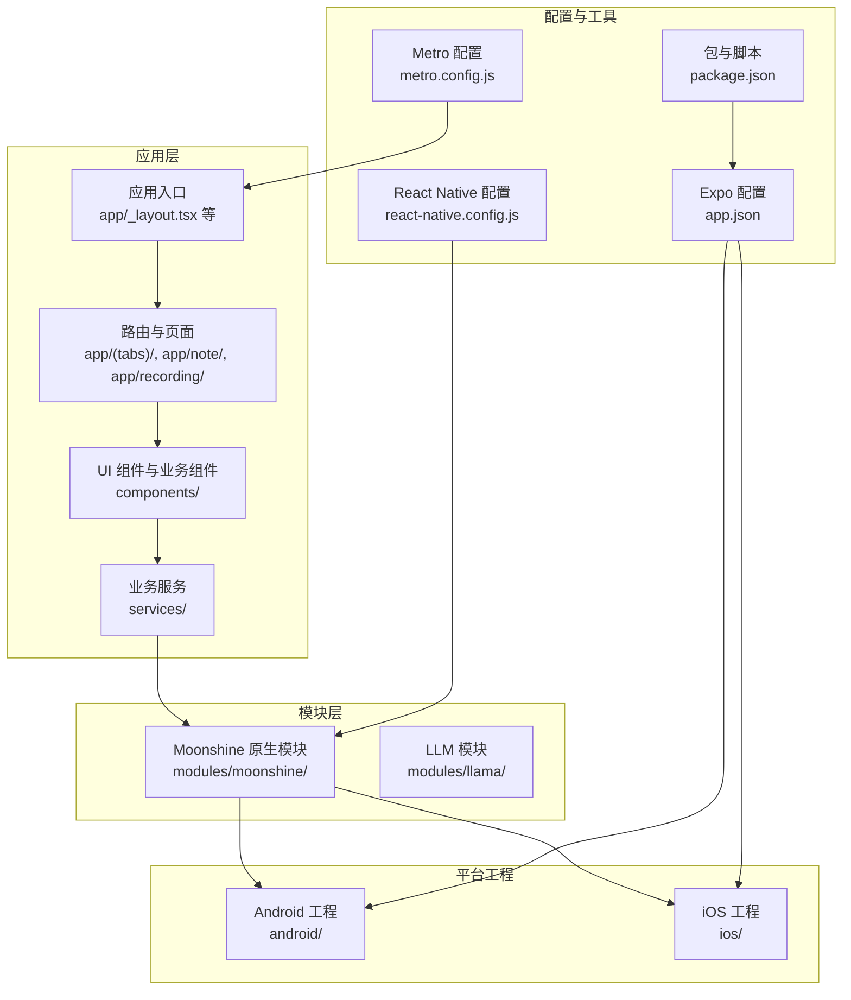
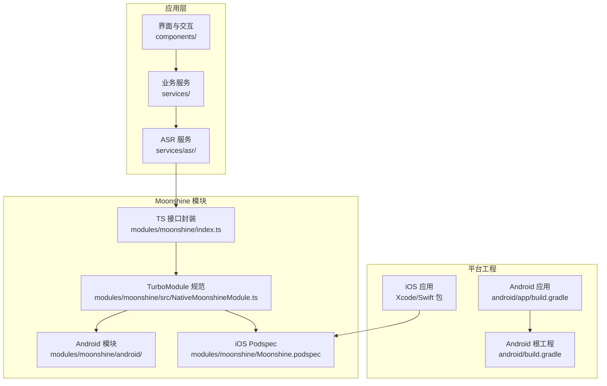
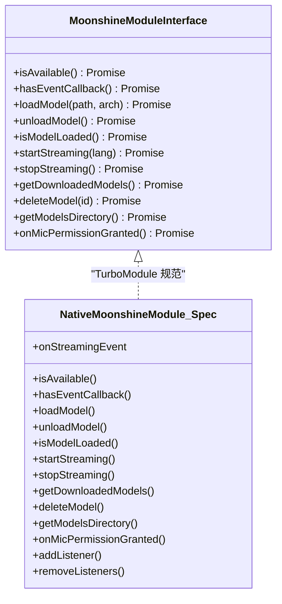
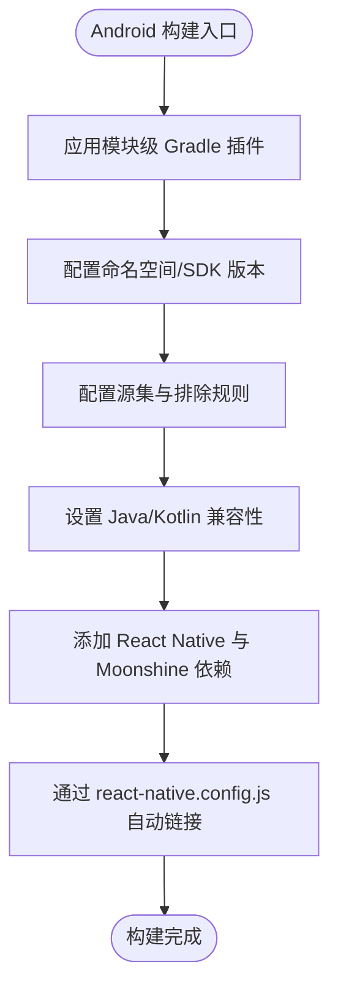
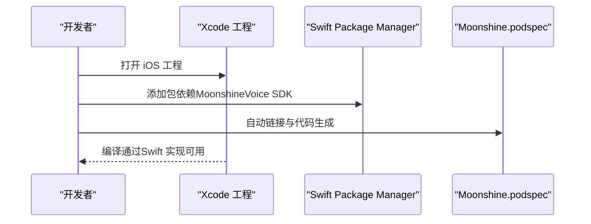
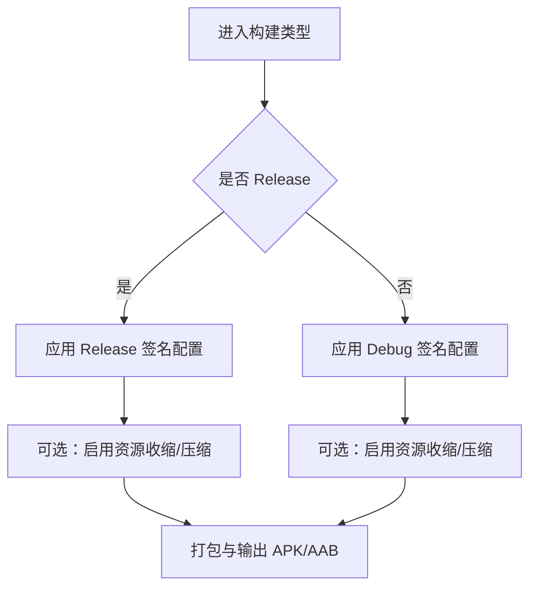
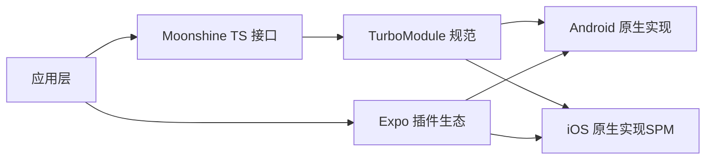

# 多平台构建

<cite>
**本文引用的文件**
- [app.json](file://app.json)
- [package.json](file://package.json)
- [react-native.config.js](file://react-native.config.js)
- [modules/moonshine/package.json](file://modules/moonshine/package.json)
- [modules/moonshine/index.ts](file://modules/moonshine/index.ts)
- [modules/moonshine/src/NativeMoonshineModule.ts](file://modules/moonshine/src/NativeMoonshineModule.ts)
- [modules/moonshine/android/build.gradle](file://modules/moonshine/android/build.gradle)
- [modules/moonshine/Moonshine.podspec](file://modules/moonshine/Moonshine.podspec)
- [android/app/build.gradle](file://android/app/build.gradle)
- [android/build.gradle](file://android/build.gradle)
- [metro.config.js](file://metro.config.js)
</cite>

## 目录
1. [简介](#简介)
2. [项目结构](#项目结构)
3. [核心组件](#核心组件)
4. [架构总览](#架构总览)
5. [详细组件分析](#详细组件分析)
6. [依赖关系分析](#依赖关系分析)
7. [性能考量](#性能考量)
8. [故障排查指南](#故障排查指南)
9. [结论](#结论)
10. [附录](#附录)

## 简介
本文件面向 VoiceNote 的多平台构建，系统性说明 iOS 与 Android 平台的构建要求、平台特定配置、原生模块 Moonshine 的集成与构建流程、证书与签名、发布准备、权限与原生依赖管理、构建环境变量以及常见兼容性问题与解决方案。内容基于仓库中的实际配置文件进行分析与总结。

## 项目结构
VoiceNote 使用 Expo 进行跨平台开发，并通过本地原生模块 Moonshine 提供本地语音识别能力。项目采用分层组织：应用层（app/）、组件层（components/）、服务层（services/）、数据库（db/、drizzle/）、国际化（i18n/）、模块（modules/），以及平台原生工程（android/、ios/）。

图表来源
- [app.json:1-86](file://app.json#L1-L86)
- [package.json:1-83](file://package.json#L1-L83)
- [react-native.config.js:1-31](file://react-native.config.js#L1-L31)
- [modules/moonshine/index.ts:1-94](file://modules/moonshine/index.ts#L1-L94)
- [android/app/build.gradle:1-183](file://android/app/build.gradle#L1-L183)

章节来源
- [app.json:1-86](file://app.json#L1-L86)
- [package.json:1-83](file://package.json#L1-L83)
- [react-native.config.js:1-31](file://react-native.config.js#L1-L31)
- [metro.config.js:1-8](file://metro.config.js#L1-L8)

## 核心组件
- Expo 应用配置（app.json）
  - 平台特定字段：iOS 与 Android 的 Bundle Identifier、权限描述、权限列表、插件等。
  - 插件：expo-router、llama.rn、expo-sqlite、expo-camera、expo-audio、expo-video、expo-image-picker、expo-document-picker、expo-media-library 等。
  - 资源与打包：图标、启动图、资源模式、Web 打包器等。
- React Native 配置（react-native.config.js）
  - 本地模块 moonshine-module 的路径与平台映射，Android 通过 Package 注册，iOS 通过 Swift Package Manager 在主工程中接入。
- Moonshine 原生模块
  - TypeScript 接口与事件订阅封装，支持新架构（TurboModule）与旧架构（NativeModules）双栈回退。
  - iOS 通过 Swift 实现并通过 SPM 引入 MoonshineVoice SDK；Android 通过 Gradle 引入 moonshine-voice 依赖。
- Android 工程配置
  - React Native Gradle Plugin 配置、Hermes/JSC 切换、签名配置、打包选项、资源处理与依赖仓库。
- Metro 配置
  - 默认 Expo 配置扩展，新增模型文件后缀以支持本地 ASR 模型加载。

章节来源
- [app.json:1-86](file://app.json#L1-L86)
- [react-native.config.js:1-31](file://react-native.config.js#L1-L31)
- [modules/moonshine/index.ts:1-94](file://modules/moonshine/index.ts#L1-L94)
- [modules/moonshine/src/NativeMoonshineModule.ts:1-34](file://modules/moonshine/src/NativeMoonshineModule.ts#L1-L34)
- [modules/moonshine/android/build.gradle:1-37](file://modules/moonshine/android/build.gradle#L1-L37)
- [modules/moonshine/Moonshine.podspec:1-32](file://modules/moonshine/Moonshine.podspec#L1-L32)
- [android/app/build.gradle:1-183](file://android/app/build.gradle#L1-L183)
- [metro.config.js:1-8](file://metro.config.js#L1-L8)

## 架构总览
下图展示从应用到原生模块的调用链路，以及平台差异点（权限、签名、打包、SDK 引入）。

图表来源
- [modules/moonshine/index.ts:1-94](file://modules/moonshine/index.ts#L1-L94)
- [modules/moonshine/src/NativeMoonshineModule.ts:1-34](file://modules/moonshine/src/NativeMoonshineModule.ts#L1-L34)
- [modules/moonshine/android/build.gradle:1-37](file://modules/moonshine/android/build.gradle#L1-L37)
- [modules/moonshine/Moonshine.podspec:1-32](file://modules/moonshine/Moonshine.podspec#L1-L32)
- [android/app/build.gradle:1-183](file://android/app/build.gradle#L1-L183)
- [android/build.gradle:1-27](file://android/build.gradle#L1-L27)

## 详细组件分析

### Expo 应用配置（app.json）
- 平台特定设置
  - iOS：Bundle Identifier、Info.plist 权限描述（相机、麦克风、相册读写）、平板支持。
  - Android：Package 名称、自适应图标、边缘到边缘、权限数组（相机、录音、存储、媒体读取）。
- 插件生态
  - 路由、SQLite、相机、音频、视频、图片选择、文档选择、媒体库等插件均已声明并传入权限文案。
- 资源与打包
  - 资源匹配模式、Web 打包器、新架构开关等。

章节来源
- [app.json:16-42](file://app.json#L16-L42)
- [app.json:50-83](file://app.json#L50-L83)

### React Native 配置（react-native.config.js）
- 本地模块 moonshine-module 的根目录与平台映射：
  - Android：指定源码目录、包导入路径与实例化参数，用于自动链接与代码生成。
  - iOS：通过 Swift Package Manager 在主工程中引入 Swift 实现，避免重复打包。
- 作用：确保 Metro 与 Gradle/Xcode 能正确解析本地模块。

章节来源
- [react-native.config.js:12-28](file://react-native.config.js#L12-L28)

### Moonshine 原生模块（TS 封装与规范）
- 双栈兼容
  - 优先使用 TurboModule；若不可用则回退至 NativeModules，保证新旧架构兼容。
  - 事件订阅使用 NativeEventEmitter 与 DeviceEventEmitter 双通道，配合去重逻辑。
- 接口方法
  - 模型可用性检查、模型加载/卸载、流式识别启停、已下载模型查询、删除模型、模型目录查询、麦克风权限回调等。
- 事件类型
  - 流式事件包含行开始、文本变更、行完成等状态，携带是否最终结果标记。

图表来源
- [modules/moonshine/index.ts:17-40](file://modules/moonshine/index.ts#L17-L40)
- [modules/moonshine/src/NativeMoonshineModule.ts:16-34](file://modules/moonshine/src/NativeMoonshineModule.ts#L16-L34)

章节来源
- [modules/moonshine/index.ts:1-94](file://modules/moonshine/index.ts#L1-L94)
- [modules/moonshine/src/NativeMoonshineModule.ts:1-34](file://modules/moonshine/src/NativeMoonshineModule.ts#L1-L34)

### Moonshine 原生模块（Android）
- 构建脚本
  - 模块级 build.gradle：命名空间、编译与目标 SDK、Java/Kotlin 版本、源集配置、依赖（React Native、Moonshine SDK、协程）。
- 依赖仓库
  - 根工程 maven 仓库包含 JitPack 与 Sonatype（Moonshine AI SDK）。
- 集成方式
  - 通过 react-native.config.js 指定 Android 平台的包注册参数，实现自动链接与代码生成。

图表来源
- [modules/moonshine/android/build.gradle:1-37](file://modules/moonshine/android/build.gradle#L1-L37)
- [android/build.gradle:19-22](file://android/build.gradle#L19-L22)
- [react-native.config.js:14-21](file://react-native.config.js#L14-L21)

章节来源
- [modules/moonshine/android/build.gradle:1-37](file://modules/moonshine/android/build.gradle#L1-L37)
- [android/build.gradle:19-22](file://android/build.gradle#L19-L22)
- [react-native.config.js:12-28](file://react-native.config.js#L12-L28)

### Moonshine 原生模块（iOS）
- Podspec 作用
  - 仅用于代码生成与自动链接目的，实际 Swift 实现在主工程中。
- SDK 引入
  - 通过 Swift Package Manager 添加 MoonshineVoice SDK（版本要求见注释）。
- 平台版本
  - 最低 iOS 版本声明为 15.1。

图表来源
- [modules/moonshine/Moonshine.podspec:15-23](file://modules/moonshine/Moonshine.podspec#L15-L23)

章节来源
- [modules/moonshine/Moonshine.podspec:1-32](file://modules/moonshine/Moonshine.podspec#L1-L32)

### Android 应用构建（签名与打包）
- 签名配置
  - Debug 签名：调试默认签名配置（storeFile、storePassword、keyAlias、keyPassword）。
  - Release 签名：当前使用调试签名，生产需替换为自有密钥库。
- 打包与压缩
  - 支持 R8 压缩开关、资源收缩、PNG 压缩开关、ProGuard 规则。
- 资源与打包选项
  - 包含 Expo CLI 的打包命令与参数，autolinkLibrariesWithApp 自动链接第三方库。
- 依赖与运行时
  - 根据 hermesEnabled 动态选择 Hermes 或 JSC；支持 GIF/WebP 开关。

图表来源
- [android/app/build.gradle:100-122](file://android/app/build.gradle#L100-L122)
- [android/app/build.gradle:177-181](file://android/app/build.gradle#L177-L181)

章节来源
- [android/app/build.gradle:100-122](file://android/app/build.gradle#L100-L122)
- [android/app/build.gradle:177-181](file://android/app/build.gradle#L177-L181)

### Metro 配置与资源扩展
- 默认使用 Expo Metro 配置，新增 .ort 与 .bin 后缀以支持 ONNX 模型文件。
- 影响：本地模型加载与缓存策略需与该扩展保持一致。

章节来源
- [metro.config.js:5](file://metro.config.js#L5)

## 依赖关系分析
- 应用层对 Moonshine 的依赖通过 TS 接口与事件订阅体现，Moonshine 再通过 TurboModule 访问原生实现。
- 平台差异点：
  - iOS：通过 Swift Package Manager 引入 MoonshineVoice SDK，主工程负责实现。
  - Android：模块级 Gradle 引入 moonshine-voice 依赖，配合 react-native.config.js 完成自动链接。
- Expo 插件生态：相机、音频、视频、图片选择、文档与媒体库等插件统一在 app.json 中声明，构建时由 Expo CLI 与 Gradle/Xcode 自动处理。

图表来源
- [modules/moonshine/index.ts:1-94](file://modules/moonshine/index.ts#L1-L94)
- [modules/moonshine/src/NativeMoonshineModule.ts:1-34](file://modules/moonshine/src/NativeMoonshineModule.ts#L1-L34)
- [modules/moonshine/android/build.gradle:32-36](file://modules/moonshine/android/build.gradle#L32-L36)
- [modules/moonshine/Moonshine.podspec:21-23](file://modules/moonshine/Moonshine.podspec#L21-L23)
- [app.json:50-83](file://app.json#L50-L83)

章节来源
- [app.json:50-83](file://app.json#L50-L83)
- [modules/moonshine/index.ts:1-94](file://modules/moonshine/index.ts#L1-L94)
- [modules/moonshine/src/NativeMoonshineModule.ts:1-34](file://modules/moonshine/src/NativeMoonshineModule.ts#L1-L34)
- [modules/moonshine/android/build.gradle:32-36](file://modules/moonshine/android/build.gradle#L32-L36)
- [modules/moonshine/Moonshine.podspec:21-23](file://modules/moonshine/Moonshine.podspec#L21-L23)

## 性能考量
- Android
  - R8 压缩与资源收缩：通过构建属性控制，建议在 Release 启用以减小体积。
  - PNG 压缩：可按需开启，平衡体积与质量。
  - Hermes：在 hermesEnabled=true 时启用，有助于 JS 执行性能与内存占用。
- iOS
  - 通过 SPM 引入 MoonshineVoice SDK，建议在 Xcode 中启用增量构建与并行编译。
- 资源与模型
  - Metro 新增模型文件后缀，确保模型缓存命中率与加载速度。

章节来源
- [android/app/build.gradle:69](file://android/app/build.gradle#L69)
- [android/app/build.gradle:116-121](file://android/app/build.gradle#L116-L121)
- [android/app/build.gradle:177-181](file://android/app/build.gradle#L177-L181)
- [metro.config.js:5](file://metro.config.js#L5)

## 故障排查指南
- Moonshine 无法加载或事件不触发
  - 检查 TS 封装是否正确选择 TurboModule 或回退到 NativeModules。
  - 确认事件订阅使用了 NativeEventEmitter 与 DeviceEventEmitter 双通道。
  - 参考接口定义核对方法调用顺序与参数。
- Android 构建失败（依赖解析）
  - 确认根工程 maven 仓库包含 JitPack 与 Sonatype（Moonshine AI SDK）。
  - 检查模块级 build.gradle 的依赖版本与命名空间。
- iOS 构建失败（SPM 依赖）
  - 确保已在 Xcode 中通过 Swift Package Manager 添加 MoonshineVoice SDK。
  - 检查最低 iOS 版本与主工程目标设置。
- 权限相关问题
  - iOS：确认 Info.plist 权限描述与 app.json 中的权限文案一致。
  - Android：确认权限数组与运行时申请流程。
- 签名与发布
  - Release 必须替换为自有密钥库，避免调试签名导致发布失败。
- 资源与模型加载
  - 确保 Metro 配置中包含模型文件后缀，避免加载失败。

章节来源
- [modules/moonshine/index.ts:31-46](file://modules/moonshine/index.ts#L31-L46)
- [modules/moonshine/src/NativeMoonshineModule.ts:16-34](file://modules/moonshine/src/NativeMoonshineModule.ts#L16-L34)
- [android/build.gradle:19-22](file://android/build.gradle#L19-L22)
- [modules/moonshine/android/build.gradle:32-36](file://modules/moonshine/android/build.gradle#L32-L36)
- [modules/moonshine/Moonshine.podspec:21-23](file://modules/moonshine/Moonshine.podspec#L21-L23)
- [app.json:16-42](file://app.json#L16-L42)
- [android/app/build.gradle:112-116](file://android/app/build.gradle#L112-L116)
- [metro.config.js:5](file://metro.config.js#L5)

## 结论
VoiceNote 的多平台构建围绕 Expo 配置与本地原生模块 Moonshine 展开。通过 app.json 的平台特定设置与插件生态，结合 react-native.config.js 的本地模块映射，Moonshine 在 iOS 与 Android 上分别通过 SPM 与 Gradle 依赖实现。Android 工程提供了完善的签名、打包与压缩配置，Metro 配置扩展支持本地模型加载。遵循本文档的权限、签名、依赖与环境变量设置，可有效规避常见兼容性问题并提升构建效率。

## 附录
- 关键配置清单
  - 平台标识与权限：app.json 的 iOS/Android 字段。
  - 插件与权限文案：app.json 的 plugins 数组。
  - 本地模块映射：react-native.config.js 的 dependencies。
  - Android 依赖仓库与签名：android/build.gradle 与 android/app/build.gradle。
  - Metro 资源扩展：metro.config.js。
  - Moonshine 规范与实现：modules/moonshine/src/NativeMoonshineModule.ts 与 modules/moonshine/index.ts。
  - iOS SPM 依赖：modules/moonshine/Moonshine.podspec 注释说明。