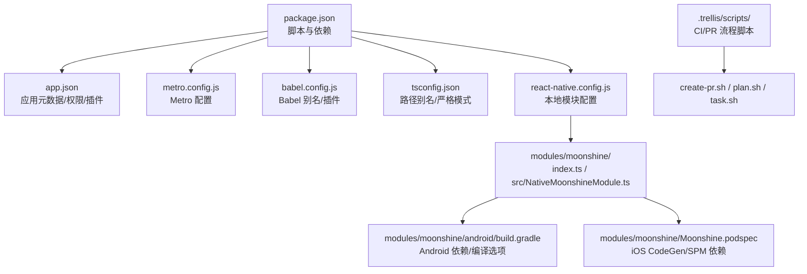
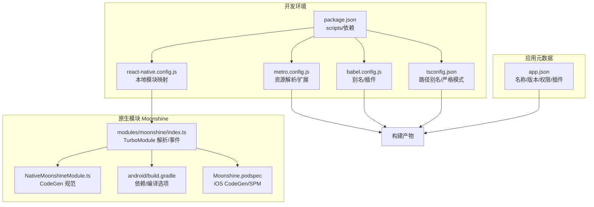
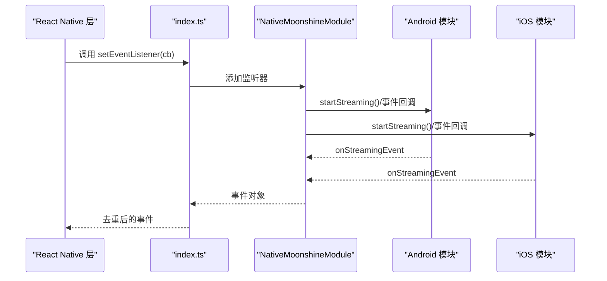
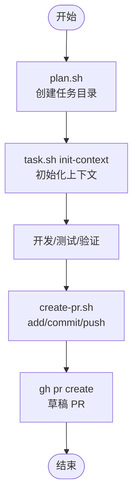
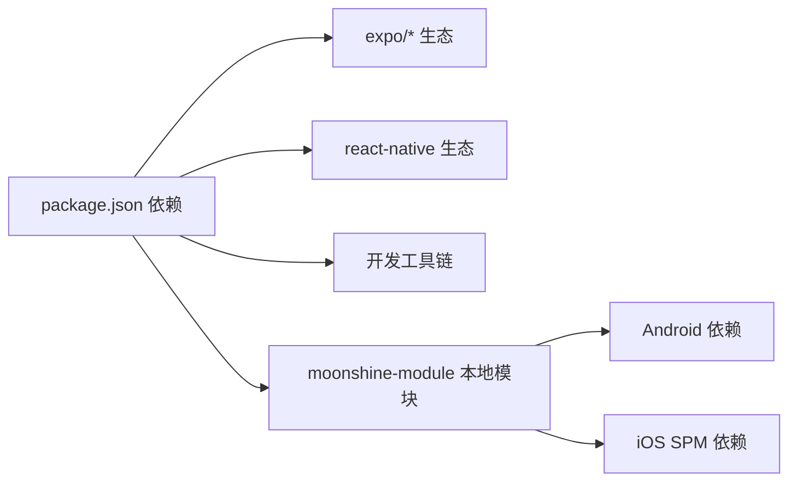

# 构建与部署

<cite>
**本文引用的文件**
- [package.json](file://package.json)
- [app.json](file://app.json)
- [metro.config.js](file://metro.config.js)
- [babel.config.js](file://babel.config.js)
- [react-native.config.js](file://react-native.config.js)
- [tsconfig.json](file://tsconfig.json)
- [modules/moonshine/package.json](file://modules/moonshine/package.json)
- [modules/moonshine/index.ts](file://modules/moonshine/index.ts)
- [modules/moonshine/src/NativeMoonshineModule.ts](file://modules/moonshine/src/NativeMoonshineModule.ts)
- [modules/moonshine/android/build.gradle](file://modules/moonshine/android/build.gradle)
- [modules/moonshine/Moonshine.podspec](file://modules/moonshine/Moonshine.podspec)
- [.trellis/worktree.yaml](file://.trellis/worktree.yaml)
- [.trellis/scripts/multi-agent/create-pr.sh](file://.trellis/scripts/multi-agent/create-pr.sh)
- [.trellis/scripts/multi-agent/plan.sh](file://.trellis/scripts/multi-agent/plan.sh)
- [.trellis/scripts/task.sh](file://.trellis/scripts/task.sh)
- [.trellis/scripts/common/git-context.sh](file://.trellis/scripts/common/git-context.sh)
</cite>

## 目录
1. [简介](#简介)
2. [项目结构](#项目结构)
3. [核心组件](#核心组件)
4. [架构总览](#架构总览)
5. [详细组件分析](#详细组件分析)
6. [依赖分析](#依赖分析)
7. [性能考虑](#性能考虑)
8. [故障排除指南](#故障排除指南)
9. [结论](#结论)
10. [附录](#附录)

## 简介
本文件面向 VoiceNote 应用的构建与部署，围绕基于 Expo 的开发与生产构建流程展开，系统性说明以下主题：
- 开发构建与生产构建的差异与优化策略
- 应用签名、证书与发布准备流程
- 多平台构建（iOS、Android）的特殊要求与注意事项
- 版本管理、发布渠道与热更新策略
- CI/CD 流水线配置示例与自动化部署方法
- 应用商店发布流程与审核要点
- 构建优化、包大小控制与性能监控
- 运维部署监控与故障排除指引

VoiceNote 使用 Expo SDK 与 React Native 技术栈，结合本地模块 Moonshine 实现离线语音识别能力，并通过 Metro、Babel、TypeScript 等工具链完成打包与类型检查。

## 项目结构
VoiceNote 的构建与部署相关配置主要集中在以下文件中：
- 应用元数据与平台配置：app.json
- 构建工具链：metro.config.js、babel.config.js、tsconfig.json
- 原生模块集成：react-native.config.js、modules/moonshine/*
- 脚本与流水线：.trellis/scripts/*



图表来源
- [package.json:1-83](file://package.json#L1-L83)
- [app.json:1-86](file://app.json#L1-L86)
- [metro.config.js:1-8](file://metro.config.js#L1-L8)
- [babel.config.js:1-27](file://babel.config.js#L1-L27)
- [tsconfig.json:1-63](file://tsconfig.json#L1-L63)
- [react-native.config.js:1-31](file://react-native.config.js#L1-L31)
- [modules/moonshine/index.ts:1-94](file://modules/moonshine/index.ts#L1-L94)
- [modules/moonshine/src/NativeMoonshineModule.ts:1-34](file://modules/moonshine/src/NativeMoonshineModule.ts#L1-L34)
- [modules/moonshine/android/build.gradle:1-37](file://modules/moonshine/android/build.gradle#L1-L37)
- [modules/moonshine/Moonshine.podspec:1-32](file://modules/moonshine/Moonshine.podspec#L1-L32)

章节来源
- [package.json:1-83](file://package.json#L1-L83)
- [app.json:1-86](file://app.json#L1-L86)
- [metro.config.js:1-8](file://metro.config.js#L1-L8)
- [babel.config.js:1-27](file://babel.config.js#L1-L27)
- [tsconfig.json:1-63](file://tsconfig.json#L1-L63)
- [react-native.config.js:1-31](file://react-native.config.js#L1-L31)

## 核心组件
- 应用元数据与平台配置：app.json 定义应用名称、版本、图标、启动图、平台权限与插件列表，是构建与发布的基础。
- Metro 配置：metro.config.js 扩展资源后缀以支持模型文件等二进制资产。
- Babel 配置：babel.config.js 提供模块别名解析与 Reanimated 插件，提升开发体验与动画性能。
- TypeScript 配置：tsconfig.json 统一路径别名与严格模式，确保类型安全。
- 原生模块 Moonshine：通过 react-native.config.js 与本地模块配置对接 Android Gradle 与 iOS CocoaPods/Swift Package Manager，实现 TurboModule 接口与事件回调。
- 脚本与工作树：.trellis 下的脚本与配置用于多智能体流水线、PR 创建与上下文初始化，支撑 CI/CD 自动化。

章节来源
- [app.json:1-86](file://app.json#L1-L86)
- [metro.config.js:1-8](file://metro.config.js#L1-L8)
- [babel.config.js:1-27](file://babel.config.js#L1-L27)
- [tsconfig.json:1-63](file://tsconfig.json#L1-L63)
- [react-native.config.js:1-31](file://react-native.config.js#L1-L31)
- [modules/moonshine/index.ts:1-94](file://modules/moonshine/index.ts#L1-L94)
- [modules/moonshine/src/NativeMoonshineModule.ts:1-34](file://modules/moonshine/src/NativeMoonshineModule.ts#L1-L34)
- [modules/moonshine/android/build.gradle:1-37](file://modules/moonshine/android/build.gradle#L1-L37)
- [modules/moonshine/Moonshine.podspec:1-32](file://modules/moonshine/Moonshine.podspec#L1-L32)
- [.trellis/worktree.yaml:1-36](file://.trellis/worktree.yaml#L1-L36)
- [.trellis/scripts/multi-agent/create-pr.sh:1-212](file://.trellis/scripts/multi-agent/create-pr.sh#L1-L212)
- [.trellis/scripts/multi-agent/plan.sh:43-149](file://.trellis/scripts/multi-agent/plan.sh#L43-L149)
- [.trellis/scripts/task.sh:258-987](file://.trellis/scripts/task.sh#L258-L987)
- [.trellis/scripts/common/git-context.sh:39-76](file://.trellis/scripts/common/git-context.sh#L39-L76)

## 架构总览
下图展示从源码到可分发产物的关键路径：Metro 打包、Babel 转换、TypeScript 类型检查、原生模块接入与平台特定构建。



图表来源
- [package.json:1-83](file://package.json#L1-L83)
- [metro.config.js:1-8](file://metro.config.js#L1-L8)
- [babel.config.js:1-27](file://babel.config.js#L1-L27)
- [tsconfig.json:1-63](file://tsconfig.json#L1-L63)
- [react-native.config.js:1-31](file://react-native.config.js#L1-L31)
- [modules/moonshine/index.ts:1-94](file://modules/moonshine/index.ts#L1-L94)
- [modules/moonshine/src/NativeMoonshineModule.ts:1-34](file://modules/moonshine/src/NativeMoonshineModule.ts#L1-L34)
- [modules/moonshine/android/build.gradle:1-37](file://modules/moonshine/android/build.gradle#L1-L37)
- [modules/moonshine/Moonshine.podspec:1-32](file://modules/moonshine/Moonshine.podspec#L1-L32)
- [app.json:1-86](file://app.json#L1-L86)

## 详细组件分析

### 应用元数据与平台配置（app.json）
- 关键点
  - 应用名称、版本、图标、启动图与深色模式偏好
  - iOS 权限描述与 Bundle Identifier
  - Android 权限清单与自适应图标
  - Web 平台配置与资源打包模式
  - 插件列表（expo-router、sqlite、相机/音频/视频/媒体库等）

- 构建影响
  - 影响应用商店元数据与权限声明
  - 决定打包时资源包含范围与平台特性开关

章节来源
- [app.json:1-86](file://app.json#L1-L86)

### Metro 配置（metro.config.js）
- 关键点
  - 基于默认配置进行扩展
  - 新增模型文件后缀以支持本地 ASR 模型加载

- 构建影响
  - 影响资源打包与运行时加载性能
  - 需与 app.json 的 assetBundlePatterns 协同

章节来源
- [metro.config.js:1-8](file://metro.config.js#L1-L8)
- [app.json:47-49](file://app.json#L47-L49)

### Babel 配置（babel.config.js）
- 关键点
  - 使用 babel-preset-expo
  - module-resolver 别名映射至 @components、@hooks、@services 等
  - 启用 react-native-reanimated/plugin

- 构建影响
  - 提升导入效率与开发体验
  - 保证动画库正确转换

章节来源
- [babel.config.js:1-27](file://babel.config.js#L1-L27)

### TypeScript 配置（tsconfig.json）
- 关键点
  - 继承 expo/tsconfig.base
  - 严格模式与 baseUrl
  - 路径别名与入口聚合导出

- 构建影响
  - 类型检查与 IDE 支持
  - 与 Babel 别名保持一致避免解析冲突

章节来源
- [tsconfig.json:1-63](file://tsconfig.json#L1-L63)

### 原生模块 Moonshine（React Native 集成）
- 结构与职责
  - index.ts：暴露 MoonshineModule 接口，兼容新旧架构，提供事件订阅与去重逻辑
  - src/NativeMoonshineModule.ts：定义 TurboModule 规范与事件类型
  - android/build.gradle：配置 Android 编译选项与依赖
  - Moonshine.podspec：iOS CodeGen 与 SPM 依赖声明

```mermaid
classDiagram
class MoonshineModuleInterface {
+isAvailable() Promise~boolean~
+hasEventCallback() Promise~boolean~
+loadModel(modelPath, arch) Promise~void~
+unloadModel() Promise~void~
+isModelLoaded() Promise~boolean~
+startStreaming(language) Promise~void~
+stopStreaming() Promise~{text}~
+getDownloadedModels() Promise~string[]~
+deleteModel(modelId) Promise~void~
+getModelsDirectory() Promise~string~
+onMicPermissionGranted() Promise~void~
}
class NativeMoonshineModule {
+onStreamingEvent
+isAvailable()
+hasEventCallback()
+loadModel()
+unloadModel()
+isModelLoaded()
+startStreaming()
+stopStreaming()
+getDownloadedModels()
+deleteModel()
+getModelsDirectory()
+onMicPermissionGranted()
+addListener()
+removeListeners()
}
class MoonshineModuleIndex {
+setEventListener(callback) () => void
+isMoonshineAvailable() boolean
}
MoonshineModuleIndex --> MoonshineModuleInterface : "封装调用"
MoonshineModuleInterface <|.. NativeMoonshineModule : "实现"
```

图表来源
- [modules/moonshine/index.ts:1-94](file://modules/moonshine/index.ts#L1-L94)
- [modules/moonshine/src/NativeMoonshineModule.ts:1-34](file://modules/moonshine/src/NativeMoonshineModule.ts#L1-L34)



图表来源
- [modules/moonshine/index.ts:48-84](file://modules/moonshine/index.ts#L48-L84)
- [modules/moonshine/src/NativeMoonshineModule.ts:16-31](file://modules/moonshine/src/NativeMoonshineModule.ts#L16-L31)

章节来源
- [modules/moonshine/index.ts:1-94](file://modules/moonshine/index.ts#L1-L94)
- [modules/moonshine/src/NativeMoonshineModule.ts:1-34](file://modules/moonshine/src/NativeMoonshineModule.ts#L1-L34)
- [modules/moonshine/android/build.gradle:1-37](file://modules/moonshine/android/build.gradle#L1-L37)
- [modules/moonshine/Moonshine.podspec:1-32](file://modules/moonshine/Moonshine.podspec#L1-L32)

### 本地模块配置（react-native.config.js）
- 关键点
  - moonshine-module 的本地路径与平台配置
  - Android 指向源码目录与包实例
  - iOS 通过 SPM 访问 Swift 实现

- 构建影响
  - 影响 autolinking 与 CodeGen
  - 需与 app.json 中的插件保持一致

章节来源
- [react-native.config.js:1-31](file://react-native.config.js#L1-L31)
- [app.json:50-83](file://app.json#L50-L83)

### CI/CD 流水线与多智能体工作流（.trellis）
- 工作树与复制策略：worktree.yaml 定义工作树存储目录与复制文件，便于隔离环境与敏感信息管理。
- 计划与任务：plan.sh 生成任务目录，task.sh 初始化上下文与状态，create-pr.sh 完成提交、推送与草稿 PR 创建。
- Git 上下文：git-context.sh 汇总最近提交与任务状态，辅助流水线决策。



图表来源
- [.trellis/scripts/multi-agent/plan.sh:103-149](file://.trellis/scripts/multi-agent/plan.sh#L103-L149)
- [.trellis/scripts/task.sh:274-298](file://.trellis/scripts/task.sh#L274-L298)
- [.trellis/scripts/multi-agent/create-pr.sh:125-212](file://.trellis/scripts/multi-agent/create-pr.sh#L125-L212)

章节来源
- [.trellis/worktree.yaml:1-36](file://.trellis/worktree.yaml#L1-L36)
- [.trellis/scripts/multi-agent/plan.sh:43-149](file://.trellis/scripts/multi-agent/plan.sh#L43-L149)
- [.trellis/scripts/task.sh:258-987](file://.trellis/scripts/task.sh#L258-L987)
- [.trellis/scripts/multi-agent/create-pr.sh:1-212](file://.trellis/scripts/multi-agent/create-pr.sh#L1-L212)
- [.trellis/scripts/common/git-context.sh:39-76](file://.trellis/scripts/common/git-context.sh#L39-L76)

## 依赖分析
- 应用层依赖：expo、expo-router、@react-native-async-storage/async-storage、@tanstack/react-query、tamagui、llama.rn 等
- 开发工具：jest、eslint、typescript、drizzle-kit
- 原生模块：moonshine-module 通过 react-native.config.js 注入，Android 依赖在 build.gradle 中声明，iOS 通过 SPM 与 CocoaPods CodeGen



图表来源
- [package.json:20-62](file://package.json#L20-L62)
- [modules/moonshine/android/build.gradle:32-36](file://modules/moonshine/android/build.gradle#L32-L36)
- [modules/moonshine/Moonshine.podspec:21-23](file://modules/moonshine/Moonshine.podspec#L21-L23)

章节来源
- [package.json:20-62](file://package.json#L20-L62)
- [react-native.config.js:12-29](file://react-native.config.js#L12-L29)
- [modules/moonshine/android/build.gradle:1-37](file://modules/moonshine/android/build.gradle#L1-L37)
- [modules/moonshine/Moonshine.podspec:1-32](file://modules/moonshine/Moonshine.podspec#L1-L32)

## 性能考虑
- 资源与包大小
  - 在 metro.config.js 中仅添加必要资源后缀，避免过度打包
  - app.json 的 assetBundlePatterns 控制资源打包范围
- 代码与类型
  - tsconfig.json 启用严格模式，减少运行时错误
  - babel.config.js 的别名减少重复解析开销
- 动画与渲染
  - 启用 reanimated 插件，配合 Tamagui 动画组件提升流畅度
- 本地模块
  - Moonshine 采用 TurboModule，事件去重与架构适配降低主线程压力

章节来源
- [metro.config.js:5](file://metro.config.js#L5)
- [app.json:47-49](file://app.json#L47-L49)
- [tsconfig.json:4](file://tsconfig.json#L4)
- [babel.config.js:23](file://babel.config.js#L23)
- [modules/moonshine/index.ts:48-84](file://modules/moonshine/index.ts#L48-L84)

## 故障排除指南
- 构建失败（Metro/资源）
  - 检查资源后缀是否在 metro.config.js 中声明
  - 确认 app.json 的 assetBundlePatterns 是否覆盖目标资源
- 原生模块问题（Moonshine）
  - Android：确认 build.gradle 中依赖与编译选项
  - iOS：确认 SPM 依赖已添加且版本匹配，podspec 未被误用
  - 事件不触发：检查 setEventListener 的去重逻辑与监听器移除
- CI/PR 流程
  - create-pr.sh 需要 gh CLI 与仓库权限
  - 若出现草稿 PR 重复，先查询现有 PR 再决定是否跳过

章节来源
- [metro.config.js:1-8](file://metro.config.js#L1-L8)
- [app.json:47-49](file://app.json#L47-L49)
- [modules/moonshine/android/build.gradle:1-37](file://modules/moonshine/android/build.gradle#L1-L37)
- [modules/moonshine/Moonshine.podspec:15-23](file://modules/moonshine/Moonshine.podspec#L15-L23)
- [modules/moonshine/index.ts:48-84](file://modules/moonshine/index.ts#L48-L84)
- [.trellis/scripts/multi-agent/create-pr.sh:165-212](file://.trellis/scripts/multi-agent/create-pr.sh#L165-L212)

## 结论
VoiceNote 的构建与部署以 Expo 为核心，结合 Metro、Babel、TypeScript 与原生模块 Moonshine，形成跨平台的一致体验。通过 app.json 精准控制元数据与权限，借助 .trellis 脚本实现多智能体流水线与自动化 PR 创建。建议在生产构建中启用严格的资源过滤与模块化策略，持续监控包大小与启动性能，并完善应用商店发布前的审核准备与热更新预案。

## 附录

### 开发构建与生产构建差异与优化策略
- 开发构建
  - 启用调试与热重载，保留完整 SourceMap
  - 使用严格类型检查与 ESLint/Jest
- 生产构建
  - 移除冗余资源，启用压缩与 Tree Shaking
  - 固定版本号与构建号，生成签名 APK/IPA
  - 预打包静态资源，减少冷启动时间

### 应用签名、证书与发布准备
- Android
  - 生成并配置 keystore，设置签名参数
  - 在 app.json 中配置 package 与权限
- iOS
  - 配置 Apple Developer 账户与 Provisioning Profile
  - 在 app.json 中设置 bundleIdentifier 与权限
- 发布准备
  - 准备应用图标、启动图、截图与元数据
  - 生成发布渠道与版本标签

### 多平台构建注意事项
- Android
  - 最小 SDK、目标 SDK 与编译选项需与模块依赖匹配
  - 权限清单与自适应图标
- iOS
  - SPM 依赖版本与平台最低版本
  - Info.plist 权限描述与隐私标签

### 版本管理、发布渠道与热更新
- 版本管理
  - 使用 app.json 的 version 字段与构建号
- 发布渠道
  - Expo 应用可通过通道进行灰度发布
- 热更新
  - 使用 Expo Updates 管理远程 JS/CSS 更新
  - 注意资源与原生模块变更的兼容性

### CI/CD 流水线配置示例与自动化部署
- 基础步骤
  - 安装依赖（npm/yarn/pnpm）
  - 类型检查与单元测试
  - 构建与签名（Android/iOS）
  - 上传到应用商店或分发平台
- 自动化
  - 使用 .trellis 脚本完成 PR 创建与状态更新
  - 结合仓库保护规则与审查流程

### 应用商店发布流程与审核要求
- Android（Google Play）
  - 准备隐私政策、服务条款链接
  - 提交 APK/AAB 与元数据
- iOS（App Store）
  - 准备隐私清单与权限说明
  - 提交 IPA 与元数据

### 构建优化、包大小控制与性能监控
- 包大小控制
  - 仅打包必要资源与模块
  - 分离大模型与按需加载
- 性能监控
  - 启动时间与内存占用监控
  - 网络与 I/O 性能观测