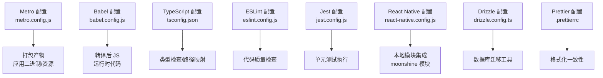
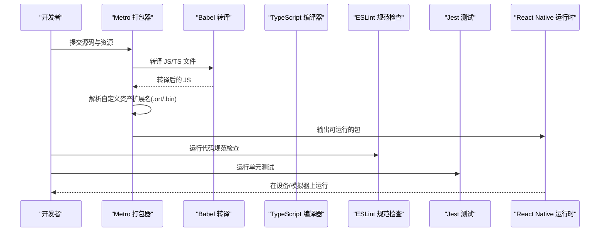
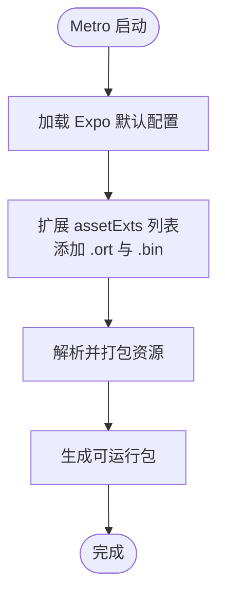
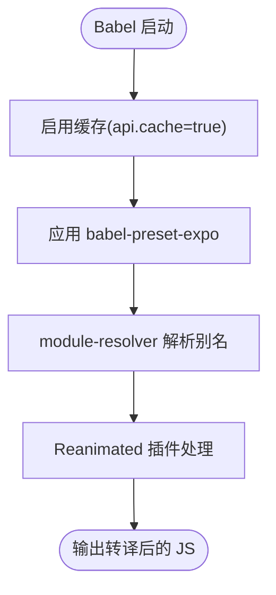
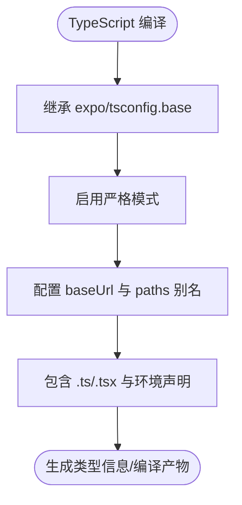
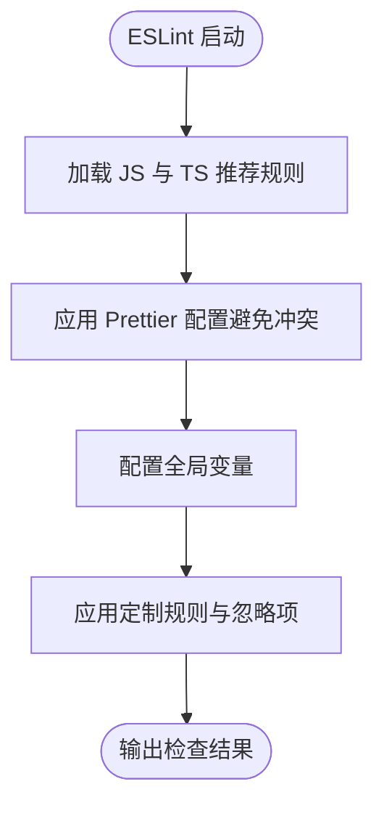
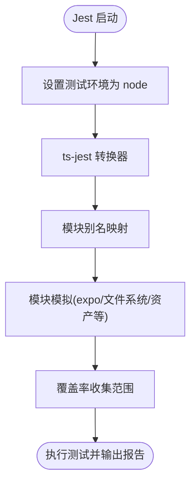
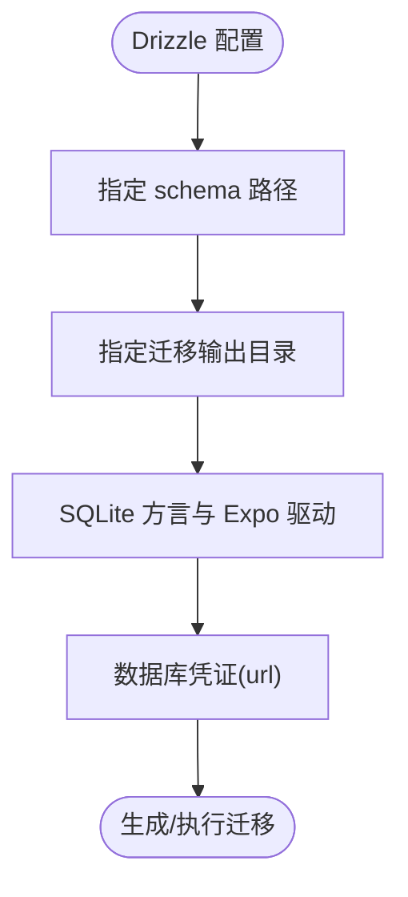
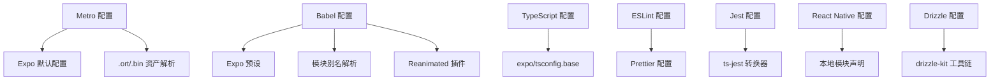

# 构建配置

<cite>
**本文档引用的文件**
- [metro.config.js](file://metro.config.js)
- [babel.config.js](file://babel.config.js)
- [tsconfig.json](file://tsconfig.json)
- [eslint.config.js](file://eslint.config.js)
- [package.json](file://package.json)
- [react-native.config.js](file://react-native.config.js)
- [drizzle.config.ts](file://drizzle.config.ts)
- [jest.config.js](file://jest.config.js)
- [.prettierrc](file://.prettierrc)
</cite>

## 目录
1. [简介](#简介)
2. [项目结构](#项目结构)
3. [核心组件](#核心组件)
4. [架构总览](#架构总览)
5. [详细组件分析](#详细组件分析)
6. [依赖关系分析](#依赖关系分析)
7. [性能考虑](#性能考虑)
8. [故障排除指南](#故障排除指南)
9. [结论](#结论)
10. [附录](#附录)

## 简介
本文件系统化梳理 VoiceNote 应用的构建配置，重点覆盖以下方面：
- Metro 打包器配置：自定义资产扩展名（.ort、.bin）的必要性与实现方式
- Babel 转译配置：别名解析与插件链路
- TypeScript 编译选项：路径映射与严格模式
- ESLint 代码规范与 Prettier 预处理器
- 开发与生产构建差异（基于现有配置的可推导差异）
- 构建性能优化建议与常见问题解决方案
- 构建缓存策略与增量编译配置

## 项目结构
VoiceNote 使用 Expo SDK 进行跨平台开发，构建相关的核心配置集中在根目录下的多个配置文件中。这些文件共同定义了打包、转译、类型检查、代码规范与测试等流程。

图表来源
- [metro.config.js:1-8](file://metro.config.js#L1-L8)
- [babel.config.js:1-27](file://babel.config.js#L1-L27)
- [tsconfig.json:1-63](file://tsconfig.json#L1-L63)
- [eslint.config.js:1-84](file://eslint.config.js#L1-L84)
- [jest.config.js:1-47](file://jest.config.js#L1-L47)
- [react-native.config.js:1-31](file://react-native.config.js#L1-L31)
- [drizzle.config.ts:1-12](file://drizzle.config.ts#L1-L12)
- [.prettierrc:1-12](file://.prettierrc#L1-L12)

章节来源
- [package.json:1-83](file://package.json#L1-L83)

## 核心组件
本节概述各构建配置文件的作用与关键点，并指出它们如何协同工作以支撑开发与生产构建。

- Metro 配置：基于 Expo 默认配置，扩展支持 .ort 与 .bin 资产，确保模型或二进制资源被正确打包。
- Babel 配置：启用 Expo 预设与模块别名解析插件，配合 Reanimated 插件提升动画性能与兼容性。
- TypeScript 配置：继承 Expo 基础配置，启用严格模式与路径映射，统一模块别名到源码目录。
- ESLint 配置：结合 TypeScript ESLint 与 Prettier，提供推荐规则与忽略项，针对测试与类型增强场景放宽部分规则。
- Jest 配置：使用 ts-jest 转换器，配置模块别名与 Expo/React Native 模块的测试模拟。
- React Native 配置：声明本地 moonshine 模块的集成方式，便于原生能力接入。
- Drizzle 配置：定义数据库迁移工具的输入输出与驱动，服务于 SQLite 数据库管理。
- Prettier 配置：统一代码风格，保证团队协作一致性。

章节来源
- [metro.config.js:1-8](file://metro.config.js#L1-L8)
- [babel.config.js:1-27](file://babel.config.js#L1-L27)
- [tsconfig.json:1-63](file://tsconfig.json#L1-L63)
- [eslint.config.js:1-84](file://eslint.config.js#L1-L84)
- [jest.config.js:1-47](file://jest.config.js#L1-L47)
- [react-native.config.js:1-31](file://react-native.config.js#L1-L31)
- [drizzle.config.ts:1-12](file://drizzle.config.ts#L1-L12)
- [.prettierrc:1-12](file://.prettierrc#L1-L12)

## 架构总览
下图展示了从源码到最终产物的关键流程，以及各配置文件在其中的角色。

图表来源
- [metro.config.js:1-8](file://metro.config.js#L1-L8)
- [babel.config.js:1-27](file://babel.config.js#L1-L27)
- [tsconfig.json:1-63](file://tsconfig.json#L1-L63)
- [eslint.config.js:1-84](file://eslint.config.js#L1-L84)
- [jest.config.js:1-47](file://jest.config.js#L1-L47)

## 详细组件分析

### Metro 打包器配置
- 基于 Expo 默认配置，确保与 Expo 生态兼容。
- 自定义资产扩展名：通过 resolver.assetExts 添加 .ort 与 .bin，使模型文件与二进制资源被正确识别与打包。
- 适用场景：语音模型（.ort）、本地推理引擎二进制（.bin）等非标准资源。

图表来源
- [metro.config.js:1-8](file://metro.config.js#L1-L8)

章节来源
- [metro.config.js:1-8](file://metro.config.js#L1-L8)

### Babel 转译配置
- 预设：使用 babel-preset-expo，适配 Expo 项目生态。
- 插件链：
  - module-resolver：将 @components、@hooks、@services 等别名解析到对应源码目录，提升导入清晰度与维护性。
  - react-native-reanimated/plugin：为 Reanimated 提供必要的转译支持。
- 缓存：启用 api.cache(true)，提升重复构建速度。

图表来源
- [babel.config.js:1-27](file://babel.config.js#L1-L27)

章节来源
- [babel.config.js:1-27](file://babel.config.js#L1-L27)

### TypeScript 编译选项
- 继承：基于 expo/tsconfig.base，保持与 Expo 版本一致的编译基线。
- 严格模式：开启 strict，提升类型安全。
- 路径映射：通过 baseUrl 与 paths 将 @/*、@components/* 等别名映射到源码目录，与 Babel 别名保持一致。
- 包含范围：对 .ts/.tsx 与特定环境声明文件生效。

图表来源
- [tsconfig.json:1-63](file://tsconfig.json#L1-L63)

章节来源
- [tsconfig.json:1-63](file://tsconfig.json#L1-L63)

### ESLint 代码规范与预处理器
- 规则集：使用 @eslint/js 推荐规则与 typescript-eslint 推荐规则，结合 eslint-config-prettier 关闭与 Prettier 冲突的 ESLint 规则。
- 语言选项：指定 ECMAScript 2022，启用 JSX；声明浏览器、Node、React Native 全局变量。
- 规则定制：
  - 忽略未使用变量的参数前缀下划线匹配（如 _error），减少噪音。
  - 对 any 类型给出警告而非报错；显式模块边界类型规则关闭。
- 忽略项：排除 node_modules、drizzle、.expo、dist、*.config.js 等目录。
- 测试与类型增强：为测试文件与类型增强文件放宽命名空间与空对象类型规则。

图表来源
- [eslint.config.js:1-84](file://eslint.config.js#L1-L84)

章节来源
- [eslint.config.js:1-84](file://eslint.config.js#L1-L84)
- [.prettierrc:1-12](file://.prettierrc#L1-L12)

### Jest 测试配置
- 测试环境：使用 node 环境，避免与 Expo 测试环境冲突。
- 转换器：ts-jest 配合 tsconfig 覆盖，启用 esModuleInterop 与允许合成默认导入。
- 模块别名：与源码别名保持一致，便于测试中直接导入。
- 模拟：对 expo、expo-file-system、expo-asset、Async Storage、React Native、i18n 等模块进行模拟。
- 覆盖率：限定收集覆盖率的服务与 Hook 范围，过滤 .d.ts 与测试文件。

图表来源
- [jest.config.js:1-47](file://jest.config.js#L1-L47)

章节来源
- [jest.config.js:1-47](file://jest.config.js#L1-L47)

### React Native 本地模块集成
- 本地 Moonshine 模块：通过 react-native.config.js 声明模块根目录与 Android/iOS 平台配置，确保原生代码参与构建。
- 作用：为语音模型或本地推理能力提供原生层支持。

图表来源
- [react-native.config.js:1-31](file://react-native.config.js#L1-L31)

章节来源
- [react-native.config.js:1-31](file://react-native.config.js#L1-L31)

### Drizzle 数据库迁移配置
- 输入输出：schema 指向 db/schema/index.ts，输出目录为 ./drizzle。
- 方言与驱动：SQLite 方言与 Expo 驱动，数据库凭证指向本地数据库文件。
- 用途：通过 drizzle-kit 生成与执行迁移，管理 SQLite 数据库结构变更。

图表来源
- [drizzle.config.ts:1-12](file://drizzle.config.ts#L1-L12)

章节来源
- [drizzle.config.ts:1-12](file://drizzle.config.ts#L1-L12)

## 依赖关系分析
- Metro 依赖 Expo 默认配置，同时扩展资产解析能力。
- Babel 依赖 Expo 预设与模块别名插件，Reanimated 插件提供动画支持。
- TypeScript 依赖 Expo 基础 tsconfig，配合路径映射提升模块导入体验。
- ESLint 与 Prettier 协同，避免格式化规则冲突。
- Jest 依赖 ts-jest 与模块别名，结合模拟模块保障测试稳定性。
- React Native 配置与本地模块声明共同决定原生能力的可用性。
- Drizzle 配置为数据库迁移提供工具链支持。

图表来源
- [metro.config.js:1-8](file://metro.config.js#L1-L8)
- [babel.config.js:1-27](file://babel.config.js#L1-L27)
- [tsconfig.json:1-63](file://tsconfig.json#L1-L63)
- [eslint.config.js:1-84](file://eslint.config.js#L1-L84)
- [jest.config.js:1-47](file://jest.config.js#L1-L47)
- [react-native.config.js:1-31](file://react-native.config.js#L1-L31)
- [drizzle.config.ts:1-12](file://drizzle.config.ts#L1-L12)

章节来源
- [package.json:1-83](file://package.json#L1-L83)

## 性能考虑
- Babel 缓存：已启用 api.cache(true)，可显著降低重复构建时间。
- TypeScript 增量编译：建议在 CI 中使用增量编译与单测隔离，减少全量类型检查成本。
- Metro 资产解析：仅新增必要扩展名，避免过度扩展导致解析开销增加。
- Jest 转换器：合理配置 ts-jest 的 tsconfig 覆盖，避免不必要的类型检查。
- ESLint：在大型仓库中可分模块运行，或在 CI 中按需检查变更文件。
- 本地模块：确保只在需要时引入原生模块，减少不必要的原生构建时间。

## 故障排除指南
- 资源无法识别（.ort/.bin）：确认已在 Metro 配置中扩展 assetExts。
- 别名导入失败：检查 Babel 与 TypeScript 的 paths/alias 是否一致。
- ESLint 与 Prettier 冲突：确保已应用 eslint-config-prettier，且规则未被手动覆盖。
- Jest 测试模拟缺失：根据 jest.config.js 的 moduleNameMapper 补充缺失的模块模拟。
- 本地模块构建异常：核对 react-native.config.js 中的平台配置与模块根目录。
- Drizzle 迁移失败：检查 drizzle.config.ts 的 schema、输出目录与数据库凭证是否正确。

章节来源
- [metro.config.js:1-8](file://metro.config.js#L1-L8)
- [babel.config.js:1-27](file://babel.config.js#L1-L27)
- [tsconfig.json:1-63](file://tsconfig.json#L1-L63)
- [eslint.config.js:1-84](file://eslint.config.js#L1-L84)
- [jest.config.js:1-47](file://jest.config.js#L1-L47)
- [react-native.config.js:1-31](file://react-native.config.js#L1-L31)
- [drizzle.config.ts:1-12](file://drizzle.config.ts#L1-L12)

## 结论
VoiceNote 的构建配置围绕 Expo 生态展开，通过 Metro、Babel、TypeScript、ESLint、Jest、React Native 与 Drizzle 的协同，实现了从源码到可运行包的完整流水线。关键优化点包括：Babel 缓存、TypeScript 路径映射、ESLint 与 Prettier 协同、Jest 模块模拟与覆盖率控制，以及 Metro 对 .ort/.bin 资产的支持。遵循本文档的配置与最佳实践，可在开发与生产环境中获得稳定、高效的构建体验。

## 附录
- 开发脚本：参考 package.json 中的 scripts 字段，涵盖启动、测试、类型检查、数据库迁移等常用命令。
- 代码风格：通过 .prettierrc 统一格式化规则，确保团队协作一致性。

章节来源
- [package.json:1-83](file://package.json#L1-L83)
- [.prettierrc:1-12](file://.prettierrc#L1-L12)