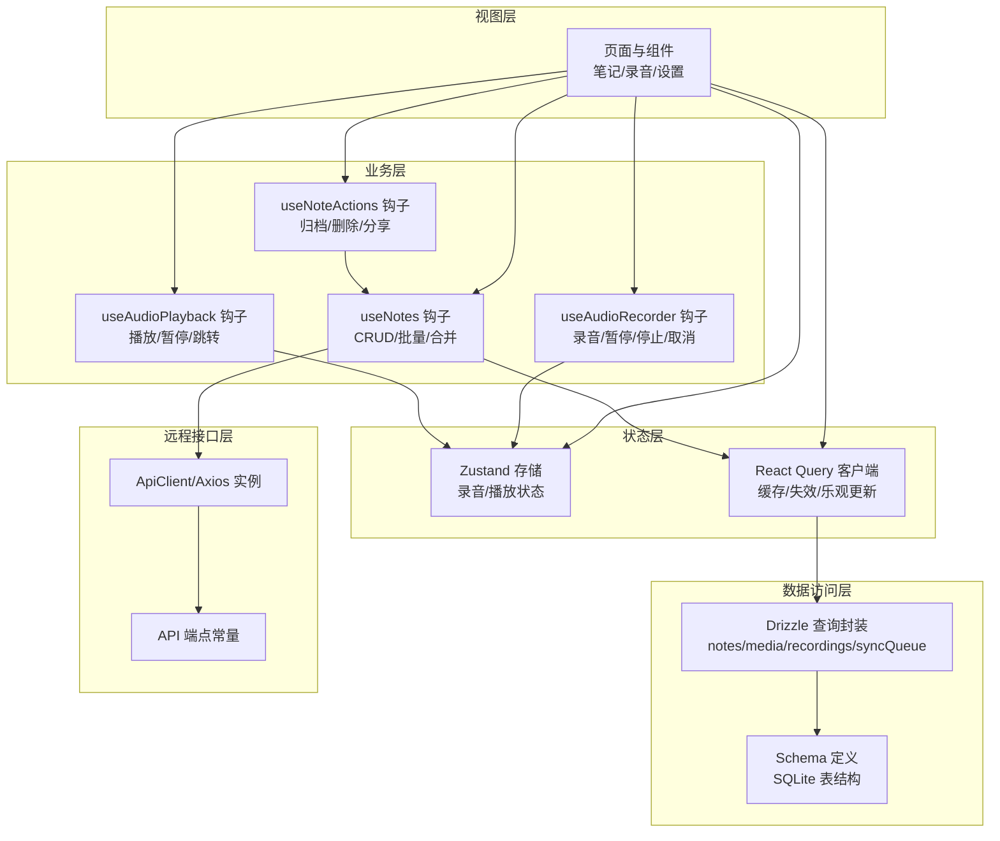
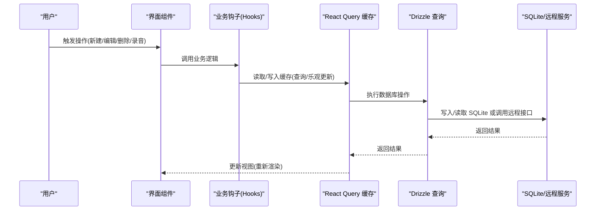
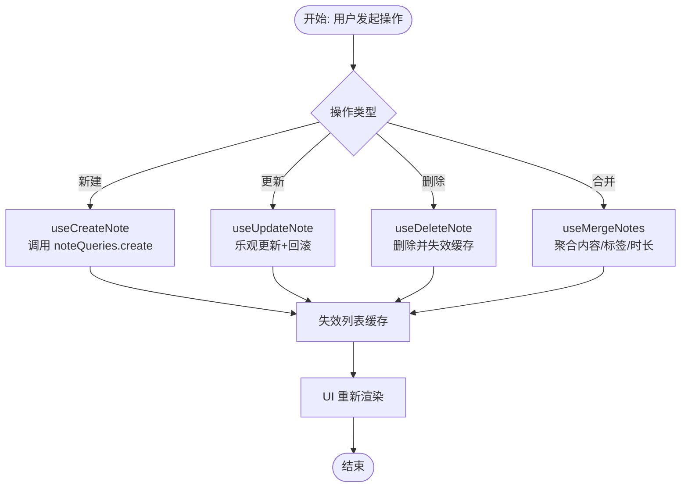
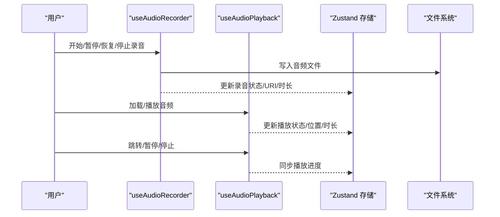
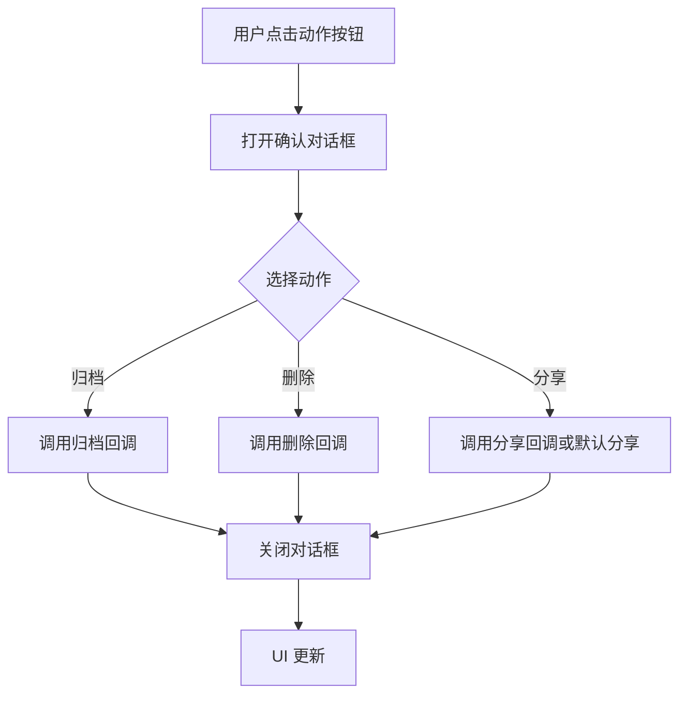
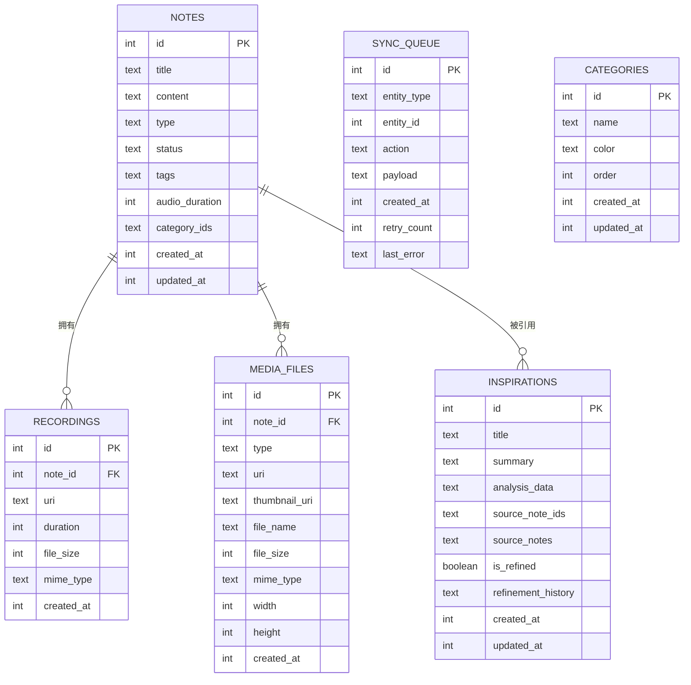
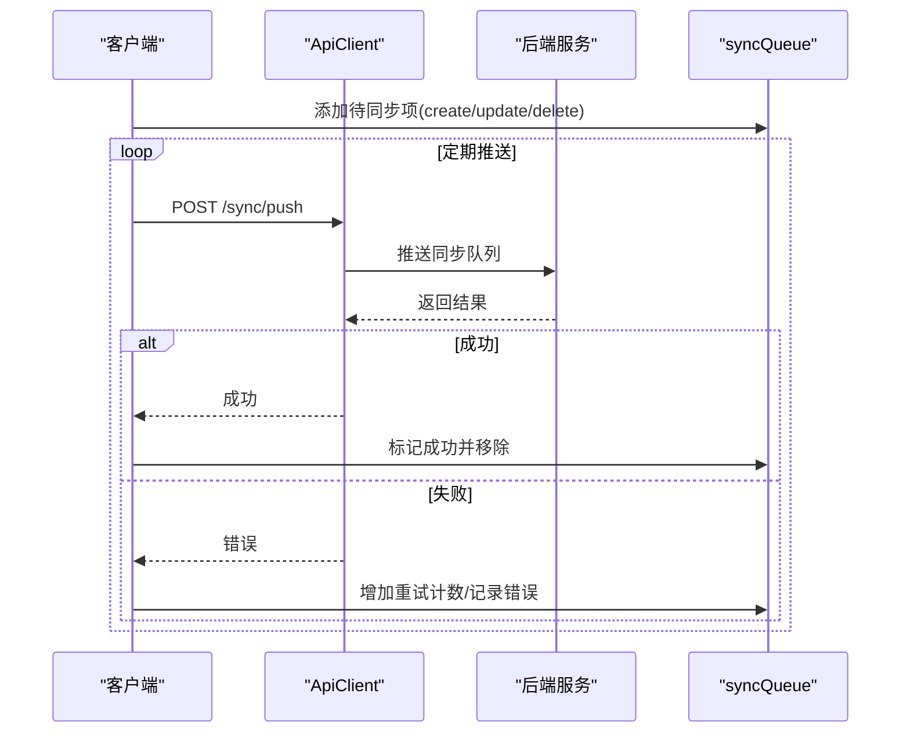
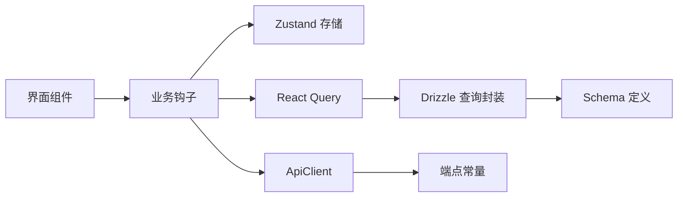

# 数据流设计

<cite>
**本文引用的文件**
- [app/_layout.tsx](file://app/_layout.tsx)
- [db/schema/index.ts](file://db/schema/index.ts)
- [db/queries.ts](file://db/queries.ts)
- [db/index.ts](file://db/index.ts)
- [hooks/useNotes.ts](file://hooks/useNotes.ts)
- [hooks/useAudioRecorder.ts](file://hooks/useAudioRecorder.ts)
- [hooks/useAudioPlayback.ts](file://hooks/useAudioPlayback.ts)
- [store/useRecordingStore.ts](file://store/useRecordingStore.ts)
- [services/api/client.ts](file://services/api/client.ts)
- [services/api/endpoints.ts](file://services/api/endpoints.ts)
- [hooks/useNoteActions.ts](file://hooks/useNoteActions.ts)
</cite>

## 目录
1. [引言](#引言)
2. [项目结构](#项目结构)
3. [核心组件](#核心组件)
4. [架构总览](#架构总览)
5. [详细组件分析](#详细组件分析)
6. [依赖关系分析](#依赖关系分析)
7. [性能考量](#性能考量)
8. [故障排查指南](#故障排查指南)
9. [结论](#结论)
10. [附录](#附录)

## 引言
本文件面向 VoiceNote 项目的“数据流设计”，系统化阐述从用户输入到数据持久化的完整流程，明确数据的单向性与状态提升策略，覆盖数据生命周期（获取、转换、验证、存储、同步）与本地/远程同步机制（冲突解决与一致性），并给出数据流图与时序图、监控与调试方法及常见问题的解决方案。

## 项目结构
VoiceNote 的数据流围绕以下层次组织：
- 视图层：页面与组件（笔记列表、录音页、设置等）
- 状态层：Zustand 存储（录音/播放状态）、React Query 查询客户端
- 业务层：自定义 Hooks（useNotes、useAudioRecorder、useAudioPlayback、useNoteActions 等）
- 数据访问层：Drizzle ORM 查询封装（notes、recordings、mediaFiles、syncQueue、categories、inspirations）
- 远程接口层：Axios 客户端与 API 端点常量

图表来源
- [app/_layout.tsx:16-24](file://app/_layout.tsx#L16-L24)
- [hooks/useNotes.ts:1-217](file://hooks/useNotes.ts#L1-L217)
- [hooks/useAudioRecorder.ts:1-270](file://hooks/useAudioRecorder.ts#L1-L270)
- [hooks/useAudioPlayback.ts:1-90](file://hooks/useAudioPlayback.ts#L1-L90)
- [store/useRecordingStore.ts:1-71](file://store/useRecordingStore.ts#L1-L71)
- [db/queries.ts:1-286](file://db/queries.ts#L1-L286)
- [db/schema/index.ts:1-75](file://db/schema/index.ts#L1-L75)
- [services/api/client.ts:1-104](file://services/api/client.ts#L1-L104)
- [services/api/endpoints.ts:1-61](file://services/api/endpoints.ts#L1-L61)

章节来源
- [app/_layout.tsx:16-24](file://app/_layout.tsx#L16-L24)
- [db/schema/index.ts:1-75](file://db/schema/index.ts#L1-L75)
- [db/queries.ts:1-286](file://db/queries.ts#L1-L286)
- [hooks/useNotes.ts:1-217](file://hooks/useNotes.ts#L1-L217)
- [hooks/useAudioRecorder.ts:1-270](file://hooks/useAudioRecorder.ts#L1-L270)
- [hooks/useAudioPlayback.ts:1-90](file://hooks/useAudioPlayback.ts#L1-L90)
- [store/useRecordingStore.ts:1-71](file://store/useRecordingStore.ts#L1-L71)
- [services/api/client.ts:1-104](file://services/api/client.ts#L1-L104)
- [services/api/endpoints.ts:1-61](file://services/api/endpoints.ts#L1-L61)

## 核心组件
- React Query 客户端与默认配置：全局缓存时间、失效时间、重试策略，确保远端与本地数据一致。
- Drizzle 查询封装：对 notes、recordings、mediaFiles、syncQueue、categories、inspirations 提供统一 CRUD 接口。
- 自定义 Hooks：
  - useNotes：提供笔记列表、详情、创建、更新（乐观更新）、删除、批量归档、合并等能力。
  - useAudioRecorder：录音权限、录制控制、文件信息获取、播放器集成。
  - useAudioPlayback：播放器加载/播放/暂停/停止/跳转。
  - useNoteActions：归档/删除/分享等交互动作的确认与执行。
- Zustand 存储：录音/播放状态的本地状态管理。
- API 客户端与端点：统一的 Axios 实例与端点常量，便于扩展与维护。

章节来源
- [app/_layout.tsx:16-24](file://app/_layout.tsx#L16-L24)
- [hooks/useNotes.ts:1-217](file://hooks/useNotes.ts#L1-L217)
- [hooks/useAudioRecorder.ts:1-270](file://hooks/useAudioRecorder.ts#L1-L270)
- [hooks/useAudioPlayback.ts:1-90](file://hooks/useAudioPlayback.ts#L1-L90)
- [store/useRecordingStore.ts:1-71](file://store/useRecordingStore.ts#L1-L71)
- [services/api/client.ts:1-104](file://services/api/client.ts#L1-L104)
- [services/api/endpoints.ts:1-61](file://services/api/endpoints.ts#L1-L61)

## 架构总览
VoiceNote 的数据流遵循“单向数据流”与“状态提升”原则：
- 单向数据流：UI -> 状态层 -> 业务层 -> 数据访问层 -> 持久化/远程服务；变更通过事件或回调触发，避免跨方向写入。
- 状态提升：将共享状态提升至最近的公共父组件或全局状态（如 Zustand/React Query），使多个组件共享同一数据源，减少重复状态与不一致。

图表来源
- [hooks/useNotes.ts:46-117](file://hooks/useNotes.ts#L46-L117)
- [db/queries.ts:35-57](file://db/queries.ts#L35-L57)
- [services/api/client.ts:81-99](file://services/api/client.ts#L81-L99)

## 详细组件分析

### 组件一：笔记数据流（获取/更新/删除/合并）
- 获取：useNotes 提供按状态/类型过滤的列表查询，支持按 ID 获取详情。
- 更新：useUpdateNote 使用“乐观更新”策略，先在缓存中更新，再异步同步至服务器；失败时回滚。
- 删除：useDeleteNote 删除后失效相关查询，确保 UI 同步。
- 批量/合并：useMergeNotes 收集多条笔记内容、标签、音频时长，创建新笔记并归档原笔记，最后失效列表缓存。

图表来源
- [hooks/useNotes.ts:46-117](file://hooks/useNotes.ts#L46-L117)
- [hooks/useNotes.ts:144-216](file://hooks/useNotes.ts#L144-L216)
- [db/queries.ts:35-57](file://db/queries.ts#L35-L57)

章节来源
- [hooks/useNotes.ts:1-217](file://hooks/useNotes.ts#L1-L217)
- [db/queries.ts:6-64](file://db/queries.ts#L6-L64)

### 组件二：录音与播放数据流
- 录音：useAudioRecorder 管理录音状态、时长、URI，支持暂停/恢复/停止/取消，并在停止时读取文件大小。
- 播放：useAudioPlayback 管理播放器加载、播放、暂停、停止、跳转，支持同源快速重播。
- 状态提升：录音/播放状态由 Zustand 存储集中管理，组件通过状态与动作进行解耦。

图表来源
- [hooks/useAudioRecorder.ts:79-175](file://hooks/useAudioRecorder.ts#L79-L175)
- [hooks/useAudioPlayback.ts:27-87](file://hooks/useAudioPlayback.ts#L27-L87)
- [store/useRecordingStore.ts:25-70](file://store/useRecordingStore.ts#L25-L70)

章节来源
- [hooks/useAudioRecorder.ts:1-270](file://hooks/useAudioRecorder.ts#L1-L270)
- [hooks/useAudioPlayback.ts:1-90](file://hooks/useAudioPlayback.ts#L1-L90)
- [store/useRecordingStore.ts:1-71](file://store/useRecordingStore.ts#L1-L71)

### 组件三：笔记动作与确认流程
- useNoteActions 将“归档/删除/分享”等动作抽象为可复用逻辑，通过对话框确认后执行，避免误操作。

图表来源
- [hooks/useNoteActions.ts:21-79](file://hooks/useNoteActions.ts#L21-L79)

章节来源
- [hooks/useNoteActions.ts:1-80](file://hooks/useNoteActions.ts#L1-L80)

### 组件四：数据模型与表结构
- notes：标题、内容、类型、状态、标签、音频时长、分类关联、时间戳。
- recordings：与笔记关联的录音文件，包含 URI、时长、文件大小、MIME 类型。
- mediaFiles：与笔记关联的媒体文件（图片/视频/文档），包含缩略图、尺寸、文件名、大小、MIME。
- syncQueue：同步队列，记录待同步实体、动作、负载、重试次数与错误。
- categories/inspirations：分类与灵感分析数据。

图表来源
- [db/schema/index.ts:3-75](file://db/schema/index.ts#L3-L75)

章节来源
- [db/schema/index.ts:1-75](file://db/schema/index.ts#L1-L75)
- [db/index.ts:1-26](file://db/index.ts#L1-L26)

### 组件五：远程接口与同步机制
- API 客户端：统一的 Axios 实例，包含请求/响应拦截器与错误处理。
- 端点常量：集中定义认证、笔记、录音、媒体、同步、用户、分享等端点。
- 同步队列：通过 syncQueue 记录待同步项，支持重试与错误标记，保证最终一致性。

图表来源
- [services/api/client.ts:12-104](file://services/api/client.ts#L12-L104)
- [services/api/endpoints.ts:39-44](file://services/api/endpoints.ts#L39-L44)
- [db/queries.ts:136-164](file://db/queries.ts#L136-L164)

章节来源
- [services/api/client.ts:1-104](file://services/api/client.ts#L1-L104)
- [services/api/endpoints.ts:1-61](file://services/api/endpoints.ts#L1-L61)
- [db/queries.ts:136-164](file://db/queries.ts#L136-L164)

## 依赖关系分析
- 组件耦合与内聚：
  - useNotes 与 React Query 高度内聚，负责笔记域的所有数据操作；与 Drizzle 查询封装解耦。
  - useAudioRecorder/useAudioPlayback 与文件系统/播放器库耦合，但通过状态提升与动作暴露降低 UI 与播放细节耦合。
  - Zustand 存储仅承载轻量状态，避免与复杂业务逻辑耦合。
- 外部依赖：
  - React Query 提供缓存、失效、重试、乐观更新等能力。
  - Drizzle ORM 提供类型安全的 SQLite 访问。
  - Axios 提供网络请求与错误处理。
- 潜在循环依赖：
  - 当前结构未见直接循环依赖；若后续引入更多跨模块查询，建议通过查询封装与端点常量避免循环导入。

图表来源
- [hooks/useNotes.ts:1-217](file://hooks/useNotes.ts#L1-L217)
- [store/useRecordingStore.ts:1-71](file://store/useRecordingStore.ts#L1-L71)
- [db/queries.ts:1-286](file://db/queries.ts#L1-L286)
- [db/schema/index.ts:1-75](file://db/schema/index.ts#L1-L75)
- [services/api/client.ts:1-104](file://services/api/client.ts#L1-L104)
- [services/api/endpoints.ts:1-61](file://services/api/endpoints.ts#L1-L61)

章节来源
- [hooks/useNotes.ts:1-217](file://hooks/useNotes.ts#L1-L217)
- [store/useRecordingStore.ts:1-71](file://store/useRecordingStore.ts#L1-L71)
- [db/queries.ts:1-286](file://db/queries.ts#L1-L286)
- [db/schema/index.ts:1-75](file://db/schema/index.ts#L1-L75)
- [services/api/client.ts:1-104](file://services/api/client.ts#L1-L104)
- [services/api/endpoints.ts:1-61](file://services/api/endpoints.ts#L1-L61)

## 性能考量
- 缓存与失效：
  - React Query 默认缓存 30 分钟，5 分钟过期；通过查询键与失效策略保证 UI 与数据一致。
  - 乐观更新减少等待时间，失败回滚保障一致性。
- 网络与重试：
  - Axios 超时与错误处理，配合后端同步队列重试，提高可靠性。
- 数据库索引：
  - notes 表按 status、type 建立索引，提升筛选与排序性能。
- 媒体与录音：
  - 录音停止后读取文件大小，避免不必要的二次 IO；播放器按需加载，减少内存占用。

章节来源
- [app/_layout.tsx:16-24](file://app/_layout.tsx#L16-L24)
- [db/schema/index.ts:14-17](file://db/schema/index.ts#L14-L17)
- [hooks/useNotes.ts:68-101](file://hooks/useNotes.ts#L68-L101)

## 故障排查指南
- 笔记更新无反应：
  - 检查 useUpdateNote 的乐观更新是否被错误回滚；确认 onSettled 是否触发了列表与详情的失效。
- 录音文件丢失或无法播放：
  - 确认录音停止后文件存在且可读；检查播放器源是否正确切换。
- 同步失败：
  - 查看 syncQueue 中对应项的 lastError 与 retryCount；检查 /sync/push 接口返回。
- 权限问题：
  - 录音权限拒绝时会抛出错误；确保在开始录音前已授权。
- 缓存不一致：
  - 手动调用 queryClient.invalidateQueries 清理相关缓存键；确认 staleTime 与 gcTime 设置合理。

章节来源
- [hooks/useNotes.ts:68-101](file://hooks/useNotes.ts#L68-L101)
- [hooks/useAudioRecorder.ts:74-109](file://hooks/useAudioRecorder.ts#L74-L109)
- [db/queries.ts:136-164](file://db/queries.ts#L136-L164)

## 结论
VoiceNote 的数据流以 React Query 为核心，结合 Drizzle ORM 与 Zustand 存储，实现了从用户输入到本地持久化的高效闭环。通过“单向数据流”与“状态提升”，组件职责清晰、耦合度低；通过乐观更新、缓存失效与同步队列，兼顾用户体验与数据一致性。建议在后续迭代中进一步完善同步冲突策略与监控埋点，持续优化性能与稳定性。

## 附录
- 关键实现参考路径：
  - [笔记查询与 CRUD:6-64](file://db/queries.ts#L6-L64)
  - [笔记 Hooks（含乐观更新）:46-117](file://hooks/useNotes.ts#L46-L117)
  - [录音与播放 Hooks:79-175](file://hooks/useAudioRecorder.ts#L79-L175)
  - [播放控制 Hooks:27-87](file://hooks/useAudioPlayback.ts#L27-L87)
  - [Zustand 录音/播放状态:25-70](file://store/useRecordingStore.ts#L25-L70)
  - [React Query 客户端配置:16-24](file://app/_layout.tsx#L16-L24)
  - [API 客户端与端点:12-104](file://services/api/client.ts#L12-L104)
  - [同步队列与错误处理:136-164](file://db/queries.ts#L136-L164)