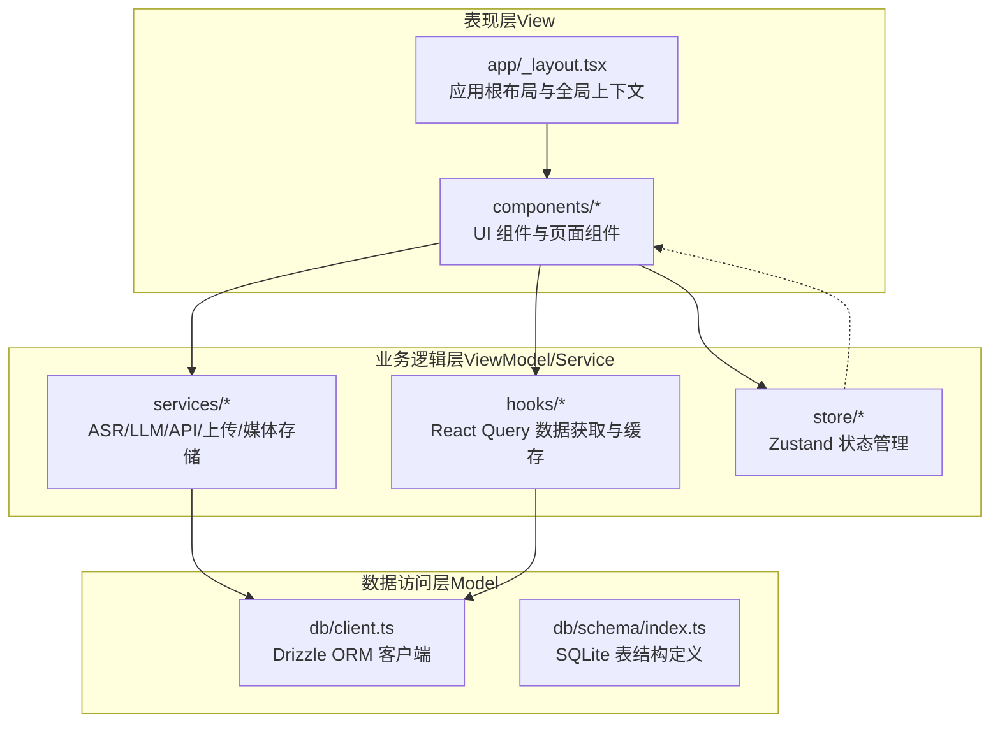
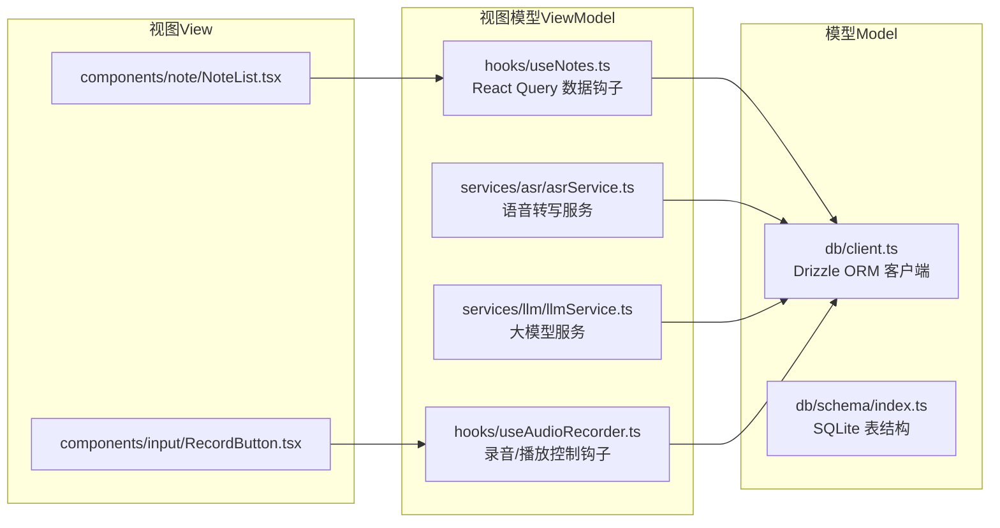
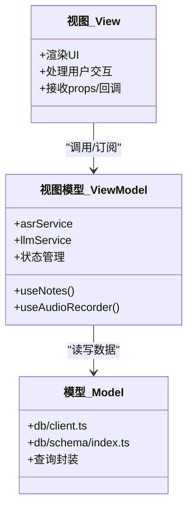
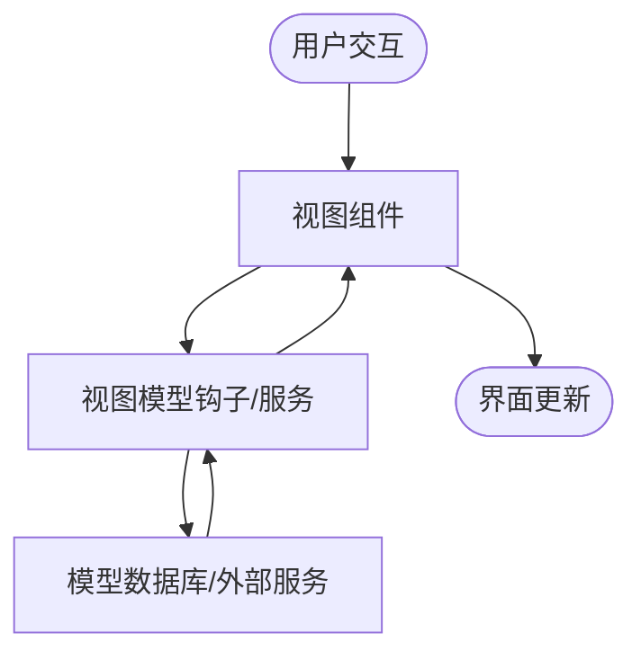
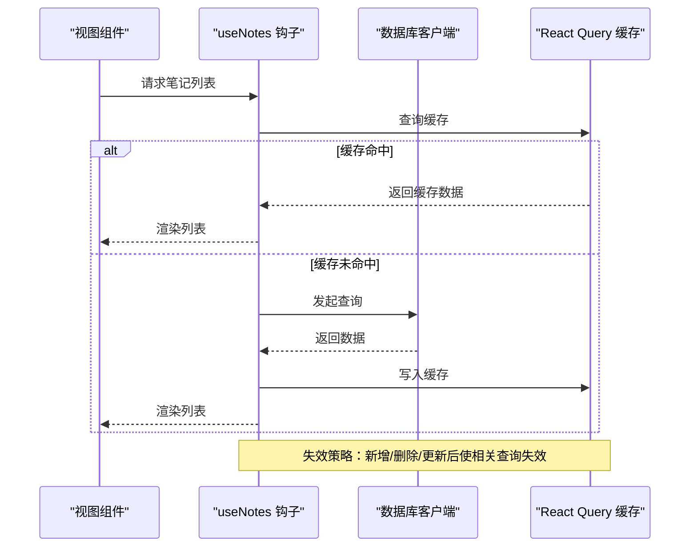
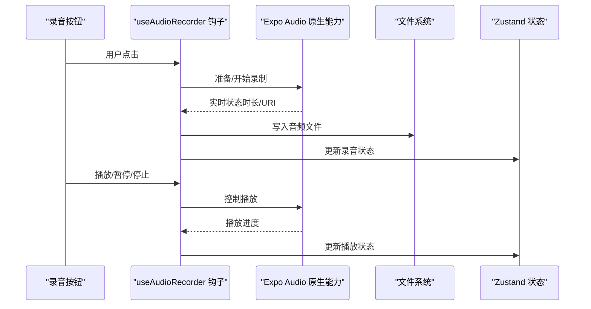
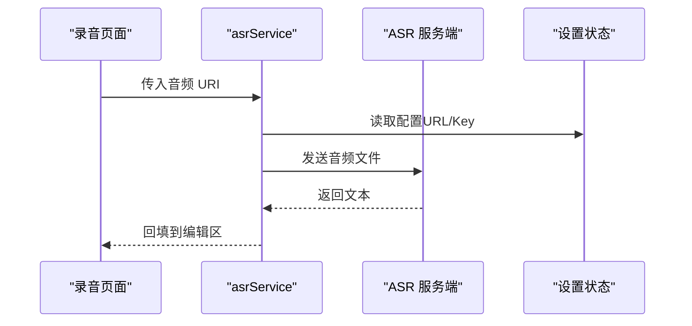
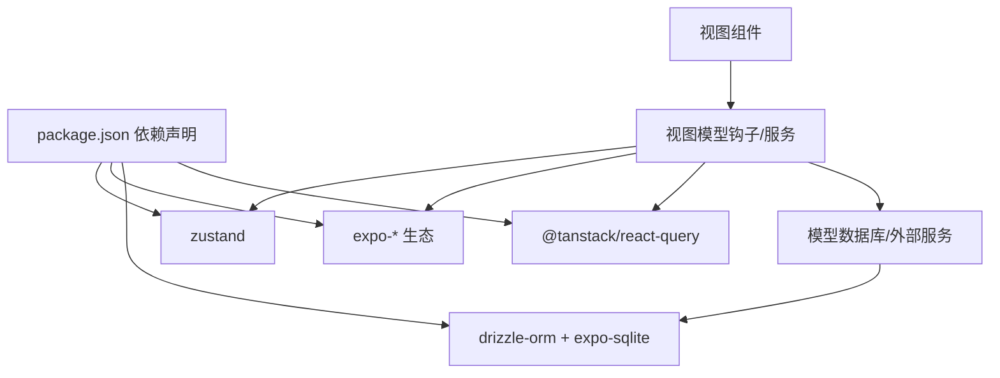

# 整体架构模式

<cite>
**本文引用的文件**
- [package.json](file://package.json)
- [app/_layout.tsx](file://app/_layout.tsx)
- [store/index.ts](file://store/index.ts)
- [store/useRecordingStore.ts](file://store/useRecordingStore.ts)
- [db/client.ts](file://db/client.ts)
- [db/schema/index.ts](file://db/schema/index.ts)
- [services/index.ts](file://services/index.ts)
- [services/asr/asrService.ts](file://services/asr/asrService.ts)
- [services/llm/llmService.ts](file://services/llm/llmService.ts)
- [hooks/useNotes.ts](file://hooks/useNotes.ts)
- [hooks/useAudioRecorder.ts](file://hooks/useAudioRecorder.ts)
- [components/note/NoteList.tsx](file://components/note/NoteList.tsx)
- [components/input/RecordButton.tsx](file://components/input/RecordButton.tsx)
- [.trellis/spec/guides/cross-layer-thinking-guide.md](file://.trellis/spec/guides/cross-layer-thinking-guide.md)
- [CLAUDE.md](file://CLAUDE.md)
</cite>

## 目录
1. [引言](#引言)
2. [项目结构](#项目结构)
3. [核心组件](#核心组件)
4. [架构总览](#架构总览)
5. [详细组件分析](#详细组件分析)
6. [依赖分析](#依赖分析)
7. [性能考量](#性能考量)
8. [故障排查指南](#故障排查指南)
9. [结论](#结论)
10. [附录](#附录)

## 引言
本文件系统性阐述 VoiceNote 项目的整体架构与 MVVM 模式落地实践，重点说明以下方面：
- MVVM 在本项目中的职责分离：模型（Model）、视图（View）、视图模型（ViewModel）如何协同工作
- React Native + Expo 技术栈的选择原因与架构优势
- 分层架构设计：表现层、业务逻辑层、数据访问层的职责划分与边界
- 关键设计原则：单一职责、开闭原则、依赖倒置等在代码中的体现
- 架构图表：展示各层关系与数据流向
- 技术权衡：性能、可维护性、可扩展性的取舍

## 项目结构
VoiceNote 采用以功能域为中心的目录组织方式，结合 React Native + Expo 的路由与状态管理生态，形成清晰的分层与模块化结构。

**图表来源**
- [app/_layout.tsx:1-101](file://app/_layout.tsx#L1-L101)
- [services/index.ts:1-7](file://services/index.ts#L1-L7)
- [hooks/useNotes.ts:1-217](file://hooks/useNotes.ts#L1-L217)
- [store/index.ts:1-8](file://store/index.ts#L1-L8)
- [db/client.ts:1-15](file://db/client.ts#L1-L15)
- [db/schema/index.ts:1-75](file://db/schema/index.ts#L1-L75)

**章节来源**
- [package.json:1-83](file://package.json#L1-L83)
- [app/_layout.tsx:1-101](file://app/_layout.tsx#L1-L101)
- [services/index.ts:1-7](file://services/index.ts#L1-L7)
- [hooks/useNotes.ts:1-217](file://hooks/useNotes.ts#L1-L217)
- [store/index.ts:1-8](file://store/index.ts#L1-L8)
- [db/client.ts:1-15](file://db/client.ts#L1-L15)
- [db/schema/index.ts:1-75](file://db/schema/index.ts#L1-L75)

## 核心组件
- 应用根布局与全局上下文：提供国际化、主题、手势、安全区域、查询客户端等基础设施
- 服务层：统一抽象 ASR/LLM/API/上传/媒体存储等外部能力
- 钩子层：基于 React Query 的数据获取、缓存、乐观更新与失效策略
- 状态层：Zustand 轻量状态管理，聚焦录音/播放器等本地交互状态
- 数据层：Drizzle ORM + Expo SQLite，提供类型安全的本地数据库访问

**章节来源**
- [app/_layout.tsx:1-101](file://app/_layout.tsx#L1-L101)
- [services/asr/asrService.ts:1-74](file://services/asr/asrService.ts#L1-L74)
- [services/llm/llmService.ts:1-61](file://services/llm/llmService.ts#L1-L61)
- [hooks/useNotes.ts:1-217](file://hooks/useNotes.ts#L1-L217)
- [store/useRecordingStore.ts:1-71](file://store/useRecordingStore.ts#L1-L71)
- [db/client.ts:1-15](file://db/client.ts#L1-L15)

## 架构总览
VoiceNote 采用 MVVM 模式在前端层面落地：
- Model：由 Drizzle ORM + SQLite 提供的数据模型与查询封装
- ViewModel：由 hooks 与服务层承担，负责数据获取、缓存、状态转换与副作用
- View：组件层，负责渲染与用户交互，通过 props 与回调与 ViewModel 解耦

**图表来源**
- [components/note/NoteList.tsx:1-240](file://components/note/NoteList.tsx#L1-L240)
- [components/input/RecordButton.tsx:1-131](file://components/input/RecordButton.tsx#L1-L131)
- [hooks/useNotes.ts:1-217](file://hooks/useNotes.ts#L1-L217)
- [hooks/useAudioRecorder.ts:1-270](file://hooks/useAudioRecorder.ts#L1-L270)
- [services/asr/asrService.ts:1-74](file://services/asr/asrService.ts#L1-L74)
- [services/llm/llmService.ts:1-61](file://services/llm/llmService.ts#L1-L61)
- [db/client.ts:1-15](file://db/client.ts#L1-L15)
- [db/schema/index.ts:1-75](file://db/schema/index.ts#L1-L75)

## 详细组件分析

### MVVM 职责分离与实现
- 视图（View）
  - 负责渲染与交互：例如录音按钮的动画与反馈、笔记列表的时间分组与滑动操作
  - 不直接访问数据源，通过 props 与回调与 ViewModel 通信
- 视图模型（ViewModel）
  - 数据获取与缓存：useNotes 基于 React Query 实现查询键、缓存时间、失效策略与乐观更新
  - 业务编排：录音/播放控制、ASR/LLM 调用、状态持久化
- 模型（Model）
  - 类型安全的数据结构与数据库访问：Drizzle ORM + SQLite，提供查询封装与迁移

**图表来源**
- [hooks/useNotes.ts:1-217](file://hooks/useNotes.ts#L1-L217)
- [hooks/useAudioRecorder.ts:1-270](file://hooks/useAudioRecorder.ts#L1-L270)
- [services/asr/asrService.ts:1-74](file://services/asr/asrService.ts#L1-L74)
- [services/llm/llmService.ts:1-61](file://services/llm/llmService.ts#L1-L61)
- [db/client.ts:1-15](file://db/client.ts#L1-L15)
- [db/schema/index.ts:1-75](file://db/schema/index.ts#L1-L75)

**章节来源**
- [hooks/useNotes.ts:1-217](file://hooks/useNotes.ts#L1-L217)
- [hooks/useAudioRecorder.ts:1-270](file://hooks/useAudioRecorder.ts#L1-L270)
- [components/note/NoteList.tsx:1-240](file://components/note/NoteList.tsx#L1-L240)
- [components/input/RecordButton.tsx:1-131](file://components/input/RecordButton.tsx#L1-L131)

### React Native + Expo 技术栈选择与优势
- 跨平台原生体验：一次开发，iOS/Android/Web 同构体验
- 生态成熟：Expo Router 提供约定式路由；Expo Audio/Camera/File System 等原生能力
- 开发效率：Metro 打包、热重载、TypeScript 支持完善
- 可移植性：Tamagui 提供跨平台 UI 主题与组件体系

**章节来源**
- [package.json:20-62](file://package.json#L20-L62)
- [app/_layout.tsx:1-101](file://app/_layout.tsx#L1-L101)

### 分层架构设计与职责划分
- 表现层（View）
  - 组件：UI 组件与页面组件，负责渲染与交互
  - 示例：录音按钮、笔记列表、输入覆盖层等
- 业务逻辑层（ViewModel/Service）
  - 钩子：useNotes、useAudioRecorder 等，封装数据流与副作用
  - 服务：ASR/LLM/API/上传/媒体存储，统一对外接口
- 数据访问层（Model）
  - Drizzle ORM + SQLite：类型安全的本地数据库访问与迁移

**图表来源**
- [hooks/useNotes.ts:1-217](file://hooks/useNotes.ts#L1-L217)
- [hooks/useAudioRecorder.ts:1-270](file://hooks/useAudioRecorder.ts#L1-L270)
- [services/asr/asrService.ts:1-74](file://services/asr/asrService.ts#L1-L74)
- [services/llm/llmService.ts:1-61](file://services/llm/llmService.ts#L1-L61)
- [db/client.ts:1-15](file://db/client.ts#L1-L15)

**章节来源**
- [hooks/useNotes.ts:1-217](file://hooks/useNotes.ts#L1-L217)
- [hooks/useAudioRecorder.ts:1-270](file://hooks/useAudioRecorder.ts#L1-L270)
- [services/asr/asrService.ts:1-74](file://services/asr/asrService.ts#L1-L74)
- [services/llm/llmService.ts:1-61](file://services/llm/llmService.ts#L1-L61)
- [db/client.ts:1-15](file://db/client.ts#L1-L15)

### 关键设计原则
- 单一职责
  - 钩子专注于数据获取与缓存（useNotes），服务专注于业务编排（asrService、llmService），组件专注于渲染（NoteList、RecordButton）
- 开闭原则
  - 通过服务抽象与钩子扩展新功能，无需修改既有实现（例如新增 Provider 或查询键）
- 依赖倒置
  - 组件不直接依赖底层实现，而是依赖抽象（钩子/服务接口）

**章节来源**
- [.trellis/spec/guides/cross-layer-thinking-guide.md:1-79](file://.trellis/spec/guides/cross-layer-thinking-guide.md#L1-L79)
- [CLAUDE.md:54-136](file://CLAUDE.md#L54-L136)

### 关键流程示例

#### 笔记列表加载与缓存失效

**图表来源**
- [hooks/useNotes.ts:19-117](file://hooks/useNotes.ts#L19-L117)
- [db/client.ts:1-15](file://db/client.ts#L1-L15)

**章节来源**
- [hooks/useNotes.ts:1-217](file://hooks/useNotes.ts#L1-L217)

#### 录音与播放控制

**图表来源**
- [hooks/useAudioRecorder.ts:26-270](file://hooks/useAudioRecorder.ts#L26-L270)
- [store/useRecordingStore.ts:1-71](file://store/useRecordingStore.ts#L1-L71)

**章节来源**
- [hooks/useAudioRecorder.ts:1-270](file://hooks/useAudioRecorder.ts#L1-L270)
- [store/useRecordingStore.ts:1-71](file://store/useRecordingStore.ts#L1-L71)

#### 语音转写流程

**图表来源**
- [services/asr/asrService.ts:24-74](file://services/asr/asrService.ts#L24-L74)

**章节来源**
- [services/asr/asrService.ts:1-74](file://services/asr/asrService.ts#L1-L74)

## 依赖分析
- 外部依赖
  - React Query：统一数据获取与缓存
  - Drizzle ORM + Expo SQLite：本地数据库访问
  - Expo 生态：相机、音频、文件系统、路由、国际化、主题
  - Zustand：轻量状态管理
- 层间依赖
  - View 仅依赖 ViewModel（钩子/服务）
  - ViewModel 依赖 Model（数据库/外部服务）
  - 无反向依赖，保持清晰边界

**图表来源**
- [package.json:20-62](file://package.json#L20-L62)
- [hooks/useNotes.ts:1-217](file://hooks/useNotes.ts#L1-L217)
- [db/client.ts:1-15](file://db/client.ts#L1-L15)

**章节来源**
- [package.json:1-83](file://package.json#L1-L83)
- [hooks/useNotes.ts:1-217](file://hooks/useNotes.ts#L1-L217)
- [db/client.ts:1-15](file://db/client.ts#L1-L15)

## 性能考量
- 列表渲染优化：使用高性能列表组件与分组渲染，减少不必要的重渲染
- 数据缓存：React Query 默认缓存与失效策略，降低网络与数据库压力
- 本地状态：Zustand 用于高频交互状态，避免全局状态风暴
- 媒体处理：按需加载缩略图与文件信息，避免一次性加载大资源
- 动画与交互：Reanimated 与 Expo Haptics 提升交互流畅度与反馈质量

[本节为通用性能建议，不直接分析具体文件]

## 故障排查指南
- 跨层边界问题
  - 明确数据格式与错误处理边界，避免隐式假设
  - 在入口处集中校验，防止多层重复校验
- 常见问题定位
  - 网络请求失败：检查 API URL/Key 配置与超时设置
  - 数据库异常：确认迁移是否执行成功与索引是否合理
  - 状态不一致：检查 React Query 的失效与乐观更新逻辑
- 建议流程
  - 绘制数据流图，明确每个边界的数据形态
  - 定义契约（输入/输出格式、错误类型）
  - 在边界处增加日志与错误提示

**章节来源**
- [.trellis/spec/guides/cross-layer-thinking-guide.md:18-79](file://.trellis/spec/guides/cross-layer-thinking-guide.md#L18-L79)

## 结论
VoiceNote 通过 MVVM 模式与 React Native + Expo 技术栈，实现了清晰的分层与职责分离。表现层专注渲染与交互，业务逻辑层统一编排数据与外部能力，数据访问层提供类型安全的本地存储。该架构在可维护性与可扩展性上具备良好基础，同时通过缓存、本地状态与原生能力提升了用户体验与性能。

## 附录
- 路由与国际化在根布局中初始化，确保全局可用
- 服务层统一对外接口，便于替换与扩展
- 钩子层提供标准的数据流模式，降低组件复杂度

**章节来源**
- [app/_layout.tsx:1-101](file://app/_layout.tsx#L1-L101)
- [services/index.ts:1-7](file://services/index.ts#L1-L7)