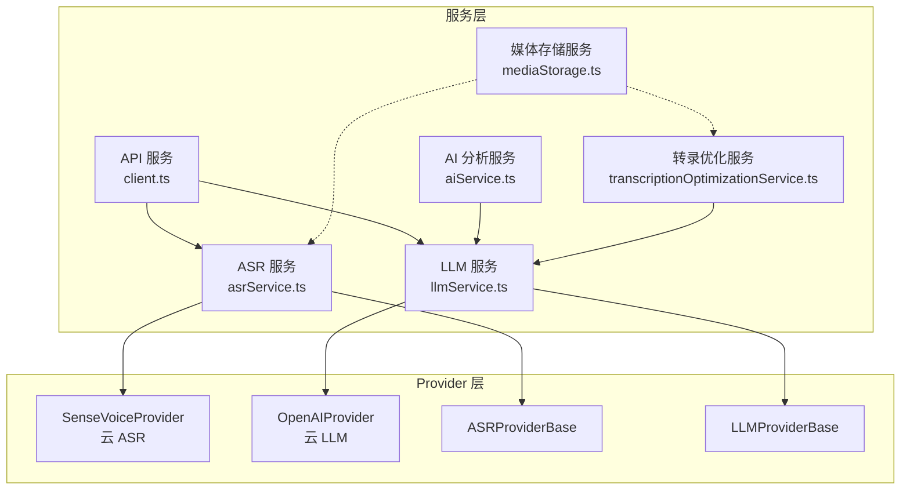
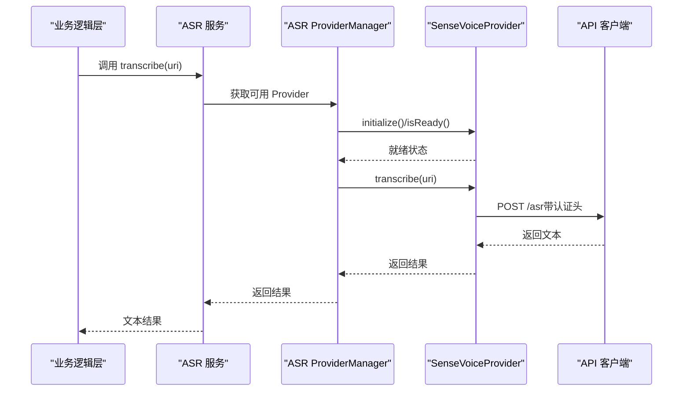
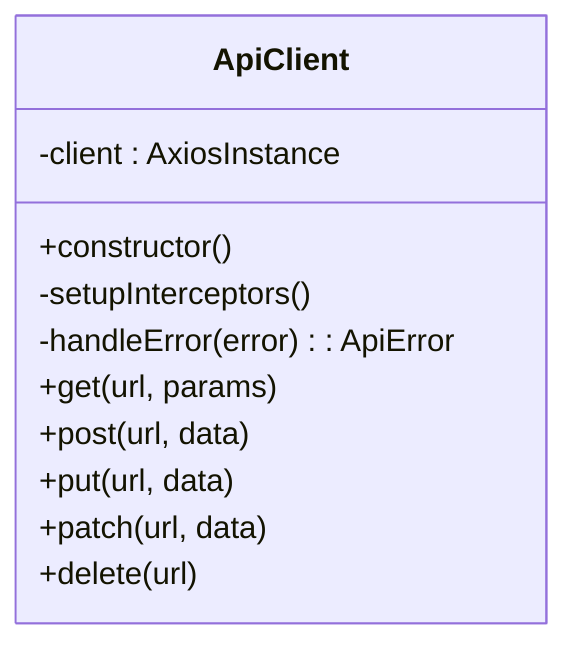
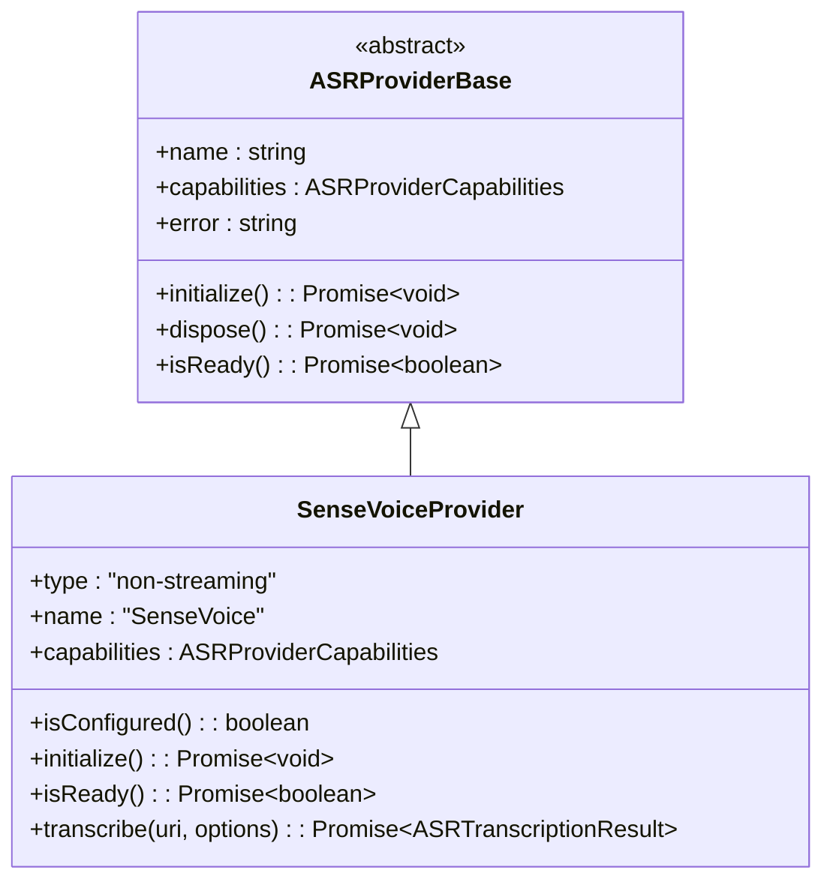
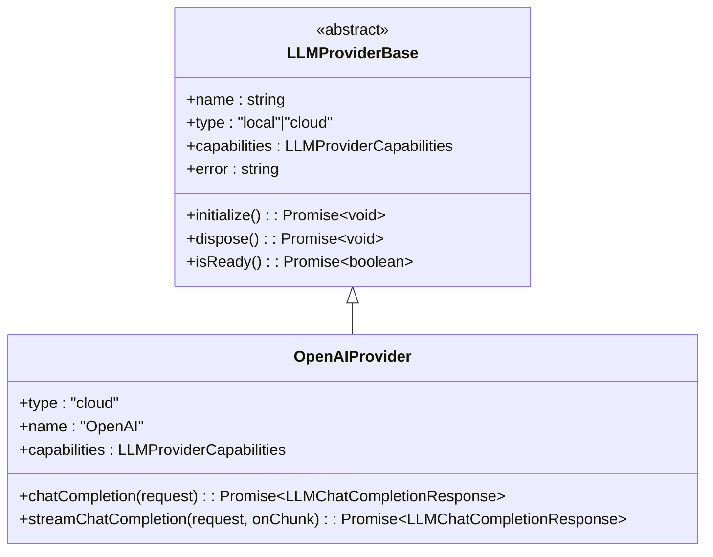
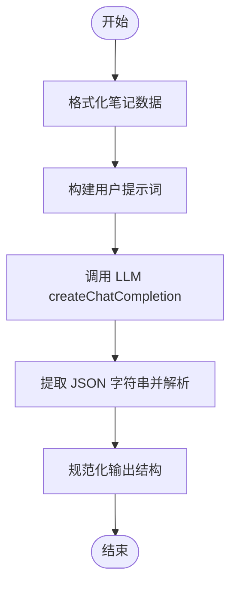
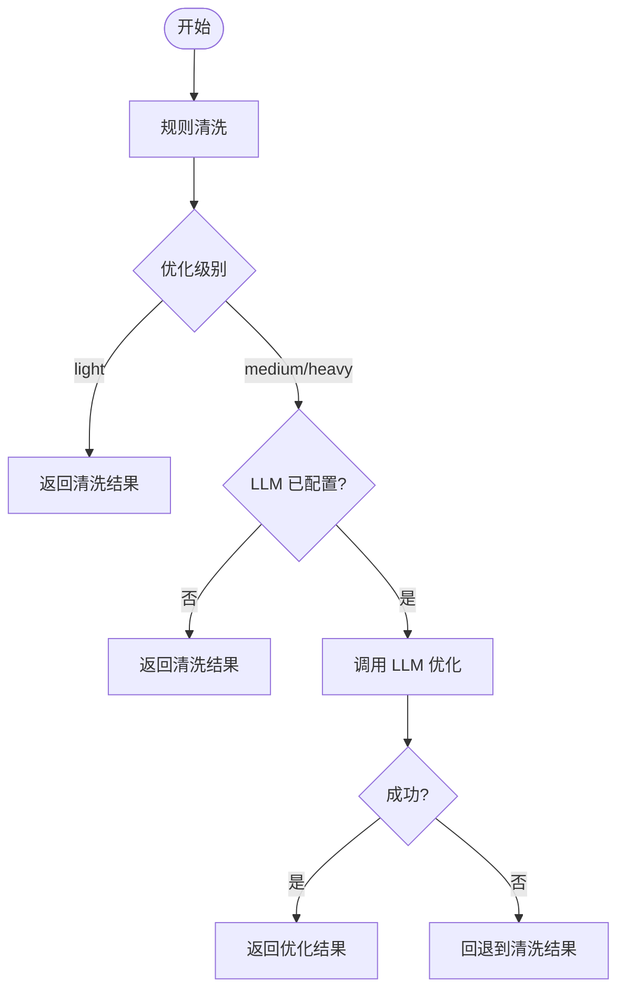
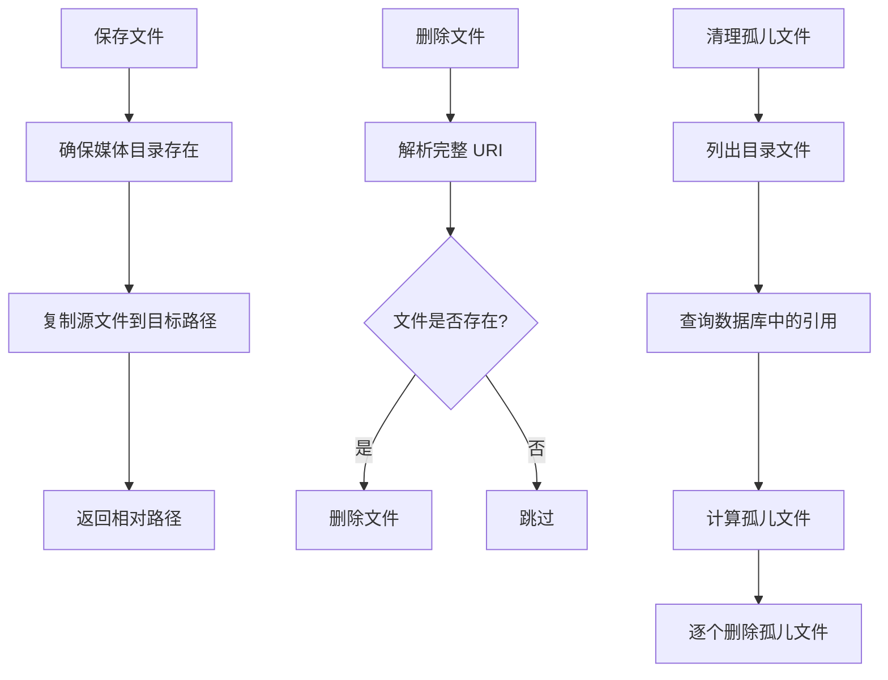
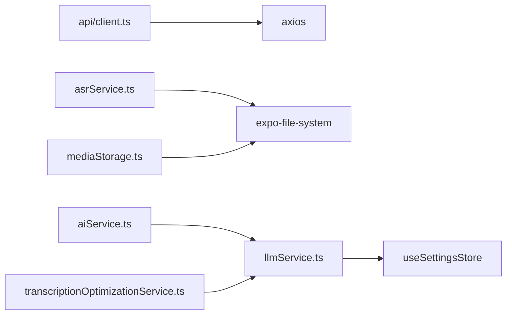

# 服务层架构

<cite>
**本文档引用的文件**
- [services/index.ts](file://services/index.ts)
- [services/api/index.ts](file://services/api/index.ts)
- [services/api/client.ts](file://services/api/client.ts)
- [services/ai/index.ts](file://services/ai/index.ts)
- [services/ai/aiService.ts](file://services/ai/aiService.ts)
- [services/asr/index.ts](file://services/asr/index.ts)
- [services/asr/asrService.ts](file://services/asr/asrService.ts)
- [services/asr/providers/base/ASRProviderBase.ts](file://services/asr/providers/base/ASRProviderBase.ts)
- [services/asr/providers/cloud/SenseVoiceProvider.ts](file://services/asr/providers/cloud/SenseVoiceProvider.ts)
- [services/llm/index.ts](file://services/llm/index.ts)
- [services/llm/llmService.ts](file://services/llm/llmService.ts)
- [services/llm/providers/base/LLMProviderBase.ts](file://services/llm/providers/base/LLMProviderBase.ts)
- [services/llm/providers/cloud/OpenAIProvider.ts](file://services/llm/providers/cloud/OpenAIProvider.ts)
- [services/transcription/transcriptionOptimizationService.ts](file://services/transcription/transcriptionOptimizationService.ts)
- [services/mediaStorage.ts](file://services/mediaStorage.ts)
</cite>

## 目录
1. [引言](#引言)
2. [项目结构](#项目结构)
3. [核心组件](#核心组件)
4. [架构总览](#架构总览)
5. [详细组件分析](#详细组件分析)
6. [依赖分析](#依赖分析)
7. [性能考虑](#性能考虑)
8. [故障排除指南](#故障排除指南)
9. [结论](#结论)
10. [附录](#附录)

## 引言
本文件系统性梳理 VoiceNote 项目的“服务层”架构，重点阐述以下方面：
- 模块化设计：API 服务、AI 服务、ASR 服务、LLM 服务、转录优化服务、媒体存储服务的职责边界与协作方式
- 服务间依赖与调用模式：如何通过统一入口导出、配置中心与 Provider 管理器实现松耦合集成
- 生命周期管理：初始化、配置加载、错误处理与资源清理
- 抽象层设计：接口隔离与可替换性（Provider 模式）
- 架构图与数据流图：可视化展示服务层内部与跨层交互
- 与业务逻辑层的交互：如何保证可测试性与可维护性

## 项目结构
服务层位于 services 目录下，采用按功能域分层的模块化组织方式：
- 根级聚合导出：services/index.ts 统一导出各子模块，便于上层按需引入
- 子模块职责：
  - api：HTTP 客户端封装与错误处理
  - asr：语音转写服务，支持多 Provider（云/本地）
  - llm：大模型服务，统一本地与云端调用
  - ai：AI 分析服务，基于 LLM 能力进行笔记分析
  - transcription：转录文本优化服务（规则+LLM）
  - mediaStorage：本地媒体文件存取与清理
  - 其他：search、skill、upload 等

图表来源
- [services/api/client.ts:1-104](file://services/api/client.ts#L1-L104)
- [services/asr/asrService.ts:1-74](file://services/asr/asrService.ts#L1-L74)
- [services/llm/llmService.ts:1-61](file://services/llm/llmService.ts#L1-L61)
- [services/ai/aiService.ts:1-163](file://services/ai/aiService.ts#L1-L163)
- [services/transcription/transcriptionOptimizationService.ts:1-88](file://services/transcription/transcriptionOptimizationService.ts#L1-L88)
- [services/mediaStorage.ts:1-123](file://services/mediaStorage.ts#L1-L123)
- [services/asr/providers/base/ASRProviderBase.ts:1-66](file://services/asr/providers/base/ASRProviderBase.ts#L1-L66)
- [services/llm/providers/base/LLMProviderBase.ts:1-42](file://services/llm/providers/base/LLMProviderBase.ts#L1-L42)
- [services/asr/providers/cloud/SenseVoiceProvider.ts:1-167](file://services/asr/providers/cloud/SenseVoiceProvider.ts#L1-L167)
- [services/llm/providers/cloud/OpenAIProvider.ts:1-260](file://services/llm/providers/cloud/OpenAIProvider.ts#L1-L260)

章节来源
- [services/index.ts:1-7](file://services/index.ts#L1-L7)
- [services/api/index.ts:1-4](file://services/api/index.ts#L1-L4)
- [services/asr/index.ts:1-70](file://services/asr/index.ts#L1-L70)
- [services/llm/index.ts:1-10](file://services/llm/index.ts#L1-L10)
- [services/ai/index.ts:1-3](file://services/ai/index.ts#L1-L3)

## 核心组件
- API 服务（HTTP 客户端）：封装 axios，统一请求/响应拦截、错误映射与基础 URL 配置，提供通用 CRUD 方法
- ASR 服务：提供传统函数式 API 与新的 Provider 管理器 API；默认使用 SenseVoice 云提供商
- LLM 服务：统一本地与云端 LLM 调用，通过 ProviderManager 动态选择具体实现
- AI 分析服务：基于 LLM 的笔记分析能力，负责提示词构建、响应解析与标准化
- 转录优化服务：先执行规则清洗，再根据级别决定是否使用 LLM 进行后处理
- 媒体存储服务：本地文件系统封装，提供保存、删除、URI 解析与孤儿文件清理

章节来源
- [services/api/client.ts:1-104](file://services/api/client.ts#L1-L104)
- [services/asr/asrService.ts:1-74](file://services/asr/asrService.ts#L1-L74)
- [services/llm/llmService.ts:1-61](file://services/llm/llmService.ts#L1-L61)
- [services/ai/aiService.ts:1-163](file://services/ai/aiService.ts#L1-L163)
- [services/transcription/transcriptionOptimizationService.ts:1-88](file://services/transcription/transcriptionOptimizationService.ts#L1-L88)
- [services/mediaStorage.ts:1-123](file://services/mediaStorage.ts#L1-L123)

## 架构总览
服务层采用“统一入口 + Provider 管理器”的组合模式：
- 统一入口：各模块在 index.ts 中集中导出，便于上层按需导入
- Provider 管理器：ASR/LLM 提供统一的 Manager，负责初始化、选择与调度具体 Provider
- 配置中心：通过 useSettingsStore 读取用户配置，结合环境变量作为后备
- 错误处理：统一的 ApiError 类型与拦截器，确保错误信息本地化与一致化

图表来源
- [services/asr/asrService.ts:24-73](file://services/asr/asrService.ts#L24-L73)
- [services/asr/providers/cloud/SenseVoiceProvider.ts:82-152](file://services/asr/providers/cloud/SenseVoiceProvider.ts#L82-L152)
- [services/api/client.ts:12-103](file://services/api/client.ts#L12-L103)

## 详细组件分析

### API 服务（HTTP 客户端）
- 职责：封装 axios，设置基础 URL、超时、请求/响应拦截器，统一错误映射
- 关键点：
  - 请求拦截：可扩展添加鉴权头
  - 响应拦截：处理 401 等状态码，统一转换为 ApiError
  - 错误映射：优先使用服务端 message，否则使用本地化文案
- 使用场景：ASR/LLM/上传等外部调用的基础能力

图表来源
- [services/api/client.ts:12-103](file://services/api/client.ts#L12-L103)

章节来源
- [services/api/client.ts:1-104](file://services/api/client.ts#L1-L104)
- [services/api/index.ts:1-4](file://services/api/index.ts#L1-L4)

### ASR 服务与 Provider 模式
- 职责：提供语音转写能力，支持云/本地 Provider；默认 SenseVoice
- 新旧 API：
  - 旧版：transcribeAudio/isASRConfigured/ASRResponse
  - 新版：Provider 接口、Manager 管理、类型守卫与工具函数
- Provider 设计：
  - ASRProviderBase：抽象基类，统一初始化/销毁与错误状态
  - SenseVoiceProvider：云非流式 Provider，支持超时控制与网络错误处理
- 生命周期：Provider 初始化 → isReady 检查 → transcribe → 错误清理

图表来源
- [services/asr/providers/base/ASRProviderBase.ts:13-65](file://services/asr/providers/base/ASRProviderBase.ts#L13-L65)
- [services/asr/providers/cloud/SenseVoiceProvider.ts:27-153](file://services/asr/providers/cloud/SenseVoiceProvider.ts#L27-L153)

章节来源
- [services/asr/asrService.ts:1-74](file://services/asr/asrService.ts#L1-L74)
- [services/asr/index.ts:1-70](file://services/asr/index.ts#L1-L70)
- [services/asr/providers/base/ASRProviderBase.ts:1-66](file://services/asr/providers/base/ASRProviderBase.ts#L1-L66)
- [services/asr/providers/cloud/SenseVoiceProvider.ts:1-167](file://services/asr/providers/cloud/SenseVoiceProvider.ts#L1-L167)

### LLM 服务与 Provider 管理器
- 职责：统一本地/云端 LLM 调用，提供同步与流式两种完成方式
- Provider 设计：
  - LLMProviderBase：抽象基类，统一错误状态与生命周期
  - OpenAIProvider：云 LLM Provider，支持流式与回退
- 配置策略：优先 useSettingsStore.aiConfig.provider，其次环境变量 EXPO_PUBLIC_AI_PROVIDER
- 生命周期：首次调用时初始化 ProviderManager → 选择 Provider → 执行 chatCompletion/streamChatCompletion

图表来源
- [services/llm/providers/base/LLMProviderBase.ts:8-41](file://services/llm/providers/base/LLMProviderBase.ts#L8-L41)
- [services/llm/providers/cloud/OpenAIProvider.ts:146-249](file://services/llm/providers/cloud/OpenAIProvider.ts#L146-L249)

章节来源
- [services/llm/llmService.ts:1-61](file://services/llm/llmService.ts#L1-L61)
- [services/llm/index.ts:1-10](file://services/llm/index.ts#L1-L10)
- [services/llm/providers/base/LLMProviderBase.ts:1-42](file://services/llm/providers/base/LLMProviderBase.ts#L1-L42)
- [services/llm/providers/cloud/OpenAIProvider.ts:1-260](file://services/llm/providers/cloud/OpenAIProvider.ts#L1-L260)

### AI 分析服务
- 职责：对笔记集合进行分析，输出标签、洞察、行动项与元数据
- 流程：格式化输入 → 构建提示词 → 调用 LLM → 提取 JSON → 规范化输出
- 配置：从 useSettingsStore.aiConfig 或环境变量读取模型与端点
- 错误处理：超时控制、空响应保护、JSON 解析容错

图表来源
- [services/ai/aiService.ts:126-162](file://services/ai/aiService.ts#L126-L162)

章节来源
- [services/ai/aiService.ts:1-163](file://services/ai/aiService.ts#L1-L163)
- [services/ai/index.ts:1-3](file://services/ai/index.ts#L1-L3)

### 转录优化服务
- 职责：对 ASR 结果进行规则清洗与 LLM 后处理
- 策略：
  - 规则清洗：去填充词、标点修复、空白归一
  - LLM 优化：按级别选择提示词，限制超时
- 回退机制：LLM 失败或未配置时返回规则清洗后的结果

图表来源
- [services/transcription/transcriptionOptimizationService.ts:62-87](file://services/transcription/transcriptionOptimizationService.ts#L62-L87)

章节来源
- [services/transcription/transcriptionOptimizationService.ts:1-88](file://services/transcription/transcriptionOptimizationService.ts#L1-L88)

### 媒体存储服务
- 职责：本地媒体文件的保存、删除、URI 解析与孤儿文件清理
- 能力：确保目录存在、计算磁盘配额、扫描数据库引用并清理未引用文件
- 与业务层交互：为录音、附件等提供统一的本地文件操作接口

图表来源
- [services/mediaStorage.ts:22-114](file://services/mediaStorage.ts#L22-L114)

章节来源
- [services/mediaStorage.ts:1-123](file://services/mediaStorage.ts#L1-L123)

## 依赖分析
- 模块内聚与解耦：
  - API 服务独立于业务，仅暴露通用 HTTP 能力
  - ASR/LLM 通过 Provider 管理器与具体实现解耦
  - AI/优化服务依赖 LLM 能力，但不直接关心 Provider 类型
- 外部依赖：
  - axios：HTTP 客户端
  - expo-file-system：本地文件操作
  - i18n：错误消息本地化
- 配置依赖：useSettingsStore 与环境变量共同决定行为

图表来源
- [services/api/client.ts:1-104](file://services/api/client.ts#L1-L104)
- [services/asr/asrService.ts:1-74](file://services/asr/asrService.ts#L1-L74)
- [services/llm/llmService.ts:1-61](file://services/llm/llmService.ts#L1-L61)
- [services/ai/aiService.ts:1-163](file://services/ai/aiService.ts#L1-L163)
- [services/transcription/transcriptionOptimizationService.ts:1-88](file://services/transcription/transcriptionOptimizationService.ts#L1-L88)
- [services/mediaStorage.ts:1-123](file://services/mediaStorage.ts#L1-L123)

章节来源
- [services/index.ts:1-7](file://services/index.ts#L1-L7)

## 性能考虑
- 超时控制：ASR 默认 2 分钟，AI/优化默认 15-60 秒，避免长时间阻塞
- 流式输出：LLM 支持流式，降低首字节延迟，提升交互体验
- Provider 缓存：Provider 单例化（如 SenseVoiceProvider、OpenAIProvider），减少重复初始化开销
- 文件 I/O：媒体存储批量清理孤儿文件，避免磁盘空间浪费
- 网络优化：API 客户端统一拦截器，便于后续扩展重试/缓存策略

## 故障排除指南
- ASR 未配置：检查 useSettingsStore.asrConfig 与环境变量是否正确设置
- ASR 超时：调整 Provider 的超时参数或检查网络状况
- LLM 未配置：确认 aiConfig.provider、apiUrl、apiKey 是否齐全
- LLM 流式失败：自动回退为非流式；若仍失败，检查网络与端点可达性
- AI 分析 JSON 解析失败：确认模型输出符合预期格式，必要时调整提示词
- 媒体文件无法删除：确认文件是否存在且无并发占用

章节来源
- [services/asr/asrService.ts:24-73](file://services/asr/asrService.ts#L24-L73)
- [services/llm/llmService.ts:18-30](file://services/llm/llmService.ts#L18-L30)
- [services/ai/aiService.ts:126-162](file://services/ai/aiService.ts#L126-L162)
- [services/transcription/transcriptionOptimizationService.ts:76-87](file://services/transcription/transcriptionOptimizationService.ts#L76-L87)
- [services/mediaStorage.ts:52-58](file://services/mediaStorage.ts#L52-L58)

## 结论
VoiceNote 的服务层通过“统一入口 + Provider 管理器 + 配置中心 + 统一错误处理”的设计，实现了模块化、可替换与可扩展的服务架构。ASR/LLM 的 Provider 模式有效隔离了实现细节，AI/优化服务以 LLM 为核心串联起端到端的数据流。媒体存储服务提供了稳健的本地文件管理能力。该架构既保证了可测试性（可注入 Provider/客户端），也便于未来扩展新 Provider 与新服务。

## 附录
- 服务层与业务逻辑层交互建议：
  - 在业务层仅依赖服务层提供的稳定接口，避免直接访问底层实现
  - 对关键流程（如转写→优化→保存）进行单元测试与集成测试
  - 使用 Mock Store 与 Mock Provider 进行隔离测试
- 可维护性增强方向：
  - 为 Provider 增加健康检查与降级策略
  - 为 API 客户端增加重试与指数退避
  - 为长耗时任务增加进度回调与取消信号