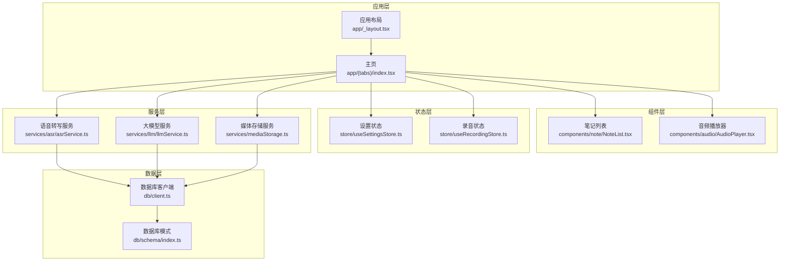
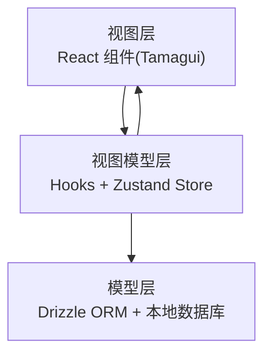
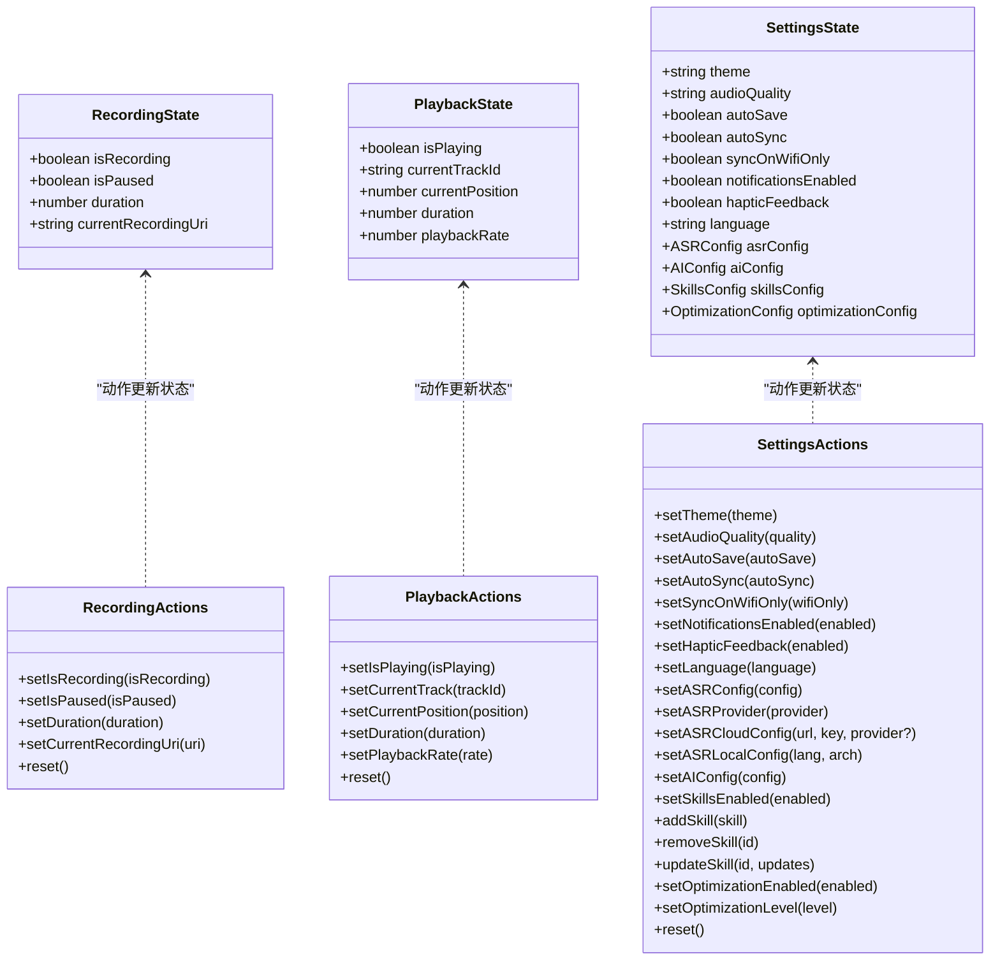
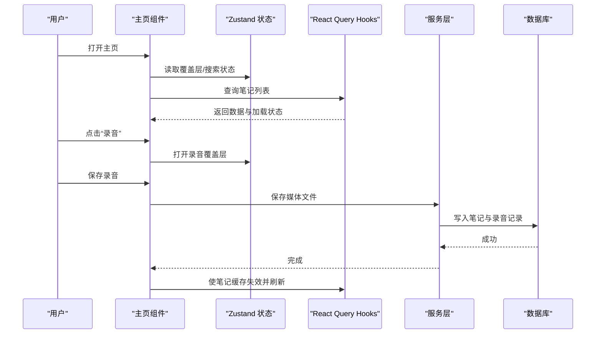
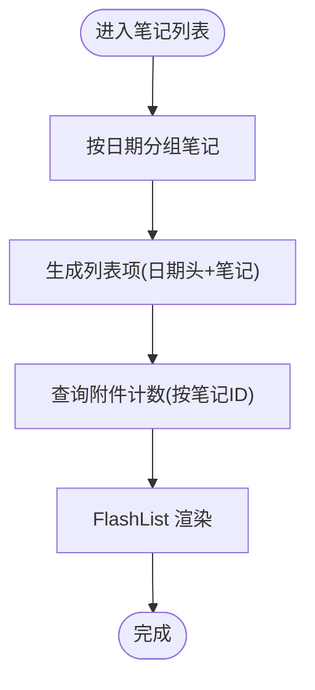
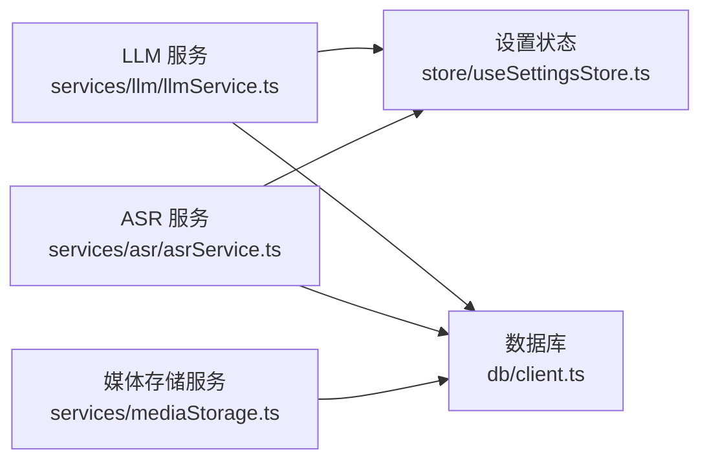
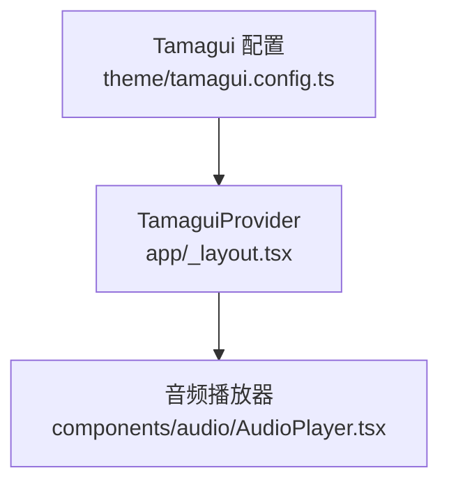
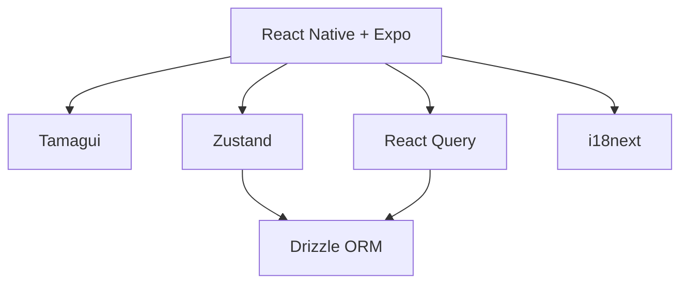

# 架构设计

<cite>
**本文引用的文件**
- [package.json](file://package.json)
- [app/_layout.tsx](file://app/_layout.tsx)
- [store/index.ts](file://store/index.ts)
- [theme/tamagui.config.ts](file://theme/tamagui.config.ts)
- [db/client.ts](file://db/client.ts)
- [store/useRecordingStore.ts](file://store/useRecordingStore.ts)
- [store/useSettingsStore.ts](file://store/useSettingsStore.ts)
- [components/note/NoteList.tsx](file://components/note/NoteList.tsx)
- [services/asr/asrService.ts](file://services/asr/asrService.ts)
- [services/llm/llmService.ts](file://services/llm/llmService.ts)
- [hooks/useNotes.ts](file://hooks/useNotes.ts)
- [db/schema/index.ts](file://db/schema/index.ts)
- [components/audio/AudioPlayer.tsx](file://components/audio/AudioPlayer.tsx)
- [services/mediaStorage.ts](file://services/mediaStorage.ts)
- [app/(tabs)/index.tsx](file://app/(tabs)/index.tsx)
</cite>

## 目录
1. [引言](#引言)
2. [项目结构](#项目结构)
3. [核心组件](#核心组件)
4. [架构总览](#架构总览)
5. [详细组件分析](#详细组件分析)
6. [依赖分析](#依赖分析)
7. [性能考量](#性能考量)
8. [故障排查指南](#故障排查指南)
9. [结论](#结论)
10. [附录](#附录)

## 引言
本项目采用 React Native + Expo 技术栈，结合 MVVM 架构思想与 Zustand 状态管理，构建跨平台语音笔记应用。系统以 Tamagui 作为 UI 框架，Drizzle ORM 进行本地数据库访问，React Query 管理远程数据缓存，服务层通过统一接口抽象 AI/ASR/LLM 等能力，并通过 Hooks 将业务逻辑与视图解耦。本文档系统化阐述整体架构、组件层次、状态管理策略、数据流设计、模块化原则与可扩展性，并给出架构图表与交互流程图。

## 项目结构
项目采用按功能域划分的模块化组织方式：
- 应用入口与路由：app/_layout.tsx 提供全局 Provider 包裹与路由配置
- 组件层：components 下按功能域拆分音频、输入、导航、笔记、设置等子目录
- 状态层：store 下按领域拆分认证、录音播放、设置、搜索、覆盖层等状态
- 数据层：db/schema 定义表结构，db/client 初始化 Drizzle 并执行迁移
- 服务层：services 下按能力域拆分 ASR、LLM、媒体存储、搜索、技能等
- 钩子层：hooks 将查询、变更、批处理等业务逻辑封装为可复用 Hook
- 主题与 UI：theme/tamagui.config.ts 定义主题、动画与令牌；components/ui 提供基础 UI 组件
- 类型与国际化：types 定义类型，i18n 提供多语言资源

**图表来源**
- [app/_layout.tsx:1-101](file://app/_layout.tsx#L1-L101)
- [app/(tabs)/index.tsx:1-497](file://app/(tabs)/index.tsx#L1-L497)
- [store/useSettingsStore.ts:1-218](file://store/useSettingsStore.ts#L1-L218)
- [store/useRecordingStore.ts:1-71](file://store/useRecordingStore.ts#L1-L71)
- [services/asr/asrService.ts:1-74](file://services/asr/asrService.ts#L1-L74)
- [services/llm/llmService.ts:1-61](file://services/llm/llmService.ts#L1-L61)
- [services/mediaStorage.ts:1-123](file://services/mediaStorage.ts#L1-L123)
- [db/schema/index.ts:1-75](file://db/schema/index.ts#L1-L75)
- [db/client.ts:1-15](file://db/client.ts#L1-L15)

**章节来源**
- [package.json:1-83](file://package.json#L1-L83)
- [app/_layout.tsx:1-101](file://app/_layout.tsx#L1-L101)
- [app/(tabs)/index.tsx:1-497](file://app/(tabs)/index.tsx#L1-L497)

## 核心组件
- 全局 Provider 与路由：应用根布局在 app/_layout.tsx 中配置 Tamagui、国际化、手势与安全区域、React Query 缓存客户端，并定义 Stack 路由屏幕
- 状态管理：store 目录导出多个领域状态，包括设置、录音、播放、搜索、覆盖层等，均基于 Zustand 的 create API
- 数据库与模式：db/schema 定义 notes、recordings、mediaFiles、categories、inspirations 等表；db/client 初始化 Drizzle 并执行迁移
- 服务层：ASR 与 LLM 服务提供统一接口，支持本地与云端两种 Provider；媒体存储服务负责本地文件持久化与清理
- 组件层：NoteList 使用 FlashList 渲染长列表并集成 React Query 查询附件计数；AudioPlayer 基于 Tamagui 组件与 hooks 实现播放控制

**章节来源**
- [app/_layout.tsx:1-101](file://app/_layout.tsx#L1-L101)
- [store/index.ts:1-8](file://store/index.ts#L1-L8)
- [store/useSettingsStore.ts:1-218](file://store/useSettingsStore.ts#L1-L218)
- [store/useRecordingStore.ts:1-71](file://store/useRecordingStore.ts#L1-L71)
- [db/schema/index.ts:1-75](file://db/schema/index.ts#L1-L75)
- [db/client.ts:1-15](file://db/client.ts#L1-L15)
- [services/asr/asrService.ts:1-74](file://services/asr/asrService.ts#L1-L74)
- [services/llm/llmService.ts:1-61](file://services/llm/llmService.ts#L1-L61)
- [services/mediaStorage.ts:1-123](file://services/mediaStorage.ts#L1-L123)
- [components/note/NoteList.tsx:1-240](file://components/note/NoteList.tsx#L1-L240)
- [components/audio/AudioPlayer.tsx:1-132](file://components/audio/AudioPlayer.tsx#L1-L132)

## 架构总览
系统采用 MVVM 思想：
- 视图层（V）：React 组件，使用 Tamagui 提供一致的主题与动画体验
- 模型层（M）：Zustand 状态与 Drizzle ORM 数据模型，分别管理 UI 状态与持久化数据
- 视图模型层（VM）：Hooks 将查询、变更、批处理等业务逻辑封装为可复用的 ViewModel

**图表来源**
- [app/_layout.tsx:1-101](file://app/_layout.tsx#L1-L101)
- [hooks/useNotes.ts:1-217](file://hooks/useNotes.ts#L1-L217)
- [store/useSettingsStore.ts:1-218](file://store/useSettingsStore.ts#L1-L218)
- [db/client.ts:1-15](file://db/client.ts#L1-L15)

## 详细组件分析

### 状态管理与全局状态设计（Zustand）
- 录音状态：useRecordingStore 管理录音与暂停状态、时长、当前录音 URI，并提供重置方法
- 播放状态：usePlaybackStore 管理播放/暂停、当前轨道、进度、时长与播放速率
- 设置状态：useSettingsStore 管理主题、音频质量、自动保存/同步、通知、触觉反馈、语言、ASR/LLM 配置、技能与优化配置，并通过 persist 中间件持久化到 AsyncStorage
- 导出聚合：store/index.ts 统一导出各领域状态，便于在组件中按需引入

**图表来源**
- [store/useRecordingStore.ts:1-71](file://store/useRecordingStore.ts#L1-L71)
- [store/useSettingsStore.ts:1-218](file://store/useSettingsStore.ts#L1-L218)

**章节来源**
- [store/index.ts:1-8](file://store/index.ts#L1-L8)
- [store/useRecordingStore.ts:1-71](file://store/useRecordingStore.ts#L1-L71)
- [store/useSettingsStore.ts:1-218](file://store/useSettingsStore.ts#L1-L218)

### 组件层次与交互（主页）
- 主页 app/(tabs)/index.tsx 聚合笔记列表、分类视图、灵感视图、底部导航与多种输入覆盖层
- 使用 React Query Hooks 获取笔记数据，支持乐观更新与缓存失效
- 通过 Zustand 管理覆盖层状态与搜索状态，实现深链路打开覆盖层
- 与服务层协作：保存录音/文本/相机/附件时调用媒体存储与数据库写入

**图表来源**
- [app/(tabs)/index.tsx:1-497](file://app/(tabs)/index.tsx#L1-L497)
- [hooks/useNotes.ts:1-217](file://hooks/useNotes.ts#L1-L217)
- [services/mediaStorage.ts:1-123](file://services/mediaStorage.ts#L1-L123)
- [db/client.ts:1-15](file://db/client.ts#L1-L15)

**章节来源**
- [app/(tabs)/index.tsx:1-497](file://app/(tabs)/index.tsx#L1-L497)
- [hooks/useNotes.ts:1-217](file://hooks/useNotes.ts#L1-L217)

### 数据流设计（笔记列表渲染）
- 组件通过 useMemo 对笔记进行日期分组，生成带日期分隔的列表项
- 使用 FlashList 渲染长列表，提升滚动性能
- 通过 React Query 查询附件数量，按笔记 ID 列表批量获取并缓存

**图表来源**
- [components/note/NoteList.tsx:1-240](file://components/note/NoteList.tsx#L1-L240)
- [hooks/useNotes.ts:1-217](file://hooks/useNotes.ts#L1-L217)

**章节来源**
- [components/note/NoteList.tsx:1-240](file://components/note/NoteList.tsx#L1-L240)
- [hooks/useNotes.ts:1-217](file://hooks/useNotes.ts#L1-L217)

### 服务层架构（ASR/LLM/媒体存储）
- ASR 服务：根据设置中的 ASR 配置构造请求，限制超时时间，返回转写文本
- LLM 服务：统一本地 llama.cpp 与云端 Provider 接口，支持流式与非流式响应
- 媒体存储服务：确保媒体目录存在，复制文件至本地目录，提供清理孤儿文件能力

**图表来源**
- [services/asr/asrService.ts:1-74](file://services/asr/asrService.ts#L1-L74)
- [services/llm/llmService.ts:1-61](file://services/llm/llmService.ts#L1-L61)
- [store/useSettingsStore.ts:1-218](file://store/useSettingsStore.ts#L1-L218)
- [services/mediaStorage.ts:1-123](file://services/mediaStorage.ts#L1-L123)
- [db/client.ts:1-15](file://db/client.ts#L1-L15)

**章节来源**
- [services/asr/asrService.ts:1-74](file://services/asr/asrService.ts#L1-L74)
- [services/llm/llmService.ts:1-61](file://services/llm/llmService.ts#L1-L61)
- [services/mediaStorage.ts:1-123](file://services/mediaStorage.ts#L1-L123)

### UI 架构（Tamagui）
- 主题与令牌：theme/tamagui.config.ts 定义字体、颜色、间距、圆角、动画与主题
- Provider 包裹：app/_layout.tsx 在根部注入 TamaguiProvider 与 Theme，支持明暗主题切换
- 组件使用：AudioPlayer 等组件直接使用 Tamagui 组件与样式令牌，保证一致性

**图表来源**
- [theme/tamagui.config.ts:1-163](file://theme/tamagui.config.ts#L1-L163)
- [app/_layout.tsx:1-101](file://app/_layout.tsx#L1-L101)
- [components/audio/AudioPlayer.tsx:1-132](file://components/audio/AudioPlayer.tsx#L1-L132)

**章节来源**
- [theme/tamagui.config.ts:1-163](file://theme/tamagui.config.ts#L1-L163)
- [app/_layout.tsx:1-101](file://app/_layout.tsx#L1-L101)
- [components/audio/AudioPlayer.tsx:1-132](file://components/audio/AudioPlayer.tsx#L1-L132)

### 路由系统设计
- 路由容器：Stack 路由在 app/_layout.tsx 中定义，包含标签页、录音、相机、文本、附件、笔记详情、录音详情与模型设置等屏幕
- 动画与头部：统一设置页面动画与头部样式，支持深链路处理

**章节来源**
- [app/_layout.tsx:1-101](file://app/_layout.tsx#L1-L101)

## 依赖分析
- 技术栈依赖：Expo、React Native、Tamagui、Zustand、React Query、Drizzle ORM、i18next 等
- 组件与状态：组件通过 hooks 与 Zustand 状态交互，避免跨层级传递
- 服务与数据：服务层通过 Drizzle ORM 访问本地数据库，React Query 管理远端数据缓存

**图表来源**
- [package.json:1-83](file://package.json#L1-L83)
- [app/_layout.tsx:1-101](file://app/_layout.tsx#L1-L101)
- [db/client.ts:1-15](file://db/client.ts#L1-L15)

**章节来源**
- [package.json:1-83](file://package.json#L1-L83)

## 性能考量
- 列表渲染：使用 FlashList 替代 FlatList，减少内存占用与重绘
- 查询缓存：React Query 默认缓存策略与手动失效，避免重复网络请求
- 本地持久化：Zustand 持久化中间件仅存储必要设置，降低存储压力
- 数据库索引：为常用过滤字段建立索引，提升查询性能

[本节为通用指导，无需具体文件分析]

## 故障排查指南
- ASR 转写失败：检查设置中的 ASR API 地址与密钥是否配置，确认网络可达与超时时间合理
- LLM 未配置：检查 AI Provider 类型与云端 API Key/URL 或本地模型路径
- 媒体文件缺失：确认媒体目录存在与权限，检查数据库中是否存在对应记录
- 笔记列表空白：确认查询键与缓存失效逻辑正确，检查 enabled 条件与数据格式

**章节来源**
- [services/asr/asrService.ts:1-74](file://services/asr/asrService.ts#L1-L74)
- [services/llm/llmService.ts:1-61](file://services/llm/llmService.ts#L1-L61)
- [services/mediaStorage.ts:1-123](file://services/mediaStorage.ts#L1-L123)
- [hooks/useNotes.ts:1-217](file://hooks/useNotes.ts#L1-L217)

## 结论
本项目通过 Tamagui 提供一致的 UI 体验，Zustand 管理轻量状态，React Query 处理数据缓存，Drizzle ORM 访问本地数据库，服务层统一抽象 AI/ASR/LLM 能力。模块化设计与 Hooks 抽象使得组件职责清晰、可测试性强、易于扩展。未来可在以下方面演进：完善错误边界与日志上报、引入依赖注入容器、增强离线同步策略、扩展更多 AI 能力与插件化模块。

[本节为总结性内容，无需具体文件分析]

## 附录
- 架构演进历史与未来规划：建议以版本号记录重大架构变更（如引入 Zustand、切换 UI 框架、新增服务层），并在 README 或变更日志中维护
- 技术决策权衡：
  - Zustand vs Redux：Zustand 更贴近函数式思维，API 更简洁，适合中小型应用；Redux 更成熟且生态丰富，适合大型复杂应用
  - Tamagui vs 其他 UI 框架：Tamagui 提供主题系统与高性能组件，适合跨平台一致体验；其他框架可能在特定场景有更优方案
  - Expo：统一开发体验与打包流程，适合快速迭代与跨平台发布

[本节为概念性内容，无需具体文件分析]