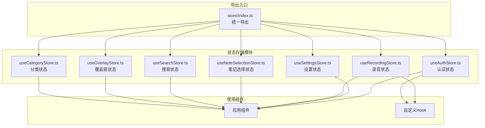
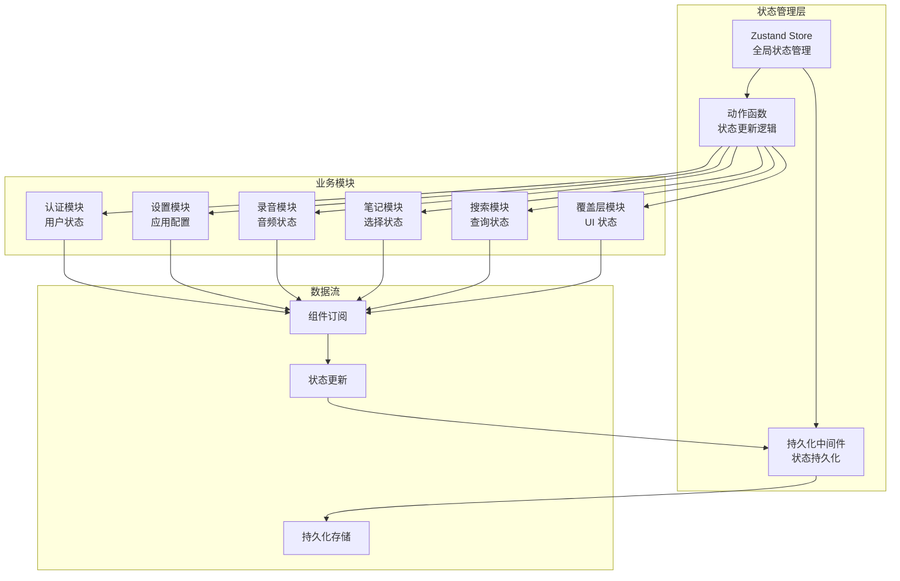
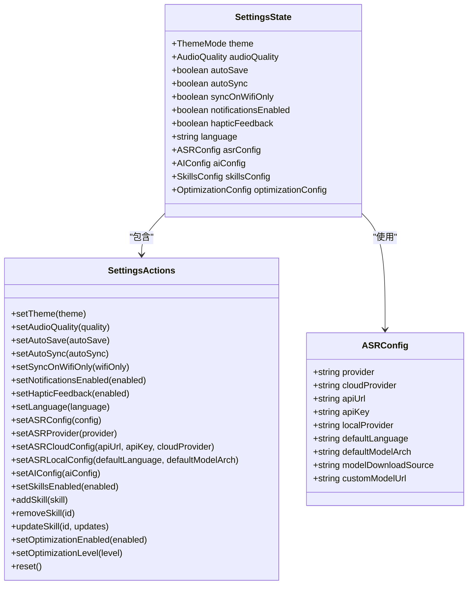
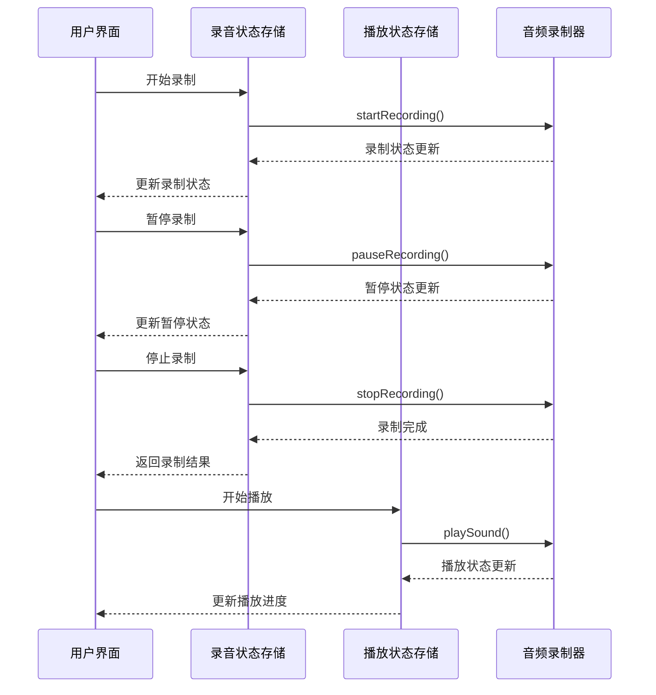
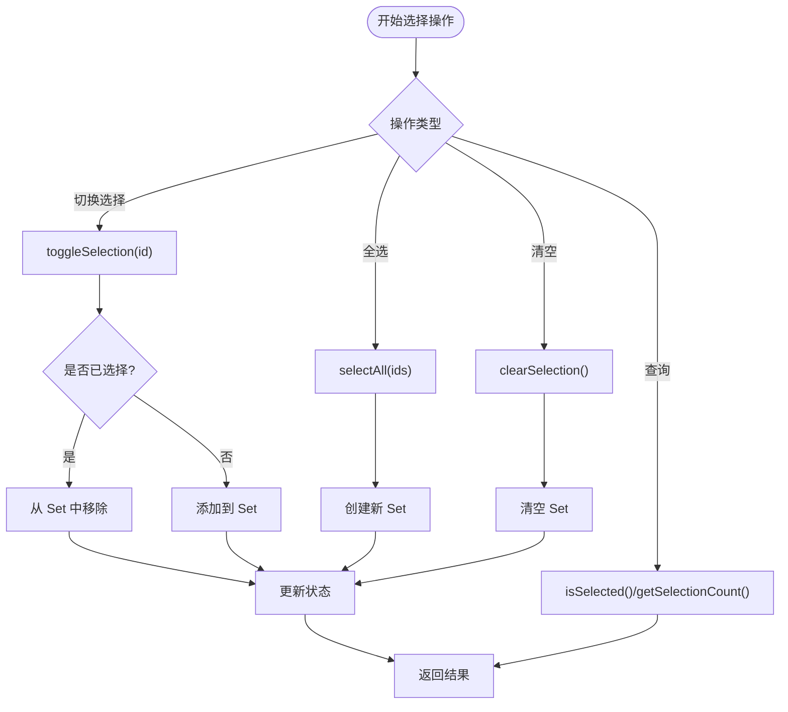
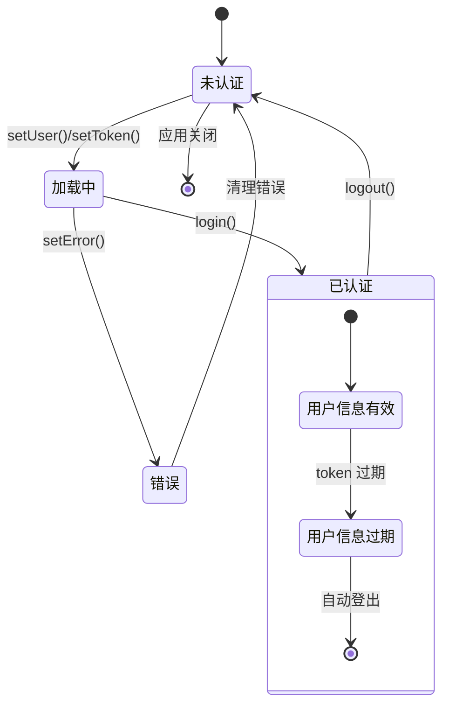
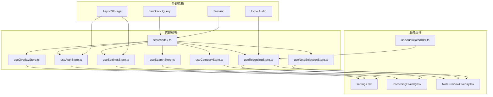

# 状态管理架构

<cite>
**本文档引用的文件**
- [store/index.ts](file://store/index.ts)
- [useSettingsStore.ts](file://store/useSettingsStore.ts)
- [useRecordingStore.ts](file://store/useRecordingStore.ts)
- [useNoteSelectionStore.ts](file://store/useNoteSelectionStore.ts)
- [useAuthStore.ts](file://store/useAuthStore.ts)
- [useSearchStore.ts](file://store/useSearchStore.ts)
- [useOverlayStore.ts](file://store/useOverlayStore.ts)
- [useCategoryStore.ts](file://store/useCategoryStore.ts)
- [state-management.md](file://.trellis/spec/frontend/state-management.md)
- [useAudioRecorder.ts](file://hooks/useAudioRecorder.ts)
- [settings.tsx](file://app/(tabs)/settings.tsx)
- [RecordingOverlay.tsx](file://components/input/RecordingOverlay.tsx)
- [NotePreviewOverlay.tsx](file://components/note/NotePreviewOverlay.tsx)
</cite>

## 目录
1. [简介](#简介)
2. [项目结构](#项目结构)
3. [核心组件](#核心组件)
4. [架构概览](#架构概览)
5. [详细组件分析](#详细组件分析)
6. [依赖关系分析](#依赖关系分析)
7. [性能考虑](#性能考虑)
8. [故障排除指南](#故障排除指南)
9. [结论](#结论)

## 简介

VoiceNote 项目采用 Zustand 作为主要的状态管理解决方案，构建了一个分层的状态管理架构。该架构通过将状态分为服务器状态、全局 UI 状态、本地状态和 URL 状态四个层次，实现了清晰的状态分离和最佳实践。

Zustand 的选择基于其简洁性、类型安全性和对移动端的良好支持。项目中使用了持久化中间件来实现状态的跨会话持久化，特别是对于用户偏好设置和认证信息等关键状态。

## 项目结构

项目的状态管理架构采用模块化设计，每个状态存储都是独立的模块，通过统一的导出入口进行管理：

**图表来源**
- [store/index.ts:1-8](file://store/index.ts#L1-L8)
- [useSettingsStore.ts:134-218](file://store/useSettingsStore.ts#L134-L218)
- [useRecordingStore.ts:25-71](file://store/useRecordingStore.ts#L25-L71)

**章节来源**
- [store/index.ts:1-8](file://store/index.ts#L1-L8)
- [.trellis/spec/frontend/state-management.md:1-140](file://.trellis/spec/frontend/state-management.md#L1-L140)

## 核心组件

### Zustand 状态管理库选择

项目选择 Zustand 的主要原因包括：

1. **简洁性**: 相比 Redux，Zustand 提供更少的样板代码和更直观的 API
2. **类型安全**: 完全的 TypeScript 支持，提供编译时类型检查
3. **移动端优化**: 对 React Native 和 Expo 有良好的原生支持
4. **持久化支持**: 内置持久化中间件，简化状态持久化实现
5. **性能**: 更小的包体积和更好的运行时性能

### 状态分区策略

项目采用四层状态分区架构：

| 状态类型 | 解决方案 | 存储位置 | 使用场景 |
|---------|----------|----------|----------|
| **服务器状态** | TanStack Query | `services/api/queries.ts` | API 数据缓存和同步 |
| **全局 UI 状态** | Zustand | `store/*.ts` | 跨屏幕 UI 状态 |
| **本地状态** | React useState | 组件级别 | 组件内部临时状态 |
| **URL 状态** | Expo Router 参数 | 屏幕组件 | 路由参数传递 |

**章节来源**
- [.trellis/spec/frontend/state-management.md:7-93](file://.trellis/spec/frontend/state-management.md#L7-L93)

## 架构概览

**图表来源**
- [useSettingsStore.ts:134-218](file://store/useSettingsStore.ts#L134-L218)
- [useAuthStore.ts:29-82](file://store/useAuthStore.ts#L29-L82)
- [useRecordingStore.ts:25-71](file://store/useRecordingStore.ts#L25-L71)

## 详细组件分析

### 设置状态存储 (useSettingsStore)

设置状态存储负责管理应用的各种配置选项，包括主题、音频质量、自动保存等功能。

**图表来源**
- [useSettingsStore.ts:9-45](file://store/useSettingsStore.ts#L9-L45)
- [useSettingsStore.ts:73-88](file://store/useSettingsStore.ts#L73-L88)

设置状态的关键特性：

1. **持久化存储**: 使用 `persist` 中间件将设置保存到 AsyncStorage
2. **配置合并**: 实现了复杂的合并逻辑以处理版本兼容性
3. **默认值管理**: 提供完整的默认配置对象
4. **环境变量集成**: 支持通过环境变量配置默认值

**章节来源**
- [useSettingsStore.ts:134-218](file://store/useSettingsStore.ts#L134-L218)

### 录音状态存储 (useRecordingStore)

录音状态存储管理音频录制和播放的完整生命周期。

**图表来源**
- [useRecordingStore.ts:25-71](file://store/useRecordingStore.ts#L25-L71)
- [useAudioRecorder.ts:79-175](file://hooks/useAudioRecorder.ts#L79-L175)

录音状态的两个子状态：

1. **录制状态**: 管理录制过程中的实时状态
2. **播放状态**: 管理音频播放的控制和进度

**章节来源**
- [useRecordingStore.ts:1-71](file://store/useRecordingStore.ts#L1-L71)

### 笔记选择状态存储 (useNoteSelectionStore)

笔记选择状态存储使用 Set 数据结构来高效管理多选状态。

**图表来源**
- [useNoteSelectionStore.ts:15-49](file://store/useNoteSelectionStore.ts#L15-L49)

**章节来源**
- [useNoteSelectionStore.ts:1-49](file://store/useNoteSelectionStore.ts#L1-L49)

### 认证状态存储 (useAuthStore)

认证状态存储管理用户认证相关的所有状态，包括用户信息、令牌和认证状态。

**图表来源**
- [useAuthStore.ts:29-82](file://store/useAuthStore.ts#L29-L82)

**章节来源**
- [useAuthStore.ts:1-82](file://store/useAuthStore.ts#L1-L82)

### 搜索状态存储 (useSearchStore)

搜索状态存储是最简单的状态存储之一，仅管理搜索界面的打开/关闭状态。

**章节来源**
- [useSearchStore.ts:1-14](file://store/useSearchStore.ts#L1-L14)

### 覆盖层状态存储 (useOverlayStore)

覆盖层状态存储管理应用中各种覆盖层界面的状态，如设置、相机、录音等。

**章节来源**
- [useOverlayStore.ts:1-16](file://store/useOverlayStore.ts#L1-L16)

### 分类状态存储 (useCategoryStore)

分类状态存储管理笔记分类相关的 UI 状态，包括过滤器、展开状态等。

**章节来源**
- [useCategoryStore.ts:1-56](file://store/useCategoryStore.ts#L1-L56)

## 依赖关系分析

**图表来源**
- [store/index.ts:1-8](file://store/index.ts#L1-L8)
- [useAudioRecorder.ts:1-270](file://hooks/useAudioRecorder.ts#L1-L270)

**章节来源**
- [store/index.ts:1-8](file://store/index.ts#L1-L8)

## 性能考虑

### 状态更新策略

1. **原子性更新**: 所有状态更新都通过 `set()` 函数进行，确保状态更新的原子性
2. **选择性订阅**: 组件只订阅需要的状态部分，减少不必要的重新渲染
3. **批量更新**: 复杂的状态更新通过单个 `set()` 调用完成

### 持久化优化

1. **增量持久化**: 使用 `partialize` 选项只持久化必要的状态字段
2. **合并策略**: 实现自定义合并逻辑处理版本升级
3. **异步存储**: 使用异步存储避免阻塞主线程

### 内存管理

1. **状态清理**: 提供 `reset()` 方法用于完全重置状态
2. **引用管理**: 合理使用引用避免循环引用问题
3. **垃圾回收**: 及时清理定时器和事件监听器

## 故障排除指南

### 常见问题及解决方案

1. **状态不持久化**
   - 检查 `persist` 中间件配置
   - 验证 `storage` 选项设置
   - 确认 `name` 选项唯一性

2. **状态更新不触发重渲染**
   - 确保组件正确订阅状态
   - 检查状态更新是否使用 `set()` 函数
   - 验证状态对象的引用变化

3. **内存泄漏**
   - 检查定时器是否正确清理
   - 确认事件监听器是否移除
   - 验证长生命周期对象的引用

### 调试技巧

1. **状态监控**: 使用浏览器开发者工具监控状态变化
2. **日志记录**: 在关键状态更新点添加日志
3. **单元测试**: 为复杂的状态逻辑编写测试用例

**章节来源**
- [.trellis/spec/frontend/state-management.md:124-137](file://.trellis/spec/frontend/state-management.md#L124-L137)

## 结论

VoiceNote 项目的状态管理架构通过精心设计的分层策略和 Zuste 的选择，成功实现了以下目标：

1. **清晰的职责分离**: 不同类型的状态被分配到最适合的管理方案
2. **良好的可维护性**: 模块化的状态存储便于理解和维护
3. **优秀的性能表现**: 通过选择性订阅和优化策略确保应用响应性
4. **可靠的用户体验**: 持久化机制确保用户状态的一致性和连续性

该架构为类似的应用程序提供了良好的参考模式，特别是在需要处理复杂 UI 状态和多媒体功能的场景中。通过遵循本文档中总结的最佳实践，开发团队可以构建出既高效又易于维护的状态管理系统。