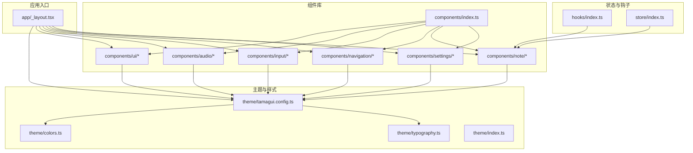
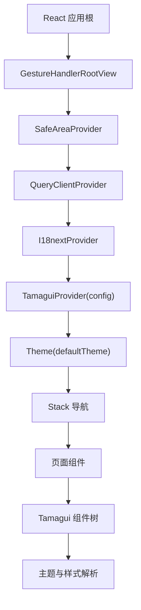
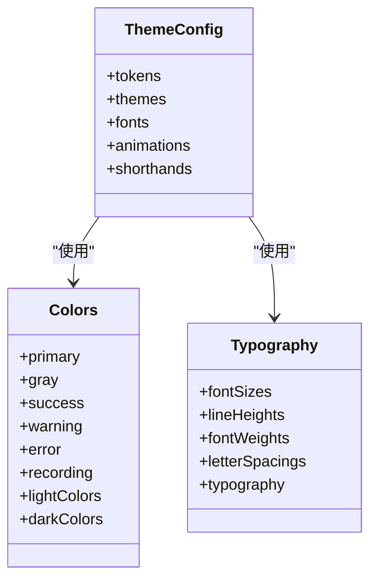
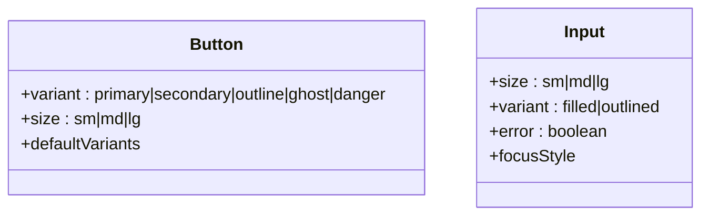
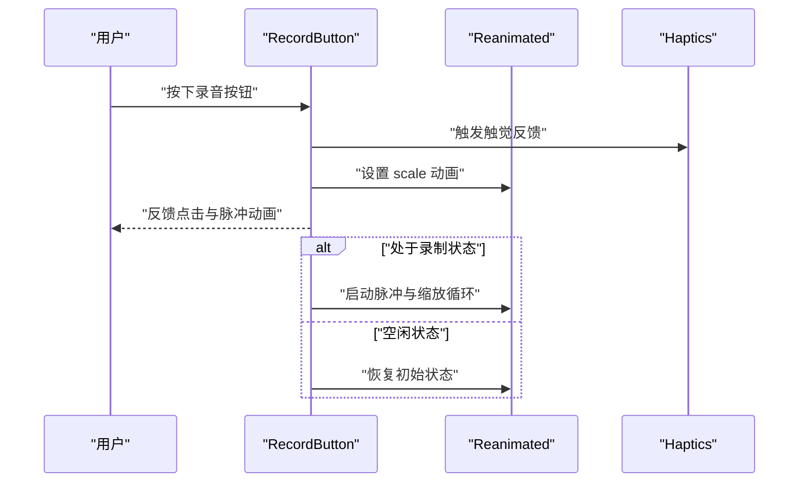
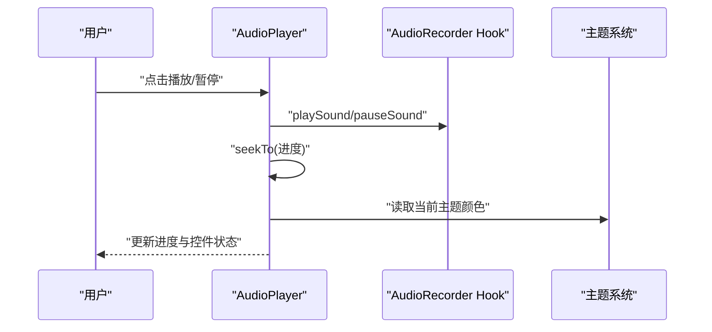
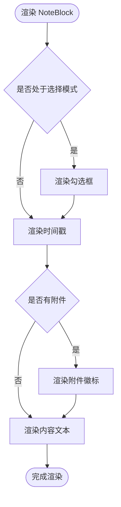
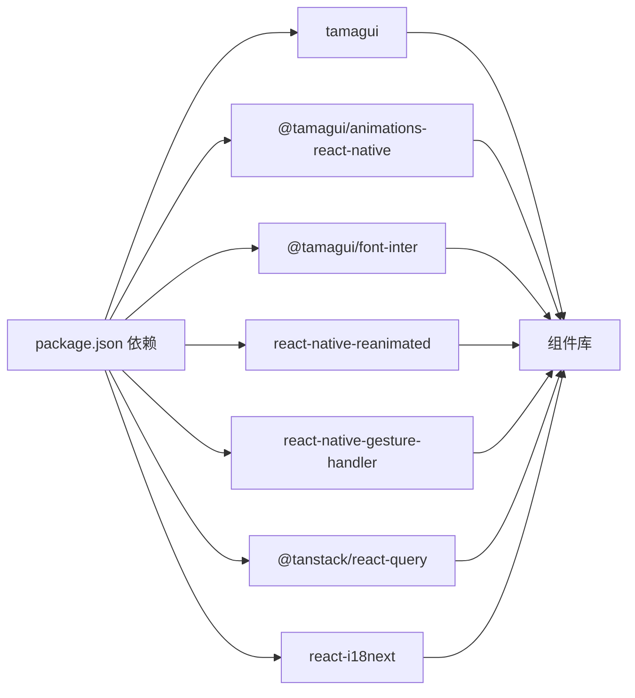

# 组件架构设计

<cite>
**本文档引用的文件**
- [app/_layout.tsx](file://app/_layout.tsx)
- [theme/tamagui.config.ts](file://theme/tamagui.config.ts)
- [theme/index.ts](file://theme/index.ts)
- [theme/colors.ts](file://theme/colors.ts)
- [theme/typography.ts](file://theme/typography.ts)
- [components/index.ts](file://components/index.ts)
- [components/ui/Button.tsx](file://components/ui/Button.tsx)
- [components/ui/Input.tsx](file://components/ui/Input.tsx)
- [components/input/RecordButton.tsx](file://components/input/RecordButton.tsx)
- [components/note/NoteBlock.tsx](file://components/note/NoteBlock.tsx)
- [components/navigation/AppHeader.tsx](file://components/navigation/AppHeader.tsx)
- [components/audio/AudioPlayer.tsx](file://components/audio/AudioPlayer.tsx)
- [hooks/index.ts](file://hooks/index.ts)
- [store/index.ts](file://store/index.ts)
- [package.json](file://package.json)
</cite>

## 目录
1. [引言](#引言)
2. [项目结构](#项目结构)
3. [核心组件](#核心组件)
4. [架构总览](#架构总览)
5. [详细组件分析](#详细组件分析)
6. [依赖分析](#依赖分析)
7. [性能考虑](#性能考虑)
8. [故障排除指南](#故障排除指南)
9. [结论](#结论)
10. [附录](#附录)

## 引言
本设计文档面向 VoiceNote 项目的组件架构，围绕基于 Tamagui 的 UI 架构进行系统性梳理与说明。内容涵盖主题系统与样式管理、组件库分层（基础 UI 组件、业务组件、复合组件）、复用与组合策略、组件间通信机制（Props 传递、事件处理、上下文共享）、响应式设计与跨平台适配，以及开发规范与最佳实践。目标是帮助开发者快速理解并高效扩展组件体系。

## 项目结构
VoiceNote 采用以功能域为中心的目录组织方式，结合 Tamagui 提供的主题与样式能力，形成清晰的组件层次与职责边界：
- 主题与样式：theme 目录集中定义颜色、字体、间距等设计令牌，并在 tamagui.config.ts 中统一注册到 Tamagui 配置中
- 组件库：components 目录按功能域拆分（ui、audio、camera、input、navigation、note、settings），每个域内提供基础组件与复合组件
- 应用入口：app/_layout.tsx 负责全局 Provider 包装（TamaguiProvider、I18nextProvider、QueryClientProvider 等）与主题初始化
- 状态与钩子：store 与 hooks 目录分别提供状态存储与业务逻辑钩子，支撑组件的数据与行为需求
- 依赖声明：package.json 明确了 Tamagui 及相关动画、国际化、查询缓存等依赖

图表来源
- [app/_layout.tsx:1-101](file://app/_layout.tsx#L1-L101)
- [theme/tamagui.config.ts:1-163](file://theme/tamagui.config.ts#L1-L163)
- [theme/colors.ts:1-102](file://theme/colors.ts#L1-L102)
- [theme/typography.ts:1-87](file://theme/typography.ts#L1-L87)
- [components/index.ts:1-6](file://components/index.ts#L1-L6)
- [hooks/index.ts:1-79](file://hooks/index.ts#L1-L79)
- [store/index.ts:1-8](file://store/index.ts#L1-L8)

章节来源
- [app/_layout.tsx:1-101](file://app/_layout.tsx#L1-L101)
- [theme/tamagui.config.ts:1-163](file://theme/tamagui.config.ts#L1-L163)
- [theme/index.ts:1-11](file://theme/index.ts#L1-L11)
- [components/index.ts:1-6](file://components/index.ts#L1-L6)
- [hooks/index.ts:1-79](file://hooks/index.ts#L1-L79)
- [store/index.ts:1-8](file://store/index.ts#L1-L8)

## 核心组件
本节聚焦于构成 UI 基础的组件与主题系统，阐明其职责与协作方式。

- 主题系统与样式管理
  - 设计令牌：颜色、字体、字号、行高、字重、字距、圆角、阴影、布局等
  - 主题映射：light/dark 两套主题，基于设计令牌生成具体颜色映射
  - 动画与简写：预设动画集合与常用样式简写，提升开发效率
  - 全局注入：TamaguiProvider 在应用根部注入配置，Theme 组件切换主题

- 基础 UI 组件
  - Button：支持多种变体与尺寸，具备默认变体与尺寸
  - Input：支持尺寸、填充/描边变体与错误态，具备聚焦态样式

- 业务组件示例
  - RecordButton：录音按钮，集成动画、脉冲效果与触觉反馈
  - AudioPlayer：音频播放器，包含进度条、播放控制与时间显示
  - AppHeader：应用头部，包含胶囊标签页与操作图标
  - NoteBlock：笔记块，支持选择模式、附件徽标与时间戳

章节来源
- [theme/tamagui.config.ts:1-163](file://theme/tamagui.config.ts#L1-L163)
- [theme/colors.ts:1-102](file://theme/colors.ts#L1-L102)
- [theme/typography.ts:1-87](file://theme/typography.ts#L1-L87)
- [components/ui/Button.tsx:1-57](file://components/ui/Button.tsx#L1-L57)
- [components/ui/Input.tsx:1-62](file://components/ui/Input.tsx#L1-L62)
- [components/input/RecordButton.tsx:1-131](file://components/input/RecordButton.tsx#L1-L131)
- [components/audio/AudioPlayer.tsx:1-132](file://components/audio/AudioPlayer.tsx#L1-L132)
- [components/navigation/AppHeader.tsx:1-84](file://components/navigation/AppHeader.tsx#L1-L84)
- [components/note/NoteBlock.tsx:1-171](file://components/note/NoteBlock.tsx#L1-L171)

## 架构总览
下图展示了应用启动时的 Provider 层叠、主题注入与组件渲染路径，体现基于 Tamagui 的主题系统如何贯穿全局。

图表来源
- [app/_layout.tsx:1-101](file://app/_layout.tsx#L1-L101)
- [theme/tamagui.config.ts:132-154](file://theme/tamagui.config.ts#L132-L154)

章节来源
- [app/_layout.tsx:1-101](file://app/_layout.tsx#L1-L101)
- [theme/tamagui.config.ts:132-154](file://theme/tamagui.config.ts#L132-L154)

## 详细组件分析

### 主题系统与样式管理
- 设计令牌与主题映射
  - 颜色：主色板、灰阶、语义色（成功/警告/错误）与录制专用色
  - 字体：标题与正文使用同一字体族，提供多级字号、字重与行高
  - 间距与圆角：统一的 size/radius/token 体系，便于跨组件一致性
  - 动画：提供默认、弹跳、懒散、快速等动画风格
- 全局配置
  - Tamagui 配置集中定义动画、字体、主题、令牌与简写
  - 类型声明扩展，确保类型安全
- 使用方式
  - 组件通过 Tamagui 的 styled 工厂创建，自动继承主题与样式
  - 文本、背景、边框等属性可直接使用主题令牌名

图表来源
- [theme/tamagui.config.ts:45-154](file://theme/tamagui.config.ts#L45-L154)
- [theme/colors.ts:1-102](file://theme/colors.ts#L1-L102)
- [theme/typography.ts:1-87](file://theme/typography.ts#L1-L87)

章节来源
- [theme/tamagui.config.ts:1-163](file://theme/tamagui.config.ts#L1-L163)
- [theme/colors.ts:1-102](file://theme/colors.ts#L1-L102)
- [theme/typography.ts:1-87](file://theme/typography.ts#L1-L87)

### 基础 UI 组件：Button 与 Input
- Button
  - 变体：primary、secondary、outline、ghost、danger
  - 尺寸：sm、md、lg
  - 默认变体与尺寸：保证最小可用配置
- Input
  - 变体：filled、outlined
  - 尺寸：sm、md、lg
  - 错误态：边框与聚焦态颜色变化
  - 聚焦态：边框加粗并切换颜色

图表来源
- [components/ui/Button.tsx:4-54](file://components/ui/Button.tsx#L4-L54)
- [components/ui/Input.tsx:4-59](file://components/ui/Input.tsx#L4-L59)

章节来源
- [components/ui/Button.tsx:1-57](file://components/ui/Button.tsx#L1-L57)
- [components/ui/Input.tsx:1-62](file://components/ui/Input.tsx#L1-L62)

### 业务组件：录音与播放
- RecordButton
  - 录制状态：脉冲动画、缩放与内层形状从圆形变为方形
  - 触觉反馈：Medium Impact
  - 动画：使用 react-native-reanimated 的共享值与动画序列
- AudioPlayer
  - 进度条：Tamagui Slider，支持拖动定位
  - 控制：播放/暂停、上一首/下一首按钮
  - 主题适配：根据深浅色主题切换背景与文字颜色

图表来源
- [components/input/RecordButton.tsx:86-99](file://components/input/RecordButton.tsx#L86-L99)
- [components/input/RecordButton.tsx:101-115](file://components/input/RecordButton.tsx#L101-L115)

图表来源
- [components/audio/AudioPlayer.tsx:37-47](file://components/audio/AudioPlayer.tsx#L37-L47)
- [components/audio/AudioPlayer.tsx:15-28](file://components/audio/AudioPlayer.tsx#L15-L28)

章节来源
- [components/input/RecordButton.tsx:1-131](file://components/input/RecordButton.tsx#L1-L131)
- [components/audio/AudioPlayer.tsx:1-132](file://components/audio/AudioPlayer.tsx#L1-L132)

### 复合组件：头部与笔记块
- AppHeader
  - 胶囊标签页：用于视图切换
  - 操作图标：搜索与更多菜单
  - 国际化：使用 react-i18next 提供的翻译
- NoteBlock
  - 选择模式：勾选框与选中态
  - 附件徽标：显示附件数量
  - 时间戳：固定在左上角
  - 内容展示：限制行数与颜色

图表来源
- [components/note/NoteBlock.tsx:31-116](file://components/note/NoteBlock.tsx#L31-L116)

章节来源
- [components/navigation/AppHeader.tsx:1-84](file://components/navigation/AppHeader.tsx#L1-L84)
- [components/note/NoteBlock.tsx:1-171](file://components/note/NoteBlock.tsx#L1-L171)

### 组件分层设计
- 基础 UI 组件：Button、Input 等通用组件，职责单一、无业务耦合
- 业务组件：RecordButton、AudioPlayer 等，封装业务交互与动画
- 复合组件：AppHeader、NoteBlock 等，组合多个基础/业务组件，承担页面级布局与交互
- 组合优先：通过 props 传递与组合而非继承实现扩展，保持低耦合高内聚

章节来源
- [components/ui/Button.tsx:1-57](file://components/ui/Button.tsx#L1-L57)
- [components/ui/Input.tsx:1-62](file://components/ui/Input.tsx#L1-L62)
- [components/input/RecordButton.tsx:1-131](file://components/input/RecordButton.tsx#L1-L131)
- [components/audio/AudioPlayer.tsx:1-132](file://components/audio/AudioPlayer.tsx#L1-L132)
- [components/navigation/AppHeader.tsx:1-84](file://components/navigation/AppHeader.tsx#L1-L84)
- [components/note/NoteBlock.tsx:1-171](file://components/note/NoteBlock.tsx#L1-L171)

### 组件间通信机制
- Props 传递：父组件向子组件传递数据与回调（如 isRecording、onPress）
- 事件处理：子组件通过回调向上抛出事件（如 onLongPress、onSearchPress）
- 上下文共享：Tamagui 主题上下文、国际化上下文、查询缓存上下文
- 状态共享：Zustand Store 与自定义 Hooks 共享业务状态（录音、设置、笔记选择等）

章节来源
- [components/input/RecordButton.tsx:43-47](file://components/input/RecordButton.tsx#L43-L47)
- [components/note/NoteBlock.tsx:8-18](file://components/note/NoteBlock.tsx#L8-L18)
- [components/navigation/AppHeader.tsx:11-16](file://components/navigation/AppHeader.tsx#L11-L16)
- [hooks/index.ts:1-79](file://hooks/index.ts#L1-L79)
- [store/index.ts:1-8](file://store/index.ts#L1-L8)

### 响应式设计与跨平台适配
- 主题适配：useColorScheme 自动选择 light/dark 主题，组件自动跟随
- 字体与排版：Tamagui 字体系统与行高配置，保证不同设备一致阅读体验
- 动画与手势：Reanimated 与 Gesture Handler 提供流畅动画与手势交互
- 平台差异：使用 Platform.select 或条件样式处理平台特定字体与行为

章节来源
- [app/_layout.tsx:27-41](file://app/_layout.tsx#L27-L41)
- [components/note/NoteBlock.tsx:25-29](file://components/note/NoteBlock.tsx#L25-L29)
- [components/input/RecordButton.tsx:50-51](file://components/input/RecordButton.tsx#L50-L51)

### 开发规范与最佳实践
- 组件命名：使用语义化名称，区分基础组件与业务组件
- 变体与尺寸：统一使用 variants 与 sizes，避免硬编码样式
- 主题使用：优先使用主题令牌名，避免直接写死颜色与尺寸
- 组合优于继承：通过 props 与 children 组合实现扩展
- 动画与性能：合理使用 Reanimated，避免在渲染路径中创建新对象
- 国际化：所有文案通过 i18n 注入，避免字符串硬编码
- 状态管理：业务状态使用 Zustand Store，UI 状态使用本地 useState

## 依赖分析
- 核心依赖
  - Tamagui：提供主题系统、组件库与样式解析
  - @tamagui/animations-react-native：提供动画能力
  - @tamagui/font-inter：提供字体配置
  - react-native-reanimated：提供高性能动画
  - react-native-gesture-handler：提供手势支持
  - @tanstack/react-query：提供数据获取与缓存
  - react-i18next：提供国际化支持
- 组件依赖
  - 组件通过 styled 工厂创建，自动继承主题配置
  - 业务组件依赖 hooks 与 store 提供的状态与行为

图表来源
- [package.json:20-62](file://package.json#L20-L62)

章节来源
- [package.json:1-83](file://package.json#L1-L83)

## 性能考虑
- 动画性能：使用 Reanimated 的共享值与原生驱动动画，减少 JS 线程压力
- 渲染优化：避免在渲染函数中创建新对象；使用 memo 化与稳定引用
- 主题切换：Theme 组件按需切换，避免不必要的重渲染
- 查询缓存：React Query 默认缓存策略降低网络请求频率
- 图片与媒体：使用 react-native-fast-image 等优化媒体加载

## 故障排除指南
- 主题不生效
  - 检查 TamaguiProvider 是否包裹应用根节点
  - 确认 Theme 组件已设置默认主题
- 动画异常
  - 确保 GestureHandlerRootView 包裹根视图
  - 检查 Reanimated 配置与版本兼容
- 国际化文案缺失
  - 确认 i18n 初始化与命名空间加载
- 查询缓存问题
  - 检查 QueryClientProvider 的配置与缓存键
- 组件样式错乱
  - 使用主题令牌名替代硬编码颜色与尺寸

章节来源
- [app/_layout.tsx:37-86](file://app/_layout.tsx#L37-L86)
- [package.json:20-62](file://package.json#L20-L62)

## 结论
VoiceNote 的组件架构以 Tamagui 为主题与样式核心，结合 hooks 与 store 实现状态与业务逻辑解耦，通过基础 UI 组件、业务组件与复合组件的分层设计，达成高内聚、低耦合与强复用的目标。组合优于继承的设计理念贯穿始终，配合主题系统、动画与手势能力，实现了良好的跨平台体验与可维护性。

## 附录
- 组件导出索引：components/index.ts 统一导出各域组件，便于模块化引入
- 主题导出：theme/index.ts 暴露颜色、字体、间距与配置，便于在组件中按需导入

章节来源
- [components/index.ts:1-6](file://components/index.ts#L1-L6)
- [theme/index.ts:1-11](file://theme/index.ts#L1-L11)