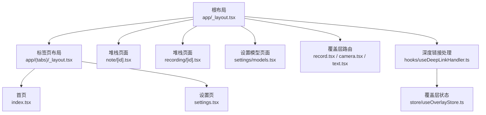
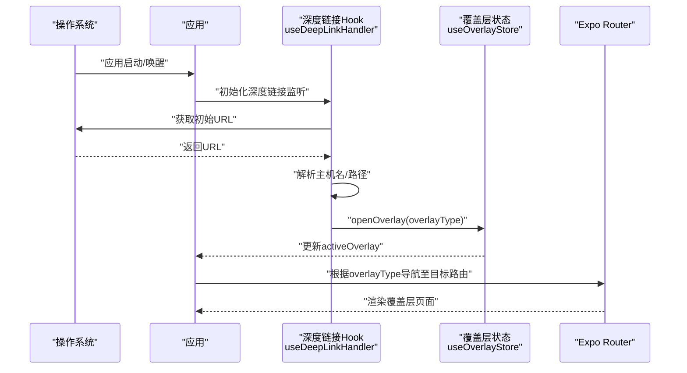
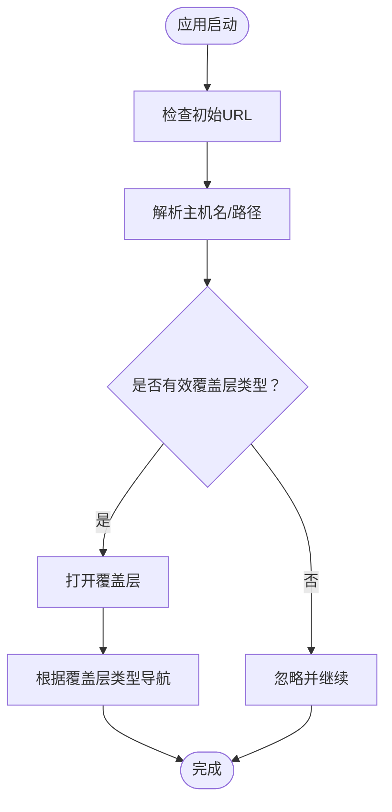
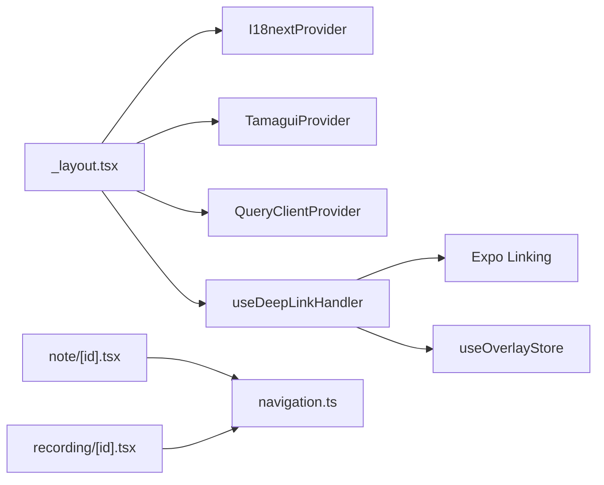

# 路由导航架构

<cite>
**本文档引用的文件**
- [app/_layout.tsx](file://app/_layout.tsx)
- [app/(tabs)/_layout.tsx](file://app/(tabs)/_layout.tsx)
- [hooks/useDeepLinkHandler.ts](file://hooks/useDeepLinkHandler.ts)
- [store/useOverlayStore.ts](file://store/useOverlayStore.ts)
- [components/navigation/BottomNavigation.tsx](file://components/navigation/BottomNavigation.tsx)
- [components/navigation/CapsuleTabs.tsx](file://components/navigation/CapsuleTabs.tsx)
- [components/navigation/AppHeader.tsx](file://components/navigation/AppHeader.tsx)
- [types/navigation.ts](file://types/navigation.ts)
- [app/index.tsx](file://app/index.tsx)
- [app/settings/models.tsx](file://app/settings/models.tsx)
- [app/note/[id].tsx](file://app/note/[id].tsx)
- [app/recording/[id].tsx](file://app/recording/[id].tsx)
- [app/(tabs)/settings.tsx](file://app/(tabs)/settings.tsx)
- [app/record.tsx](file://app/record.tsx)
- [app/camera.tsx](file://app/camera.tsx)
- [app/text.tsx](file://app/text.tsx)
- [store/useAuthStore.ts](file://store/useAuthStore.ts)
</cite>

## 目录
1. [简介](#简介)
2. [项目结构](#项目结构)
3. [核心组件](#核心组件)
4. [架构总览](#架构总览)
5. [详细组件分析](#详细组件分析)
6. [依赖关系分析](#依赖关系分析)
7. [性能考虑](#性能考虑)
8. [故障排除指南](#故障排除指南)
9. [结论](#结论)

## 简介
本文件系统性梳理 VoiceNote 项目的路由导航架构，基于 Expo Router 实现。重点覆盖以下方面：
- 页面路由与布局组织：根布局、标签页布局、页面级路由
- 深度链接与导航拦截：通过深度链接触发特定功能覆盖层
- 导航守卫与权限控制：当前项目未实现严格守卫，但具备扩展能力
- 标签页与堆栈导航：标签页导航用于主内容区切换，堆栈导航用于页面推进与模态展示
- 参数传递与状态保持：动态路由参数、全局状态管理、查询缓存
- 性能优化与懒加载：查询缓存、动画与渲染优化
- 深度链接配置与处理：主机名与路径解析、冷启动与热启动处理

## 项目结构
VoiceNote 的路由采用 Expo Router 的约定式路由，目录结构清晰地划分了不同层级：
- 根布局：定义全局 Provider、主题、国际化、状态栏与堆栈导航
- 标签页布局：定义底部标签页容器与子页面
- 页面路由：包含动态路由（如笔记详情、录音详情）与静态路由（如录制、相机、文本）
- 深度链接处理：通过 Hook 在应用启动时解析并触发覆盖层

图表来源
- [app/_layout.tsx:1-101](file://app/_layout.tsx#L1-L101)
- [app/(tabs)/_layout.tsx:1-16](file://app/(tabs)/_layout.tsx#L1-L16)
- [hooks/useDeepLinkHandler.ts:1-42](file://hooks/useDeepLinkHandler.ts#L1-L42)
- [store/useOverlayStore.ts:1-16](file://store/useOverlayStore.ts#L1-L16)

章节来源
- [app/_layout.tsx:1-101](file://app/_layout.tsx#L1-L101)
- [app/(tabs)/_layout.tsx:1-16](file://app/(tabs)/_layout.tsx#L1-L16)

## 核心组件
- 根布局与堆栈导航：集中定义全局 Provider、主题、国际化、状态栏样式与屏幕选项；声明所有页面路由及呈现方式（卡片/模态）
- 标签页布局：定义底部标签页容器，隐藏系统头部，承载主内容区页面
- 深度链接处理：解析 URL 主机名或路径，映射到覆盖层类型，并通过全局状态打开对应覆盖层
- 覆盖层状态：Zustand 全局状态管理覆盖层的开启/关闭
- 导航参数类型：通过类型声明约束动态路由参数，确保类型安全

章节来源
- [app/_layout.tsx:42-83](file://app/_layout.tsx#L42-L83)
- [app/(tabs)/_layout.tsx:5-13](file://app/(tabs)/_layout.tsx#L5-L13)
- [hooks/useDeepLinkHandler.ts:23-41](file://hooks/useDeepLinkHandler.ts#L23-L41)
- [store/useOverlayStore.ts:11-15](file://store/useOverlayStore.ts#L11-L15)
- [types/navigation.ts:3-21](file://types/navigation.ts#L3-L21)

## 架构总览
下图展示了从深度链接到覆盖层打开的完整流程，以及根布局对页面路由的统一管理。

图表来源
- [hooks/useDeepLinkHandler.ts:26-40](file://hooks/useDeepLinkHandler.ts#L26-L40)
- [store/useOverlayStore.ts:11-15](file://store/useOverlayStore.ts#L11-L15)
- [app/_layout.tsx:31](file://app/_layout.tsx#L31)

## 详细组件分析

### 根布局与堆栈导航
- 提供全局上下文：国际化、主题、手势处理、安全区域、查询缓存
- 定义屏幕选项：隐藏系统头部、滑动进入动画、背景色随主题变化
- 声明页面路由：
  - 标签页容器：`(tabs)`
  - 录制、相机、文本、附件覆盖层路由
  - 动态路由：`note/[id]`（卡片呈现）、`recording/[id]`（模态呈现）
  - 设置模型页面：`settings/models`（卡片呈现）

章节来源
- [app/_layout.tsx:26-101](file://app/_layout.tsx#L26-L101)

### 标签页布局
- 使用 `Tabs` 组件定义底部标签页容器
- 隐藏系统头部与标签栏，通过自定义头部组件提供胶囊标签与操作按钮
- 子页面：首页与设置页

章节来源
- [app/(tabs)/_layout.tsx:3-15](file://app/(tabs)/_layout.tsx#L3-L15)

### 深度链接与覆盖层机制
- 支持两种触发方式：
  - 冷启动：应用首次启动时读取初始 URL 并解析
  - 热启动：应用已在运行时接收新的 URL 并解析
- 解析规则：优先使用主机名，否则使用路径前缀；仅支持预定义的覆盖层类型
- 触发逻辑：解析成功后通过全局状态打开对应覆盖层，随后根据覆盖层类型导航到目标路由

图表来源
- [hooks/useDeepLinkHandler.ts:26-40](file://hooks/useDeepLinkHandler.ts#L26-L40)
- [store/useOverlayStore.ts:11-15](file://store/useOverlayStore.ts#L11-L15)

章节来源
- [hooks/useDeepLinkHandler.ts:12-41](file://hooks/useDeepLinkHandler.ts#L12-L41)
- [store/useOverlayStore.ts:3-15](file://store/useOverlayStore.ts#L3-L15)

### 覆盖层状态管理
- 类型定义：支持录制、相机、文本、附件、设置等覆盖层类型
- 行为：提供打开与关闭覆盖层的方法，维护当前激活的覆盖层类型

章节来源
- [store/useOverlayStore.ts:3-15](file://store/useOverlayStore.ts#L3-L15)

### 自定义导航组件
- 底部导航：提供录制主按钮与相机/附件/文本等动作按钮，支持动画与触觉反馈
- 胶囊标签：支持视图切换（记录/灵感），带指示器动画
- 应用头部：结合胶囊标签与搜索/更多按钮，提供统一的头部交互

章节来源
- [components/navigation/BottomNavigation.tsx:25-110](file://components/navigation/BottomNavigation.tsx#L25-L110)
- [components/navigation/CapsuleTabs.tsx:19-79](file://components/navigation/CapsuleTabs.tsx#L19-L79)
- [components/navigation/AppHeader.tsx:18-58](file://components/navigation/AppHeader.tsx#L18-L58)

### 动态路由与参数传递
- 笔记详情与录音详情：通过动态路由参数 `id` 获取并加载数据
- 参数类型：在类型声明中明确约束，确保类型安全
- 页面选项：动态设置标题与头部显示

章节来源
- [app/note/[id].tsx:6-36](file://app/note/[id].tsx#L6-L36)
- [app/recording/[id].tsx:6-45](file://app/recording/[id].tsx#L6-L45)
- [types/navigation.ts:5-7](file://types/navigation.ts#L5-L7)

### 设置模型页面
- 卡片式呈现：用于模型下载、取消、删除与状态展示
- 列表渲染：按语言与架构组合渲染模型项，支持进度条与错误提示

章节来源
- [app/settings/models.tsx:35-174](file://app/settings/models.tsx#L35-L174)

### 路由重定向与入口
- 首页重定向：默认重定向至标签页布局
- 覆盖层路由：录制、相机、文本路由均重定向至标签页布局，实际行为由覆盖层状态控制

章节来源
- [app/index.tsx:3-5](file://app/index.tsx#L3-L5)
- [app/record.tsx:3-5](file://app/record.tsx#L3-L5)
- [app/camera.tsx:3-5](file://app/camera.tsx#L3-L5)
- [app/text.tsx:3-5](file://app/text.tsx#L3-L5)

### 设置路由与深度链接兼容
- 设置路由：用于深度链接兼容，实际行为为打开设置覆盖层并重定向至首页

章节来源
- [app/(tabs)/settings.tsx:10-21](file://app/(tabs)/settings.tsx#L10-L21)

### 导航参数类型声明
- 根堆栈参数：定义 `(tabs)`、动态路由 `note/[id]`、`recording/[id]` 等
- 标签页参数：定义 `index`、`settings` 等

章节来源
- [types/navigation.ts:3-21](file://types/navigation.ts#L3-L21)

## 依赖关系分析
- 根布局依赖：
  - 国际化与主题：I18nextProvider、TamaguiProvider
  - 数据缓存：React Query（QueryClientProvider）
  - 深度链接：useDeepLinkHandler
- 深度链接处理依赖：
  - Expo Linking：解析 URL
  - 覆盖层状态：useOverlayStore
- 页面路由依赖：
  - 动态路由参数：useLocalSearchParams
  - 类型声明：navigation.ts

图表来源
- [app/_layout.tsx:37-87](file://app/_layout.tsx#L37-L87)
- [hooks/useDeepLinkHandler.ts:2-41](file://hooks/useDeepLinkHandler.ts#L2-L41)
- [store/useOverlayStore.ts:1-16](file://store/useOverlayStore.ts#L1-L16)
- [app/note/[id].tsx:1-80](file://app/note/[id].tsx#L1-L80)
- [app/recording/[id].tsx:1-115](file://app/recording/[id].tsx#L1-L115)
- [types/navigation.ts:1-22](file://types/navigation.ts#L1-L22)

章节来源
- [app/_layout.tsx:37-87](file://app/_layout.tsx#L37-L87)
- [hooks/useDeepLinkHandler.ts:2-41](file://hooks/useDeepLinkHandler.ts#L2-L41)
- [store/useOverlayStore.ts:1-16](file://store/useOverlayStore.ts#L1-L16)
- [app/note/[id].tsx:1-80](file://app/note/[id].tsx#L1-L80)
- [app/recording/[id].tsx:1-115](file://app/recording/[id].tsx#L1-L115)
- [types/navigation.ts:1-22](file://types/navigation.ts#L1-L22)

## 性能考虑
- 查询缓存与过期策略：React Query 默认查询缓存时间与过期时间，减少重复请求
- 渲染优化：动画组件使用 reanimated，避免不必要的重渲染
- 页面懒加载：Expo Router 的约定式路由天然支持页面级懒加载，减少首屏体积
- 图像与媒体：音频播放与波形可视化组件按需渲染，避免在非活跃页面进行资源占用

章节来源
- [app/_layout.tsx:16-24](file://app/_layout.tsx#L16-L24)
- [components/navigation/BottomNavigation.tsx:70-73](file://components/navigation/BottomNavigation.tsx#L70-L73)

## 故障排除指南
- 深度链接无效
  - 检查主机名或路径是否在允许列表中
  - 确认应用在冷启动与热启动时均正确注册事件监听
- 覆盖层无法打开
  - 确认覆盖层类型是否在状态管理中定义
  - 检查路由重定向逻辑是否正确执行
- 动态路由参数异常
  - 确认类型声明与实际传入参数一致
  - 检查页面内参数解析与数据加载逻辑

章节来源
- [hooks/useDeepLinkHandler.ts:5-21](file://hooks/useDeepLinkHandler.ts#L5-L21)
- [store/useOverlayStore.ts:3-15](file://store/useOverlayStore.ts#L3-L15)
- [types/navigation.ts:5-7](file://types/navigation.ts#L5-L7)

## 结论
VoiceNote 的路由导航架构以 Expo Router 为核心，结合全局状态与深度链接处理，实现了灵活的覆盖层触发与页面导航。根布局统一管理全局上下文与屏幕选项，标签页布局承载主内容区，动态路由与类型声明保障参数传递的安全性。未来可在以下方面进一步完善：
- 导航守卫与权限控制：基于认证状态在路由层面进行拦截与重定向
- 更细粒度的懒加载：对大型页面与资源进行按需加载
- 深度链接规范：统一主机名与路径命名，增强可维护性