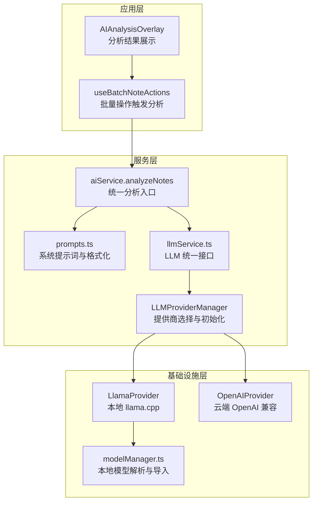
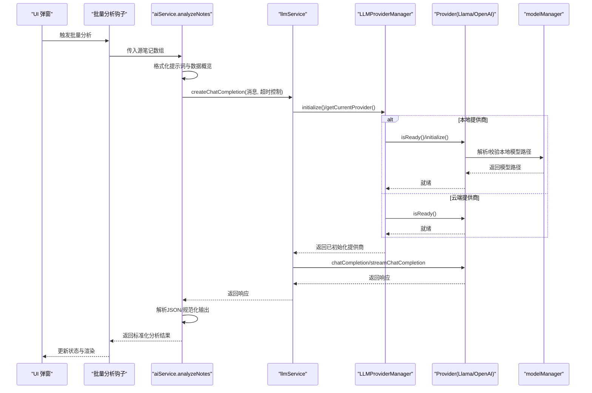
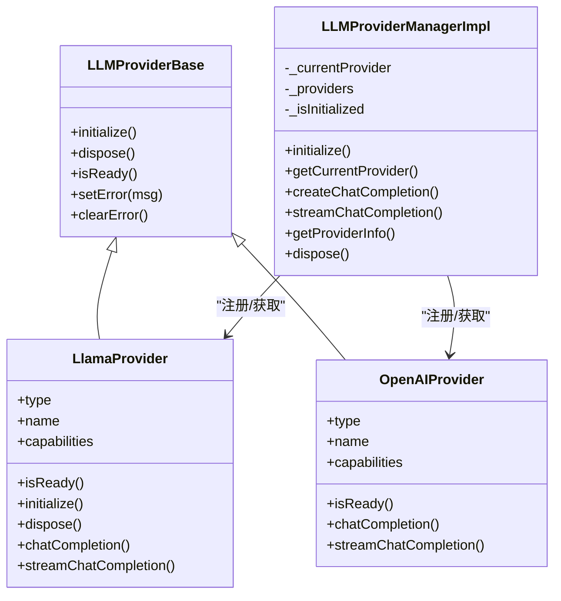

# AI 分析模块

<cite>
**本文档引用的文件**
- [services/ai/aiService.ts](file://services/ai/aiService.ts)
- [services/ai/prompts.ts](file://services/ai/prompts.ts)
- [services/ai/index.ts](file://services/ai/index.ts)
- [services/llm/llmService.ts](file://services/llm/llmService.ts)
- [services/llm/modelManager.ts](file://services/llm/modelManager.ts)
- [services/llm/providers/LLMProviderManager.ts](file://services/llm/providers/LLMProviderManager.ts)
- [services/llm/providers/local/LlamaProvider.ts](file://services/llm/providers/local/LlamaProvider.ts)
- [services/llm/providers/cloud/OpenAIProvider.ts](file://services/llm/providers/cloud/OpenAIProvider.ts)
- [services/llm/providers/base/LLMProviderBase.ts](file://services/llm/providers/base/LLMProviderBase.ts)
- [types/ai.ts](file://types/ai.ts)
- [types/llm.ts](file://types/llm.ts)
- [hooks/useBatchNoteActions.ts](file://hooks/useBatchNoteActions.ts)
- [components/note/AIAnalysisOverlay.tsx](file://components/note/AIAnalysisOverlay.tsx)
- [modules/moonshine/src/NativeMoonshineModule.ts](file://modules/moonshine/src/NativeMoonshineModule.ts)
- [services/asr/providers/local/MoonshineProvider.ts](file://services/asr/providers/local/MoonshineProvider.ts)
- [store/index.ts](file://store/index.ts)
</cite>

## 目录
1. [简介](#简介)
2. [项目结构](#项目结构)
3. [核心组件](#核心组件)
4. [架构总览](#架构总览)
5. [组件详解](#组件详解)
6. [依赖关系分析](#依赖关系分析)
7. [性能考量](#性能考量)
8. [故障排查指南](#故障排查指南)
9. [结论](#结论)
10. [附录](#附录)

## 简介
本文件系统性梳理 AI 分析模块的整体设计与实现，覆盖本地与云端 LLM 的统一接入、Moonshine 与 Llama 的本地 AI 集成、提示词工程与响应规范化、以及端到端的分析流程（文本分析、洞察生成、行动项提取）。文档同时提供调用示例路径、质量控制与错误处理机制，并给出扩展与性能优化建议，帮助开发者快速理解与迭代该模块。

## 项目结构
AI 分析模块由三层组成：
- 应用层：负责触发分析、展示结果与用户交互（如弹窗面板）。
- 服务层：封装 AI 服务与 LLM 统一接口，屏蔽本地/云端差异。
- 基础设施层：提供模型管理、提供商选择与运行时能力检测。

图表来源
- [components/note/AIAnalysisOverlay.tsx:241-299](file://components/note/AIAnalysisOverlay.tsx#L241-L299)
- [hooks/useBatchNoteActions.ts:156-197](file://hooks/useBatchNoteActions.ts#L156-L197)
- [services/ai/aiService.ts:126-162](file://services/ai/aiService.ts#L126-L162)
- [services/ai/prompts.ts:1-179](file://services/ai/prompts.ts#L1-L179)
- [services/llm/llmService.ts:32-50](file://services/llm/llmService.ts#L32-L50)
- [services/llm/providers/LLMProviderManager.ts:23-85](file://services/llm/providers/LLMProviderManager.ts#L23-L85)
- [services/llm/providers/local/LlamaProvider.ts:110-161](file://services/llm/providers/local/LlamaProvider.ts#L110-L161)
- [services/llm/providers/cloud/OpenAIProvider.ts:157-170](file://services/llm/providers/cloud/OpenAIProvider.ts#L157-L170)
- [services/llm/modelManager.ts:116-157](file://services/llm/modelManager.ts#L116-L157)

章节来源
- [services/ai/aiService.ts:1-163](file://services/ai/aiService.ts#L1-L163)
- [services/ai/prompts.ts:1-179](file://services/ai/prompts.ts#L1-L179)
- [services/llm/llmService.ts:1-61](file://services/llm/llmService.ts#L1-L61)
- [services/llm/providers/LLMProviderManager.ts:1-164](file://services/llm/providers/LLMProviderManager.ts#L1-L164)
- [services/llm/providers/local/LlamaProvider.ts:1-316](file://services/llm/providers/local/LlamaProvider.ts#L1-L316)
- [services/llm/providers/cloud/OpenAIProvider.ts:1-260](file://services/llm/providers/cloud/OpenAIProvider.ts#L1-L260)
- [services/llm/modelManager.ts:1-196](file://services/llm/modelManager.ts#L1-L196)
- [types/ai.ts:1-48](file://types/ai.ts#L1-L48)
- [types/llm.ts:1-93](file://types/llm.ts#L1-L93)
- [hooks/useBatchNoteActions.ts:156-197](file://hooks/useBatchNoteActions.ts#L156-L197)
- [components/note/AIAnalysisOverlay.tsx:1-466](file://components/note/AIAnalysisOverlay.tsx#L1-L466)

## 核心组件
- AI 分析服务（aiService.analyzeNotes）：统一入口，负责组织提示词、调用 LLM、解析并规范化响应。
- LLM 服务门面（llmService）：对外暴露 createChatCompletion/streamChatCompletion/getProviderInfo 等统一方法，内部委托 ProviderManager。
- Provider 管理器（LLMProviderManager）：根据配置选择本地（Llama）或云端（OpenAI 兼容）提供商，负责初始化与就绪态检查。
- 本地 LLM 提供商（LlamaProvider）：基于 llama.rn 运行 GGUF 模型，支持流式与非流式推理。
- 云端 LLM 提供商（OpenAIProvider）：通过 OpenAI 兼容接口发起请求，支持流式回包与降级。
- 模型管理（modelManager）：解析本地模型路径、校验有效性、导入外部模型。
- 提示词与格式化（prompts）：定义系统提示词、构建用户提示、格式化笔记输入。
- 类型定义（types/ai.ts、types/llm.ts）：统一数据结构与能力声明。
- UI 展示（AIAnalysisOverlay）：分析状态、错误提示、洞察与行动项展示、保存逻辑。
- 批量分析触发（useBatchNoteActions）：组装源笔记、调用 analyzeNotes 并更新 UI 状态。

章节来源
- [services/ai/aiService.ts:126-162](file://services/ai/aiService.ts#L126-L162)
- [services/llm/llmService.ts:32-50](file://services/llm/llmService.ts#L32-L50)
- [services/llm/providers/LLMProviderManager.ts:55-85](file://services/llm/providers/LLMProviderManager.ts#L55-L85)
- [services/llm/providers/local/LlamaProvider.ts:95-161](file://services/llm/providers/local/LlamaProvider.ts#L95-L161)
- [services/llm/providers/cloud/OpenAIProvider.ts:146-170](file://services/llm/providers/cloud/OpenAIProvider.ts#L146-L170)
- [services/llm/modelManager.ts:116-157](file://services/llm/modelManager.ts#L116-L157)
- [services/ai/prompts.ts:1-179](file://services/ai/prompts.ts#L1-L179)
- [types/ai.ts:1-48](file://types/ai.ts#L1-L48)
- [types/llm.ts:1-93](file://types/llm.ts#L1-L93)
- [components/note/AIAnalysisOverlay.tsx:115-239](file://components/note/AIAnalysisOverlay.tsx#L115-L239)
- [hooks/useBatchNoteActions.ts:156-197](file://hooks/useBatchNoteActions.ts#L156-L197)

## 架构总览
AI 分析模块采用“服务门面 + 提供商管理 + 本地/云端双栈”的架构，确保在不同部署环境下自动切换最优路径。本地模式下，通过 llama.rn 加载 GGUF 模型；云端模式下，通过 OpenAI 兼容接口调用远端模型。统一的提示词工程与响应规范化保证输出结构一致，便于 UI 渲染与后续处理。

图表来源
- [hooks/useBatchNoteActions.ts:156-197](file://hooks/useBatchNoteActions.ts#L156-L197)
- [services/ai/aiService.ts:126-162](file://services/ai/aiService.ts#L126-L162)
- [services/llm/llmService.ts:32-50](file://services/llm/llmService.ts#L32-L50)
- [services/llm/providers/LLMProviderManager.ts:55-85](file://services/llm/providers/LLMProviderManager.ts#L55-L85)
- [services/llm/providers/local/LlamaProvider.ts:110-161](file://services/llm/providers/local/LlamaProvider.ts#L110-L161)
- [services/llm/providers/cloud/OpenAIProvider.ts:162-202](file://services/llm/providers/cloud/OpenAIProvider.ts#L162-L202)
- [services/llm/modelManager.ts:116-157](file://services/llm/modelManager.ts#L116-L157)

## 组件详解

### AI 分析服务（aiService）
- 职责
  - 组织系统提示词与用户提示，将多条笔记格式化为统一输入。
  - 调用 LLM 服务获取回答，解析并规范化 JSON 结果。
  - 提供 isAIConfigured 判定配置可用性。
- 关键流程
  - 读取配置（API 地址、密钥、模型），构造消息列表。
  - 调用 createChatCompletion，设置超时与中断信号。
  - 从返回内容中抽取 JSON（容忍 Markdown 包裹），解析并规范化为统一结构。
- 错误处理
  - 空响应抛出明确错误。
  - JSON 抽取失败时保留原始内容以定位问题。
- 性能要点
  - 控制 max_tokens 与 temperature，平衡质量与速度。
  - 使用 AbortController 支持取消，避免长时间阻塞。

章节来源
- [services/ai/aiService.ts:126-162](file://services/ai/aiService.ts#L126-L162)
- [services/ai/prompts.ts:97-179](file://services/ai/prompts.ts#L97-L179)
- [services/ai/index.ts:1-2](file://services/ai/index.ts#L1-L2)

### LLM 服务门面（llmService）
- 职责
  - 对外暴露 isLLMConfigured、createChatCompletion、streamChatCompletion、getProviderInfo、getLocalModelInfo。
  - 在首次调用时初始化 ProviderManager，确保提供商可用。
- 设计要点
  - 通过 useSettingsStore 获取 provider 类型（local/cloud），默认 cloud。
  - 本地模式下返回 true，云端模式下需配置 apiUrl/apiKey。

章节来源
- [services/llm/llmService.ts:18-60](file://services/llm/llmService.ts#L18-L60)

### Provider 管理器（LLMProviderManager）
- 职责
  - 注册本地（Llama）与云端（OpenAI）提供商。
  - 根据首选类型选择并初始化提供商，检查就绪状态。
  - 提供 getProviderInfo 查询当前提供商能力与状态。
- 关键逻辑
  - 初始化时缓存提供商实例，避免重复创建。
  - 当前提供商变更时释放旧实例，确保资源回收。
  - 就绪失败时抛出带错误信息的异常，便于上层处理。

章节来源
- [services/llm/providers/LLMProviderManager.ts:18-161](file://services/llm/providers/LLMProviderManager.ts#L18-L161)

### 本地 LLM 提供商（LlamaProvider）
- 能力
  - 支持流式与非流式聊天补全。
  - 通过 llama.rn 初始化模型，支持上下文长度、线程数、GPU 层数、批大小等参数。
- 初始化与释放
  - isReady 通过 resolveLocalModelPath 校验模型路径。
  - initialize 会卸载旧模型、加载新模型并记录错误状态。
  - dispose 会停止生成、释放上下文并清理状态。
- 流式生成
  - 事件回调增量推送 token，首帧发送角色标记，末帧发送 finish_reason。
  - 支持 AbortSignal 中断，捕获中断并抛出明确错误。

章节来源
- [services/llm/providers/local/LlamaProvider.ts:95-316](file://services/llm/providers/local/LlamaProvider.ts#L95-L316)
- [services/llm/modelManager.ts:116-157](file://services/llm/modelManager.ts#L116-L157)

### 云端 LLM 提供商（OpenAIProvider）
- 能力
  - 支持流式与非流式聊天补全。
  - 通过 fetch 发起 OpenAI 兼容接口请求，支持超时与中断。
- 流式回包
  - 解析 SSE 格式的流式数据，逐段推送增量内容。
  - 不支持流式时回退为非流式一次性返回。
- 错误处理
  - 缺少配置时立即抛错。
  - HTTP 非 OK 状态码转换为错误信息。

章节来源
- [services/llm/providers/cloud/OpenAIProvider.ts:146-260](file://services/llm/providers/cloud/OpenAIProvider.ts#L146-L260)

### 模型管理（modelManager）
- 职责
  - 解析本地 GGUF 模型路径，校验文件大小与存在性。
  - 提供模型目录、列出模型、导入外部模型、解析固定模型名等能力。
- 关键点
  - 优先使用 EXPO_PUBLIC_AI_LOCAL_MODEL_PATH 或设置中的自定义路径。
  - 若未配置，尝试固定文件名与存储目录下的候选路径。
  - 导入模型时复制到应用可写目录，避免打包体积过大。

章节来源
- [services/llm/modelManager.ts:116-196](file://services/llm/modelManager.ts#L116-L196)

### 提示词与格式化（prompts）
- 系统提示词（ANALYSIS_SYSTEM_PROMPT）
  - 明确角色、分析框架（时间/内容/情绪）、行动转化原则（SMART+优先级）、输出约束与质量红线。
  - 输出严格限定为 JSON 结构，包含 summary、tags、keyInsights、actionItems、metadata。
- 用户提示构建
  - buildUserPrompt 将数据概览与笔记正文拼接为最终输入。
- 数据概览
  - formatNotesForAnalysis 计算时间跨度、高频标签、类型分布，作为上下文增强。

章节来源
- [services/ai/prompts.ts:1-179](file://services/ai/prompts.ts#L1-L179)

### 类型定义（types/ai.ts、types/llm.ts）
- AI 结果结构
  - EnhancedAIAnalysisResult：summary、tags、keyInsights、actionItems、metadata。
  - AIKeyInsight：content、type、confidence、evidence。
  - AIActionItem：title、description、priority、category、deadline。
  - AIMetadata：topicsIdentified、emotionalTone、timeRange、noteCount。
- LLM 接口
  - OpenAI 兼容的消息与响应结构，支持流式分片。
  - Provider 能力声明：supportsStreaming、supportsChat、requiresNetwork、requiresModelDownload。

章节来源
- [types/ai.ts:1-48](file://types/ai.ts#L1-L48)
- [types/llm.ts:1-93](file://types/llm.ts#L1-L93)

### UI 展示（AIAnalysisOverlay）
- 功能
  - 分析中：脉冲动画与进度条。
  - 成功：摘要、标签、洞察、行动项、源笔记链接、保存按钮。
  - 失败：错误信息与重试/关闭。
- 交互
  - 保存灵感卡片时触发 haptic 反馈与状态切换。
  - 源笔记点击回调跳转至对应笔记。

章节来源
- [components/note/AIAnalysisOverlay.tsx:115-239](file://components/note/AIAnalysisOverlay.tsx#L115-L239)

### 批量分析触发（useBatchNoteActions）
- 流程
  - 组装源笔记（含 id、title、content、createdAt、tags、type）。
  - 调用 analyzeNotes，更新 overlay 状态与结果。
  - 错误时设置 error 状态并提示。
- 与 AI 分析服务的衔接
  - 通过 services/ai/index.ts 导出的 analyzeNotes 与 normalizeAIResponse。

章节来源
- [hooks/useBatchNoteActions.ts:156-197](file://hooks/useBatchNoteActions.ts#L156-L197)
- [services/ai/index.ts:1-2](file://services/ai/index.ts#L1-L2)

### Moonshine 本地 ASR 与本地 AI 的关系
- MoonshineProvider（ASR）用于本地语音识别，与本地 AI（LlamaProvider）属于不同子系统，但共享“本地优先”的设计理念。
- MoonshineProvider 通过原生模块加载 ONNX 模型，支持实时流式转写，与 LlamaProvider 的本地推理互补。
- 两者均通过 ProviderManager/Provider 的模式实现“可用即用”的能力检测与初始化。

章节来源
- [services/asr/providers/local/MoonshineProvider.ts:1-307](file://services/asr/providers/local/MoonshineProvider.ts#L1-L307)
- [modules/moonshine/src/NativeMoonshineModule.ts:1-34](file://modules/moonshine/src/NativeMoonshineModule.ts#L1-L34)

## 依赖关系分析

图表来源
- [services/llm/providers/base/LLMProviderBase.ts](file://services/llm/providers/base/LLMProviderBase.ts)
- [services/llm/providers/local/LlamaProvider.ts:95-316](file://services/llm/providers/local/LlamaProvider.ts#L95-L316)
- [services/llm/providers/cloud/OpenAIProvider.ts:146-260](file://services/llm/providers/cloud/OpenAIProvider.ts#L146-L260)
- [services/llm/providers/LLMProviderManager.ts:18-161](file://services/llm/providers/LLMProviderManager.ts#L18-L161)

章节来源
- [services/llm/providers/LLMProviderManager.ts:18-161](file://services/llm/providers/LLMProviderManager.ts#L18-L161)
- [services/llm/providers/local/LlamaProvider.ts:95-316](file://services/llm/providers/local/LlamaProvider.ts#L95-L316)
- [services/llm/providers/cloud/OpenAIProvider.ts:146-260](file://services/llm/providers/cloud/OpenAIProvider.ts#L146-L260)

## 性能考量
- 本地推理
  - 合理设置 n_ctx、n_threads、n_gpu_layers、n_batch，平衡延迟与资源占用。
  - 使用流式输出减少首帧延迟，提升交互体验。
  - 在 dispose 时主动 stopCompletion 并 release，避免资源泄漏。
- 云端推理
  - 通过 AbortController 与超时控制避免长时间等待。
  - 在不支持流式环境时启用回退策略，保证可用性。
- 输入规模
  - 控制 max_tokens 与温度，避免过长上下文导致成本与延迟上升。
  - 对笔记进行必要的裁剪与去噪，提高单位信息密度。

[本节为通用性能建议，无需特定文件来源]

## 故障排查指南
- 本地模型不可用
  - 症状：LlamaProvider 报错“本地模型不可用”或 ProviderManager 报错“本地 LLM 未就绪”。
  - 排查：确认 EXPO_PUBLIC_AI_LOCAL_MODEL_PATH 或设置中的 localModelPath 是否指向有效 GGUF 文件；检查 modelManager 的解析与校验逻辑。
- 云端配置缺失
  - 症状：OpenAIProvider 报错“未配置 API 端点/密钥”。
  - 排查：检查 aiConfig.apiUrl/apiKey 或环境变量 EXPO_PUBLIC_AI_API_URL/EXPO_PUBLIC_AI_API_KEY。
- 流式回包异常
  - 症状：环境不支持流式或回包格式异常。
  - 排查：OpenAIProvider 已内置回退逻辑；若仍失败，检查网络与服务端兼容性。
- 响应解析失败
  - 症状：aiService 抽取 JSON 失败或规范化后字段为空。
  - 排查：确认提示词输出严格为 JSON；必要时开启日志打印原始内容以便定位。

章节来源
- [services/llm/providers/local/LlamaProvider.ts:120-161](file://services/llm/providers/local/LlamaProvider.ts#L120-L161)
- [services/llm/providers/cloud/OpenAIProvider.ts:157-202](file://services/llm/providers/cloud/OpenAIProvider.ts#L157-L202)
- [services/llm/modelManager.ts:116-157](file://services/llm/modelManager.ts#L116-L157)
- [services/ai/aiService.ts:34-46](file://services/ai/aiService.ts#L34-L46)

## 结论
AI 分析模块通过统一的 LLM 门面与 Provider 管理器，实现了本地与云端的无缝切换；结合严格的提示词工程与响应规范化，确保输出稳定可靠。Moonshine 与 Llama 的本地能力互补，既满足隐私需求又兼顾性能。建议在生产环境中完善监控与告警，持续优化模型参数与提示词，以获得更佳的用户体验。

[本节为总结性内容，无需特定文件来源]

## 附录

### 调用示例（代码片段路径）
- 触发批量分析与展示结果
  - [hooks/useBatchNoteActions.ts:156-197](file://hooks/useBatchNoteActions.ts#L156-L197)
  - [components/note/AIAnalysisOverlay.tsx:241-299](file://components/note/AIAnalysisOverlay.tsx#L241-L299)
- 调用 AI 分析服务
  - [services/ai/aiService.ts:126-162](file://services/ai/aiService.ts#L126-L162)
  - [services/ai/index.ts:1-2](file://services/ai/index.ts#L1-L2)
- 统一 LLM 接口
  - [services/llm/llmService.ts:32-50](file://services/llm/llmService.ts#L32-L50)
- 本地模型解析与导入
  - [services/llm/modelManager.ts:116-196](file://services/llm/modelManager.ts#L116-L196)
- Provider 选择与初始化
  - [services/llm/providers/LLMProviderManager.ts:55-85](file://services/llm/providers/LLMProviderManager.ts#L55-L85)
- 本地推理实现
  - [services/llm/providers/local/LlamaProvider.ts:184-305](file://services/llm/providers/local/LlamaProvider.ts#L184-L305)
- 云端推理实现
  - [services/llm/providers/cloud/OpenAIProvider.ts:162-249](file://services/llm/providers/cloud/OpenAIProvider.ts#L162-L249)

### 配置清单（关键键值）
- 本地模型路径
  - EXPO_PUBLIC_AI_LOCAL_MODEL_PATH
  - 设置项：aiConfig.localModelPath
- 云端 LLM
  - EXPO_PUBLIC_AI_PROVIDER：local 或 cloud（默认 cloud）
  - EXPO_PUBLIC_AI_API_URL：云端 API 地址
  - EXPO_PUBLIC_AI_API_KEY：访问密钥
  - EXPO_PUBLIC_AI_MODEL：模型名称
- 本地 LLM 参数（设置项）
  - aiConfig.localContextTokens
  - aiConfig.localThreads
  - aiConfig.localGpuLayers
  - aiConfig.localBatchSize

章节来源
- [services/llm/llmService.ts:18-30](file://services/llm/llmService.ts#L18-L30)
- [services/llm/providers/LLMProviderManager.ts:31-35](file://services/llm/providers/LLMProviderManager.ts#L31-L35)
- [services/llm/providers/local/LlamaProvider.ts:82-93](file://services/llm/providers/local/LlamaProvider.ts#L82-L93)
- [services/llm/modelManager.ts:54-65](file://services/llm/modelManager.ts#L54-L65)
- [store/index.ts:1-8](file://store/index.ts#L1-L8)