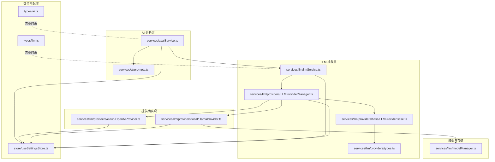
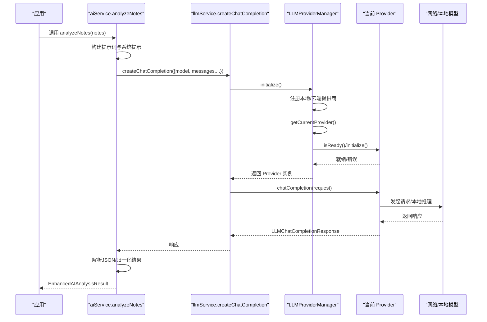
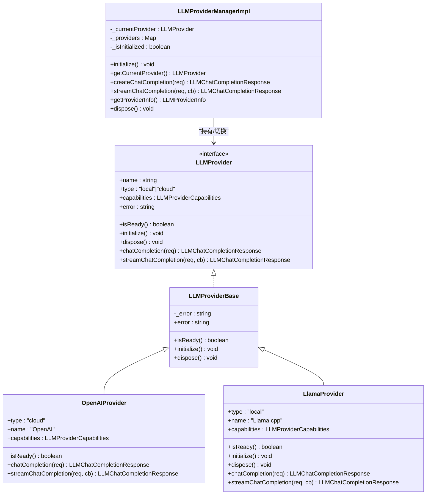
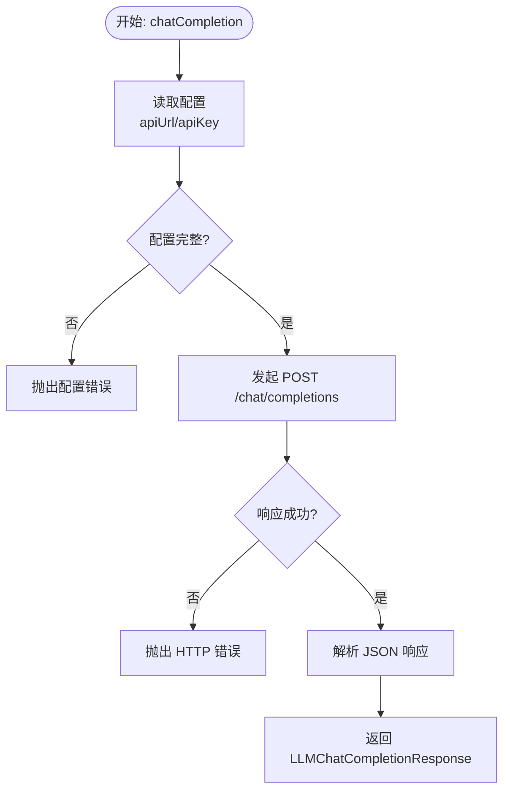
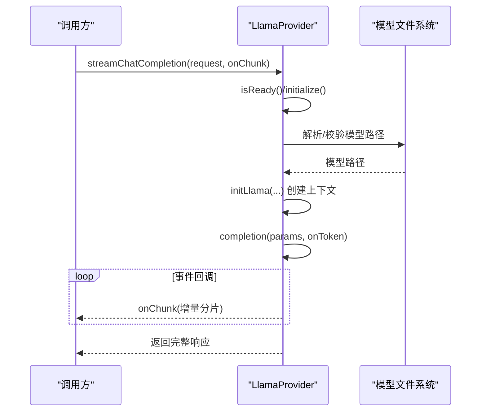
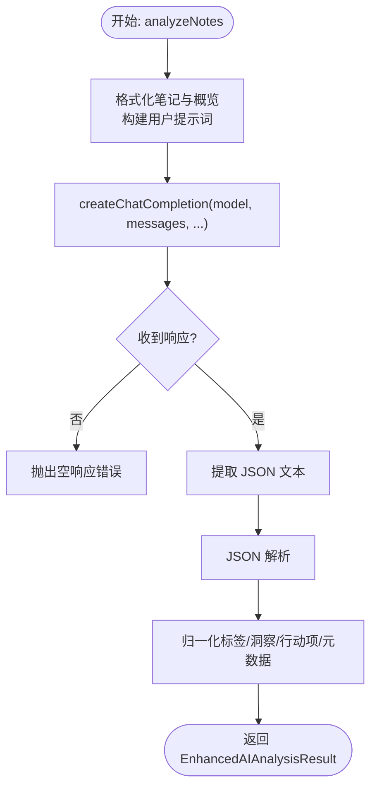
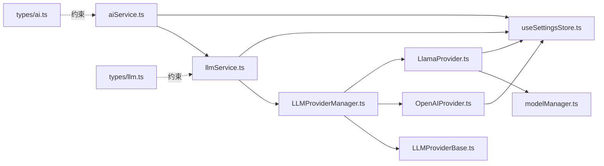

# AI 服务管理

<cite>
**本文档引用的文件**
- [services/ai/aiService.ts](file://services/ai/aiService.ts)
- [services/ai/prompts.ts](file://services/ai/prompts.ts)
- [services/llm/llmService.ts](file://services/llm/llmService.ts)
- [services/llm/providers/LLMProviderManager.ts](file://services/llm/providers/LLMProviderManager.ts)
- [services/llm/providers/base/LLMProviderBase.ts](file://services/llm/providers/base/LLMProviderBase.ts)
- [services/llm/providers/cloud/OpenAIProvider.ts](file://services/llm/providers/cloud/OpenAIProvider.ts)
- [services/llm/providers/local/LlamaProvider.ts](file://services/llm/providers/local/LlamaProvider.ts)
- [services/llm/providers/types.ts](file://services/llm/providers/types.ts)
- [services/llm/modelManager.ts](file://services/llm/modelManager.ts)
- [types/llm.ts](file://types/llm.ts)
- [types/ai.ts](file://types/ai.ts)
- [store/useSettingsStore.ts](file://store/useSettingsStore.ts)
- [services/index.ts](file://services/index.ts)
</cite>

## 目录
1. [简介](#简介)
2. [项目结构](#项目结构)
3. [核心组件](#核心组件)
4. [架构总览](#架构总览)
5. [组件详解](#组件详解)
6. [依赖关系分析](#依赖关系分析)
7. [性能与资源管理](#性能与资源管理)
8. [错误处理与重试策略](#错误处理与重试策略)
9. [配置与使用示例](#配置与使用示例)
10. [监控与日志](#监控与日志)
11. [扩展与自定义提供商指南](#扩展与自定义提供商指南)
12. [结论](#结论)

## 简介
本文件面向“AI 服务管理”的整体设计与实现，覆盖服务初始化、配置管理、生命周期控制、LLM 服务管理器的设计原理（提供商注册、就绪检查、初始化与释放）、配置项（API 端点、认证密钥、模型参数、本地模型路径与运行时参数）、错误处理与回退策略、性能监控与日志记录，以及扩展与自定义提供商的开发指南。文档以代码为依据，配合图示帮助读者快速理解系统架构与关键流程。

## 项目结构
AI 服务相关代码主要位于 services/ai 与 services/llm 下，前者负责 AI 分析流程与提示词工程，后者负责统一的 LLM Provider 管理与本地/云端提供商适配。类型定义集中在 types/ 目录，全局配置通过 store/useSettingsStore.ts 管理。

图表来源
- [services/ai/aiService.ts:1-163](file://services/ai/aiService.ts#L1-L163)
- [services/ai/prompts.ts:1-179](file://services/ai/prompts.ts#L1-L179)
- [services/llm/llmService.ts:1-61](file://services/llm/llmService.ts#L1-L61)
- [services/llm/providers/LLMProviderManager.ts:1-164](file://services/llm/providers/LLMProviderManager.ts#L1-L164)
- [services/llm/providers/base/LLMProviderBase.ts:1-42](file://services/llm/providers/base/LLMProviderBase.ts#L1-L42)
- [services/llm/providers/cloud/OpenAIProvider.ts:1-260](file://services/llm/providers/cloud/OpenAIProvider.ts#L1-L260)
- [services/llm/providers/local/LlamaProvider.ts:1-316](file://services/llm/providers/local/LlamaProvider.ts#L1-L316)
- [services/llm/providers/types.ts:1-30](file://services/llm/providers/types.ts#L1-L30)
- [services/llm/modelManager.ts:1-196](file://services/llm/modelManager.ts#L1-L196)
- [types/llm.ts:1-93](file://types/llm.ts#L1-L93)
- [types/ai.ts:1-48](file://types/ai.ts#L1-L48)
- [store/useSettingsStore.ts:1-218](file://store/useSettingsStore.ts#L1-L218)

章节来源
- [services/index.ts:1-7](file://services/index.ts#L1-L7)
- [store/useSettingsStore.ts:95-105](file://store/useSettingsStore.ts#L95-L105)

## 核心组件
- AI 分析服务（aiService.ts）：封装提示词构建、请求发送、响应解析与结果归一化；提供 isAIConfigured 与 analyzeNotes 等接口。
- LLM 统一服务（llmService.ts）：对外暴露 createChatCompletion/streamChatCompletion/getProviderInfo/getLocalModelInfo；内部委托 ProviderManager 完成提供商选择与调用。
- Provider 管理器（LLMProviderManager.ts）：注册本地/云端提供商，根据首选类型选择当前 Provider，负责初始化、就绪检查、错误传播与释放。
- 抽象基类（LLMProviderBase.ts）：定义 Provider 接口与通用能力（错误状态、isReady/initialize/dispose），子类仅需实现聊天与流式生成。
- 云端提供商（OpenAIProvider.ts）：兼容 OpenAI 协议，支持同步与流式返回，环境不支持时回退到非流式。
- 本地提供商（LlamaProvider.ts）：基于 llama.rn 运行 GGUF 模型，支持流式生成与中断；负责模型加载、上下文参数与资源释放。
- 模型管理（modelManager.ts）：解析/定位本地 GGUF 模型路径，提供目录、列举、导入与校验。
- 类型定义（types/llm.ts、types/ai.ts）：统一 LLM 请求/响应、分片、能力与 AI 结果结构。
- 配置中心（useSettingsStore.ts）：默认 AI 配置、环境变量注入、持久化存储。

章节来源
- [services/ai/aiService.ts:126-163](file://services/ai/aiService.ts#L126-L163)
- [services/llm/llmService.ts:32-61](file://services/llm/llmService.ts#L32-L61)
- [services/llm/providers/LLMProviderManager.ts:18-164](file://services/llm/providers/LLMProviderManager.ts#L18-L164)
- [services/llm/providers/base/LLMProviderBase.ts:8-42](file://services/llm/providers/base/LLMProviderBase.ts#L8-L42)
- [services/llm/providers/cloud/OpenAIProvider.ts:146-260](file://services/llm/providers/cloud/OpenAIProvider.ts#L146-L260)
- [services/llm/providers/local/LlamaProvider.ts:95-316](file://services/llm/providers/local/LlamaProvider.ts#L95-L316)
- [services/llm/modelManager.ts:116-196](file://services/llm/modelManager.ts#L116-L196)
- [types/llm.ts:12-93](file://types/llm.ts#L12-L93)
- [types/ai.ts:1-48](file://types/ai.ts#L1-L48)
- [store/useSettingsStore.ts:95-105](file://store/useSettingsStore.ts#L95-L105)

## 架构总览
下图展示了从应用调用到具体提供商的端到端流程，以及 Provider 管理器的提供商选择与就绪检查逻辑。

图表来源
- [services/ai/aiService.ts:126-163](file://services/ai/aiService.ts#L126-L163)
- [services/llm/llmService.ts:32-45](file://services/llm/llmService.ts#L32-L45)
- [services/llm/providers/LLMProviderManager.ts:55-90](file://services/llm/providers/LLMProviderManager.ts#L55-L90)
- [services/llm/providers/cloud/OpenAIProvider.ts:162-202](file://services/llm/providers/cloud/OpenAIProvider.ts#L162-L202)
- [services/llm/providers/local/LlamaProvider.ts:184-207](file://services/llm/providers/local/LlamaProvider.ts#L184-L207)

## 组件详解

### LLM Provider 管理器（Provider 选择、就绪检查与生命周期）
- 注册：启动时注册本地（llama）与云端（OpenAI 兼容）提供商。
- 选择：根据设置或环境变量确定首选类型，计算键值映射到已注册 Provider。
- 就绪检查：若当前 Provider 不可用，尝试 initialize 后再判断 isReady。
- 生命周期：切换 Provider 时先 dispose 旧实例；dispose 时释放本地上下文与停止生成。

图表来源
- [services/llm/providers/LLMProviderManager.ts:18-164](file://services/llm/providers/LLMProviderManager.ts#L18-L164)
- [services/llm/providers/base/LLMProviderBase.ts:8-42](file://services/llm/providers/base/LLMProviderBase.ts#L8-L42)
- [services/llm/providers/cloud/OpenAIProvider.ts:146-260](file://services/llm/providers/cloud/OpenAIProvider.ts#L146-L260)
- [services/llm/providers/local/LlamaProvider.ts:95-316](file://services/llm/providers/local/LlamaProvider.ts#L95-L316)
- [services/llm/providers/types.ts:14-30](file://services/llm/providers/types.ts#L14-L30)

章节来源
- [services/llm/providers/LLMProviderManager.ts:23-85](file://services/llm/providers/LLMProviderManager.ts#L23-L85)
- [services/llm/providers/LLMProviderManager.ts:148-161](file://services/llm/providers/LLMProviderManager.ts#L148-L161)

### 云端提供商（OpenAI 兼容）
- 能力：支持流式与聊天；需要网络；不需要模型下载。
- 初始化与就绪：通过配置检查（API 地址与密钥）判断就绪。
- 请求：构造 chat/completions 请求，支持流式与非流式；在不支持流式时回退到非流式并发出单个分片。
- 错误：网络错误、未配置、超时等均抛出异常。

图表来源
- [services/llm/providers/cloud/OpenAIProvider.ts:157-202](file://services/llm/providers/cloud/OpenAIProvider.ts#L157-L202)

章节来源
- [services/llm/providers/cloud/OpenAIProvider.ts:146-260](file://services/llm/providers/cloud/OpenAIProvider.ts#L146-L260)

### 本地提供商（Llama.cpp）
- 能力：支持流式与聊天；无需网络；需要模型下载与加载。
- 初始化：解析本地模型路径，调用 initLlama 并设置上下文参数（上下文长度、线程数、GPU 层数、批大小）。
- 流式生成：事件回调增量推送分片；支持 AbortSignal 中断；最终补发结束分片。
- 资源管理：dispose 时停止生成、释放上下文、清理状态。

图表来源
- [services/llm/providers/local/LlamaProvider.ts:110-161](file://services/llm/providers/local/LlamaProvider.ts#L110-L161)
- [services/llm/providers/local/LlamaProvider.ts:209-305](file://services/llm/providers/local/LlamaProvider.ts#L209-L305)
- [services/llm/modelManager.ts:116-196](file://services/llm/modelManager.ts#L116-L196)

章节来源
- [services/llm/providers/local/LlamaProvider.ts:95-316](file://services/llm/providers/local/LlamaProvider.ts#L95-L316)
- [services/llm/modelManager.ts:116-196](file://services/llm/modelManager.ts#L116-L196)

### AI 分析服务（提示词、请求与结果归一化）
- 提示词：系统提示词 + 用户提示词（数据概览 + 笔记正文）。
- 请求：调用 llmService.createChatCompletion，设置温度、最大 token 等参数。
- 响应：提取 JSON（支持代码块包裹），解析后归一化为 EnhancedAIAnalysisResult。
- 超时：使用 AbortController 控制请求超时。

图表来源
- [services/ai/aiService.ts:126-163](file://services/ai/aiService.ts#L126-L163)
- [services/ai/prompts.ts:97-179](file://services/ai/prompts.ts#L97-L179)

章节来源
- [services/ai/aiService.ts:17-163](file://services/ai/aiService.ts#L17-L163)
- [services/ai/prompts.ts:1-179](file://services/ai/prompts.ts#L1-179)

## 依赖关系分析
- aiService.ts 依赖 llmService.ts 与 store/useSettingsStore.ts，用于统一 LLM 调用与配置读取。
- llmService.ts 依赖 LLMProviderManager.ts 与 modelManager.ts，用于提供商选择与本地模型信息。
- LLMProviderManager.ts 依赖 LLMProviderBase.ts 与具体提供商（OpenAIProvider、LlamaProvider）。
- OpenAIProvider.ts 依赖 store/useSettingsStore.ts 获取配置。
- LlamaProvider.ts 依赖 modelManager.ts 解析模型路径并初始化本地上下文。
- types/llm.ts 与 types/ai.ts 为所有组件提供统一的数据契约。

图表来源
- [services/ai/aiService.ts:1-163](file://services/ai/aiService.ts#L1-L163)
- [services/llm/llmService.ts:1-61](file://services/llm/llmService.ts#L1-L61)
- [services/llm/providers/LLMProviderManager.ts:1-164](file://services/llm/providers/LLMProviderManager.ts#L1-L164)
- [services/llm/providers/base/LLMProviderBase.ts:1-42](file://services/llm/providers/base/LLMProviderBase.ts#L1-L42)
- [services/llm/providers/cloud/OpenAIProvider.ts:1-260](file://services/llm/providers/cloud/OpenAIProvider.ts#L1-L260)
- [services/llm/providers/local/LlamaProvider.ts:1-316](file://services/llm/providers/local/LlamaProvider.ts#L1-L316)
- [services/llm/modelManager.ts:1-196](file://services/llm/modelManager.ts#L1-L196)
- [types/llm.ts:1-93](file://types/llm.ts#L1-L93)
- [types/ai.ts:1-48](file://types/ai.ts#L1-L48)
- [store/useSettingsStore.ts:1-218](file://store/useSettingsStore.ts#L1-L218)

章节来源
- [services/llm/providers/LLMProviderManager.ts:18-29](file://services/llm/providers/LLMProviderManager.ts#L18-L29)
- [services/llm/providers/cloud/OpenAIProvider.ts:17-23](file://services/llm/providers/cloud/OpenAIProvider.ts#L17-L23)
- [services/llm/providers/local/LlamaProvider.ts:82-93](file://services/llm/providers/local/LlamaProvider.ts#L82-L93)

## 性能与资源管理
- 本地模型加载：LlamaProvider 在首次使用或切换模型时初始化上下文，避免重复加载；dispose 时释放上下文并停止生成，防止内存泄漏。
- 本地参数：上下文长度、线程数、GPU 层数、批大小可通过设置或环境变量调整，影响吞吐与延迟。
- 云端调用：OpenAIProvider 使用 AbortController 控制超时；流式传输在不支持时回退到非流式，保证可用性。
- 存储与模型路径：modelManager.ts 统一管理模型目录、列举与导入，确保模型文件有效（大小阈值）。

章节来源
- [services/llm/providers/local/LlamaProvider.ts:120-182](file://services/llm/providers/local/LlamaProvider.ts#L120-L182)
- [services/llm/providers/cloud/OpenAIProvider.ts:171-201](file://services/llm/providers/cloud/OpenAIProvider.ts#L171-L201)
- [services/llm/modelManager.ts:67-80](file://services/llm/modelManager.ts#L67-L80)
- [services/llm/modelManager.ts:42-52](file://services/llm/modelManager.ts#L42-L52)

## 错误处理与重试策略
- Provider 就绪失败：ProviderManager 在 ensureProviderReady 失败时抛出错误，错误消息来自 Provider.error 或默认提示（本地/云端）。
- 云端错误：OpenAIProvider 对未配置、HTTP 错误、流式不支持等情况分别处理并抛错。
- 本地错误：LlamaProvider 初始化失败或生成异常会设置错误状态并抛出；dispose 时忽略停止/卸载阶段的异常，保证资源回收。
- 重试机制：当前未实现自动重试；可在上层业务（如 aiService.ts 的调用侧）结合错误类型与状态码实现指数退避重试。

章节来源
- [services/llm/providers/LLMProviderManager.ts:41-85](file://services/llm/providers/LLMProviderManager.ts#L41-L85)
- [services/llm/providers/cloud/OpenAIProvider.ts:162-202](file://services/llm/providers/cloud/OpenAIProvider.ts#L162-L202)
- [services/llm/providers/local/LlamaProvider.ts:156-161](file://services/llm/providers/local/LlamaProvider.ts#L156-L161)
- [services/llm/providers/local/LlamaProvider.ts:163-182](file://services/llm/providers/local/LlamaProvider.ts#L163-L182)

## 配置与使用示例
- 配置来源与优先级
  - 默认值：store/useSettingsStore.ts 中定义默认 AI 配置（provider、apiUrl、apiKey、model、本地模型路径与运行时参数）。
  - 环境变量：EXPO_PUBLIC_AI_PROVIDER、EXPO_PUBLIC_AI_API_URL、EXPO_PUBLIC_AI_API_KEY、EXPO_PUBLIC_AI_MODEL、EXPO_PUBLIC_AI_LOCAL_MODEL_PATH、EXPO_PUBLIC_AI_LOCAL_CONTEXT_TOKENS、EXPO_PUBLIC_AI_LOCAL_THREADS、EXPO_PUBLIC_AI_LOCAL_GPU_LAYERS、EXPO_PUBLIC_AI_LOCAL_BATCH_SIZE。
  - 运行时覆盖：aiService.ts 与 llmService.ts 会优先使用设置存储中的 aiConfig，其次回退到环境变量。
- 使用步骤
  - 检查配置：调用 isAIConfigured/isLLMConfigured 判断是否可使用。
  - 发起分析：调用 analyzeNotes(notes) 获取增强分析结果。
  - 流式体验：调用 llmService.streamChatCompletion(request, onChunk) 获取增量输出。
- 关键参数
  - 模型参数：temperature、top_p、max_tokens、stop、signal。
  - 本地参数：localContextTokens、localThreads、localGpuLayers、localBatchSize、localModelPath。

章节来源
- [store/useSettingsStore.ts:95-105](file://store/useSettingsStore.ts#L95-L105)
- [services/ai/aiService.ts:21-28](file://services/ai/aiService.ts#L21-L28)
- [services/llm/llmService.ts:18-30](file://services/llm/llmService.ts#L18-L30)
- [services/llm/providers/cloud/OpenAIProvider.ts:17-23](file://services/llm/providers/cloud/OpenAIProvider.ts#L17-L23)
- [services/llm/providers/local/LlamaProvider.ts:82-93](file://services/llm/providers/local/LlamaProvider.ts#L82-L93)

## 监控与日志
- Provider 状态：llmProviderManager.getProviderInfo 返回当前 Provider 的状态（unavailable/ready/busy/error）与能力信息，可用于 UI 展示与诊断。
- 错误传播：ProviderBase 维护 error 字段，ProviderManager 在不可用时返回错误信息，便于上层捕获与上报。
- 日志建议：可在 Provider 的 initialize/chatCompletion/streamChatCompletion 中增加结构化日志（请求 ID、耗时、错误码），并在上层统一收集与上报。

章节来源
- [services/llm/providers/LLMProviderManager.ts:100-146](file://services/llm/providers/LLMProviderManager.ts#L100-L146)
- [services/llm/providers/base/LLMProviderBase.ts:13-25](file://services/llm/providers/base/LLMProviderBase.ts#L13-L25)

## 扩展与自定义提供商指南
- 新增提供商步骤
  - 实现 LLMProvider 接口：继承 LLMProviderBase，实现 isReady/initialize/dispose 与 chatCompletion/streamChatCompletion。
  - 注册提供商：在 LLMProviderManager.initialize 中将新提供商加入 _providers 映射表，并在 getProviderKey 中映射首选类型。
  - 配置与就绪：在 isReady 中检查必要条件（如网络、模型、许可证等），在 initialize 中完成初始化。
  - 资源管理：在 dispose 中释放资源，确保幂等。
- 本地模型集成（可选）
  - 若需要本地模型，参考 modelManager.ts 的模型路径解析与导入流程，确保模型文件有效。
- 类型与契约
  - 遵循 types/llm.ts 的请求/响应与分片结构，保证与现有调用方兼容。

章节来源
- [services/llm/providers/types.ts:14-30](file://services/llm/providers/types.ts#L14-L30)
- [services/llm/providers/base/LLMProviderBase.ts:8-42](file://services/llm/providers/base/LLMProviderBase.ts#L8-L42)
- [services/llm/providers/LLMProviderManager.ts:23-29](file://services/llm/providers/LLMProviderManager.ts#L23-L29)
- [services/llm/modelManager.ts:116-196](file://services/llm/modelManager.ts#L116-L196)

## 结论
该 AI 服务管理方案通过统一的 LLM Provider 管理器实现了本地与云端提供商的无缝切换，结合完善的配置中心与类型约束，提供了清晰的生命周期控制与错误传播机制。AI 分析服务在提示词工程与结果归一化方面提供了稳定的输出格式，便于前端消费。未来可在调用侧引入重试与熔断策略，并完善结构化日志与指标采集，进一步提升稳定性与可观测性。