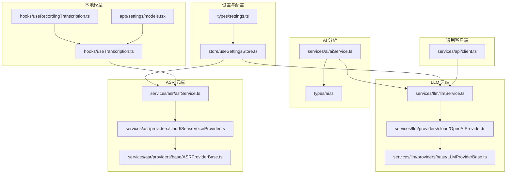
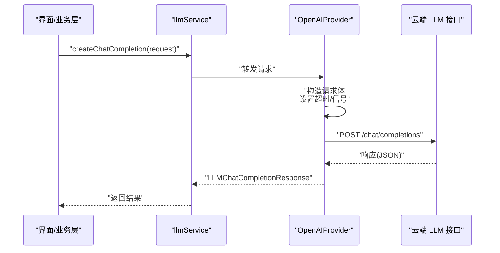
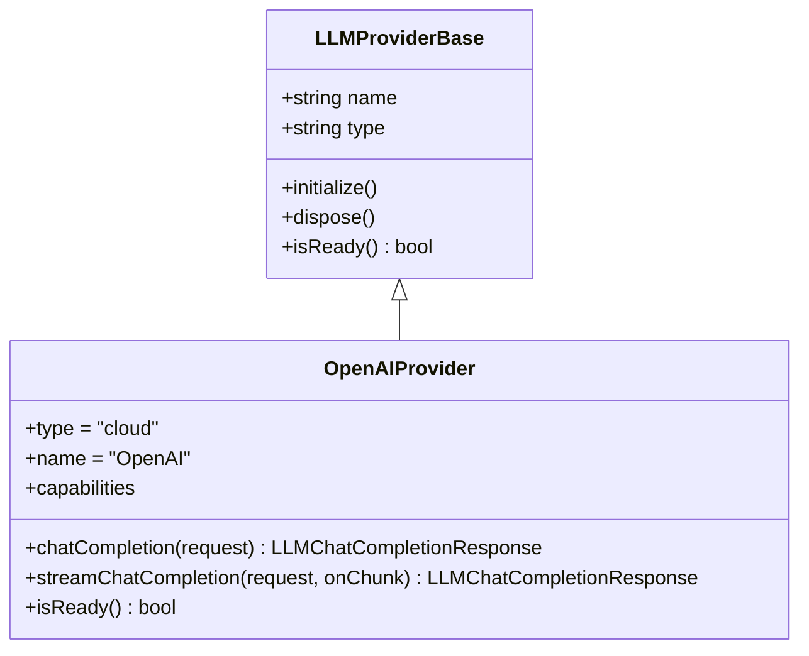
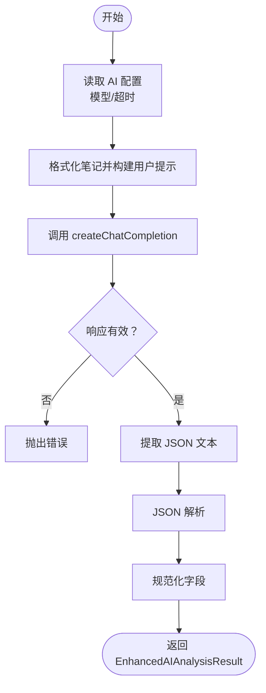
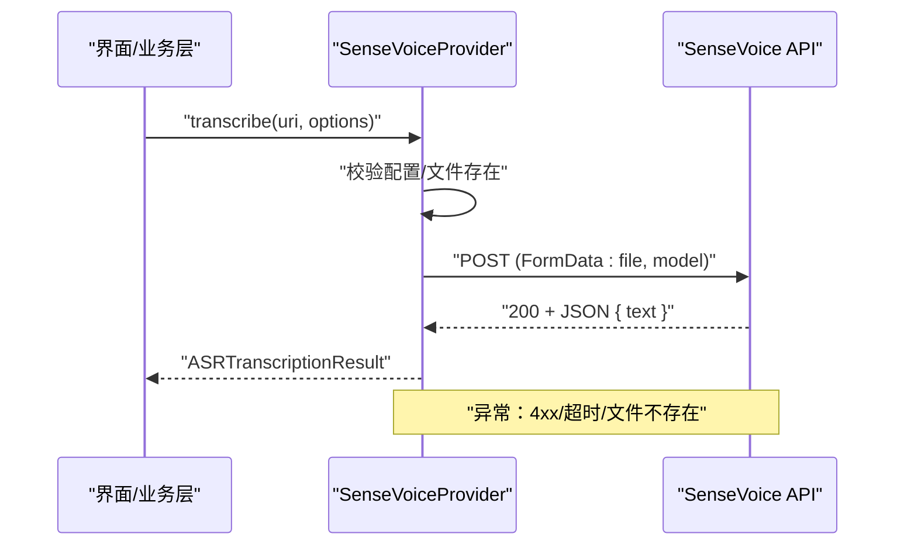
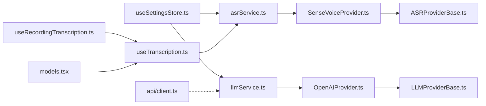

# 云端 AI 集成

<cite>
**本文引用的文件**
- [services/ai/aiService.ts](file://services/ai/aiService.ts)
- [services/llm/providers/cloud/OpenAIProvider.ts](file://services/llm/providers/cloud/OpenAIProvider.ts)
- [services/asr/providers/cloud/SenseVoiceProvider.ts](file://services/asr/providers/cloud/SenseVoiceProvider.ts)
- [services/llm/llmService.ts](file://services/llm/llmService.ts)
- [services/asr/asrService.ts](file://services/asr/asrService.ts)
- [store/useSettingsStore.ts](file://store/useSettingsStore.ts)
- [types/settings.ts](file://types/settings.ts)
- [types/ai.ts](file://types/ai.ts)
- [services/api/client.ts](file://services/api/client.ts)
- [services/llm/providers/base/LLMProviderBase.ts](file://services/llm/providers/base/LLMProviderBase.ts)
- [services/asr/providers/base/ASRProviderBase.ts](file://services/asr/providers/base/ASRProviderBase.ts)
- [hooks/useTranscription.ts](file://hooks/useTranscription.ts)
- [hooks/useRecordingTranscription.ts](file://hooks/useRecordingTranscription.ts)
- [app/settings/models.tsx](file://app/settings/models.tsx)
</cite>

## 目录
1. [简介](#简介)
2. [项目结构](#项目结构)
3. [核心组件](#核心组件)
4. [架构总览](#架构总览)
5. [详细组件分析](#详细组件分析)
6. [依赖关系分析](#依赖关系分析)
7. [性能与成本优化](#性能与成本优化)
8. [故障排除指南](#故障排除指南)
9. [结论](#结论)
10. [附录：配置与使用示例路径](#附录配置与使用示例路径)

## 简介
本文件面向云端 AI 集成，系统性阐述 VoiceNote 中的云端 AI 能力，包括：
- 云端 LLM（以 OpenAI 兼容接口为例）与云端 ASR（SenseVoice）的集成方式
- 认证、请求构建、流式与非流式响应处理
- 配置项（API 密钥、模型、超时等）
- 限流、超时与错误处理机制
- 成本控制与性能优化策略
- 监控与故障排除方法

## 项目结构
云端 AI 相关代码主要分布在以下模块：
- 设置与配置：store/useSettingsStore.ts、types/settings.ts
- LLM 云服务：services/llm/providers/cloud/OpenAIProvider.ts、services/llm/llmService.ts
- AI 分析服务：services/ai/aiService.ts、types/ai.ts
- ASR 云服务：services/asr/providers/cloud/SenseVoiceProvider.ts、services/asr/asrService.ts
- 基类与通用能力：services/llm/providers/base/LLMProviderBase.ts、services/asr/providers/base/ASRProviderBase.ts
- 本地模型管理与 UI：app/settings/models.tsx、hooks/useTranscription.ts、hooks/useRecordingTranscription.ts
- 通用 API 客户端：services/api/client.ts

图表来源
- [store/useSettingsStore.ts:1-218](file://store/useSettingsStore.ts#L1-L218)
- [services/llm/llmService.ts:1-61](file://services/llm/llmService.ts#L1-L61)
- [services/llm/providers/cloud/OpenAIProvider.ts:1-260](file://services/llm/providers/cloud/OpenAIProvider.ts#L1-L260)
- [services/ai/aiService.ts:1-163](file://services/ai/aiService.ts#L1-L163)
- [types/ai.ts:1-48](file://types/ai.ts#L1-L48)
- [services/asr/asrService.ts:1-74](file://services/asr/asrService.ts#L1-L74)
- [services/asr/providers/cloud/SenseVoiceProvider.ts:1-167](file://services/asr/providers/cloud/SenseVoiceProvider.ts#L1-L167)
- [services/llm/providers/base/LLMProviderBase.ts:1-42](file://services/llm/providers/base/LLMProviderBase.ts#L1-L42)
- [services/asr/providers/base/ASRProviderBase.ts:1-66](file://services/asr/providers/base/ASRProviderBase.ts#L1-L66)
- [hooks/useTranscription.ts:1-104](file://hooks/useTranscription.ts#L1-L104)
- [hooks/useRecordingTranscription.ts:1-199](file://hooks/useRecordingTranscription.ts#L1-L199)
- [app/settings/models.tsx:1-289](file://app/settings/models.tsx#L1-L289)
- [services/api/client.ts:1-104](file://services/api/client.ts#L1-L104)

章节来源
- [store/useSettingsStore.ts:1-218](file://store/useSettingsStore.ts#L1-L218)
- [services/llm/llmService.ts:1-61](file://services/llm/llmService.ts#L1-L61)
- [services/ai/aiService.ts:1-163](file://services/ai/aiService.ts#L1-L163)
- [services/asr/asrService.ts:1-74](file://services/asr/asrService.ts#L1-L74)

## 核心组件
- 设置与配置中心：统一读取/写入 ASR 与 AI 的云端配置（API 地址、密钥、模型），并持久化到本地存储。
- LLM 云服务：OpenAI 兼容接口的聊天补全与流式补全实现，支持超时与回退逻辑。
- AI 分析服务：基于 LLM 的笔记分析流程，负责提示词构建、请求发送、响应解析与规范化。
- ASR 云服务：SenseVoice 非流式语音转写，支持超时、错误处理与进度反馈。
- 本地模型管理：提供模型下载、删除、状态查询与 UI 展示，便于在本地离线场景使用。
- 通用 API 客户端：封装 axios，统一错误处理与拦截器。

章节来源
- [store/useSettingsStore.ts:95-132](file://store/useSettingsStore.ts#L95-L132)
- [services/llm/providers/cloud/OpenAIProvider.ts:146-250](file://services/llm/providers/cloud/OpenAIProvider.ts#L146-L250)
- [services/ai/aiService.ts:126-163](file://services/ai/aiService.ts#L126-L163)
- [services/asr/providers/cloud/SenseVoiceProvider.ts:27-153](file://services/asr/providers/cloud/SenseVoiceProvider.ts#L27-L153)
- [app/settings/models.tsx:35-96](file://app/settings/models.tsx#L35-L96)
- [services/api/client.ts:12-103](file://services/api/client.ts#L12-L103)

## 架构总览
云端 AI 的调用链路分为两条主线：
- LLM 主线：应用层通过 llmService 统一入口调用，内部根据配置选择 cloud/local 提供商；cloud 模式下由 OpenAIProvider 发起 HTTP 请求，支持流式与非流式两种模式。
- ASR 主线：录音完成后，根据设置选择 cloud 或 local；cloud 模式下由 SenseVoiceProvider 发起非流式请求，返回文本结果。

图表来源
- [services/llm/llmService.ts:32-45](file://services/llm/llmService.ts#L32-L45)
- [services/llm/providers/cloud/OpenAIProvider.ts:162-202](file://services/llm/providers/cloud/OpenAIProvider.ts#L162-L202)

章节来源
- [services/llm/llmService.ts:18-45](file://services/llm/llmService.ts#L18-L45)
- [services/llm/providers/cloud/OpenAIProvider.ts:146-250](file://services/llm/providers/cloud/OpenAIProvider.ts#L146-L250)

## 详细组件分析

### LLM 云服务（OpenAI 兼容）
- 能力与特性
  - 支持聊天补全与流式补全
  - 通过 AbortController 实现可取消与超时控制
  - 在不支持流式环境时自动回退为非流式
- 关键流程
  - 配置读取：优先使用设置中的配置，否则回退到环境变量
  - 请求构建：拼装消息、温度、采样参数、最大 token 等
  - 流式解析：按 SSE 数据块解析增量内容，聚合后生成完整响应
  - 错误处理：网络异常、HTTP 错误、超时、环境不支持流式等

图表来源
- [services/llm/providers/base/LLMProviderBase.ts:8-41](file://services/llm/providers/base/LLMProviderBase.ts#L8-L41)
- [services/llm/providers/cloud/OpenAIProvider.ts:146-250](file://services/llm/providers/cloud/OpenAIProvider.ts#L146-L250)

章节来源
- [services/llm/providers/cloud/OpenAIProvider.ts:17-23](file://services/llm/providers/cloud/OpenAIProvider.ts#L17-L23)
- [services/llm/providers/cloud/OpenAIProvider.ts:162-202](file://services/llm/providers/cloud/OpenAIProvider.ts#L162-L202)
- [services/llm/providers/cloud/OpenAIProvider.ts:204-249](file://services/llm/providers/cloud/OpenAIProvider.ts#L204-L249)

### AI 分析服务（基于 LLM 的笔记分析）
- 功能概述
  - 将多条笔记格式化为提示词，调用 LLM 执行分析
  - 解析并规范化返回的 JSON 结构，输出统一的数据模型
- 关键点
  - 默认模型与超时时间
  - JSON 提取与容错：支持 Markdown 包裹与直接 JSON
  - 字段归一化：标签、洞察、行动项、元数据

图表来源
- [services/ai/aiService.ts:126-163](file://services/ai/aiService.ts#L126-L163)
- [services/ai/aiService.ts:34-46](file://services/ai/aiService.ts#L34-L46)
- [services/ai/aiService.ts:95-124](file://services/ai/aiService.ts#L95-L124)

章节来源
- [services/ai/aiService.ts:17-28](file://services/ai/aiService.ts#L17-L28)
- [services/ai/aiService.ts:126-163](file://services/ai/aiService.ts#L126-L163)
- [types/ai.ts:34-40](file://types/ai.ts#L34-L40)

### ASR 云服务（SenseVoice 非流式）
- 能力与特性
  - 非流式语音转写，支持指定语言模型
  - 超时控制与错误处理（含超时 AbortError）
  - 文件存在性校验与表单上传
- 关键流程
  - 初始化：检查配置是否就绪
  - 转写：构造 FormData，附加音频与模型参数
  - 响应：解析 JSON 返回的文本字段

图表来源
- [services/asr/providers/cloud/SenseVoiceProvider.ts:82-152](file://services/asr/providers/cloud/SenseVoiceProvider.ts#L82-L152)

章节来源
- [services/asr/providers/cloud/SenseVoiceProvider.ts:45-51](file://services/asr/providers/cloud/SenseVoiceProvider.ts#L45-L51)
- [services/asr/providers/cloud/SenseVoiceProvider.ts:82-152](file://services/asr/providers/cloud/SenseVoiceProvider.ts#L82-L152)

### 本地模型管理与 UI
- 功能概述
  - 列举可用模型（语言×架构组合）
  - 下载、取消、删除模型
  - 显示下载进度与错误信息
- 与录音转写的关系
  - 当 ASR 选择 local 时，通过 useRecordingTranscription 自动切换到流式转写
  - 当 ASR 选择 cloud 时，录音结束后进行文件转写

章节来源
- [app/settings/models.tsx:35-96](file://app/settings/models.tsx#L35-L96)
- [hooks/useRecordingTranscription.ts:74-195](file://hooks/useRecordingTranscription.ts#L74-L195)

## 依赖关系分析
- 配置依赖
  - OpenAIProvider 与 SenseVoiceProvider 均从设置中心读取 apiUrl/apiKey
  - llmService 与 asrService 提供统一入口，屏蔽具体提供商差异
- 错误传播
  - Provider 抛出的错误会向上冒泡至调用方（如 hooks 或页面）
  - 通用 API 客户端对 axios 错误进行统一包装
- 资源生命周期
  - ProviderBase 提供 initialize/dispose/error 管理
  - 本地模型管理通过 UI 与 hooks 协作完成

图表来源
- [store/useSettingsStore.ts:134-217](file://store/useSettingsStore.ts#L134-L217)
- [services/llm/llmService.ts:18-45](file://services/llm/llmService.ts#L18-L45)
- [services/asr/asrService.ts:19-22](file://services/asr/asrService.ts#L19-L22)
- [services/llm/providers/cloud/OpenAIProvider.ts:146-250](file://services/llm/providers/cloud/OpenAIProvider.ts#L146-L250)
- [services/asr/providers/cloud/SenseVoiceProvider.ts:27-153](file://services/asr/providers/cloud/SenseVoiceProvider.ts#L27-L153)
- [services/llm/providers/base/LLMProviderBase.ts:8-41](file://services/llm/providers/base/LLMProviderBase.ts#L8-L41)
- [services/asr/providers/base/ASRProviderBase.ts:13-65](file://services/asr/providers/base/ASRProviderBase.ts#L13-L65)
- [hooks/useTranscription.ts:22-103](file://hooks/useTranscription.ts#L22-L103)
- [hooks/useRecordingTranscription.ts:74-195](file://hooks/useRecordingTranscription.ts#L74-L195)
- [app/settings/models.tsx:35-96](file://app/settings/models.tsx#L35-L96)
- [services/api/client.ts:12-103](file://services/api/client.ts#L12-L103)

章节来源
- [store/useSettingsStore.ts:95-132](file://store/useSettingsStore.ts#L95-L132)
- [services/llm/llmService.ts:18-45](file://services/llm/llmService.ts#L18-L45)
- [services/asr/asrService.ts:19-22](file://services/asr/asrService.ts#L19-L22)

## 性能与成本优化
- 模型与参数
  - 选择更小模型或降低 max_tokens 可减少成本与延迟
  - 温度与采样参数影响稳定性与速度，建议在调试与生产间平衡
- 超时与重试
  - 为网络请求设置合理超时，避免长时间占用资源
  - 对临时性错误（如网络抖动）可采用指数退避重试
- 流式传输
  - 优先使用流式接口以提升感知性能，失败时回退非流式
- 本地化与缓存
  - 本地模型可显著降低外部依赖与成本，适合高频场景
  - 本地模型下载与状态管理需配合 UI 反馈
- 监控指标
  - 记录请求耗时、错误率、超时次数、模型使用分布
  - 采集用户反馈与失败原因，持续优化提示词与参数

[本节为通用指导，无需特定文件来源]

## 故障排除指南
- 常见问题定位
  - 未配置 API 密钥或地址：检查设置中心与环境变量
  - 超时：增大超时阈值或优化网络环境
  - 4xx 错误：核对模型名、参数与鉴权头
  - 流式不支持：确认运行环境具备 ReadableStream/TextDecoder
- 错误处理要点
  - Provider 内部对响应状态码与异常进行统一处理
  - 超时使用 AbortController 触发 AbortError，调用方可据此区分
  - 本地模型下载失败需查看错误信息并重试或更换镜像源
- 日志与诊断
  - 在关键节点记录请求参数与响应摘要
  - 使用统一的错误包装类型，便于前端展示与上报

章节来源
- [services/llm/providers/cloud/OpenAIProvider.ts:162-202](file://services/llm/providers/cloud/OpenAIProvider.ts#L162-L202)
- [services/asr/providers/cloud/SenseVoiceProvider.ts:124-151](file://services/asr/providers/cloud/SenseVoiceProvider.ts#L124-L151)
- [services/api/client.ts:56-75](file://services/api/client.ts#L56-L75)

## 结论
本项目通过统一的设置中心与服务层，实现了对云端 LLM 与 ASR 的一致接入。OpenAI 兼容接口与 SenseVoice 非流式接口分别覆盖了对话与语音转写两大核心能力，结合本地模型与流式传输，兼顾性能、成本与用户体验。建议在生产中配合完善的监控与告警体系，持续优化模型与参数，确保稳定与高效。

[本节为总结，无需特定文件来源]

## 附录：配置与使用示例路径
- 配置云端 LLM（OpenAI 兼容）
  - 设置读取与默认值：[store/useSettingsStore.ts:95-105](file://store/useSettingsStore.ts#L95-L105)
  - LLM 服务入口与提供商选择：[services/llm/llmService.ts:18-30](file://services/llm/llmService.ts#L18-L30)
  - OpenAI 云提供商实现（请求构建/流式解析）：[services/llm/providers/cloud/OpenAIProvider.ts:162-249](file://services/llm/providers/cloud/OpenAIProvider.ts#L162-L249)
  - AI 分析服务（提示词构建与响应规范化）：[services/ai/aiService.ts:126-163](file://services/ai/aiService.ts#L126-L163)
- 配置云端 ASR（SenseVoice）
  - 设置读取与默认值：[store/useSettingsStore.ts:73-88](file://store/useSettingsStore.ts#L73-L88)
  - ASR 服务入口与配置检查：[services/asr/asrService.ts:19-22](file://services/asr/asrService.ts#L19-L22)
  - SenseVoice 提供商实现（非流式转写）：[services/asr/providers/cloud/SenseVoiceProvider.ts:82-152](file://services/asr/providers/cloud/SenseVoiceProvider.ts#L82-L152)
- 本地模型管理与 UI
  - 模型列表与下载流程：[app/settings/models.tsx:35-128](file://app/settings/models.tsx#L35-L128)
  - 录音转写统一钩子（自动切换流式/文件式）：[hooks/useRecordingTranscription.ts:74-195](file://hooks/useRecordingTranscription.ts#L74-L195)
  - 文件式转写钩子（优化与错误处理）：[hooks/useTranscription.ts:22-103](file://hooks/useTranscription.ts#L22-L103)
- 通用 API 客户端
  - 统一错误处理与拦截器：[services/api/client.ts:27-75](file://services/api/client.ts#L27-L75)