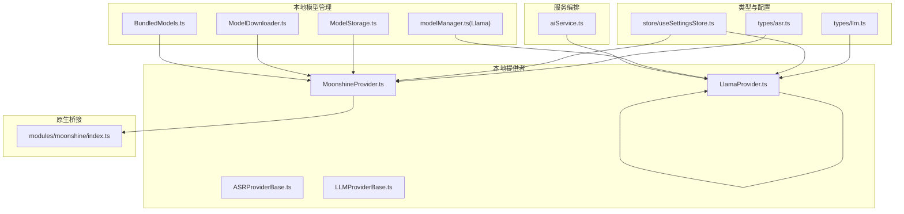
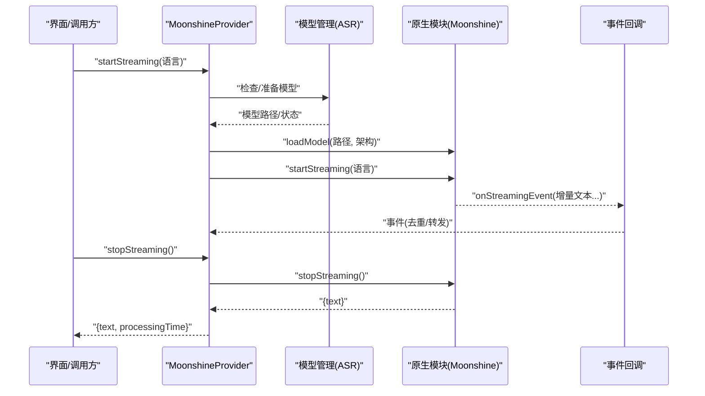
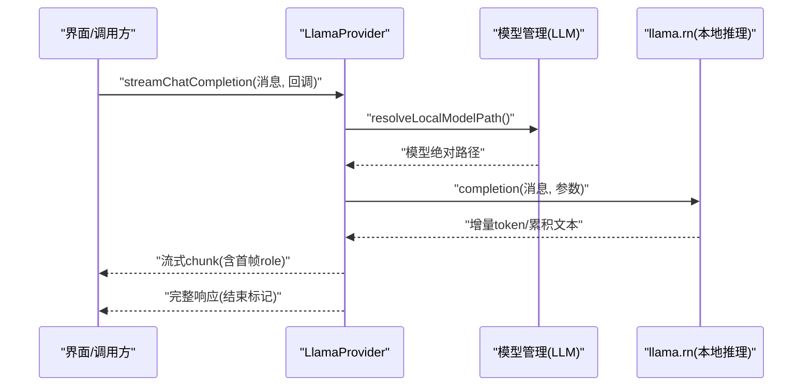
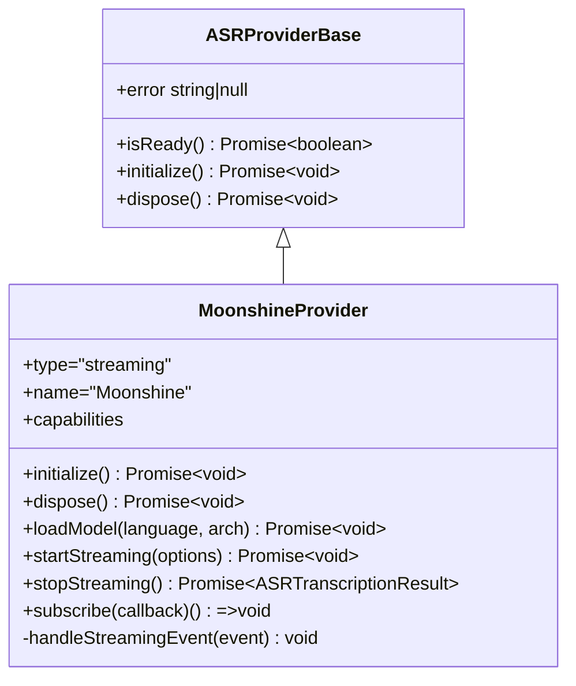
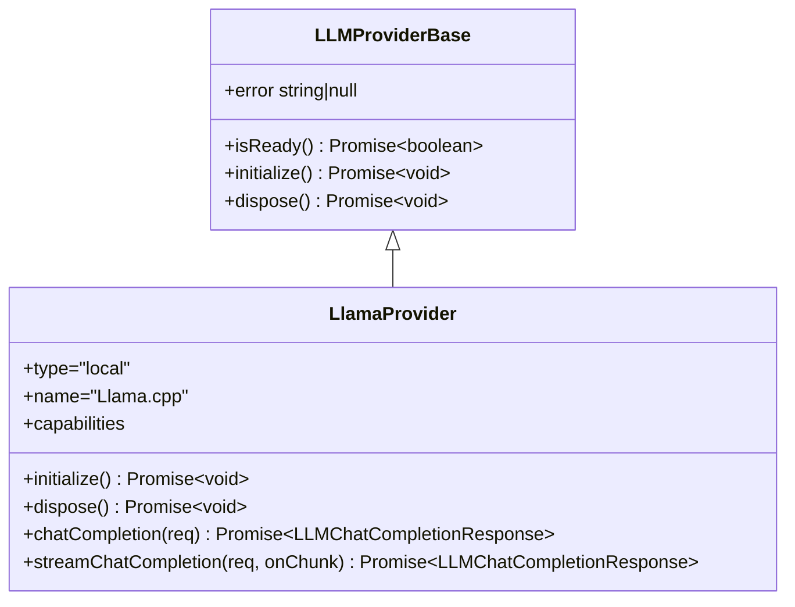
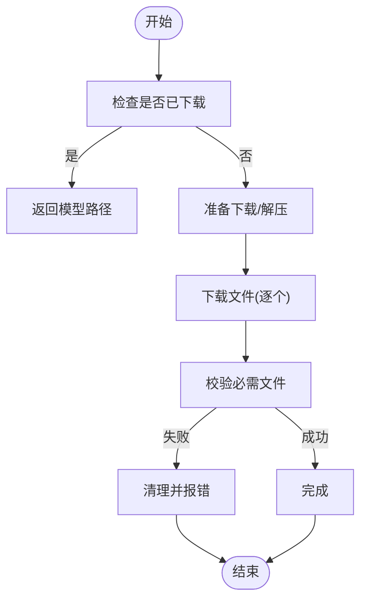
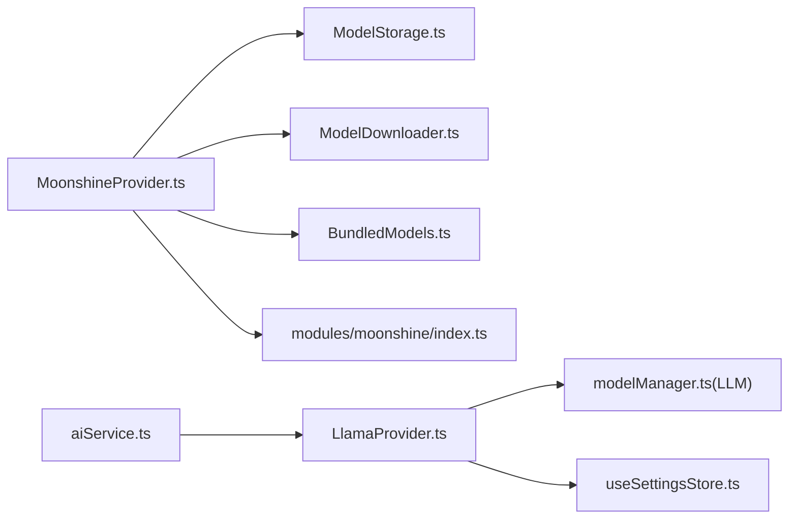
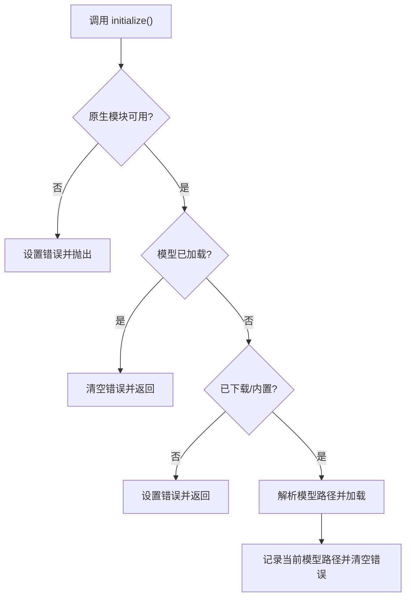
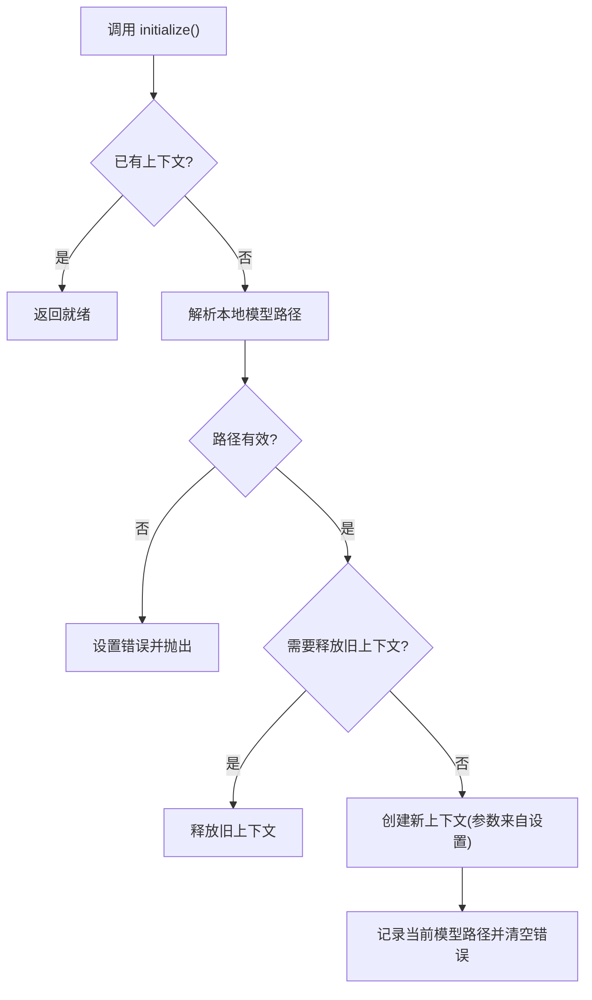

# 本地 AI 集成

<cite>
**本文引用的文件**
- [modules/moonshine/index.ts](file://modules/moonshine/index.ts)
- [services/asr/providers/local/MoonshineProvider.ts](file://services/asr/providers/local/MoonshineProvider.ts)
- [services/asr/modelManager/types.ts](file://services/asr/modelManager/types.ts)
- [services/asr/modelManager/BundledModels.ts](file://services/asr/modelManager/BundledModels.ts)
- [services/asr/modelManager/ModelDownloader.ts](file://services/asr/modelManager/ModelDownloader.ts)
- [services/asr/modelManager/ModelStorage.ts](file://services/asr/modelManager/ModelStorage.ts)
- [services/llm/providers/local/LlamaProvider.ts](file://services/llm/providers/local/LlamaProvider.ts)
- [services/llm/modelManager.ts](file://services/llm/modelManager.ts)
- [services/llm/providers/base/LLMProviderBase.ts](file://services/llm/providers/base/LLMProviderBase.ts)
- [services/asr/providers/base/ASRProviderBase.ts](file://services/asr/providers/base/ASRProviderBase.ts)
- [services/ai/aiService.ts](file://services/ai/aiService.ts)
- [store/useSettingsStore.ts](file://store/useSettingsStore.ts)
- [types/asr.ts](file://types/asr.ts)
- [types/llm.ts](file://types/llm.ts)
</cite>

## 目录
1. [简介](#简介)
2. [项目结构](#项目结构)
3. [核心组件](#核心组件)
4. [架构总览](#架构总览)
5. [详细组件分析](#详细组件分析)
6. [依赖关系分析](#依赖关系分析)
7. [性能考量](#性能考量)
8. [故障排查指南](#故障排查指南)
9. [结论](#结论)
10. [附录](#附录)

## 简介
本文件面向“本地 AI 集成”的技术与使用文档，聚焦于两类本地 AI 提供商：Moonshine（本地语音识别）与 Llama.cpp（本地大语言模型）。文档从系统架构、模块职责、数据流与处理逻辑、配置与优化、错误处理与降级策略、以及模型更新与维护等维度进行深入说明，并提供可直接定位到源码的路径指引，帮助开发者快速理解与扩展。

## 项目结构
本地 AI 能力由以下层次构成：
- 类型与配置层：定义 ASR/LLM 的能力与消息格式，以及全局设置项。
- 本地模型管理：负责模型下载、解压、校验、存储与路径解析。
- 本地提供者：封装 Moonshine（ASR）与 Llama.cpp（LLM）的初始化、推理与事件回调。
- 服务编排：统一对外的 AI 分析服务与 LLM 调用入口。
- 原生桥接：Moonshine 通过 React Native TurboModule 与原生平台交互。

图示来源
- [types/asr.ts:1-164](file://types/asr.ts#L1-L164)
- [types/llm.ts:1-93](file://types/llm.ts#L1-L93)
- [store/useSettingsStore.ts:1-218](file://store/useSettingsStore.ts#L1-L218)
- [services/asr/modelManager/ModelStorage.ts:1-186](file://services/asr/modelManager/ModelStorage.ts#L1-L186)
- [services/asr/modelManager/ModelDownloader.ts:1-207](file://services/asr/modelManager/ModelDownloader.ts#L1-L207)
- [services/asr/modelManager/BundledModels.ts:1-258](file://services/asr/modelManager/BundledModels.ts#L1-L258)
- [services/llm/modelManager.ts:1-196](file://services/llm/modelManager.ts#L1-L196)
- [services/asr/providers/local/MoonshineProvider.ts:1-307](file://services/asr/providers/local/MoonshineProvider.ts#L1-L307)
- [services/llm/providers/local/LlamaProvider.ts:1-316](file://services/llm/providers/local/LlamaProvider.ts#L1-L316)
- [services/asr/providers/base/ASRProviderBase.ts:1-66](file://services/asr/providers/base/ASRProviderBase.ts#L1-L66)
- [services/llm/providers/base/LLMProviderBase.ts:1-42](file://services/llm/providers/base/LLMProviderBase.ts#L1-L42)
- [services/ai/aiService.ts:1-163](file://services/ai/aiService.ts#L1-L163)
- [modules/moonshine/index.ts:1-94](file://modules/moonshine/index.ts#L1-L94)

章节来源
- [types/asr.ts:1-164](file://types/asr.ts#L1-L164)
- [types/llm.ts:1-93](file://types/llm.ts#L1-L93)
- [store/useSettingsStore.ts:1-218](file://store/useSettingsStore.ts#L1-L218)

## 核心组件
- MoonshineProvider（本地 ASR）
  - 负责 Moonshine 本地语音识别的初始化、模型加载、实时流式转写、事件订阅与资源释放。
  - 关键接口：initialize、dispose、loadModel、startStreaming、stopStreaming、subscribe。
- LlamaProvider（本地 LLM）
  - 负责 GGUF 模型在设备上的初始化、推理与流式输出，支持温度、top_p、最大 token 等参数。
  - 关键接口：initialize、dispose、chatCompletion、streamChatCompletion。
- 模型管理器（ASR/Llama）
  - ASR：下载、解压、校验、存储、路径解析、内置模型提取。
  - LLM：本地 GGUF 模型路径解析与导入。
- 设置存储（Zustand）
  - 统一管理 ASR/LLM 的默认语言、架构、线程数、上下文长度、GPU 层数、批大小等运行时参数。
- 类型与能力
  - 定义 OpenAI 兼容的消息格式、提供者能力、状态与事件类型。

章节来源
- [services/asr/providers/local/MoonshineProvider.ts:1-307](file://services/asr/providers/local/MoonshineProvider.ts#L1-L307)
- [services/llm/providers/local/LlamaProvider.ts:1-316](file://services/llm/providers/local/LlamaProvider.ts#L1-L316)
- [services/asr/modelManager/ModelDownloader.ts:1-207](file://services/asr/modelManager/ModelDownloader.ts#L1-L207)
- [services/asr/modelManager/ModelStorage.ts:1-186](file://services/asr/modelManager/ModelStorage.ts#L1-L186)
- [services/asr/modelManager/BundledModels.ts:1-258](file://services/asr/modelManager/BundledModels.ts#L1-L258)
- [services/llm/modelManager.ts:1-196](file://services/llm/modelManager.ts#L1-L196)
- [store/useSettingsStore.ts:1-218](file://store/useSettingsStore.ts#L1-L218)
- [types/asr.ts:1-164](file://types/asr.ts#L1-L164)
- [types/llm.ts:1-93](file://types/llm.ts#L1-L93)

## 架构总览
本地 AI 的整体流程如下：
- Moonshine：应用侧通过 MoonshineProvider 初始化并加载模型；启动流式识别后，原生模块推送实时事件，应用层去重与转发给订阅者；停止识别后返回最终文本与处理耗时。
- Llama.cpp：应用侧通过 LlamaProvider 解析本地 GGUF 路径并初始化上下文；发起聊天或流式生成，按需中止；释放上下文时确保停止正在进行的生成。

图示来源
- [services/asr/providers/local/MoonshineProvider.ts:192-259](file://services/asr/providers/local/MoonshineProvider.ts#L192-L259)
- [modules/moonshine/index.ts:48-84](file://modules/moonshine/index.ts#L48-L84)
- [services/asr/modelManager/ModelStorage.ts:49-66](file://services/asr/modelManager/ModelStorage.ts#L49-L66)

图示来源
- [services/llm/providers/local/LlamaProvider.ts:209-305](file://services/llm/providers/local/LlamaProvider.ts#L209-L305)
- [services/llm/modelManager.ts:159-186](file://services/llm/modelManager.ts#L159-L186)

## 详细组件分析

### MoonshineProvider（本地 ASR）
- 能力与状态
  - 支持流式与实时转写，支持多语言，要求本地模型下载或内置模型。
- 初始化与模型加载
  - 若未加载模型，先检查是否已下载或为内置模型；若为内置模型则尝试提取；随后加载模型并记录当前路径。
- 流式识别
  - 订阅原生事件，进行去重与转发；在 Android 上需在开始前通知麦克风权限；停止时计算处理耗时并清理订阅。
- 错误处理
  - 对事件中的错误类型进行捕获并设置内部错误状态；初始化失败抛出异常。

图示来源
- [services/asr/providers/base/ASRProviderBase.ts:1-66](file://services/asr/providers/base/ASRProviderBase.ts#L1-L66)
- [services/asr/providers/local/MoonshineProvider.ts:42-291](file://services/asr/providers/local/MoonshineProvider.ts#L42-L291)

章节来源
- [services/asr/providers/local/MoonshineProvider.ts:1-307](file://services/asr/providers/local/MoonshineProvider.ts#L1-L307)
- [modules/moonshine/index.ts:1-94](file://modules/moonshine/index.ts#L1-L94)

### LlamaProvider（本地 LLM）
- 能力与状态
  - 支持流式与聊天，要求本地模型下载；运行时参数来自设置存储。
- 初始化与推理
  - 解析模型路径，调用本地推理库初始化上下文；支持中止当前生成；释放时停止并释放上下文。
- 流式输出
  - 首帧发送角色信息，后续增量发送内容；结束时发送停止标记并返回完整响应。

图示来源
- [services/llm/providers/base/LLMProviderBase.ts:1-42](file://services/llm/providers/base/LLMProviderBase.ts#L1-L42)
- [services/llm/providers/local/LlamaProvider.ts:95-306](file://services/llm/providers/local/LlamaProvider.ts#L95-L306)

章节来源
- [services/llm/providers/local/LlamaProvider.ts:1-316](file://services/llm/providers/local/LlamaProvider.ts#L1-L316)
- [services/llm/modelManager.ts:1-196](file://services/llm/modelManager.ts#L1-L196)

### 模型管理（ASR）
- 存储与路径
  - 统一在文档目录下建立模型根目录；每个模型以独立目录保存必要文件。
- 下载与解压
  - 支持从远端下载压缩包并逐个文件解压；提供进度回调；失败时清理临时文件与部分下载。
- 内置模型
  - 在构建阶段将常用模型打包进应用；首次启用时自动提取到本地存储，避免首次启动网络消耗。
- 校验与删除
  - 通过必需文件存在性判断模型有效性；提供删除接口用于空间回收或重新安装。

图示来源
- [services/asr/modelManager/ModelDownloader.ts:37-165](file://services/asr/modelManager/ModelDownloader.ts#L37-L165)
- [services/asr/modelManager/ModelStorage.ts:49-84](file://services/asr/modelManager/ModelStorage.ts#L49-L84)
- [services/asr/modelManager/BundledModels.ts:96-201](file://services/asr/modelManager/BundledModels.ts#L96-L201)

章节来源
- [services/asr/modelManager/types.ts:1-129](file://services/asr/modelManager/types.ts#L1-L129)
- [services/asr/modelManager/ModelDownloader.ts:1-207](file://services/asr/modelManager/ModelDownloader.ts#L1-L207)
- [services/asr/modelManager/ModelStorage.ts:1-186](file://services/asr/modelManager/ModelStorage.ts#L1-L186)
- [services/asr/modelManager/BundledModels.ts:1-258](file://services/asr/modelManager/BundledModels.ts#L1-L258)

### 模型管理（LLM）
- 本地 GGUF 路径解析
  - 优先使用显式配置路径；否则回退到固定文件名；最后扫描本地模型目录；支持导入外部 URI。
- 导入与验证
  - 将外部模型复制到本地目录，确保最小文件大小阈值；提供状态反馈。

章节来源
- [services/llm/modelManager.ts:1-196](file://services/llm/modelManager.ts#L1-L196)

### 设置与配置
- ASR 默认配置
  - 默认提供者为云；本地默认提供者为 Moonshine；默认语言与模型架构；默认下载源与自定义地址。
- LLM 默认配置
  - 默认提供者为云；本地模型路径、上下文长度、线程数、GPU 层数、批大小等可通过环境变量或设置覆盖。
- 合并与兼容
  - 对旧版模型架构进行映射与归一化，保证历史设置可用。

章节来源
- [store/useSettingsStore.ts:73-105](file://store/useSettingsStore.ts#L73-L105)
- [store/useSettingsStore.ts:47-71](file://store/useSettingsStore.ts#L47-L71)

### 类型与能力
- ASR
  - 提供者类型、语言集合、模型架构、事件类型、结果结构与能力描述。
- LLM
  - OpenAI 兼容的消息与响应结构、流式分片、提供者能力与状态。
- AI 分析服务
  - 使用 LLM 提供者进行笔记分析，支持超时控制与 JSON 结果解析与规范化。

章节来源
- [types/asr.ts:1-164](file://types/asr.ts#L1-L164)
- [types/llm.ts:1-93](file://types/llm.ts#L1-L93)
- [services/ai/aiService.ts:1-163](file://services/ai/aiService.ts#L1-L163)

## 依赖关系分析
- MoonshineProvider 依赖
  - 模型管理（下载/存储/内置模型）、原生模块桥接、设置存储（默认语言/架构）。
- LlamaProvider 依赖
  - 模型管理（GGUF 路径解析/导入）、设置存储（运行时参数）、本地推理库。
- aiService 依赖
  - LLM 提供者（本地/云端均可），统一聊天补全调用与结果解析。

图示来源
- [services/asr/providers/local/MoonshineProvider.ts:1-307](file://services/asr/providers/local/MoonshineProvider.ts#L1-L307)
- [services/asr/modelManager/ModelStorage.ts:1-186](file://services/asr/modelManager/ModelStorage.ts#L1-L186)
- [services/asr/modelManager/ModelDownloader.ts:1-207](file://services/asr/modelManager/ModelDownloader.ts#L1-L207)
- [services/asr/modelManager/BundledModels.ts:1-258](file://services/asr/modelManager/BundledModels.ts#L1-L258)
- [modules/moonshine/index.ts:1-94](file://modules/moonshine/index.ts#L1-L94)
- [services/llm/providers/local/LlamaProvider.ts:1-316](file://services/llm/providers/local/LlamaProvider.ts#L1-L316)
- [services/llm/modelManager.ts:1-196](file://services/llm/modelManager.ts#L1-L196)
- [store/useSettingsStore.ts:1-218](file://store/useSettingsStore.ts#L1-L218)
- [services/ai/aiService.ts:1-163](file://services/ai/aiService.ts#L1-L163)

## 性能考量
- Moonshine（ASR）
  - 实时流式事件去重，降低 UI 刷新频率；Android 平台需在开始前授予麦克风权限，避免阻塞。
- Llama.cpp（LLM）
  - 运行时参数（上下文长度、线程数、GPU 层数、批大小）直接影响延迟与吞吐；建议根据设备性能调整。
  - 流式输出可边生成边渲染，提升感知速度；注意中止信号的正确传递以避免资源占用。
- 模型体积与存储
  - ASR 模型约几十 MB，Llama GGUF 模型通常数百 MB；合理规划缓存与清理策略。

[本节为通用性能讨论，不直接分析具体文件]

## 故障排查指南
- MoonshineProvider
  - 无可用原生模块：初始化时报错，确认构建包含 Moonshine 原生模块。
  - 未加载模型：检查模型是否已下载或内置；若为内置模型，确认已成功提取。
  - 流式事件错误：订阅回调中捕获错误事件并设置内部错误状态；查看日志定位具体原因。
  - Android 权限：必须在 startStreaming 前调用麦克风权限通知。
- LlamaProvider
  - 未准备好：检查本地模型路径解析结果；确保模型文件有效且大小满足阈值。
  - 生成冲突：并发生成会抛出异常；确保一次只进行一个生成任务。
  - 中止异常：中止信号触发时会抛出明确错误；确保上层正确处理并清理。
- 模型管理
  - 下载失败：检查网络与缓存目录可用性；查看进度回调与错误状态；失败后会清理部分文件。
  - 内置模型缺失：确认构建时包含所需资产；首次启动会尝试提取，失败请检查存储权限。

章节来源
- [services/asr/providers/local/MoonshineProvider.ts:88-135](file://services/asr/providers/local/MoonshineProvider.ts#L88-L135)
- [services/asr/providers/local/MoonshineProvider.ts:192-259](file://services/asr/providers/local/MoonshineProvider.ts#L192-L259)
- [services/llm/providers/local/LlamaProvider.ts:120-161](file://services/llm/providers/local/LlamaProvider.ts#L120-L161)
- [services/llm/providers/local/LlamaProvider.ts:213-305](file://services/llm/providers/local/LlamaProvider.ts#L213-L305)
- [services/asr/modelManager/ModelDownloader.ts:144-165](file://services/asr/modelManager/ModelDownloader.ts#L144-L165)

## 结论
该本地 AI 集成以清晰的分层设计实现了 Moonshine（ASR）与 Llama.cpp（LLM）的本地化部署与运行。Moonshine 提供低延迟、可离线的实时语音识别；Llama.cpp 提供可控参数与流式输出的大语言模型推理。通过完善的模型管理、设置存储与错误处理机制，系统在易用性与稳定性方面具备良好表现。建议在生产环境中结合设备性能与业务需求，持续优化模型参数与缓存策略。

[本节为总结性内容，不直接分析具体文件]

## 附录

### 本地模型加载与初始化流程（Moonshine）

图示来源
- [services/asr/providers/local/MoonshineProvider.ts:88-135](file://services/asr/providers/local/MoonshineProvider.ts#L88-L135)

### 本地模型加载与初始化流程（Llama.cpp）

图示来源
- [services/llm/providers/local/LlamaProvider.ts:120-161](file://services/llm/providers/local/LlamaProvider.ts#L120-L161)

### 调用本地 AI 服务的参考路径
- 调用本地 LLM（流式）：[services/llm/providers/local/LlamaProvider.ts:209-305](file://services/llm/providers/local/LlamaProvider.ts#L209-L305)
- 调用本地 ASR（流式）：[services/asr/providers/local/MoonshineProvider.ts:192-259](file://services/asr/providers/local/MoonshineProvider.ts#L192-L259)
- 获取 Moonshine 事件监听器：[modules/moonshine/index.ts:48-84](file://modules/moonshine/index.ts#L48-L84)
- 解析本地 LLM 模型路径：[services/llm/modelManager.ts:159-186](file://services/llm/modelManager.ts#L159-L186)
- 下载/校验/删除 Moonshine 模型：[services/asr/modelManager/ModelDownloader.ts:37-165](file://services/asr/modelManager/ModelDownloader.ts#L37-L165), [services/asr/modelManager/ModelStorage.ts:49-84](file://services/asr/modelManager/ModelStorage.ts#L49-L84), [services/asr/modelManager/ModelStorage.ts:159-169](file://services/asr/modelManager/ModelStorage.ts#L159-L169)

### 本地 AI 的配置与优化要点
- Moonshine
  - 默认语言与模型架构：[store/useSettingsStore.ts:73-88](file://store/useSettingsStore.ts#L73-L88)
  - 内置模型提取：[services/asr/modelManager/BundledModels.ts:96-201](file://services/asr/modelManager/BundledModels.ts#L96-L201)
- Llama.cpp
  - 运行时参数（上下文、线程、GPU、批大小）：[services/llm/providers/local/LlamaProvider.ts:82-93](file://services/llm/providers/local/LlamaProvider.ts#L82-L93)
  - 本地模型路径配置：[store/useSettingsStore.ts:95-105](file://store/useSettingsStore.ts#L95-L105)

### 本地 AI 的错误处理与降级策略
- MoonshineProvider
  - 事件错误捕获与错误状态设置：[services/asr/providers/local/MoonshineProvider.ts:286-290](file://services/asr/providers/local/MoonshineProvider.ts#L286-L290)
  - 初始化失败与加载失败处理：[services/asr/providers/local/MoonshineProvider.ts:91-95](file://services/asr/providers/local/MoonshineProvider.ts#L91-L95), [services/asr/providers/local/MoonshineProvider.ts:117-122](file://services/asr/providers/local/MoonshineProvider.ts#L117-L122)
- LlamaProvider
  - 初始化异常与生成冲突：[services/llm/providers/local/LlamaProvider.ts:156-160](file://services/llm/providers/local/LlamaProvider.ts#L156-L160), [services/llm/providers/local/LlamaProvider.ts:221-223](file://services/llm/providers/local/LlamaProvider.ts#L221-L223)
  - 生成中止与异常传播：[services/llm/providers/local/LlamaProvider.ts:293-300](file://services/llm/providers/local/LlamaProvider.ts#L293-L300)

### 本地 AI 模型的更新与维护
- Moonshine
  - 更新模型：重新下载并替换本地模型目录；校验通过后生效。
  - 清理无效模型：删除模型目录并重新下载。
  - 内置模型：在构建阶段更新资产并在首次启动时提取。
- Llama.cpp
  - 替换 GGUF 文件：导入新的模型文件至本地目录；确保文件大小满足阈值。
  - 参数调优：根据设备性能调整上下文长度、线程数、GPU 层数与批大小。

章节来源
- [services/asr/modelManager/ModelDownloader.ts:167-207](file://services/asr/modelManager/ModelDownloader.ts#L167-L207)
- [services/asr/modelManager/ModelStorage.ts:159-169](file://services/asr/modelManager/ModelStorage.ts#L159-L169)
- [services/asr/modelManager/BundledModels.ts:208-219](file://services/asr/modelManager/BundledModels.ts#L208-L219)
- [services/llm/modelManager.ts:188-196](file://services/llm/modelManager.ts#L188-L196)