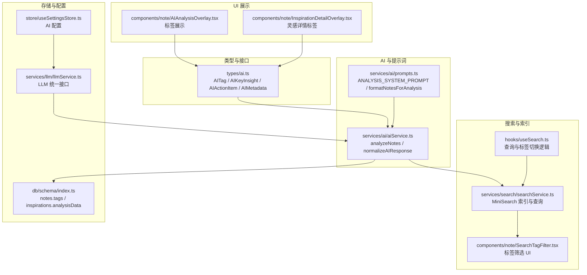
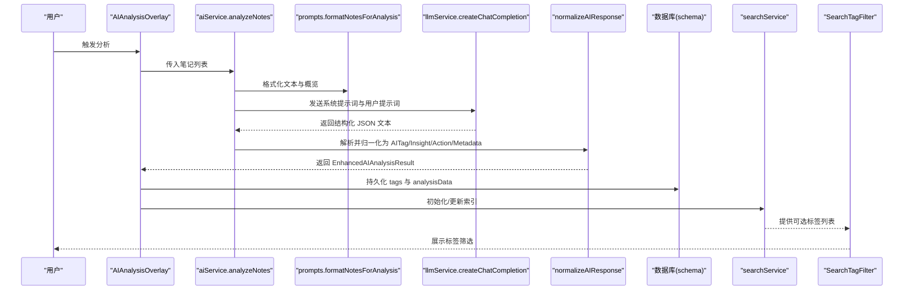
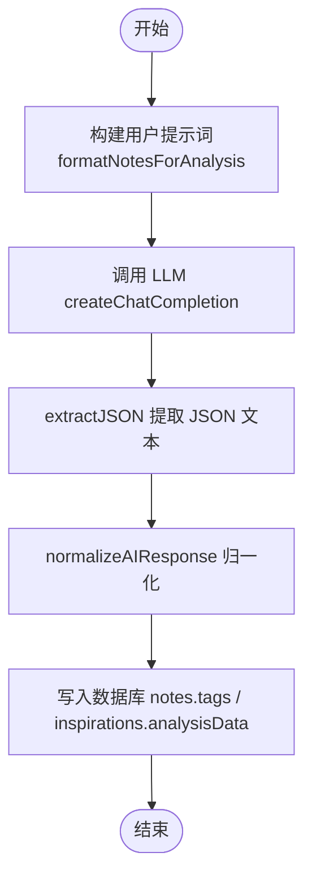
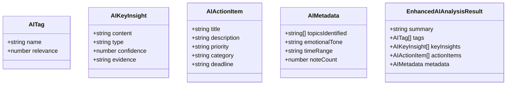
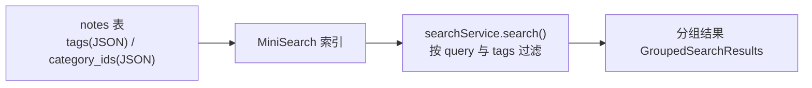
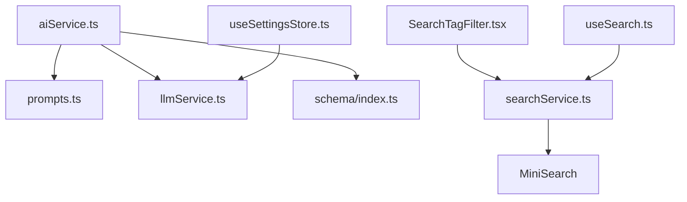

# 标签提取

<cite>
**本文档引用的文件**
- [aiService.ts](file://services/ai/aiService.ts)
- [prompts.ts](file://services/ai/prompts.ts)
- [ai.ts](file://types/ai.ts)
- [schema/index.ts](file://db/schema/index.ts)
- [searchService.ts](file://services/search/searchService.ts)
- [SearchTagFilter.tsx](file://components/note/SearchTagFilter.tsx)
- [useSearch.ts](file://hooks/useSearch.ts)
- [AIAnalysisOverlay.tsx](file://components/note/AIAnalysisOverlay.tsx)
- [InspirationDetailOverlay.tsx](file://components/note/InspirationDetailOverlay.tsx)
- [useSettingsStore.ts](file://store/useSettingsStore.ts)
- [llmService.ts](file://services/llm/llmService.ts)
- [ai.json](file://i18n/locales/zh-CN/ai.json)
</cite>

## 目录
1. [简介](#简介)
2. [项目结构](#项目结构)
3. [核心组件](#核心组件)
4. [架构总览](#架构总览)
5. [详细组件分析](#详细组件分析)
6. [依赖关系分析](#依赖关系分析)
7. [性能考量](#性能考量)
8. [故障排查指南](#故障排查指南)
9. [结论](#结论)
10. [附录](#附录)

## 简介
本文件围绕“标签提取”功能进行全面技术文档化，涵盖 AI 标签提取的算法原理、相关性评分机制、标准化处理流程、在笔记系统中的应用（分类筛选、搜索索引、统计分析），以及质量控制与扩展配置指南。读者无需深入的 AI 背景即可理解并正确使用该能力。

## 项目结构
与标签提取相关的关键模块分布在以下位置：
- 类型定义：用于约束标签、洞察、行动项等结构
- AI 服务：负责调用 LLM、构建提示词、解析与归一化响应
- 搜索服务：负责标签索引、查询与分组
- UI 组件：展示标签、过滤器与分析结果
- 存储模式：持久化存储标签与相关元数据
- 设置与配置：提供 AI 服务的云端/本地配置入口

图表来源
- [aiService.ts:1-162](file://services/ai/aiService.ts#L1-L162)
- [prompts.ts:1-179](file://services/ai/prompts.ts#L1-L179)
- [searchService.ts:1-142](file://services/search/searchService.ts#L1-L142)
- [SearchTagFilter.tsx:1-148](file://components/note/SearchTagFilter.tsx#L1-L148)
- [useSearch.ts:37-83](file://hooks/useSearch.ts#L37-L83)
- [AIAnalysisOverlay.tsx:151-431](file://components/note/AIAnalysisOverlay.tsx#L151-L431)
- [InspirationDetailOverlay.tsx:146-170](file://components/note/InspirationDetailOverlay.tsx#L146-L170)
- [schema/index.ts:1-75](file://db/schema/index.ts#L1-L75)
- [useSettingsStore.ts:95-137](file://store/useSettingsStore.ts#L95-L137)
- [llmService.ts:1-61](file://services/llm/llmService.ts#L1-L61)

章节来源
- [aiService.ts:1-162](file://services/ai/aiService.ts#L1-L162)
- [prompts.ts:1-179](file://services/ai/prompts.ts#L1-L179)
- [searchService.ts:1-142](file://services/search/searchService.ts#L1-L142)
- [schema/index.ts:1-75](file://db/schema/index.ts#L1-L75)

## 核心组件
- 类型与数据模型
  - AITag：包含标签名称与相关性分数
  - AIKeyInsight：包含洞察内容、类型、置信度与证据
  - AIActionItem：包含行动项标题、描述、优先级与类别
  - AIMetadata：包含主题识别、情感基调、时间范围与笔记数
  - EnhancedAIAnalysisResult：聚合以上字段的完整分析结果
- AI 服务
  - analyzeNotes：组装提示词、调用 LLM、解析 JSON、归一化输出
  - normalizeAIResponse：将异构 AI 输出规范化为统一结构
- 提示词与数据预处理
  - ANALYSIS_SYSTEM_PROMPT：定义输出格式与质量标准
  - formatNotesForAnalysis：拼接多笔记文本、生成数据概览
- 搜索与标签过滤
  - searchService：基于 MiniSearch 的中文分词与标签索引
  - SearchTagFilter：移动端标签筛选 UI
  - useSearch：查询与标签切换的钩子
- UI 展示
  - AIAnalysisOverlay：展示标签与洞察
  - InspirationDetailOverlay：灵感详情页展示标签
- 存储与配置
  - notes.tags：以 JSON 字符串存储标签数组
  - inspirations.analysisData：以 JSON 存储完整 AI 分析结果
  - useSettingsStore：AI 云端/本地配置
  - llmService：统一的 LLM 调用接口

章节来源
- [ai.ts:1-47](file://types/ai.ts#L1-L47)
- [aiService.ts:126-162](file://services/ai/aiService.ts#L126-L162)
- [prompts.ts:44-95](file://services/ai/prompts.ts#L44-L95)
- [searchService.ts:40-117](file://services/search/searchService.ts#L40-L117)
- [SearchTagFilter.tsx:14-85](file://components/note/SearchTagFilter.tsx#L14-L85)
- [useSearch.ts:37-83](file://hooks/useSearch.ts#L37-L83)
- [AIAnalysisOverlay.tsx:151-187](file://components/note/AIAnalysisOverlay.tsx#L151-L187)
- [InspirationDetailOverlay.tsx:146-170](file://components/note/InspirationDetailOverlay.tsx#L146-L170)
- [schema/index.ts:3-17](file://db/schema/index.ts#L3-L17)
- [useSettingsStore.ts:95-137](file://store/useSettingsStore.ts#L95-L137)
- [llmService.ts:18-37](file://services/llm/llmService.ts#L18-L37)

## 架构总览
下图展示了从输入笔记到标签展示与检索的端到端流程：

图表来源
- [aiService.ts:126-162](file://services/ai/aiService.ts#L126-L162)
- [prompts.ts:140-179](file://services/ai/prompts.ts#L140-L179)
- [llmService.ts:32-37](file://services/llm/llmService.ts#L32-L37)
- [searchService.ts:58-117](file://services/search/searchService.ts#L58-L117)
- [schema/index.ts:3-17](file://db/schema/index.ts#L3-L17)
- [AIAnalysisOverlay.tsx:151-187](file://components/note/AIAnalysisOverlay.tsx#L151-L187)
- [SearchTagFilter.tsx:14-85](file://components/note/SearchTagFilter.tsx#L14-L85)

## 详细组件分析

### AI 标签提取算法与提示工程
- 系统提示词约束
  - 明确输出 JSON 结构、数量上限、质量标准与语言风格
  - 强调洞察需基于具体证据，避免空泛内容
- 用户提示词构建
  - 将多条笔记拼接为单一输入，并附加数据概览（时间跨度、高频标签、类型分布）
- LLM 调用
  - 使用统一的聊天补全接口，设置温度、最大 token 数与超时控制
  - 从响应中提取 JSON 片段并解析为结构化对象
- 归一化处理
  - 对标签、洞察、行动项进行类型校验与默认值填充，确保输出一致性

图表来源
- [prompts.ts:140-179](file://services/ai/prompts.ts#L140-L179)
- [aiService.ts:126-162](file://services/ai/aiService.ts#L126-L162)
- [aiService.ts:95-124](file://services/ai/aiService.ts#L95-L124)
- [schema/index.ts:3-17](file://db/schema/index.ts#L3-L17)

章节来源
- [prompts.ts:1-179](file://services/ai/prompts.ts#L1-L179)
- [aiService.ts:126-162](file://services/ai/aiService.ts#L126-L162)
- [aiService.ts:95-124](file://services/ai/aiService.ts#L95-L124)

### 标签相关性评分与重要性排序
- 相关性分数
  - 标签对象包含 relevance 字段，数值范围 0~1
  - 在 UI 中根据阈值（如 0.8）高亮显示高相关性标签
- 重要性排序
  - 当前实现未对标签进行二次排序；若需排序可在前端按 relevance 降序排列
- 置信度计算
  - 洞察对象包含 confidence 字段，用于评估洞察可信度
  - UI 中以进度条形式直观展示置信度百分比

图表来源
- [ai.ts:1-47](file://types/ai.ts#L1-L47)

章节来源
- [ai.ts:1-47](file://types/ai.ts#L1-L47)
- [AIAnalysisOverlay.tsx:151-187](file://components/note/AIAnalysisOverlay.tsx#L151-L187)

### 标准化处理：格式统一、去重合并与冲突解决
- 格式统一
  - 将字符串或对象形式的标签统一为 { name, relevance } 结构
  - 洞察与行动项亦进行相同归一化，确保字段完整性
- 去重与合并
  - 数据库层以 JSON 字符串存储 tags，去重与合并由上游逻辑保证
  - 若需在应用内去重，可基于 name 去重并合并 relevance（例如取平均或最大）
- 冲突解决
  - 当 AI 输出字段缺失时，采用安全默认值（如 relevance 默认 0.7）
  - 类型不匹配时进行强制转换（如字符串转数字）

章节来源
- [aiService.ts:48-93](file://services/ai/aiService.ts#L48-L93)
- [schema/index.ts:9](file://db/schema/index.ts#L9)

### 在笔记系统中的应用
- 分类筛选
  - notes.categoryIds 以 JSON 存储分类 ID 列表，支持多分类
  - UI 提供分类筛选栏，便于按类别浏览
- 搜索索引
  - searchService 将 tags 以空格连接后参与索引，提升检索效率
  - 支持按标签过滤与全文检索混合查询
- 统计分析
  - 数据概览包含高频标签、类型分布与时间跨度，辅助用户了解笔记特征

图表来源
- [schema/index.ts:3-17](file://db/schema/index.ts#L3-L17)
- [searchService.ts:40-117](file://services/search/searchService.ts#L40-L117)

章节来源
- [schema/index.ts:3-17](file://db/schema/index.ts#L3-L17)
- [searchService.ts:40-117](file://services/search/searchService.ts#L40-L117)

### 代码示例路径
- 调用 AI 分析并提取标签
  - [调用入口:126-162](file://services/ai/aiService.ts#L126-L162)
  - [提示词构建:140-179](file://services/ai/prompts.ts#L140-L179)
  - [LLM 统一接口:32-37](file://services/llm/llmService.ts#L32-L37)
- 展示标签与洞察
  - [AI 分析弹窗标签展示:151-187](file://components/note/AIAnalysisOverlay.tsx#L151-L187)
  - [灵感详情标签展示:146-170](file://components/note/InspirationDetailOverlay.tsx#L146-L170)
- 标签筛选与搜索
  - [标签筛选 UI:14-85](file://components/note/SearchTagFilter.tsx#L14-L85)
  - [查询与标签切换逻辑:37-83](file://hooks/useSearch.ts#L37-L83)
  - [搜索服务索引与查询:58-117](file://services/search/searchService.ts#L58-L117)

章节来源
- [aiService.ts:126-162](file://services/ai/aiService.ts#L126-L162)
- [prompts.ts:140-179](file://services/ai/prompts.ts#L140-L179)
- [llmService.ts:32-37](file://services/llm/llmService.ts#L32-L37)
- [AIAnalysisOverlay.tsx:151-187](file://components/note/AIAnalysisOverlay.tsx#L151-L187)
- [InspirationDetailOverlay.tsx:146-170](file://components/note/InspirationDetailOverlay.tsx#L146-L170)
- [SearchTagFilter.tsx:14-85](file://components/note/SearchTagFilter.tsx#L14-L85)
- [useSearch.ts:37-83](file://hooks/useSearch.ts#L37-L83)
- [searchService.ts:58-117](file://services/search/searchService.ts#L58-L117)

### 标签质量控制与准确性验证
- 质量红线
  - 洞察必须基于具体证据，避免空泛与显而易见的内容
  - 行动项需满足 SMART 原则并明确时间维度
- 输出格式与数量限制
  - 标签、洞察、行动项数量上限由系统提示词约束
- 置信度与相关性
  - 通过 confidence/relevance 辅助判断质量
  - UI 中以可视化方式呈现，便于人工复核
- 配置校验
  - isLLMConfigured 与 isAIConfigured 保障服务可用性

章节来源
- [prompts.ts:30-95](file://services/ai/prompts.ts#L30-L95)
- [llmService.ts:18-30](file://services/llm/llmService.ts#L18-L30)
- [aiService.ts:30-32](file://services/ai/aiService.ts#L30-L32)

### 扩展与自定义规则配置
- AI 提供商与模型
  - 支持云端（OpenAI 等）与本地（llama.cpp）两种提供商
  - 可通过设置界面配置 API 地址、密钥与模型
- 自定义提示词
  - 可在 ANALYSIS_SYSTEM_PROMPT 中调整输出格式、质量标准与语言风格
- 搜索索引优化
  - 可调整 MiniSearch 的权重、模糊匹配与前缀匹配策略
- 标签后处理
  - 可在 normalizeAIResponse 之后增加去重、合并与冲突解决逻辑

章节来源
- [useSettingsStore.ts:95-137](file://store/useSettingsStore.ts#L95-L137)
- [prompts.ts:1-95](file://services/ai/prompts.ts#L1-L95)
- [searchService.ts:44-56](file://services/search/searchService.ts#L44-L56)
- [aiService.ts:95-124](file://services/ai/aiService.ts#L95-L124)

## 依赖关系分析
- 组件耦合
  - aiService 依赖 prompts 与 llmService，输出被 UI 与存储消费
  - searchService 依赖 MiniSearch 并与 UI 的标签筛选联动
- 外部依赖
  - LLM 提供商（云端/本地）
  - MiniSearch（中文分词与倒排索引）
- 配置入口
  - useSettingsStore 提供全局 AI 配置，影响 LLM 调用与 UI 行为

图表来源
- [aiService.ts:1-162](file://services/ai/aiService.ts#L1-L162)
- [prompts.ts:1-179](file://services/ai/prompts.ts#L1-L179)
- [llmService.ts:1-61](file://services/llm/llmService.ts#L1-L61)
- [schema/index.ts:1-75](file://db/schema/index.ts#L1-L75)
- [searchService.ts:1-142](file://services/search/searchService.ts#L1-L142)
- [SearchTagFilter.tsx:1-148](file://components/note/SearchTagFilter.tsx#L1-L148)
- [useSearch.ts:37-83](file://hooks/useSearch.ts#L37-L83)
- [useSettingsStore.ts:95-137](file://store/useSettingsStore.ts#L95-L137)

章节来源
- [aiService.ts:1-162](file://services/ai/aiService.ts#L1-L162)
- [llmService.ts:1-61](file://services/llm/llmService.ts#L1-L61)
- [searchService.ts:1-142](file://services/search/searchService.ts#L1-L142)
- [useSettingsStore.ts:95-137](file://store/useSettingsStore.ts#L95-L137)

## 性能考量
- LLM 调用
  - 设置合理超时与温度参数，平衡速度与稳定性
- 搜索索引
  - 中文分词（字符+二元组）提升召回，但会增加索引体积
  - 合理设置权重与模糊度，避免过度召回导致性能下降
- 前端渲染
  - 标签过多时可启用虚拟滚动或分页展示
  - 高相关性标签高亮仅影响渲染样式，成本较低

## 故障排查指南
- AI 未配置
  - 检查 isAIConfigured/isLLMConfigured 返回值
  - 确认设置中的 API 地址、密钥与模型
- LLM 调用失败
  - 查看网络与超时设置
  - 检查 ANALYSIS_SYSTEM_PROMPT 与 buildUserPrompt 是否正确
- JSON 解析异常
  - 确保 AI 输出符合 JSON 格式，必要时启用代码块包裹
- 标签未出现在搜索中
  - 确认 tags 已正确写入 notes.tags（JSON 字符串）
  - 检查 searchService.indexDocuments 是否已重建索引

章节来源
- [aiService.ts:30-32](file://services/ai/aiService.ts#L30-L32)
- [llmService.ts:18-30](file://services/llm/llmService.ts#L18-L30)
- [prompts.ts:44-95](file://services/ai/prompts.ts#L44-L95)
- [searchService.ts:58-71](file://services/search/searchService.ts#L58-L71)
- [schema/index.ts:9](file://db/schema/index.ts#L9)

## 结论
标签提取功能通过“提示工程 + LLM + 归一化 + 搜索索引”的链路，实现了从多笔记中自动抽取高质量标签与洞察，并在 UI 中以可视化方式呈现。结合设置中心的云端/本地配置与搜索服务的标签过滤，用户可以高效地组织、检索与分析笔记。后续可通过增强归一化策略与索引优化进一步提升质量与性能。

## 附录
- 国际化键值参考
  - [ai.json 中的标签与分析相关键:1-33](file://i18n/locales/zh-CN/ai.json#L1-L33)