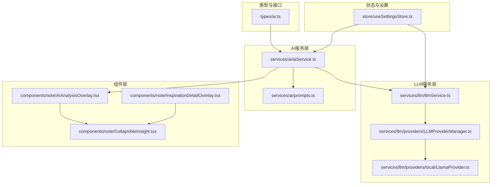
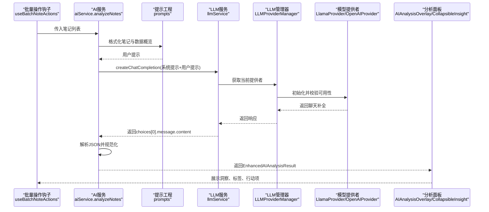
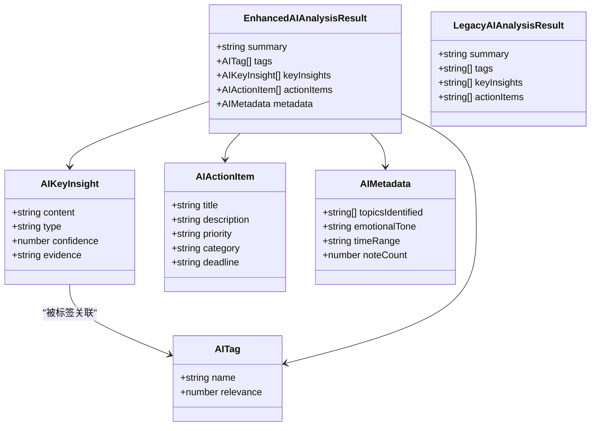
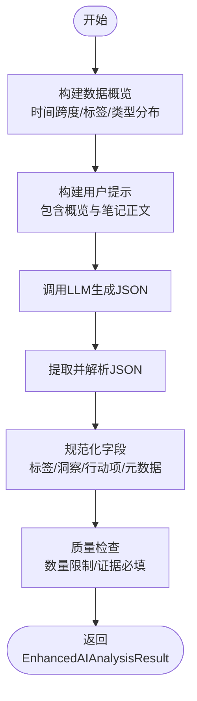
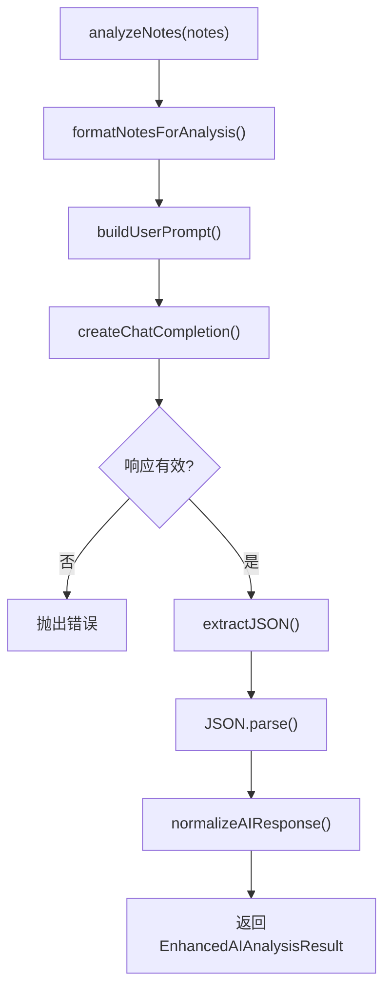
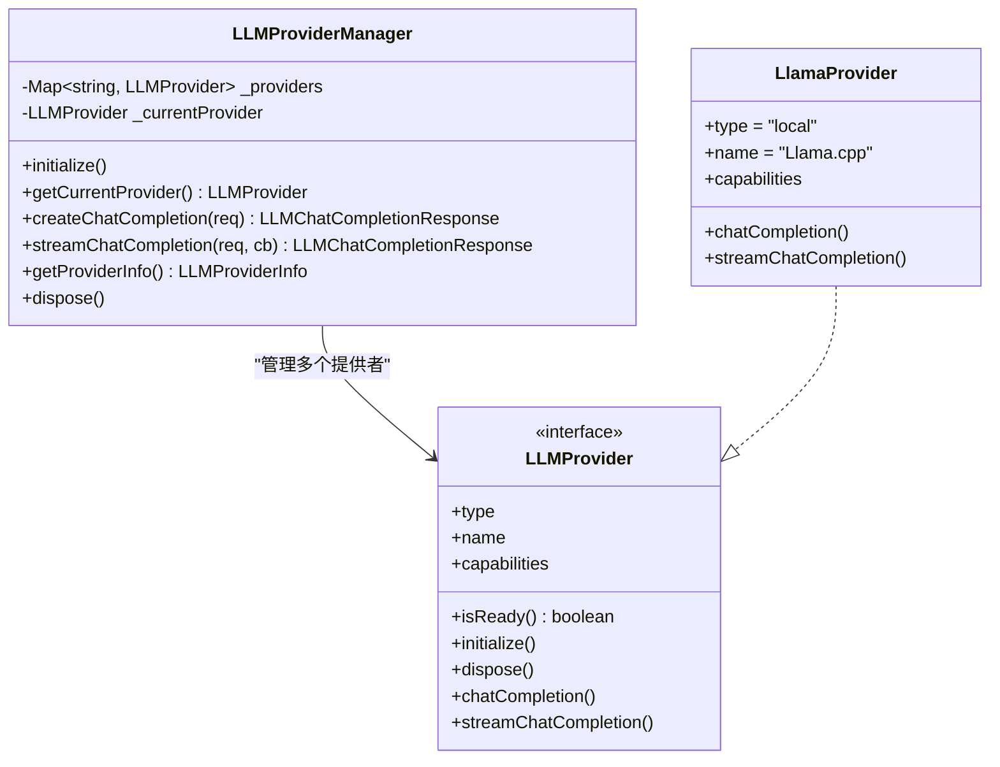
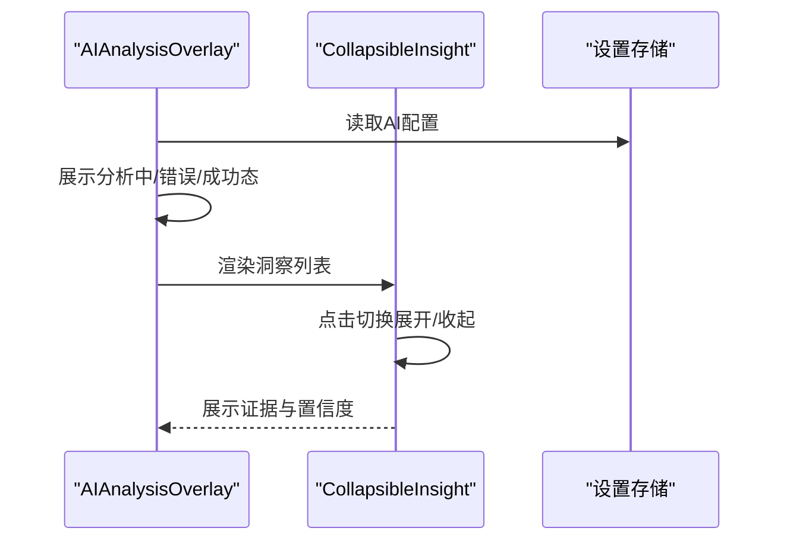
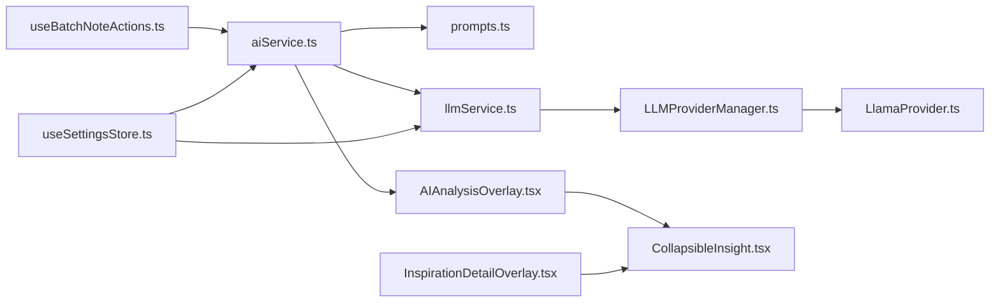

# 洞察生成

<cite>
**本文档引用的文件**
- [CollapsibleInsight.tsx](file://components/note/CollapsibleInsight.tsx)
- [AIAnalysisOverlay.tsx](file://components/note/AIAnalysisOverlay.tsx)
- [InspirationDetailOverlay.tsx](file://components/note/InspirationDetailOverlay.tsx)
- [ai.ts](file://types/ai.ts)
- [aiService.ts](file://services/ai/aiService.ts)
- [prompts.ts](file://services/ai/prompts.ts)
- [llmService.ts](file://services/llm/llmService.ts)
- [LLMProviderManager.ts](file://services/llm/providers/LLMProviderManager.ts)
- [LlamaProvider.ts](file://services/llm/providers/local/LlamaProvider.ts)
- [useSettingsStore.ts](file://store/useSettingsStore.ts)
- [useBatchNoteActions.ts](file://hooks/useBatchNoteActions.ts)
- [ai.json](file://i18n/locales/zh-CN/ai.json)
</cite>

## 目录
1. [简介](#简介)
2. [项目结构](#项目结构)
3. [核心组件](#核心组件)
4. [架构总览](#架构总览)
5. [详细组件分析](#详细组件分析)
6. [依赖关系分析](#依赖关系分析)
7. [性能考量](#性能考量)
8. [故障排查指南](#故障排查指南)
9. [结论](#结论)
10. [附录](#附录)

## 简介
本文件系统性阐述“洞察生成”功能的设计与实现，覆盖从数据输入、提示工程、模型调用、结果解析到前端可视化的完整链路。重点包括：
- 文本分析与模式识别：通过统一提示工程引导模型产出结构化洞察
- 洞察类型分类：模式(pattern)、机会(opportunity)、问题(issue)、趋势(trend)
- 置信度与证据：每条洞察附带置信度与证据来源，确保可追溯
- 可视化展示：折叠展开、交互动画、样式定制与响应式布局
- 质量控制与准确性评估：提示约束、数据概览、错误处理与回退策略
- 性能优化与调优：超时控制、本地/云端模型选择、缓存与渲染优化

## 项目结构
洞察生成相关模块围绕“类型定义 → AI服务 → 提示工程 → LLM服务 → 组件展示”的层次组织，形成清晰的职责边界与可扩展性。

图表来源
- [ai.ts:1-48](file://types/ai.ts#L1-L48)
- [aiService.ts:1-163](file://services/ai/aiService.ts#L1-L163)
- [prompts.ts:1-179](file://services/ai/prompts.ts#L1-L179)
- [llmService.ts:1-61](file://services/llm/llmService.ts#L1-L61)
- [LLMProviderManager.ts:1-163](file://services/llm/providers/LLMProviderManager.ts#L1-L163)
- [LlamaProvider.ts:1-104](file://services/llm/providers/local/LlamaProvider.ts#L1-L104)
- [CollapsibleInsight.tsx:1-141](file://components/note/CollapsibleInsight.tsx#L1-L141)
- [AIAnalysisOverlay.tsx:1-466](file://components/note/AIAnalysisOverlay.tsx#L1-L466)
- [InspirationDetailOverlay.tsx:1-316](file://components/note/InspirationDetailOverlay.tsx#L1-L316)
- [useSettingsStore.ts:1-218](file://store/useSettingsStore.ts#L1-L218)

章节来源
- [ai.ts:1-48](file://types/ai.ts#L1-L48)
- [aiService.ts:1-163](file://services/ai/aiService.ts#L1-L163)
- [prompts.ts:1-179](file://services/ai/prompts.ts#L1-L179)
- [llmService.ts:1-61](file://services/llm/llmService.ts#L1-L61)
- [LLMProviderManager.ts:1-163](file://services/llm/providers/LLMProviderManager.ts#L1-L163)
- [LlamaProvider.ts:1-104](file://services/llm/providers/local/LlamaProvider.ts#L1-L104)
- [CollapsibleInsight.tsx:1-141](file://components/note/CollapsibleInsight.tsx#L1-L141)
- [AIAnalysisOverlay.tsx:1-466](file://components/note/AIAnalysisOverlay.tsx#L1-L466)
- [InspirationDetailOverlay.tsx:1-316](file://components/note/InspirationDetailOverlay.tsx#L1-L316)
- [useSettingsStore.ts:1-218](file://store/useSettingsStore.ts#L1-L218)

## 核心组件
- 类型与数据模型：定义洞察、标签、元数据与分析结果的结构，保证前后端一致性与可扩展性
- AI服务：负责构建提示、调用LLM、解析并规范化AI输出
- 提示工程：严格的系统提示与用户提示模板，约束输出格式与质量
- LLM服务：统一本地/云端模型接入，提供配置检测与能力查询
- 可视化组件：折叠式洞察卡片、分析面板与灵感详情面板，支持交互与动画

章节来源
- [ai.ts:1-48](file://types/ai.ts#L1-L48)
- [aiService.ts:1-163](file://services/ai/aiService.ts#L1-L163)
- [prompts.ts:1-179](file://services/ai/prompts.ts#L1-L179)
- [llmService.ts:1-61](file://services/llm/llmService.ts#L1-L61)
- [CollapsibleInsight.tsx:1-141](file://components/note/CollapsibleInsight.tsx#L1-L141)
- [AIAnalysisOverlay.tsx:1-466](file://components/note/AIAnalysisOverlay.tsx#L1-L466)
- [InspirationDetailOverlay.tsx:1-316](file://components/note/InspirationDetailOverlay.tsx#L1-L316)

## 架构总览
洞察生成的端到端流程如下：

图表来源
- [useBatchNoteActions.ts:199-241](file://hooks/useBatchNoteActions.ts#L199-L241)
- [aiService.ts:126-163](file://services/ai/aiService.ts#L126-L163)
- [prompts.ts:97-179](file://services/ai/prompts.ts#L97-L179)
- [llmService.ts:32-45](file://services/llm/llmService.ts#L32-L45)
- [LLMProviderManager.ts:55-91](file://services/llm/providers/LLMProviderManager.ts#L55-L91)
- [LlamaProvider.ts:95-104](file://services/llm/providers/local/LlamaProvider.ts#L95-L104)
- [AIAnalysisOverlay.tsx:241-299](file://components/note/AIAnalysisOverlay.tsx#L241-L299)
- [CollapsibleInsight.tsx:28-100](file://components/note/CollapsibleInsight.tsx#L28-L100)

## 详细组件分析

### 数据模型与类型体系
- 洞察类型：AIKeyInsight 包含 content、type、confidence、evidence
- 标签类型：AITag 包含 name 与 relevance
- 元数据：AIMetadata 包含主题、情感基调、时间范围、笔记数
- 结果聚合：EnhancedAIAnalysisResult 包含 summary、tags、keyInsights、actionItems、metadata
- 兼容性：LegacyAIAnalysisResult 用于向后兼容

图表来源
- [ai.ts:1-48](file://types/ai.ts#L1-L48)

章节来源
- [ai.ts:1-48](file://types/ai.ts#L1-L48)

### 提示工程与输出规范
- 系统提示：明确分析框架（时间/内容/情绪模式）、行动转化原则（SMART+优先级）、语言风格与质量红线
- 输出要求：严格JSON结构，限定字段与取值范围，限制洞察数量与证据要求
- 用户提示：拼接数据概览与笔记正文，便于模型上下文理解
- 数据概览：统计笔记数量、时间跨度、高频标签、类型分布

图表来源
- [prompts.ts:1-179](file://services/ai/prompts.ts#L1-L179)
- [aiService.ts:126-163](file://services/ai/aiService.ts#L126-L163)

章节来源
- [prompts.ts:1-179](file://services/ai/prompts.ts#L1-L179)
- [aiService.ts:95-124](file://services/ai/aiService.ts#L95-L124)

### AI服务与结果规范化
- 配置获取：从设置存储读取AI服务配置（API地址、密钥、模型），支持环境变量回退
- 超时控制：AbortController + setTimeout 控制请求超时
- JSON提取：处理Markdown代码块包裹与裸JSON，提升鲁棒性
- 规范化函数：对标签、洞察、行动项进行类型校验与默认值填充
- 错误处理：空响应、解析失败、网络异常均转换为可展示错误

图表来源
- [aiService.ts:126-163](file://services/ai/aiService.ts#L126-L163)
- [prompts.ts:97-179](file://services/ai/prompts.ts#L97-L179)
- [llmService.ts:32-45](file://services/llm/llmService.ts#L32-L45)

章节来源
- [aiService.ts:1-163](file://services/ai/aiService.ts#L1-L163)
- [llmService.ts:1-61](file://services/llm/llmService.ts#L1-L61)

### LLM服务与提供者管理
- 统一入口：isLLMConfigured 检测配置；createChatCompletion/streamChatCompletion 统一调用
- 提供者选择：根据设置或环境变量选择本地(Llama.cpp)或云端(OpenAI兼容)
- 就绪检查：初始化并验证提供者可用性，失败时返回错误信息
- 本地模型：LlamaProvider 支持流式与非流式，参数可配置

图表来源
- [llmService.ts:1-61](file://services/llm/llmService.ts#L1-L61)
- [LLMProviderManager.ts:1-163](file://services/llm/providers/LLMProviderManager.ts#L1-L163)
- [LlamaProvider.ts:1-104](file://services/llm/providers/local/LlamaProvider.ts#L1-L104)

章节来源
- [llmService.ts:1-61](file://services/llm/llmService.ts#L1-L61)
- [LLMProviderManager.ts:1-163](file://services/llm/providers/LLMProviderManager.ts#L1-L163)
- [LlamaProvider.ts:1-104](file://services/llm/providers/local/LlamaProvider.ts#L1-L104)

### 可视化组件设计
- 折叠式洞察卡片：支持展开/收起，显示类型徽章、证据与置信度条
- 分析面板：展示摘要、标签、洞察、行动项与源笔记链接
- 灵感详情面板：支持拖拽关闭、滑动手势与保存至灵感
- 动画与交互：LayoutAnimation、react-native-reanimated、手势库

图表来源
- [AIAnalysisOverlay.tsx:241-299](file://components/note/AIAnalysisOverlay.tsx#L241-L299)
- [CollapsibleInsight.tsx:28-100](file://components/note/CollapsibleInsight.tsx#L28-L100)
- [useSettingsStore.ts:95-105](file://store/useSettingsStore.ts#L95-L105)

章节来源
- [CollapsibleInsight.tsx:1-141](file://components/note/CollapsibleInsight.tsx#L1-L141)
- [AIAnalysisOverlay.tsx:1-466](file://components/note/AIAnalysisOverlay.tsx#L1-L466)
- [InspirationDetailOverlay.tsx:1-316](file://components/note/InspirationDetailOverlay.tsx#L1-L316)

### 洞察类型与证据收集机制
- 类型分类：pattern/opportunity/issue/trend，由系统提示约束输出
- 置信度：数值范围0-1，来源于模型对证据强度的评估
- 证据收集：每条洞察必须包含来自源笔记的具体证据，避免空泛结论
- 质量红线：禁止心灵鸡汤、显而易见的废话，要求可执行、可衡量、有时限

章节来源
- [prompts.ts:30-95](file://services/ai/prompts.ts#L30-L95)
- [ai.ts:6-11](file://types/ai.ts#L6-L11)
- [CollapsibleInsight.tsx:72-95](file://components/note/CollapsibleInsight.tsx#L72-L95)

### 使用示例与最佳实践
- 生成洞察：通过批量操作触发，传入选中笔记集合，等待分析完成
- 显示洞察：在分析面板中查看摘要、标签、洞察与行动项，并可跳转源笔记
- 保存洞察：将分析结果保存为灵感条目，便于后续回顾

章节来源
- [useBatchNoteActions.ts:199-241](file://hooks/useBatchNoteActions.ts#L199-L241)
- [AIAnalysisOverlay.tsx:115-239](file://components/note/AIAnalysisOverlay.tsx#L115-L239)
- [InspirationDetailOverlay.tsx:135-184](file://components/note/InspirationDetailOverlay.tsx#L135-L184)

## 依赖关系分析
- 组件依赖：AIAnalysisOverlay 依赖 CollapsibleInsight；InspirationDetailOverlay 同样依赖 CollapsibleInsight
- 服务依赖：aiService 依赖 prompts 与 llmService；llmService 依赖 LLMProviderManager
- 设置依赖：useSettingsStore 提供全局AI配置，影响 aiService 与 llmService 的行为

图表来源
- [useBatchNoteActions.ts:199-241](file://hooks/useBatchNoteActions.ts#L199-L241)
- [aiService.ts:1-163](file://services/ai/aiService.ts#L1-L163)
- [prompts.ts:1-179](file://services/ai/prompts.ts#L1-L179)
- [llmService.ts:1-61](file://services/llm/llmService.ts#L1-L61)
- [LLMProviderManager.ts:1-163](file://services/llm/providers/LLMProviderManager.ts#L1-L163)
- [LlamaProvider.ts:1-104](file://services/llm/providers/local/LlamaProvider.ts#L1-L104)
- [AIAnalysisOverlay.tsx:1-466](file://components/note/AIAnalysisOverlay.tsx#L1-L466)
- [CollapsibleInsight.tsx:1-141](file://components/note/CollapsibleInsight.tsx#L1-L141)
- [InspirationDetailOverlay.tsx:1-316](file://components/note/InspirationDetailOverlay.tsx#L1-L316)
- [useSettingsStore.ts:1-218](file://store/useSettingsStore.ts#L1-L218)

章节来源
- [useBatchNoteActions.ts:199-241](file://hooks/useBatchNoteActions.ts#L199-L241)
- [aiService.ts:1-163](file://services/ai/aiService.ts#L1-L163)
- [llmService.ts:1-61](file://services/llm/llmService.ts#L1-L61)
- [LLMProviderManager.ts:1-163](file://services/llm/providers/LLMProviderManager.ts#L1-L163)
- [LlamaProvider.ts:1-104](file://services/llm/providers/local/LlamaProvider.ts#L1-L104)
- [AIAnalysisOverlay.tsx:1-466](file://components/note/AIAnalysisOverlay.tsx#L1-L466)
- [CollapsibleInsight.tsx:1-141](file://components/note/CollapsibleInsight.tsx#L1-L141)
- [InspirationDetailOverlay.tsx:1-316](file://components/note/InspirationDetailOverlay.tsx#L1-L316)
- [useSettingsStore.ts:1-218](file://store/useSettingsStore.ts#L1-L218)

## 性能考量
- 超时控制：默认60秒超时，防止长时间阻塞
- 本地/云端选择：本地模型零网络延迟但资源占用高；云端模型依赖网络但可扩展
- 渲染优化：使用React.memo与LayoutAnimation减少重绘；长列表采用虚拟滚动与懒加载
- 缓存策略：设置持久化存储，避免重复初始化；提供Provider就绪状态查询
- 令牌与上下文：本地模型可配置上下文长度与线程数，平衡速度与质量

章节来源
- [aiService.ts:17-28](file://services/ai/aiService.ts#L17-L28)
- [aiService.ts:134-136](file://services/ai/aiService.ts#L134-L136)
- [LlamaProvider.ts:82-93](file://services/llm/providers/local/LlamaProvider.ts#L82-L93)
- [useSettingsStore.ts:95-105](file://store/useSettingsStore.ts#L95-L105)

## 故障排查指南
- AI未配置：isAIConfigured 返回false时，分析面板显示“请先配置AI服务”
- 空响应：当LLM返回空内容时，抛出错误并进入错误态
- JSON解析失败：尝试提取代码块内JSON或裸JSON，仍失败则提示未知错误
- 网络/模型不可用：LLMProviderManager会返回错误信息，可在设置页查看Provider状态
- 证据缺失：若洞察缺少证据，应重新生成或调整提示

章节来源
- [useBatchNoteActions.ts:199-211](file://hooks/useBatchNoteActions.ts#L199-L211)
- [aiService.ts:137-158](file://services/ai/aiService.ts#L137-L158)
- [LLMProviderManager.ts:75-85](file://services/llm/providers/LLMProviderManager.ts#L75-L85)

## 结论
该洞察生成功能以严谨的提示工程与类型化数据模型为基础，结合本地/云端LLM能力，提供了高质量、可追溯、可交互的分析体验。通过折叠式卡片与面板化展示，用户可以快速把握关键洞察并转化为可执行的行动项。建议持续完善证据溯源与质量评估指标，以进一步提升洞察的可信度与实用性。

## 附录
- 国际化词条：洞察类型、分析状态、标签与行动项类别等均通过i18n维护，便于多语言扩展
- 保存与回溯：分析结果可保存为灵感条目，支持后续查看详情与源笔记跳转

章节来源
- [ai.json:1-32](file://i18n/locales/zh-CN/ai.json#L1-L32)
- [InspirationDetailOverlay.tsx:135-184](file://components/note/InspirationDetailOverlay.tsx#L135-L184)