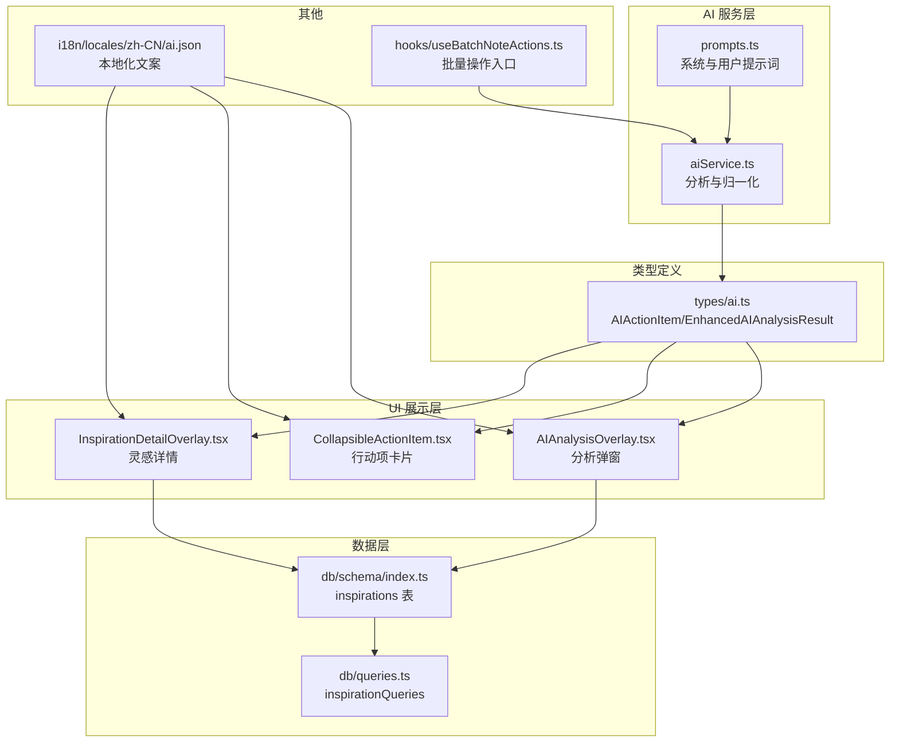
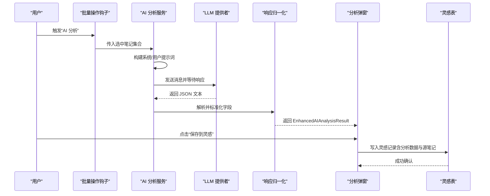
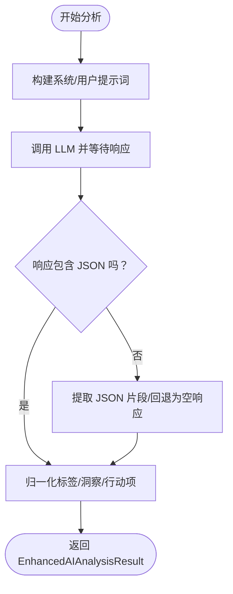
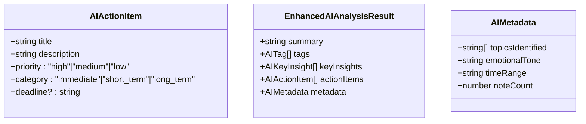
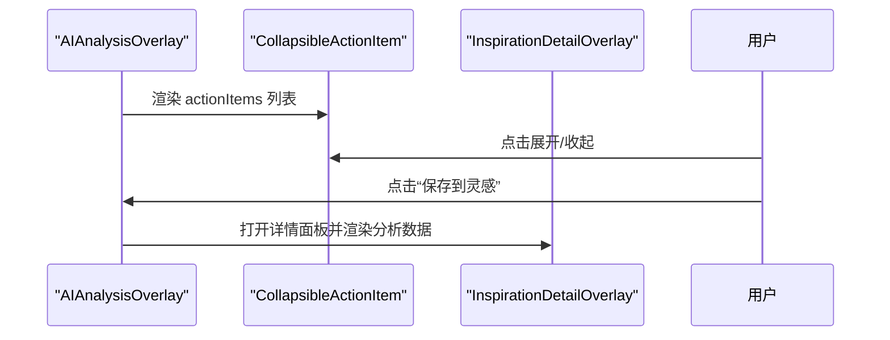
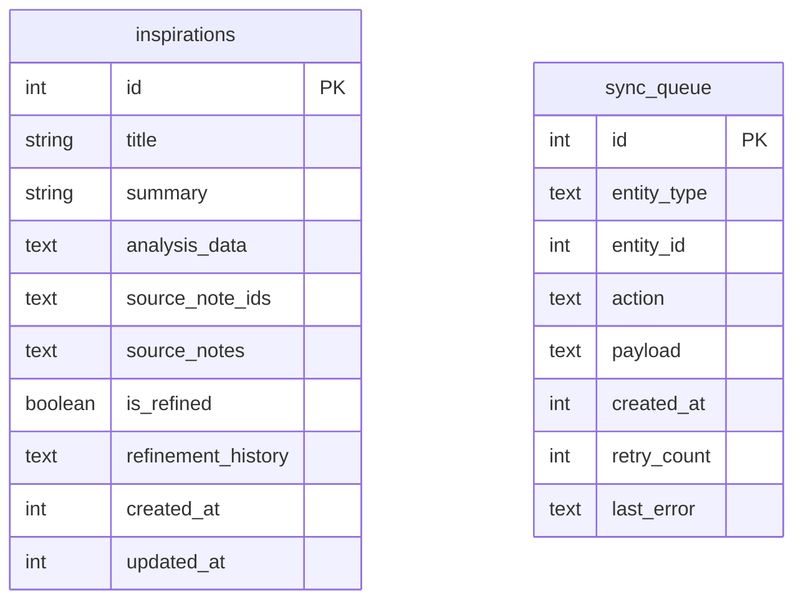
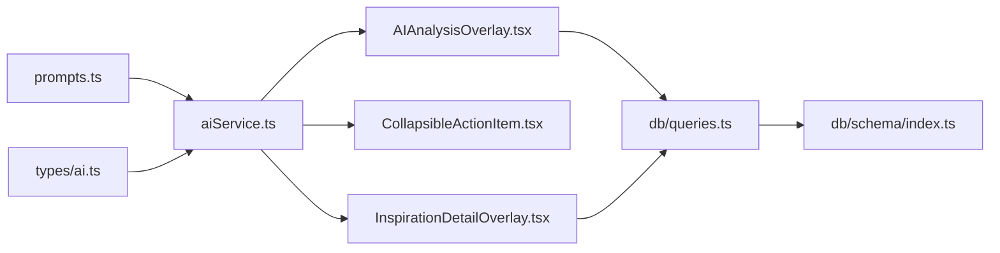

# 行动项提取

<cite>
**本文档引用的文件**
- [aiService.ts](file://services/ai/aiService.ts)
- [prompts.ts](file://services/ai/prompts.ts)
- [types/ai.ts](file://types/ai.ts)
- [AIAnalysisOverlay.tsx](file://components/note/AIAnalysisOverlay.tsx)
- [CollapsibleActionItem.tsx](file://components/note/CollapsibleActionItem.tsx)
- [InspirationDetailOverlay.tsx](file://components/note/InspirationDetailOverlay.tsx)
- [schema/index.ts](file://db/schema/index.ts)
- [queries.ts](file://db/queries.ts)
- [useBatchNoteActions.ts](file://hooks/useBatchNoteActions.ts)
- [ai.json](file://i18n/locales/zh-CN/ai.json)
</cite>

## 目录
1. [简介](#简介)
2. [项目结构](#项目结构)
3. [核心组件](#核心组件)
4. [架构总览](#架构总览)
5. [详细组件分析](#详细组件分析)
6. [依赖关系分析](#依赖关系分析)
7. [性能考虑](#性能考虑)
8. [故障排查指南](#故障排查指南)
9. [结论](#结论)
10. [附录](#附录)

## 简介
本文件围绕“行动项提取”能力进行系统化技术文档编写，覆盖以下方面：
- AI 行动项提取的算法设计与实现路径：任务识别、优先级分类、截止日期推断的提示词策略与后处理逻辑
- 行动项数据结构定义：标题、描述、优先级、类别、截止日期等字段
- 优先级与时间分类体系：高/中/低、立即/短期/长期
- 行动项的导入、导出与同步机制：灵感存储、持久化与队列同步
- 使用与最佳实践：如何调用、如何处理结果、如何优化体验

## 项目结构
与“行动项提取”直接相关的模块分布如下：
- AI 服务层：负责构建提示词、调用 LLM、解析与归一化响应
- 类型定义：统一 AI 结果的数据结构
- UI 展示层：分析弹窗、行动项折叠卡片、灵感详情面板
- 数据层：灵感表结构与查询、同步队列表
- 国际化：AI 分析界面文案与分类标签本地化

图表来源
- [aiService.ts:126-162](file://services/ai/aiService.ts#L126-L162)
- [prompts.ts:1-179](file://services/ai/prompts.ts#L1-L179)
- [types/ai.ts:13-47](file://types/ai.ts#L13-L47)
- [AIAnalysisOverlay.tsx:115-239](file://components/note/AIAnalysisOverlay.tsx#L115-L239)
- [CollapsibleActionItem.tsx:21-94](file://components/note/CollapsibleActionItem.tsx#L21-L94)
- [InspirationDetailOverlay.tsx:60-218](file://components/note/InspirationDetailOverlay.tsx#L60-L218)
- [schema/index.ts:63-75](file://db/schema/index.ts#L63-L75)
- [queries.ts:166-198](file://db/queries.ts#L166-L198)
- [ai.json:1-33](file://i18n/locales/zh-CN/ai.json#L1-L33)
- [useBatchNoteActions.ts:199-241](file://hooks/useBatchNoteActions.ts#L199-L241)

章节来源
- [aiService.ts:126-162](file://services/ai/aiService.ts#L126-L162)
- [prompts.ts:1-179](file://services/ai/prompts.ts#L1-L179)
- [types/ai.ts:13-47](file://types/ai.ts#L13-L47)
- [AIAnalysisOverlay.tsx:115-239](file://components/note/AIAnalysisOverlay.tsx#L115-L239)
- [CollapsibleActionItem.tsx:21-94](file://components/note/CollapsibleActionItem.tsx#L21-L94)
- [InspirationDetailOverlay.tsx:60-218](file://components/note/InspirationDetailOverlay.tsx#L60-L218)
- [schema/index.ts:63-75](file://db/schema/index.ts#L63-L75)
- [queries.ts:166-198](file://db/queries.ts#L166-L198)
- [ai.json:1-33](file://i18n/locales/zh-CN/ai.json#L1-L33)
- [useBatchNoteActions.ts:199-241](file://hooks/useBatchNoteActions.ts#L199-L241)

## 核心组件
- AI 分析服务：封装系统提示词、用户提示词拼装、LLM 调用、响应提取与归一化
- 类型系统：定义行动项、洞察、标签、元数据与完整分析结果的结构
- UI 组件：分析弹窗、行动项折叠卡片、灵感详情面板
- 数据模型：灵感表用于持久化分析结果与源笔记映射
- 批量操作钩子：触发 AI 分析、保存为灵感、清理选择态

章节来源
- [aiService.ts:126-162](file://services/ai/aiService.ts#L126-L162)
- [types/ai.ts:13-47](file://types/ai.ts#L13-L47)
- [AIAnalysisOverlay.tsx:115-239](file://components/note/AIAnalysisOverlay.tsx#L115-L239)
- [CollapsibleActionItem.tsx:21-94](file://components/note/CollapsibleActionItem.tsx#L21-L94)
- [schema/index.ts:63-75](file://db/schema/index.ts#L63-L75)
- [useBatchNoteActions.ts:199-241](file://hooks/useBatchNoteActions.ts#L199-L241)

## 架构总览
AI 行动项提取的端到端流程如下：

图表来源
- [useBatchNoteActions.ts:199-241](file://hooks/useBatchNoteActions.ts#L199-L241)
- [aiService.ts:126-162](file://services/ai/aiService.ts#L126-L162)
- [prompts.ts:97-109](file://services/ai/prompts.ts#L97-L109)
- [AIAnalysisOverlay.tsx:130-139](file://components/note/AIAnalysisOverlay.tsx#L130-L139)
- [schema/index.ts:63-75](file://db/schema/index.ts#L63-L75)

## 详细组件分析

### AI 分析服务与提示词
- 系统提示词明确目标：将洞察转化为 SMART 原则的行动项；按“紧急且重要 > 重要不紧急 > 紧急不重要”的优先级排序；提供“今天/本周/本月”等时间建议
- 用户提示词包含数据概览（笔记数量、时间跨度、高频标签、类型分布）与原始笔记文本
- 分析函数负责超时控制、JSON 提取、响应解析与归一化

图表来源
- [prompts.ts:1-95](file://services/ai/prompts.ts#L1-L95)
- [prompts.ts:97-179](file://services/ai/prompts.ts#L97-L179)
- [aiService.ts:126-162](file://services/ai/aiService.ts#L126-L162)
- [aiService.ts:34-46](file://services/ai/aiService.ts#L34-L46)
- [aiService.ts:95-124](file://services/ai/aiService.ts#L95-L124)

章节来源
- [prompts.ts:1-95](file://services/ai/prompts.ts#L1-L95)
- [prompts.ts:97-179](file://services/ai/prompts.ts#L97-L179)
- [aiService.ts:126-162](file://services/ai/aiService.ts#L126-L162)
- [aiService.ts:34-46](file://services/ai/aiService.ts#L34-L46)
- [aiService.ts:95-124](file://services/ai/aiService.ts#L95-L124)

### 行动项数据结构与归一化
- 行动项字段：标题、描述、优先级（high/medium/low）、类别（immediate/short_term/long_term）、截止日期（可选）
- 归一化策略：字符串自动包装为默认优先级与类别的行动项；对象字段进行类型校验与默认值填充；deadline 字段可选保留

图表来源
- [types/ai.ts:13-47](file://types/ai.ts#L13-L47)

章节来源
- [types/ai.ts:13-47](file://types/ai.ts#L13-L47)
- [aiService.ts:78-93](file://services/ai/aiService.ts#L78-L93)
- [aiService.ts:95-124](file://services/ai/aiService.ts#L95-L124)

### UI 展示与交互
- 分析弹窗：显示摘要、标签、洞察、行动项，并支持保存为灵感
- 行动项卡片：展开/收起查看描述、优先级徽标、时间类别与截止日期
- 灵感详情：以卡片形式展示分析结果，支持跳转到源笔记

图表来源
- [AIAnalysisOverlay.tsx:115-239](file://components/note/AIAnalysisOverlay.tsx#L115-L239)
- [CollapsibleActionItem.tsx:21-94](file://components/note/CollapsibleActionItem.tsx#L21-L94)
- [InspirationDetailOverlay.tsx:60-218](file://components/note/InspirationDetailOverlay.tsx#L60-L218)

章节来源
- [AIAnalysisOverlay.tsx:115-239](file://components/note/AIAnalysisOverlay.tsx#L115-L239)
- [CollapsibleActionItem.tsx:21-94](file://components/note/CollapsibleActionItem.tsx#L21-L94)
- [InspirationDetailOverlay.tsx:60-218](file://components/note/InspirationDetailOverlay.tsx#L60-L218)

### 导入、导出与同步机制
- 导入：从选中笔记集合触发 AI 分析，生成 EnhancedAIAnalysisResult
- 导出/保存：将分析结果写入灵感表（inspirations），包含 analysisData、sourceNoteIds、sourceNotes 等字段
- 同步：通过 sync_queue 表记录待同步实体与动作，支持重试与错误记录（当前仓库未直接暴露同步调度器，但 schema 已具备）

图表来源
- [schema/index.ts:63-75](file://db/schema/index.ts#L63-L75)
- [schema/index.ts:43-52](file://db/schema/index.ts#L43-L52)

章节来源
- [schema/index.ts:63-75](file://db/schema/index.ts#L63-L75)
- [schema/index.ts:43-52](file://db/schema/index.ts#L43-L52)
- [queries.ts:166-198](file://db/queries.ts#L166-L198)

### 优先级与时间分类体系
- 优先级：high（高）、medium（中）、low（低）
- 时间分类：immediate（立即）、short_term（短期）、long_term（长期）
- UI 中通过徽标颜色与文案标识，本地化资源提供对应标签

章节来源
- [CollapsibleActionItem.tsx:9-19](file://components/note/CollapsibleActionItem.tsx#L9-L19)
- [ai.json:26-31](file://i18n/locales/zh-CN/ai.json#L26-L31)

## 依赖关系分析
- AI 分析服务依赖提示词构建与 LLM 提供者；对响应进行 JSON 提取与归一化
- UI 组件依赖类型定义与本地化资源；负责交互与数据展示
- 数据层通过灵感表持久化分析结果；查询层提供 CRUD 能力
- 批量操作钩子作为入口协调 UI 与服务层

图表来源
- [prompts.ts:1-179](file://services/ai/prompts.ts#L1-L179)
- [aiService.ts:126-162](file://services/ai/aiService.ts#L126-L162)
- [types/ai.ts:13-47](file://types/ai.ts#L13-L47)
- [AIAnalysisOverlay.tsx:115-239](file://components/note/AIAnalysisOverlay.tsx#L115-L239)
- [CollapsibleActionItem.tsx:21-94](file://components/note/CollapsibleActionItem.tsx#L21-L94)
- [InspirationDetailOverlay.tsx:60-218](file://components/note/InspirationDetailOverlay.tsx#L60-L218)
- [queries.ts:166-198](file://db/queries.ts#L166-L198)
- [schema/index.ts:63-75](file://db/schema/index.ts#L63-L75)

章节来源
- [prompts.ts:1-179](file://services/ai/prompts.ts#L1-L179)
- [aiService.ts:126-162](file://services/ai/aiService.ts#L126-L162)
- [types/ai.ts:13-47](file://types/ai.ts#L13-L47)
- [AIAnalysisOverlay.tsx:115-239](file://components/note/AIAnalysisOverlay.tsx#L115-L239)
- [CollapsibleActionItem.tsx:21-94](file://components/note/CollapsibleActionItem.tsx#L21-L94)
- [InspirationDetailOverlay.tsx:60-218](file://components/note/InspirationDetailOverlay.tsx#L60-L218)
- [queries.ts:166-198](file://db/queries.ts#L166-L198)
- [schema/index.ts:63-75](file://db/schema/index.ts#L63-L75)

## 性能考虑
- 提示词构造：对大量笔记进行格式化时，注意避免过长的单次请求负载；可通过分批或截断策略降低上下文长度
- JSON 提取：采用正则匹配与回退策略，确保在非标准格式下仍能稳定解析
- UI 渲染：列表项使用 memo 化组件（如折叠卡片）减少重绘；异步保存时提供加载状态反馈
- 数据持久化：批量保存灵感时，建议合并网络请求与缓存更新，避免频繁刷新

## 故障排查指南
- AI 未配置：若未配置 LLM，批量操作会直接进入错误态并提示“请先配置 AI 服务”
- 空响应：当 LLM 返回空内容或非 JSON 文本时，服务会抛出异常；检查提示词与模型参数
- 归一化失败：若字段类型不符，将被忽略或使用默认值；检查上游输出格式一致性
- 保存失败：保存为灵感时需确保分析结果存在；检查 JSON 序列化与数据库写入权限

章节来源
- [useBatchNoteActions.ts:199-211](file://hooks/useBatchNoteActions.ts#L199-L211)
- [aiService.ts:149-153](file://services/ai/aiService.ts#L149-L153)
- [aiService.ts:78-93](file://services/ai/aiService.ts#L78-L93)
- [AIAnalysisOverlay.tsx:130-139](file://components/note/AIAnalysisOverlay.tsx#L130-L139)

## 结论
该实现以清晰的提示词策略与稳健的响应归一化为核心，结合 UI 展示与灵感持久化，形成了完整的“行动项提取”闭环。优先级与时间分类体系直观可用，便于用户快速识别与执行。建议在生产环境中进一步完善批量化与错误重试机制，并持续优化提示词以提升行动项的可执行性与准确性。

## 附录
- 代码示例路径（仅路径，不含具体代码内容）
  - 触发 AI 分析与保存为灵感：[useBatchNoteActions.ts:199-241](file://hooks/useBatchNoteActions.ts#L199-L241)
  - 构建提示词与调用 LLM：[prompts.ts:97-109](file://services/ai/prompts.ts#L97-L109)，[aiService.ts:126-162](file://services/ai/aiService.ts#L126-L162)
  - 归一化行动项字段：[aiService.ts:78-93](file://services/ai/aiService.ts#L78-L93)，[aiService.ts:95-124](file://services/ai/aiService.ts#L95-L124)
  - 行动项 UI 展示与交互：[CollapsibleActionItem.tsx:21-94](file://components/note/CollapsibleActionItem.tsx#L21-L94)
  - 灵感详情面板渲染：[InspirationDetailOverlay.tsx:60-218](file://components/note/InspirationDetailOverlay.tsx#L60-L218)
  - 灵感表结构与查询：[schema/index.ts:63-75](file://db/schema/index.ts#L63-L75)，[queries.ts:166-198](file://db/queries.ts#L166-L198)
  - 本地化文案：[ai.json:26-31](file://i18n/locales/zh-CN/ai.json#L26-L31)