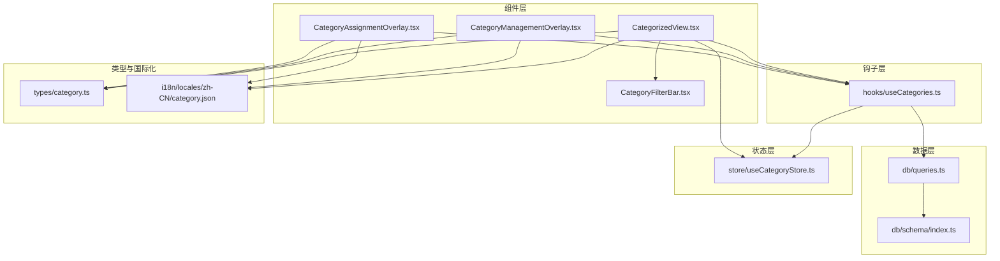
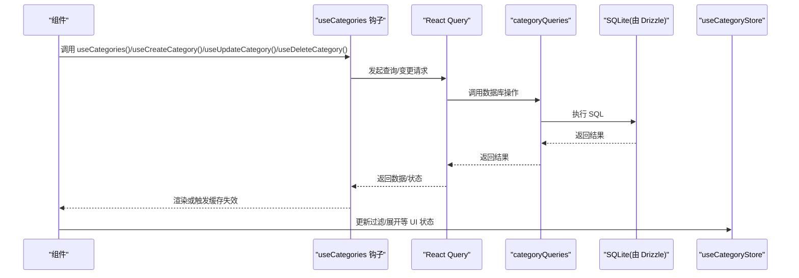
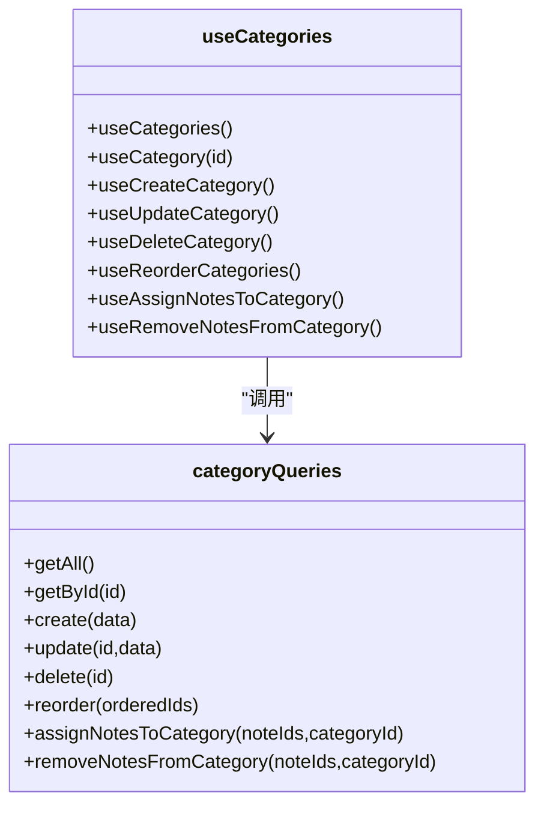
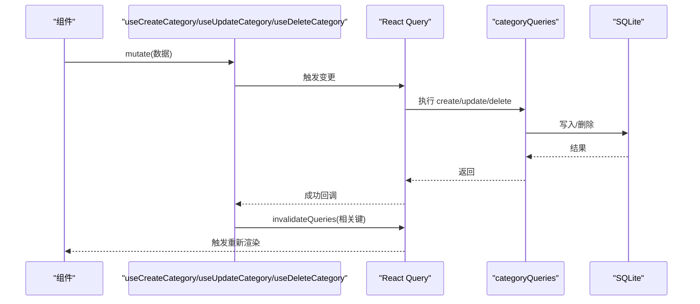
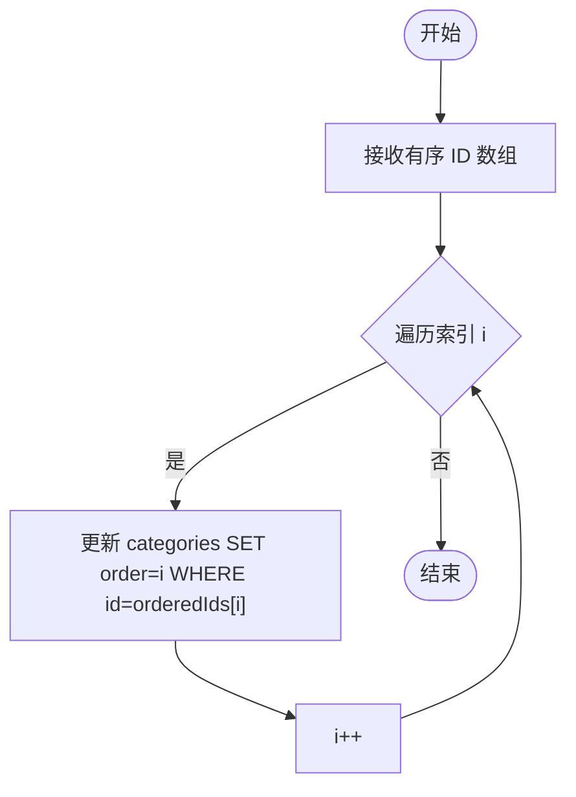
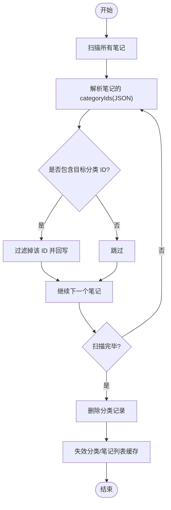
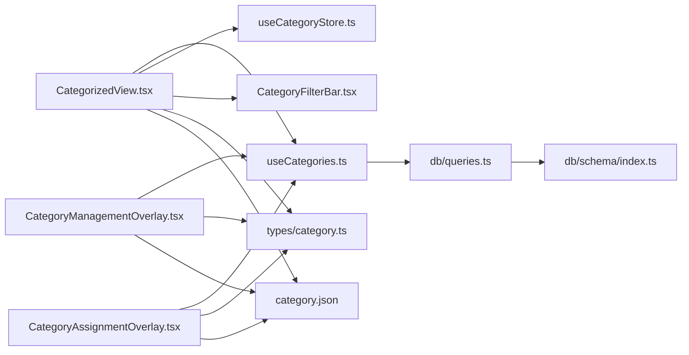

# 分类 CRUD 操作

<cite>
**本文引用的文件**
- [hooks/useCategories.ts](file://hooks/useCategories.ts)
- [db/queries.ts](file://db/queries.ts)
- [db/schema/index.ts](file://db/schema/index.ts)
- [store/useCategoryStore.ts](file://store/useCategoryStore.ts)
- [types/category.ts](file://types/category.ts)
- [components/note/category/CategorizedView.tsx](file://components/note/category/CategorizedView.tsx)
- [components/note/category/CategoryManagementOverlay.tsx](file://components/note/category/CategoryManagementOverlay.tsx)
- [components/note/category/CategoryAssignmentOverlay.tsx](file://components/note/category/CategoryAssignmentOverlay.tsx)
- [components/note/category/CategoryFilterBar.tsx](file://components/note/category/CategoryFilterBar.tsx)
- [hooks/useCategorizedNotes.ts](file://hooks/useCategorizedNotes.ts)
- [i18n/locales/zh-CN/category.json](file://i18n/locales/zh-CN/category.json)
- [.trellis/spec/frontend/state-management.md](file://.trellis/spec/frontend/state-management.md)
- [.trellis/spec/frontend/hook-guidelines.md](file://.trellis/spec/frontend/hook-guidelines.md)
</cite>

## 目录
1. [简介](#简介)
2. [项目结构](#项目结构)
3. [核心组件](#核心组件)
4. [架构总览](#架构总览)
5. [详细组件分析](#详细组件分析)
6. [依赖关系分析](#依赖关系分析)
7. [性能考量](#性能考量)
8. [故障排查指南](#故障排查指南)
9. [结论](#结论)
10. [附录](#附录)

## 简介
本文件系统性地阐述语音笔记应用中的“分类”CRUD（创建、读取、更新、删除）与相关功能，包括：
- 使用 useCreateCategory、useUpdateCategory、useDeleteCategory 等自定义 Hook 的工作机制与参数配置
- 分类查询的缓存策略与数据同步机制
- 在组件中如何使用这些 Hook 实现分类管理
- 分类排序（reorder）的实现原理与事务处理
- 删除分类时的数据一致性保证与级联处理
- 错误处理、加载状态管理与用户反馈的最佳实践
- 扩展与自定义指导

## 项目结构
围绕分类功能的关键目录与文件如下：
- 钩子层：hooks/useCategories.ts 提供分类查询与变更的 React Query 钩子
- 数据层：db/queries.ts 定义分类数据库操作；db/schema/index.ts 描述分类表结构
- 状态层：store/useCategoryStore.ts 提供 UI 状态（过滤、展开、弹窗可见）
- 组件层：components/note/category 下的多个组件负责展示与交互
- 类型与国际化：types/category.ts、i18n/locales/zh-CN/category.json

图表来源
- [hooks/useCategories.ts:1-94](file://hooks/useCategories.ts#L1-L94)
- [db/queries.ts:200-286](file://db/queries.ts#L200-L286)
- [db/schema/index.ts:54-61](file://db/schema/index.ts#L54-L61)
- [store/useCategoryStore.ts:1-56](file://store/useCategoryStore.ts#L1-L56)
- [components/note/category/CategorizedView.tsx:1-190](file://components/note/category/CategorizedView.tsx#L1-L190)
- [components/note/category/CategoryManagementOverlay.tsx:1-332](file://components/note/category/CategoryManagementOverlay.tsx#L1-L332)
- [components/note/category/CategoryAssignmentOverlay.tsx:1-318](file://components/note/category/CategoryAssignmentOverlay.tsx#L1-L318)
- [components/note/category/CategoryFilterBar.tsx:1-123](file://components/note/category/CategoryFilterBar.tsx#L1-L123)
- [types/category.ts:1-17](file://types/category.ts#L1-L17)
- [i18n/locales/zh-CN/category.json:1-26](file://i18n/locales/zh-CN/category.json#L1-L26)

章节来源
- [hooks/useCategories.ts:1-94](file://hooks/useCategories.ts#L1-L94)
- [db/queries.ts:200-286](file://db/queries.ts#L200-L286)
- [db/schema/index.ts:54-61](file://db/schema/index.ts#L54-L61)
- [store/useCategoryStore.ts:1-56](file://store/useCategoryStore.ts#L1-L56)
- [components/note/category/CategorizedView.tsx:1-190](file://components/note/category/CategorizedView.tsx#L1-L190)
- [components/note/category/CategoryManagementOverlay.tsx:1-332](file://components/note/category/CategoryManagementOverlay.tsx#L1-L332)
- [components/note/category/CategoryAssignmentOverlay.tsx:1-318](file://components/note/category/CategoryAssignmentOverlay.tsx#L1-L318)
- [components/note/category/CategoryFilterBar.tsx:1-123](file://components/note/category/CategoryFilterBar.tsx#L1-L123)
- [types/category.ts:1-17](file://types/category.ts#L1-L17)
- [i18n/locales/zh-CN/category.json:1-26](file://i18n/locales/zh-CN/category.json#L1-L26)

## 核心组件
- 查询与变更钩子：useCategories、useCategory、useCreateCategory、useUpdateCategory、useDeleteCategory、useReorderCategories、useAssignNotesToCategory、useRemoveNotesFromCategory
- 数据库查询：categoryQueries（getAll、getById、create、update、delete、reorder、assignNotesToCategory、removeNotesFromCategory）
- UI 状态：useCategoryStore（过滤器、展开状态、管理/分配弹窗可见）
- 类型与分组：CategorizedGroup、CategoryFilter、useCategorizedNotes
- 国际化键值：category.json

章节来源
- [hooks/useCategories.ts:14-93](file://hooks/useCategories.ts#L14-L93)
- [db/queries.ts:200-286](file://db/queries.ts#L200-L286)
- [store/useCategoryStore.ts:4-55](file://store/useCategoryStore.ts#L4-L55)
- [types/category.ts:3-16](file://types/category.ts#L3-L16)
- [hooks/useCategorizedNotes.ts:15-50](file://hooks/useCategorizedNotes.ts#L15-L50)

## 架构总览
分类功能采用“React Query + Drizzle ORM + Zustand”的分层架构：
- 钩子层：封装查询与变更逻辑，统一缓存失效策略
- 数据层：通过 Drizzle 访问 SQLite，提供原子数据库操作
- 状态层：Zustand 管理 UI 层状态（如过滤、展开、弹窗）
- 组件层：以函数式组件组合钩子与状态，完成渲染与交互

图表来源
- [hooks/useCategories.ts:14-93](file://hooks/useCategories.ts#L14-L93)
- [db/queries.ts:200-286](file://db/queries.ts#L200-L286)
- [store/useCategoryStore.ts:23-55](file://store/useCategoryStore.ts#L23-L55)

## 详细组件分析

### useCategories 钩子族
- useCategories：获取所有分类列表，按 order 排序
- useCategory(id)：按 id 获取单个分类详情，支持 enabled 条件
- useCreateCategory：创建分类，成功后使分类列表缓存失效
- useUpdateCategory：更新分类，成功后使分类相关缓存失效
- useDeleteCategory：删除分类，成功后同时失效分类列表与笔记列表缓存
- useReorderCategories：批量重排分类顺序，逐条更新 order 字段
- useAssignNotesToCategory / useRemoveNotesFromCategory：对笔记进行分类分配/移除，分别失效笔记与分类列表缓存

图表来源
- [hooks/useCategories.ts:14-93](file://hooks/useCategories.ts#L14-L93)
- [db/queries.ts:200-286](file://db/queries.ts#L200-L286)

章节来源
- [hooks/useCategories.ts:14-93](file://hooks/useCategories.ts#L14-L93)
- [db/queries.ts:200-286](file://db/queries.ts#L200-L286)

### 分类查询与缓存策略
- 查询键：categoryQueryKeys 提供统一的查询键命名规范，避免字符串硬编码
- 列表查询：useCategories 基于 categoryQueryKeys.list()，查询函数为 categoryQueries.getAll()
- 详情查询：useCategory 基于 categoryQueryKeys.detail(id)，并启用条件查询
- 缓存失效：变更成功回调统一调用 queryClient.invalidateQueries，确保 UI 与数据库一致

章节来源
- [hooks/useCategories.ts:6-27](file://hooks/useCategories.ts#L6-L27)
- [hooks/useCategories.ts:34-35](file://hooks/useCategories.ts#L34-L35)
- [hooks/useCategories.ts:44-46](file://hooks/useCategories.ts#L44-L46)
- [hooks/useCategories.ts:54-57](file://hooks/useCategories.ts#L54-L57)
- [hooks/useCategories.ts:65-67](file://hooks/useCategories.ts#L65-L67)
- [hooks/useCategories.ts:77-79](file://hooks/useCategories.ts#L77-L79)
- [hooks/useCategories.ts:89-91](file://hooks/useCategories.ts#L89-L91)

### 分类创建、读取、更新、删除流程
- 创建：组件收集新分类数据（名称、颜色、顺序），调用 useCreateCategory.mutate，成功后自动刷新分类列表
- 读取：useCategories 获取列表；useCategory 获取单个详情
- 更新：useUpdateCategory.mutate({ id, data })，成功后刷新相关缓存
- 删除：useDeleteCategory.mutate(id)，成功后同时刷新分类与笔记列表，确保界面一致性

图表来源
- [hooks/useCategories.ts:29-59](file://hooks/useCategories.ts#L29-L59)
- [db/queries.ts:211-245](file://db/queries.ts#L211-L245)

章节来源
- [hooks/useCategories.ts:29-59](file://hooks/useCategories.ts#L29-L59)
- [db/queries.ts:211-245](file://db/queries.ts#L211-L245)

### 分类排序（reorder）与事务处理
- 实现原理：useReorderCategories 接收一个包含分类 ID 的数组，按索引顺序逐条更新 order 字段
- 事务特性：当前实现为多次独立 UPDATE，未包裹显式事务；若需强一致性，可在数据库层增加事务包装或使用批量事务语句

图表来源
- [hooks/useCategories.ts:61-69](file://hooks/useCategories.ts#L61-L69)
- [db/queries.ts:247-253](file://db/queries.ts#L247-L253)

章节来源
- [hooks/useCategories.ts:61-69](file://hooks/useCategories.ts#L61-L69)
- [db/queries.ts:247-253](file://db/queries.ts#L247-L253)

### 删除分类的一致性与级联处理
- 数据一致性：删除分类前，先扫描所有笔记，移除其中包含该分类 ID 的记录，再删除分类本身
- 级联处理：通过 JSON 解析与过滤，确保笔记的 categoryIds 字段保持一致；删除后同时失效分类与笔记列表缓存

图表来源
- [db/queries.ts:229-245](file://db/queries.ts#L229-L245)
- [hooks/useCategories.ts:50-59](file://hooks/useCategories.ts#L50-L59)

章节来源
- [db/queries.ts:229-245](file://db/queries.ts#L229-L245)
- [hooks/useCategories.ts:50-59](file://hooks/useCategories.ts#L50-L59)

### 分类分配与移除（多笔记批量操作）
- 分配：useAssignNotesToCategory 对每个笔记解析 categoryIds，去重后追加新分类 ID 并回写
- 移除：useRemoveNotesFromCategory 同步移除指定分类 ID
- 缓存策略：成功后同时失效笔记与分类列表缓存，保证视图一致

章节来源
- [db/queries.ts:255-284](file://db/queries.ts#L255-L284)
- [hooks/useCategories.ts:71-93](file://hooks/useCategories.ts#L71-L93)

### 组件使用示例与最佳实践
- 管理分类弹窗：CategoryManagementOverlay
  - 新建：收集输入名称，计算颜色与顺序，调用 useCreateCategory.mutate
  - 编辑：调用 useUpdateCategory.mutate({ id, data: { name } })
  - 删除：调用 useDeleteCategory.mutate(id)，并配合确认对话框
  - 排序：根据当前列表生成 ID 序列，调用 useReorderCategories.mutate
- 分配分类弹窗：CategoryAssignmentOverlay
  - 多选分类，调用 useAssignNotesToCategory.mutateAsync 批量分配
  - 支持即时创建新分类并分配
- 列表视图：CategorizedView
  - 使用 useCategories 获取分类，结合 useCategorizedNotes 将笔记按分类分组
  - 使用 useCategoryStore 管理过滤与展开状态
  - 使用 CategoryFilterBar 展示筛选按钮

章节来源
- [components/note/category/CategoryManagementOverlay.tsx:87-134](file://components/note/category/CategoryManagementOverlay.tsx#L87-L134)
- [components/note/category/CategoryAssignmentOverlay.tsx:91-105](file://components/note/category/CategoryAssignmentOverlay.tsx#L91-L105)
- [components/note/category/CategorizedView.tsx:27-125](file://components/note/category/CategorizedView.tsx#L27-L125)
- [components/note/category/CategoryFilterBar.tsx:15-95](file://components/note/category/CategoryFilterBar.tsx#L15-L95)

### 错误处理、加载状态与用户反馈
- 加载与错误：建议在组件中使用 React Query 的 loading/error 状态进行反馈
- 回滚与重试：可参考其他资源变更钩子的模式，在 onError 中进行本地回滚并在 onSettled 中统一失效缓存
- 用户反馈：利用国际化键值（如 toastCreated、toastDeleted、toastAssigned）提示用户操作结果

章节来源
- [.trellis/spec/frontend/hook-guidelines.md:85-132](file://.trellis/spec/frontend/hook-guidelines.md#L85-L132)
- [.trellis/spec/frontend/state-management.md:79-140](file://.trellis/spec/frontend/state-management.md#L79-L140)
- [i18n/locales/zh-CN/category.json:19-21](file://i18n/locales/zh-CN/category.json#L19-L21)

## 依赖关系分析
- 钩子依赖数据库查询：useCategories.* 依赖 categoryQueries.*
- 组件依赖钩子与状态：CategorizedView、CategoryManagementOverlay、CategoryAssignmentOverlay 依赖 useCategories 与 useCategoryStore
- 类型与国际化：CategorizedGroup、CategoryFilter、PREDEFINED_COLORS 用于组件渲染与文案

图表来源
- [components/note/category/CategoryManagementOverlay.tsx:24-30](file://components/note/category/CategoryManagementOverlay.tsx#L24-L30)
- [components/note/category/CategoryAssignmentOverlay.tsx:22-26](file://components/note/category/CategoryAssignmentOverlay.tsx#L22-L26)
- [components/note/category/CategorizedView.tsx:8-12](file://components/note/category/CategorizedView.tsx#L8-L12)
- [hooks/useCategories.ts:14-93](file://hooks/useCategories.ts#L14-L93)
- [db/queries.ts:200-286](file://db/queries.ts#L200-L286)
- [db/schema/index.ts:54-61](file://db/schema/index.ts#L54-L61)
- [store/useCategoryStore.ts:4-55](file://store/useCategoryStore.ts#L4-L55)
- [types/category.ts:3-16](file://types/category.ts#L3-L16)
- [i18n/locales/zh-CN/category.json:1-26](file://i18n/locales/zh-CN/category.json#L1-L26)

章节来源
- [hooks/useCategories.ts:14-93](file://hooks/useCategories.ts#L14-L93)
- [db/queries.ts:200-286](file://db/queries.ts#L200-L286)
- [db/schema/index.ts:54-61](file://db/schema/index.ts#L54-L61)
- [store/useCategoryStore.ts:4-55](file://store/useCategoryStore.ts#L4-L55)
- [types/category.ts:3-16](file://types/category.ts#L3-L16)
- [i18n/locales/zh-CN/category.json:1-26](file://i18n/locales/zh-CN/category.json#L1-L26)

## 性能考量
- 查询缓存：合理设置 staleTime 与 refetch 策略，减少不必要的网络/数据库访问
- 批量操作：分配/移除分类时，建议合并为一次数据库往返（如批量更新），降低往返次数
- 排序：当前逐条更新 order，若分类数量较大，可考虑一次性批量更新以减少事务开销
- UI 状态：使用 Zustand 管理轻量 UI 状态，避免污染 React Query 的服务器状态

## 故障排查指南
- 变更后 UI 不刷新
  - 检查是否在 onSuccess 中调用了 queryClient.invalidateQueries
  - 确认使用的 queryKey 与导出的 categoryQueryKeys 一致
- 删除分类后笔记仍显示在该分类
  - 确认数据库层已正确移除笔记中的分类 ID
  - 检查 JSON 解析异常分支是否吞掉了错误
- 排序不生效
  - 确认传入的 ID 顺序与 UI 一致
  - 检查是否存在并发更新导致的覆盖
- 国际化文案缺失
  - 检查 i18n 键值是否存在且拼写正确

章节来源
- [hooks/useCategories.ts:34-35](file://hooks/useCategories.ts#L34-L35)
- [hooks/useCategories.ts:44-46](file://hooks/useCategories.ts#L44-L46)
- [hooks/useCategories.ts:54-57](file://hooks/useCategories.ts#L54-L57)
- [hooks/useCategories.ts:65-67](file://hooks/useCategories.ts#L65-L67)
- [hooks/useCategories.ts:77-79](file://hooks/useCategories.ts#L77-L79)
- [hooks/useCategories.ts:89-91](file://hooks/useCategories.ts#L89-L91)
- [db/queries.ts:229-245](file://db/queries.ts#L229-L245)
- [db/queries.ts:247-253](file://db/queries.ts#L247-L253)
- [i18n/locales/zh-CN/category.json:19-21](file://i18n/locales/zh-CN/category.json#L19-L21)

## 结论
本方案通过 React Query + Drizzle ORM + Zustand 的清晰分层，实现了分类 CRUD 的完整闭环：从查询、变更到缓存失效与 UI 同步均有明确的实现与最佳实践。排序与批量分配/移除提供了良好的扩展点，删除时的数据一致性通过预处理与缓存失效得到保障。建议在后续迭代中引入更强的事务控制与批量优化，进一步提升性能与可靠性。

## 附录
- 表结构要点：categories 表包含 id、name、color、order、createdAt、updatedAt；notes 表包含 categoryIds（JSON 文本数组）
- 类型与分组：CategorizedGroup 用于将笔记按分类聚合；CategoryFilter 支持 all/uncategorized/category 三种过滤模式
- 国际化：category.json 提供分类模块的文案键值，便于多语言扩展

章节来源
- [db/schema/index.ts:54-61](file://db/schema/index.ts#L54-L61)
- [db/schema/index.ts:3-17](file://db/schema/index.ts#L3-L17)
- [types/category.ts:3-16](file://types/category.ts#L3-L16)
- [i18n/locales/zh-CN/category.json:1-26](file://i18n/locales/zh-CN/category.json#L1-L26)