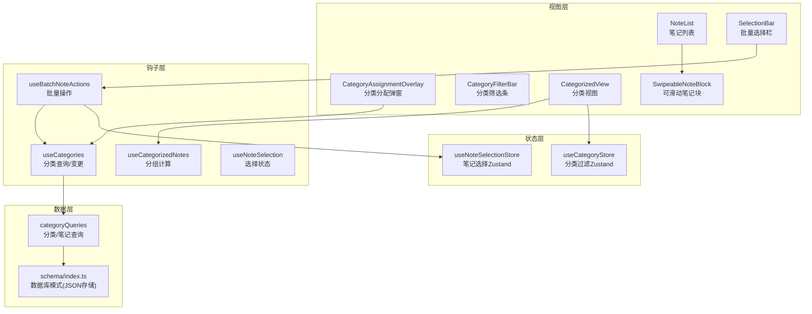
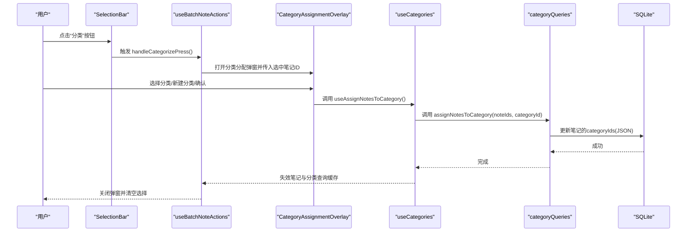
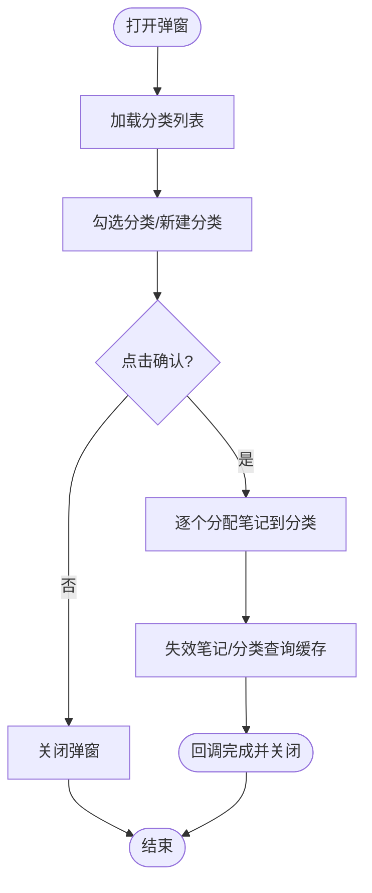
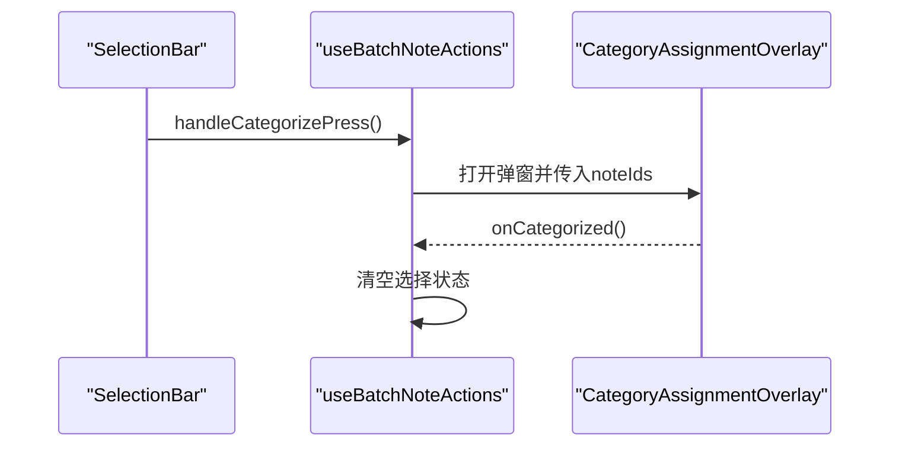
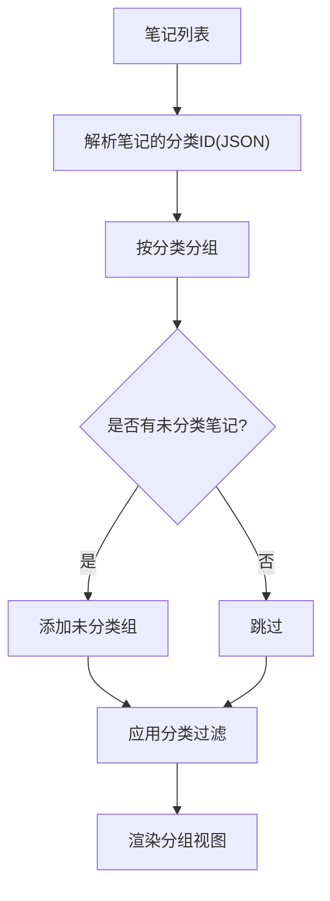
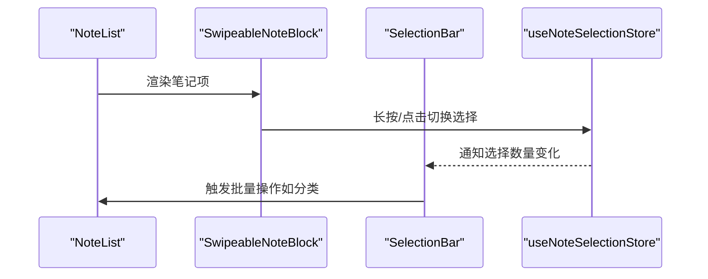
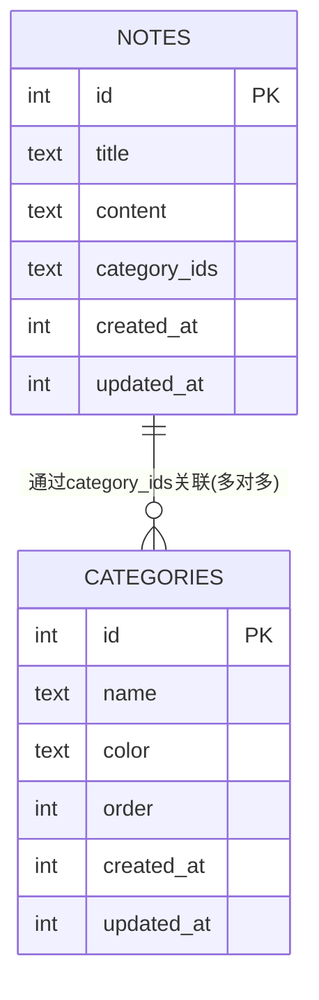
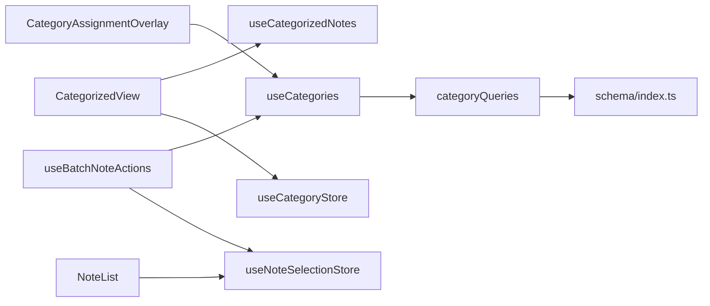

# 分类分配功能

<cite>
**本文档引用的文件**
- [CategoryAssignmentOverlay.tsx](file://components/note/category/CategoryAssignmentOverlay.tsx)
- [useCategories.ts](file://hooks/useCategories.ts)
- [useBatchNoteActions.ts](file://hooks/useBatchNoteActions.ts)
- [useCategorizedNotes.ts](file://hooks/useCategorizedNotes.ts)
- [useNoteSelection.ts](file://hooks/useNoteSelection.ts)
- [useNoteSelectionStore.ts](file://store/useNoteSelectionStore.ts)
- [useCategoryStore.ts](file://store/useCategoryStore.ts)
- [CategoryFilterBar.tsx](file://components/note/category/CategoryFilterBar.tsx)
- [CategorizedView.tsx](file://components/note/category/CategorizedView.tsx)
- [NoteList.tsx](file://components/note/NoteList.tsx)
- [SwipeableNoteBlock.tsx](file://components/note/SwipeableNoteBlock.tsx)
- [SelectionBar.tsx](file://components/note/SelectionBar.tsx)
- [queries.ts](file://db/queries.ts)
- [schema/index.ts](file://db/schema/index.ts)
- [category.ts](file://types/category.ts)
- [category.json](file://i18n/locales/zh-CN/category.json)
</cite>

## 目录
1. [简介](#简介)
2. [项目结构](#项目结构)
3. [核心组件](#核心组件)
4. [架构总览](#架构总览)
5. [详细组件分析](#详细组件分析)
6. [依赖关系分析](#依赖关系分析)
7. [性能考虑](#性能考虑)
8. [故障排除指南](#故障排除指南)
9. [结论](#结论)
10. [附录](#附录)

## 简介
本文件系统性地介绍语音笔记应用中的分类分配功能，涵盖设计原理、用户交互流程、批量笔记分类分配的实现机制、实时更新策略与状态同步、与筛选的关系及数据一致性保障、撤销机制与批量优化策略，以及用户体验优化建议与扩展实现指导。目标是帮助开发者快速理解并高效扩展分类分配能力。

## 项目结构
分类分配功能主要分布在以下层次：
- 视图层：分类分配弹窗、分类筛选条、分类视图、笔记列表与可滑动笔记块、批量选择栏
- 钩子层：分类查询与变更（React Query）、笔记批量操作（React Query + Zustand）
- 状态层：笔记选择状态（Zustand）、分类过滤与管理状态（Zustand）
- 数据层：Drizzle ORM 查询与数据库模式（JSON 存储分类 ID 列表）

**图表来源**
- [CategoryAssignmentOverlay.tsx:1-318](file://components/note/category/CategoryAssignmentOverlay.tsx#L1-L318)
- [useCategories.ts:1-94](file://hooks/useCategories.ts#L1-L94)
- [useBatchNoteActions.ts:1-287](file://hooks/useBatchNoteActions.ts#L1-L287)
- [useCategorizedNotes.ts:1-53](file://hooks/useCategorizedNotes.ts#L1-L53)
- [useNoteSelection.ts:1-20](file://hooks/useNoteSelection.ts#L1-L20)
- [useNoteSelectionStore.ts:1-49](file://store/useNoteSelectionStore.ts#L1-L49)
- [useCategoryStore.ts:1-56](file://store/useCategoryStore.ts#L1-L56)
- [queries.ts:200-286](file://db/queries.ts#L200-L286)
- [schema/index.ts:1-75](file://db/schema/index.ts#L1-L75)

**章节来源**
- [CategoryAssignmentOverlay.tsx:1-318](file://components/note/category/CategoryAssignmentOverlay.tsx#L1-L318)
- [useCategories.ts:1-94](file://hooks/useCategories.ts#L1-L94)
- [useBatchNoteActions.ts:1-287](file://hooks/useBatchNoteActions.ts#L1-L287)
- [useCategorizedNotes.ts:1-53](file://hooks/useCategorizedNotes.ts#L1-L53)
- [useNoteSelection.ts:1-20](file://hooks/useNoteSelection.ts#L1-L20)
- [useNoteSelectionStore.ts:1-49](file://store/useNoteSelectionStore.ts#L1-L49)
- [useCategoryStore.ts:1-56](file://store/useCategoryStore.ts#L1-L56)
- [queries.ts:200-286](file://db/queries.ts#L200-L286)
- [schema/index.ts:1-75](file://db/schema/index.ts#L1-L75)

## 核心组件
- 分类分配弹窗：提供分类列表选择、新建分类、确认分配的交互界面，并通过动画呈现
- 批量笔记操作：封装归档、合并、AI分析与分类分配等批量动作的状态与流程
- 分类筛选条：横向滚动的分类标签，支持全选、未分类与按分类筛选
- 分组视图：基于分类对笔记进行分组展示，支持展开/折叠
- 笔记列表与可滑动块：提供长按进入选择模式、侧滑操作入口
- 选择栏：批量操作入口（分享、归档、合并、分类、AI），显示所选数量
- 状态管理：笔记选择状态与分类过滤/管理可见性状态

**章节来源**
- [CategoryAssignmentOverlay.tsx:1-318](file://components/note/category/CategoryAssignmentOverlay.tsx#L1-L318)
- [useBatchNoteActions.ts:1-287](file://hooks/useBatchNoteActions.ts#L1-L287)
- [CategoryFilterBar.tsx:1-123](file://components/note/category/CategoryFilterBar.tsx#L1-L123)
- [CategorizedView.tsx:1-74](file://components/note/category/CategorizedView.tsx#L1-L74)
- [NoteList.tsx:1-240](file://components/note/NoteList.tsx#L1-L240)
- [SwipeableNoteBlock.tsx:1-131](file://components/note/SwipeableNoteBlock.tsx#L1-L131)
- [SelectionBar.tsx:1-196](file://components/note/SelectionBar.tsx#L1-L196)
- [useNoteSelectionStore.ts:1-49](file://store/useNoteSelectionStore.ts#L1-L49)
- [useCategoryStore.ts:1-56](file://store/useCategoryStore.ts#L1-L56)

## 架构总览
分类分配功能采用“视图-钩子-状态-数据”四层架构：
- 视图层负责用户交互与反馈
- 钩子层通过 React Query 管理分类与笔记数据的查询与变更
- 状态层使用 Zustand 管理本地 UI 状态（选择、过滤、可见性）
- 数据层通过 Drizzle ORM 操作 SQLite，笔记以 JSON 字符串存储分类 ID 列表

**图表来源**
- [SelectionBar.tsx:107-119](file://components/note/SelectionBar.tsx#L107-L119)
- [useBatchNoteActions.ts:243-256](file://hooks/useBatchNoteActions.ts#L243-L256)
- [CategoryAssignmentOverlay.tsx:99-105](file://components/note/category/CategoryAssignmentOverlay.tsx#L99-L105)
- [useCategories.ts:71-81](file://hooks/useCategories.ts#L71-L81)
- [queries.ts:255-270](file://db/queries.ts#L255-L270)

## 详细组件分析

### 分类分配弹窗（CategoryAssignmentOverlay）
- 功能要点
  - 展示现有分类列表，支持多选
  - 新建分类：输入名称、自动分配颜色、顺序与时间戳
  - 确认分配：逐个调用分配接口，完成后回调关闭并清空选择
  - 动画与可见性：使用 reanimated 实现弹出/收起动画，避免在隐藏时渲染
- 交互设计
  - 顶部标题与计数显示当前选中笔记数量
  - 底部确认按钮禁用条件：未选择任何分类
  - 新建分类输入框回车提交，按钮根据输入是否为空启用
- 数据流
  - 读取分类列表（React Query）
  - 创建新分类（mutation 后失效分类列表缓存）
  - 分配笔记（mutation 后失效笔记与分类列表缓存）

**图表来源**
- [CategoryAssignmentOverlay.tsx:60-105](file://components/note/category/CategoryAssignmentOverlay.tsx#L60-L105)
- [useCategories.ts:29-81](file://hooks/useCategories.ts#L29-L81)

**章节来源**
- [CategoryAssignmentOverlay.tsx:1-318](file://components/note/category/CategoryAssignmentOverlay.tsx#L1-L318)
- [useCategories.ts:1-94](file://hooks/useCategories.ts#L1-L94)

### 批量笔记操作（useBatchNoteActions）
- 功能要点
  - 提供归档、合并、AI分析、分类分配等批量动作的统一入口
  - 维护确认对话框、合并预览、AI分析结果等 UI 状态
  - 在分类分配完成后清理选择状态
- 与分类分配的集成
  - handleCategorizePress 将选中笔记 ID 传递给分类分配弹窗
  - onCategorized 回调用于关闭弹窗并清空选择

**图表来源**
- [useBatchNoteActions.ts:243-256](file://hooks/useBatchNoteActions.ts#L243-L256)
- [SelectionBar.tsx:107-119](file://components/note/SelectionBar.tsx#L107-L119)

**章节来源**
- [useBatchNoteActions.ts:1-287](file://hooks/useBatchNoteActions.ts#L1-L287)
- [SelectionBar.tsx:1-196](file://components/note/SelectionBar.tsx#L1-L196)

### 分类筛选条与分组视图（CategoryFilterBar + CategorizedView）
- 分类筛选条
  - 横向滚动的分类胶囊，支持全选、按分类筛选、未分类筛选
  - 未分类计数动态显示，仅当存在未分类笔记时出现
- 分组视图
  - 基于分类对笔记进行分组，未分类单独一组
  - 支持展开/折叠每个分组，配合分类过滤状态使用

**图表来源**
- [useCategorizedNotes.ts:15-43](file://hooks/useCategorizedNotes.ts#L15-L43)
- [CategoryFilterBar.tsx:15-95](file://components/note/category/CategoryFilterBar.tsx#L15-L95)
- [CategorizedView.tsx:27-74](file://components/note/category/CategorizedView.tsx#L27-L74)

**章节来源**
- [CategoryFilterBar.tsx:1-123](file://components/note/category/CategoryFilterBar.tsx#L1-L123)
- [CategorizedView.tsx:1-74](file://components/note/category/CategorizedView.tsx#L1-L74)
- [useCategorizedNotes.ts:1-53](file://hooks/useCategorizedNotes.ts#L1-L53)

### 笔记列表与选择交互（NoteList + SwipeableNoteBlock + SelectionBar）
- 笔记列表
  - 使用 FlashList 渲染，按日期分组显示
  - 通过媒体查询获取附件数量，提升信息密度
- 可滑动笔记块
  - 支持右侧滑动操作（分享、归档、删除）
  - 长按进入选择模式，点击笔记切换选择状态
- 选择栏
  - 显示所选数量，提供批量操作入口
  - 归档、合并、分类、AI 等动作按钮

**图表来源**
- [NoteList.tsx:109-205](file://components/note/NoteList.tsx#L109-L205)
- [SwipeableNoteBlock.tsx:15-93](file://components/note/SwipeableNoteBlock.tsx#L15-L93)
- [SelectionBar.tsx:25-137](file://components/note/SelectionBar.tsx#L25-L137)
- [useNoteSelectionStore.ts:15-48](file://store/useNoteSelectionStore.ts#L15-L48)

**章节来源**
- [NoteList.tsx:1-240](file://components/note/NoteList.tsx#L1-L240)
- [SwipeableNoteBlock.tsx:1-131](file://components/note/SwipeableNoteBlock.tsx#L1-L131)
- [SelectionBar.tsx:1-196](file://components/note/SelectionBar.tsx#L1-L196)
- [useNoteSelectionStore.ts:1-49](file://store/useNoteSelectionStore.ts#L1-L49)

### 数据模型与一致性（Drizzle ORM + JSON 存储）
- 数据模型
  - notes 表包含 categoryIds 字段，以 JSON 字符串存储分类 ID 数组
  - categories 表存储分类元数据（名称、颜色、顺序、时间戳）
- 一致性保障
  - 分配/移除笔记时，解析 JSON 并去重/过滤后写回
  - 删除分类时，遍历所有笔记移除对应 ID，保持数据整洁
  - React Query 缓存失效确保 UI 与数据库一致

**图表来源**
- [schema/index.ts:3-61](file://db/schema/index.ts#L3-L61)
- [queries.ts:255-284](file://db/queries.ts#L255-L284)

**章节来源**
- [schema/index.ts:1-75](file://db/schema/index.ts#L1-L75)
- [queries.ts:200-286](file://db/queries.ts#L200-L286)

## 依赖关系分析
- 组件耦合
  - CategoryAssignmentOverlay 依赖 useCategories 的查询与变更
  - useBatchNoteActions 依赖 useCategories 的分配接口与本地选择状态
  - CategorizedView 依赖 useCategorizedNotes 与 useCategoryStore
  - NoteList 依赖媒体查询与选择状态
- 外部依赖
  - React Query：统一管理查询与缓存失效
  - Zustand：轻量级状态管理
  - Drizzle ORM：SQLite 访问与事务处理

**图表来源**
- [CategoryAssignmentOverlay.tsx:22-26](file://components/note/category/CategoryAssignmentOverlay.tsx#L22-L26)
- [useCategories.ts:1-94](file://hooks/useCategories.ts#L1-L94)
- [useBatchNoteActions.ts:1-287](file://hooks/useBatchNoteActions.ts#L1-L287)
- [useCategorizedNotes.ts:1-53](file://hooks/useCategorizedNotes.ts#L1-L53)
- [useCategoryStore.ts:1-56](file://store/useCategoryStore.ts#L1-L56)
- [NoteList.tsx:1-240](file://components/note/NoteList.tsx#L1-L240)
- [useNoteSelectionStore.ts:1-49](file://store/useNoteSelectionStore.ts#L1-L49)
- [queries.ts:200-286](file://db/queries.ts#L200-L286)
- [schema/index.ts:1-75](file://db/schema/index.ts#L1-L75)

**章节来源**
- [useCategories.ts:1-94](file://hooks/useCategories.ts#L1-L94)
- [useBatchNoteActions.ts:1-287](file://hooks/useBatchNoteActions.ts#L1-L287)
- [useCategorizedNotes.ts:1-53](file://hooks/useCategorizedNotes.ts#L1-L53)
- [useCategoryStore.ts:1-56](file://store/useCategoryStore.ts#L1-L56)
- [useNoteSelectionStore.ts:1-49](file://store/useNoteSelectionStore.ts#L1-L49)
- [queries.ts:200-286](file://db/queries.ts#L200-L286)
- [schema/index.ts:1-75](file://db/schema/index.ts#L1-L75)

## 性能考虑
- 列表渲染
  - 使用 FlashList 与分组渲染，减少重绘
  - 附件数量查询按笔记 ID 列表批量查询，避免 N+1
- 分类分配
  - 当前实现逐个笔记分配，适合中小规模；大规模可考虑批处理或事务
  - 建议在 UI 上增加进度提示与防重复提交
- 查询缓存
  - 分配/删除分类后失效笔记与分类列表缓存，确保一致性但可能触发多次查询
  - 可结合乐观更新与批量失效策略优化体验

[本节为通用性能建议，不直接分析具体文件]

## 故障排除指南
- 分配后笔记未出现在目标分类
  - 检查笔记的 categoryIds 是否正确写入 JSON
  - 确认 React Query 缓存是否失效并重新拉取
- 新建分类后未显示
  - 确认创建 mutation 成功并失效分类列表缓存
- 未分类计数不准确
  - 检查解析 JSON 的逻辑与异常分支
- 删除分类后笔记仍显示在分类中
  - 确认删除分类时对所有笔记执行了去重处理

**章节来源**
- [queries.ts:229-245](file://db/queries.ts#L229-L245)
- [queries.ts:255-284](file://db/queries.ts#L255-L284)
- [useCategories.ts:30-59](file://hooks/useCategories.ts#L30-L59)

## 结论
分类分配功能通过清晰的分层架构实现了从 UI 到数据的完整闭环：用户在批量选择后通过分类分配弹窗完成多选笔记与分类的选择，系统通过 React Query 与 Drizzle ORM 保证数据一致性，并通过缓存失效与状态管理实现即时反馈。未来可在大规模分配场景下引入批处理与乐观更新，进一步提升性能与体验。

[本节为总结，不直接分析具体文件]

## 附录

### 代码示例路径（如何在笔记列表中实现分类分配）
- 打开分类分配弹窗
  - [SelectionBar.tsx:107-119](file://components/note/SelectionBar.tsx#L107-L119)
  - [useBatchNoteActions.ts:243-256](file://hooks/useBatchNoteActions.ts#L243-L256)
- 处理分配完成后的清理
  - [useBatchNoteActions.ts:252-255](file://hooks/useBatchNoteActions.ts#L252-L255)
- 分配笔记到分类
  - [CategoryAssignmentOverlay.tsx:99-105](file://components/note/category/CategoryAssignmentOverlay.tsx#L99-L105)
  - [useCategories.ts:71-81](file://hooks/useCategories.ts#L71-L81)
  - [queries.ts:255-270](file://db/queries.ts#L255-L270)

### 与筛选的关系与数据一致性
- 筛选关系
  - 分类筛选条支持“全部/按分类/未分类”，与分组视图联动
  - 未分类计数仅在存在未分类笔记时显示
- 一致性保障
  - 分配/删除分类后同时失效笔记与分类列表缓存
  - 解析 JSON 时的异常分支避免损坏数据

**章节来源**
- [CategoryFilterBar.tsx:15-95](file://components/note/category/CategoryFilterBar.tsx#L15-L95)
- [CategorizedView.tsx:27-74](file://components/note/category/CategorizedView.tsx#L27-L74)
- [useCategories.ts:30-59](file://hooks/useCategories.ts#L30-L59)
- [queries.ts:255-284](file://db/queries.ts#L255-L284)

### 用户体验优化建议
- 拖拽排序
  - 在分类管理中提供拖拽重排，结合 useReorderCategories 与数据库顺序字段
- 快速分配
  - 在笔记列表中提供“快速分配”入口，允许直接选择常用分类
- 批量优化
  - 大规模分配时采用批处理或事务，配合进度提示与防重复提交
- 撤销机制
  - 当前未提供撤销；可考虑记录最近一次分配操作，提供“撤销分配”按钮

[本节为通用建议，不直接分析具体文件]

### 开发者扩展与自定义指导
- 自定义分类颜色与图标
  - 在分类创建时扩展颜色/图标字段，并在 UI 中渲染
- 多层级分类
  - 将分类改为树形结构，调整 JSON 存储与查询逻辑
- 分类模板
  - 提供“分类模板”功能，一键为多笔记分配预设分类集合
- 与搜索/标签联动
  - 将分类分配与搜索结果筛选结合，支持“在搜索结果中分配”

[本节为通用指导，不直接分析具体文件]