# 分类筛选功能

<cite>
**本文档引用的文件**
- [CategoryFilterBar.tsx](file://components/note/category/CategoryFilterBar.tsx)
- [CategorizedView.tsx](file://components/note/category/CategorizedView.tsx)
- [CategorySection.tsx](file://components/note/category/CategorySection.tsx)
- [CategoryManagementOverlay.tsx](file://components/note/category/CategoryManagementOverlay.tsx)
- [useCategories.ts](file://hooks/useCategories.ts)
- [useCategorizedNotes.ts](file://hooks/useCategorizedNotes.ts)
- [useCategoryStore.ts](file://store/useCategoryStore.ts)
- [queries.ts](file://db/queries.ts)
- [category.ts](file://types/category.ts)
- [index.tsx](file://app/(tabs)/index.tsx)
- [NoteList.tsx](file://components/note/NoteList.tsx)
- [category.json](file://i18n/locales/zh-CN/category.json)
</cite>

## 目录
1. [简介](#简介)
2. [项目结构](#项目结构)
3. [核心组件](#核心组件)
4. [架构总览](#架构总览)
5. [详细组件分析](#详细组件分析)
6. [依赖关系分析](#依赖关系分析)
7. [性能考虑](#性能考虑)
8. [故障排除指南](#故障排除指南)
9. [结论](#结论)
10. [附录](#附录)

## 简介
本文件系统性地介绍语音笔记应用中的分类筛选功能，涵盖设计原理、实现机制、用户交互体验、与笔记列表的动态更新与实时响应策略、筛选状态持久化与恢复、性能优化（防抖、增量更新）、统计信息与空状态处理，以及扩展与自定义实现指导。目标是帮助开发者快速理解并高效集成与扩展分类筛选能力。

## 项目结构
分类筛选功能主要由以下层次构成：
- 视图层：分类筛选栏、分组视图、分组展开区域、分类管理弹窗
- 状态层：Zustand 分类状态存储（筛选器、展开状态、弹窗可见性）
- 数据层：React Query 查询与变更、数据库查询与写入
- 类型与国际化：筛选类型定义、本地化文案

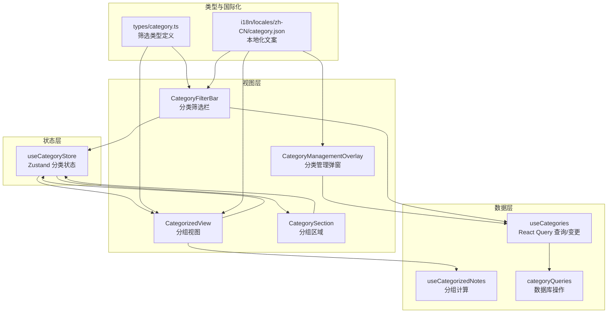

**图表来源**
- [CategoryFilterBar.tsx:15-95](file://components/note/category/CategoryFilterBar.tsx#L15-L95)
- [CategorizedView.tsx:27-125](file://components/note/category/CategorizedView.tsx#L27-L125)
- [CategorySection.tsx:25-97](file://components/note/category/CategorySection.tsx#L25-L97)
- [CategoryManagementOverlay.tsx:45-219](file://components/note/category/CategoryManagementOverlay.tsx#L45-L219)
- [useCategoryStore.ts:23-55](file://store/useCategoryStore.ts#L23-L55)
- [useCategories.ts:14-94](file://hooks/useCategories.ts#L14-L94)
- [useCategorizedNotes.ts:15-43](file://hooks/useCategorizedNotes.ts#L15-L43)
- [queries.ts:200-285](file://db/queries.ts#L200-L285)
- [category.ts:8-11](file://types/category.ts#L8-L11)
- [category.json:1-26](file://i18n/locales/zh-CN/category.json#L1-L26)

**章节来源**
- [CategoryFilterBar.tsx:1-123](file://components/note/category/CategoryFilterBar.tsx#L1-L123)
- [CategorizedView.tsx:1-190](file://components/note/category/CategorizedView.tsx#L1-L190)
- [CategorySection.tsx:1-124](file://components/note/category/CategorySection.tsx#L1-L124)
- [CategoryManagementOverlay.tsx:1-332](file://components/note/category/CategoryManagementOverlay.tsx#L1-L332)
- [useCategoryStore.ts:1-56](file://store/useCategoryStore.ts#L1-L56)
- [useCategories.ts:1-94](file://hooks/useCategories.ts#L1-L94)
- [useCategorizedNotes.ts:1-53](file://hooks/useCategorizedNotes.ts#L1-L53)
- [queries.ts:200-285](file://db/queries.ts#L200-L285)
- [category.ts:1-17](file://types/category.ts#L1-L17)
- [category.json:1-26](file://i18n/locales/zh-CN/category.json#L1-L26)

## 核心组件
- 分类筛选栏（CategoryFilterBar）：横向滚动的“全部/分类/未分类”标签，支持点击切换筛选状态，未分类标签显示计数。
- 分组视图（CategorizedView）：聚合所有笔记按分类分组，应用筛选器过滤后渲染；提供空状态与筛选为空提示。
- 分组区域（CategorySection）：可展开/折叠的分组头部，显示颜色点与数量，内部渲染笔记项。
- 分类状态存储（useCategoryStore）：集中管理筛选器、展开集合、弹窗可见性。
- 分类查询与变更（useCategories）：提供分类列表、增删改、排序、批量分配/移除笔记至分类。
- 分组计算（useCategorizedNotes）：将笔记按分类与未分类进行分组。
- 数据库查询（categoryQueries）：分类 CRUD、排序、笔记与分类关联维护。
- 类型定义（types/category.ts）：定义筛选类型与预设颜色。
- 国际化（i18n/locales/zh-CN/category.json）：分类相关文案。

**章节来源**
- [CategoryFilterBar.tsx:8-95](file://components/note/category/CategoryFilterBar.tsx#L8-L95)
- [CategorizedView.tsx:14-125](file://components/note/category/CategorizedView.tsx#L14-L125)
- [CategorySection.tsx:10-97](file://components/note/category/CategorySection.tsx#L10-L97)
- [useCategoryStore.ts:4-55](file://store/useCategoryStore.ts#L4-L55)
- [useCategories.ts:14-94](file://hooks/useCategories.ts#L14-L94)
- [useCategorizedNotes.ts:15-53](file://hooks/useCategorizedNotes.ts#L15-L53)
- [queries.ts:200-285](file://db/queries.ts#L200-L285)
- [category.ts:8-17](file://types/category.ts#L8-L17)
- [category.json:1-26](file://i18n/locales/zh-CN/category.json#L1-L26)

## 架构总览
分类筛选采用“视图-状态-查询-数据”的清晰分层：
- 视图层负责交互与渲染
- 状态层集中管理筛选与展开状态
- 查询层通过 React Query 管理远端/本地缓存与失效
- 数据层通过 Drizzle ORM 持久化

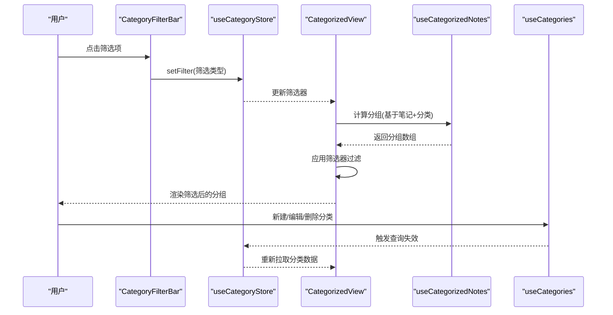

**图表来源**
- [CategoryFilterBar.tsx:33-58](file://components/note/category/CategoryFilterBar.tsx#L33-L58)
- [useCategoryStore.ts:29-29](file://store/useCategoryStore.ts#L29-L29)
- [CategorizedView.tsx:46-51](file://components/note/category/CategorizedView.tsx#L46-L51)
- [useCategorizedNotes.ts:15-43](file://hooks/useCategorizedNotes.ts#L15-L43)
- [useCategories.ts:30-36](file://hooks/useCategories.ts#L30-L36)

## 详细组件分析

### 分类筛选栏（CategoryFilterBar）
- 设计要点
  - 横向滚动容器，支持“全部”“分类”“未分类”三类筛选
  - “全部”始终位于首位；“未分类”仅在存在未分类笔记时显示
  - 选中态样式区分，分类标签可带边框色（继承分类颜色）
- 交互流程
  - 点击“全部”：设置筛选器为全部
  - 点击分类：设置筛选器为指定分类
  - 点击“未分类”：设置筛选器为未分类
- 性能与可用性
  - 使用 memo 包装减少重渲染
  - 未分类计数动态传入，避免重复计算

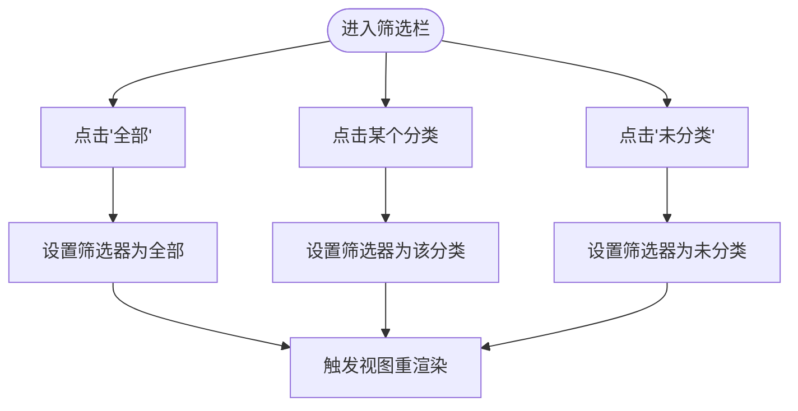

**图表来源**
- [CategoryFilterBar.tsx:33-91](file://components/note/category/CategoryFilterBar.tsx#L33-L91)
- [useCategoryStore.ts:29-29](file://store/useCategoryStore.ts#L29-L29)

**章节来源**
- [CategoryFilterBar.tsx:15-95](file://components/note/category/CategoryFilterBar.tsx#L15-L95)

### 分组视图（CategorizedView）
- 功能概述
  - 获取分类列表与笔记列表
  - 使用 useCategorizedNotes 将笔记按分类分组
  - 应用筛选器过滤分组
  - 渲染空状态（未创建分类）与筛选为空提示
- 交互与状态
  - 通过 useCategoryStore 管理筛选器与展开集合
  - 未分类计数用于筛选栏显示
- 列表渲染
  - 使用 FlatList 渲染分组，每个分组使用 CategorySection

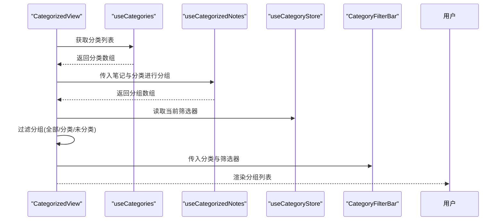

**图表来源**
- [CategorizedView.tsx:39-74](file://components/note/category/CategorizedView.tsx#L39-L74)
- [useCategories.ts:14-19](file://hooks/useCategories.ts#L14-L19)
- [useCategorizedNotes.ts:15-43](file://hooks/useCategorizedNotes.ts#L15-L43)
- [useCategoryStore.ts:4-4](file://store/useCategoryStore.ts#L4-L4)

**章节来源**
- [CategorizedView.tsx:27-125](file://components/note/category/CategorizedView.tsx#L27-L125)

### 分组区域（CategorySection）
- 功能概述
  - 可展开/折叠的分组头部，显示分类名、颜色点、数量
  - 使用动画旋转指示器，增强交互反馈
- 展开/折叠
  - 通过 useCategoryStore 的 expandedIds 控制展开状态
  - 使用 LayoutAnimation 与 reanimated 实现平滑过渡

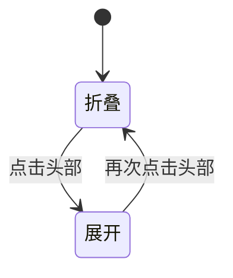

**图表来源**
- [CategorySection.tsx:46-51](file://components/note/category/CategorySection.tsx#L46-L51)
- [useCategoryStore.ts:31-41](file://store/useCategoryStore.ts#L31-L41)

**章节来源**
- [CategorySection.tsx:25-97](file://components/note/category/CategorySection.tsx#L25-L97)

### 分类状态存储（useCategoryStore）
- 状态字段
  - filter：当前筛选器（全部/分类/未分类）
  - expandedIds：展开的分组键集合（分类ID或“uncategorized”）
  - managementVisible / assignmentVisible：弹窗可见性
- 行为
  - setFilter：设置筛选器
  - toggleExpanded / expandAll / collapseAll：控制展开状态
  - open/close management/assignment：打开/关闭弹窗
  - reset：重置为初始状态

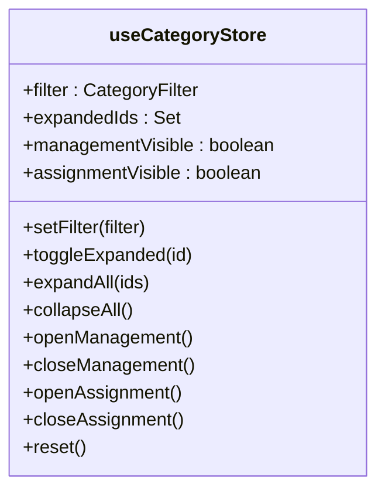

**图表来源**
- [useCategoryStore.ts:4-55](file://store/useCategoryStore.ts#L4-L55)

**章节来源**
- [useCategoryStore.ts:1-56](file://store/useCategoryStore.ts#L1-L56)

### 分类查询与变更（useCategories）
- 查询
  - useCategories：获取分类列表
  - useCategory(id)：按ID获取单个分类
- 变更
  - useCreateCategory / useUpdateCategory / useDeleteCategory：增删改
  - useReorderCategories：重排顺序
  - useAssignNotesToCategory / useRemoveNotesFromCategory：批量分配/移除
- 缓存失效
  - 成功后使相关查询失效，确保 UI 实时更新

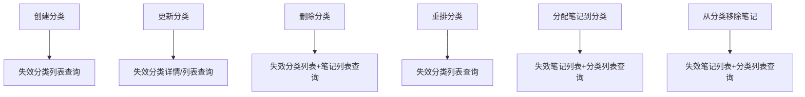

**图表来源**
- [useCategories.ts:30-94](file://hooks/useCategories.ts#L30-L94)

**章节来源**
- [useCategories.ts:1-94](file://hooks/useCategories.ts#L1-L94)

### 分组计算（useCategorizedNotes）
- 输入：笔记数组、分类数组
- 输出：按分类分组的数组，末尾追加“未分类”分组（若存在）
- 关键点：解析笔记的分类ID数组，支持多分类

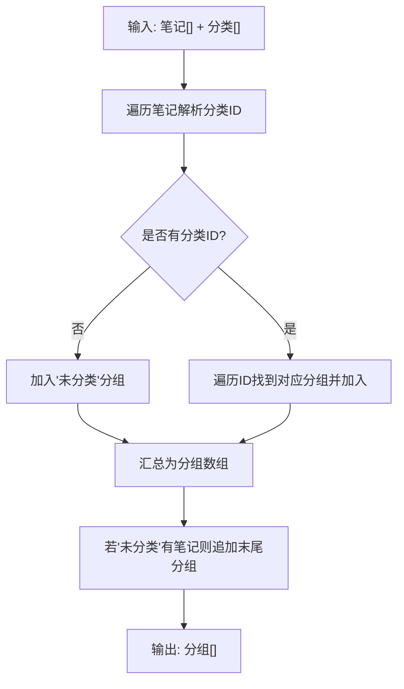

**图表来源**
- [useCategorizedNotes.ts:15-43](file://hooks/useCategorizedNotes.ts#L15-L43)

**章节来源**
- [useCategorizedNotes.ts:1-53](file://hooks/useCategorizedNotes.ts#L1-L53)

### 数据库查询（categoryQueries）
- 支持：获取、创建、更新、删除、重排、笔记与分类关联维护
- 删除分类时会清理所有笔记中的该分类ID，保持数据一致性

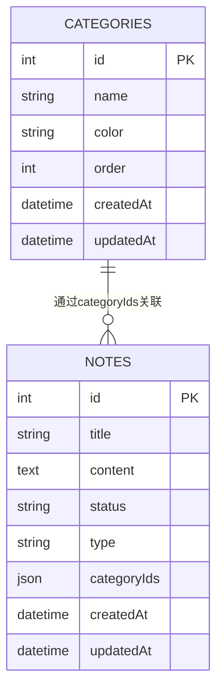

**图表来源**
- [queries.ts:200-285](file://db/queries.ts#L200-L285)

**章节来源**
- [queries.ts:200-285](file://db/queries.ts#L200-L285)

### 类型定义（types/category.ts）
- 定义 CategorizedGroup：包含分类对象（可能为空）与笔记数组
- 定义 CategoryFilter：三种筛选类型
- 预设颜色数组，供分类管理弹窗使用

**章节来源**
- [category.ts:1-17](file://types/category.ts#L1-L17)

### 国际化（i18n/locales/zh-CN/category.json）
- 提供分类相关文案：标题、按钮文本、空状态提示、Toast消息等

**章节来源**
- [category.json:1-26](file://i18n/locales/zh-CN/category.json#L1-L26)

### 在笔记列表中集成分类筛选
- 在首页 Tab 中切换到“分类”视图时，渲染 CategorizedView 并传入：
  - notes：全量笔记（跨状态）
  - isSelectionMode / selectedIds / 回调函数
  - onOpenManagement：打开分类管理弹窗
- 分类管理弹窗与分类分配弹窗通过状态控制可见性

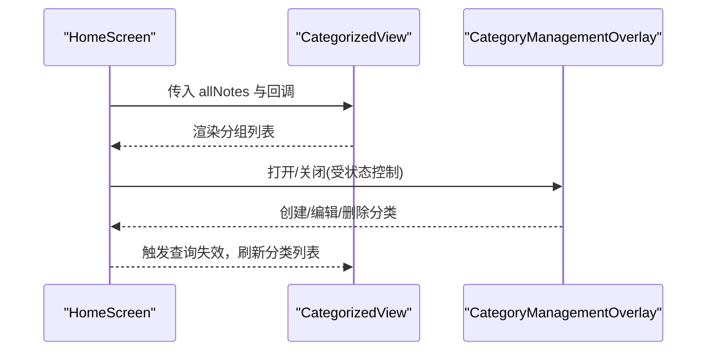

**图表来源**
- [index.tsx](file://app/(tabs)/index.tsx#L323-L334)
- [CategorizedView.tsx:104-109](file://components/note/category/CategorizedView.tsx#L104-L109)
- [CategoryManagementOverlay.tsx:45-74](file://components/note/category/CategoryManagementOverlay.tsx#L45-L74)

**章节来源**
- [index.tsx](file://app/(tabs)/index.tsx#L323-L334)

## 依赖关系分析
- 组件耦合
  - CategorizedView 依赖 useCategories、useCategorizedNotes、useCategoryStore
  - CategoryFilterBar 依赖 useCategoryStore 与分类数据
  - CategorySection 依赖 useCategoryStore 的展开状态
- 外部依赖
  - React Query：统一查询与缓存管理
  - Zustand：轻量状态管理
  - Drizzle ORM：数据库访问
  - Tamagui/i18n：UI 与国际化

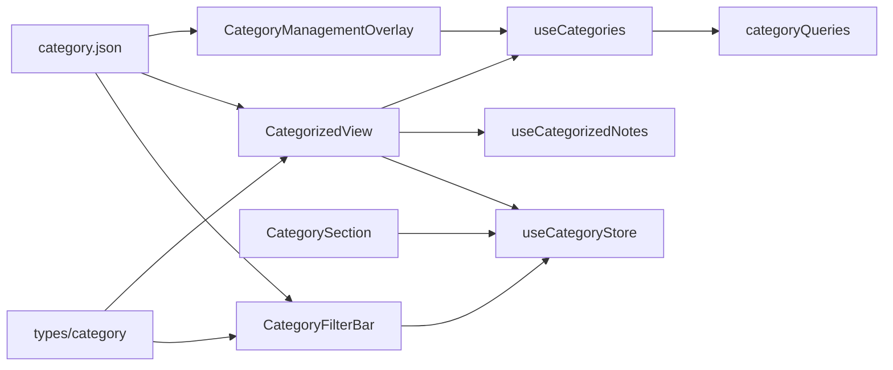

**图表来源**
- [CategorizedView.tsx:8-12](file://components/note/category/CategorizedView.tsx#L8-L12)
- [useCategories.ts:1-4](file://hooks/useCategories.ts#L1-L4)
- [useCategorizedNotes.ts:1-3](file://hooks/useCategorizedNotes.ts#L1-L3)
- [category.ts:1-2](file://types/category.ts#L1-L2)
- [category.json:1-26](file://i18n/locales/zh-CN/category.json#L1-L26)

**章节来源**
- [CategorizedView.tsx:8-12](file://components/note/category/CategorizedView.tsx#L8-L12)
- [useCategories.ts:1-4](file://hooks/useCategories.ts#L1-L4)
- [useCategorizedNotes.ts:1-3](file://hooks/useCategorizedNotes.ts#L1-L3)
- [category.ts:1-2](file://types/category.ts#L1-L2)
- [category.json:1-26](file://i18n/locales/zh-CN/category.json#L1-L26)

## 性能考虑
- 防抖与节流
  - 对于频繁触发的筛选操作，可在 onFilterChange 外层增加防抖（例如 100–200ms），减少无效重渲染
- 增量更新
  - 使用 React Query 的查询失效策略，仅在分类或笔记发生变更时刷新相关查询
  - 对于大量笔记场景，优先使用 FlatList 的稳定 key 与虚拟化
- 渲染优化
  - CategoryFilterBar 已使用 memo，建议对 CategorizedView 与 CategorySection 也使用 memo 或 useMemo
  - 展开/折叠使用动画但避免过度复杂，保持流畅
- 数据访问
  - 分组计算 useCategorizedNotes 已使用 useMemo，确保输入稳定时复用结果
  - 分类列表查询使用 React Query 缓存，避免重复请求

[本节为通用性能建议，不直接分析具体文件，故无“章节来源”]

## 故障排除指南
- 筛选无效或未更新
  - 检查是否正确调用 setFilter 与查询失效
  - 确认 CategorizedView 的过滤逻辑与筛选器一致
- 未分类计数不准确
  - 确保传入的 uncategorizedCount 来源于当前分组计算结果
- 分类删除后笔记仍显示在该分类
  - 确认 categoryQueries.delete 是否执行了清理笔记中的分类ID
- 分类管理弹窗无法打开/关闭
  - 检查状态管理与可见性控制逻辑

**章节来源**
- [CategorizedView.tsx:46-51](file://components/note/category/CategorizedView.tsx#L46-L51)
- [queries.ts:229-245](file://db/queries.ts#L229-L245)

## 结论
分类筛选功能通过清晰的分层设计实现了良好的用户体验与可维护性：视图层专注交互，状态层集中管理筛选与展开，查询层保证数据一致性与实时性。配合国际化与空状态处理，整体具备较好的扩展性与可定制性。后续可在交互细节（如防抖）、渲染性能（memo/FlatList优化）与数据一致性（批量操作事务）方面进一步完善。

## 附录

### 筛选状态持久化与恢复
- 当前实现
  - 筛选状态保存在 Zustand store 中，页面切换或应用重启会丢失
- 建议方案
  - 使用持久化存储（如 AsyncStorage）在 setFilter 时同步持久化
  - 应用启动时从持久化存储恢复筛选状态
  - 注意：仅恢复筛选器与展开集合，不恢复弹窗状态

[本节为扩展建议，不直接分析具体文件，故无“章节来源”]

### 筛选结果统计与空状态
- 统计信息
  - 未分类计数：通过分组计算得出，用于筛选栏显示
  - 分组内笔记数量：在分组头部显示
- 空状态
  - 未创建分类：显示引导文案与创建按钮
  - 筛选结果为空：显示“没有匹配的笔记”提示

**章节来源**
- [CategorizedView.tsx:77-99](file://components/note/category/CategorizedView.tsx#L77-L99)
- [CategorizedView.tsx:110-116](file://components/note/category/CategorizedView.tsx#L110-L116)
- [category.json:5-25](file://i18n/locales/zh-CN/category.json#L5-L25)

### 扩展与自定义实现指导
- 添加新的筛选条件
  - 在类型定义中扩展 CategoryFilter
  - 在 CategorizedView 的过滤逻辑中增加分支
  - 在 CategoryFilterBar 中新增对应 UI
- 自定义筛选逻辑
  - 将过滤逻辑抽离为独立 Hook，便于测试与复用
  - 支持多条件组合（如同时按分类与时间范围筛选）
- 性能优化
  - 对筛选栏的输入事件增加防抖
  - 对分组计算使用更高效的算法（如哈希映射）
  - 对笔记列表使用分页或增量加载

**章节来源**
- [category.ts:8-11](file://types/category.ts#L8-L11)
- [CategorizedView.tsx:46-51](file://components/note/category/CategorizedView.tsx#L46-L51)
- [CategoryFilterBar.tsx:33-91](file://components/note/category/CategoryFilterBar.tsx#L33-L91)