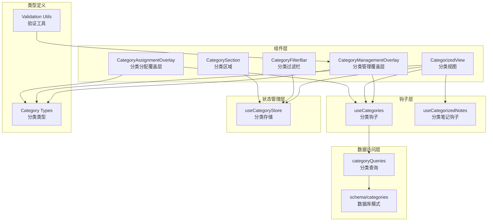
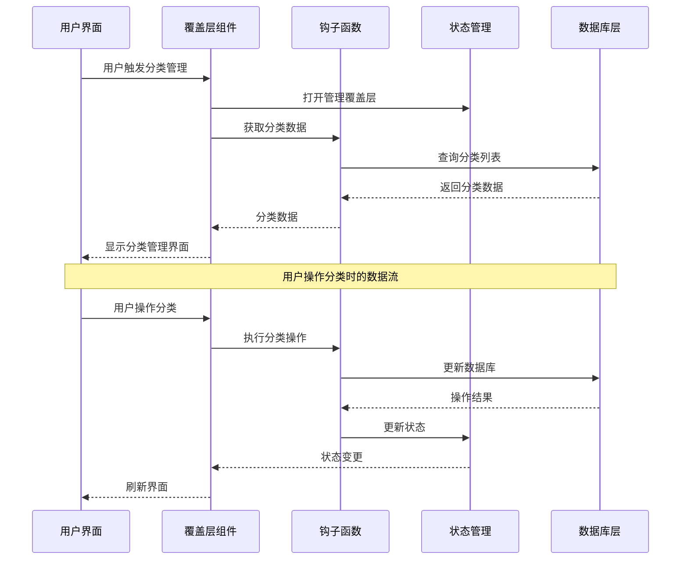
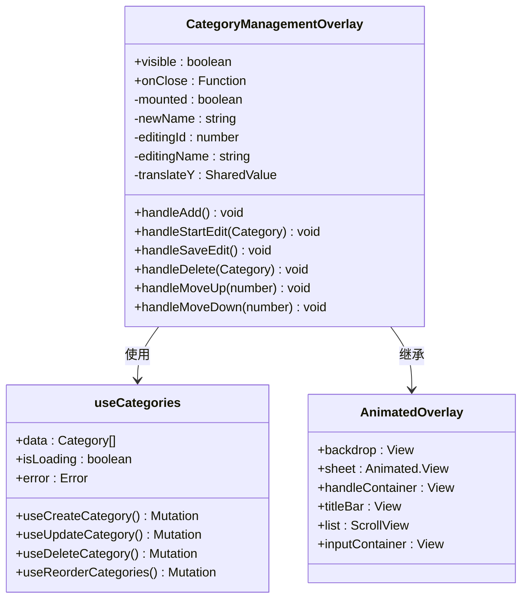
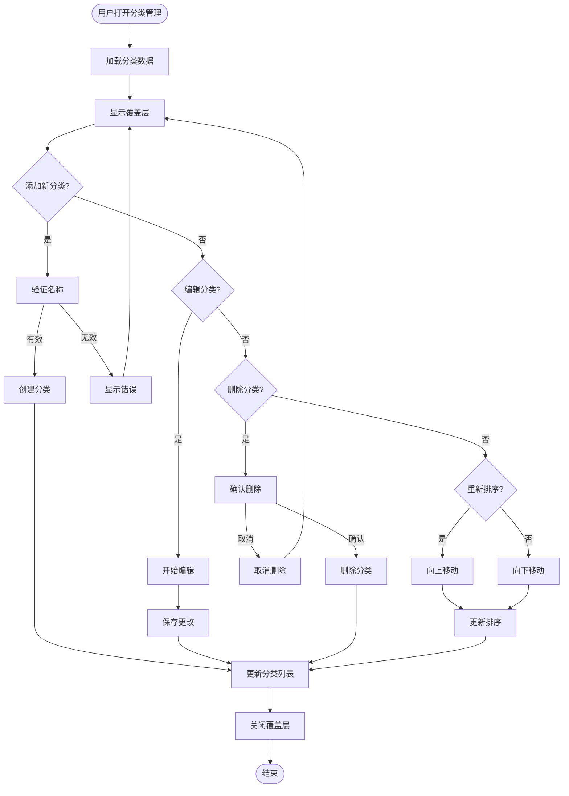
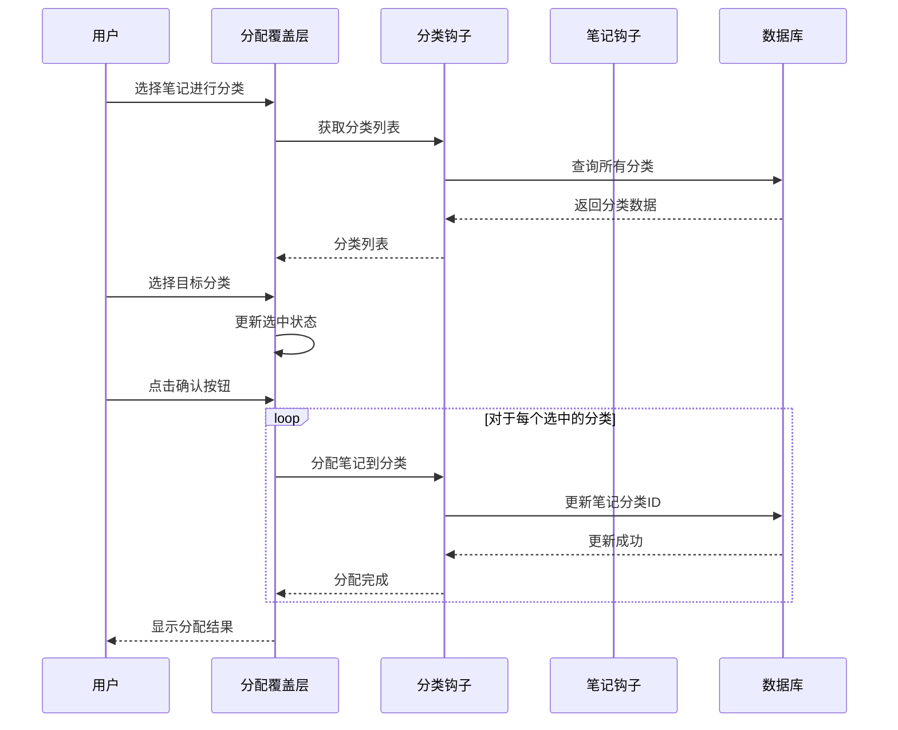
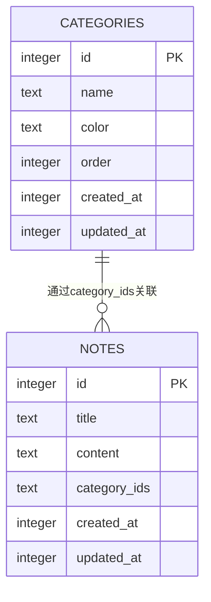
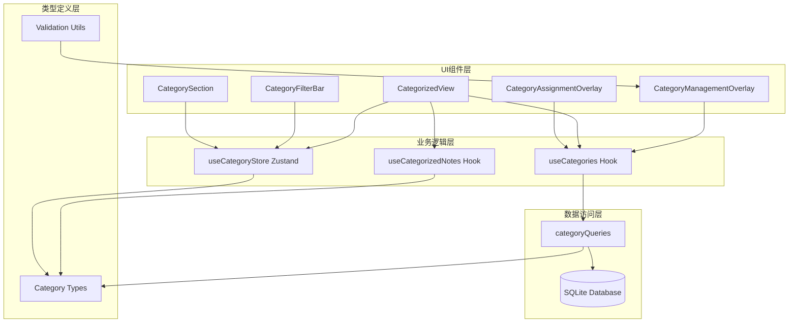

# 分类管理功能

<cite>
**本文档引用的文件**
- [CategoryManagementOverlay.tsx](file://components/note/category/CategoryManagementOverlay.tsx)
- [useCategories.ts](file://hooks/useCategories.ts)
- [useCategoryStore.ts](file://store/useCategoryStore.ts)
- [category.ts](file://types/category.ts)
- [0002_category_support.sql](file://drizzle/0002_category_support.sql)
- [schema/index.ts](file://db/schema/index.ts)
- [queries.ts](file://db/queries.ts)
- [CategorizedView.tsx](file://components/note/category/CategorizedView.tsx)
- [CategoryFilterBar.tsx](file://components/note/category/CategoryFilterBar.tsx)
- [CategorySection.tsx](file://components/note/category/CategorySection.tsx)
- [CategoryAssignmentOverlay.tsx](file://components/note/category/CategoryAssignmentOverlay.tsx)
- [useCategorizedNotes.ts](file://hooks/useCategorizedNotes.ts)
- [category.json](file://i18n/locales/zh-CN/category.json)
- [validation.ts](file://utils/validation.ts)
</cite>

## 目录
1. [简介](#简介)
2. [项目结构](#项目结构)
3. [核心组件](#核心组件)
4. [架构概览](#架构概览)
5. [详细组件分析](#详细组件分析)
6. [依赖关系分析](#依赖关系分析)
7. [性能考虑](#性能考虑)
8. [故障排除指南](#故障排除指南)
9. [结论](#结论)
10. [附录](#附录)

## 简介

分类管理功能是语音笔记应用中的核心组织功能，为用户提供完整的分类管理体系。该功能支持多级分类、动态重命名、安全删除、层级管理和批量操作等高级特性。

本系统采用React Native + TypeScript技术栈，结合Drizzle ORM数据库层，实现了高性能、可扩展的分类管理解决方案。系统支持实时数据同步、动画过渡效果和响应式用户界面设计。

## 项目结构

分类管理功能主要分布在以下目录结构中：

**图表来源**
- [CategoryManagementOverlay.tsx:1-332](file://components/note/category/CategoryManagementOverlay.tsx#L1-L332)
- [useCategories.ts:1-94](file://hooks/useCategories.ts#L1-L94)
- [useCategoryStore.ts:1-56](file://store/useCategoryStore.ts#L1-L56)

**章节来源**
- [CategoryManagementOverlay.tsx:1-332](file://components/note/category/CategoryManagementOverlay.tsx#L1-L332)
- [CategorizedView.tsx:1-190](file://components/note/category/CategorizedView.tsx#L1-L190)
- [CategoryFilterBar.tsx:1-123](file://components/note/category/CategoryFilterBar.tsx#L1-L123)

## 核心组件

### 分类管理覆盖层 (CategoryManagementOverlay)

分类管理覆盖层是用户与分类系统交互的主要界面，提供完整的分类管理功能：

**主要功能特性：**
- 分类列表显示与排序
- 实时重命名编辑
- 新分类创建
- 安全删除确认
- 拖拽排序功能
- 动画过渡效果

**用户交互流程：**
1. 用户点击"管理分类"按钮
2. 覆盖层以弹出动画显示
3. 用户可进行各种分类操作
4. 关闭时执行平滑收起动画

**章节来源**
- [CategoryManagementOverlay.tsx:45-220](file://components/note/category/CategoryManagementOverlay.tsx#L45-L220)

### 分类视图系统 (CategorizedView)

分类视图系统负责将笔记按分类进行组织展示：

**核心功能：**
- 多级分类层次展示
- 动态展开/折叠
- 实时过滤功能
- 未分类笔记处理
- 性能优化的列表渲染

**章节来源**
- [CategorizedView.tsx:27-125](file://components/note/category/CategorizedView.tsx#L27-L125)

### 分类存储管理 (useCategoryStore)

Zustand状态管理提供分类相关的全局状态：

**状态管理：**
- 分类过滤器状态
- 展开/折叠状态
- 覆盖层可见性
- 批量操作状态

**章节来源**
- [useCategoryStore.ts:23-55](file://store/useCategoryStore.ts#L23-L55)

## 架构概览

分类管理系统采用分层架构设计，确保各层职责清晰分离：

**图表来源**
- [CategoryManagementOverlay.tsx:54-58](file://components/note/category/CategoryManagementOverlay.tsx#L54-L58)
- [useCategories.ts:14-19](file://hooks/useCategories.ts#L14-L19)
- [useCategoryStore.ts:43-46](file://store/useCategoryStore.ts#L43-L46)

## 详细组件分析

### 分类管理覆盖层详细分析

#### 组件架构设计

**图表来源**
- [CategoryManagementOverlay.tsx:45-220](file://components/note/category/CategoryManagementOverlay.tsx#L45-L220)
- [useCategories.ts:29-69](file://hooks/useCategories.ts#L29-L69)

#### 用户交互流程

**图表来源**
- [CategoryManagementOverlay.tsx:87-132](file://components/note/category/CategoryManagementOverlay.tsx#L87-L132)
- [CategoryManagementOverlay.tsx:109-118](file://components/note/category/CategoryManagementOverlay.tsx#L109-L118)

#### 删除安全检查机制

分类删除操作实现了严格的安全检查机制：

**安全检查流程：**
1. 弹出确认对话框
2. 显示分类名称确认
3. 执行软删除（从笔记中移除引用）
4. 更新数据库记录
5. 刷新相关界面

**章节来源**
- [CategoryManagementOverlay.tsx:109-118](file://components/note/category/CategoryManagementOverlay.tsx#L109-L118)
- [queries.ts:229-245](file://db/queries.ts#L229-L245)

### 分类分配覆盖层分析

#### 批量分类分配功能

**图表来源**
- [CategoryAssignmentOverlay.tsx:99-105](file://components/note/category/CategoryAssignmentOverlay.tsx#L99-L105)
- [useCategories.ts:71-81](file://hooks/useCategories.ts#L71-L81)

**章节来源**
- [CategoryAssignmentOverlay.tsx:43-187](file://components/note/category/CategoryAssignmentOverlay.tsx#L43-L187)

### 分类数据模型分析

#### 数据库架构设计

**图表来源**
- [schema/index.ts:54-61](file://db/schema/index.ts#L54-L61)
- [schema/index.ts:11](file://db/schema/index.ts#L11)

#### 分类数据结构

**分类实体属性：**
- `id`: 分类唯一标识符
- `name`: 分类名称（必填）
- `color`: 分类颜色（可选）
- `order`: 排序权重
- `createdAt`: 创建时间
- `updatedAt`: 更新时间

**笔记与分类关系：**
- 采用JSON数组存储多个分类ID
- 支持多对多关系
- 自动维护引用完整性

**章节来源**
- [schema/index.ts:54-61](file://db/schema/index.ts#L54-L61)
- [schema/index.ts:11](file://db/schema/index.ts#L11)

## 依赖关系分析

### 组件间依赖关系

**图表来源**
- [useCategories.ts:1-94](file://hooks/useCategories.ts#L1-L94)
- [useCategorizedNotes.ts:1-53](file://hooks/useCategorizedNotes.ts#L1-L53)
- [useCategoryStore.ts:1-56](file://store/useCategoryStore.ts#L1-L56)

### 数据流依赖

**查询依赖链：**
1. UI组件 → 钩子函数 → 数据库查询
2. 状态管理 → 组件渲染 → 用户交互
3. 数据变更 → 缓存失效 → 界面刷新

**章节来源**
- [useCategories.ts:14-19](file://hooks/useCategories.ts#L14-L19)
- [queries.ts:200-285](file://db/queries.ts#L200-L285)

## 性能考虑

### 性能优化策略

#### 1. 懒加载实现

**分类数据懒加载：**
- 使用React Query的延迟加载机制
- 只在需要时查询数据库
- 支持后台预取和缓存策略

**章节来源**
- [useCategories.ts:14-19](file://hooks/useCategories.ts#L14-L19)

#### 2. 虚拟滚动优化

**FlatList虚拟化：**
- 使用FlatList替代ScrollView
- 自动处理列表项的创建和销毁
- 仅渲染可见区域内的列表项

**章节来源**
- [CategorizedView.tsx:117-122](file://components/note/category/CategorizedView.tsx#L117-L122)

#### 3. 布局动画优化

**Animated组件优化：**
- 使用useSharedValue减少重渲染
- 合理设置动画参数
- 避免不必要的动画计算

**章节来源**
- [CategoryManagementOverlay.tsx:52-85](file://components/note/category/CategoryManagementOverlay.tsx#L52-L85)

#### 4. 状态管理优化

**Zustand轻量级状态：**
- 减少不必要的状态订阅
- 使用原子化状态更新
- 避免深层嵌套状态

**章节来源**
- [useCategoryStore.ts:23-55](file://store/useCategoryStore.ts#L23-L55)

## 故障排除指南

### 常见问题及解决方案

#### 1. 分类删除失败

**问题描述：** 删除分类时出现错误或数据未更新

**可能原因：**
- 数据库事务冲突
- 网络连接异常
- 权限不足

**解决步骤：**
1. 检查网络连接状态
2. 重新启动应用
3. 清除应用缓存
4. 检查数据库权限

#### 2. 分类排序异常

**问题描述：** 分类排序顺序不正确或丢失

**解决方法：**
1. 重新排列分类顺序
2. 检查order字段值
3. 重启应用以刷新缓存

#### 3. 笔记分类显示错误

**问题描述：** 笔记未正确显示在对应分类中

**排查步骤：**
1. 检查笔记的category_ids字段
2. 验证分类ID的有效性
3. 重新加载分类数据

**章节来源**
- [queries.ts:229-245](file://db/queries.ts#L229-L245)
- [useCategorizedNotes.ts:5-13](file://hooks/useCategorizedNotes.ts#L5-L13)

### 错误处理机制

**国际化错误消息：**
- 支持多语言错误提示
- 提供用户友好的错误信息
- 区分不同类型的错误场景

**章节来源**
- [category.json:12-25](file://i18n/locales/zh-CN/category.json#L12-L25)

## 结论

分类管理功能通过精心设计的架构和实现，为用户提供了完整而高效的分类管理体系。系统具备以下优势：

1. **完整的功能覆盖**：支持分类的创建、重命名、删除、排序和批量分配
2. **优秀的用户体验**：流畅的动画过渡、直观的界面设计和响应式交互
3. **强大的数据管理**：基于SQLite的可靠数据存储和实时同步
4. **良好的性能表现**：通过懒加载、虚拟滚动等优化技术提升性能
5. **可扩展的架构**：模块化的组件设计便于功能扩展和维护

该系统为语音笔记应用提供了坚实的分类基础，能够满足用户多样化的笔记组织需求。

## 附录

### 开发者指南

#### 自定义扩展建议

**1. 添加新的分类属性**
- 在数据库模式中添加新字段
- 更新类型定义文件
- 修改查询函数以支持新字段

**2. 实现分类层级结构**
- 扩展Category实体以支持parent_id
- 实现递归查询和渲染
- 添加层级导航功能

**3. 性能监控**
- 使用React DevTools Profiler
- 监控组件渲染性能
- 优化重渲染频率

**章节来源**
- [schema/index.ts:54-61](file://db/schema/index.ts#L54-L61)
- [category.ts:13-16](file://types/category.ts#L13-L16)