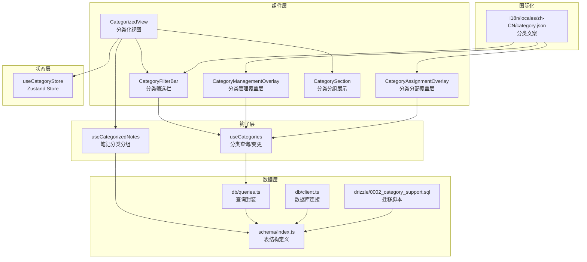
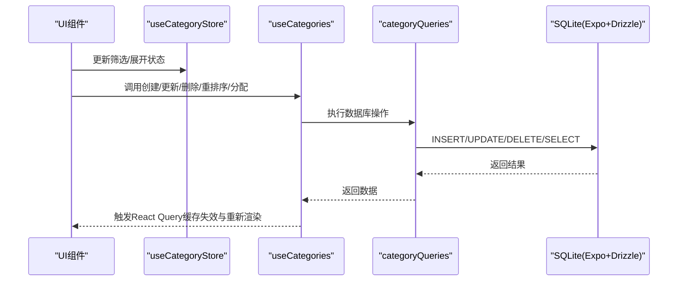
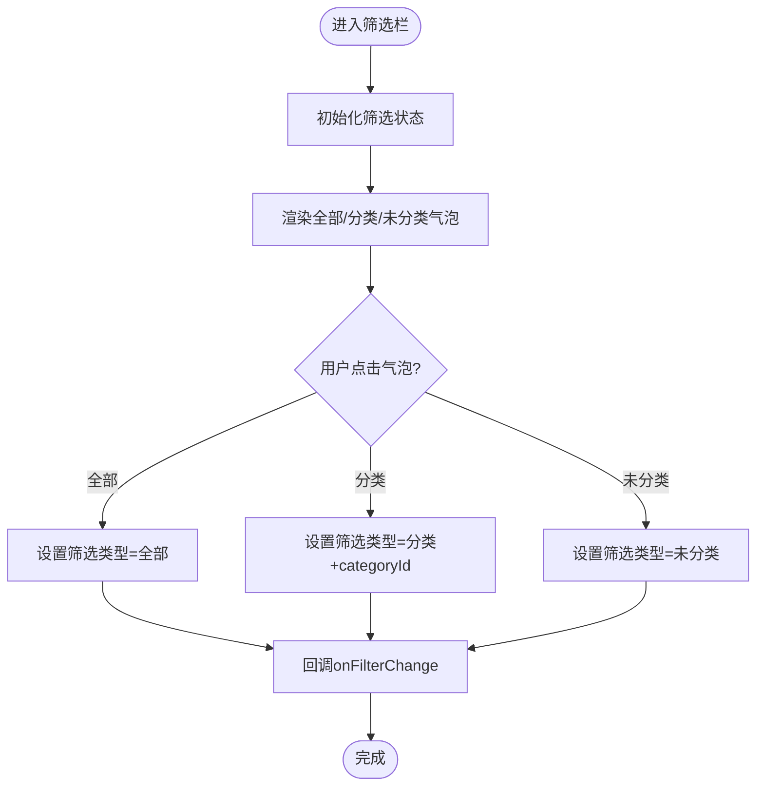
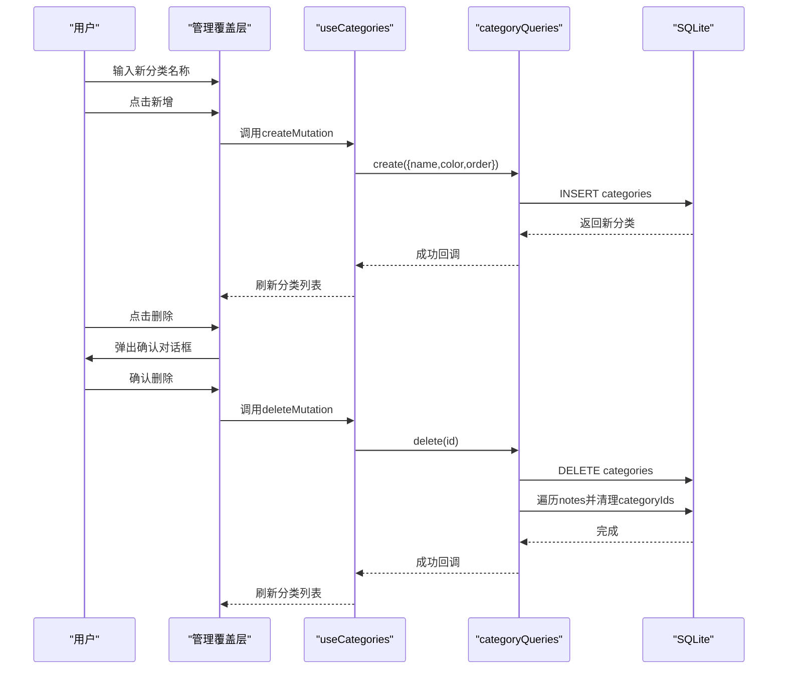
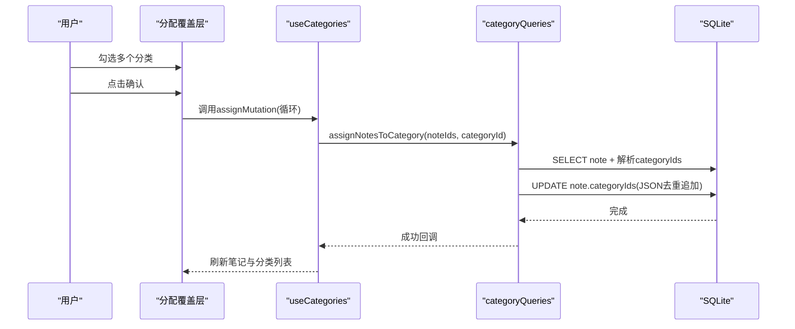
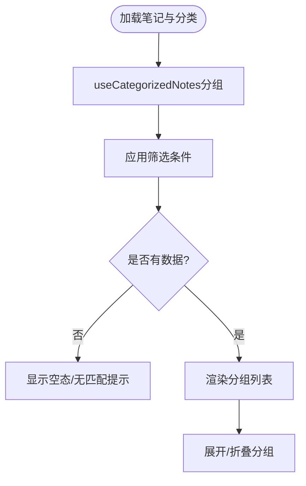
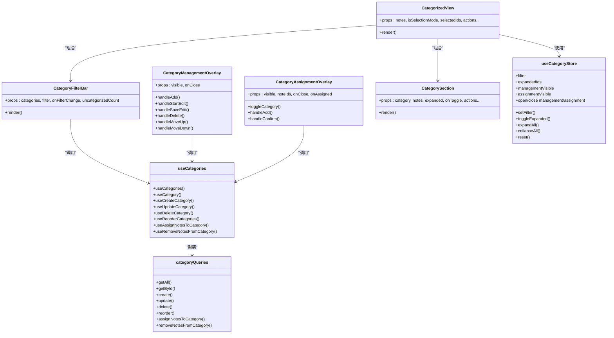

# 分类系统模块

<cite>
**本文档引用的文件**
- [components/note/category/index.ts](file://components/note/category/index.ts)
- [store/useCategoryStore.ts](file://store/useCategoryStore.ts)
- [hooks/useCategories.ts](file://hooks/useCategories.ts)
- [types/category.ts](file://types/category.ts)
- [db/schema/index.ts](file://db/schema/index.ts)
- [drizzle/0002_category_support.sql](file://drizzle/0002_category_support.sql)
- [components/note/category/CategoryFilterBar.tsx](file://components/note/category/CategoryFilterBar.tsx)
- [components/note/category/CategoryManagementOverlay.tsx](file://components/note/category/CategoryManagementOverlay.tsx)
- [components/note/category/CategoryAssignmentOverlay.tsx](file://components/note/category/CategoryAssignmentOverlay.tsx)
- [components/note/category/CategorizedView.tsx](file://components/note/category/CategorizedView.tsx)
- [components/note/category/CategorySection.tsx](file://components/note/category/CategorySection.tsx)
- [db/queries.ts](file://db/queries.ts)
- [i18n/locales/zh-CN/category.json](file://i10n/locales/zh-CN/category.json)
- [hooks/useCategorizedNotes.ts](file://hooks/useCategorizedNotes.ts)
- [db/client.ts](file://db/client.ts)
- [types/index.ts](file://types/index.ts)
</cite>

## 目录
1. [简介](#简介)
2. [项目结构](#项目结构)
3. [核心组件](#核心组件)
4. [架构总览](#架构总览)
5. [详细组件分析](#详细组件分析)
6. [依赖关系分析](#依赖关系分析)
7. [性能考虑](#性能考虑)
8. [故障排除指南](#故障排除指南)
9. [结论](#结论)
10. [附录](#附录)

## 简介
本模块围绕“分类系统”构建，提供分类的创建、管理、删除、重排序以及与笔记的关联能力。系统采用本地 SQLite 数据库（通过 Expo SQLite + Drizzle ORM），使用 React Query 进行数据状态管理，并通过自定义 Hook 封装 CRUD 操作。UI 层由多个覆盖层组件构成：分类筛选栏、分类管理覆盖层、分类分配覆盖层，以及用于展示的分类化视图。

## 项目结构
分类系统主要分布在以下目录与文件中：
- 组件层：分类筛选栏、分类管理覆盖层、分类分配覆盖层、分类化视图、分类分组展示
- 状态层：分类 Store（Zustand）用于管理筛选状态、展开状态与覆盖层可见性
- 钩子层：useCategories、useCategorizedNotes 等封装查询与变更操作
- 数据层：Drizzle Schema 定义、查询封装、迁移脚本
- 国际化：分类相关文案

图表来源
- [components/note/category/CategorizedView.tsx:1-190](file://components/note/category/CategorizedView.tsx#L1-L190)
- [components/note/category/CategoryFilterBar.tsx:1-123](file://components/note/category/CategoryFilterBar.tsx#L1-L123)
- [components/note/category/CategoryManagementOverlay.tsx:1-332](file://components/note/category/CategoryManagementOverlay.tsx#L1-L332)
- [components/note/category/CategoryAssignmentOverlay.tsx:1-318](file://components/note/category/CategoryAssignmentOverlay.tsx#L1-L318)
- [components/note/category/CategorySection.tsx:1-124](file://components/note/category/CategorySection.tsx#L1-L124)
- [store/useCategoryStore.ts:1-56](file://store/useCategoryStore.ts#L1-L56)
- [hooks/useCategories.ts:1-94](file://hooks/useCategories.ts#L1-L94)
- [hooks/useCategorizedNotes.ts:1-53](file://hooks/useCategorizedNotes.ts#L1-L53)
- [db/schema/index.ts:1-75](file://db/schema/index.ts#L1-L75)
- [db/queries.ts:1-286](file://db/queries.ts#L1-L286)
- [db/client.ts:1-15](file://db/client.ts#L1-L15)
- [drizzle/0002_category_support.sql:1-11](file://drizzle/0002_category_support.sql#L1-L11)
- [i18n/locales/zh-CN/category.json:1-26](file://i18n/locales/zh-CN/category.json#L1-L26)

章节来源
- [components/note/category/index.ts:1-6](file://components/note/category/index.ts#L1-L6)
- [store/useCategoryStore.ts:1-56](file://store/useCategoryStore.ts#L1-L56)
- [hooks/useCategories.ts:1-94](file://hooks/useCategories.ts#L1-L94)
- [hooks/useCategorizedNotes.ts:1-53](file://hooks/useCategorizedNotes.ts#L1-L53)
- [db/schema/index.ts:1-75](file://db/schema/index.ts#L1-L75)
- [db/queries.ts:1-286](file://db/queries.ts#L1-L286)
- [db/client.ts:1-15](file://db/client.ts#L1-L15)
- [drizzle/0002_category_support.sql:1-11](file://drizzle/0002_category_support.sql#L1-L11)
- [i18n/locales/zh-CN/category.json:1-26](file://i18n/locales/zh-CN/category.json#L1-L26)

## 核心组件
- 分类筛选栏：支持“全部/按分类/未分类”三种筛选模式，动态显示各分类气泡与未分类计数。
- 分类管理覆盖层：提供分类列表、重排、编辑、删除、新增分类等管理功能。
- 分类分配覆盖层：支持多选笔记批量分配到分类，或直接创建新分类后分配。
- 分类化视图：整合筛选、分组与分组内容展示，支持展开/折叠与空态提示。
- 分类 Store：集中管理筛选条件、展开状态与覆盖层可见性。
- 分类钩子：封装分类 CRUD、笔记分配/移除、重排序等操作，配合 React Query 实现缓存与失效。
- 数据模型与查询：notes 表通过 JSON 字段存储 categoryIds，categories 表存储分类元数据。

章节来源
- [components/note/category/CategoryFilterBar.tsx:1-123](file://components/note/category/CategoryFilterBar.tsx#L1-L123)
- [components/note/category/CategoryManagementOverlay.tsx:1-332](file://components/note/category/CategoryManagementOverlay.tsx#L1-L332)
- [components/note/category/CategoryAssignmentOverlay.tsx:1-318](file://components/note/category/CategoryAssignmentOverlay.tsx#L1-L318)
- [components/note/category/CategorizedView.tsx:1-190](file://components/note/category/CategorizedView.tsx#L1-L190)
- [store/useCategoryStore.ts:1-56](file://store/useCategoryStore.ts#L1-L56)
- [hooks/useCategories.ts:1-94](file://hooks/useCategories.ts#L1-L94)
- [db/schema/index.ts:1-75](file://db/schema/index.ts#L1-L75)
- [db/queries.ts:200-286](file://db/queries.ts#L200-L286)

## 架构总览
分类系统采用“组件层-状态层-钩子层-数据层”的分层设计：
- 组件层负责用户交互与展示
- 状态层集中管理筛选与展开状态
- 钩子层封装数据访问与变更逻辑
- 数据层通过 Drizzle ORM 访问 SQLite，迁移脚本确保表结构演进

图表来源
- [store/useCategoryStore.ts:1-56](file://store/useCategoryStore.ts#L1-L56)
- [hooks/useCategories.ts:1-94](file://hooks/useCategories.ts#L1-L94)
- [db/queries.ts:200-286](file://db/queries.ts#L200-L286)
- [db/client.ts:1-15](file://db/client.ts#L1-L15)

## 详细组件分析

### 分类筛选栏（CategoryFilterBar）
- 功能要点
  - 提供“全部/按分类/未分类”三态筛选
  - 横向滚动的分类气泡，支持点击切换
  - 未分类计数动态显示
  - 使用翻译资源进行本地化
- 关键交互
  - 点击分类气泡触发 onFilterChange，更新筛选状态
  - 未分类气泡仅在存在未分类笔记时显示
- 性能与体验
  - 使用 memo 包装减少重渲染
  - 滚动容器禁用垂直滚动，避免误触

图表来源
- [components/note/category/CategoryFilterBar.tsx:1-123](file://components/note/category/CategoryFilterBar.tsx#L1-L123)
- [types/category.ts:8-11](file://types/category.ts#L8-L11)

章节来源
- [components/note/category/CategoryFilterBar.tsx:1-123](file://components/note/category/CategoryFilterBar.tsx#L1-L123)
- [types/category.ts:8-11](file://types/category.ts#L8-L11)

### 分类管理覆盖层（CategoryManagementOverlay）
- 功能要点
  - 新增分类：输入名称，自动分配颜色与顺序
  - 编辑分类：进入编辑态修改名称
  - 删除分类：二次确认弹窗
  - 重排分类：上下移动按钮调整 order
  - 动画与交互：底部弹出动画、拖拽手柄、禁用态样式
- 数据一致性
  - 删除分类时，遍历所有笔记，从 categoryIds 中移除对应 ID，避免悬挂引用
- 用户体验
  - 支持键盘隐藏与焦点管理
  - 新增按钮根据输入是否为空启用/禁用

图表来源
- [components/note/category/CategoryManagementOverlay.tsx:1-332](file://components/note/category/CategoryManagementOverlay.tsx#L1-L332)
- [hooks/useCategories.ts:29-59](file://hooks/useCategories.ts#L29-L59)
- [db/queries.ts:229-245](file://db/queries.ts#L229-L245)

章节来源
- [components/note/category/CategoryManagementOverlay.tsx:1-332](file://components/note/category/CategoryManagementOverlay.tsx#L1-L332)
- [hooks/useCategories.ts:29-59](file://hooks/useCategories.ts#L29-L59)
- [db/queries.ts:229-245](file://db/queries.ts#L229-L245)

### 分类分配覆盖层（CategoryAssignmentOverlay）
- 功能要点
  - 多选笔记批量分配到分类
  - 支持直接创建新分类并分配
  - 顶部显示当前选中笔记数量
  - 选择状态与确认按钮联动
- 数据一致性
  - 分配时对每个笔记解析 categoryIds，去重后写回
  - 移除时同样解析并过滤，保持 JSON 结构正确
- 用户体验
  - 选择态高亮，确认按钮禁用态提示
  - 底部弹出动画与关闭手势

图表来源
- [components/note/category/CategoryAssignmentOverlay.tsx:1-318](file://components/note/category/CategoryAssignmentOverlay.tsx#L1-L318)
- [hooks/useCategories.ts:71-81](file://hooks/useCategories.ts#L71-L81)
- [db/queries.ts:255-270](file://db/queries.ts#L255-L270)

章节来源
- [components/note/category/CategoryAssignmentOverlay.tsx:1-318](file://components/note/category/CategoryAssignmentOverlay.tsx#L1-L318)
- [hooks/useCategories.ts:71-81](file://hooks/useCategories.ts#L71-L81)
- [db/queries.ts:255-270](file://db/queries.ts#L255-L270)

### 分类化视图（CategorizedView）
- 功能要点
  - 整合筛选栏与分组展示
  - 当无分类时显示空态引导
  - 过滤后的分组为空时显示“无匹配笔记”
  - 管理按钮打开分类管理覆盖层
- 数据处理
  - 使用 useCategorizedNotes 将笔记按分类分组
  - 未分类笔记单独作为一组显示
- 交互细节
  - 通过 Zustand store 管理筛选与展开状态
  - 使用 FlatList 渲染分组，keyExtractor 使用分类 ID 或“uncategorized”

图表来源
- [components/note/category/CategorizedView.tsx:1-190](file://components/note/category/CategorizedView.tsx#L1-L190)
- [hooks/useCategorizedNotes.ts:15-43](file://hooks/useCategorizedNotes.ts#L15-L43)
- [store/useCategoryStore.ts:4-21](file://store/useCategoryStore.ts#L4-L21)

章节来源
- [components/note/category/CategorizedView.tsx:1-190](file://components/note/category/CategorizedView.tsx#L1-L190)
- [hooks/useCategorizedNotes.ts:15-43](file://hooks/useCategorizedNotes.ts#L15-L43)
- [store/useCategoryStore.ts:4-21](file://store/useCategoryStore.ts#L4-L21)

### 分类分组展示（CategorySection）
- 功能要点
  - 展示分类标题、颜色点、笔记数量
  - 折叠/展开动画，点击头部切换
  - 在展开状态下渲染笔记项（SwipeableNoteBlock）
- 交互细节
  - 使用 Animated 与 LayoutAnimation 提升动画流畅度
  - 与上层传递的事件（长按、归档、删除、分享）打通

章节来源
- [components/note/category/CategorySection.tsx:1-124](file://components/note/category/CategorySection.tsx#L1-L124)

### 分类 Store（useCategoryStore）
- 功能要点
  - 管理筛选条件（全部/按分类/未分类）
  - 管理展开集合（Set<id>）
  - 控制覆盖层可见性（管理/分配）
  - 提供重置与批量展开/折叠
- 设计优势
  - 单一职责，避免跨组件状态分散
  - 与组件通过 props 传入，便于测试与复用

章节来源
- [store/useCategoryStore.ts:1-56](file://store/useCategoryStore.ts#L1-L56)

### 分类钩子（useCategories）
- 功能要点
  - 查询：获取全部/单个分类
  - 创建/更新/删除：封装 mutation 并在成功后使相关查询失效
  - 重排序：按传入顺序更新 order 字段
  - 笔记分配/移除：对笔记 JSON 字段进行解析与更新
- 与 React Query 的集成
  - 使用 queryClient.invalidateQueries 触发缓存失效
  - 合理的 queryKey 设计，避免全量刷新

章节来源
- [hooks/useCategories.ts:1-94](file://hooks/useCategories.ts#L1-L94)

### 数据模型与查询（Schema & Queries）
- 数据模型
  - categories：id、name、color、order、时间戳
  - notes：id、title、content、status、type、tags、audioDuration、categoryIds（JSON 数组）、时间戳
  - 迁移脚本：创建 categories 表并为 notes 添加 category_ids 字段
- 查询策略
  - 分类 CRUD：标准 INSERT/UPDATE/DELETE/SELECT
  - 删除分类时的级联清理：遍历 notes，解析 JSON，移除对应 ID
  - 分配/移除：逐条读取笔记，解析 JSON，去重/过滤后写回
- 性能考量
  - notes 表已建立 status 与 type 索引，可提升常用查询性能
  - categoryIds 为 JSON 字段，查询时需注意索引与解析成本

章节来源
- [db/schema/index.ts:54-61](file://db/schema/index.ts#L54-L61)
- [drizzle/0002_category_support.sql:1-11](file://drizzle/0002_category_support.sql#L1-L11)
- [db/queries.ts:200-286](file://db/queries.ts#L200-L286)

## 依赖关系分析

图表来源
- [components/note/category/CategorizedView.tsx:1-190](file://components/note/category/CategorizedView.tsx#L1-L190)
- [components/note/category/CategoryFilterBar.tsx:1-123](file://components/note/category/CategoryFilterBar.tsx#L1-L123)
- [components/note/category/CategoryManagementOverlay.tsx:1-332](file://components/note/category/CategoryManagementOverlay.tsx#L1-L332)
- [components/note/category/CategoryAssignmentOverlay.tsx:1-318](file://components/note/category/CategoryAssignmentOverlay.tsx#L1-L318)
- [components/note/category/CategorySection.tsx:1-124](file://components/note/category/CategorySection.tsx#L1-L124)
- [store/useCategoryStore.ts:1-56](file://store/useCategoryStore.ts#L1-L56)
- [hooks/useCategories.ts:1-94](file://hooks/useCategories.ts#L1-L94)
- [db/queries.ts:200-286](file://db/queries.ts#L200-L286)

章节来源
- [components/note/category/index.ts:1-6](file://components/note/category/index.ts#L1-L6)
- [store/useCategoryStore.ts:1-56](file://store/useCategoryStore.ts#L1-L56)
- [hooks/useCategories.ts:1-94](file://hooks/useCategories.ts#L1-L94)
- [db/queries.ts:200-286](file://db/queries.ts#L200-L286)

## 性能考虑
- 查询优化
  - notes 表已为 status 与 type 建立索引，有助于按状态/类型筛选
  - categoryIds 为 JSON 字段，建议在高频场景下考虑引入“分类-笔记”关联表以替代 JSON 存储，从而获得更高效的 JOIN 与索引能力
- 缓存与失效
  - React Query 的 queryKey 设计合理，mutation 成功后仅失效相关列表，避免全量刷新
- 动画与渲染
  - 使用 memo 与 Animated/布局动画减少不必要的重渲染
- 批量操作
  - 分配/移除分类时逐条处理，建议在大量笔记场景下考虑批处理或后台任务

## 故障排除指南
- 删除分类后笔记仍显示在该分类
  - 检查 categoryQueries.delete 是否执行了对 notes 的清理逻辑
  - 确认 JSON 解析异常分支已捕获，避免跳过清理
- 分配分类无效或重复
  - 检查 assignNotesToCategory 是否对 JSON 去重后再写回
  - 确认笔记的 categoryIds 字段格式正确
- 筛选不生效
  - 检查 useCategoryStore 的 filter 状态是否正确更新
  - 确认 CategorizedView 的过滤逻辑与筛选状态一致
- 国际化文案缺失
  - 检查 i18n/locales/zh-CN/category.json 中对应键值是否存在

章节来源
- [db/queries.ts:229-245](file://db/queries.ts#L229-L245)
- [db/queries.ts:255-270](file://db/queries.ts#L255-L270)
- [components/note/category/CategorizedView.tsx:46-51](file://components/note/category/CategorizedView.tsx#L46-L51)
- [i18n/locales/zh-CN/category.json:1-26](file://i18n/locales/zh-CN/category.json#L1-L26)

## 结论
分类系统通过清晰的分层设计与合理的数据模型，实现了从 UI 到数据库的完整闭环。筛选、管理、分配三大覆盖层提供了良好的用户体验；Zustand 与 React Query 的结合保证了状态与数据的一致性与性能。未来可在数据模型层面进一步优化以支持更大规模的数据与复杂查询需求。

## 附录

### 分类 CRUD 示例路径
- 创建分类
  - 调用路径：[hooks/useCategories.ts:29-37](file://hooks/useCategories.ts#L29-L37) → [db/queries.ts:211-219](file://db/queries.ts#L211-L219)
- 更新分类
  - 调用路径：[hooks/useCategories.ts:39-48](file://hooks/useCategories.ts#L39-L48) → [db/queries.ts:221-227](file://db/queries.ts#L221-L227)
- 删除分类
  - 调用路径：[hooks/useCategories.ts:50-59](file://hooks/useCategories.ts#L50-L59) → [db/queries.ts:229-245](file://db/queries.ts#L229-L245)
- 重排序分类
  - 调用路径：[hooks/useCategories.ts:61-69](file://hooks/useCategories.ts#L61-L69) → [db/queries.ts:247-253](file://db/queries.ts#L247-L253)
- 分配笔记到分类
  - 调用路径：[hooks/useCategories.ts:71-81](file://hooks/useCategories.ts#L71-L81) → [db/queries.ts:255-270](file://db/queries.ts#L255-L270)
- 从分类移除笔记
  - 调用路径：[hooks/useCategories.ts:83-93](file://hooks/useCategories.ts#L83-L93) → [db/queries.ts:272-284](file://db/queries.ts#L272-L284)

### 分类与笔记的关联关系
- notes 表通过 JSON 字段存储 categoryIds，表示多对多关系中的“多”
- categories 表存储分类元数据
- 删除分类时，系统会遍历所有笔记并清理 categoryIds 中的对应 ID，确保数据一致性

章节来源
- [db/schema/index.ts:11-11](file://db/schema/index.ts#L11-L11)
- [db/queries.ts:229-245](file://db/queries.ts#L229-L245)
- [db/queries.ts:255-284](file://db/queries.ts#L255-L284)

### 最佳实践与用户体验优化建议
- UI/UX
  - 为覆盖层提供手势关闭与动画反馈，提升可用性
  - 在空态与筛选无结果时提供明确提示与引导
  - 对于大量分类与笔记，提供搜索与分页/虚拟化
- 数据一致性
  - 在删除分类前进行二次确认
  - 对 JSON 字段的解析与序列化进行健壮性检查
- 性能
  - 考虑将 JSON 存储改为关联表，以支持 JOIN 与索引
  - 对频繁操作（如批量分配）进行节流或后台队列处理
- 可扩展性
  - 为分类增加父级/层级字段，支持树形结构
  - 提供导入/导出分类与笔记映射的能力