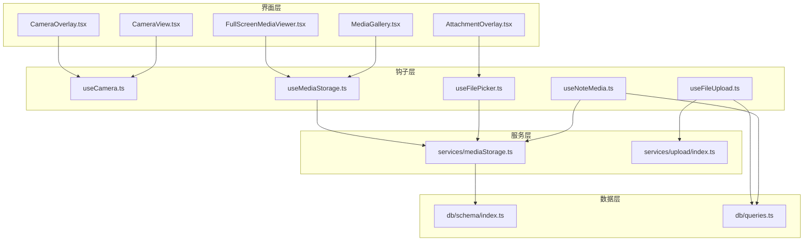
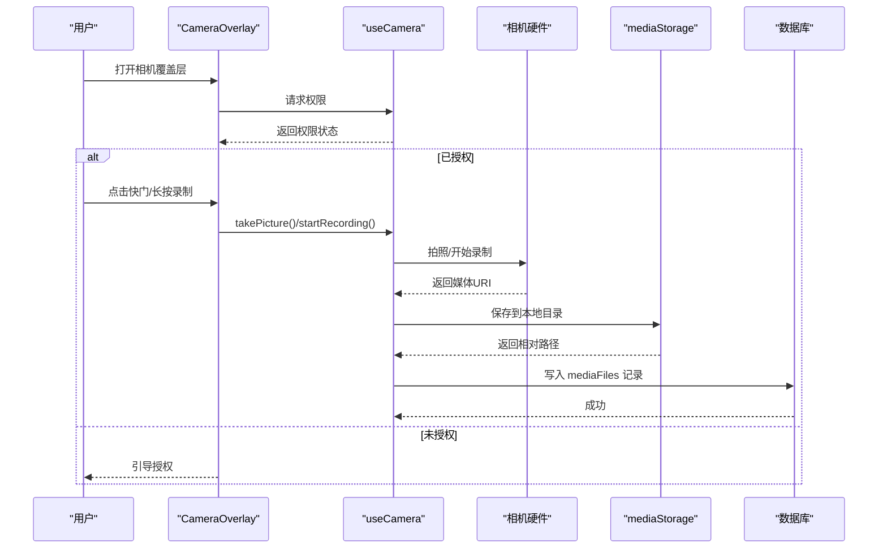
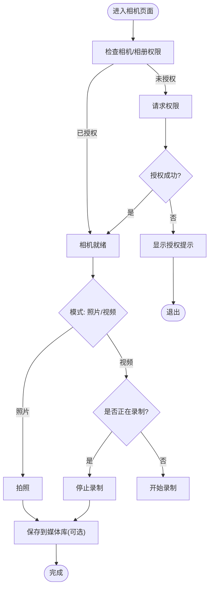
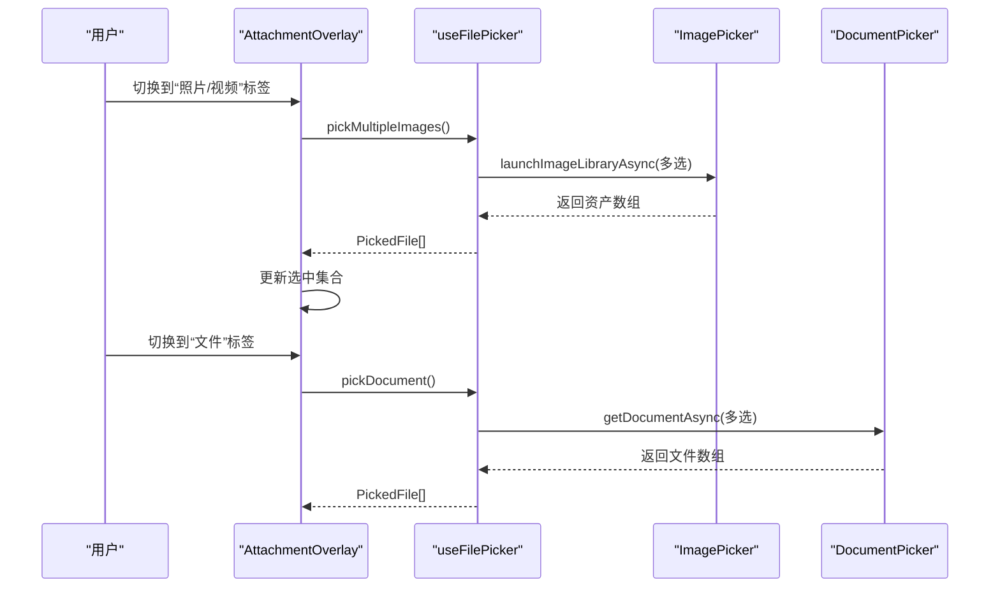
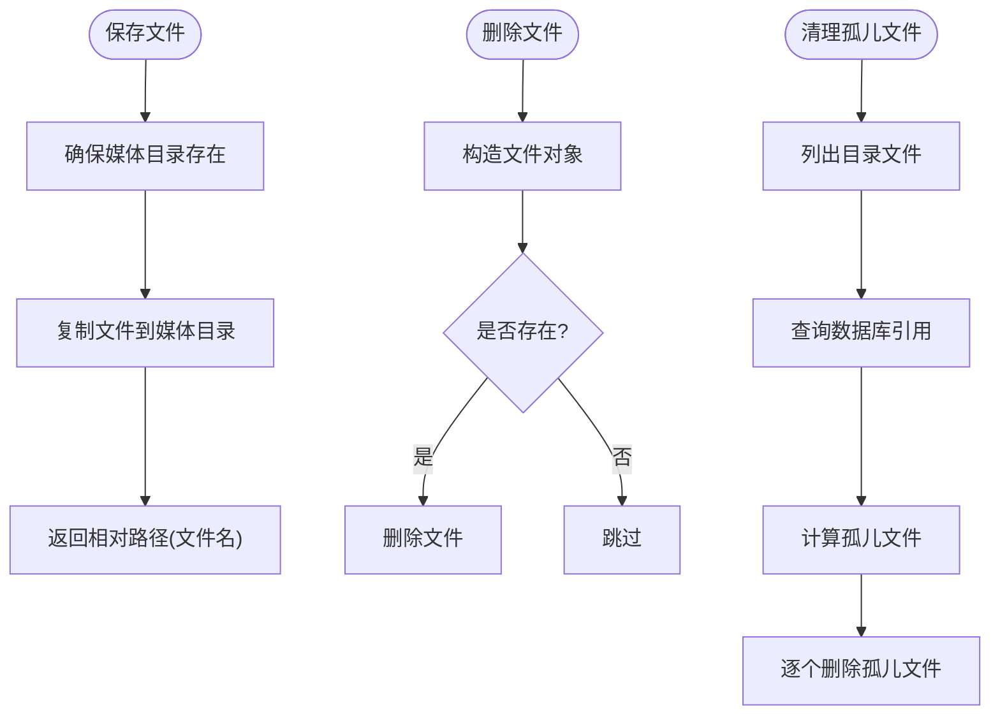
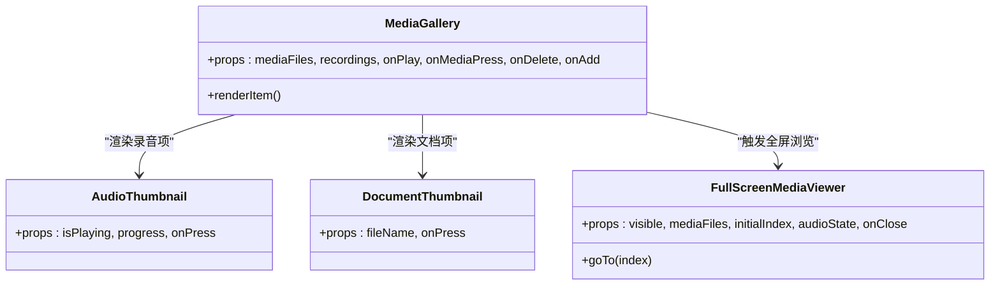
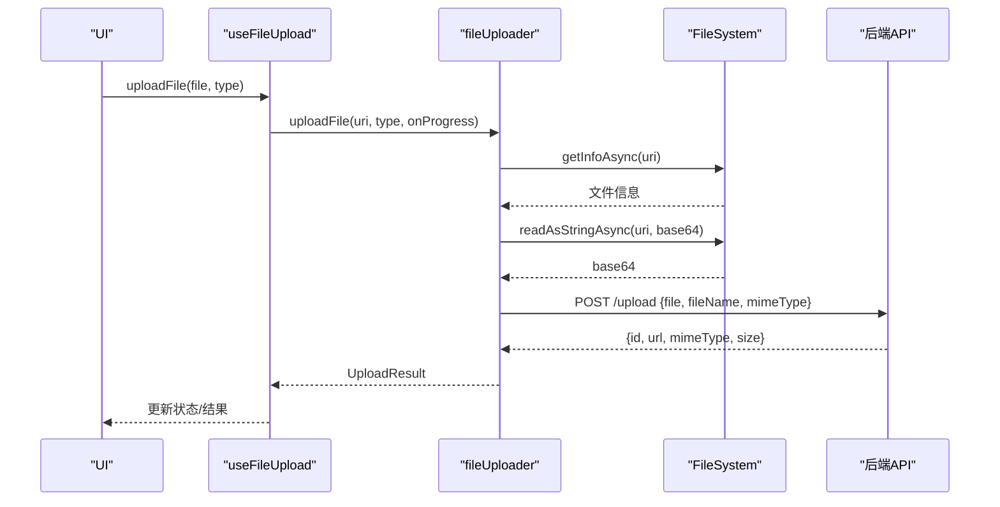
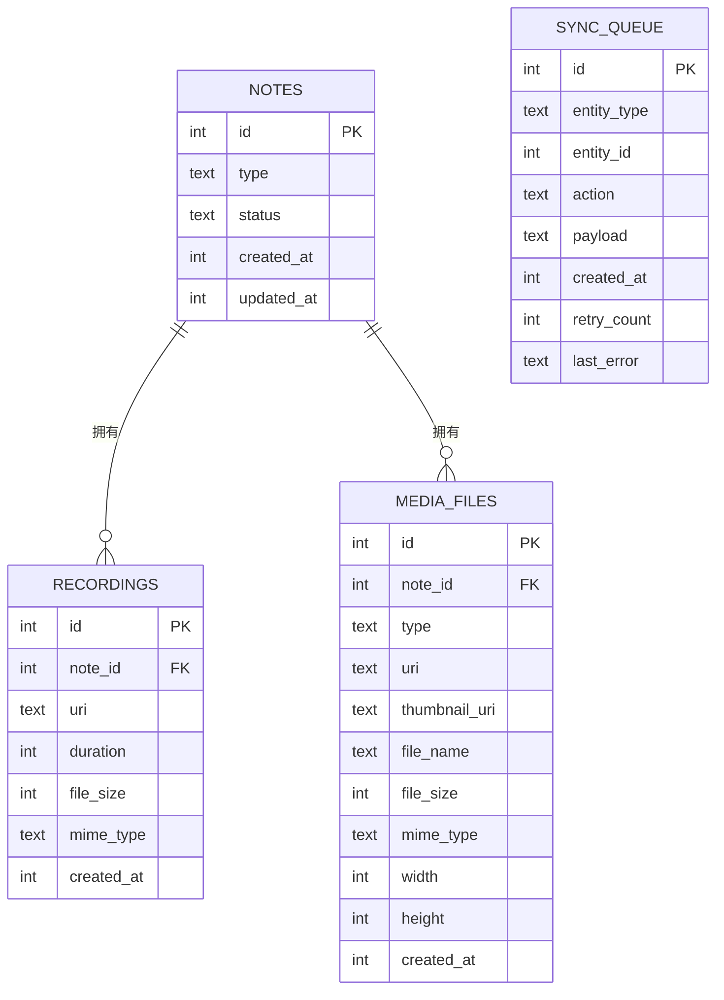
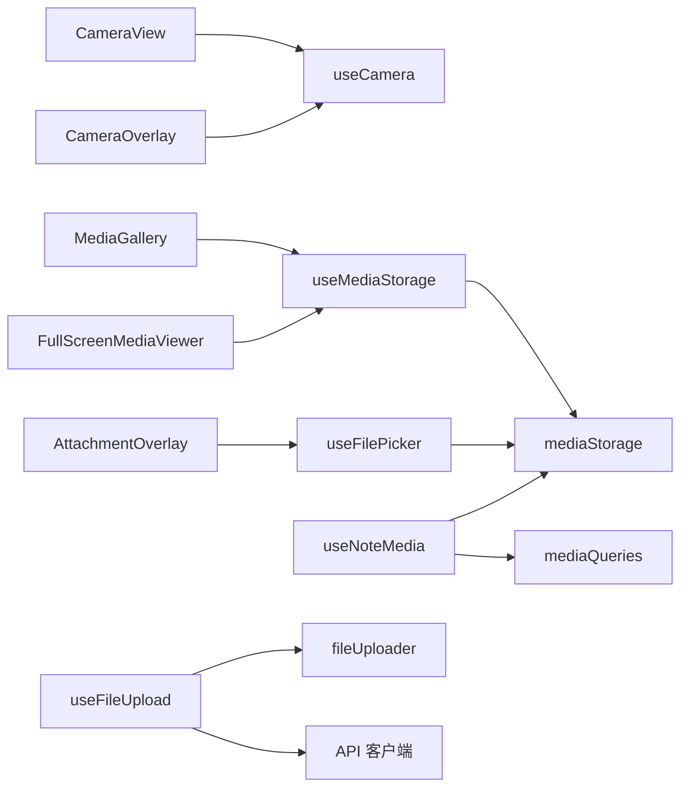

# 多媒体管理模块

<cite>
**本文档引用的文件**
- [app/camera.tsx](file://app/camera.tsx)
- [hooks/useCamera.ts](file://hooks/useCamera.ts)
- [components/camera/CameraView.tsx](file://components/camera/CameraView.tsx)
- [hooks/useFilePicker.ts](file://hooks/useFilePicker.ts)
- [hooks/useFileUpload.ts](file://hooks/useFileUpload.ts)
- [hooks/useMediaStorage.ts](file://hooks/useMediaStorage.ts)
- [services/mediaStorage.ts](file://services/mediaStorage.ts)
- [services/upload/index.ts](file://services/upload/index.ts)
- [components/note/preview/MediaGallery.tsx](file://components/note/preview/MediaGallery.tsx)
- [components/note/preview/AudioThumbnail.tsx](file://components/note/preview/AudioThumbnail.tsx)
- [components/note/preview/DocumentThumbnail.tsx](file://components/note/preview/DocumentThumbnail.tsx)
- [components/input/CameraOverlay.tsx](file://components/input/CameraOverlay.tsx)
- [components/input/AttachmentOverlay.tsx](file://components/input/AttachmentOverlay.tsx)
- [components/note/FullScreenMediaViewer.tsx](file://components/note/FullScreenMediaViewer.tsx)
- [hooks/useNoteMedia.ts](file://hooks/useNoteMedia.ts)
- [db/schema/index.ts](file://db/schema/index.ts)
- [db/queries.ts](file://db/queries.ts)
</cite>

## 目录
1. [简介](#简介)
2. [项目结构](#项目结构)
3. [核心组件](#核心组件)
4. [架构总览](#架构总览)
5. [详细组件分析](#详细组件分析)
6. [依赖关系分析](#依赖关系分析)
7. [性能考虑](#性能考虑)
8. [故障排除指南](#故障排除指南)
9. [结论](#结论)
10. [附录](#附录)

## 简介
本模块围绕多媒体能力构建，涵盖相机集成（权限管理、拍摄控制、自动保存）、文件选择与上传、本地媒体存储与清理、以及多媒体预览组件（缩略图、画廊、全屏浏览）。文档从架构设计到实现细节逐层展开，并提供可直接定位到源码的路径指引，帮助开发者快速理解与扩展。

## 项目结构
多媒体相关代码主要分布在以下区域：
- 钩子层：useCamera、useFilePicker、useFileUpload、useMediaStorage、useNoteMedia
- 组件层：CameraView、CameraOverlay、AttachmentOverlay、MediaGallery、AudioThumbnail、DocumentThumbnail、FullScreenMediaViewer
- 服务层：mediaStorage、fileUploader
- 数据层：数据库模式与查询（notes、recordings、mediaFiles、syncQueue）

图表来源
- [components/camera/CameraView.tsx:14-30](file://components/camera/CameraView.tsx#L14-L30)
- [hooks/useCamera.ts:13-114](file://hooks/useCamera.ts#L13-L114)
- [components/input/CameraOverlay.tsx:43-57](file://components/input/CameraOverlay.tsx#L43-L57)
- [components/input/AttachmentOverlay.tsx:68-84](file://components/input/AttachmentOverlay.tsx#L68-L84)
- [components/note/preview/MediaGallery.tsx:23-31](file://components/note/preview/MediaGallery.tsx#L23-L31)
- [components/note/FullScreenMediaViewer.tsx:26-30](file://components/note/FullScreenMediaViewer.tsx#L26-L30)
- [hooks/useNoteMedia.ts:14-37](file://hooks/useNoteMedia.ts#L14-L37)
- [hooks/useFilePicker.ts:18-60](file://hooks/useFilePicker.ts#L18-L60)
- [hooks/useFileUpload.ts:13-62](file://hooks/useFileUpload.ts#L13-L62)
- [hooks/useMediaStorage.ts:15-36](file://hooks/useMediaStorage.ts#L15-L36)
- [services/mediaStorage.ts:22-36](file://services/mediaStorage.ts#L22-L36)
- [services/upload/index.ts:29-66](file://services/upload/index.ts#L29-L66)
- [db/schema/index.ts:29-41](file://db/schema/index.ts#L29-L41)
- [db/queries.ts:94-133](file://db/queries.ts#L94-L133)

章节来源
- [app/camera.tsx:1-6](file://app/camera.tsx#L1-L6)
- [hooks/useCamera.ts:13-114](file://hooks/useCamera.ts#L13-L114)
- [hooks/useFilePicker.ts:18-275](file://hooks/useFilePicker.ts#L18-L275)
- [hooks/useFileUpload.ts:13-123](file://hooks/useFileUpload.ts#L13-L123)
- [hooks/useMediaStorage.ts:15-99](file://hooks/useMediaStorage.ts#L15-L99)
- [services/mediaStorage.ts:22-123](file://services/mediaStorage.ts#L22-L123)
- [services/upload/index.ts:29-130](file://services/upload/index.ts#L29-L130)
- [components/camera/CameraView.tsx:14-140](file://components/camera/CameraView.tsx#L14-L140)
- [components/input/CameraOverlay.tsx:43-349](file://components/input/CameraOverlay.tsx#L43-L349)
- [components/input/AttachmentOverlay.tsx:68-279](file://components/input/AttachmentOverlay.tsx#L68-L279)
- [components/note/preview/MediaGallery.tsx:23-112](file://components/note/preview/MediaGallery.tsx#L23-L112)
- [components/note/preview/AudioThumbnail.tsx:12-33](file://components/note/preview/AudioThumbnail.tsx#L12-L33)
- [components/note/preview/DocumentThumbnail.tsx:31-44](file://components/note/preview/DocumentThumbnail.tsx#L31-L44)
- [components/note/FullScreenMediaViewer.tsx:26-83](file://components/note/FullScreenMediaViewer.tsx#L26-L83)
- [hooks/useNoteMedia.ts:14-75](file://hooks/useNoteMedia.ts#L14-L75)
- [db/schema/index.ts:29-41](file://db/schema/index.ts#L29-L41)
- [db/queries.ts:94-133](file://db/queries.ts#L94-L133)

## 核心组件
- 相机集成：useCamera 提供权限请求、拍照、录像、前置/后置切换、录制状态管理；CameraView/CameraOverlay 提供 UI 控件与交互。
- 文件选择器：useFilePicker 支持图片/视频/文档单选/多选、相机直拍、视频录制、信息读取。
- 上传服务：useFileUpload 封装单文件/批量上传，进度回调与错误处理。
- 媒体存储：useMediaStorage 封装本地保存、URI 获取、删除、配额查询、孤儿文件清理。
- 预览组件：MediaGallery 画廊、AudioThumbnail/DocumentThumbnail 缩略图、FullScreenMediaViewer 全屏浏览。
- 数据模型：notes、recordings、mediaFiles、syncQueue 的表结构与查询封装。

章节来源
- [hooks/useCamera.ts:13-114](file://hooks/useCamera.ts#L13-L114)
- [components/camera/CameraView.tsx:14-140](file://components/camera/CameraView.tsx#L14-L140)
- [components/input/CameraOverlay.tsx:43-349](file://components/input/CameraOverlay.tsx#L43-L349)
- [hooks/useFilePicker.ts:18-275](file://hooks/useFilePicker.ts#L18-L275)
- [hooks/useFileUpload.ts:13-123](file://hooks/useFileUpload.ts#L13-L123)
- [hooks/useMediaStorage.ts:15-99](file://hooks/useMediaStorage.ts#L15-L99)
- [services/mediaStorage.ts:22-123](file://services/mediaStorage.ts#L22-L123)
- [components/note/preview/MediaGallery.tsx:23-112](file://components/note/preview/MediaGallery.tsx#L23-L112)
- [components/note/preview/AudioThumbnail.tsx:12-33](file://components/note/preview/AudioThumbnail.tsx#L12-L33)
- [components/note/preview/DocumentThumbnail.tsx:31-44](file://components/note/preview/DocumentThumbnail.tsx#L31-L44)
- [components/note/FullScreenMediaViewer.tsx:26-83](file://components/note/FullScreenMediaViewer.tsx#L26-L83)
- [hooks/useNoteMedia.ts:14-75](file://hooks/useNoteMedia.ts#L14-L75)
- [db/schema/index.ts:29-41](file://db/schema/index.ts#L29-L41)
- [db/queries.ts:94-133](file://db/queries.ts#L94-L133)

## 架构总览
多媒体模块采用“钩子层-组件层-服务层-数据层”的分层架构：
- 钩子层负责业务逻辑与状态管理（权限、录制、上传、存储）。
- 组件层负责 UI 与用户交互（相机覆盖层、附件选择器、画廊、全屏查看）。
- 服务层提供底层能力（文件系统、网络上传、媒体存储）。
- 数据层负责本地持久化与同步队列。

图表来源
- [components/input/CameraOverlay.tsx:110-168](file://components/input/CameraOverlay.tsx#L110-L168)
- [hooks/useCamera.ts:26-90](file://hooks/useCamera.ts#L26-L90)
- [services/mediaStorage.ts:22-36](file://services/mediaStorage.ts#L22-L36)
- [db/queries.ts:105-111](file://db/queries.ts#L105-L111)

## 详细组件分析

### 相机集成与拍摄控制
- 权限管理：useCamera 使用 expo-camera 的权限钩子，分别请求相机与相册权限；提供统一 hasPermission 判断。
- 拍摄控制：takePicture 调用相机 API 并可选保存至媒体库；startRecording/stopRecording 管理录制生命周期，使用 Promise 存储以避免竞态。
- UI 交互：CameraView/CameraOverlay 提供翻转摄像头、录制指示、闪屏动画、计时器、权限提示等。

图表来源
- [hooks/useCamera.ts:13-114](file://hooks/useCamera.ts#L13-L114)
- [components/camera/CameraView.tsx:14-140](file://components/camera/CameraView.tsx#L14-L140)
- [components/input/CameraOverlay.tsx:110-215](file://components/input/CameraOverlay.tsx#L110-L215)

章节来源
- [hooks/useCamera.ts:13-114](file://hooks/useCamera.ts#L13-L114)
- [components/camera/CameraView.tsx:14-140](file://components/camera/CameraView.tsx#L14-L140)
- [components/input/CameraOverlay.tsx:43-349](file://components/input/CameraOverlay.tsx#L43-L349)

### 文件选择器工作机制
- 图片/视频：支持单选与多选，可编辑裁剪，限制最大时长，返回尺寸与时长信息。
- 相机直拍：弹出相机进行拍照或录制，生成带时间戳的文件名。
- 文档选择：支持多文件选择，复制到缓存目录以便后续上传。
- 文件信息：通过 expo-file-system 获取存在性与大小。

图表来源
- [components/input/AttachmentOverlay.tsx:68-171](file://components/input/AttachmentOverlay.tsx#L68-L171)
- [hooks/useFilePicker.ts:216-251](file://hooks/useFilePicker.ts#L216-L251)
- [hooks/useFilePicker.ts:185-214](file://hooks/useFilePicker.ts#L185-L214)

章节来源
- [hooks/useFilePicker.ts:18-275](file://hooks/useFilePicker.ts#L18-L275)
- [components/input/AttachmentOverlay.tsx:68-279](file://components/input/AttachmentOverlay.tsx#L68-L279)

### 媒体存储服务与文件管理策略
- 本地保存：将外部 URI 复制到应用文档目录下的 media 子目录，返回仅含文件名的相对路径。
- URI 获取：根据相对路径拼接完整 URI。
- 删除与清理：删除指定文件；扫描目录与数据库比对，删除未被引用的孤儿文件。
- 配额查询：返回可用/总磁盘空间字节数。

图表来源
- [services/mediaStorage.ts:10-14](file://services/mediaStorage.ts#L10-L14)
- [services/mediaStorage.ts:22-36](file://services/mediaStorage.ts#L22-L36)
- [services/mediaStorage.ts:52-58](file://services/mediaStorage.ts#L52-L58)
- [services/mediaStorage.ts:80-114](file://services/mediaStorage.ts#L80-L114)

章节来源
- [services/mediaStorage.ts:22-123](file://services/mediaStorage.ts#L22-L123)
- [hooks/useMediaStorage.ts:15-99](file://hooks/useMediaStorage.ts#L15-L99)

### 多媒体预览组件实现
- 画廊视图：MediaGallery 横向列表，混合录音与媒体文件，支持点击预览、删除、添加附件。
- 缩略图：AudioThumbnail 显示播放状态与进度条；DocumentThumbnail 基于扩展名选择图标与颜色。
- 全屏浏览：FullScreenMediaViewer 支持图片全屏与音频播放器，左右导航与缩略条索引。

图表来源
- [components/note/preview/MediaGallery.tsx:23-90](file://components/note/preview/MediaGallery.tsx#L23-L90)
- [components/note/preview/AudioThumbnail.tsx:12-33](file://components/note/preview/AudioThumbnail.tsx#L12-L33)
- [components/note/preview/DocumentThumbnail.tsx:31-44](file://components/note/preview/DocumentThumbnail.tsx#L31-L44)
- [components/note/FullScreenMediaViewer.tsx:26-83](file://components/note/FullScreenMediaViewer.tsx#L26-L83)

章节来源
- [components/note/preview/MediaGallery.tsx:23-112](file://components/note/preview/MediaGallery.tsx#L23-L112)
- [components/note/preview/AudioThumbnail.tsx:12-53](file://components/note/preview/AudioThumbnail.tsx#L12-L53)
- [components/note/preview/DocumentThumbnail.tsx:31-60](file://components/note/preview/DocumentThumbnail.tsx#L31-L60)
- [components/note/FullScreenMediaViewer.tsx:26-97](file://components/note/FullScreenMediaViewer.tsx#L26-L97)

### 文件上传流程
- 单文件上传：读取文件为 base64，调用 API 接口上传，支持进度回调。
- 批量上传：顺序遍历文件，累计整体进度。
- MIME 类型推断：基于扩展名映射常见类型。
- 本地清理：上传完成后可删除本地临时文件（在上传服务中提供）。

图表来源
- [hooks/useFileUpload.ts:21-62](file://hooks/useFileUpload.ts#L21-L62)
- [services/upload/index.ts:29-66](file://services/upload/index.ts#L29-L66)

章节来源
- [hooks/useFileUpload.ts:13-123](file://hooks/useFileUpload.ts#L13-L123)
- [services/upload/index.ts:29-130](file://services/upload/index.ts#L29-L130)

### 本地缓存与同步机制
- 本地缓存：媒体文件保存在应用文档目录的 media 子目录，使用相对路径记录。
- 同步队列：syncQueue 表记录待同步实体、动作与重试次数，失败时更新错误信息。
- 清理策略：cleanupOrphanedMedia 定期扫描并删除数据库未引用的本地文件。

图表来源
- [db/schema/index.ts:3-41](file://db/schema/index.ts#L3-L41)
- [db/schema/index.ts:43-52](file://db/schema/index.ts#L43-L52)

章节来源
- [db/schema/index.ts:29-52](file://db/schema/index.ts#L29-L52)
- [db/queries.ts:135-164](file://db/queries.ts#L135-L164)
- [services/mediaStorage.ts:80-114](file://services/mediaStorage.ts#L80-L114)

## 依赖关系分析
- 组件依赖钩子：CameraView/CameraOverlay 依赖 useCamera；MediaGallery 依赖 useMediaStorage；AttachmentOverlay 依赖 useFilePicker。
- 钩子依赖服务：useMediaStorage 依赖 mediaStorage；useFileUpload 依赖 fileUploader；useNoteMedia 依赖 mediaStorage 与媒体查询。
- 数据访问：所有写操作通过 db/queries.ts 的封装执行，保证一致性与类型安全。

图表来源
- [components/camera/CameraView.tsx:18-30](file://components/camera/CameraView.tsx#L18-L30)
- [components/input/CameraOverlay.tsx:43-57](file://components/input/CameraOverlay.tsx#L43-L57)
- [components/note/preview/MediaGallery.tsx:10-10](file://components/note/preview/MediaGallery.tsx#L10-L10)
- [components/note/FullScreenMediaViewer.tsx:8-8](file://components/note/FullScreenMediaViewer.tsx#L8-L8)
- [components/input/AttachmentOverlay.tsx:68-84](file://components/input/AttachmentOverlay.tsx#L68-L84)
- [hooks/useNoteMedia.ts:6-6](file://hooks/useNoteMedia.ts#L6-L6)
- [hooks/useMediaStorage.ts:2-2](file://hooks/useMediaStorage.ts#L2-L2)
- [hooks/useFileUpload.ts:2-2](file://hooks/useFileUpload.ts#L2-L2)
- [services/upload/index.ts:3-4](file://services/upload/index.ts#L3-L4)

章节来源
- [hooks/useCamera.ts:1-1](file://hooks/useCamera.ts#L1-L1)
- [hooks/useFilePicker.ts:1-1](file://hooks/useFilePicker.ts#L1-L1)
- [hooks/useFileUpload.ts:1-2](file://hooks/useFileUpload.ts#L1-L2)
- [hooks/useMediaStorage.ts:1-2](file://hooks/useMediaStorage.ts#L1-L2)
- [hooks/useNoteMedia.ts:1-6](file://hooks/useNoteMedia.ts#L1-L6)
- [services/mediaStorage.ts:1-3](file://services/mediaStorage.ts#L1-L3)
- [services/upload/index.ts:1-4](file://services/upload/index.ts#L1-L4)
- [db/queries.ts:1-4](file://db/queries.ts#L1-L4)

## 性能考虑
- 相机拍摄：takePictureAsync 默认开启 skipProcessing=false 可能影响性能，可根据场景调整质量参数与是否生成缩略图。
- 录制控制：startRecording/stopRecording 使用 Promise 存储避免竞态，建议在 UI 层禁用重复触发按钮。
- 上传优化：当前实现将文件读取为 base64，大文件会占用较多内存；可考虑流式上传或分块传输以降低内存峰值。
- 预览加载：FlatList 横向滚动与 Image 组件需注意尺寸与懒加载，避免一次性加载过多高分辨率资源。
- 本地清理：定期执行 cleanupOrphanedMedia，防止磁盘膨胀；建议在应用空闲时异步执行。

## 故障排除指南
- 相机无权限：CameraView/CameraOverlay 在未授权时引导用户授权；确认平台权限设置与权限请求流程。
- 录制失败：检查 maxDuration 限制与设备兼容性；捕获异常并提示用户。
- 上传失败：useFileUpload 捕获错误并返回错误消息；检查网络状态与 MIME 类型推断。
- 本地文件缺失：mediaStorage.getMediaUri 返回的 URI 不存在时，检查 cleanupOrphanedMedia 是否提前清理。
- 数据库异常：db/queries.ts 对外提供统一查询入口，注意事务与错误回滚。

章节来源
- [components/camera/CameraView.tsx:47-78](file://components/camera/CameraView.tsx#L47-L78)
- [components/input/CameraOverlay.tsx:110-115](file://components/input/CameraOverlay.tsx#L110-L115)
- [hooks/useFileUpload.ts:52-61](file://hooks/useFileUpload.ts#L52-L61)
- [services/mediaStorage.ts:43-46](file://services/mediaStorage.ts#L43-L46)
- [db/queries.ts:135-164](file://db/queries.ts#L135-L164)

## 结论
该多媒体管理模块通过清晰的分层设计实现了从拍摄、选择、上传到本地存储与预览的完整链路。权限管理、录制控制、文件上传与本地清理均具备完善的错误处理与用户体验保障。建议在大文件上传场景下进一步优化内存与网络策略，并持续维护同步队列与本地清理任务以保持系统健康。

## 附录

### 相机拍摄与文件上传的代码示例路径
- 相机拍摄（拍照/录像）
  - [hooks/useCamera.ts:26-90](file://hooks/useCamera.ts#L26-L90)
  - [components/input/CameraOverlay.tsx:186-215](file://components/input/CameraOverlay.tsx#L186-L215)
- 文件上传（单文件/批量）
  - [hooks/useFileUpload.ts:21-62](file://hooks/useFileUpload.ts#L21-L62)
  - [services/upload/index.ts:29-66](file://services/upload/index.ts#L29-L66)

### 多媒体文件的本地缓存与同步
- 本地保存与清理
  - [services/mediaStorage.ts:22-36](file://services/mediaStorage.ts#L22-L36)
  - [services/mediaStorage.ts:80-114](file://services/mediaStorage.ts#L80-L114)
- 同步队列
  - [db/schema/index.ts:43-52](file://db/schema/index.ts#L43-L52)
  - [db/queries.ts:135-164](file://db/queries.ts#L135-L164)

### 开发者扩展与自定义建议
- 自定义相机 UI：基于 useCamera 的状态与回调扩展控件布局与动画。
- 文件类型过滤：在 useFilePicker 中增加 MIME 白名单与文件大小限制。
- 上传策略：在 fileUploader 中实现断点续传或分块上传以提升稳定性。
- 预览增强：在 FullScreenMediaViewer 中加入手势缩放、下载与分享功能。
- 数据同步：在 syncQueue 上实现重试策略与错误上报，结合后台任务定期同步。