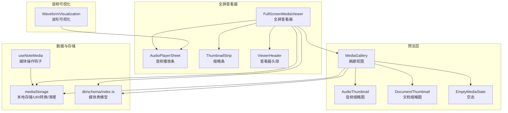
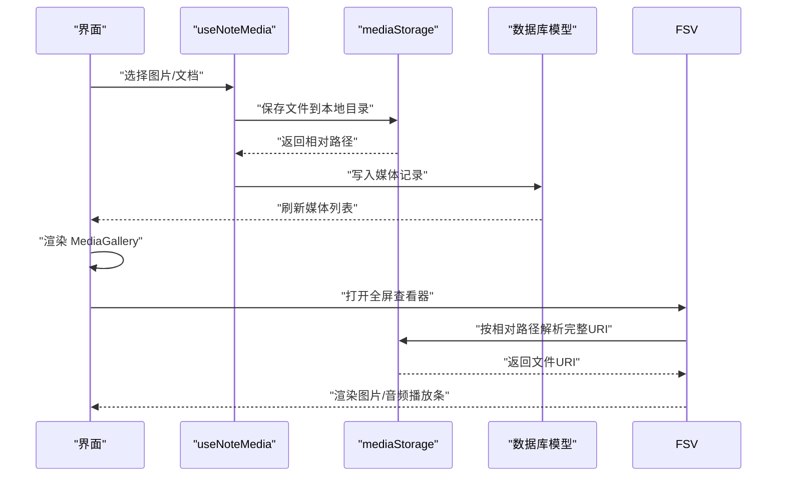
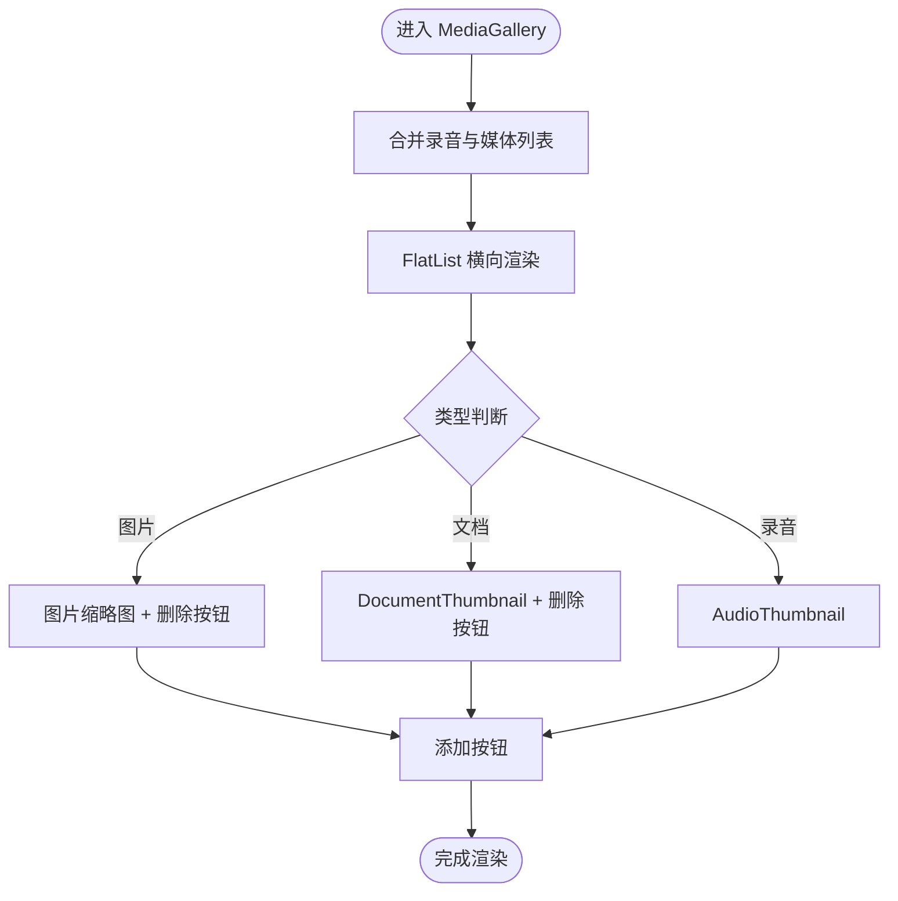
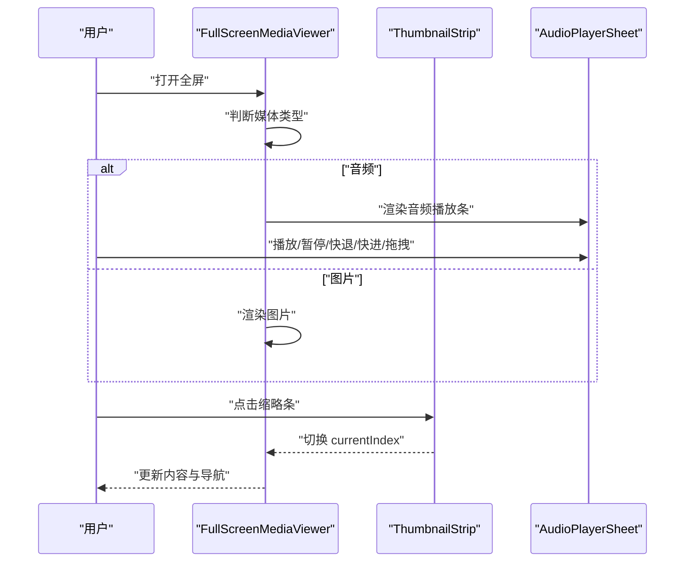
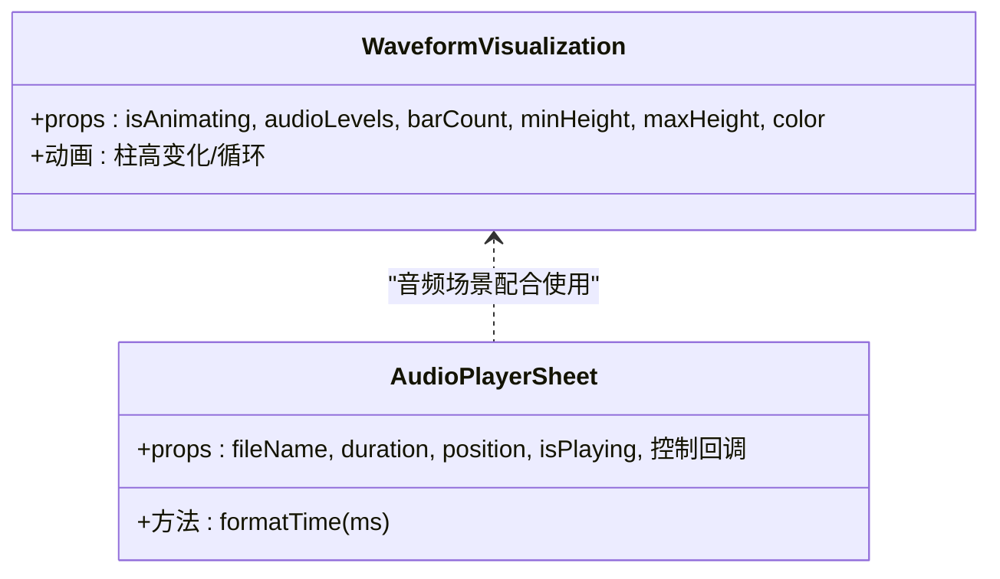
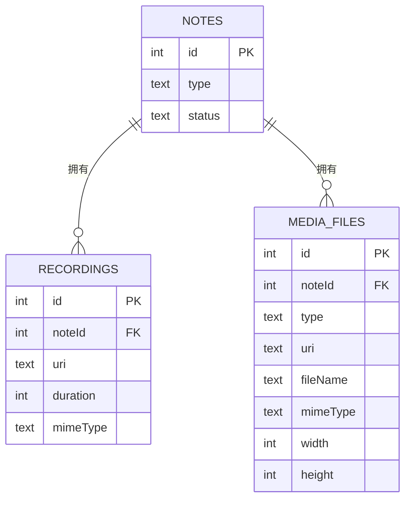
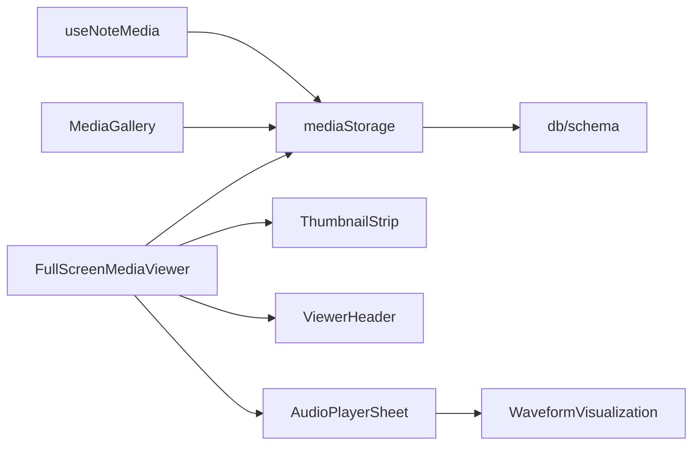

# 多媒体预览

<cite>
**本文引用的文件**
- [components/note/preview/MediaGallery.tsx](file://components/note/preview/MediaGallery.tsx)
- [components/note/preview/AudioThumbnail.tsx](file://components/note/preview/AudioThumbnail.tsx)
- [components/note/preview/DocumentThumbnail.tsx](file://components/note/preview/DocumentThumbnail.tsx)
- [components/note/preview/EmptyMediaState.tsx](file://components/note/preview/EmptyMediaState.tsx)
- [components/note/FullScreenMediaViewer.tsx](file://components/note/FullScreenMediaViewer.tsx)
- [components/note/viewer/AudioPlayerSheet.tsx](file://components/note/viewer/AudioPlayerSheet.tsx)
- [components/note/viewer/ThumbnailStrip.tsx](file://components/note/viewer/ThumbnailStrip.tsx)
- [components/note/viewer/ViewerHeader.tsx](file://components/note/viewer/ViewerHeader.tsx)
- [components/audio/WaveformVisualization.tsx](file://components/audio/WaveformVisualization.tsx)
- [hooks/useNoteMedia.ts](file://hooks/useNoteMedia.ts)
- [services/mediaStorage.ts](file://services/mediaStorage.ts)
- [db/schema/index.ts](file://db/schema/index.ts)
- [i18n/locales/zh-CN/media.json](file://i18n/locales/zh-CN/media.json)
- [app/note/[id].tsx](file://app/note/[id].tsx)
</cite>

## 目录
1. [简介](#简介)
2. [项目结构](#项目结构)
3. [核心组件](#核心组件)
4. [架构总览](#架构总览)
5. [详细组件分析](#详细组件分析)
6. [依赖关系分析](#依赖关系分析)
7. [性能考虑](#性能考虑)
8. [故障排查指南](#故障排查指南)
9. [结论](#结论)
10. [附录：使用与定制示例](#附录使用与定制示例)

## 简介
本文件系统性梳理多媒体预览功能的设计与实现，覆盖缩略图生成、画廊视图布局、全屏媒体查看器、音频波形可视化、存储与数据库模型、国际化文案、以及性能优化策略（懒加载、虚拟滚动、内存管理）。文档同时提供可直接定位到源码的路径指引，帮助开发者快速理解与扩展多媒体预览能力。

## 项目结构
多媒体预览相关代码主要分布在以下模块：
- 预览画廊与缩略图：components/note/preview
- 全屏查看器与播放条：components/note/viewer
- 音频可视化：components/audio
- 媒体存取与清理：services/mediaStorage.ts
- 媒体数据模型：db/schema/index.ts
- 媒体交互钩子：hooks/useNoteMedia.ts
- 国际化文案：i18n/locales/zh-CN/media.json
- 页面容器与加载态：app/note/[id].tsx

图表来源
- [components/note/preview/MediaGallery.tsx:23-90](file://components/note/preview/MediaGallery.tsx#L23-L90)
- [components/note/preview/AudioThumbnail.tsx:12-33](file://components/note/preview/AudioThumbnail.tsx#L12-L33)
- [components/note/preview/DocumentThumbnail.tsx:31-44](file://components/note/preview/DocumentThumbnail.tsx#L31-L44)
- [components/note/FullScreenMediaViewer.tsx:26-83](file://components/note/FullScreenMediaViewer.tsx#L26-L83)
- [components/note/viewer/AudioPlayerSheet.tsx:24-59](file://components/note/viewer/AudioPlayerSheet.tsx#L24-L59)
- [components/note/viewer/ThumbnailStrip.tsx:13-39](file://components/note/viewer/ThumbnailStrip.tsx#L13-L39)
- [components/note/viewer/ViewerHeader.tsx:14-33](file://components/note/viewer/ViewerHeader.tsx#L14-L33)
- [components/audio/WaveformVisualization.tsx:32-119](file://components/audio/WaveformVisualization.tsx#L32-L119)
- [hooks/useNoteMedia.ts:14-75](file://hooks/useNoteMedia.ts#L14-L75)
- [services/mediaStorage.ts:22-58](file://services/mediaStorage.ts#L22-L58)
- [db/schema/index.ts:19-41](file://db/schema/index.ts#L19-L41)

章节来源
- [components/note/preview/MediaGallery.tsx:1-112](file://components/note/preview/MediaGallery.tsx#L1-L112)
- [components/note/FullScreenMediaViewer.tsx:1-97](file://components/note/FullScreenMediaViewer.tsx#L1-L97)
- [services/mediaStorage.ts:1-123](file://services/mediaStorage.ts#L1-L123)
- [db/schema/index.ts:1-75](file://db/schema/index.ts#L1-L75)

## 核心组件
- 预览画廊 MediaGallery：横向列表展示录音缩略图与媒体缩略图，支持删除与添加入口；通过线性渐变遮罩增强视觉层次。
- 音频缩略图 AudioThumbnail：显示播放状态、进度条与播放按钮，用于在画廊中触发录音播放。
- 文档缩略图 DocumentThumbnail：按文件类型映射颜色与图标，展示扩展名与文件名。
- 全屏查看器 FullScreenMediaViewer：根据当前媒体类型渲染图片或音频播放条，支持左右导航与底部缩略条切换。
- 音频播放条 AudioPlayerSheet：提供播放/暂停、快退/快进、进度条与时间显示。
- 缩略条 ThumbnailStrip：底部横向缩略条，高亮当前项，点击切换。
- 查看器头部 ViewerHeader：显示索引与关闭按钮，带安全区适配。
- 波形可视化 WaveformVisualization：基于 Reanimated 的动态柱状图，支持录制时随机动画与外部音量级别驱动。
- 媒体存取服务 mediaStorage：统一保存/读取/删除媒体文件，提供 URI 转换与磁盘配额查询、孤儿文件清理。
- 媒体操作钩子 useNoteMedia：封装图片/文档选择、保存、删除流程，触发变更回调。
- 数据模型：媒体表 mediaFiles 与录音表 recordings，支撑预览与播放状态持久化。

章节来源
- [components/note/preview/MediaGallery.tsx:23-90](file://components/note/preview/MediaGallery.tsx#L23-L90)
- [components/note/preview/AudioThumbnail.tsx:12-33](file://components/note/preview/AudioThumbnail.tsx#L12-L33)
- [components/note/preview/DocumentThumbnail.tsx:31-44](file://components/note/preview/DocumentThumbnail.tsx#L31-L44)
- [components/note/FullScreenMediaViewer.tsx:26-83](file://components/note/FullScreenMediaViewer.tsx#L26-L83)
- [components/note/viewer/AudioPlayerSheet.tsx:24-59](file://components/note/viewer/AudioPlayerSheet.tsx#L24-L59)
- [components/note/viewer/ThumbnailStrip.tsx:13-39](file://components/note/viewer/ThumbnailStrip.tsx#L13-L39)
- [components/note/viewer/ViewerHeader.tsx:14-33](file://components/note/viewer/ViewerHeader.tsx#L14-L33)
- [components/audio/WaveformVisualization.tsx:32-119](file://components/audio/WaveformVisualization.tsx#L32-L119)
- [hooks/useNoteMedia.ts:14-75](file://hooks/useNoteMedia.ts#L14-L75)
- [services/mediaStorage.ts:22-58](file://services/mediaStorage.ts#L22-L58)
- [db/schema/index.ts:19-41](file://db/schema/index.ts#L19-L41)

## 架构总览
多媒体预览从“数据模型”出发，通过“媒体操作钩子”与“本地存储服务”完成增删改查；在界面层由“预览画廊”与“全屏查看器”协同呈现，音频场景引入“波形可视化”提升交互体验。

图表来源
- [hooks/useNoteMedia.ts:14-75](file://hooks/useNoteMedia.ts#L14-L75)
- [services/mediaStorage.ts:22-58](file://services/mediaStorage.ts#L22-L58)
- [db/schema/index.ts:19-41](file://db/schema/index.ts#L19-L41)
- [components/note/FullScreenMediaViewer.tsx:40-83](file://components/note/FullScreenMediaViewer.tsx#L40-L83)

## 详细组件分析

### 预览画廊与缩略图
- MediaGallery：将录音与媒体合并排序，横向 FlatList 渲染；图片缩略图支持删除；文档缩略图按类型映射图标与颜色；尾部“添加”入口触发选择器。
- AudioThumbnail：播放态高亮、进度条随播放进度更新；点击触发播放控制。
- DocumentThumbnail：根据扩展名映射颜色与图标，展示扩展名与文件名，避免溢出。

图表来源
- [components/note/preview/MediaGallery.tsx:23-90](file://components/note/preview/MediaGallery.tsx#L23-L90)
- [components/note/preview/AudioThumbnail.tsx:12-33](file://components/note/preview/AudioThumbnail.tsx#L12-L33)
- [components/note/preview/DocumentThumbnail.tsx:31-44](file://components/note/preview/DocumentThumbnail.tsx#L31-L44)

章节来源
- [components/note/preview/MediaGallery.tsx:23-90](file://components/note/preview/MediaGallery.tsx#L23-L90)
- [components/note/preview/AudioThumbnail.tsx:12-33](file://components/note/preview/AudioThumbnail.tsx#L12-L33)
- [components/note/preview/DocumentThumbnail.tsx:31-44](file://components/note/preview/DocumentThumbnail.tsx#L31-L44)

### 全屏媒体查看器
- 条件渲染：音频时渲染 AudioPlayerSheet，图片时渲染 Image 并设置 resizeMode 为 contain；支持左右导航按钮与底部缩略条。
- 导航与切换：根据索引边界控制左右按钮显隐；点击缩略条切换当前项。
- 音频控制：提供播放/暂停、快退/快进（固定步进）、拖拽进度。

图表来源
- [components/note/FullScreenMediaViewer.tsx:26-83](file://components/note/FullScreenMediaViewer.tsx#L26-L83)
- [components/note/viewer/ThumbnailStrip.tsx:13-39](file://components/note/viewer/ThumbnailStrip.tsx#L13-L39)
- [components/note/viewer/AudioPlayerSheet.tsx:24-59](file://components/note/viewer/AudioPlayerSheet.tsx#L24-L59)

章节来源
- [components/note/FullScreenMediaViewer.tsx:26-83](file://components/note/FullScreenMediaViewer.tsx#L26-L83)
- [components/note/viewer/ThumbnailStrip.tsx:13-39](file://components/note/viewer/ThumbnailStrip.tsx#L13-L39)
- [components/note/viewer/AudioPlayerSheet.tsx:24-59](file://components/note/viewer/AudioPlayerSheet.tsx#L24-L59)

### 音频可视化与播放控制
- WaveformVisualization：基于 Reanimated 的柱状动画，支持录制时随机波动与外部音量级别驱动；可配置柱数、最小/最大高度、颜色。
- AudioPlayerSheet：展示专辑图、文件名、总时长、当前位置、进度条与控制按钮；时间格式化为分:秒。

图表来源
- [components/audio/WaveformVisualization.tsx:32-119](file://components/audio/WaveformVisualization.tsx#L32-L119)
- [components/note/viewer/AudioPlayerSheet.tsx:24-59](file://components/note/viewer/AudioPlayerSheet.tsx#L24-L59)

章节来源
- [components/audio/WaveformVisualization.tsx:32-119](file://components/audio/WaveformVisualization.tsx#L32-L119)
- [components/note/viewer/AudioPlayerSheet.tsx:24-59](file://components/note/viewer/AudioPlayerSheet.tsx#L24-L59)

### 存储与数据模型
- mediaStorage：确保媒体目录存在，复制文件至本地目录，返回相对路径；提供 URI 解析、删除、磁盘配额查询、孤儿文件清理。
- 数据模型：mediaFiles 表含 noteId、type、uri、fileName、mimeType、尺寸等字段；recordings 表含录音元信息。

图表来源
- [db/schema/index.ts:19-41](file://db/schema/index.ts#L19-L41)
- [services/mediaStorage.ts:22-58](file://services/mediaStorage.ts#L22-L58)

章节来源
- [services/mediaStorage.ts:22-58](file://services/mediaStorage.ts#L22-L58)
- [db/schema/index.ts:19-41](file://db/schema/index.ts#L19-L41)

## 依赖关系分析
- 组件间耦合：MediaGallery 依赖 AudioThumbnail、DocumentThumbnail 与媒体存储 URI；FullScreenMediaViewer 依赖 ThumbnailStrip、ViewerHeader 与媒体存储；AudioPlayerSheet 与 WaveformVisualization 在音频场景协作。
- 外部依赖：expo-image-picker、expo-document-picker、expo-file-system、expo-linear-gradient、lucide-react-native、react-native-reanimated、tamagui。
- 数据流：useNoteMedia -> mediaStorage -> db/schema；UI 层通过 props 传递状态与回调。

图表来源
- [hooks/useNoteMedia.ts:14-75](file://hooks/useNoteMedia.ts#L14-L75)
- [services/mediaStorage.ts:22-58](file://services/mediaStorage.ts#L22-L58)
- [db/schema/index.ts:19-41](file://db/schema/index.ts#L19-L41)
- [components/note/preview/MediaGallery.tsx:23-90](file://components/note/preview/MediaGallery.tsx#L23-L90)
- [components/note/FullScreenMediaViewer.tsx:26-83](file://components/note/FullScreenMediaViewer.tsx#L26-L83)
- [components/note/viewer/ThumbnailStrip.tsx:13-39](file://components/note/viewer/ThumbnailStrip.tsx#L13-L39)
- [components/note/viewer/ViewerHeader.tsx:14-33](file://components/note/viewer/ViewerHeader.tsx#L14-L33)
- [components/note/viewer/AudioPlayerSheet.tsx:24-59](file://components/note/viewer/AudioPlayerSheet.tsx#L24-L59)
- [components/audio/WaveformVisualization.tsx:32-119](file://components/audio/WaveformVisualization.tsx#L32-L119)

章节来源
- [hooks/useNoteMedia.ts:14-75](file://hooks/useNoteMedia.ts#L14-L75)
- [services/mediaStorage.ts:22-58](file://services/mediaStorage.ts#L22-L58)
- [components/note/preview/MediaGallery.tsx:23-90](file://components/note/preview/MediaGallery.tsx#L23-L90)
- [components/note/FullScreenMediaViewer.tsx:26-83](file://components/note/FullScreenMediaViewer.tsx#L26-L83)

## 性能考虑
- 懒加载与虚拟滚动
  - 使用 FlatList 横向渲染媒体项，天然具备可视区域渲染与回收机制，减少初始渲染开销。
  - 图片缩略图与缩略条均采用 FlatList，避免一次性渲染大量节点。
- 内存管理
  - 媒体文件保存在本地目录，通过相对路径引用，避免重复拷贝；提供孤儿文件清理接口，定期扫描并删除未被数据库引用的文件。
  - 全屏查看器仅在可见时渲染当前媒体，音频播放条按需更新进度。
- 动画与重绘
  - 波形可视化使用 Reanimated 动画值，避免主线程阻塞；在非录制态时重置为最小高度，降低资源占用。
- 磁盘空间监控
  - 提供可用/总磁盘空间查询，便于在添加媒体前进行容量评估与提示。

章节来源
- [components/note/preview/MediaGallery.tsx:35-81](file://components/note/preview/MediaGallery.tsx#L35-L81)
- [components/note/viewer/ThumbnailStrip.tsx:16-39](file://components/note/viewer/ThumbnailStrip.tsx#L16-L39)
- [components/audio/WaveformVisualization.tsx:44-93](file://components/audio/WaveformVisualization.tsx#L44-L93)
- [services/mediaStorage.ts:64-74](file://services/mediaStorage.ts#L64-L74)
- [services/mediaStorage.ts:80-114](file://services/mediaStorage.ts#L80-L114)

## 故障排查指南
- 媒体无法显示
  - 检查媒体是否成功保存到本地目录并返回相对路径；确认 URI 解析函数是否正确拼接完整路径。
  - 参考路径：[services/mediaStorage.ts:43-46](file://services/mediaStorage.ts#L43-L46)
- 删除媒体后仍显示
  - 确认数据库记录已删除且触发了变更回调；检查媒体存储清理逻辑是否执行。
  - 参考路径：[hooks/useNoteMedia.ts:62-67](file://hooks/useNoteMedia.ts#L62-L67)，[services/mediaStorage.ts:52-58](file://services/mediaStorage.ts#L52-L58)
- 音频播放条不更新
  - 确认传入的 duration、position、isPlaying 是否正确；检查快退/快进步进与拖拽回调是否生效。
  - 参考路径：[components/note/FullScreenMediaViewer.tsx:46-56](file://components/note/FullScreenMediaViewer.tsx#L46-L56)，[components/note/viewer/AudioPlayerSheet.tsx:24-59](file://components/note/viewer/AudioPlayerSheet.tsx#L24-L59)
- 全屏查看器空白
  - 检查 visible 与当前索引是否有效；确认媒体数组长度与索引边界。
  - 参考路径：[components/note/FullScreenMediaViewer.tsx:26-36](file://components/note/FullScreenMediaViewer.tsx#L26-L36)
- 国际化文案缺失
  - 检查媒体相关键值是否存在对应语言包。
  - 参考路径：[i18n/locales/zh-CN/media.json:1-13](file://i18n/locales/zh-CN/media.json#L1-L13)

章节来源
- [services/mediaStorage.ts:43-46](file://services/mediaStorage.ts#L43-L46)
- [hooks/useNoteMedia.ts:62-67](file://hooks/useNoteMedia.ts#L62-L67)
- [components/note/FullScreenMediaViewer.tsx:26-36](file://components/note/FullScreenMediaViewer.tsx#L26-L36)
- [components/note/viewer/AudioPlayerSheet.tsx:24-59](file://components/note/viewer/AudioPlayerSheet.tsx#L24-L59)
- [i18n/locales/zh-CN/media.json:1-13](file://i18n/locales/zh-CN/media.json#L1-L13)

## 结论
该多媒体预览体系以清晰的组件分层与数据模型为基础，结合本地存储与 Reanimated 动画，在移动端实现了高效、流畅的图片/文档/音频预览与全屏播放体验。通过懒加载、虚拟滚动与内存清理策略，系统在性能与稳定性方面具备良好表现。后续可在手势缩放、离线缓存、多设备同步等方面进一步扩展。

## 附录：使用与定制示例
- 在页面中集成预览画廊
  - 将 MediaGallery 绑定到笔记的媒体列表与录音列表，传入播放状态与回调。
  - 参考路径：[components/note/preview/MediaGallery.tsx:23-90](file://components/note/preview/MediaGallery.tsx#L23-L90)
- 自定义文档缩略图样式
  - 修改 DocumentThumbnail 的颜色映射与图标映射规则，扩展更多文件类型支持。
  - 参考路径：[components/note/preview/DocumentThumbnail.tsx:6-24](file://components/note/preview/DocumentThumbnail.tsx#L6-L24)
- 定制全屏查看器
  - 在 FullScreenMediaViewer 中增加手势缩放（如 pinch-to-zoom）与滑动切换；为视频封面预留占位图。
  - 参考路径：[components/note/FullScreenMediaViewer.tsx:38-63](file://components/note/FullScreenMediaViewer.tsx#L38-L63)
- 扩展音频播放控制
  - 在 AudioPlayerSheet 中增加节拍器、均衡器或分享按钮；在 WaveformVisualization 中接入实时音量采样。
  - 参考路径：[components/note/viewer/AudioPlayerSheet.tsx:24-59](file://components/note/viewer/AudioPlayerSheet.tsx#L24-L59)，[components/audio/WaveformVisualization.tsx:32-119](file://components/audio/WaveformVisualization.tsx#L32-L119)
- 媒体添加与删除流程
  - 使用 useNoteMedia 的 addFromImagePicker/addFromDocumentPicker/deleteMedia，确保 onMediaChanged 触发刷新。
  - 参考路径：[hooks/useNoteMedia.ts:14-75](file://hooks/useNoteMedia.ts#L14-L75)
- 国际化与无障碍
  - 在媒体相关文案处补充多语言键值；为按钮添加可访问性标签与键盘导航支持。
  - 参考路径：[i18n/locales/zh-CN/media.json:1-13](file://i18n/locales/zh-CN/media.json#L1-L13)