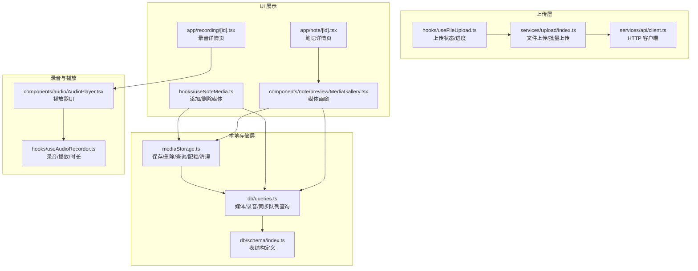
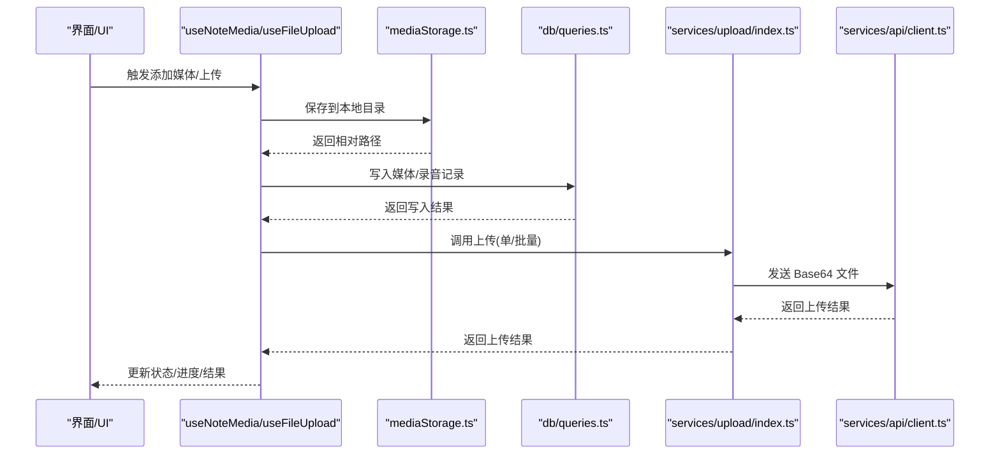
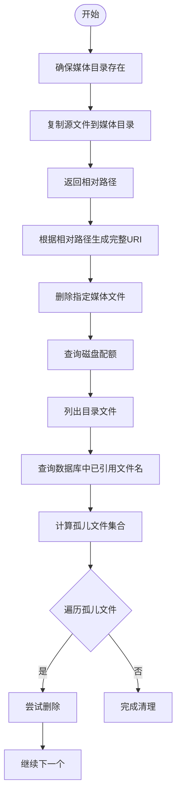
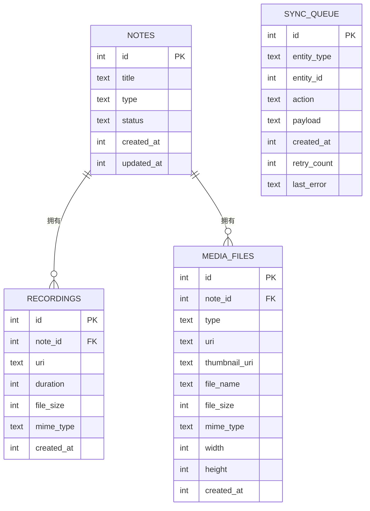
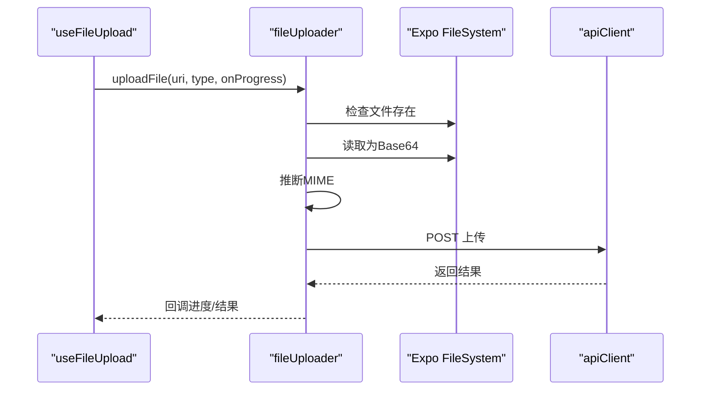
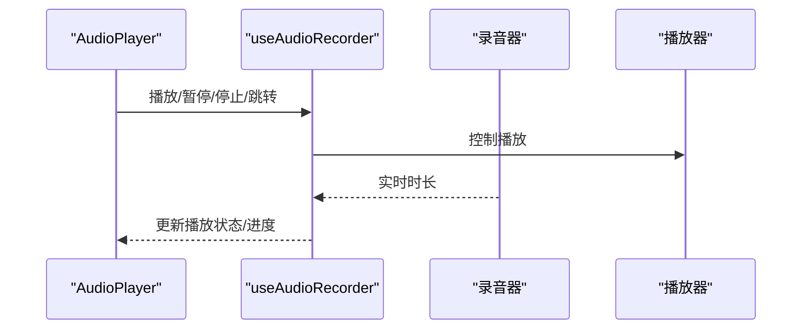
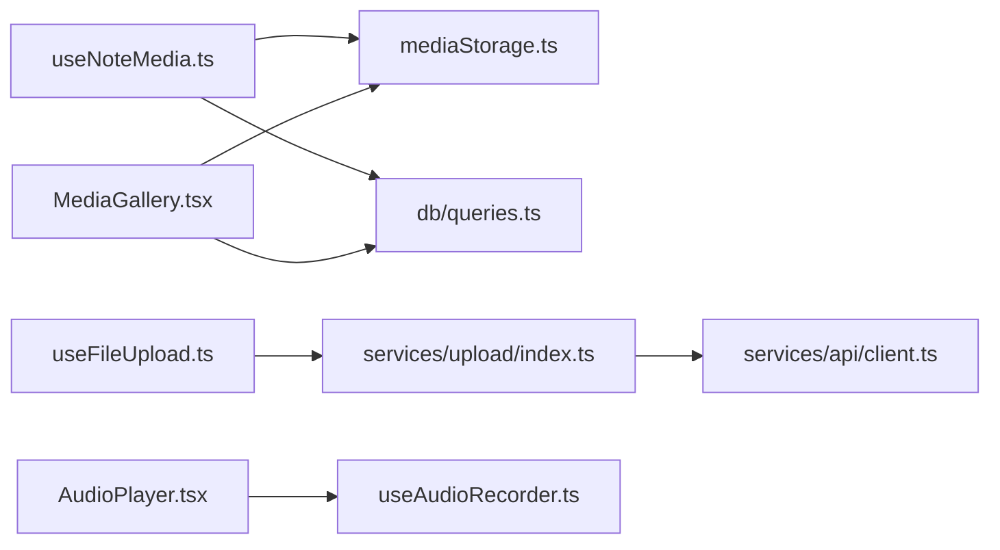

# 媒体存储

<cite>
**本文引用的文件**
- [services/mediaStorage.ts](file://services/mediaStorage.ts)
- [hooks/useMediaStorage.ts](file://hooks/useMediaStorage.ts)
- [db/schema/index.ts](file://db/schema/index.ts)
- [db/queries.ts](file://db/queries.ts)
- [services/upload/index.ts](file://services/upload/index.ts)
- [hooks/useFileUpload.ts](file://hooks/useFileUpload.ts)
- [hooks/useAudioRecorder.ts](file://hooks/useAudioRecorder.ts)
- [components/note/preview/MediaGallery.tsx](file://components/note/preview/MediaGallery.tsx)
- [hooks/useNoteMedia.ts](file://hooks/useNoteMedia.ts)
- [services/api/client.ts](file://services/api/client.ts)
- [app/recording/[id].tsx](file://app/recording/[id].tsx)
- [app/note/[id].tsx](file://app/note/[id].tsx)
- [components/audio/AudioPlayer.tsx](file://components/audio/AudioPlayer.tsx)
</cite>

## 目录
1. [简介](#简介)
2. [项目结构](#项目结构)
3. [核心组件](#核心组件)
4. [架构总览](#架构总览)
5. [详细组件分析](#详细组件分析)
6. [依赖关系分析](#依赖关系分析)
7. [性能考量](#性能考量)
8. [故障排查指南](#故障排查指南)
9. [结论](#结论)
10. [附录](#附录)

## 简介
本文件围绕媒体存储功能进行系统化技术文档整理，覆盖本地存储策略、云端同步机制、存储空间管理、文件上传流程（队列与并发）、断点续传能力现状与建议、下载与缓存机制、离线访问支持、元数据管理与索引、搜索支持、配置与使用示例路径、性能优化策略（压缩、传输、加密）以及安全性与备份恢复机制。本文所有分析均基于仓库现有实现与接口定义。

## 项目结构
媒体存储相关模块主要分布在以下区域：
- 本地存储与元数据：services/mediaStorage.ts、db/schema/index.ts、db/queries.ts
- 上传与进度：services/upload/index.ts、hooks/useFileUpload.ts
- 录音与播放：hooks/useAudioRecorder.ts、components/audio/AudioPlayer.tsx
- UI 展示与交互：components/note/preview/MediaGallery.tsx、hooks/useNoteMedia.ts
- API 客户端：services/api/client.ts
- 页面与示例：app/recording/[id].tsx、app/note/[id].tsx

图表来源
- [services/mediaStorage.ts:1-123](file://services/mediaStorage.ts#L1-L123)
- [db/queries.ts:1-286](file://db/queries.ts#L1-L286)
- [db/schema/index.ts:1-75](file://db/schema/index.ts#L1-L75)
- [services/upload/index.ts:1-130](file://services/upload/index.ts#L1-L130)
- [hooks/useFileUpload.ts:1-123](file://hooks/useFileUpload.ts#L1-L123)
- [services/api/client.ts:1-104](file://services/api/client.ts#L1-L104)
- [hooks/useAudioRecorder.ts:1-270](file://hooks/useAudioRecorder.ts#L1-L270)
- [components/audio/AudioPlayer.tsx:1-132](file://components/audio/AudioPlayer.tsx#L1-L132)
- [components/note/preview/MediaGallery.tsx:1-112](file://components/note/preview/MediaGallery.tsx#L1-L112)
- [hooks/useNoteMedia.ts:1-75](file://hooks/useNoteMedia.ts#L1-L75)
- [app/recording/[id].tsx:1-115](file://app/recording/[id].tsx#L1-L115)
- [app/note/[id].tsx:1-80](file://app/note/[id].tsx#L1-L80)

章节来源
- [services/mediaStorage.ts:1-123](file://services/mediaStorage.ts#L1-L123)
- [db/schema/index.ts:1-75](file://db/schema/index.ts#L1-L75)
- [db/queries.ts:1-286](file://db/queries.ts#L1-L286)
- [services/upload/index.ts:1-130](file://services/upload/index.ts#L1-L130)
- [hooks/useFileUpload.ts:1-123](file://hooks/useFileUpload.ts#L1-L123)
- [hooks/useAudioRecorder.ts:1-270](file://hooks/useAudioRecorder.ts#L1-L270)
- [components/note/preview/MediaGallery.tsx:1-112](file://components/note/preview/MediaGallery.tsx#L1-L112)
- [hooks/useNoteMedia.ts:1-75](file://hooks/useNoteMedia.ts#L1-L75)
- [services/api/client.ts:1-104](file://services/api/client.ts#L1-L104)
- [app/recording/[id].tsx:1-115](file://app/recording/[id].tsx#L1-L115)
- [app/note/[id].tsx:1-80](file://app/note/[id].tsx#L1-L80)

## 核心组件
- 本地媒体存储服务：负责本地目录创建、文件复制、URI 获取、删除、磁盘配额查询、孤儿文件清理。
- 媒体存储 Hook：封装加载状态、错误处理、保存/删除/获取配额/清理等操作。
- 数据库模型与查询：定义媒体文件、录音、同步队列等表结构，并提供增删查与统计查询。
- 文件上传服务：负责本地上传目录准备、文件读取、MIME 类型推断、调用后端接口上传、进度回调。
- 上传 Hook：统一管理上传状态、进度、错误与结果；支持单文件与多文件顺序上传。
- 录音与播放：录音权限、录制状态、播放状态、播放控制（播放/暂停/停止/跳转）。
- 媒体画廊与媒体管理：媒体缩略图展示、删除、添加附件入口；与本地存储和数据库联动。
- API 客户端：Axios 实例封装，请求/响应拦截器与错误处理。

章节来源
- [services/mediaStorage.ts:1-123](file://services/mediaStorage.ts#L1-L123)
- [hooks/useMediaStorage.ts:1-99](file://hooks/useMediaStorage.ts#L1-L99)
- [db/schema/index.ts:29-41](file://db/schema/index.ts#L29-L41)
- [db/queries.ts:94-133](file://db/queries.ts#L94-L133)
- [services/upload/index.ts:19-127](file://services/upload/index.ts#L19-L127)
- [hooks/useFileUpload.ts:13-122](file://hooks/useFileUpload.ts#L13-L122)
- [hooks/useAudioRecorder.ts:26-269](file://hooks/useAudioRecorder.ts#L26-L269)
- [components/note/preview/MediaGallery.tsx:23-90](file://components/note/preview/MediaGallery.tsx#L23-L90)
- [hooks/useNoteMedia.ts:14-74](file://hooks/useNoteMedia.ts#L14-L74)
- [services/api/client.ts:12-103](file://services/api/client.ts#L12-L103)

## 架构总览
媒体存储整体采用“本地文件系统 + SQLite 元数据 + 后端 API”的三层架构：
- 本地层：通过 Expo FileSystem 进行文件复制、删除、URI 生成与磁盘配额查询。
- 元数据层：Drizzle ORM 驱动的 SQLite 表，记录媒体文件、录音、同步队列等信息。
- 云端层：通过 API 客户端发起上传请求，当前实现为将文件以 Base64 形式上传。

图表来源
- [hooks/useNoteMedia.ts:14-74](file://hooks/useNoteMedia.ts#L14-L74)
- [services/mediaStorage.ts:22-36](file://services/mediaStorage.ts#L22-L36)
- [db/queries.ts:94-133](file://db/queries.ts#L94-L133)
- [services/upload/index.ts:29-66](file://services/upload/index.ts#L29-L66)
- [services/api/client.ts:81-99](file://services/api/client.ts#L81-L99)

## 详细组件分析

### 本地媒体存储服务（mediaStorage）
- 功能要点
  - 确保媒体目录存在并创建
  - 复制源文件到媒体目录，返回相对路径
  - 通过相对路径生成完整 URI
  - 删除指定媒体文件
  - 查询可用/总磁盘空间
  - 清理未被数据库引用的“孤儿”文件
- 关键复杂度
  - 目录扫描与集合差集：O(n+m)，n 为目录文件数，m 为数据库记录数
  - 删除失败日志：异常捕获并记录，不影响整体清理流程
- 错误处理
  - 目录不存在自动创建
  - 删除前检查文件是否存在
  - 清理过程对单个文件失败不中断

图表来源
- [services/mediaStorage.ts:10-114](file://services/mediaStorage.ts#L10-L114)

章节来源
- [services/mediaStorage.ts:10-114](file://services/mediaStorage.ts#L10-L114)

### 媒体存储 Hook（useMediaStorage）
- 功能要点
  - 封装保存、删除、获取 URI、查询配额、清理孤儿文件
  - 统一状态管理与错误国际化提示
- 使用场景
  - 笔记页面添加图片/文档
  - 删除媒体时同步删除本地文件与数据库记录
- 错误处理
  - 捕获异常并设置错误消息，支持 i18n 国际化键

章节来源
- [hooks/useMediaStorage.ts:15-98](file://hooks/useMediaStorage.ts#L15-L98)

### 数据库模型与查询（mediaFiles/recordings/syncQueue）
- 表结构要点
  - mediaFiles：媒体类型（image/video/document）、URI、缩略图、文件名、大小、MIME、尺寸、创建时间
  - recordings：关联 note、URI、时长、大小、MIME、创建时间
  - syncQueue：待同步实体、动作、负载、重试计数、最后错误
- 查询能力
  - 按 noteId 查询媒体/录音
  - 创建/删除媒体记录
  - 统计某组 note 的媒体数量
  - 同步队列的入队、标记成功/失败、查询待处理项

图表来源
- [db/schema/index.ts:19-41](file://db/schema/index.ts#L19-L41)
- [db/schema/index.ts:43-52](file://db/schema/index.ts#L43-L52)

章节来源
- [db/schema/index.ts:19-41](file://db/schema/index.ts#L19-L41)
- [db/schema/index.ts:43-52](file://db/schema/index.ts#L43-L52)
- [db/queries.ts:94-133](file://db/queries.ts#L94-L133)
- [db/queries.ts:135-164](file://db/queries.ts#L135-L164)

### 文件上传服务与 Hook（upload/index.ts、useFileUpload.ts）
- 上传流程
  - 准备本地上传目录
  - 读取文件信息与内容（Base64）
  - 推断 MIME 类型
  - 调用后端上传接口
  - 支持单文件与顺序批量上传
  - 进度回调按文件索引计算总体进度
- 并发与队列
  - 当前实现为顺序上传，未见内置并发池或断点续传
- 错误处理
  - 文件不存在、网络异常、后端错误均通过状态与 i18n 提示

图表来源
- [hooks/useFileUpload.ts:21-62](file://hooks/useFileUpload.ts#L21-L62)
- [services/upload/index.ts:29-66](file://services/upload/index.ts#L29-L66)
- [services/api/client.ts:81-99](file://services/api/client.ts#L81-L99)

章节来源
- [services/upload/index.ts:19-127](file://services/upload/index.ts#L19-L127)
- [hooks/useFileUpload.ts:13-122](file://hooks/useFileUpload.ts#L13-L122)

### 录音与播放（useAudioRecorder.ts、AudioPlayer.tsx）
- 录音
  - 权限申请、模式设置、实时时长更新、暂停/恢复/停止/取消
  - 停止后可获取文件 URI、时长、大小
- 播放
  - 加载、播放、暂停、停止、跳转
  - 实时播放位置与总时长更新
- UI
  - 播放器组件提供进度条、播放/暂停按钮、时间显示

图表来源
- [hooks/useAudioRecorder.ts:206-246](file://hooks/useAudioRecorder.ts#L206-L246)
- [components/audio/AudioPlayer.tsx:15-131](file://components/audio/AudioPlayer.tsx#L15-L131)

章节来源
- [hooks/useAudioRecorder.ts:26-269](file://hooks/useAudioRecorder.ts#L26-L269)
- [components/audio/AudioPlayer.tsx:1-132](file://components/audio/AudioPlayer.tsx#L1-L132)

### 媒体画廊与媒体管理（MediaGallery.tsx、useNoteMedia.ts）
- 媒体画廊
  - 横向列表展示录音缩略图与图片/文档缩略图
  - 支持播放录音、点击进入预览、删除媒体
- 媒体管理
  - 图库/文档选择器集成
  - 保存到本地并写入数据库
  - 删除媒体时同步删除本地文件与数据库记录

章节来源
- [components/note/preview/MediaGallery.tsx:23-90](file://components/note/preview/MediaGallery.tsx#L23-L90)
- [hooks/useNoteMedia.ts:14-74](file://hooks/useNoteMedia.ts#L14-L74)

### 页面示例（录音详情与笔记详情）
- 录音详情页：展示标题、时长、备注与时间戳
- 笔记详情页：展示类型、状态、内容与时间戳

章节来源
- [app/recording/[id].tsx:6-114](file://app/recording/[id].tsx#L6-L114)
- [app/note/[id].tsx:6-79](file://app/note/[id].tsx#L6-L79)

## 依赖关系分析
- 组件耦合
  - useNoteMedia 依赖 mediaStorage 与 mediaQueries
  - MediaGallery 依赖 mediaStorage 与 mediaQueries
  - useFileUpload 依赖 fileUploader
  - fileUploader 依赖 apiClient
- 外部依赖
  - Expo FileSystem/音频：录音、播放、文件系统操作
  - Drizzle ORM：SQLite 访问与查询
  - Axios：HTTP 请求封装

图表来源
- [hooks/useNoteMedia.ts:14-74](file://hooks/useNoteMedia.ts#L14-L74)
- [services/mediaStorage.ts:116-122](file://services/mediaStorage.ts#L116-L122)
- [db/queries.ts:94-133](file://db/queries.ts#L94-L133)
- [components/note/preview/MediaGallery.tsx:10](file://components/note/preview/MediaGallery.tsx#L10)
- [hooks/useFileUpload.ts:2](file://hooks/useFileUpload.ts#L2)
- [services/upload/index.ts:19-127](file://services/upload/index.ts#L19-L127)
- [services/api/client.ts:12-103](file://services/api/client.ts#L12-L103)
- [components/audio/AudioPlayer.tsx:15-28](file://components/audio/AudioPlayer.tsx#L15-L28)
- [hooks/useAudioRecorder.ts:26-46](file://hooks/useAudioRecorder.ts#L26-L46)

章节来源
- [hooks/useNoteMedia.ts:14-74](file://hooks/useNoteMedia.ts#L14-L74)
- [components/note/preview/MediaGallery.tsx:10](file://components/note/preview/MediaGallery.tsx#L10)
- [hooks/useFileUpload.ts:2](file://hooks/useFileUpload.ts#L2)
- [services/upload/index.ts:19-127](file://services/upload/index.ts#L19-L127)
- [services/api/client.ts:12-103](file://services/api/client.ts#L12-L103)
- [hooks/useAudioRecorder.ts:26-46](file://hooks/useAudioRecorder.ts#L26-L46)

## 性能考量
- 传输优化
  - 当前上传采用 Base64，会增加约 33% 体积与 CPU 开销；建议改为流式分块上传或二进制传输以降低内存占用与 CPU 压力
  - 批量上传为顺序执行，建议引入并发限制与任务队列（如固定并发数）提升吞吐
- 存储优化
  - 本地存储采用简单复制策略；建议在保存前进行格式校验与必要转换（如缩略图生成）
  - 清理孤儿文件为一次性全量扫描，建议定期任务与增量检测结合
- 缓存与离线
  - 本地仅做文件复制与 URI 映射，未见专用缓存层；可在应用层引入基于文件名的内存/磁盘缓存以减少重复读取
- 压缩与加密
  - 未见压缩/加密实现；如需传输安全，建议在客户端进行端到端加密并在上传前压缩以节省带宽
- 断点续传
  - 当前未实现断点续传；建议引入分片上传与服务端校验机制，结合本地进度记录实现断点续传

[本节为通用性能建议，不直接分析具体文件，故无章节来源]

## 故障排查指南
- 上传失败
  - 检查文件是否存在与可读
  - 查看网络状态与后端响应
  - 参考上传 Hook 的错误处理与 i18n 提示
- 无法播放录音
  - 确认录音器权限与模式设置
  - 检查播放器源 URI 是否正确
- 本地文件删除但数据库未更新
  - 使用清理孤儿文件功能或手动同步数据库
- 磁盘空间不足
  - 通过配额查询确认剩余空间，清理无用文件

章节来源
- [hooks/useFileUpload.ts:52-61](file://hooks/useFileUpload.ts#L52-L61)
- [hooks/useAudioRecorder.ts:74-109](file://hooks/useAudioRecorder.ts#L74-L109)
- [services/mediaStorage.ts:64-74](file://services/mediaStorage.ts#L64-L74)
- [services/mediaStorage.ts:80-114](file://services/mediaStorage.ts#L80-L114)

## 结论
该媒体存储方案以本地文件系统与 SQLite 元数据为核心，配合简单的上传流程与录音播放能力，满足基础的媒体管理需求。当前实现偏向简单直接，具备良好的扩展性：可通过引入并发上传、断点续传、缓存与压缩、端到端加密等机制进一步提升性能与可靠性。同时，建议完善搜索与索引能力，以支撑更大规模的媒体数据管理。

[本节为总结性内容，不直接分析具体文件，故无章节来源]

## 附录

### 配置与使用示例（代码片段路径）
- 保存媒体文件
  - [hooks/useNoteMedia.ts:24-35](file://hooks/useNoteMedia.ts#L24-L35)
  - [services/mediaStorage.ts:22-36](file://services/mediaStorage.ts#L22-L36)
- 获取媒体 URI
  - [components/note/preview/MediaGallery.tsx:58](file://components/note/preview/MediaGallery.tsx#L58)
  - [services/mediaStorage.ts:43-46](file://services/mediaStorage.ts#L43-L46)
- 删除媒体文件
  - [hooks/useNoteMedia.ts:62-67](file://hooks/useNoteMedia.ts#L62-L67)
  - [services/mediaStorage.ts:52-58](file://services/mediaStorage.ts#L52-L58)
- 查询存储配额
  - [hooks/useMediaStorage.ts:56-68](file://hooks/useMediaStorage.ts#L56-L68)
  - [services/mediaStorage.ts:64-74](file://services/mediaStorage.ts#L64-L74)
- 清理孤儿文件
  - [hooks/useMediaStorage.ts:70-83](file://hooks/useMediaStorage.ts#L70-L83)
  - [services/mediaStorage.ts:80-114](file://services/mediaStorage.ts#L80-L114)
- 单文件上传
  - [hooks/useFileUpload.ts:21-62](file://hooks/useFileUpload.ts#L21-L62)
  - [services/upload/index.ts:29-66](file://services/upload/index.ts#L29-L66)
- 批量上传
  - [hooks/useFileUpload.ts:64-105](file://hooks/useFileUpload.ts#L64-L105)
  - [services/upload/index.ts:68-84](file://services/upload/index.ts#L68-L84)
- 录音与播放
  - [hooks/useAudioRecorder.ts:79-175](file://hooks/useAudioRecorder.ts#L79-L175)
  - [components/audio/AudioPlayer.tsx:15-131](file://components/audio/AudioPlayer.tsx#L15-L131)
- 页面示例
  - [app/recording/[id].tsx:6-114](file://app/recording/[id].tsx#L6-L114)
  - [app/note/[id].tsx:6-79](file://app/note/[id].tsx#L6-L79)

### 安全性与备份恢复
- 安全性
  - 传输：当前上传为 Base64，建议启用 HTTPS 与端到端加密
  - 存储：本地文件未加密，建议对敏感媒体进行加密存储
- 备份与恢复
  - 本地文件与数据库分离，建议制定定期备份策略
  - 恢复时需保证数据库与文件系统一致性，可借助清理孤儿文件功能进行修复

[本节为通用安全与备份建议，不直接分析具体文件，故无章节来源]