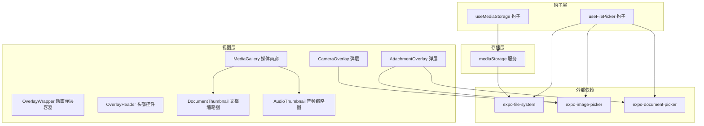
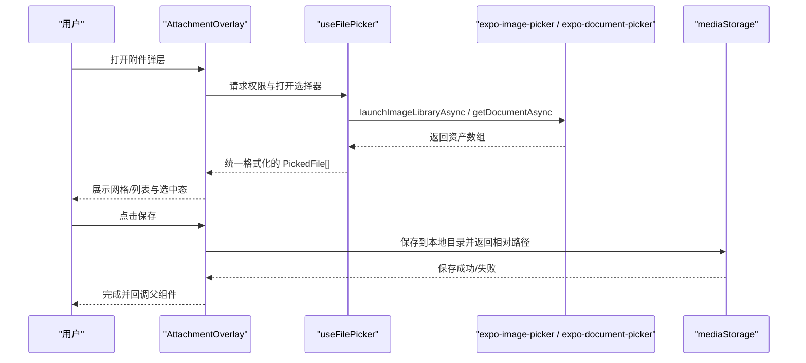
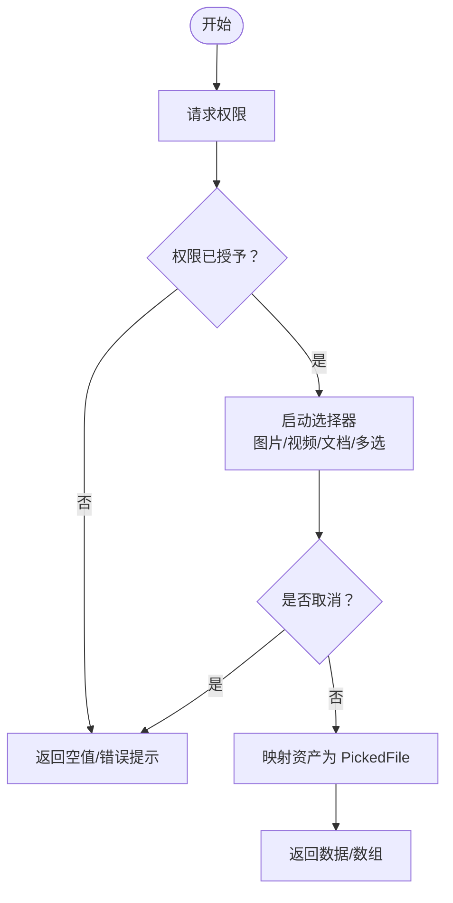
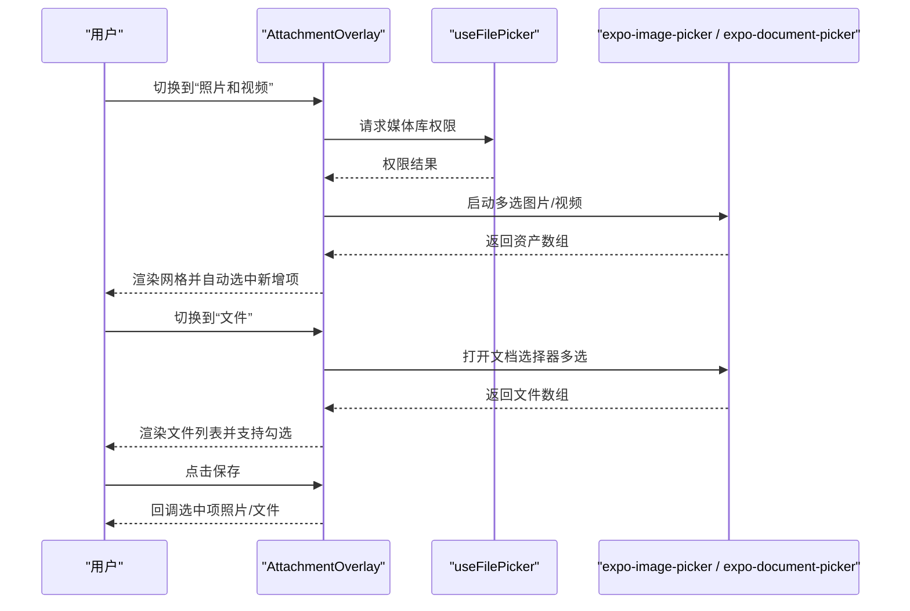
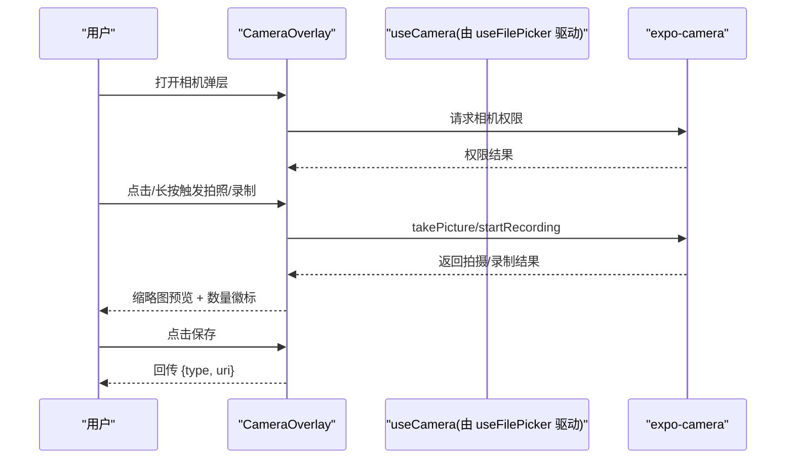
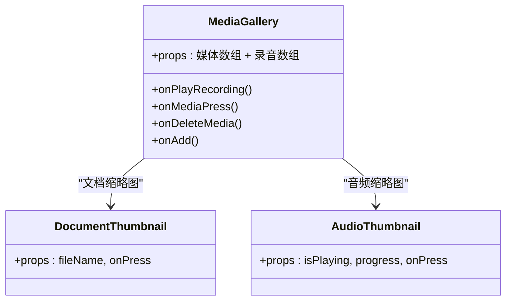
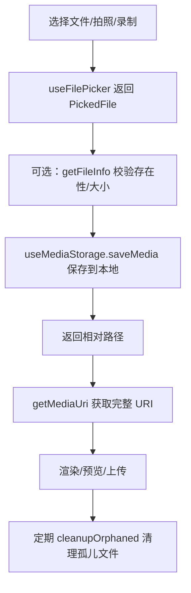
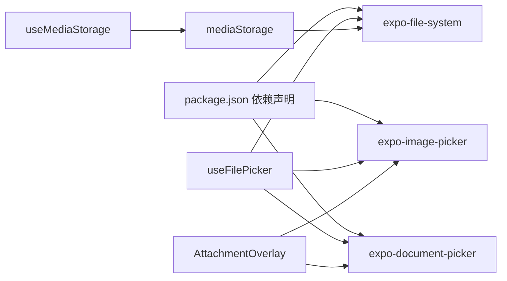

# 文件选择器

<cite>
**本文引用的文件**
- [useFilePicker.ts](file://hooks/useFilePicker.ts)
- [AttachmentOverlay.tsx](file://components/input/AttachmentOverlay.tsx)
- [CameraOverlay.tsx](file://components/input/CameraOverlay.tsx)
- [OverlayWrapper.tsx](file://components/input/OverlayWrapper.tsx)
- [OverlayHeader.tsx](file://components/input/OverlayHeader.tsx)
- [MediaGallery.tsx](file://components/note/preview/MediaGallery.tsx)
- [DocumentThumbnail.tsx](file://components/note/preview/DocumentThumbnail.tsx)
- [AudioThumbnail.tsx](file://components/note/preview/AudioThumbnail.tsx)
- [useMediaStorage.ts](file://hooks/useMediaStorage.ts)
- [mediaStorage.ts](file://services/mediaStorage.ts)
- [attachment.json](file://i18n/locales/zh-CN/attachment.json)
- [camera.json](file://i18n/locales/zh-CN/camera.json)
- [package.json](file://package.json)
</cite>

## 目录
1. [简介](#简介)
2. [项目结构](#项目结构)
3. [核心组件](#核心组件)
4. [架构总览](#架构总览)
5. [详细组件分析](#详细组件分析)
6. [依赖关系分析](#依赖关系分析)
7. [性能考虑](#性能考虑)
8. [故障排查指南](#故障排查指南)
9. [结论](#结论)
10. [附录](#附录)

## 简介
本文件面向“文件选择器”功能，系统性梳理了从文件选择、多文件与媒体选择、权限与类型过滤、到文件预览与临时存储的完整实现路径。文档覆盖以下关键主题：
- 文件类型过滤与多文件选择支持（图片、视频、文档）
- 文件大小与时长限制策略
- 文件预览：图片缩略图、视频预览、文档图标与扩展名识别
- 用户交互设计：弹层布局、操作反馈、进度指示
- 文件处理流程：读取、格式校验、本地临时存储与清理
- 性能优化：异步加载、缓存与内存控制
- 错误处理与用户体验优化建议

## 项目结构
围绕文件选择器的关键模块分布如下：
- 钩子层：提供统一的文件选择能力与状态管理
- 视图层：弹层组件负责交互与预览
- 存储层：封装本地文件系统与数据库引用关系
- 国际化：提供多语言文案支撑

图表来源
- [useFilePicker.ts:1-275](file://hooks/useFilePicker.ts#L1-L275)
- [AttachmentOverlay.tsx:1-441](file://components/input/AttachmentOverlay.tsx#L1-L441)
- [CameraOverlay.tsx:1-579](file://components/input/CameraOverlay.tsx#L1-L579)
- [OverlayWrapper.tsx:1-77](file://components/input/OverlayWrapper.tsx#L1-L77)
- [OverlayHeader.tsx:1-79](file://components/input/OverlayHeader.tsx#L1-L79)
- [MediaGallery.tsx:1-112](file://components/note/preview/MediaGallery.tsx#L1-L112)
- [DocumentThumbnail.tsx:1-60](file://components/note/preview/DocumentThumbnail.tsx#L1-L60)
- [AudioThumbnail.tsx:1-53](file://components/note/preview/AudioThumbnail.tsx#L1-L53)
- [useMediaStorage.ts:1-99](file://hooks/useMediaStorage.ts#L1-L99)
- [mediaStorage.ts:1-123](file://services/mediaStorage.ts#L1-L123)

章节来源
- [useFilePicker.ts:1-275](file://hooks/useFilePicker.ts#L1-L275)
- [AttachmentOverlay.tsx:1-441](file://components/input/AttachmentOverlay.tsx#L1-L441)
- [CameraOverlay.tsx:1-579](file://components/input/CameraOverlay.tsx#L1-L579)
- [OverlayWrapper.tsx:1-77](file://components/input/OverlayWrapper.tsx#L1-L77)
- [OverlayHeader.tsx:1-79](file://components/input/OverlayHeader.tsx#L1-L79)
- [MediaGallery.tsx:1-112](file://components/note/preview/MediaGallery.tsx#L1-L112)
- [DocumentThumbnail.tsx:1-60](file://components/note/preview/DocumentThumbnail.tsx#L1-L60)
- [AudioThumbnail.tsx:1-53](file://components/note/preview/AudioThumbnail.tsx#L1-L53)
- [useMediaStorage.ts:1-99](file://hooks/useMediaStorage.ts#L1-L99)
- [mediaStorage.ts:1-123](file://services/mediaStorage.ts#L1-L123)

## 核心组件
- useFilePicker 钩子：提供统一的文件选择 API，涵盖图片库、视频库、相机拍照、相机录像、文档选择以及多选能力；同时提供文件信息查询。
- AttachmentOverlay 弹层：提供“照片/视频”与“文件”双标签页，支持网格选择与列表选择，提供选中态反馈与保存回调。
- CameraOverlay 弹层：提供相机拍摄与录制能力，支持长按录制、计时、缩略图预览与保存。
- useMediaStorage 钩子与 mediaStorage 服务：封装本地媒体文件的保存、删除、URI 获取与配额查询，并提供孤儿文件清理。
- 预览组件：MediaGallery 汇总媒体与录音；DocumentThumbnail 与 AudioThumbnail 分别用于文档与音频缩略图。

章节来源
- [useFilePicker.ts:18-275](file://hooks/useFilePicker.ts#L18-L275)
- [AttachmentOverlay.tsx:68-279](file://components/input/AttachmentOverlay.tsx#L68-L279)
- [CameraOverlay.tsx:43-349](file://components/input/CameraOverlay.tsx#L43-L349)
- [useMediaStorage.ts:15-98](file://hooks/useMediaStorage.ts#L15-L98)
- [mediaStorage.ts:22-122](file://services/mediaStorage.ts#L22-L122)
- [MediaGallery.tsx:23-90](file://components/note/preview/MediaGallery.tsx#L23-L90)
- [DocumentThumbnail.tsx:31-45](file://components/note/preview/DocumentThumbnail.tsx#L31-L45)
- [AudioThumbnail.tsx:12-32](file://components/note/preview/AudioThumbnail.tsx#L12-L32)

## 架构总览
文件选择器采用“钩子 + 弹层 + 服务”的分层架构：
- 钩子层负责权限请求、调用原生选择器、聚合结果并暴露统一接口
- 视图层负责 UI 交互、选中态管理与预览渲染
- 存储层负责本地文件系统操作与数据库引用一致性

图表来源
- [AttachmentOverlay.tsx:88-139](file://components/input/AttachmentOverlay.tsx#L88-L139)
- [useFilePicker.ts:22-251](file://hooks/useFilePicker.ts#L22-L251)
- [mediaStorage.ts:22-36](file://services/mediaStorage.ts#L22-L36)

## 详细组件分析

### useFilePicker 钩子：文件选择与多选
- 能力范围
  - 图片选择：带裁剪、固定宽高比、质量参数
  - 视频选择：最大时长限制、质量参数
  - 相机拍照/录像：权限请求、最大时长限制
  - 文档选择：支持复制到缓存目录
  - 多选图片：批量返回资产
  - 文件信息查询：基于 URI 查询存在性与大小
- 关键点
  - 权限前置：在调用前请求媒体库或相机权限
  - 统一返回结构：PickedFile 包含 uri、name、size、mimeType、type、尺寸/时长等
  - 错误捕获：统一 try/catch 并记录日志，最终关闭选择器状态
- 限制与扩展
  - 视频默认最大时长为 5 分钟（可按需调整）
  - 多选图片返回数组，便于批量处理
  - 可通过修改原生参数扩展更多过滤条件（如 MIME 白名单）

图表来源
- [useFilePicker.ts:22-251](file://hooks/useFilePicker.ts#L22-L251)

章节来源
- [useFilePicker.ts:18-275](file://hooks/useFilePicker.ts#L18-L275)

### AttachmentOverlay 弹层：多类型文件选择与预览
- 布局与交互
  - 双标签页：“照片和视频”（网格 + “+ 添加”入口）、“文件”（列表 + “浏览文件”入口）
  - 网格：三列等比缩略图，支持多选勾选
  - 列表：文件图标根据 MIME 类型映射，显示名称与大小
  - 顶部头部：标题、取消、保存按钮（保存标签动态显示选中数量）
- 选择逻辑
  - 照片/视频：多选，自动选中新加入的条目
  - 文件：多选，支持批量勾选
  - 保存：合并两类选中项，回调父组件
- 预览与反馈
  - 选中态：遮罩 + 对勾边框
  - 保存按钮禁用态：无选中项时禁用
  - 国际化文案：来自 attachment.json

图表来源
- [AttachmentOverlay.tsx:88-139](file://components/input/AttachmentOverlay.tsx#L88-L139)
- [AttachmentOverlay.tsx:159-166](file://components/input/AttachmentOverlay.tsx#L159-L166)
- [attachment.json:1-12](file://i18n/locales/zh-CN/attachment.json#L1-L12)

章节来源
- [AttachmentOverlay.tsx:68-279](file://components/input/AttachmentOverlay.tsx#L68-L279)
- [OverlayWrapper.tsx:20-54](file://components/input/OverlayWrapper.tsx#L20-L54)
- [OverlayHeader.tsx:13-41](file://components/input/OverlayHeader.tsx#L13-L41)
- [attachment.json:1-12](file://i18n/locales/zh-CN/attachment.json#L1-L12)

### CameraOverlay 弹层：相机拍摄与录制
- 能力与交互
  - 支持拍照与长按录制视频，录制时显示倒计时与脉冲红点
  - 缩略图预览区展示最近一次拍摄/录制结果，支持叠加数量徽标
  - 保存按钮显示当前已捕获数量
- 状态与动画
  - 使用 reanimated 实现弹层入场/出场动画、闪光效果、录制脉冲
  - 自动请求权限并在无权限时展示引导
- 保存与回传
  - 保存时以首个捕获项为主，回传类型与 URI

图表来源
- [CameraOverlay.tsx:43-349](file://components/input/CameraOverlay.tsx#L43-L349)
- [camera.json:1-14](file://i18n/locales/zh-CN/camera.json#L1-L14)

章节来源
- [CameraOverlay.tsx:43-349](file://components/input/CameraOverlay.tsx#L43-L349)
- [camera.json:1-14](file://i18n/locales/zh-CN/camera.json#L1-L14)

### 预览组件：图片缩略图、文档图标与音频缩略图
- MediaGallery：横向滚动展示录音与媒体，支持删除与添加
- DocumentThumbnail：根据扩展名映射颜色与图标，显示扩展名与文件名
- AudioThumbnail：渐变背景 + 播放/暂停按钮，支持播放进度条

图表来源
- [MediaGallery.tsx:23-90](file://components/note/preview/MediaGallery.tsx#L23-L90)
- [DocumentThumbnail.tsx:31-45](file://components/note/preview/DocumentThumbnail.tsx#L31-L45)
- [AudioThumbnail.tsx:12-32](file://components/note/preview/AudioThumbnail.tsx#L12-L32)

章节来源
- [MediaGallery.tsx:23-90](file://components/note/preview/MediaGallery.tsx#L23-L90)
- [DocumentThumbnail.tsx:31-45](file://components/note/preview/DocumentThumbnail.tsx#L31-L45)
- [AudioThumbnail.tsx:12-32](file://components/note/preview/AudioThumbnail.tsx#L12-L32)

### 文件处理流程：读取、格式验证、临时存储
- 读取与格式验证
  - 通过 useFilePicker 返回的 PickedFile 结构进行二次校验（如 MIME、尺寸/时长）
  - 可结合 getFileInfo 进一步确认文件存在性与大小
- 临时存储
  - 通过 useMediaStorage/saveMedia 将文件复制到本地媒体目录，返回相对路径
  - 通过 getMediaUri 获取完整 URI 供渲染使用
- 清理与配额
  - 提供 getStorageQuota 查询磁盘配额
  - cleanupOrphaned 清理数据库未引用的本地文件

图表来源
- [useFilePicker.ts:254-262](file://hooks/useFilePicker.ts#L254-L262)
- [useMediaStorage.ts:21-36](file://hooks/useMediaStorage.ts#L21-L36)
- [mediaStorage.ts:22-46](file://services/mediaStorage.ts#L22-L46)
- [mediaStorage.ts:80-114](file://services/mediaStorage.ts#L80-L114)

章节来源
- [useFilePicker.ts:254-262](file://hooks/useFilePicker.ts#L254-L262)
- [useMediaStorage.ts:15-98](file://hooks/useMediaStorage.ts#L15-L98)
- [mediaStorage.ts:22-114](file://services/mediaStorage.ts#L22-L114)

## 依赖关系分析
- 外部依赖
  - expo-image-picker：图片/视频选择与相机调用
  - expo-document-picker：文档选择
  - expo-file-system：文件读写、目录管理、URI 构造
- 内部依赖
  - 钩子层依赖外部原生能力
  - 视图层依赖钩子层提供的状态与回调
  - 存储层依赖数据库引用与文件系统

图表来源
- [package.json:32-46](file://package.json#L32-L46)
- [useFilePicker.ts:1-6](file://hooks/useFilePicker.ts#L1-L6)
- [useMediaStorage.ts:1-4](file://hooks/useMediaStorage.ts#L1-L4)
- [mediaStorage.ts:1](file://services/mediaStorage.ts#L1)

章节来源
- [package.json:20-62](file://package.json#L20-L62)
- [useFilePicker.ts:1-6](file://hooks/useFilePicker.ts#L1-L6)
- [useMediaStorage.ts:1-4](file://hooks/useMediaStorage.ts#L1-L4)
- [mediaStorage.ts:1](file://services/mediaStorage.ts#L1)

## 性能考虑
- 异步加载与并发
  - 选择器调用均为异步，避免阻塞主线程
  - 多选场景下批量映射资产，减少重复 IO
- 缓存与内存控制
  - 文档选择启用 copyToCacheDirectory，降低大文件直接访问风险
  - 预览缩略图使用固定尺寸，避免超大图片占用内存
- UI 流畅度
  - 弹层使用 reanimated 动画，保证滑入滑出顺滑
  - FlatList/Grid 列表渲染，仅渲染可见项
- 存储与清理
  - 定期执行 cleanupOrphaned，释放磁盘空间
  - 通过 getStorageQuota 提前感知配额，避免频繁失败

[本节为通用性能建议，不直接分析具体文件，故无章节来源]

## 故障排查指南
- 权限问题
  - 症状：无法打开相册/相机或返回空结果
  - 排查：确认权限请求流程是否被调用；检查权限状态
  - 参考
    - [useFilePicker.ts:26-29](file://hooks/useFilePicker.ts#L26-L29)
    - [useFilePicker.ts:67-70](file://hooks/useFilePicker.ts#L67-L70)
    - [CameraOverlay.tsx:111-115](file://components/input/CameraOverlay.tsx#L111-L115)
- 选择器取消或无结果
  - 症状：返回 canceled 或空数组
  - 排查：确认调用方是否正确处理取消分支
  - 参考
    - [useFilePicker.ts:38-40](file://hooks/useFilePicker.ts#L38-L40)
    - [AttachmentOverlay.tsx:97-98](file://components/input/AttachmentOverlay.tsx#L97-L98)
- 文件过大或时长超限
  - 症状：视频录制/选择失败或被截断
  - 排查：检查 videoMaxDuration 与质量设置；必要时在 UI 提示限制
  - 参考
    - [useFilePicker.ts:75](file://hooks/useFilePicker.ts#L75)
    - [useFilePicker.ts:157](file://hooks/useFilePicker.ts#L157)
- 本地存储异常
  - 症状：保存失败、无法读取
  - 排查：确认媒体目录是否存在、磁盘配额是否充足；查看错误状态
  - 参考
    - [mediaStorage.ts:10-14](file://services/mediaStorage.ts#L10-L14)
    - [useMediaStorage.ts:25-33](file://hooks/useMediaStorage.ts#L25-L33)
- 预览空白或加载慢
  - 症状：缩略图不显示或延迟明显
  - 排查：确认 getMediaUri 是否正确；检查 FlatList 渲染项是否过多
  - 参考
    - [mediaStorage.ts:43-46](file://services/mediaStorage.ts#L43-L46)
    - [MediaGallery.tsx:57-59](file://components/note/preview/MediaGallery.tsx#L57-L59)

章节来源
- [useFilePicker.ts:26-29](file://hooks/useFilePicker.ts#L26-L29)
- [useFilePicker.ts:67-70](file://hooks/useFilePicker.ts#L67-L70)
- [useFilePicker.ts:38-40](file://hooks/useFilePicker.ts#L38-L40)
- [AttachmentOverlay.tsx:97-98](file://components/input/AttachmentOverlay.tsx#L97-L98)
- [useFilePicker.ts:75](file://hooks/useFilePicker.ts#L75)
- [useFilePicker.ts:157](file://hooks/useFilePicker.ts#L157)
- [mediaStorage.ts:10-14](file://services/mediaStorage.ts#L10-L14)
- [useMediaStorage.ts:25-33](file://hooks/useMediaStorage.ts#L25-L33)
- [mediaStorage.ts:43-46](file://services/mediaStorage.ts#L43-L46)
- [MediaGallery.tsx:57-59](file://components/note/preview/MediaGallery.tsx#L57-L59)

## 结论
该文件选择器以 useFilePicker 为核心，结合 AttachmentOverlay 与 CameraOverlay 提供了完善的多类型文件选择体验；配合 useMediaStorage 与 mediaStorage 服务实现了安全可靠的本地存储与清理。整体架构清晰、交互流畅、具备良好的扩展性与可维护性。后续可在以下方面持续优化：
- 增加 MIME 白名单与文件大小上限配置
- 在 UI 中增加进度与错误提示
- 对大文件场景引入分块上传与断点续传（在上传阶段）

[本节为总结性内容，不直接分析具体文件，故无章节来源]

## 附录
- 国际化资源
  - 附件弹层文案：[attachment.json](file://i18n/locales/zh-CN/attachment.json)
  - 相机弹层文案：[camera.json](file://i18n/locales/zh-CN/camera.json)
- 外部依赖版本参考
  - [package.json:32-46](file://package.json#L32-L46)

[本节为补充信息，不直接分析具体文件，故无章节来源]