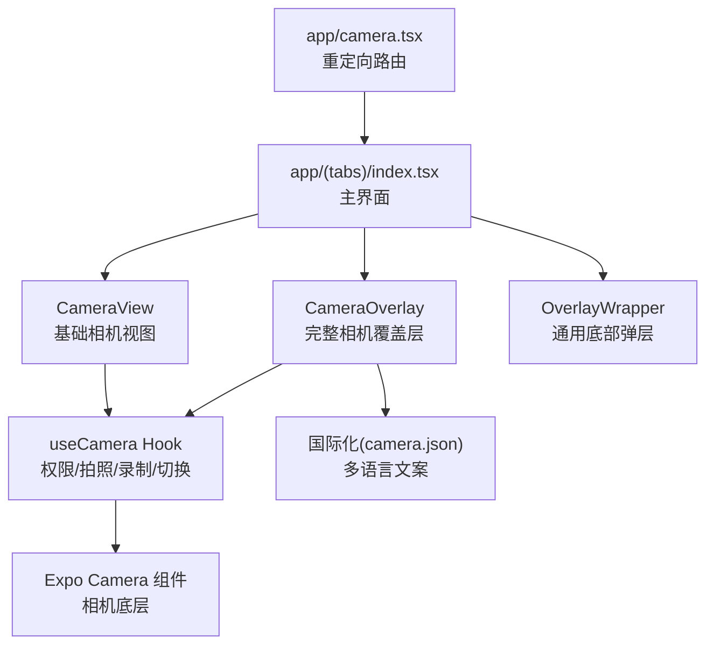
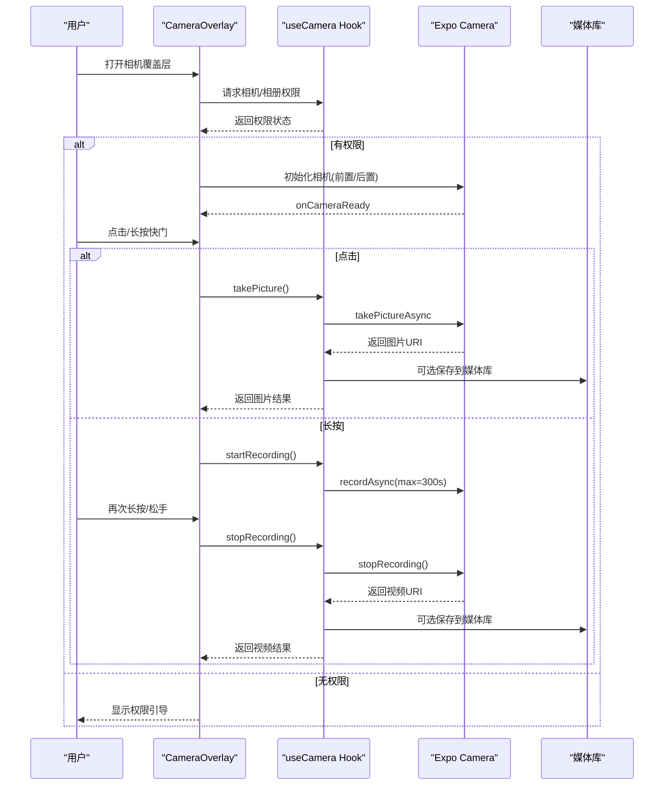
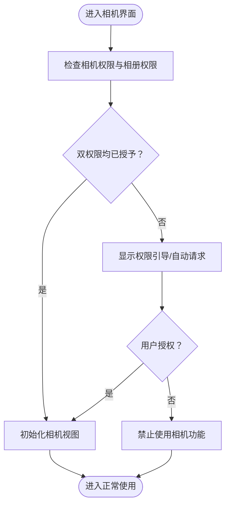
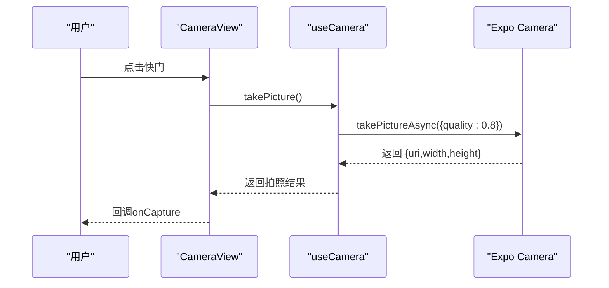
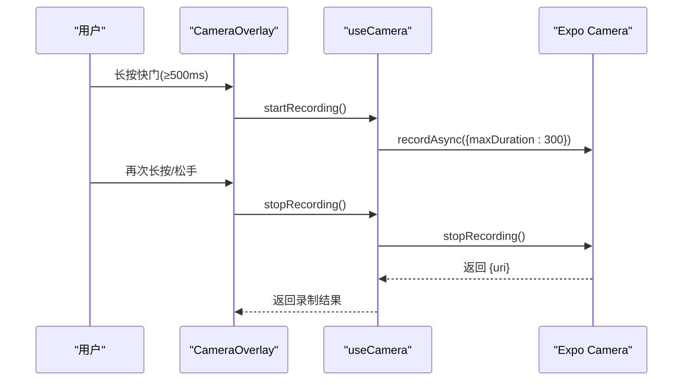
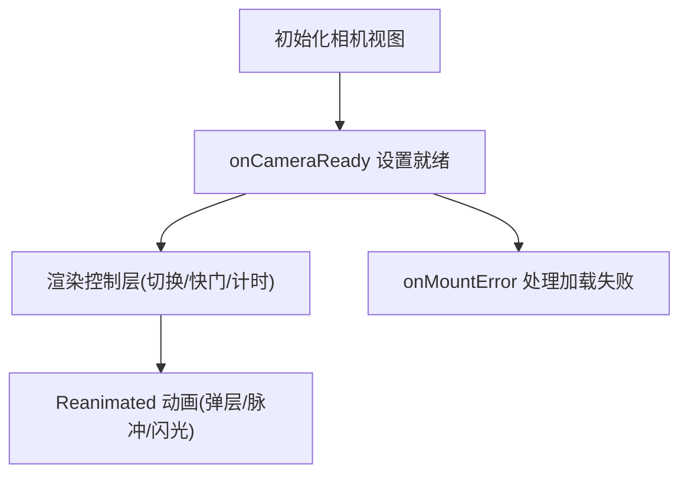
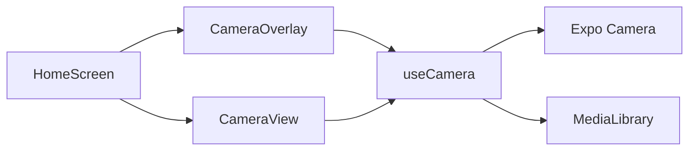

# 相机集成

<cite>
**本文档引用的文件**
- [app/camera.tsx](file://app/camera.tsx)
- [components/camera/CameraView.tsx](file://components/camera/CameraView.tsx)
- [hooks/useCamera.ts](file://hooks/useCamera.ts)
- [components/input/CameraOverlay.tsx](file://components/input/CameraOverlay.tsx)
- [app/(tabs)/index.tsx](file://app/(tabs)/index.tsx)
- [i18n/locales/zh-CN/camera.json](file://i18n/locales/zh-CN/camera.json)
- [i18n/locales/en/camera.json](file://i18n/locales/en/camera.json)
- [app.json](file://app.json)
- [package.json](file://package.json)
- [components/input/RecordButton.tsx](file://components/input/RecordButton.tsx)
- [components/input/RecordingOverlay.tsx](file://components/input/RecordingOverlay.tsx)
- [components/input/OverlayWrapper.tsx](file://components/input/OverlayWrapper.tsx)
</cite>

## 目录
1. [简介](#简介)
2. [项目结构](#项目结构)
3. [核心组件](#核心组件)
4. [架构总览](#架构总览)
5. [详细组件分析](#详细组件分析)
6. [依赖关系分析](#依赖关系分析)
7. [性能考虑](#性能考虑)
8. [故障排除指南](#故障排除指南)
9. [结论](#结论)

## 简介
本文件面向“相机集成”功能，系统性梳理权限管理、拍照与视频录制、相机预览与交互、以及性能优化与故障排除策略。文档基于实际代码实现进行分析，并提供可操作的调用与配置参考路径，帮助开发者快速理解与扩展相机能力。

## 项目结构
围绕相机功能的关键文件分布如下：
- 路由与入口：app/camera.tsx 提供重定向至主界面路由
- 相机组件：components/camera/CameraView.tsx 提供基础相机视图与控制
- 权限与录制逻辑：hooks/useCamera.ts 提供权限请求、拍照、录制、前后置切换等核心逻辑
- 底部弹层相机：components/input/CameraOverlay.tsx 提供完整的拍照/录像交互体验（含长按录制、闪光动画、计时）
- 主界面集成：app/(tabs)/index.tsx 将相机覆盖层接入主界面导航
- 国际化：i18n/locales/zh-CN/camera.json 与 i18n/locales/en/camera.json 提供多语言文案
- 配置与权限声明：app.json 中声明相机、相册、媒体库等权限
- 其他辅助：package.json 展示依赖；components/input/RecordButton.tsx 提供录制按钮动画；components/input/RecordingOverlay.tsx 用于语音录制覆盖层；components/input/OverlayWrapper.tsx 提供通用底部弹层封装

图表来源
- [app/camera.tsx:1-6](file://app/camera.tsx#L1-L6)
- [app/(tabs)/index.tsx:390-394](file://app/(tabs)/index.tsx#L390-L394)
- [components/input/CameraOverlay.tsx:43-57](file://components/input/CameraOverlay.tsx#L43-L57)
- [components/camera/CameraView.tsx:14-30](file://components/camera/CameraView.tsx#L14-L30)
- [hooks/useCamera.ts:13-114](file://hooks/useCamera.ts#L13-L114)
- [i18n/locales/zh-CN/camera.json:1-14](file://i18n/locales/zh-CN/camera.json#L1-L14)
- [components/input/OverlayWrapper.tsx:20-54](file://components/input/OverlayWrapper.tsx#L20-L54)

章节来源
- [app/camera.tsx:1-6](file://app/camera.tsx#L1-L6)
- [app/(tabs)/index.tsx:390-394](file://app/(tabs)/index.tsx#L390-L394)
- [components/input/CameraOverlay.tsx:43-57](file://components/input/CameraOverlay.tsx#L43-L57)
- [components/camera/CameraView.tsx:14-30](file://components/camera/CameraView.tsx#L14-L30)
- [hooks/useCamera.ts:13-114](file://hooks/useCamera.ts#L13-L114)
- [i18n/locales/zh-CN/camera.json:1-14](file://i18n/locales/zh-CN/camera.json#L1-L14)
- [components/input/OverlayWrapper.tsx:20-54](file://components/input/OverlayWrapper.tsx#L20-L54)

## 核心组件
- 相机权限与录制逻辑：hooks/useCamera.ts
  - 提供权限状态、媒体库权限、相机就绪状态、录制状态、前置/后置摄像头方向
  - 暴露拍照、开始录制、停止录制、切换摄像头、请求权限等方法
  - 录制使用 Promise 引用模式管理最长录制时长（默认 5 分钟）
- 基础相机视图：components/camera/CameraView.tsx
  - 包装 Expo Camera 视图，提供拍照/录像模式切换、前置/后置切换、快门按钮
  - 在无权限时显示引导页面
- 完整相机覆盖层：components/input/CameraOverlay.tsx
  - 集成长按录制、闪光动画、倒计时、缩略图预览、权限请求
  - 使用 Reanimated 实现弹层动画、录制脉冲效果、闪光效果
- 主界面集成：app/(tabs)/index.tsx
  - 通过 Zustand 状态管理打开/关闭相机覆盖层
  - 保存相机产物到笔记（照片/视频）

章节来源
- [hooks/useCamera.ts:13-114](file://hooks/useCamera.ts#L13-L114)
- [components/camera/CameraView.tsx:14-139](file://components/camera/CameraView.tsx#L14-L139)
- [components/input/CameraOverlay.tsx:43-349](file://components/input/CameraOverlay.tsx#L43-L349)
- [app/(tabs)/index.tsx:390-394](file://app/(tabs)/index.tsx#L390-L394)

## 架构总览
相机功能采用“Hook 抽象 + 组合 UI”的分层设计：
- Hook 层：集中处理权限、设备状态、录制生命周期
- 视图层：提供基础相机视图与完整覆盖层两种形态
- 集成层：在主界面以覆盖层形式弹出，统一状态管理与保存流程

图表来源
- [components/input/CameraOverlay.tsx:111-215](file://components/input/CameraOverlay.tsx#L111-L215)
- [hooks/useCamera.ts:26-90](file://hooks/useCamera.ts#L26-L90)
- [components/camera/CameraView.tsx:32-45](file://components/camera/CameraView.tsx#L32-L45)

## 详细组件分析

### 权限管理机制
- 相机权限与相册权限分别请求，最终以“双权限均授予”作为 hasPermission 判定
- 支持动态请求权限与回退到引导页
- app.json 中声明了相机、相册读取、媒体库写入等权限，确保构建期配置正确

图表来源
- [hooks/useCamera.ts:14-15](file://hooks/useCamera.ts#L14-L15)
- [hooks/useCamera.ts:92-96](file://hooks/useCamera.ts#L92-L96)
- [components/camera/CameraView.tsx:47-78](file://components/camera/CameraView.tsx#L47-L78)
- [app.json:55-82](file://app.json#L55-L82)

章节来源
- [hooks/useCamera.ts:14-15](file://hooks/useCamera.ts#L14-L15)
- [hooks/useCamera.ts:92-96](file://hooks/useCamera.ts#L92-L96)
- [components/camera/CameraView.tsx:47-78](file://components/camera/CameraView.tsx#L47-L78)
- [app.json:55-82](file://app.json#L55-L82)

### 拍照控制与前置/后置切换
- 拍照：takePictureAsync 设置质量、是否返回 base64、是否跳过预处理
- 前后置切换：toggleFacing 切换 CameraType
- 快门按钮：支持拍照模式下的圆形快门，录制模式下显示录制内核

图表来源
- [components/camera/CameraView.tsx:32-45](file://components/camera/CameraView.tsx#L32-L45)
- [hooks/useCamera.ts:26-57](file://hooks/useCamera.ts#L26-L57)

章节来源
- [components/camera/CameraView.tsx:101-130](file://components/camera/CameraView.tsx#L101-L130)
- [hooks/useCamera.ts:22-24](file://hooks/useCamera.ts#L22-L24)
- [hooks/useCamera.ts:26-57](file://hooks/useCamera.ts#L26-L57)

### 视频录制功能
- 启动录制：startRecording 创建 recordAsync Promise，设置最长录制时长为 300 秒
- 停止录制：stopRecording 触发 stopRecording 并等待 Promise 解析，返回视频 URI
- 录制状态管理：isRecording 控制 UI 动画与按钮样式
- 长按录制：CameraOverlay 中 500ms 长按触发录制，再次触发停止

图表来源
- [components/input/CameraOverlay.tsx:186-215](file://components/input/CameraOverlay.tsx#L186-L215)
- [hooks/useCamera.ts:59-90](file://hooks/useCamera.ts#L59-L90)

章节来源
- [hooks/useCamera.ts:59-90](file://hooks/useCamera.ts#L59-L90)
- [components/input/CameraOverlay.tsx:140-159](file://components/input/CameraOverlay.tsx#L140-L159)

### 相机预览与交互
- 预览渲染：Expo CameraView 渲染实时预览，支持 onCameraReady 与 onMountError
- 焦点控制：当前实现未显式调用聚焦 API，如需聚焦可在相机就绪后调用
- 交互元素：前置/后置切换按钮、快门按钮、权限引导、录制计时与脉冲动画
- 动画与反馈：Reanimated 实现弹层入场/出场、录制脉冲、闪光效果、长按提示

图表来源
- [components/camera/CameraView.tsx:82-87](file://components/camera/CameraView.tsx#L82-L87)
- [components/input/CameraOverlay.tsx:270-292](file://components/input/CameraOverlay.tsx#L270-L292)
- [components/input/CameraOverlay.tsx:82-102](file://components/input/CameraOverlay.tsx#L82-L102)

章节来源
- [components/camera/CameraView.tsx:82-136](file://components/camera/CameraView.tsx#L82-L136)
- [components/input/CameraOverlay.tsx:270-292](file://components/input/CameraOverlay.tsx#L270-L292)
- [components/input/CameraOverlay.tsx:82-102](file://components/input/CameraOverlay.tsx#L82-L102)

### 代码示例与调用路径
以下为常见场景的调用与配置参考路径（不直接展示代码内容）：
- 请求相机与相册权限
  - 参考路径：[hooks/useCamera.ts:92-96](file://hooks/useCamera.ts#L92-L96)
- 拍照
  - 参考路径：[hooks/useCamera.ts:26-57](file://hooks/useCamera.ts#L26-L57)
  - 参考路径：[components/camera/CameraView.tsx:32-45](file://components/camera/CameraView.tsx#L32-L45)
- 开始/停止录制
  - 参考路径：[hooks/useCamera.ts:59-90](file://hooks/useCamera.ts#L59-L90)
  - 参考路径：[components/input/CameraOverlay.tsx:186-215](file://components/input/CameraOverlay.tsx#L186-L215)
- 切换前后置摄像头
  - 参考路径：[hooks/useCamera.ts:22-24](file://hooks/useCamera.ts#L22-L24)
  - 参考路径：[components/camera/CameraView.tsx:101-108](file://components/camera/CameraView.tsx#L101-L108)
- 保存到媒体库
  - 参考路径：[hooks/useCamera.ts:43-45](file://hooks/useCamera.ts#L43-L45)
  - 参考路径：[hooks/useCamera.ts:78-80](file://hooks/useCamera.ts#L78-L80)
- 最大录制时长
  - 参考路径：[hooks/useCamera.ts:66-68](file://hooks/useCamera.ts#L66-L68)
- 多语言文案
  - 参考路径：[i18n/locales/zh-CN/camera.json:1-14](file://i18n/locales/zh-CN/camera.json#L1-L14)
  - 参考路径：[i18n/locales/en/camera.json:1-14](file://i18n/locales/en/camera.json#L1-L14)
- 权限声明
  - 参考路径：[app.json:55-82](file://app.json#L55-L82)
- 依赖声明
  - 参考路径：[package.json:33-42](file://package.json#L33-L42)

章节来源
- [hooks/useCamera.ts:26-90](file://hooks/useCamera.ts#L26-L90)
- [components/camera/CameraView.tsx:32-108](file://components/camera/CameraView.tsx#L32-L108)
- [components/input/CameraOverlay.tsx:186-215](file://components/input/CameraOverlay.tsx#L186-L215)
- [i18n/locales/zh-CN/camera.json:1-14](file://i18n/locales/zh-CN/camera.json#L1-L14)
- [i18n/locales/en/camera.json:1-14](file://i18n/locales/en/camera.json#L1-L14)
- [app.json:55-82](file://app.json#L55-L82)
- [package.json:33-42](file://package.json#L33-L42)

## 依赖关系分析
- 组件耦合
  - CameraOverlay 依赖 useCamera Hook，负责 UI 动画与交互
  - CameraView 依赖 useCamera Hook，负责基础拍照/录制控制
  - 主界面通过状态管理打开覆盖层，保存相机产物
- 外部依赖
  - Expo Camera/Video/MediaLibrary 等原生能力
  - Reanimated 用于流畅动画
  - i18n 提供多语言文案

图表来源
- [components/input/CameraOverlay.tsx:43-57](file://components/input/CameraOverlay.tsx#L43-L57)
- [components/camera/CameraView.tsx:18-30](file://components/camera/CameraView.tsx#L18-L30)
- [hooks/useCamera.ts:14-15](file://hooks/useCamera.ts#L14-L15)
- [app/(tabs)/index.tsx:390-394](file://app/(tabs)/index.tsx#L390-L394)

章节来源
- [components/input/CameraOverlay.tsx:43-57](file://components/input/CameraOverlay.tsx#L43-L57)
- [components/camera/CameraView.tsx:18-30](file://components/camera/CameraView.tsx#L18-L30)
- [hooks/useCamera.ts:14-15](file://hooks/useCamera.ts#L14-L15)
- [app/(tabs)/index.tsx:390-394](file://app/(tabs)/index.tsx#L390-L394)

## 性能考虑
- 帧率与图像质量
  - 拍照质量参数已在拍照接口中设置，可根据设备性能调整
  - 录制时长上限为 300 秒，避免长时间录制导致内存压力
- 内存管理
  - 录制使用 Promise 引用模式，stopRecording 后及时清理引用，防止内存泄漏
  - 相机卸载或关闭覆盖层时，确保释放资源
- 动画与渲染
  - 使用 Reanimated 进行 UI 动画，减少主线程阻塞
  - 预览容器使用绝对定位与固定尺寸，避免布局抖动
- 电量与发热
  - 建议在录制完成后及时停止相机，避免后台持续占用
  - 长时间录制建议降低分辨率或码率（如需扩展）

[本节为通用性能建议，无需特定文件引用]

## 故障排除指南
- 相机无法加载/黑屏
  - 检查相机权限是否授予，必要时重新请求
  - 查看 onMountError 回调中的错误信息
  - 参考路径：[components/input/CameraOverlay.tsx:275](file://components/input/CameraOverlay.tsx#L275)
- 无法拍照/录制
  - 确认相机权限与媒体库权限均已授予
  - 检查 isReady 状态，确保相机已就绪
  - 参考路径：[hooks/useCamera.ts:27-29](file://hooks/useCamera.ts#L27-L29)
- 录制超过最大时长
  - 默认最大时长为 300 秒，超过会自动停止
  - 参考路径：[hooks/useCamera.ts:66-68](file://hooks/useCamera.ts#L66-L68)
- 无法保存到相册
  - 确认媒体库权限已授予，保存逻辑在拍照/录制成功后执行
  - 参考路径：[hooks/useCamera.ts:43-45](file://hooks/useCamera.ts#L43-L45), [hooks/useCamera.ts:78-80](file://hooks/useCamera.ts#L78-L80)
- 权限未在构建配置中声明
  - 检查 app.json 中的权限声明
  - 参考路径：[app.json:55-82](file://app.json#L55-L82)

章节来源
- [components/input/CameraOverlay.tsx:275](file://components/input/CameraOverlay.tsx#L275)
- [hooks/useCamera.ts:27-29](file://hooks/useCamera.ts#L27-L29)
- [hooks/useCamera.ts:66-68](file://hooks/useCamera.ts#L66-L68)
- [hooks/useCamera.ts:43-45](file://hooks/useCamera.ts#L43-L45)
- [hooks/useCamera.ts:78-80](file://hooks/useCamera.ts#L78-L80)
- [app.json:55-82](file://app.json#L55-L82)

## 结论
该相机集成方案通过 Hook 将权限、录制、设备状态抽象出来，配合丰富的 UI 交互（覆盖层、动画、长按录制）提供了完整的拍照与视频录制体验。结合明确的权限声明与错误处理机制，能够在多平台上稳定运行。后续可按需扩展聚焦、HDR、滤镜等功能，并根据设备性能进一步优化图像质量与帧率。