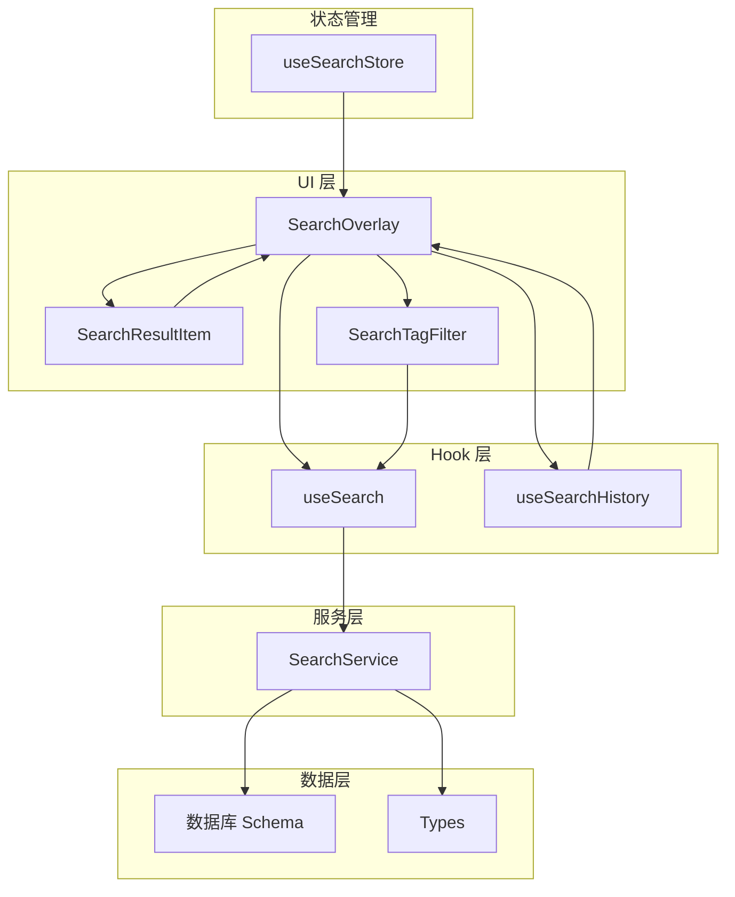
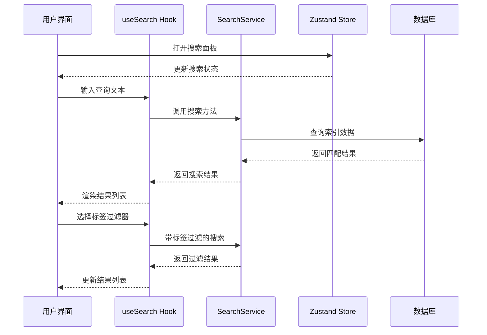
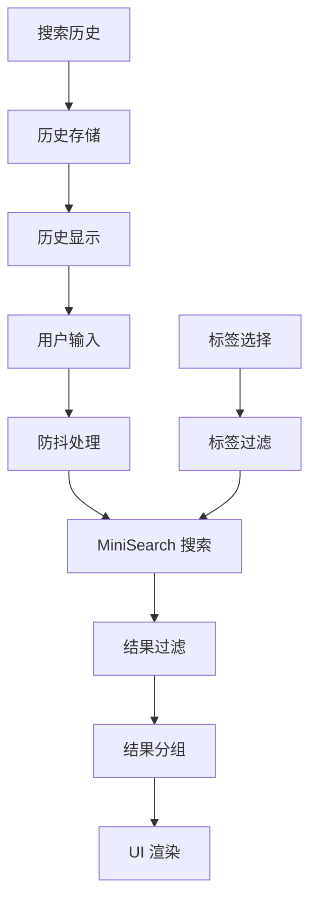
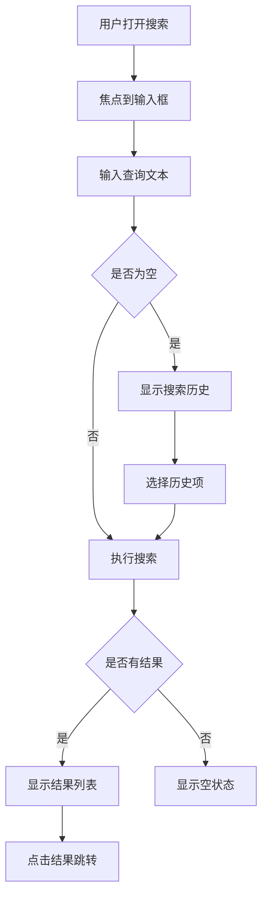
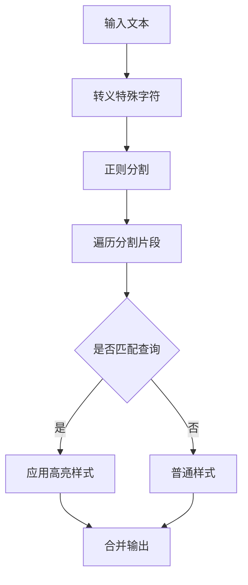
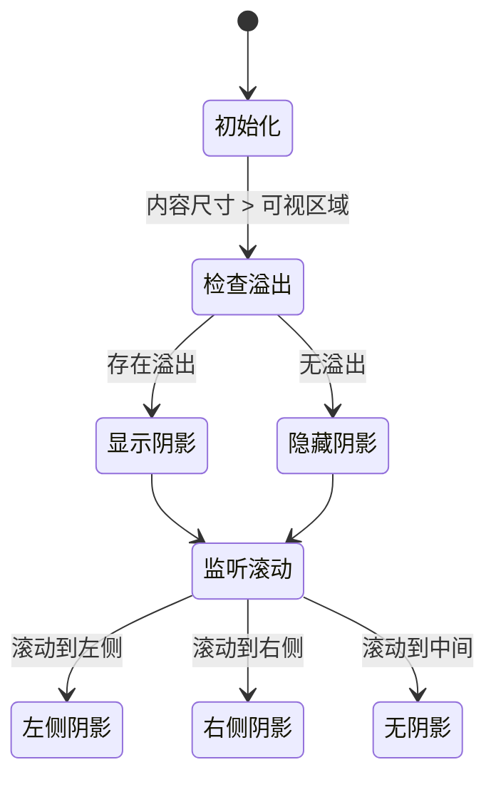
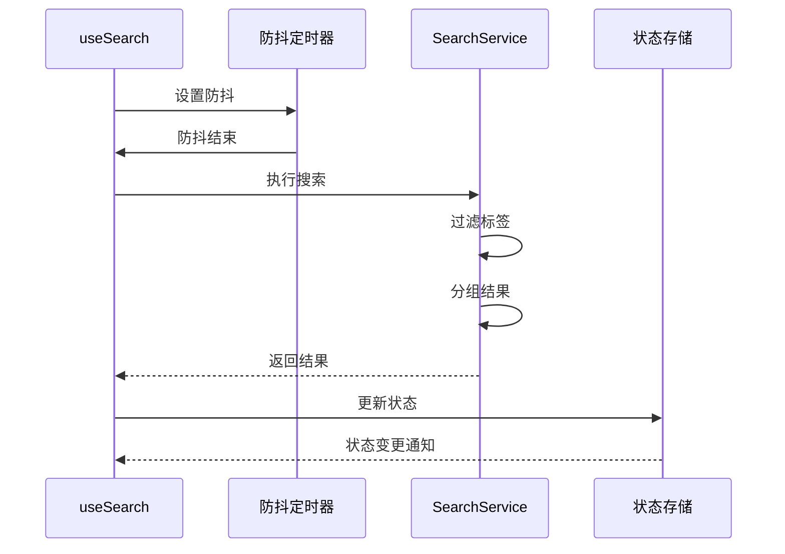
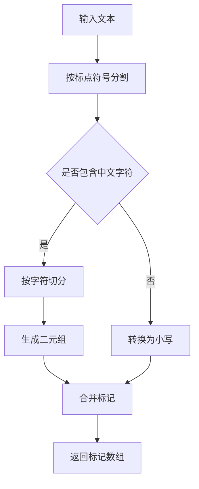
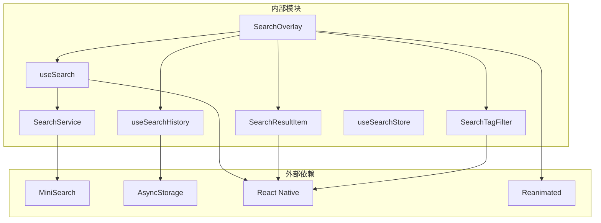

# 搜索功能模块

<cite>
**本文档引用的文件**
- [SearchOverlay.tsx](file://components/note/SearchOverlay.tsx)
- [SearchResultItem.tsx](file://components/note/SearchResultItem.tsx)
- [SearchTagFilter.tsx](file://components/note/SearchTagFilter.tsx)
- [useSearch.ts](file://hooks/useSearch.ts)
- [useSearchHistory.ts](file://hooks/useSearchHistory.ts)
- [searchService.ts](file://services/search/searchService.ts)
- [search.ts](file://types/search.ts)
- [useSearchStore.ts](file://store/useSearchStore.ts)
- [index.ts](file://db/schema/index.ts)
- [search.json](file://i18n/locales/zh-CN/search.json)
- [index.tsx](file://app/(tabs)/index.tsx)
- [package.json](file://package.json)
</cite>

## 目录
1. [简介](#简介)
2. [项目结构](#项目结构)
3. [核心组件](#核心组件)
4. [架构概览](#架构概览)
5. [详细组件分析](#详细组件分析)
6. [依赖关系分析](#依赖关系分析)
7. [性能考虑](#性能考虑)
8. [故障排除指南](#故障排除指南)
9. [结论](#结论)
10. [附录](#附录)

## 简介

搜索功能模块是 VoiceNote 应用中的核心功能之一，提供了完整的笔记搜索体验。该模块采用现代化的前端架构设计，集成了全文搜索、标签过滤、搜索历史等功能，为用户提供高效便捷的笔记检索能力。

本模块基于 MiniSearch 全文搜索引擎，支持中文分词处理，实现了高性能的本地搜索功能。通过 React Hooks 和 Zustand 状态管理，构建了响应式的搜索界面和流畅的用户体验。

## 项目结构

搜索功能模块在项目中的组织结构如下：

**图表来源**
- [SearchOverlay.tsx:1-388](file://components/note/SearchOverlay.tsx#L1-L388)
- [useSearch.ts:1-84](file://hooks/useSearch.ts#L1-L84)
- [searchService.ts:1-142](file://services/search/searchService.ts#L1-L142)

**章节来源**
- [SearchOverlay.tsx:1-388](file://components/note/SearchOverlay.tsx#L1-L388)
- [useSearch.ts:1-84](file://hooks/useSearch.ts#L1-L84)
- [searchService.ts:1-142](file://services/search/searchService.ts#L1-L142)

## 核心组件

搜索功能模块由以下核心组件构成：

### 1. 搜索覆盖层 (SearchOverlay)
负责提供完整的搜索界面，包括输入框、结果列表、标签过滤器和历史记录功能。

### 2. 搜索结果项 (SearchResultItem)
单个搜索结果的渲染组件，支持高亮显示匹配内容和快速预览。

### 3. 搜索标签过滤器 (SearchTagFilter)
水平滚动的标签选择器，支持多标签过滤和动态标签生成。

### 4. 搜索 Hook (useSearch)
管理搜索状态的核心 Hook，处理查询、结果分组和标签过滤。

### 5. 搜索服务 (SearchService)
基于 MiniSearch 的全文搜索引擎，提供高效的搜索能力。

**章节来源**
- [SearchOverlay.tsx:57-232](file://components/note/SearchOverlay.tsx#L57-L232)
- [SearchResultItem.tsx:41-86](file://components/note/SearchResultItem.tsx#L41-L86)
- [SearchTagFilter.tsx:14-84](file://components/note/SearchTagFilter.tsx#L14-L84)
- [useSearch.ts:11-83](file://hooks/useSearch.ts#L11-L83)
- [searchService.ts:40-117](file://services/search/searchService.ts#L40-L117)

## 架构概览

搜索功能采用分层架构设计，确保各层职责清晰、耦合度低：

**图表来源**
- [useSearch.ts:34-55](file://hooks/useSearch.ts#L34-L55)
- [searchService.ts:73-89](file://services/search/searchService.ts#L73-L89)
- [useSearchStore.ts:9-13](file://store/useSearchStore.ts#L9-L13)

### 数据流架构

**图表来源**
- [useSearch.ts:34-55](file://hooks/useSearch.ts#L34-L55)
- [searchService.ts:73-104](file://services/search/searchService.ts#L73-L104)

## 详细组件分析

### 搜索覆盖层 (SearchOverlay)

SearchOverlay 是搜索功能的主界面组件，提供了完整的搜索体验：

#### 主要功能特性：
- **动画过渡效果**：使用 react-native-reanimated 实现平滑的弹出和关闭动画
- **实时搜索**：集成防抖机制，避免频繁搜索调用
- **结果分组**：按笔记状态（活跃、归档、延迟）分组显示
- **标签过滤**：支持多标签组合过滤
- **搜索历史**：持久化存储搜索历史记录

#### 用户交互流程：

**图表来源**
- [SearchOverlay.tsx:70-80](file://components/note/SearchOverlay.tsx#L70-L80)
- [SearchOverlay.tsx:182-226](file://components/note/SearchOverlay.tsx#L182-L226)

**章节来源**
- [SearchOverlay.tsx:57-232](file://components/note/SearchOverlay.tsx#L57-L232)

### 搜索结果项组件 (SearchResultItem)

SearchResultItem 负责单个搜索结果的渲染，提供丰富的视觉信息：

#### 核心功能：
- **高亮显示**：智能匹配查询关键词并高亮显示
- **时间格式化**：将创建时间格式化为可读的时间字符串
- **状态标识**：显示笔记的当前状态（归档、延迟等）
- **标签预览**：显示相关标签，支持超出数量的统计显示

#### 高亮算法实现：

**图表来源**
- [SearchResultItem.tsx:12-31](file://components/note/SearchResultItem.tsx#L12-L31)

**章节来源**
- [SearchResultItem.tsx:12-86](file://components/note/SearchResultItem.tsx#L12-L86)

### 搜索标签过滤器 (SearchTagFilter)

SearchTagFilter 提供了直观的标签选择界面：

#### 设计特点：
- **水平滚动**：支持长标签列表的水平滚动浏览
- **阴影指示**：根据滚动位置显示左右阴影，提示更多内容
- **选中状态**：清晰的选中/未选中视觉反馈
- **一键清除**：支持清除所有选中标签

#### 滚动检测机制：

**图表来源**
- [SearchTagFilter.tsx:20-29](file://components/note/SearchTagFilter.tsx#L20-L29)

**章节来源**
- [SearchTagFilter.tsx:14-84](file://components/note/SearchTagFilter.tsx#L14-L84)

### 搜索 Hook (useSearch)

useSearch Hook 是搜索功能的核心状态管理组件：

#### 关键功能：
- **防抖搜索**：默认 200ms 防抖延迟，平衡响应性和性能
- **索引管理**：自动管理搜索索引的创建和更新
- **标签过滤**：支持多标签组合过滤
- **结果分组**：按笔记状态自动分组结果

#### 状态管理流程：

**图表来源**
- [useSearch.ts:34-55](file://hooks/useSearch.ts#L34-L55)

**章节来源**
- [useSearch.ts:11-83](file://hooks/useSearch.ts#L11-L83)

### 搜索服务 (SearchService)

SearchService 基于 MiniSearch 实现了高性能的全文搜索：

#### 核心特性：
- **中文分词**：专门针对中文文本的分词处理
- **多字段搜索**：支持标题、内容、标签的联合搜索
- **权重配置**：不同字段具有不同的搜索权重
- **模糊匹配**：支持拼写错误的容错处理

#### 中文分词策略：

**图表来源**
- [searchService.ts:6-24](file://services/search/searchService.ts#L6-L24)

**章节来源**
- [searchService.ts:40-142](file://services/search/searchService.ts#L40-L142)

### 搜索历史 Hook (useSearchHistory)

useSearchHistory Hook 提供了搜索历史的持久化存储：

#### 功能特性：
- **异步存储**：使用 AsyncStorage 进行本地持久化
- **历史限制**：最多保存 10 条历史记录
- **去重处理**：自动去除重复的历史条目
- **自动排序**：最新使用的条目优先显示

**章节来源**
- [useSearchHistory.ts:7-52](file://hooks/useSearchHistory.ts#L7-L52)

## 依赖关系分析

搜索功能模块的依赖关系如下：

**图表来源**
- [package.json:50](file://package.json#L50)
- [package.json:21](file://package.json#L21)
- [package.json:56](file://package.json#L56)

### 外部依赖分析

| 依赖包 | 版本 | 用途 | 性能影响 |
|--------|------|------|----------|
| minisearch | ^7.2.0 | 全文搜索引擎 | 高性能内存索引 |
| @react-native-async-storage/async-storage | ^2.2.0 | 搜索历史存储 | 异步 I/O |
| react-native-reanimated | ^4.2.1 | 动画效果 | GPU 加速 |
| @tamagui/scroll-view | ^2.0.0-rc.11 | 优化滚动 | 性能提升 |

**章节来源**
- [package.json:20-62](file://package.json#L20-L62)

## 性能考虑

### 1. 搜索性能优化

#### 防抖机制
- 默认防抖延迟：200ms
- 避免频繁搜索调用
- 减少不必要的计算开销

#### 索引策略
- 使用 MiniSearch 的内存索引
- 支持增量更新
- 避免全量重建索引

#### 结果缓存
- 搜索结果按查询参数缓存
- 避免重复计算相同查询

### 2. UI 性能优化

#### 列表渲染
- 使用 FlatList 进行虚拟化渲染
- 优化列表项的重新渲染
- 合理的 key 值设置

#### 动画性能
- 使用 reanimated 进行硬件加速
- 避免布局抖动
- 优化动画帧率

### 3. 内存管理

#### 对象池模式
- 复用搜索结果对象
- 避免内存泄漏
- 及时清理定时器

#### 数据结构优化
- 使用 Set 进行标签去重
- Map 结构进行快速查找

## 故障排除指南

### 常见问题及解决方案

#### 1. 搜索结果不准确
**症状**：搜索结果与预期不符
**可能原因**：
- 中文分词配置不当
- 字段权重设置不合理
- 查询语法错误

**解决方法**：
- 检查中文分词器配置
- 调整字段权重设置
- 验证查询语法

#### 2. 搜索响应缓慢
**症状**：搜索操作响应迟缓
**可能原因**：
- 索引过大导致内存压力
- 防抖延迟设置过短
- 数据库查询阻塞

**解决方法**：
- 优化索引大小
- 调整防抖延迟
- 检查数据库性能

#### 3. 标签过滤失效
**症状**：标签过滤无法正常工作
**可能原因**：
- 标签数据格式不正确
- 过滤逻辑错误
- 状态同步问题

**解决方法**：
- 验证标签数据格式
- 检查过滤逻辑
- 同步状态更新

**章节来源**
- [useSearch.ts:34-55](file://hooks/useSearch.ts#L34-L55)
- [searchService.ts:73-89](file://services/search/searchService.ts#L73-L89)

## 结论

搜索功能模块通过精心设计的架构和优化的实现，为用户提供了高效、流畅的笔记搜索体验。模块采用了现代前端技术栈，结合了本地搜索的优势和云端搜索的便利性。

### 主要优势
- **高性能**：基于 MiniSearch 的内存索引，提供快速的搜索响应
- **用户体验**：流畅的动画效果和直观的界面设计
- **可扩展性**：模块化的架构设计，便于功能扩展
- **可靠性**：完善的错误处理和性能监控机制

### 技术亮点
- 中文分词处理的深度定制
- 智能的防抖和缓存策略
- 响应式的状态管理和更新机制
- 完善的国际化支持

该模块为 VoiceNote 应用奠定了坚实的功能基础，为后续的功能扩展和性能优化提供了良好的技术支撑。

## 附录

### 开发者指南

#### 扩展搜索功能的方法

1. **添加新的搜索字段**
   - 修改 `SearchDocument` 接口
   - 更新 `noteToSearchDocument` 函数
   - 配置 MiniSearch 字段映射

2. **自定义搜索算法**
   - 修改 `chineseTokenizer` 函数
   - 调整搜索选项配置
   - 实现自定义的评分算法

3. **增强 UI 组件**
   - 扩展 `SearchOverlay` 的功能
   - 添加新的结果展示方式
   - 实现高级过滤选项

#### 最佳实践建议

- **性能监控**：定期检查搜索性能指标
- **用户反馈**：收集用户对搜索体验的反馈
- **测试覆盖**：完善单元测试和集成测试
- **文档维护**：保持技术文档的及时更新