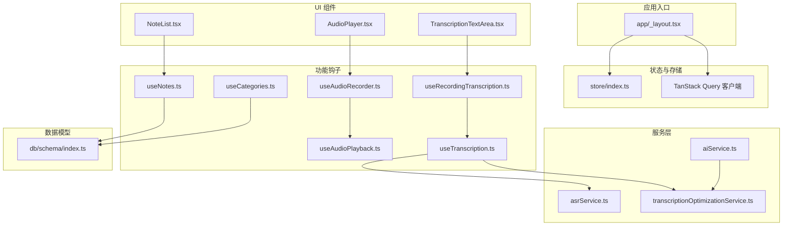
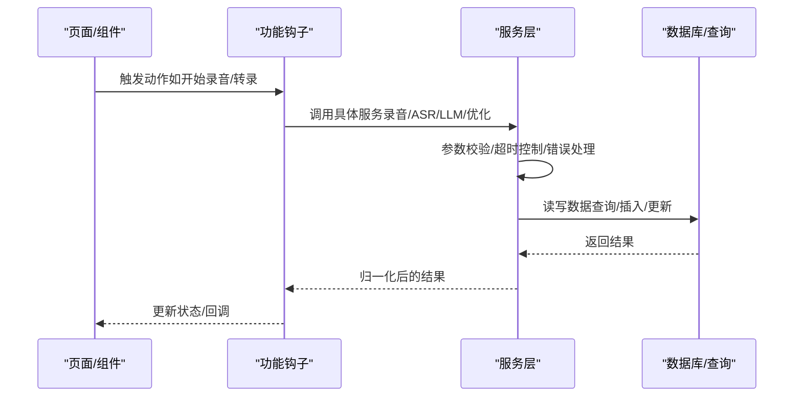
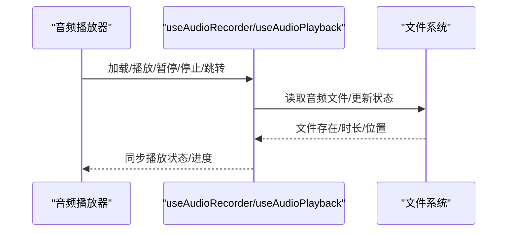
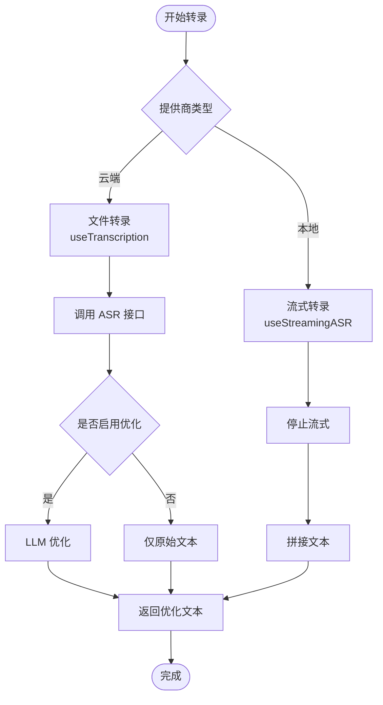
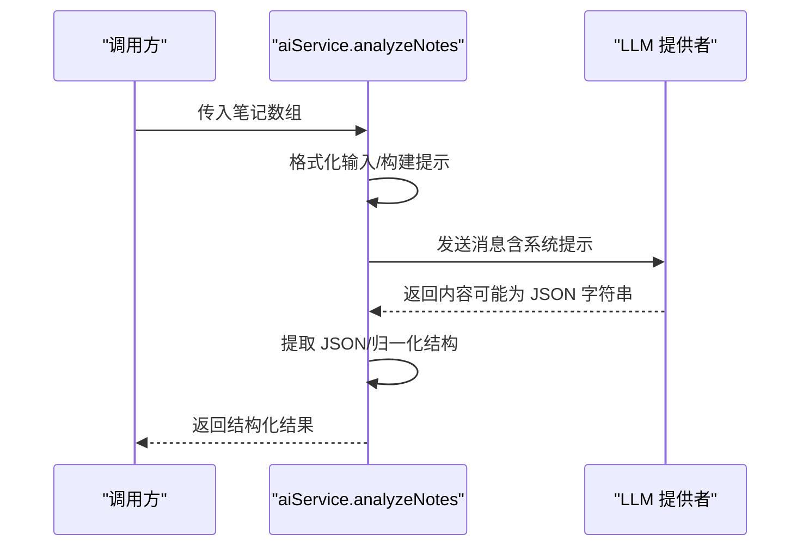
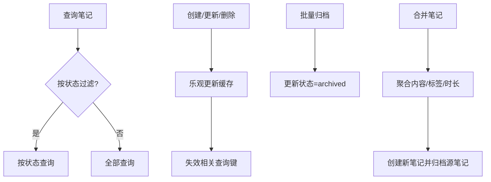
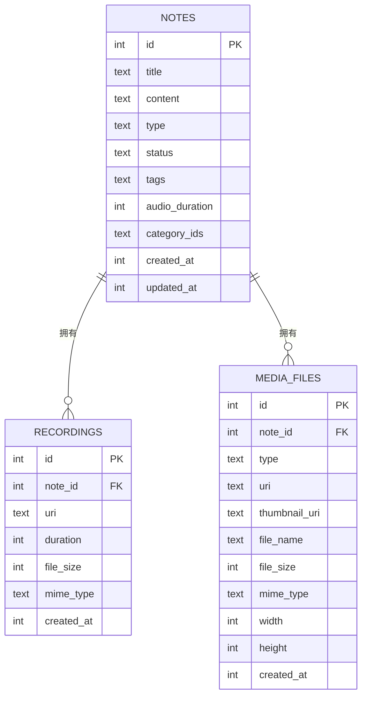
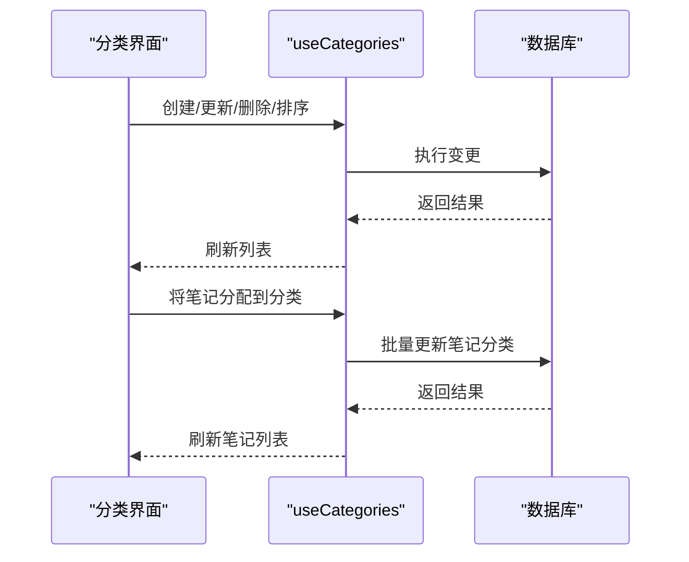
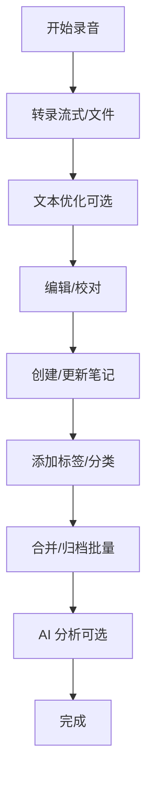
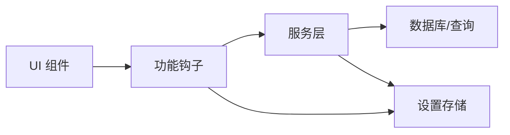

# 核心功能模块

<cite>
**本文引用的文件**
- [app/_layout.tsx](file://app/_layout.tsx)
- [hooks/useAudioRecorder.ts](file://hooks/useAudioRecorder.ts)
- [hooks/useAudioPlayback.ts](file://hooks/useAudioPlayback.ts)
- [hooks/useRecordingTranscription.ts](file://hooks/useRecordingTranscription.ts)
- [hooks/useTranscription.ts](file://hooks/useTranscription.ts)
- [hooks/useNotes.ts](file://hooks/useNotes.ts)
- [hooks/useCategories.ts](file://hooks/useCategories.ts)
- [services/asr/asrService.ts](file://services/asr/asrService.ts)
- [services/ai/aiService.ts](file://services/ai/aiService.ts)
- [services/transcription/transcriptionOptimizationService.ts](file://services/transcription/transcriptionOptimizationService.ts)
- [components/audio/AudioPlayer.tsx](file://components/audio/AudioPlayer.tsx)
- [components/input/TranscriptionTextArea.tsx](file://components/input/TranscriptionTextArea.tsx)
- [components/note/NoteList.tsx](file://components/note/NoteList.tsx)
- [db/schema/index.ts](file://db/schema/index.ts)
- [store/index.ts](file://store/index.ts)
</cite>

## 目录
1. [简介](#简介)
2. [项目结构](#项目结构)
3. [核心组件](#核心组件)
4. [架构总览](#架构总览)
5. [详细组件分析](#详细组件分析)
6. [依赖分析](#依赖分析)
7. [性能考虑](#性能考虑)
8. [故障排查指南](#故障排查指南)
9. [结论](#结论)
10. [附录](#附录)

## 简介
本文件面向 VoiceNote 的核心功能模块，系统性梳理音频录制与播放、语音转录、AI 分析、笔记管理、多媒体处理与分类系统等模块的设计目标、实现原理、数据流与协作关系，并提供可操作的使用模式、扩展点与最佳实践。文档兼顾开发者技术深度与用户使用指导，帮助快速理解与定制。

## 项目结构
应用采用基于 React Navigation 的路由组织，配合 TanStack Query 实现数据状态与缓存，数据库层通过 Drizzle ORM 定义表结构，服务层封装 ASR、LLM、优化等能力，组件层以 Tamagui 为主题化 UI 框架构建交互界面。

**图表来源**
- [app/_layout.tsx:1-101](file://app/_layout.tsx#L1-L101)
- [store/index.ts:1-8](file://store/index.ts#L1-L8)
- [hooks/useAudioRecorder.ts:1-270](file://hooks/useAudioRecorder.ts#L1-L270)
- [hooks/useAudioPlayback.ts:1-90](file://hooks/useAudioPlayback.ts#L1-L90)
- [hooks/useRecordingTranscription.ts:1-199](file://hooks/useRecordingTranscription.ts#L1-L199)
- [hooks/useTranscription.ts:1-104](file://hooks/useTranscription.ts#L1-L104)
- [hooks/useNotes.ts:1-217](file://hooks/useNotes.ts#L1-L217)
- [hooks/useCategories.ts:1-94](file://hooks/useCategories.ts#L1-L94)
- [services/asr/asrService.ts:1-74](file://services/asr/asrService.ts#L1-L74)
- [services/ai/aiService.ts:1-163](file://services/ai/aiService.ts#L1-L163)
- [services/transcription/transcriptionOptimizationService.ts:1-88](file://services/transcription/transcriptionOptimizationService.ts#L1-L88)
- [components/audio/AudioPlayer.tsx:1-132](file://components/audio/AudioPlayer.tsx#L1-L132)
- [components/input/TranscriptionTextArea.tsx:1-156](file://components/input/TranscriptionTextArea.tsx#L1-L156)
- [components/note/NoteList.tsx:1-240](file://components/note/NoteList.tsx#L1-L240)
- [db/schema/index.ts:1-75](file://db/schema/index.ts#L1-L75)

**章节来源**
- [app/_layout.tsx:1-101](file://app/_layout.tsx#L1-L101)
- [store/index.ts:1-8](file://store/index.ts#L1-L8)
- [db/schema/index.ts:1-75](file://db/schema/index.ts#L1-L75)

## 核心组件
- 音频录制与播放：统一的录音与播放状态管理，支持权限请求、实时时长更新、播放控制与定位。
- 语音转录：统一的转录钩子，自动适配本地流式与云端文件式两种模式；支持转录文本优化。
- AI 分析：对多条笔记进行结构化分析，输出标签、洞察、行动项与元数据，并具备响应归一化与容错。
- 笔记管理：基于 TanStack Query 的查询、增删改、批量归档与合并，支持乐观更新与缓存失效。
- 多媒体处理：记录与媒体文件的持久化、缩略图与尺寸信息管理。
- 分类系统：分类的增删改查、排序与笔记分配/移除，联动笔记列表刷新。

**章节来源**
- [hooks/useAudioRecorder.ts:1-270](file://hooks/useAudioRecorder.ts#L1-L270)
- [hooks/useAudioPlayback.ts:1-90](file://hooks/useAudioPlayback.ts#L1-L90)
- [hooks/useRecordingTranscription.ts:1-199](file://hooks/useRecordingTranscription.ts#L1-L199)
- [hooks/useTranscription.ts:1-104](file://hooks/useTranscription.ts#L1-L104)
- [services/ai/aiService.ts:1-163](file://services/ai/aiService.ts#L1-L163)
- [hooks/useNotes.ts:1-217](file://hooks/useNotes.ts#L1-L217)
- [db/schema/index.ts:1-75](file://db/schema/index.ts#L1-L75)
- [hooks/useCategories.ts:1-94](file://hooks/useCategories.ts#L1-L94)

## 架构总览
整体采用“页面/组件 → 钩子 → 服务 → 数据库”的分层设计。页面通过钩子暴露状态与动作，服务层负责外部接口调用与业务逻辑，数据库层通过 Drizzle ORM 提供类型安全的 CRUD 与索引支持。

**图表来源**
- [hooks/useAudioRecorder.ts:1-270](file://hooks/useAudioRecorder.ts#L1-L270)
- [hooks/useRecordingTranscription.ts:1-199](file://hooks/useRecordingTranscription.ts#L1-L199)
- [hooks/useTranscription.ts:1-104](file://hooks/useTranscription.ts#L1-L104)
- [services/asr/asrService.ts:1-74](file://services/asr/asrService.ts#L1-L74)
- [services/ai/aiService.ts:1-163](file://services/ai/aiService.ts#L1-L163)
- [services/transcription/transcriptionOptimizationService.ts:1-88](file://services/transcription/transcriptionOptimizationService.ts#L1-L88)
- [hooks/useNotes.ts:1-217](file://hooks/useNotes.ts#L1-L217)
- [db/schema/index.ts:1-75](file://db/schema/index.ts#L1-L75)

## 详细组件分析

### 音频录制与播放
- 设计目标：提供跨平台一致的录音体验，支持权限申请、暂停/恢复、停止与文件清理；播放器支持定位、播放/暂停/停止与进度同步。
- 关键实现：
  - 使用第三方录音库的状态驱动与定时轮询，实时更新录制时长与播放进度。
  - 录制完成后读取文件大小，确保后续上传与显示可用。
  - 播放器在源变更后自动加载，失败时静默回退。
- 典型路径：
  - [useAudioRecorder.ts:74-204](file://hooks/useAudioRecorder.ts#L74-L204)
  - [useAudioPlayback.ts:27-87](file://hooks/useAudioPlayback.ts#L27-L87)
  - [components/audio/AudioPlayer.tsx:19-47](file://components/audio/AudioPlayer.tsx#L19-L47)

**图表来源**
- [hooks/useAudioRecorder.ts:1-270](file://hooks/useAudioRecorder.ts#L1-L270)
- [hooks/useAudioPlayback.ts:1-90](file://hooks/useAudioPlayback.ts#L1-L90)
- [components/audio/AudioPlayer.tsx:1-132](file://components/audio/AudioPlayer.tsx#L1-L132)

**章节来源**
- [hooks/useAudioRecorder.ts:1-270](file://hooks/useAudioRecorder.ts#L1-L270)
- [hooks/useAudioPlayback.ts:1-90](file://hooks/useAudioPlayback.ts#L1-L90)
- [components/audio/AudioPlayer.tsx:1-132](file://components/audio/AudioPlayer.tsx#L1-L132)

### 语音转录（统一钩子）
- 设计目标：根据 ASR 提供商类型自动选择本地流式或云端文件式转录，统一对外接口，隐藏模式差异。
- 关键实现：
  - 流式模式：在录音开始时启动，结束时返回完整文本。
  - 文件模式：录音结束后提交音频文件，返回原始与优化文本。
  - 文本优化：规则清洗 + 可选 LLM 优化，支持轻/中/重级别。
- 典型路径：
  - [useRecordingTranscription.ts:74-195](file://hooks/useRecordingTranscription.ts#L74-L195)
  - [useTranscription.ts:22-103](file://hooks/useTranscription.ts#L22-L103)
  - [services/asr/asrService.ts:24-73](file://services/asr/asrService.ts#L24-L73)
  - [services/transcription/transcriptionOptimizationService.ts:62-87](file://services/transcription/transcriptionOptimizationService.ts#L62-L87)

**图表来源**
- [hooks/useRecordingTranscription.ts:1-199](file://hooks/useRecordingTranscription.ts#L1-L199)
- [hooks/useTranscription.ts:1-104](file://hooks/useTranscription.ts#L1-L104)
- [services/asr/asrService.ts:1-74](file://services/asr/asrService.ts#L1-L74)
- [services/transcription/transcriptionOptimizationService.ts:1-88](file://services/transcription/transcriptionOptimizationService.ts#L1-L88)

**章节来源**
- [hooks/useRecordingTranscription.ts:1-199](file://hooks/useRecordingTranscription.ts#L1-L199)
- [hooks/useTranscription.ts:1-104](file://hooks/useTranscription.ts#L1-L104)
- [services/asr/asrService.ts:1-74](file://services/asr/asrService.ts#L1-L74)
- [services/transcription/transcriptionOptimizationService.ts:1-88](file://services/transcription/transcriptionOptimizationService.ts#L1-L88)

### AI 分析（笔记洞察）
- 设计目标：对多条笔记进行结构化分析，输出摘要、标签、关键洞察与行动项，支持情绪语调、时间范围等元数据。
- 关键实现：
  - 统一系统提示与用户提示构建，限制 token 并设置超时。
  - 响应解析与归一化，兼容多种输出格式，保证字段一致性。
  - 与优化服务解耦，可在分析前或分析后进行文本优化。
- 典型路径：
  - [services/ai/aiService.ts:126-162](file://services/ai/aiService.ts#L126-L162)
  - [services/ai/aiService.ts:95-124](file://services/ai/aiService.ts#L95-L124)

**图表来源**
- [services/ai/aiService.ts:1-163](file://services/ai/aiService.ts#L1-L163)

**章节来源**
- [services/ai/aiService.ts:1-163](file://services/ai/aiService.ts#L1-L163)

### 笔记管理（查询/增删改/批量）
- 设计目标：提供完整的笔记生命周期管理，支持按状态过滤、乐观更新、批量归档与合并。
- 关键实现：
  - 查询键设计清晰，便于缓存失效与增量更新。
  - 批量归档与合并均采用事务式更新，合并时去重标签、汇总音频时长。
  - 删除后全局刷新相关列表，确保视图一致性。
- 典型路径：
  - [hooks/useNotes.ts:19-29](file://hooks/useNotes.ts#L19-L29)
  - [hooks/useNotes.ts:46-56](file://hooks/useNotes.ts#L46-L56)
  - [hooks/useNotes.ts:61-102](file://hooks/useNotes.ts#L61-L102)
  - [hooks/useNotes.ts:107-117](file://hooks/useNotes.ts#L107-L117)
  - [hooks/useNotes.ts:122-138](file://hooks/useNotes.ts#L122-L138)
  - [hooks/useNotes.ts:144-216](file://hooks/useNotes.ts#L144-L216)

**图表来源**
- [hooks/useNotes.ts:1-217](file://hooks/useNotes.ts#L1-L217)

**章节来源**
- [hooks/useNotes.ts:1-217](file://hooks/useNotes.ts#L1-L217)

### 多媒体处理（记录与媒体文件）
- 设计目标：为语音记录与图片/视频/文档等附件提供统一的数据模型与持久化策略。
- 关键实现：
  - 记录表与媒体表均与笔记关联，支持级联删除。
  - 媒体表包含缩略图、尺寸、MIME 类型等元信息，便于预览与展示。
- 典型路径：
  - [db/schema/index.ts:19-41](file://db/schema/index.ts#L19-L41)

**图表来源**
- [db/schema/index.ts:1-75](file://db/schema/index.ts#L1-L75)

**章节来源**
- [db/schema/index.ts:1-75](file://db/schema/index.ts#L1-L75)

### 分类系统（分类与笔记关联）
- 设计目标：支持分类的增删改查、排序与笔记分配/移除，提升笔记组织与检索效率。
- 关键实现：
  - 分类变更后联动刷新笔记列表与分类列表，保持一致性。
  - 支持将多个笔记一次性分配到某分类或从分类移除。
- 典型路径：
  - [hooks/useCategories.ts:14-19](file://hooks/useCategories.ts#L14-L19)
  - [hooks/useCategories.ts:29-37](file://hooks/useCategories.ts#L29-L37)
  - [hooks/useCategories.ts:39-48](file://hooks/useCategories.ts#L39-L48)
  - [hooks/useCategories.ts:50-59](file://hooks/useCategories.ts#L50-L59)
  - [hooks/useCategories.ts:61-69](file://hooks/useCategories.ts#L61-L69)
  - [hooks/useCategories.ts:71-93](file://hooks/useCategories.ts#L71-L93)

**图表来源**
- [hooks/useCategories.ts:1-94](file://hooks/useCategories.ts#L1-L94)

**章节来源**
- [hooks/useCategories.ts:1-94](file://hooks/useCategories.ts#L1-L94)

### 用户工作流程与常见使用模式
- 录音转录流程：录音 → 流式/文件式转录 → 文本优化 → 编辑/保存为笔记。
- 笔记管理流程：新建/编辑 → 标签/分类 → 合并与归档 → 查看与分享。
- AI 分析流程：选择多条笔记 → 触发分析 → 查看洞察与行动项 → 导出/参考执行。

[本图为概念性流程示意，不直接映射具体源码文件]

## 依赖分析
- 组件与钩子：UI 组件通过钩子暴露状态与动作，降低耦合度，便于测试与复用。
- 钩子与服务：钩子集中处理错误、超时与状态切换，服务层专注业务与外部接口。
- 服务与数据库：服务层通过查询模块访问数据库，遵循单一职责与类型安全。
- 存储与配置：设置存储集中管理 ASR/LLM/优化等配置，统一注入到服务层。

**图表来源**
- [hooks/useRecordingTranscription.ts:1-199](file://hooks/useRecordingTranscription.ts#L1-L199)
- [hooks/useTranscription.ts:1-104](file://hooks/useTranscription.ts#L1-L104)
- [services/asr/asrService.ts:1-74](file://services/asr/asrService.ts#L1-L74)
- [services/ai/aiService.ts:1-163](file://services/ai/aiService.ts#L1-L163)
- [hooks/useNotes.ts:1-217](file://hooks/useNotes.ts#L1-L217)
- [store/index.ts:1-8](file://store/index.ts#L1-L8)

**章节来源**
- [hooks/useRecordingTranscription.ts:1-199](file://hooks/useRecordingTranscription.ts#L1-L199)
- [hooks/useTranscription.ts:1-104](file://hooks/useTranscription.ts#L1-L104)
- [services/asr/asrService.ts:1-74](file://services/asr/asrService.ts#L1-L74)
- [services/ai/aiService.ts:1-163](file://services/ai/aiService.ts#L1-L163)
- [hooks/useNotes.ts:1-217](file://hooks/useNotes.ts#L1-L217)
- [store/index.ts:1-8](file://store/index.ts#L1-L8)

## 性能考虑
- 状态轮询与节流：播放进度轮询周期合理，避免频繁重渲染；转录与优化过程设置超时，防止阻塞 UI。
- 缓存与失效：TanStack Query 默认缓存策略与查询键设计，减少重复请求；批量操作后统一失效，保证一致性。
- 渲染优化：笔记列表使用高性能滚动组件，日期分组与懒渲染减少首屏压力。
- I/O 优化：录音完成后及时释放录音模式，避免播放冲突；文件删除与清理在取消录制时执行。

[本节为通用性能建议，不直接分析具体文件]

## 故障排查指南
- 录音权限被拒：检查权限申请与系统设置；录音前确保权限已授予。
- 转录失败：确认 ASR 配置（URL/Key）正确；检查网络与超时设置；必要时重试。
- 优化失败：若 LLM 未配置或网络异常，将回退到规则清洗版本；检查配置与令牌。
- 笔记不同步：触发相关查询键的失效与重新拉取；检查批量操作是否成功。
- 分类异常：确认分类变更后已刷新列表；检查笔记与分类的关联是否正确。

**章节来源**
- [hooks/useAudioRecorder.ts:74-109](file://hooks/useAudioRecorder.ts#L74-L109)
- [services/asr/asrService.ts:24-73](file://services/asr/asrService.ts#L24-L73)
- [services/transcription/transcriptionOptimizationService.ts:62-87](file://services/transcription/transcriptionOptimizationService.ts#L62-L87)
- [hooks/useNotes.ts:46-56](file://hooks/useNotes.ts#L46-L56)
- [hooks/useCategories.ts:29-37](file://hooks/useCategories.ts#L29-L37)

## 结论
VoiceNote 的核心功能围绕“录音 → 转录 → 优化 → 笔记 → 分析/分类”闭环展开，通过钩子抽象统一交互，服务层隔离外部依赖，数据库层保障数据一致性。该架构既满足开发者扩展需求，也为用户提供了高效、稳定的使用体验。

[本节为总结性内容，不直接分析具体文件]

## 附录
- 扩展点与自定义选项
  - ASR 提供商：新增本地/云端提供商时，只需实现统一接口并接入统一转录钩子。
  - LLM 优化：支持不同模型与提示词，按需调整温度与最大 token。
  - UI 主题：基于 Tamagui 主题系统，可快速切换明暗主题与品牌色。
  - 存储配置：通过设置存储集中管理 API 地址、密钥与模型参数，便于环境切换。
- 最佳实践
  - 在 UI 中优先使用统一钩子，避免直接操作底层库。
  - 对批量操作使用乐观更新与统一失效策略，提升交互流畅度。
  - 对外部调用设置超时与重试，增强健壮性。

[本节为通用建议，不直接分析具体文件]