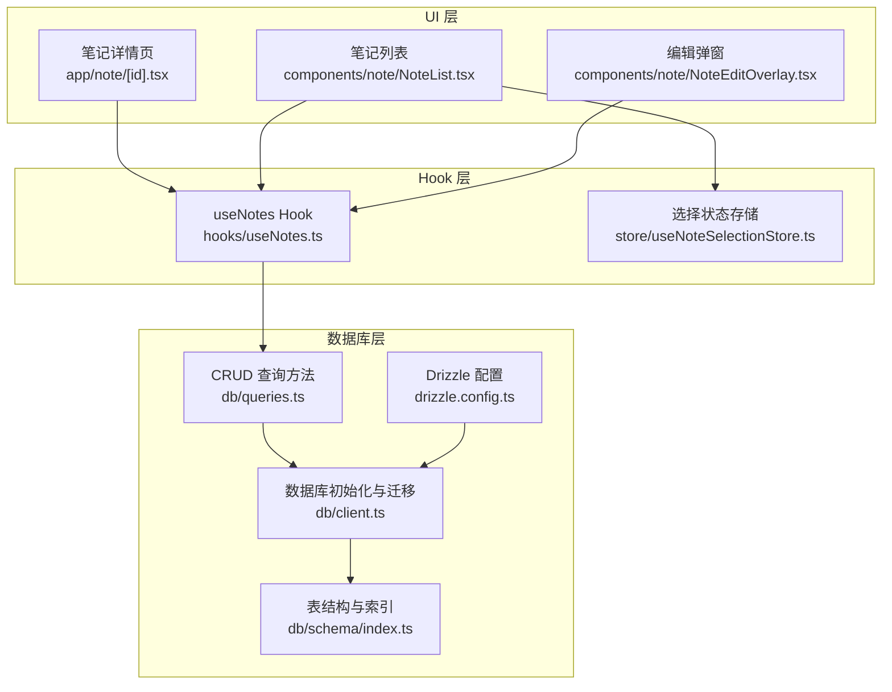
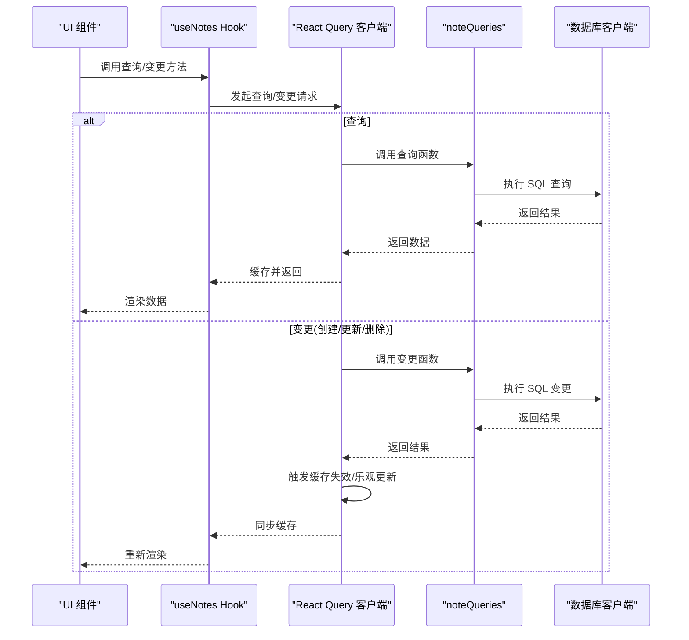
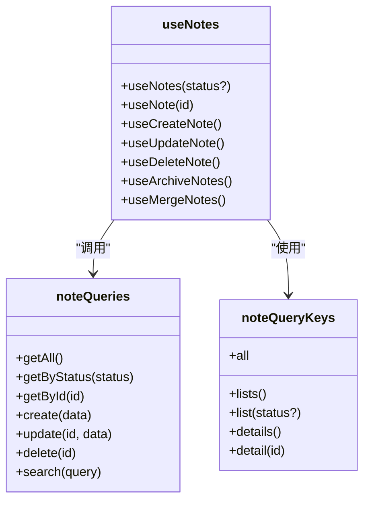
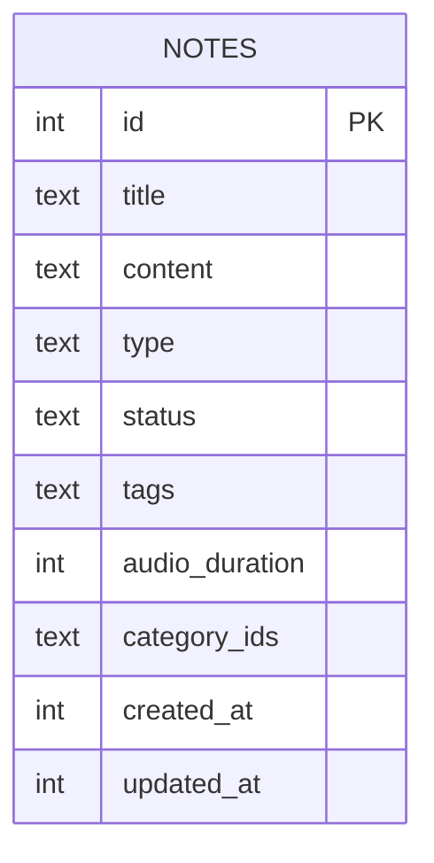
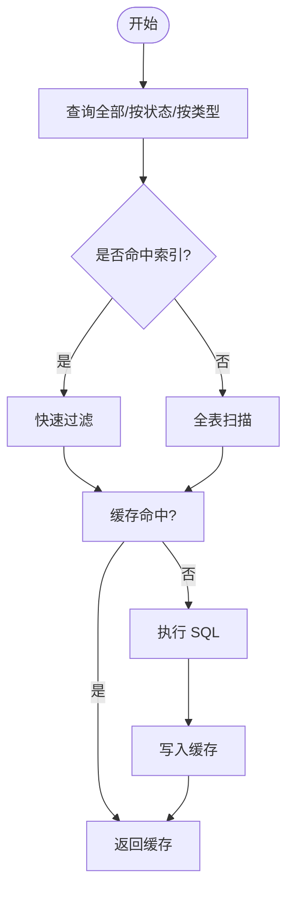
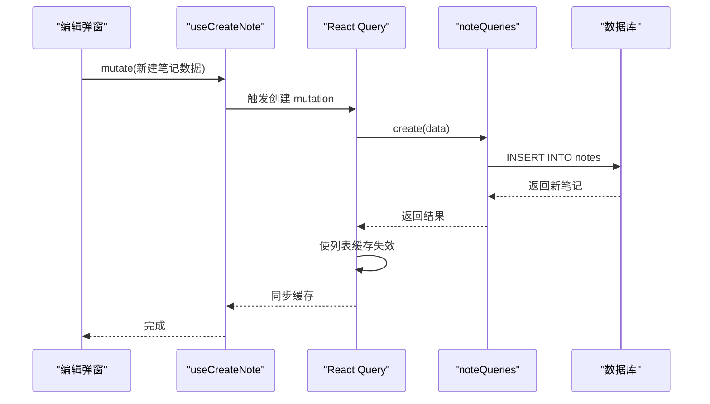
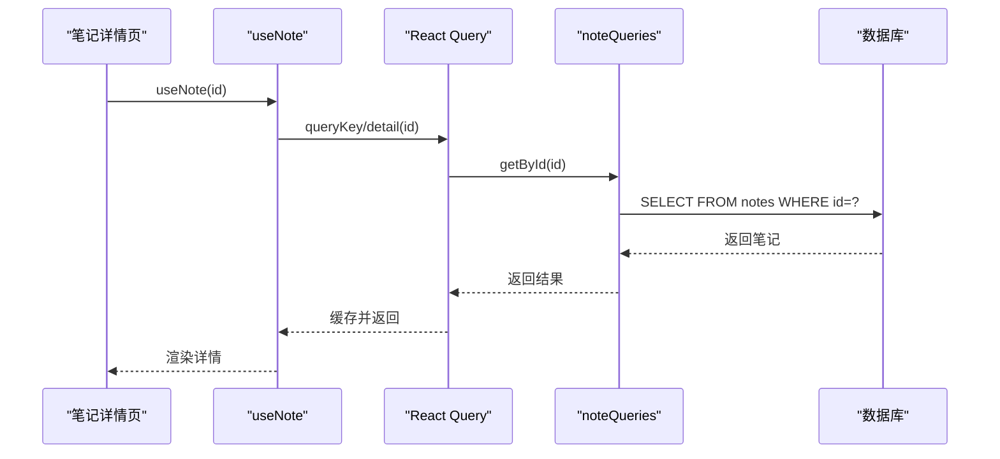
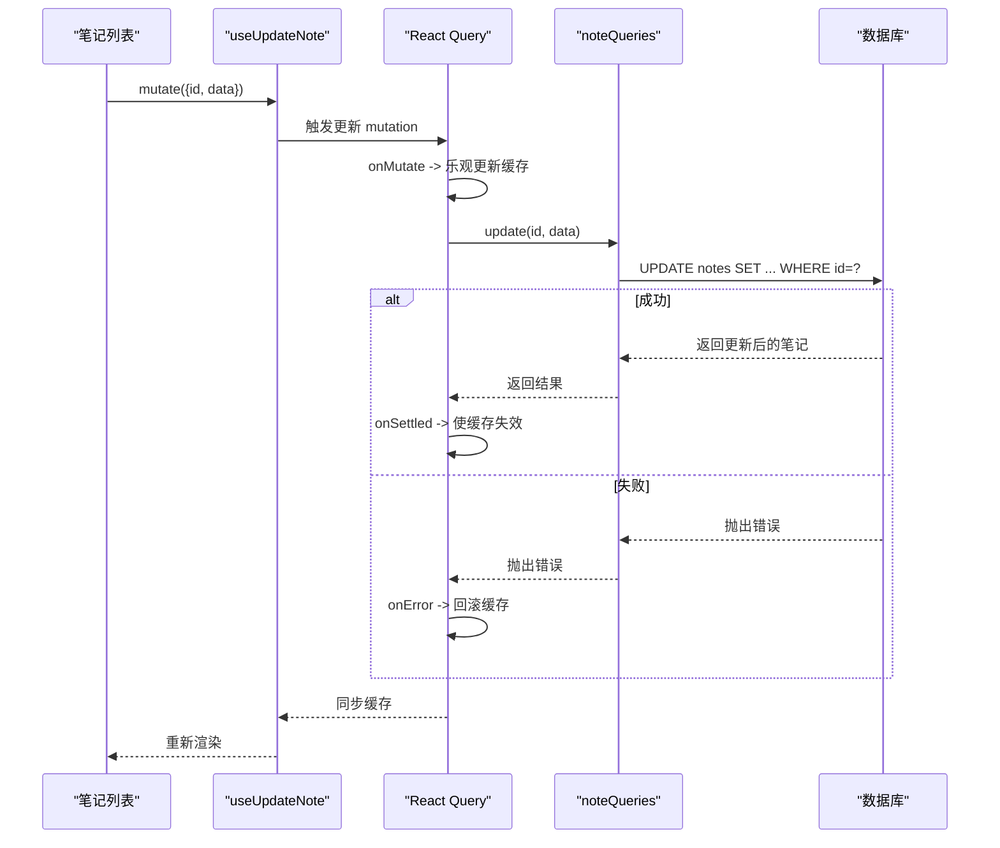
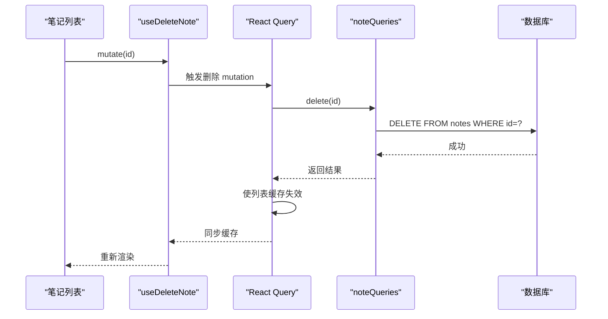
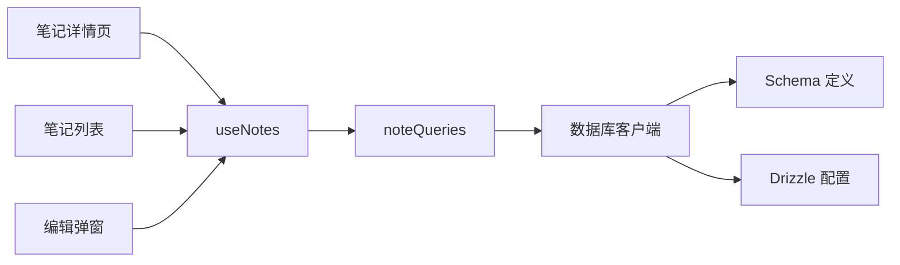

# 笔记 CRUD 操作

<cite>
**本文引用的文件**
- [hooks/useNotes.ts](file://hooks/useNotes.ts)
- [db/queries.ts](file://db/queries.ts)
- [db/schema/index.ts](file://db/schema/index.ts)
- [db/index.ts](file://db/index.ts)
- [db/client.ts](file://db/client.ts)
- [app/note/[id].tsx](file://app/note/[id].tsx)
- [components/note/NoteList.tsx](file://components/note/NoteList.tsx)
- [store/useNoteSelectionStore.ts](file://store/useNoteSelectionStore.ts)
- [components/note/NoteEditOverlay.tsx](file://components/note/NoteEditOverlay.tsx)
- [drizzle.config.ts](file://drizzle.config.ts)
- [utils/validation.ts](file://utils/validation.ts)
- [i18n/locales/zh-CN/note.json](file://i18n/locales/zh-CN/note.json)
</cite>

## 目录
1. [简介](#简介)
2. [项目结构](#项目结构)
3. [核心组件](#核心组件)
4. [架构总览](#架构总览)
5. [详细组件分析](#详细组件分析)
6. [依赖关系分析](#依赖关系分析)
7. [性能考量](#性能考量)
8. [故障排查指南](#故障排查指南)
9. [结论](#结论)
10. [附录](#附录)

## 简介
本文件围绕“笔记 CRUD 操作”进行系统化技术文档编写，覆盖以下要点：
- 笔记的创建、读取、更新、删除完整实现流程与调用链路
- useNotes Hook 的设计模式与状态管理机制（基于 TanStack React Query）
- 数据库查询优化策略（索引、查询缓存、批量操作）
- 笔记数据模型字段定义与验证规则
- 错误处理机制与异常场景应对
- 事务管理与数据一致性保障
- 扩展与定制化开发建议

## 项目结构
本项目采用分层架构：UI 层（屏幕与组件）、Hook 层（状态与异步逻辑）、数据库层（Drizzle ORM + Expo SQLite）。笔记 CRUD 主要由以下模块协作完成：
- UI 层：笔记详情页、笔记列表、编辑弹窗
- Hook 层：useNotes 提供查询、创建、更新、删除、合并等能力
- 数据库层：schema 定义表结构与索引；queries 提供 CRUD 方法；client 初始化数据库与迁移



图表来源
- [app/note/[id].tsx](file://app/note/[id].tsx#L1-L80)
- [components/note/NoteList.tsx:1-240](file://components/note/NoteList.tsx#L1-L240)
- [components/note/NoteEditOverlay.tsx:1-86](file://components/note/NoteEditOverlay.tsx#L1-L86)
- [hooks/useNotes.ts:1-217](file://hooks/useNotes.ts#L1-L217)
- [store/useNoteSelectionStore.ts:1-49](file://store/useNoteSelectionStore.ts#L1-L49)
- [db/queries.ts:1-286](file://db/queries.ts#L1-L286)
- [db/schema/index.ts:1-75](file://db/schema/index.ts#L1-L75)
- [db/client.ts:1-15](file://db/client.ts#L1-L15)
- [drizzle.config.ts:1-12](file://drizzle.config.ts#L1-L12)

章节来源
- [hooks/useNotes.ts:1-217](file://hooks/useNotes.ts#L1-L217)
- [db/queries.ts:1-286](file://db/queries.ts#L1-L286)
- [db/schema/index.ts:1-75](file://db/schema/index.ts#L1-L75)
- [db/client.ts:1-15](file://db/client.ts#L1-L15)
- [drizzle.config.ts:1-12](file://drizzle.config.ts#L1-L12)
- [app/note/[id].tsx](file://app/note/[id].tsx#L1-L80)
- [components/note/NoteList.tsx:1-240](file://components/note/NoteList.tsx#L1-L240)
- [store/useNoteSelectionStore.ts:1-49](file://store/useNoteSelectionStore.ts#L1-L49)
- [components/note/NoteEditOverlay.tsx:1-86](file://components/note/NoteEditOverlay.tsx#L1-L86)

## 核心组件
- useNotes Hook：封装笔记的查询、创建、更新、删除、批量归档、合并等操作，统一使用 React Query 进行缓存与失效控制
- noteQueries：封装对 notes 表的 CRUD 与搜索，使用 Drizzle ORM + Expo SQLite
- 数据模型与索引：notes 表包含 id、title、content、type、status、tags、audioDuration、categoryIds、createdAt、updatedAt，并在 status、type 上建立索引
- UI 组件：笔记详情页、列表、编辑弹窗，配合 Hook 使用

章节来源
- [hooks/useNotes.ts:1-217](file://hooks/useNotes.ts#L1-L217)
- [db/queries.ts:1-64](file://db/queries.ts#L1-L64)
- [db/schema/index.ts:3-17](file://db/schema/index.ts#L3-L17)

## 架构总览
下图展示了从 UI 到数据库的端到端调用路径，以及 React Query 的缓存与失效策略。



图表来源
- [hooks/useNotes.ts:19-117](file://hooks/useNotes.ts#L19-L117)
- [db/queries.ts:7-64](file://db/queries.ts#L7-L64)
- [db/client.ts:1-15](file://db/client.ts#L1-L15)

## 详细组件分析

### useNotes Hook 设计与状态管理
- 查询键设计：通过 noteQueryKeys 生成稳定的查询键，支持按状态、详情等维度区分缓存
- 查询：useNotes 支持按状态过滤或全量查询；useNote 支持按 id 查询，且仅在 id 存在时启用
- 创建：useCreateNote 基于 mutationFn 调用 noteQueries.create，成功后使列表缓存失效
- 更新：useUpdateNote 实现乐观更新（onMutate）+ 回滚（onError）+ 最终同步（onSettled），提升交互流畅度
- 删除：useDeleteNote 成功后使列表缓存失效
- 批量归档：useArchiveNotes 并行更新多个笔记的状态
- 合并笔记：useMergeNotes 聚合多条笔记内容、标签、音频时长，创建新笔记并归档源笔记



图表来源
- [hooks/useNotes.ts:7-13](file://hooks/useNotes.ts#L7-L13)
- [hooks/useNotes.ts:19-217](file://hooks/useNotes.ts#L19-L217)
- [db/queries.ts:7-64](file://db/queries.ts#L7-L64)

章节来源
- [hooks/useNotes.ts:1-217](file://hooks/useNotes.ts#L1-L217)

### 笔记数据模型与验证规则
- 字段定义（notes 表）：
  - id：主键，自增
  - title：非空文本
  - content：可空文本
  - type：枚举 text/voice/camera/attachment，默认 text
  - status：枚举 active/archived/snoozed，默认 active
  - tags：JSON 数组字符串
  - audioDuration：毫秒级时长（语音笔记）
  - categoryIds：JSON 数组字符串（分类 ID）
  - createdAt/updatedAt：时间戳
- 索引：在 status、type 上建立索引以优化过滤查询
- 类型别名：db/index.ts 定义 Note/NewNote 类型，确保类型安全



图表来源
- [db/schema/index.ts:3-17](file://db/schema/index.ts#L3-L17)
- [db/index.ts:3-4](file://db/index.ts#L3-L4)

章节来源
- [db/schema/index.ts:1-75](file://db/schema/index.ts#L1-L75)
- [db/index.ts:1-26](file://db/index.ts#L1-L26)

### 数据库查询与优化策略
- 查询方法：
  - 全量/按状态/按类型/按状态与类型组合查询
  - 按 id 查询单条笔记
  - 搜索（按标题精确匹配）
- 优化策略：
  - 索引：status、type 索引用于过滤
  - 查询缓存：React Query 默认缓存 + 自定义查询键，避免重复请求
  - 批量操作：批量归档使用 Promise.all 并行更新；批量统计媒体数量使用一次聚合查询
- 事务与一致性：
  - 当前 CRUD 使用单条 SQL 操作，未显式开启事务
  - 合并笔记涉及多步写入（创建 + 多次更新），建议在数据库层面使用事务包裹，确保原子性



图表来源
- [db/queries.ts:8-28](file://db/queries.ts#L8-L28)
- [db/schema/index.ts:14-17](file://db/schema/index.ts#L14-L17)

章节来源
- [db/queries.ts:1-286](file://db/queries.ts#L1-L286)
- [db/schema/index.ts:1-75](file://db/schema/index.ts#L1-L75)

### CRUD 操作实现流程

#### 创建笔记（Create）
- UI 触发：编辑弹窗保存时调用 useCreateNote.mutate
- Hook 调用：noteQueries.create 写入数据库，设置 createdAt/updatedAt
- 缓存更新：使列表缓存失效，触发重新查询



图表来源
- [hooks/useNotes.ts:46-56](file://hooks/useNotes.ts#L46-L56)
- [db/queries.ts:35-45](file://db/queries.ts#L35-L45)

章节来源
- [hooks/useNotes.ts:46-56](file://hooks/useNotes.ts#L46-L56)
- [db/queries.ts:35-45](file://db/queries.ts#L35-L45)

#### 读取笔记（Read）
- 单条：useNote(id) 在 id 存在时启用查询，按 id 获取
- 列表：useNotes(status?) 支持按状态过滤，按 updatedAt 降序排列
- UI：笔记详情页与列表组件分别消费这些 Hook



图表来源
- [hooks/useNotes.ts:35-41](file://hooks/useNotes.ts#L35-L41)
- [db/queries.ts:30-33](file://db/queries.ts#L30-L33)
- [app/note/[id].tsx](file://app/note/[id].tsx#L9-L27)

章节来源
- [hooks/useNotes.ts:19-41](file://hooks/useNotes.ts#L19-L41)
- [db/queries.ts:8-33](file://db/queries.ts#L8-L33)
- [app/note/[id].tsx](file://app/note/[id].tsx#L1-L80)

#### 更新笔记（Update）
- 乐观更新：onMutate 中立即更新缓存，提升响应速度
- 错误回滚：onError 将缓存回滚到变更前状态
- 最终同步：onSettled 使详情与列表缓存失效，确保最终一致



图表来源
- [hooks/useNotes.ts:61-102](file://hooks/useNotes.ts#L61-L102)
- [db/queries.ts:47-53](file://db/queries.ts#L47-L53)

章节来源
- [hooks/useNotes.ts:61-102](file://hooks/useNotes.ts#L61-L102)
- [db/queries.ts:47-53](file://db/queries.ts#L47-L53)

#### 删除笔记（Delete）
- 调用 noteQueries.delete(id)
- 成功后使列表缓存失效，避免显示已删除项



图表来源
- [hooks/useNotes.ts:107-117](file://hooks/useNotes.ts#L107-L117)
- [db/queries.ts:55-57](file://db/queries.ts#L55-L57)

章节来源
- [hooks/useNotes.ts:107-117](file://hooks/useNotes.ts#L107-L117)
- [db/queries.ts:55-57](file://db/queries.ts#L55-L57)

#### 批量归档与合并
- 批量归档：useArchiveNotes 对多个笔记并行更新状态为 archived
- 合并笔记：useMergeNotes 聚合内容、去重标签、累加音频时长，创建新笔记并归档源笔记

```mermaid
sequenceDiagram
participant List as "笔记列表"
participant Hook as "useArchiveNotes/useMergeNotes"
participant Q as "React Query"
participant DBQ as "noteQueries"
participant DBC as "数据库"
rect rgb(255,255,255)
Note["批量归档"]
List->>Hook : mutate([id1,id2,...])
Hook->>Q : 触发批量 mutation
loop 并行更新
Q->>DBQ : update(id, {status : 'archived'})
DBQ->>DBC : UPDATE notes SET status='archived'
end
Q->>Q : 使列表缓存失效
end
rect rgb(255,255,255)
Note["合并笔记"]
List->>Hook : mutate({ids,title,content})
Hook->>Q : 触发合并 mutation
Q->>DBQ : 获取源笔记
DBQ->>DBC : SELECT FROM notes
DBC-->>DBQ : 返回笔记集合
DBQ-->>Q : 聚合内容/标签/时长
Q->>DBQ : create(合并后的新笔记)
DBQ->>DBC : INSERT INTO notes
Q->>DBQ : update(源笔记为archived)
DBQ->>DBC : UPDATE notes SET status='archived'
Q->>Q : 使列表缓存失效
end
```

图表来源
- [hooks/useNotes.ts:122-138](file://hooks/useNotes.ts#L122-L138)
- [hooks/useNotes.ts:144-216](file://hooks/useNotes.ts#L144-L216)
- [db/queries.ts:35-57](file://db/queries.ts#L35-L57)

章节来源
- [hooks/useNotes.ts:122-216](file://hooks/useNotes.ts#L122-L216)
- [db/queries.ts:35-57](file://db/queries.ts#L35-L57)

### 错误处理与异常场景
- 查询错误：UI 层在 useNote 中检查 error 或空数据时提示“未找到”
- 合并失败：当无可合并的有效笔记时抛出国际化错误消息
- 乐观更新失败：onError 回滚缓存，保证界面与数据库一致
- 最终同步：onSettled 总是触发缓存失效，确保后续读取能拿到最新数据

章节来源
- [app/note/[id].tsx](file://app/note/[id].tsx#L21-L27)
- [hooks/useNotes.ts:165-167](file://hooks/useNotes.ts#L165-L167)
- [hooks/useNotes.ts:90-94](file://hooks/useNotes.ts#L90-L94)
- [hooks/useNotes.ts:97-100](file://hooks/useNotes.ts#L97-L100)

### 事务管理与数据一致性
- 当前实现未显式使用事务，但合并笔记涉及多步写入（创建 + 更新），建议在数据库层以事务包裹，确保原子性
- 乐观更新 + 回滚 + 最终同步的组合，能在大多数情况下保证 UI 与缓存的一致性

章节来源
- [hooks/useNotes.ts:144-216](file://hooks/useNotes.ts#L144-L216)

### 扩展与定制化开发建议
- 新增过滤条件：可在 noteQueries 中添加新的查询方法，并在 useNotes 中暴露对应 Hook
- 自定义排序：调整 orderBy 条件（如按 createdAt 升序/降序）
- 批量操作增强：支持更多批量动作（如批量删除、批量移动分类）
- 本地验证：结合 utils/validation.ts 的工具函数，在 UI 层对输入进行基础校验
- 国际化：文案来自 i18n/locales/zh-CN/note.json，新增功能需补充对应词条

章节来源
- [utils/validation.ts:1-58](file://utils/validation.ts#L1-L58)
- [i18n/locales/zh-CN/note.json:1-36](file://i18n/locales/zh-CN/note.json#L1-L36)

## 依赖关系分析
- 组件依赖：UI 组件依赖 useNotes Hook；列表组件还依赖媒体数量查询与选择状态存储
- Hook 依赖：useNotes 依赖 noteQueries；noteQueries 依赖数据库客户端
- 数据库依赖：db/client.ts 初始化数据库并运行迁移；schema 定义表结构与索引；drizzle.config.ts 配置迁移路径



图表来源
- [app/note/[id].tsx](file://app/note/[id].tsx#L1-L80)
- [components/note/NoteList.tsx:1-240](file://components/note/NoteList.tsx#L1-L240)
- [components/note/NoteEditOverlay.tsx:1-86](file://components/note/NoteEditOverlay.tsx#L1-L86)
- [hooks/useNotes.ts:1-217](file://hooks/useNotes.ts#L1-L217)
- [db/queries.ts:1-286](file://db/queries.ts#L1-L286)
- [db/client.ts:1-15](file://db/client.ts#L1-L15)
- [drizzle.config.ts:1-12](file://drizzle.config.ts#L1-L12)

章节来源
- [hooks/useNotes.ts:1-217](file://hooks/useNotes.ts#L1-L217)
- [db/queries.ts:1-286](file://db/queries.ts#L1-L286)
- [db/client.ts:1-15](file://db/client.ts#L1-L15)
- [drizzle.config.ts:1-12](file://drizzle.config.ts#L1-L12)

## 性能考量
- 查询缓存：React Query 默认缓存 + 自定义查询键，减少重复网络请求
- 索引优化：在高频过滤字段（status、type）上建立索引，降低查询成本
- 批量操作：使用 Promise.all 并行更新，缩短用户等待时间
- 列表渲染：使用 FlashList 分区渲染，提升大数据集滚动性能
- 选择状态：使用 zustand 存储选择集合，避免深层组件重渲染

章节来源
- [components/note/NoteList.tsx:132-137](file://components/note/NoteList.tsx#L132-L137)
- [store/useNoteSelectionStore.ts:1-49](file://store/useNoteSelectionStore.ts#L1-L49)
- [db/schema/index.ts:14-17](file://db/schema/index.ts#L14-L17)

## 故障排查指南
- 笔记详情空白或“未找到”：检查 useNote 的 id 是否有效；确认查询键与缓存状态
- 更新后界面不刷新：确认 onSettled 是否触发了缓存失效；检查乐观更新上下文
- 合并失败：检查源笔记是否存在、tags 是否为合法 JSON；查看国际化错误文案
- 列表加载缓慢：确认是否命中索引；考虑增加分页或懒加载；检查是否有过多并发查询

章节来源
- [app/note/[id].tsx](file://app/note/[id].tsx#L21-L27)
- [hooks/useNotes.ts:90-100](file://hooks/useNotes.ts#L90-L100)
- [hooks/useNotes.ts:165-167](file://hooks/useNotes.ts#L165-L167)

## 结论
本项目通过清晰的分层架构与 React Query 的缓存机制，实现了高效、一致的笔记 CRUD 能力。useNotes Hook 将查询、变更、缓存管理整合在一起，配合数据库索引与批量操作，满足移动端场景下的性能与体验需求。建议在关键写入路径（如合并笔记）引入事务，进一步强化数据一致性。

## 附录
- 数据库初始化与迁移：db/client.ts 负责打开数据库并执行迁移
- Drizzle 配置：drizzle.config.ts 指定 schema、输出目录与驱动
- UI 交互：编辑弹窗、详情页、列表组件协同完成完整的 CRUD 场景

章节来源
- [db/client.ts:1-15](file://db/client.ts#L1-L15)
- [drizzle.config.ts:1-12](file://drizzle.config.ts#L1-L12)
- [components/note/NoteEditOverlay.tsx:1-86](file://components/note/NoteEditOverlay.tsx#L1-L86)
- [app/note/[id].tsx](file://app/note/[id].tsx#L1-L80)
- [components/note/NoteList.tsx:1-240](file://components/note/NoteList.tsx#L1-L240)