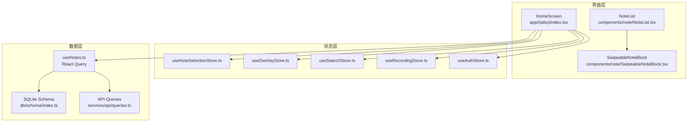
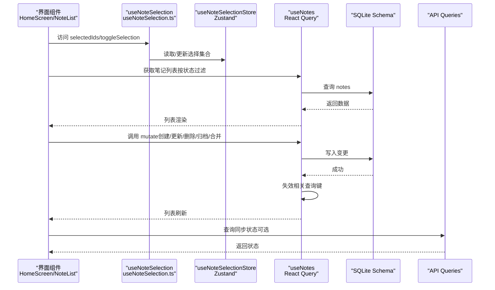
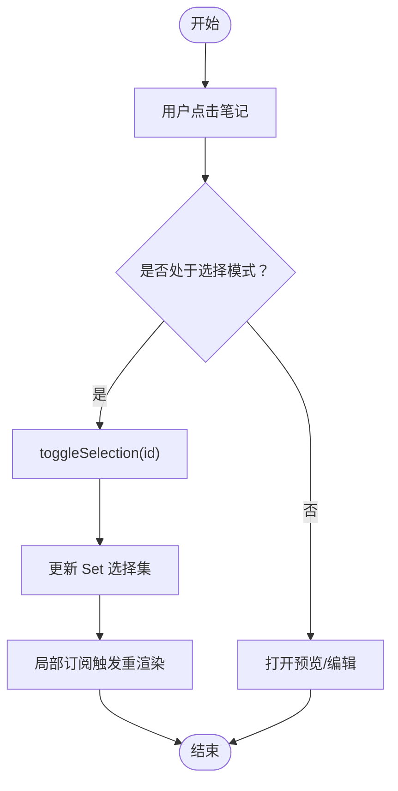
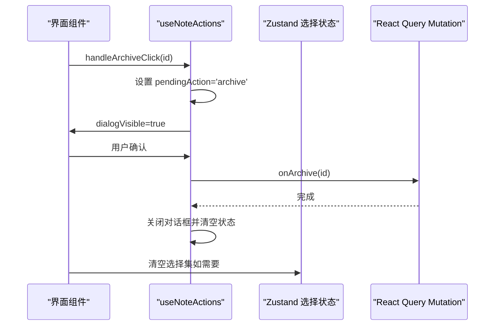
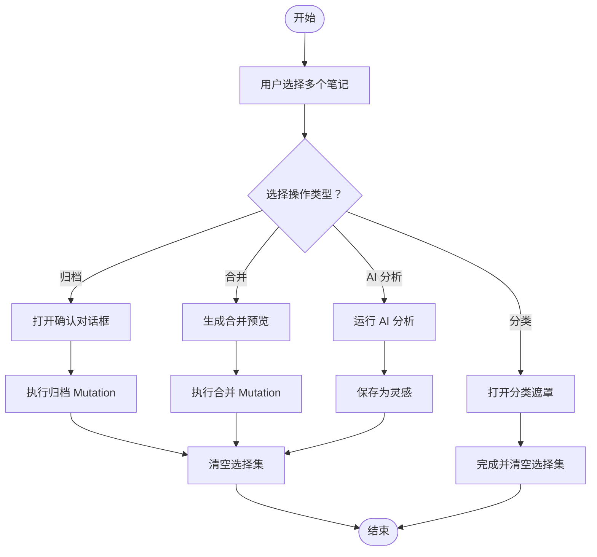
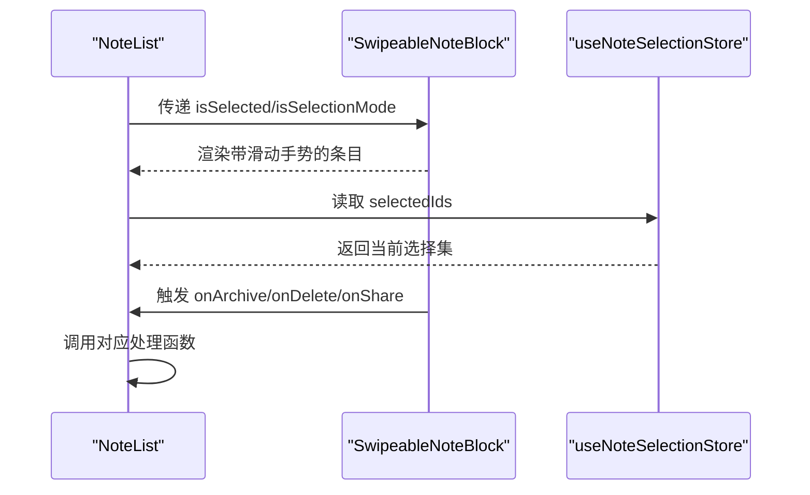
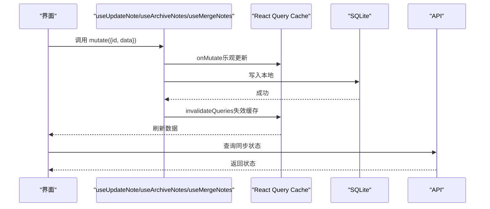
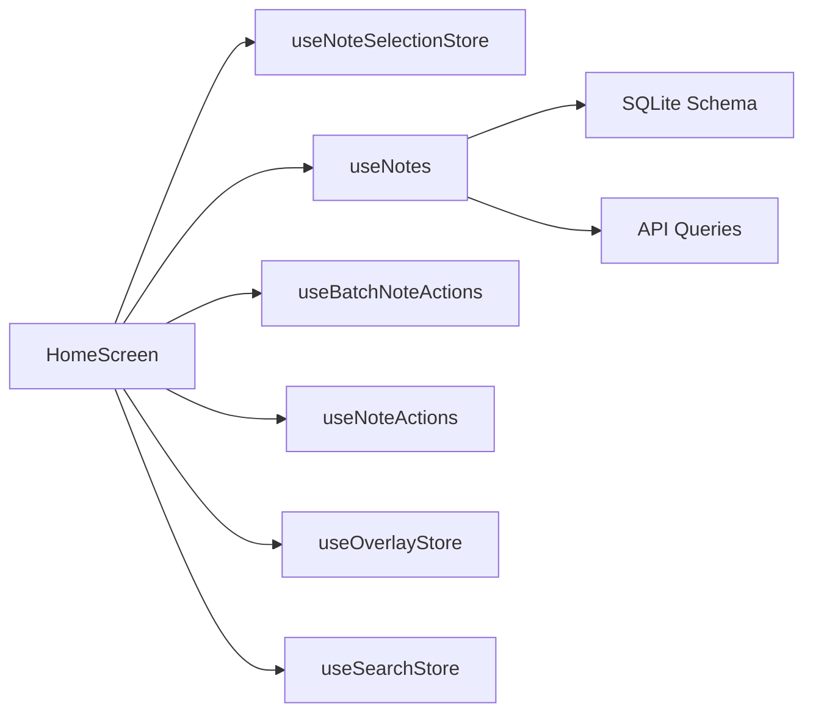

# 笔记状态管理

<cite>
**本文引用的文件**
- [store/useNoteSelectionStore.ts](file://store/useNoteSelectionStore.ts)
- [hooks/useNoteSelection.ts](file://hooks/useNoteSelection.ts)
- [hooks/useNoteActions.ts](file://hooks/useNoteActions.ts)
- [hooks/useBatchNoteActions.ts](file://hooks/useBatchNoteActions.ts)
- [hooks/useNotes.ts](file://hooks/useNotes.ts)
- [app/(tabs)/index.tsx](file://app/(tabs)/index.tsx)
- [components/note/NoteList.tsx](file://components/note/NoteList.tsx)
- [components/note/SwipeableNoteBlock.tsx](file://components/note/SwipeableNoteBlock.tsx)
- [store/useOverlayStore.ts](file://store/useOverlayStore.ts)
- [store/useSearchStore.ts](file://store/useSearchStore.ts)
- [store/useRecordingStore.ts](file://store/useRecordingStore.ts)
- [store/useAuthStore.ts](file://store/useAuthStore.ts)
- [store/index.ts](file://store/index.ts)
- [.trellis/spec/frontend/state-management.md](file://.trellis/spec/frontend/state-management.md)
- [db/schema/index.ts](file://db/schema/index.ts)
- [services/api/queries.ts](file://services/api/queries.ts)
</cite>

## 目录
1. [简介](#简介)
2. [项目结构](#项目结构)
3. [核心组件](#核心组件)
4. [架构总览](#架构总览)
5. [详细组件分析](#详细组件分析)
6. [依赖分析](#依赖分析)
7. [性能考虑](#性能考虑)
8. [故障排查指南](#故障排查指南)
9. [结论](#结论)
10. [附录](#附录)

## 简介
本文件系统性梳理该笔记应用中的“笔记状态管理”体系，重点覆盖以下方面：
- 笔记选择状态：基于 Zustand 的全局选择集合与查询派生值
- 编辑状态：通过 React Query 的乐观更新与服务端同步
- 同步状态：本地 SQLite 表结构与同步队列表的设计，以及与服务端 API 的交互
- 设计模式与实现原理：useNoteSelection Hook 与 useNoteActions Hook 的职责划分与协作
- Zustand 使用与持久化：状态拆分、局部订阅与持久化策略
- 性能优化与最佳实践：批量操作、缓存失效与渲染优化
- 扩展与自定义：如何在现有架构上新增状态域与处理流程

## 项目结构
该项目采用“分层状态管理”：
- 服务器状态（React Query）：统一管理笔记数据的读取、写入与缓存一致性
- 全局 UI 状态（Zustand）：跨页面共享的 UI 开关、搜索、输入遮罩等
- 局部状态（React useState）：组件内短期状态
- URL 状态（Expo Router 参数）：屏幕级参数驱动的视图切换

图表来源
- [app/(tabs)/index.tsx:34-482](file://app/(tabs)/index.tsx#L34-L482)
- [store/useNoteSelectionStore.ts:15-48](file://store/useNoteSelectionStore.ts#L15-L48)
- [store/useOverlayStore.ts:11-15](file://store/useOverlayStore.ts#L11-L15)
- [store/useSearchStore.ts:9-13](file://store/useSearchStore.ts#L9-L13)
- [store/useRecordingStore.ts:25-70](file://store/useRecordingStore.ts#L25-L70)
- [store/useAuthStore.ts:29-81](file://store/useAuthStore.ts#L29-L81)
- [hooks/useNotes.ts:19-216](file://hooks/useNotes.ts#L19-L216)
- [db/schema/index.ts:43-61](file://db/schema/index.ts#L43-L61)
- [services/api/queries.ts:46-99](file://services/api/queries.ts#L46-L99)

章节来源
- [.trellis/spec/frontend/state-management.md:1-78](file://.trellis/spec/frontend/state-management.md#L1-L78)
- [store/index.ts:1-8](file://store/index.ts#L1-L8)

## 核心组件
- 笔记选择状态（Zustand）
  - 状态域：Set<number> 存储选中笔记 ID
  - 动作：切换、全选、清空、查询是否选中、统计数量
  - Hook 封装：useNoteSelection 暴露数组形式的 selectedIds 与动作
- 笔记编辑状态（React Query）
  - 读取：按状态过滤或全部读取
  - 写入：创建、更新（乐观更新）、删除、归档、合并
  - 同步：成功后失效相关查询键，确保 UI 与数据库一致
- 同步状态（SQLite + API）
  - 本地表：notes、media_files、categories、sync_queue
  - 服务端接口：提供同步状态查询等 API
- UI 状态（Zustand）
  - 遮罩层开关、搜索面板开关、录音播放状态等

章节来源
- [store/useNoteSelectionStore.ts:3-48](file://store/useNoteSelectionStore.ts#L3-L48)
- [hooks/useNoteSelection.ts:3-19](file://hooks/useNoteSelection.ts#L3-L19)
- [hooks/useNotes.ts:19-216](file://hooks/useNotes.ts#L19-L216)
- [db/schema/index.ts:29-61](file://db/schema/index.ts#L29-L61)
- [services/api/queries.ts:94-99](file://services/api/queries.ts#L94-L99)
- [store/useOverlayStore.ts:3-15](file://store/useOverlayStore.ts#L3-L15)
- [store/useSearchStore.ts:3-13](file://store/useSearchStore.ts#L3-L13)
- [store/useRecordingStore.ts:3-70](file://store/useRecordingStore.ts#L3-L70)
- [store/useAuthStore.ts:12-81](file://store/useAuthStore.ts#L12-L81)

## 架构总览
整体状态流以“界面 -> Hook/Store -> 数据层（本地/远端）-> 缓存失效 -> 界面刷新”为主线。

图表来源
- [app/(tabs)/index.tsx:68-90](file://app/(tabs)/index.tsx#L68-L90)
- [hooks/useNoteSelection.ts:3-19](file://hooks/useNoteSelection.ts#L3-L19)
- [store/useNoteSelectionStore.ts:15-48](file://store/useNoteSelectionStore.ts#L15-L48)
- [hooks/useNotes.ts:19-216](file://hooks/useNotes.ts#L19-L216)
- [db/schema/index.ts:29-61](file://db/schema/index.ts#L29-L61)
- [services/api/queries.ts:94-99](file://services/api/queries.ts#L94-L99)

## 详细组件分析

### 组件一：笔记选择状态管理（useNoteSelection 与 useNoteSelectionStore）
- 设计要点
  - 选择集合以 Set<number> 存储，避免重复与 O(1) 查找
  - 通过局部订阅（selector）仅在 selectedIds 变化时重渲染
  - 提供 isSelected/getSelectionCount 等派生查询，减少重复计算
- 更新时机
  - 单个点击：toggleSelection
  - 长按进入多选：toggleSelection
  - 清空：clearSelection
  - 全选：selectAll
- 依赖关系
  - HomeScreen 从 Zustand 读取 selectedIds 并传给 NoteList
  - NoteList 将 selectedIds 传递给每个条目，用于高亮与滑动操作

图表来源
- [app/(tabs)/index.tsx:124-134](file://app/(tabs)/index.tsx#L124-L134)
- [store/useNoteSelectionStore.ts:18-47](file://store/useNoteSelectionStore.ts#L18-L47)
- [hooks/useNoteSelection.ts:4-9](file://hooks/useNoteSelection.ts#L4-L9)

章节来源
- [store/useNoteSelectionStore.ts:3-48](file://store/useNoteSelectionStore.ts#L3-L48)
- [hooks/useNoteSelection.ts:3-19](file://hooks/useNoteSelection.ts#L3-L19)
- [app/(tabs)/index.tsx:68-90](file://app/(tabs)/index.tsx#L68-L90)

### 组件二：单笔记操作与确认对话框（useNoteActions）
- 设计要点
  - 使用 React useState 管理对话框可见性与待执行动作
  - 通过回调 onArchive/onDelete 与外部 Mutation 协作
  - 支持系统分享与自定义分享回调
- 流程
  - 点击归档/删除 -> 打开确认对话框
  - 确认后调用 onArchive/onDelete
  - 取消则关闭对话框并清空待执行项

图表来源
- [hooks/useNoteActions.ts:21-79](file://hooks/useNoteActions.ts#L21-L79)
- [app/(tabs)/index.tsx:136-142](file://app/(tabs)/index.tsx#L136-L142)

章节来源
- [hooks/useNoteActions.ts:1-80](file://hooks/useNoteActions.ts#L1-L80)
- [app/(tabs)/index.tsx:136-142](file://app/(tabs)/index.tsx#L136-L142)

### 组件三：批量笔记操作（useBatchNoteActions）
- 设计要点
  - 聚合多个 UI 对话框状态：确认对话框、合并预览、AI 分析、分类
  - 基于 selectedIds 过滤当前选中笔记
  - 与 useNotes 中的 Mutation 协作完成归档、合并、创建灵感等
- 流程
  - 归档：弹出确认 -> 调用归档 Mutation -> 清空选择
  - 合并：计算字符数与预览 -> 确认 -> 调用合并 Mutation -> 清空选择
  - AI 分析：构建源笔记列表 -> 调用分析服务 -> 保存为灵感 -> 清空选择
  - 分类：打开分类遮罩 -> 保存后关闭并清空选择

图表来源
- [hooks/useBatchNoteActions.ts:55-286](file://hooks/useBatchNoteActions.ts#L55-L286)
- [hooks/useNotes.ts:122-216](file://hooks/useNotes.ts#L122-L216)

章节来源
- [hooks/useBatchNoteActions.ts:1-287](file://hooks/useBatchNoteActions.ts#L1-L287)
- [hooks/useNotes.ts:122-216](file://hooks/useNotes.ts#L122-L216)

### 组件四：笔记列表与滑动操作（NoteList 与 SwipeableNoteBlock）
- 设计要点
  - NoteList 将笔记按更新时间分组显示日期分隔符
  - SwipeableNoteBlock 提供右侧滑动手势，暴露分享、归档、删除回调
  - 通过 closeOthers 控制同时只有一个条目展开
- 与选择状态联动
  - 通过 isSelected 与 isSelectionMode 控制条目高亮与交互行为

图表来源
- [components/note/NoteList.tsx:109-205](file://components/note/NoteList.tsx#L109-L205)
- [components/note/SwipeableNoteBlock.tsx:15-93](file://components/note/SwipeableNoteBlock.tsx#L15-L93)
- [store/useNoteSelectionStore.ts:39-47](file://store/useNoteSelectionStore.ts#L39-L47)

章节来源
- [components/note/NoteList.tsx:1-240](file://components/note/NoteList.tsx#L1-L240)
- [components/note/SwipeableNoteBlock.tsx:1-131](file://components/note/SwipeableNoteBlock.tsx#L1-L131)

### 组件五：编辑状态与同步（React Query 乐观更新与服务端同步）
- 设计要点
  - 创建/更新/删除/归档/合并均通过 Mutation 实现
  - 乐观更新：先更新本地缓存，再等待服务端响应；失败时回滚
  - 失效策略：成功后失效相关查询键，强制重新拉取
- 同步状态
  - 本地存在 sync_queue 表用于记录待同步任务
  - 服务端提供同步状态查询接口

图表来源
- [hooks/useNotes.ts:61-102](file://hooks/useNotes.ts#L61-L102)
- [hooks/useNotes.ts:122-216](file://hooks/useNotes.ts#L122-L216)
- [db/schema/index.ts:43-52](file://db/schema/index.ts#L43-L52)
- [services/api/queries.ts:94-99](file://services/api/queries.ts#L94-L99)

章节来源
- [hooks/useNotes.ts:19-216](file://hooks/useNotes.ts#L19-L216)
- [db/schema/index.ts:43-52](file://db/schema/index.ts#L43-L52)
- [services/api/queries.ts:94-99](file://services/api/queries.ts#L94-L99)

### 组件六：Zustand 状态持久化与 UI 状态
- 持久化策略
  - useAuthStore 使用 persist 中间件与 AsyncStorage，支持 partialize 仅持久化必要字段
  - 其他 UI 状态（Overlay、Search、Recording）未持久化，适合临时 UI 开关
- 导出聚合
  - store/index.ts 统一导出各 Store，便于集中引入

章节来源
- [store/useAuthStore.ts:29-81](file://store/useAuthStore.ts#L29-L81)
- [store/useOverlayStore.ts:11-15](file://store/useOverlayStore.ts#L11-L15)
- [store/useSearchStore.ts:9-13](file://store/useSearchStore.ts#L9-L13)
- [store/useRecordingStore.ts:25-70](file://store/useRecordingStore.ts#L25-L70)
- [store/index.ts:1-8](file://store/index.ts#L1-L8)

## 依赖分析
- 组件耦合
  - HomeScreen 依赖多个 Hook/Store：useNoteSelectionStore、useNotes、useBatchNoteActions、useNoteActions、useOverlayStore、useSearchStore
  - NoteList 依赖 SwipeableNoteBlock，并消费选择状态
- 外部依赖
  - Zustand：全局状态
  - React Query：服务器状态与缓存
  - SQLite：本地持久化
  - AsyncStorage：Zustand 持久化存储

图表来源
- [app/(tabs)/index.tsx:68-90](file://app/(tabs)/index.tsx#L68-L90)
- [hooks/useNotes.ts:19-216](file://hooks/useNotes.ts#L19-L216)
- [db/schema/index.ts:29-61](file://db/schema/index.ts#L29-L61)
- [services/api/queries.ts:46-99](file://services/api/queries.ts#L46-L99)

章节来源
- [app/(tabs)/index.tsx:68-90](file://app/(tabs)/index.tsx#L68-L90)
- [hooks/useNotes.ts:19-216](file://hooks/useNotes.ts#L19-L216)

## 性能考虑
- 渲染优化
  - 使用局部订阅（selector）仅订阅所需字段，避免无关重渲染
  - NoteList 使用 useMemo 缓存分组结果与附件计数查询
- 批量操作
  - useBatchNoteActions 在 UI 层聚合多个对话框状态，减少重复渲染
- 缓存一致性
  - React Query 的 onMutate 与失效策略保证 UI 与服务端一致
- 选择状态
  - 以 Set 存储选择集，查询与插入均为 O(1)，适合高频交互

章节来源
- [hooks/useNoteSelection.ts:4-9](file://hooks/useNoteSelection.ts#L4-L9)
- [components/note/NoteList.tsx:123-137](file://components/note/NoteList.tsx#L123-L137)
- [hooks/useNotes.ts:69-101](file://hooks/useNotes.ts#L69-L101)

## 故障排查指南
- 选择状态不同步
  - 检查 HomeScreen 是否正确从 useNoteSelectionStore 读取 selectedIds
  - 确认 NoteList 是否将 selectedIds 传递给条目组件
- 乐观更新未生效或回滚异常
  - 检查 useUpdateNote 的 onMutate/onError/onSettled 实现
  - 确认失效键是否覆盖到目标查询
- 同步队列堆积
  - 检查本地 sync_queue 表是否有未处理任务
  - 调用服务端同步状态接口确认队列状态

章节来源
- [app/(tabs)/index.tsx:68-90](file://app/(tabs)/index.tsx#L68-L90)
- [hooks/useNotes.ts:69-101](file://hooks/useNotes.ts#L69-L101)
- [db/schema/index.ts:43-52](file://db/schema/index.ts#L43-L52)
- [services/api/queries.ts:94-99](file://services/api/queries.ts#L94-L99)

## 结论
该笔记应用采用“React Query + Zustand”的分层状态管理方案：
- 服务器状态由 React Query 统一管理，确保数据一致性与缓存效率
- 全局 UI 状态由 Zustand 管理，结合持久化中间件满足跨页需求
- 选择状态与批量操作通过 Hook 抽象，形成清晰的职责边界
- 本地 SQLite 与同步队列表为离线与冲突处理提供基础
建议在扩展新功能时遵循现有模式：优先使用 React Query 管理服务器数据，Zustand 管理 UI 状态，合理使用持久化与局部订阅，保持状态更新路径单一且可追踪。

## 附录
- 状态持久化最佳实践
  - 仅对必要的 UI 状态启用持久化（如用户信息）
  - 使用 partialize 精简持久化字段，降低存储体积
- 扩展建议
  - 新增状态域时，先在 store 下创建独立文件，再通过 store/index.ts 聚合导出
  - 与 UI 状态相关的逻辑放入 Hook，避免在组件中直接操作 Store
  - 对高频交互的状态使用 Set 或 Map，提升查找与去重效率