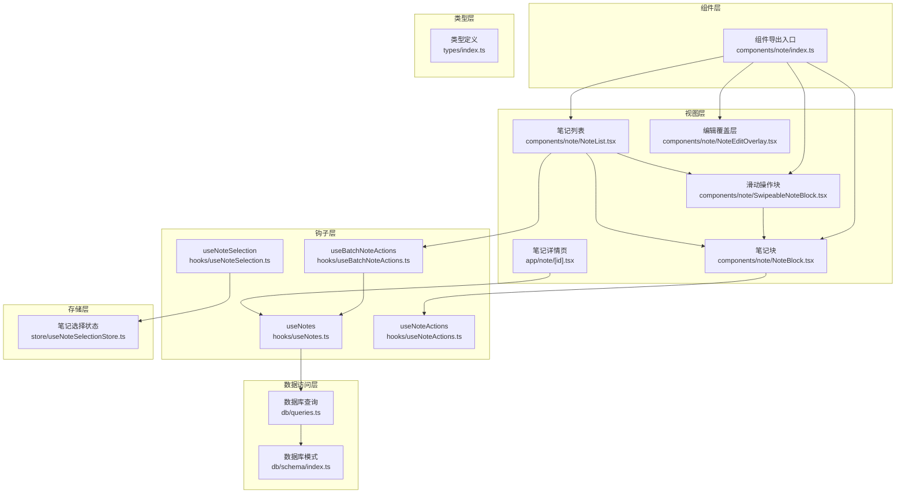
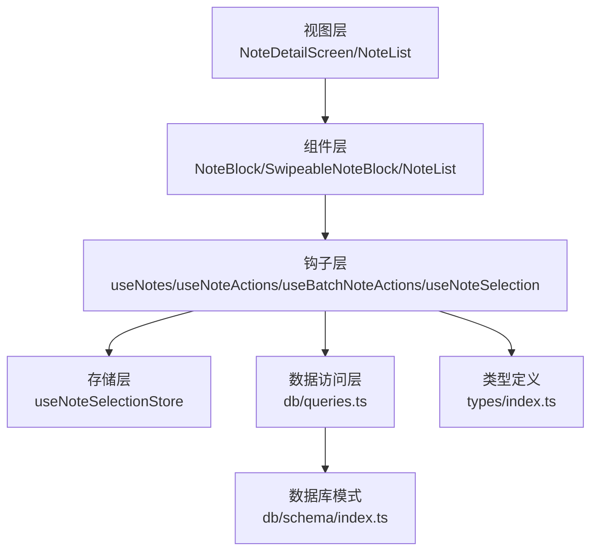
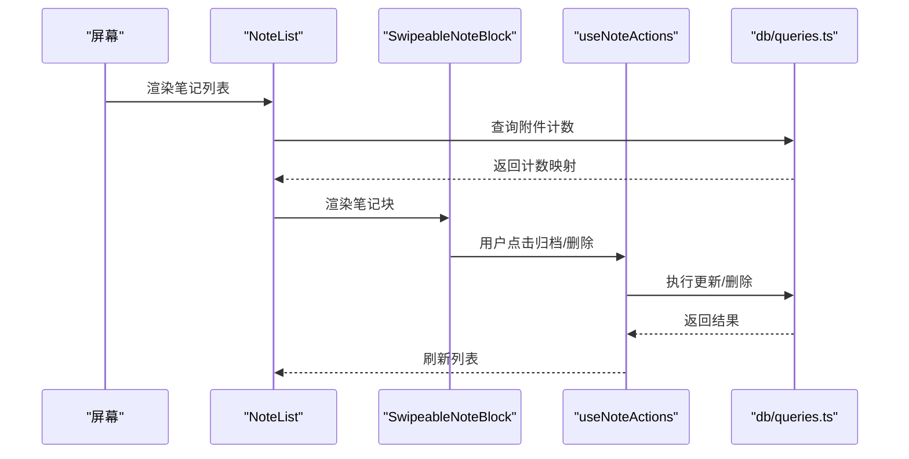
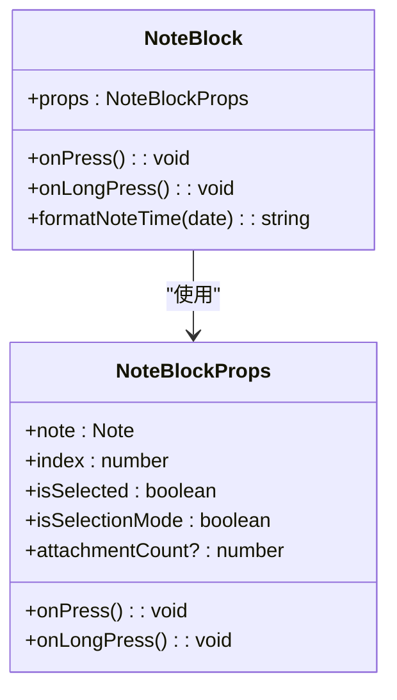
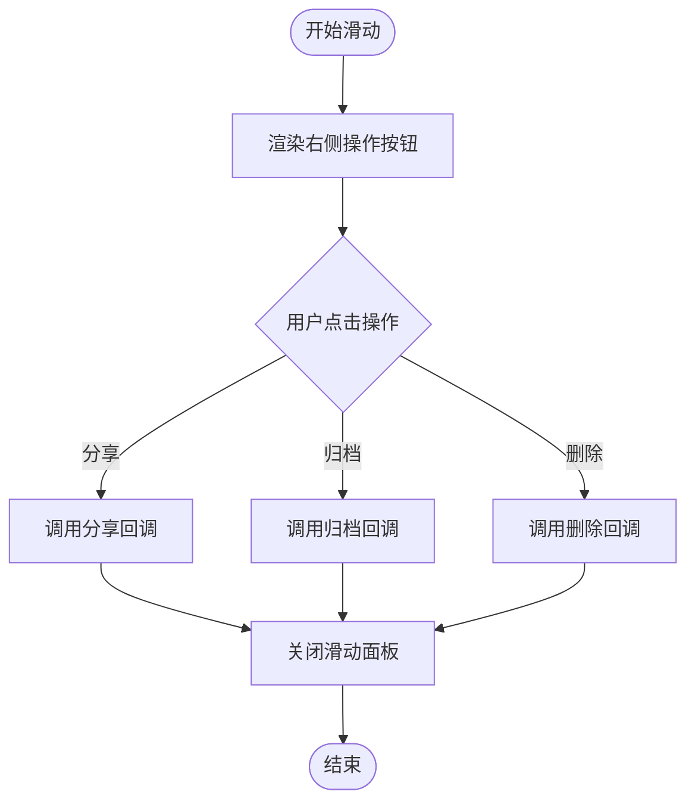
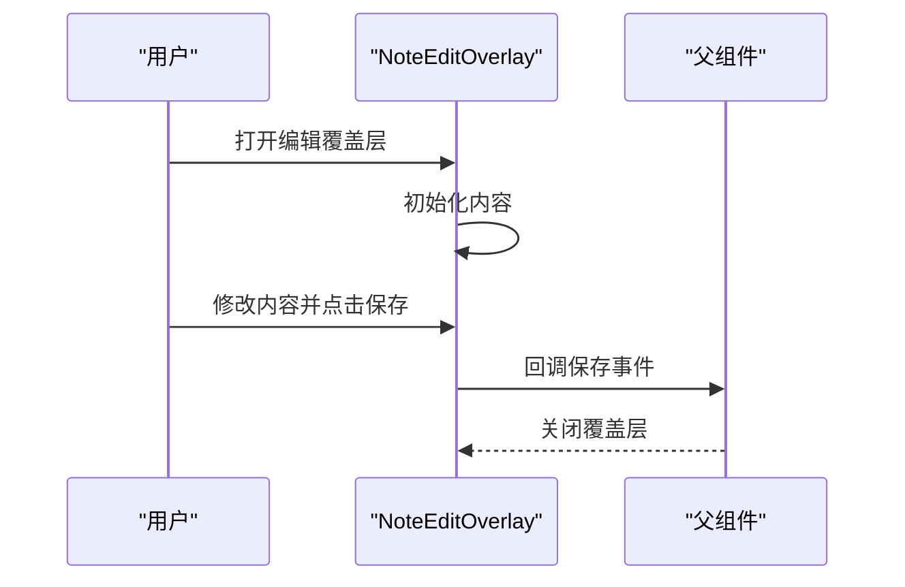
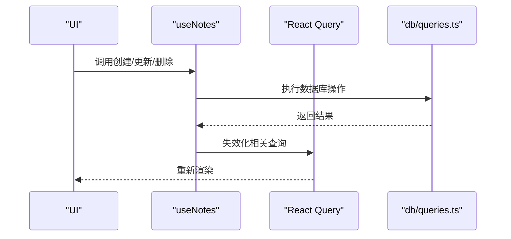
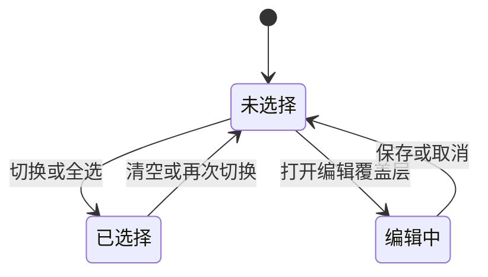
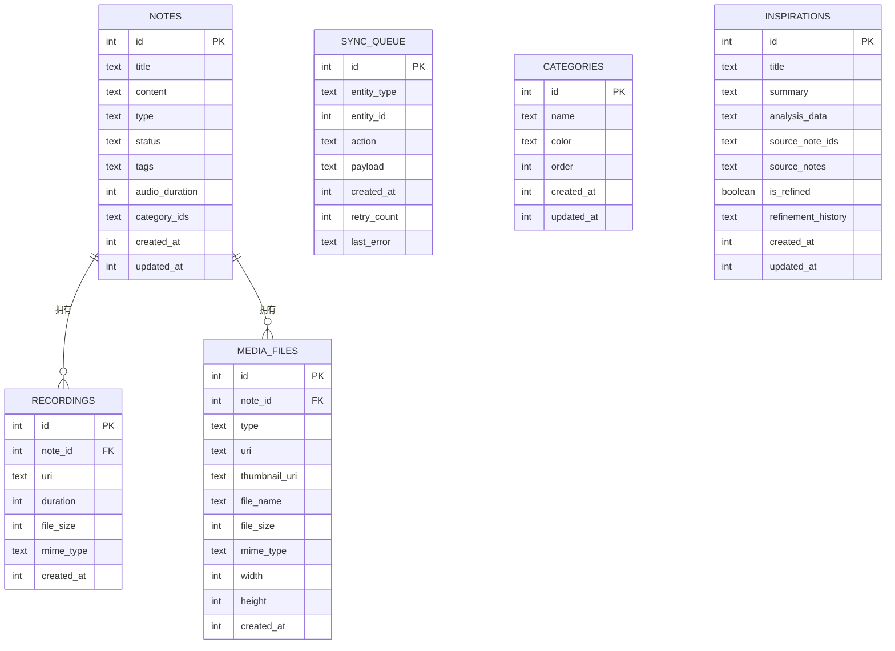
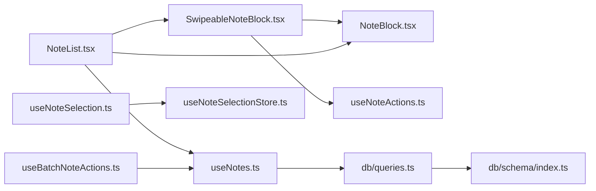

# 笔记管理模块

<cite>
**本文档引用的文件**
- [components/note/index.ts](file://components/note/index.ts)
- [hooks/useNotes.ts](file://hooks/useNotes.ts)
- [hooks/useNoteActions.ts](file://hooks/useNoteActions.ts)
- [hooks/useBatchNoteActions.ts](file://hooks/useBatchNoteActions.ts)
- [hooks/useNoteSelection.ts](file://hooks/useNoteSelection.ts)
- [store/useNoteSelectionStore.ts](file://store/useNoteSelectionStore.ts)
- [db/queries.ts](file://db/queries.ts)
- [db/schema/index.ts](file://db/schema/index.ts)
- [components/note/NoteList.tsx](file://components/note/NoteList.tsx)
- [components/note/SwipeableNoteBlock.tsx](file://components/note/SwipeableNoteBlock.tsx)
- [components/note/NoteBlock.tsx](file://components/note/NoteBlock.tsx)
- [components/note/NoteEditOverlay.tsx](file://components/note/NoteEditOverlay.tsx)
- [app/note/[id].tsx](file://app/note/[id].tsx)
- [services/api/queries.ts](file://services/api/queries.ts)
- [types/index.ts](file://types/index.ts)
</cite>

## 目录
1. [简介](#简介)
2. [项目结构](#项目结构)
3. [核心组件](#核心组件)
4. [架构总览](#架构总览)
5. [详细组件分析](#详细组件分析)
6. [依赖关系分析](#依赖关系分析)
7. [性能考虑](#性能考虑)
8. [故障排除指南](#故障排除指南)
9. [结论](#结论)
10. [附录](#附录)

## 简介
本文件为笔记管理模块的综合技术文档，涵盖笔记系统的整体架构与实现细节，包括笔记的创建、编辑、删除、查询等核心功能；笔记列表组件的实现原理（虚拟滚动、批量操作、状态管理）；笔记编辑覆盖层的设计模式与交互流程；笔记状态管理机制（选择状态、编辑状态、同步状态）；笔记数据模型与数据库查询优化策略；最佳实践与用户体验优化建议；以及扩展与定制的技术指导。

## 项目结构
笔记管理模块采用分层架构设计：
- 视图层：负责用户界面渲染与交互，如笔记列表、笔记块、滑动操作、编辑覆盖层等。
- 组件层：封装可复用的 UI 组件，如 NoteList、SwipeableNoteBlock、NoteBlock、NoteEditOverlay 等。
- 钩子层：封装数据获取与变更逻辑，如 useNotes、useNoteActions、useBatchNoteActions、useNoteSelection 等。
- 存储层：使用 Zustand 管理轻量级应用状态，如笔记选择状态。
- 数据访问层：通过 Drizzle ORM 访问本地 SQLite 数据库，提供笔记、录音、媒体、分类、灵感等查询。
- 类型层：统一定义笔记、录音、媒体、同步状态等类型。

**图表来源**
- [components/note/index.ts:1-40](file://components/note/index.ts#L1-L40)
- [hooks/useNotes.ts:1-217](file://hooks/useNotes.ts#L1-L217)
- [hooks/useNoteActions.ts:1-80](file://hooks/useNoteActions.ts#L1-L80)
- [hooks/useBatchNoteActions.ts:1-287](file://hooks/useBatchNoteActions.ts#L1-L287)
- [hooks/useNoteSelection.ts:1-20](file://hooks/useNoteSelection.ts#L1-L20)
- [store/useNoteSelectionStore.ts:1-49](file://store/useNoteSelectionStore.ts#L1-L49)
- [db/queries.ts:1-286](file://db/queries.ts#L1-L286)
- [db/schema/index.ts:1-75](file://db/schema/index.ts#L1-L75)
- [components/note/NoteList.tsx:1-240](file://components/note/NoteList.tsx#L1-L240)
- [components/note/SwipeableNoteBlock.tsx:1-131](file://components/note/SwipeableNoteBlock.tsx#L1-L131)
- [components/note/NoteBlock.tsx:1-171](file://components/note/NoteBlock.tsx#L1-L171)
- [components/note/NoteEditOverlay.tsx:1-86](file://components/note/NoteEditOverlay.tsx#L1-L86)
- [app/note/[id].tsx:1-80](file://app/note/[id].tsx#L1-L80)
- [types/index.ts:1-98](file://types/index.ts#L1-L98)

**章节来源**
- [components/note/index.ts:1-40](file://components/note/index.ts#L1-L40)
- [hooks/useNotes.ts:1-217](file://hooks/useNotes.ts#L1-L217)
- [hooks/useNoteActions.ts:1-80](file://hooks/useNoteActions.ts#L1-L80)
- [hooks/useBatchNoteActions.ts:1-287](file://hooks/useBatchNoteActions.ts#L1-L287)
- [hooks/useNoteSelection.ts:1-20](file://hooks/useNoteSelection.ts#L1-L20)
- [store/useNoteSelectionStore.ts:1-49](file://store/useNoteSelectionStore.ts#L1-L49)
- [db/queries.ts:1-286](file://db/queries.ts#L1-L286)
- [db/schema/index.ts:1-75](file://db/schema/index.ts#L1-L75)
- [components/note/NoteList.tsx:1-240](file://components/note/NoteList.tsx#L1-L240)
- [components/note/SwipeableNoteBlock.tsx:1-131](file://components/note/SwipeableNoteBlock.tsx#L1-L131)
- [components/note/NoteBlock.tsx:1-171](file://components/note/NoteBlock.tsx#L1-L171)
- [components/note/NoteEditOverlay.tsx:1-86](file://components/note/NoteEditOverlay.tsx#L1-L86)
- [app/note/[id].tsx:1-80](file://app/note/[id].tsx#L1-L80)
- [types/index.ts:1-98](file://types/index.ts#L1-L98)

## 核心组件
- 笔记列表组件：支持按日期分组、下拉刷新、附件计数预取、滑动手势操作。
- 笔记块组件：展示笔记内容、时间戳、附件徽章、选择状态。
- 滑动操作块：提供分享、归档、删除等快捷操作。
- 编辑覆盖层：弹窗式编辑器，支持保存与关闭。
- 钩子函数：封装笔记 CRUD、批量操作、选择状态管理、动作确认对话框。
- 存储：Zustand 管理笔记选择集合。
- 数据访问：Drizzle ORM 提供笔记、录音、媒体、分类、灵感等查询。

**章节来源**
- [components/note/NoteList.tsx:1-240](file://components/note/NoteList.tsx#L1-L240)
- [components/note/NoteBlock.tsx:1-171](file://components/note/NoteBlock.tsx#L1-L171)
- [components/note/SwipeableNoteBlock.tsx:1-131](file://components/note/SwipeableNoteBlock.tsx#L1-L131)
- [components/note/NoteEditOverlay.tsx:1-86](file://components/note/NoteEditOverlay.tsx#L1-L86)
- [hooks/useNotes.ts:1-217](file://hooks/useNotes.ts#L1-L217)
- [hooks/useBatchNoteActions.ts:1-287](file://hooks/useBatchNoteActions.ts#L1-L287)
- [hooks/useNoteActions.ts:1-80](file://hooks/useNoteActions.ts#L1-L80)
- [hooks/useNoteSelection.ts:1-20](file://hooks/useNoteSelection.ts#L1-L20)
- [store/useNoteSelectionStore.ts:1-49](file://store/useNoteSelectionStore.ts#L1-L49)
- [db/queries.ts:1-286](file://db/queries.ts#L1-L286)

## 架构总览
笔记管理模块采用“视图-组件-钩子-存储-数据访问”的分层架构，配合 TanStack React Query 实现数据缓存与乐观更新，Drizzle ORM 进行本地数据库访问，Zustand 管理轻量状态，形成高效、可维护的笔记系统。

**图表来源**
- [app/note/[id].tsx:1-80](file://app/note/[id].tsx#L1-L80)
- [components/note/NoteList.tsx:1-240](file://components/note/NoteList.tsx#L1-L240)
- [hooks/useNotes.ts:1-217](file://hooks/useNotes.ts#L1-L217)
- [hooks/useNoteActions.ts:1-80](file://hooks/useNoteActions.ts#L1-L80)
- [hooks/useBatchNoteActions.ts:1-287](file://hooks/useBatchNoteActions.ts#L1-L287)
- [hooks/useNoteSelection.ts:1-20](file://hooks/useNoteSelection.ts#L1-L20)
- [store/useNoteSelectionStore.ts:1-49](file://store/useNoteSelectionStore.ts#L1-L49)
- [db/queries.ts:1-286](file://db/queries.ts#L1-L286)
- [db/schema/index.ts:1-75](file://db/schema/index.ts#L1-L75)
- [types/index.ts:1-98](file://types/index.ts#L1-L98)

## 详细组件分析

### 笔记列表组件（NoteList）
- 虚拟滚动：基于 FlashList 渲染大量笔记项，提升性能。
- 日期分组：按“今天/昨天/本周/本月/今年”等分组显示，增强可读性。
- 附件计数：通过媒体查询一次性获取多条笔记的附件数量，避免逐条查询。
- 下拉刷新：集成 RefreshControl，触发数据刷新。
- 滑动操作：每个笔记项支持右侧滑动执行分享、归档、删除等操作。

**图表来源**
- [components/note/NoteList.tsx:1-240](file://components/note/NoteList.tsx#L1-L240)
- [components/note/SwipeableNoteBlock.tsx:1-131](file://components/note/SwipeableNoteBlock.tsx#L1-L131)
- [hooks/useNoteActions.ts:1-80](file://hooks/useNoteActions.ts#L1-L80)
- [db/queries.ts:1-286](file://db/queries.ts#L1-L286)

**章节来源**
- [components/note/NoteList.tsx:1-240](file://components/note/NoteList.tsx#L1-L240)
- [db/queries.ts:117-132](file://db/queries.ts#L117-L132)

### 笔记块组件（NoteBlock）
- 展示笔记内容、更新时间、附件数量徽章。
- 支持选择模式下的勾选框与高亮。
- 长按触发生理反馈，区分长按与短按行为。

**图表来源**
- [components/note/NoteBlock.tsx:1-171](file://components/note/NoteBlock.tsx#L1-L171)
- [types/index.ts:54-62](file://types/index.ts#L54-L62)

**章节来源**
- [components/note/NoteBlock.tsx:1-171](file://components/note/NoteBlock.tsx#L1-L171)
- [types/index.ts:54-62](file://types/index.ts#L54-L62)

### 滑动操作块（SwipeableNoteBlock）
- 右滑显示操作按钮：分享、归档、删除。
- 关闭其他已打开的滑动面板，避免冲突。
- 支持隐藏归档按钮（在归档标签页）。

**图表来源**
- [components/note/SwipeableNoteBlock.tsx:1-131](file://components/note/SwipeableNoteBlock.tsx#L1-L131)

**章节来源**
- [components/note/SwipeableNoteBlock.tsx:1-131](file://components/note/SwipeableNoteBlock.tsx#L1-L131)

### 笔记编辑覆盖层（NoteEditOverlay）
- 弹窗式编辑器，支持标题栏保存与关闭。
- 基于状态管理内容，保存后关闭覆盖层。

**图表来源**
- [components/note/NoteEditOverlay.tsx:1-86](file://components/note/NoteEditOverlay.tsx#L1-L86)

**章节来源**
- [components/note/NoteEditOverlay.tsx:1-86](file://components/note/NoteEditOverlay.tsx#L1-L86)

### 笔记 CRUD 与批量操作
- 创建：useCreateNote 使用乐观更新策略，立即更新缓存并在失败时回滚。
- 更新：useUpdateNote 支持乐观更新，先更新本地缓存再同步服务器。
- 删除：useDeleteNote 删除后失效化相关查询。
- 批量归档：useArchiveNotes 并发更新多个笔记状态。
- 合并笔记：useMergeNotes 聚合内容、标签、音频时长，创建新笔记并归档源笔记。

**图表来源**
- [hooks/useNotes.ts:46-117](file://hooks/useNotes.ts#L46-L117)
- [db/queries.ts:35-57](file://db/queries.ts#L35-L57)

**章节来源**
- [hooks/useNotes.ts:46-117](file://hooks/useNotes.ts#L46-L117)
- [hooks/useNotes.ts:122-138](file://hooks/useNotes.ts#L122-L138)
- [hooks/useNotes.ts:144-216](file://hooks/useNotes.ts#L144-L216)
- [db/queries.ts:35-57](file://db/queries.ts#L35-L57)

### 笔记状态管理机制
- 选择状态：Zustand 状态管理，支持切换、全选、清空、查询数量。
- 编辑状态：覆盖层控制可见性与保存。
- 同步状态：通过 React Query 的失效化与乐观更新保证 UI 与数据一致。

**图表来源**
- [store/useNoteSelectionStore.ts:1-49](file://store/useNoteSelectionStore.ts#L1-L49)
- [hooks/useNoteSelection.ts:1-20](file://hooks/useNoteSelection.ts#L1-L20)
- [components/note/NoteEditOverlay.tsx:1-86](file://components/note/NoteEditOverlay.tsx#L1-L86)

**章节来源**
- [store/useNoteSelectionStore.ts:1-49](file://store/useNoteSelectionStore.ts#L1-L49)
- [hooks/useNoteSelection.ts:1-20](file://hooks/useNoteSelection.ts#L1-L20)
- [hooks/useNotes.ts:68-101](file://hooks/useNotes.ts#L68-L101)

### 笔记数据模型与数据库查询优化
- 数据模型：笔记、录音、媒体、分类、灵感等实体，包含主键、枚举字段、JSON 字段、时间戳等。
- 查询优化：
  - 通过索引加速状态与类型的查询。
  - 批量查询附件数量，减少 N+1 查询。
  - 使用 SQL 片段进行复合条件查询。
  - 乐观更新与失效化策略降低网络请求频率。

**图表来源**
- [db/schema/index.ts:1-75](file://db/schema/index.ts#L1-L75)

**章节来源**
- [db/schema/index.ts:1-75](file://db/schema/index.ts#L1-L75)
- [db/queries.ts:117-132](file://db/queries.ts#L117-L132)
- [db/queries.ts:24-28](file://db/queries.ts#L24-L28)

## 依赖关系分析
- 组件依赖：NoteList 依赖 SwipeableNoteBlock 与 NoteBlock；SwipeableNoteBlock 依赖 NoteBlock。
- 钩子依赖：useNotes 依赖 db/queries.ts；useBatchNoteActions 依赖 useNotes 与 AI 分析服务；useNoteActions 提供动作确认与分享能力。
- 存储依赖：useNoteSelection 依赖 useNoteSelectionStore。
- 数据访问依赖：db/queries.ts 依赖 db/schema/index.ts 与 Drizzle ORM。

**图表来源**
- [components/note/NoteList.tsx:1-240](file://components/note/NoteList.tsx#L1-L240)
- [components/note/SwipeableNoteBlock.tsx:1-131](file://components/note/SwipeableNoteBlock.tsx#L1-L131)
- [components/note/NoteBlock.tsx:1-171](file://components/note/NoteBlock.tsx#L1-L171)
- [hooks/useNotes.ts:1-217](file://hooks/useNotes.ts#L1-L217)
- [hooks/useNoteActions.ts:1-80](file://hooks/useNoteActions.ts#L1-L80)
- [hooks/useBatchNoteActions.ts:1-287](file://hooks/useBatchNoteActions.ts#L1-L287)
- [hooks/useNoteSelection.ts:1-20](file://hooks/useNoteSelection.ts#L1-L20)
- [store/useNoteSelectionStore.ts:1-49](file://store/useNoteSelectionStore.ts#L1-L49)
- [db/queries.ts:1-286](file://db/queries.ts#L1-L286)
- [db/schema/index.ts:1-75](file://db/schema/index.ts#L1-L75)

**章节来源**
- [components/note/NoteList.tsx:1-240](file://components/note/NoteList.tsx#L1-L240)
- [hooks/useNotes.ts:1-217](file://hooks/useNotes.ts#L1-L217)
- [db/queries.ts:1-286](file://db/queries.ts#L1-L286)

## 性能考虑
- 虚拟滚动：使用 FlashList 渲染大量笔记项，显著降低内存占用与重绘成本。
- 乐观更新：useUpdateNote 在本地立即反映更改，减少等待时间，失败时自动回滚。
- 批量查询：一次性获取多条笔记的附件数量，避免多次网络/数据库往返。
- 索引优化：在 notes 表上为 status 与 type 建立索引，加速过滤查询。
- 失效化策略：统一失效化相关查询，确保缓存一致性且不阻塞 UI。

[本节为通用性能建议，无需特定文件来源]

## 故障排除指南
- 笔记列表空白或加载缓慢
  - 检查是否正确传入 noteIds 并启用查询。
  - 确认数据库索引是否存在。
- 滑动操作冲突
  - 确保每次滑动时调用关闭其他面板的方法。
- 保存后未更新
  - 确认乐观更新成功并触发了失效化。
- 分享失败
  - 捕获异常并提示用户取消或重试。

**章节来源**
- [components/note/NoteList.tsx:133-137](file://components/note/NoteList.tsx#L133-L137)
- [db/schema/index.ts:14-17](file://db/schema/index.ts#L14-L17)
- [hooks/useNotes.ts:68-101](file://hooks/useNotes.ts#L68-L101)
- [hooks/useNoteActions.ts:31-38](file://hooks/useNoteActions.ts#L31-L38)

## 结论
笔记管理模块通过清晰的分层架构、高效的虚拟滚动、完善的乐观更新与批量操作机制，提供了流畅的笔记 CRUD 体验。结合 Zustand 的轻量状态管理与 Drizzle ORM 的数据库访问，系统具备良好的可维护性与扩展性。建议在实际部署中关注索引配置、查询批量化与错误处理，以进一步提升性能与稳定性。

[本节为总结性内容，无需特定文件来源]

## 附录

### 笔记 CRUD 操作实现要点（路径指引）
- 创建笔记
  - 钩子：[hooks/useNotes.ts:46-55](file://hooks/useNotes.ts#L46-L55)
  - 数据库：[db/queries.ts:35-44](file://db/queries.ts#L35-L44)
- 更新笔记
  - 钩子：[hooks/useNotes.ts:61-101](file://hooks/useNotes.ts#L61-L101)
  - 数据库：[db/queries.ts:47-52](file://db/queries.ts#L47-L52)
- 删除笔记
  - 钩子：[hooks/useNotes.ts:107-116](file://hooks/useNotes.ts#L107-L116)
  - 数据库：[db/queries.ts:55-57](file://db/queries.ts#L55-L57)
- 批量归档
  - 钩子：[hooks/useNotes.ts:122-138](file://hooks/useNotes.ts#L122-L138)
- 合并笔记
  - 钩子：[hooks/useNotes.ts:144-216](file://hooks/useNotes.ts#L144-L216)
  - 数据库：[db/queries.ts:35-57](file://db/queries.ts#L35-L57)

### 笔记状态管理（路径指引）
- 选择状态
  - 钩子：[hooks/useNoteSelection.ts:1-20](file://hooks/useNoteSelection.ts#L1-L20)
  - 存储：[store/useNoteSelectionStore.ts:1-49](file://store/useNoteSelectionStore.ts#L1-L49)
- 编辑状态
  - 覆盖层：[components/note/NoteEditOverlay.tsx:1-86](file://components/note/NoteEditOverlay.tsx#L1-L86)
- 同步状态
  - 钩子：[hooks/useNotes.ts:68-101](file://hooks/useNotes.ts#L68-L101)

### 笔记数据模型（路径指引）
- 模型定义
  - 类型：[types/index.ts:54-98](file://types/index.ts#L54-L98)
- 数据库模式
  - 模式：[db/schema/index.ts:1-75](file://db/schema/index.ts#L1-L75)
- 查询优化
  - 查询：[db/queries.ts:117-132](file://db/queries.ts#L117-L132)