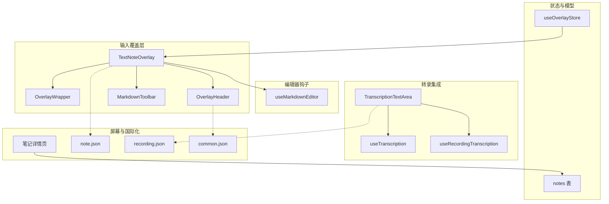
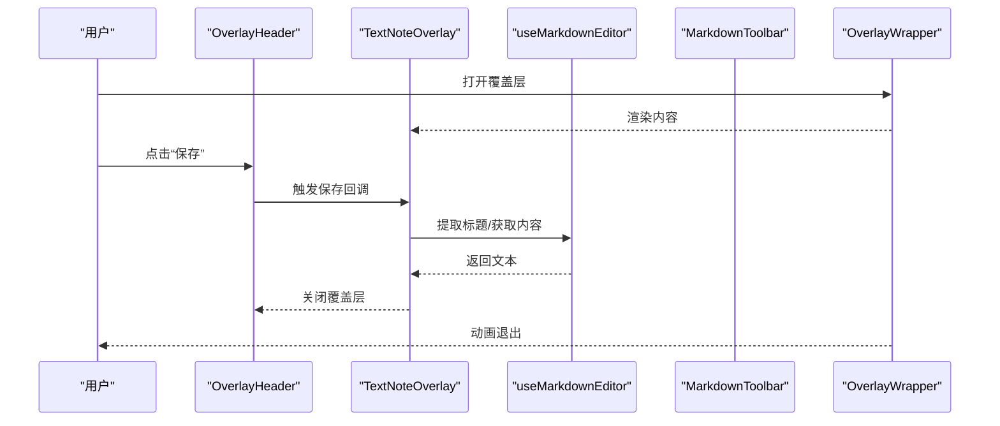
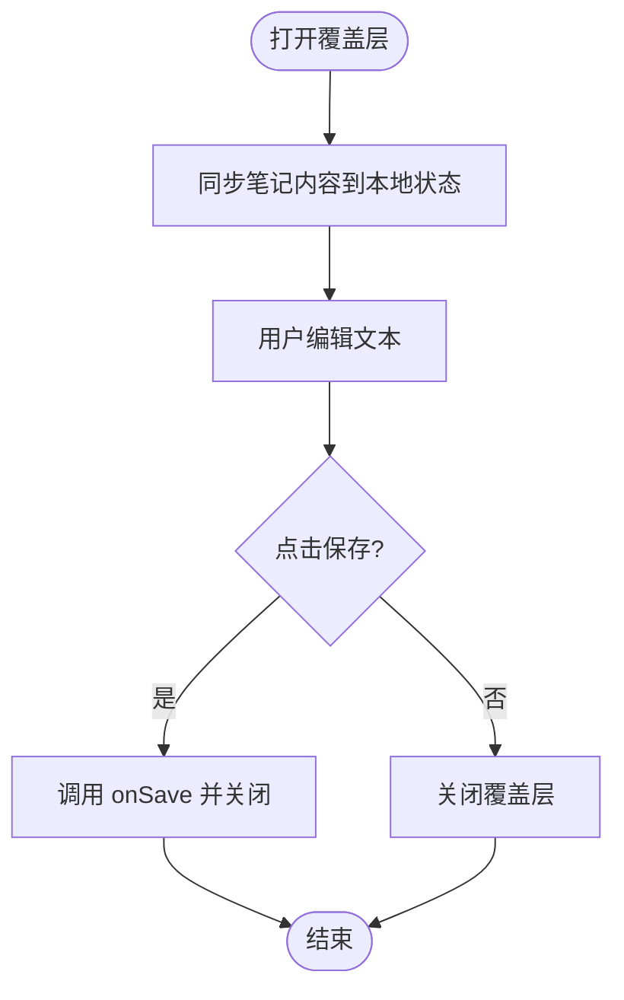
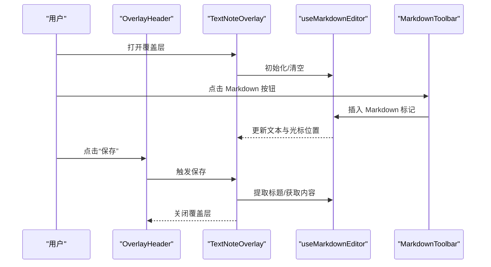
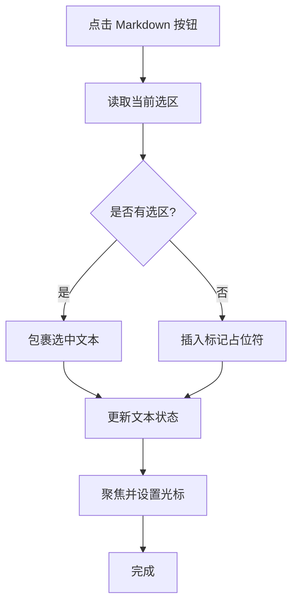
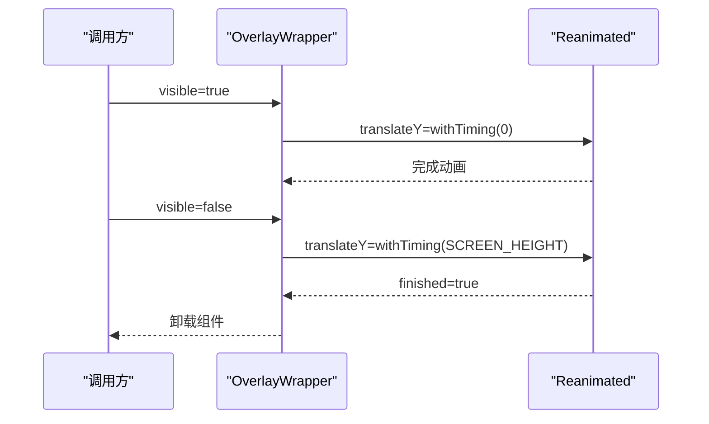
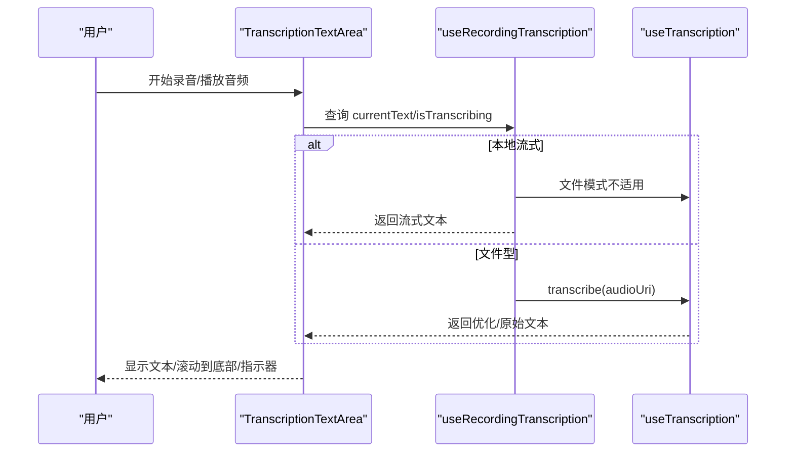
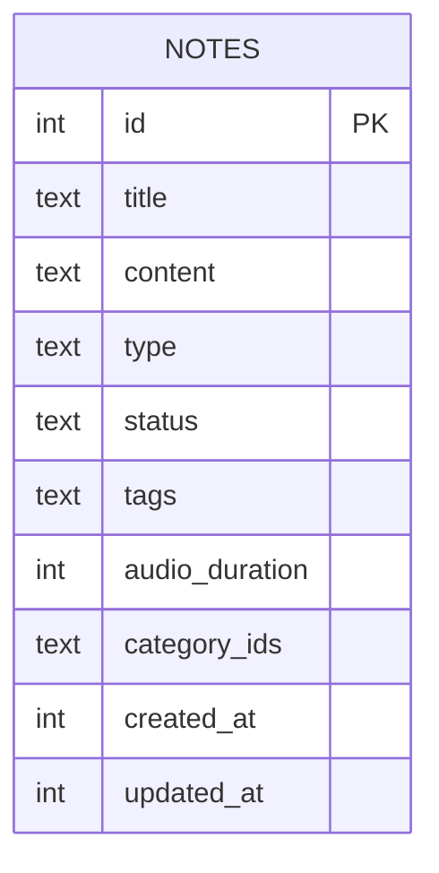
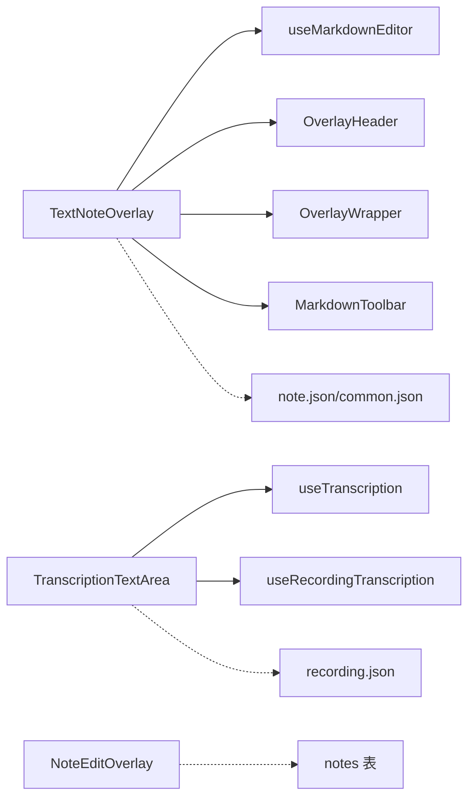

# 笔记编辑覆盖层

<cite>
**本文引用的文件**
- [NoteEditOverlay.tsx](file://components/note/NoteEditOverlay.tsx)
- [TextNoteOverlay.tsx](file://components/input/TextNoteOverlay.tsx)
- [MarkdownToolbar.tsx](file://components/input/MarkdownToolbar.tsx)
- [useMarkdownEditor.ts](file://hooks/useMarkdownEditor.ts)
- [OverlayWrapper.tsx](file://components/input/OverlayWrapper.tsx)
- [OverlayHeader.tsx](file://components/input/OverlayHeader.tsx)
- [TranscriptionTextArea.tsx](file://components/input/TranscriptionTextArea.tsx)
- [useTranscription.ts](file://hooks/useTranscription.ts)
- [useRecordingTranscription.ts](file://hooks/useRecordingTranscription.ts)
- [useOverlayStore.ts](file://store/useOverlayStore.ts)
- [index.ts](file://components/input/index.ts)
- [schema/index.ts](file://db/schema/index.ts)
- [app/note/[id].tsx](file://app/note/[id].tsx)
- [note.json](file://i18n/locales/zh-CN/note.json)
- [recording.json](file://i18n/locales/zh-CN/recording.json)
- [common.json](file://i18n/locales/zh-CN/common.json)
- [tamagui.config.ts](file://theme/tamagui.config.ts)
</cite>

## 目录
1. [简介](#简介)
2. [项目结构](#项目结构)
3. [核心组件](#核心组件)
4. [架构总览](#架构总览)
5. [详细组件分析](#详细组件分析)
6. [依赖关系分析](#依赖关系分析)
7. [性能考量](#性能考量)
8. [故障排查指南](#故障排查指南)
9. [结论](#结论)
10. [附录：可定制与扩展建议](#附录可定制与扩展建议)

## 简介
本文件聚焦“笔记编辑覆盖层”的设计与实现，系统性解析以下主题：
- NoteEditOverlay 的交互与数据流
- 文本编辑覆盖层（富文本/Markdown）的实现原理与工具链
- 转录文本区域的集成与数据流管理
- 编辑模式切换、数据绑定、实时保存策略
- 动画与过渡效果的实现
- 编辑状态管理与数据同步机制
- 可定制性与扩展性说明

## 项目结构
围绕“笔记编辑覆盖层”，涉及的核心模块如下：
- 输入覆盖层与工具：OverlayWrapper、OverlayHeader、MarkdownToolbar、TextNoteOverlay
- 编辑器钩子：useMarkdownEditor
- 转录集成：TranscriptionTextArea、useTranscription、useRecordingTranscription
- 状态存储：useOverlayStore
- 数据模型：notes 表结构
- 屏幕与国际化：笔记详情页、翻译资源

**图表来源**
- [OverlayWrapper.tsx:20-54](file://components/input/OverlayWrapper.tsx#L20-L54)
- [OverlayHeader.tsx:13-41](file://components/input/OverlayHeader.tsx#L13-L41)
- [MarkdownToolbar.tsx:31-54](file://components/input/MarkdownToolbar.tsx#L31-L54)
- [TextNoteOverlay.tsx:15-66](file://components/input/TextNoteOverlay.tsx#L15-L66)
- [useMarkdownEditor.ts:12-141](file://hooks/useMarkdownEditor.ts#L12-L141)
- [TranscriptionTextArea.tsx:64-145](file://components/input/TranscriptionTextArea.tsx#L64-L145)
- [useTranscription.ts:22-103](file://hooks/useTranscription.ts#L22-L103)
- [useRecordingTranscription.ts:74-195](file://hooks/useRecordingTranscription.ts#L74-L195)
- [useOverlayStore.ts:11-15](file://store/useOverlayStore.ts#L11-L15)
- [schema/index.ts:3-17](file://db/schema/index.ts#L3-L17)
- [app/note/[id].tsx](file://app/note/[id].tsx#L6-L79)
- [note.json:1-36](file://i18n/locales/zh-CN/note.json#L1-L36)
- [recording.json:1-16](file://i18n/locales/zh-CN/recording.json#L1-L16)
- [common.json:1-22](file://i18n/locales/zh-CN/common.json#L1-L22)

**章节来源**
- [OverlayWrapper.tsx:20-54](file://components/input/OverlayWrapper.tsx#L20-L54)
- [OverlayHeader.tsx:13-41](file://components/input/OverlayHeader.tsx#L13-L41)
- [MarkdownToolbar.tsx:31-54](file://components/input/MarkdownToolbar.tsx#L31-L54)
- [TextNoteOverlay.tsx:15-66](file://components/input/TextNoteOverlay.tsx#L15-L66)
- [useMarkdownEditor.ts:12-141](file://hooks/useMarkdownEditor.ts#L12-L141)
- [TranscriptionTextArea.tsx:64-145](file://components/input/TranscriptionTextArea.tsx#L64-L145)
- [useTranscription.ts:22-103](file://hooks/useTranscription.ts#L22-L103)
- [useRecordingTranscription.ts:74-195](file://hooks/useRecordingTranscription.ts#L74-L195)
- [useOverlayStore.ts:11-15](file://store/useOverlayStore.ts#L11-L15)
- [schema/index.ts:3-17](file://db/schema/index.ts#L3-L17)
- [app/note/[id].tsx](file://app/note/[id].tsx#L6-L79)
- [note.json:1-36](file://i18n/locales/zh-CN/note.json#L1-L36)
- [recording.json:1-16](file://i18n/locales/zh-CN/recording.json#L1-L16)
- [common.json:1-22](file://i18n/locales/zh-CN/common.json#L1-L22)

## 核心组件
- NoteEditOverlay：基础文本编辑覆盖层，支持打开/关闭、内容绑定、保存回调
- TextNoteOverlay：富文本/Markdown 文本笔记覆盖层，集成 Markdown 工具栏、标题提取、保存逻辑
- MarkdownToolbar：Markdown 快捷操作按钮集合
- useMarkdownEditor：Markdown 编辑器状态与操作（插入标记、光标定位、标题提取）
- OverlayWrapper：覆盖层容器，负责动画入场/退场与遮罩
- OverlayHeader：覆盖层头部，统一的取消/保存按钮
- TranscriptionTextArea：转录文本区域，支持编辑态与只读态、滚动与指示器
- useTranscription/useRecordingTranscription：转录状态与优化流程
- useOverlayStore：全局覆盖层类型状态
- notes 表：笔记数据模型（含 content 字段）

**章节来源**
- [NoteEditOverlay.tsx:15-57](file://components/note/NoteEditOverlay.tsx#L15-L57)
- [TextNoteOverlay.tsx:15-66](file://components/input/TextNoteOverlay.tsx#L15-L66)
- [MarkdownToolbar.tsx:31-54](file://components/input/MarkdownToolbar.tsx#L31-L54)
- [useMarkdownEditor.ts:12-141](file://hooks/useMarkdownEditor.ts#L12-L141)
- [OverlayWrapper.tsx:20-54](file://components/input/OverlayWrapper.tsx#L20-L54)
- [OverlayHeader.tsx:13-41](file://components/input/OverlayHeader.tsx#L13-L41)
- [TranscriptionTextArea.tsx:64-145](file://components/input/TranscriptionTextArea.tsx#L64-L145)
- [useTranscription.ts:22-103](file://hooks/useTranscription.ts#L22-L103)
- [useRecordingTranscription.ts:74-195](file://hooks/useRecordingTranscription.ts#L74-L195)
- [useOverlayStore.ts:11-15](file://store/useOverlayStore.ts#L11-L15)
- [schema/index.ts:3-17](file://db/schema/index.ts#L3-L17)

## 架构总览
编辑覆盖层由“容器 + 头部 + 工具栏 + 编辑器 + 状态钩子 + 转录集成”构成，采用自上而下的数据流与事件流：

**图表来源**
- [OverlayWrapper.tsx:28-42](file://components/input/OverlayWrapper.tsx#L28-L42)
- [OverlayHeader.tsx:30-38](file://components/input/OverlayHeader.tsx#L30-L38)
- [TextNoteOverlay.tsx:24-30](file://components/input/TextNoteOverlay.tsx#L24-L30)
- [useMarkdownEditor.ts:132-140](file://hooks/useMarkdownEditor.ts#L132-L140)

## 详细组件分析

### NoteEditOverlay 组件
- 设计目标：提供最小可用的笔记内容编辑覆盖层
- 关键特性
  - 基于 Modal 的滑动进入/退出动画
  - 头部左右按钮：左侧关闭、右侧保存
  - 单行或多行文本输入，支持 autoFocus
  - 通过 props 接收可见性、当前笔记、保存回调
- 数据绑定与保存
  - 初次打开时从 note.content 同步到本地状态
  - 保存时调用 onSave 回调并关闭覆盖层
- 交互流程

**图表来源**
- [NoteEditOverlay.tsx:19-28](file://components/note/NoteEditOverlay.tsx#L19-L28)

**章节来源**
- [NoteEditOverlay.tsx:15-57](file://components/note/NoteEditOverlay.tsx#L15-L57)

### 文本编辑覆盖层（TextNoteOverlay）
- 设计目标：提供富文本/Markdown 编辑体验
- 组成
  - OverlayHeader：统一的标题、取消、保存
  - MarkdownToolbar：快捷 Markdown 操作
  - TextInput：多行编辑，支持光标选择与自动聚焦
  - useMarkdownEditor：状态与操作封装
- 数据绑定与保存
  - 打开时清空编辑器内容
  - 保存前 trim 并提取首行标题，调用 onSave({ title, content })
  - 保存成功后清空并关闭
- 实时体验
  - 自动聚焦与顶部对齐
  - 提示“支持 Markdown 语法”

**图表来源**
- [TextNoteOverlay.tsx:15-35](file://components/input/TextNoteOverlay.tsx#L15-L35)
- [MarkdownToolbar.tsx:31-54](file://components/input/MarkdownToolbar.tsx#L31-L54)
- [useMarkdownEditor.ts:21-124](file://hooks/useMarkdownEditor.ts#L21-L124)

**章节来源**
- [TextNoteOverlay.tsx:15-66](file://components/input/TextNoteOverlay.tsx#L15-L66)
- [MarkdownToolbar.tsx:31-54](file://components/input/MarkdownToolbar.tsx#L31-L54)
- [useMarkdownEditor.ts:12-141](file://hooks/useMarkdownEditor.ts#L12-L141)

### Markdown 工具栏（MarkdownToolbar）
- 功能：提供标题、加粗、斜体、列表、引用、链接等 Markdown 快捷插入
- 交互：按钮按下触发 onAction，由上层 useMarkdownEditor 处理
- 样式：带分隔线与按下反馈

**章节来源**
- [MarkdownToolbar.tsx:31-54](file://components/input/MarkdownToolbar.tsx#L31-L54)

### Markdown 编辑器钩子（useMarkdownEditor）
- 状态
  - text：当前编辑文本
  - inputRef：用于聚焦与设置光标
  - selectionRef：当前选区
- 核心能力
  - insertMarkdown：根据选区或光标位置插入 Markdown 标记，并自动调整光标
  - insertTextAtCursor：在光标处插入文本并保持光标位置
  - extractTitle：从首行提取标题
  - onSelectionChange：更新选区
- 光标与焦点
  - 插入后使用 setNativeProps 设置 selection，确保光标正确跳转

**图表来源**
- [useMarkdownEditor.ts:17-124](file://hooks/useMarkdownEditor.ts#L17-L124)

**章节来源**
- [useMarkdownEditor.ts:12-141](file://hooks/useMarkdownEditor.ts#L12-L141)

### 覆盖层容器与动画（OverlayWrapper、OverlayHeader）
- OverlayWrapper
  - 使用 react-native-reanimated 实现从底部滑入/滑出
  - visible=true 时 translateY 从屏幕高度动画至 0；visible=false 时反向动画并在完成后卸载
- OverlayHeader
  - 统一的标题、取消、保存按钮，支持禁用保存

**图表来源**
- [OverlayWrapper.tsx:28-42](file://components/input/OverlayWrapper.tsx#L28-L42)

**章节来源**
- [OverlayWrapper.tsx:20-54](file://components/input/OverlayWrapper.tsx#L20-L54)
- [OverlayHeader.tsx:13-41](file://components/input/OverlayHeader.tsx#L13-L41)

### 转录文本区域（TranscriptionTextArea）与转录钩子
- TranscriptionTextArea
  - 编辑态：TextInput 支持多行、自动换行、顶部对齐
  - 只读态：显示转录文本，支持自动滚动到底部
  - 加载态：转录中/优化中显示旋转指示器
  - 录音中：显示闪烁光标
- useTranscription
  - 管理原始转录、优化后文本、错误、是否配置
  - 自动优化与模式切换（raw/optimized）
- useRecordingTranscription
  - 统一本地流式与文件型转录的接口
  - 在本地模式下提供 startStreaming/stopStreaming，在文件模式下调用 transcribe

**图表来源**
- [TranscriptionTextArea.tsx:64-145](file://components/input/TranscriptionTextArea.tsx#L64-L145)
- [useRecordingTranscription.ts:74-195](file://hooks/useRecordingTranscription.ts#L74-L195)
- [useTranscription.ts:22-103](file://hooks/useTranscription.ts#L22-L103)

**章节来源**
- [TranscriptionTextArea.tsx:64-145](file://components/input/TranscriptionTextArea.tsx#L64-L145)
- [useTranscription.ts:22-103](file://hooks/useTranscription.ts#L22-L103)
- [useRecordingTranscription.ts:74-195](file://hooks/useRecordingTranscription.ts#L74-L195)

### 编辑状态管理与数据同步
- 状态来源
  - useOverlayStore：管理当前激活的覆盖层类型
  - TextNoteOverlay：打开时清空编辑器，保存后关闭
  - NoteEditOverlay：打开时同步笔记内容，保存后关闭
- 数据同步策略
  - 覆盖层内部使用受控组件（useState + onChange），避免外部状态污染
  - 保存时通过回调将最新内容回传给调用方，再由调用方进行持久化与刷新
- 数据模型
  - notes 表包含 id、title、content、type、status、tags、createdAt、updatedAt 等字段
  - 编辑覆盖层主要影响 content 与 title（通过首行标题提取）

**图表来源**
- [schema/index.ts:3-17](file://db/schema/index.ts#L3-L17)

**章节来源**
- [useOverlayStore.ts:11-15](file://store/useOverlayStore.ts#L11-L15)
- [TextNoteOverlay.tsx:20-30](file://components/input/TextNoteOverlay.tsx#L20-L30)
- [NoteEditOverlay.tsx:19-28](file://components/note/NoteEditOverlay.tsx#L19-L28)
- [schema/index.ts:3-17](file://db/schema/index.ts#L3-L17)

## 依赖关系分析
- 组件耦合
  - TextNoteOverlay 依赖 useMarkdownEditor、OverlayHeader、OverlayWrapper、MarkdownToolbar
  - TranscriptionTextArea 依赖 useTranscription/useRecordingTranscription
  - NoteEditOverlay 为独立覆盖层，可被任意调用方复用
- 外部依赖
  - react-native-reanimated：覆盖层动画
  - lucide-react-native：图标
  - tamagui：主题与动画配置
  - i18n：多语言资源

**图表来源**
- [TextNoteOverlay.tsx:15-66](file://components/input/TextNoteOverlay.tsx#L15-L66)
- [useMarkdownEditor.ts:12-141](file://hooks/useMarkdownEditor.ts#L12-L141)
- [OverlayHeader.tsx:13-41](file://components/input/OverlayHeader.tsx#L13-L41)
- [OverlayWrapper.tsx:20-54](file://components/input/OverlayWrapper.tsx#L20-L54)
- [MarkdownToolbar.tsx:31-54](file://components/input/MarkdownToolbar.tsx#L31-L54)
- [TranscriptionTextArea.tsx:64-145](file://components/input/TranscriptionTextArea.tsx#L64-L145)
- [useTranscription.ts:22-103](file://hooks/useTranscription.ts#L22-L103)
- [useRecordingTranscription.ts:74-195](file://hooks/useRecordingTranscription.ts#L74-L195)
- [schema/index.ts:3-17](file://db/schema/index.ts#L3-L17)
- [note.json:1-36](file://i18n/locales/zh-CN/note.json#L1-L36)
- [recording.json:1-16](file://i18n/locales/zh-CN/recording.json#L1-L16)
- [common.json:1-22](file://i18n/locales/zh-CN/common.json#L1-L22)

**章节来源**
- [TextNoteOverlay.tsx:15-66](file://components/input/TextNoteOverlay.tsx#L15-L66)
- [useMarkdownEditor.ts:12-141](file://hooks/useMarkdownEditor.ts#L12-L141)
- [OverlayHeader.tsx:13-41](file://components/input/OverlayHeader.tsx#L13-L41)
- [OverlayWrapper.tsx:20-54](file://components/input/OverlayWrapper.tsx#L20-L54)
- [MarkdownToolbar.tsx:31-54](file://components/input/MarkdownToolbar.tsx#L31-L54)
- [TranscriptionTextArea.tsx:64-145](file://components/input/TranscriptionTextArea.tsx#L64-L145)
- [useTranscription.ts:22-103](file://hooks/useTranscription.ts#L22-L103)
- [useRecordingTranscription.ts:74-195](file://hooks/useRecordingTranscription.ts#L74-L195)
- [schema/index.ts:3-17](file://db/schema/index.ts#L3-L17)
- [note.json:1-36](file://i18n/locales/zh-CN/note.json#L1-L36)
- [recording.json:1-16](file://i18n/locales/zh-CN/recording.json#L1-L16)
- [common.json:1-22](file://i18n/locales/zh-CN/common.json#L1-L22)

## 性能考量
- 动画性能
  - OverlayWrapper 使用 useSharedValue + withTiming，避免强制重排
  - 动画缓动使用 Easing.out/Easing.in cubic，保证顺滑
- 编辑性能
  - useMarkdownEditor 对返回对象进行 useMemo 包装，减少不必要的重渲染
  - 文本插入后延迟聚焦与设置光标，避免主线程阻塞
- 转录性能
  - useRecordingTranscription 将两个模式的 reset 函数存入 ref，避免依赖变化导致的不稳定引用
  - TranscriptionTextArea 在文本更新后异步滚动到底部，降低抖动

**章节来源**
- [OverlayWrapper.tsx:22-42](file://components/input/OverlayWrapper.tsx#L22-L42)
- [useMarkdownEditor.ts:132-141](file://hooks/useMarkdownEditor.ts#L132-L141)
- [useRecordingTranscription.ts:85-93](file://hooks/useRecordingTranscription.ts#L85-L93)
- [TranscriptionTextArea.tsx:77-84](file://components/input/TranscriptionTextArea.tsx#L77-L84)

## 故障排查指南
- 无法打开覆盖层
  - 检查 useOverlayStore 的 activeOverlay 与 visible 参数传递
  - OverlayWrapper 在 mounted=false 时不渲染，确认 visible 切换顺序
- 保存无效
  - TextNoteOverlay 仅在文本非空时启用保存按钮，检查 trim 逻辑
  - NoteEditOverlay 需要传入 note 且 visible 为 true 才会同步内容
- Markdown 插入异常
  - 确认 inputRef 已正确传入 TextInput
  - 插入后需等待微任务再设置光标，避免聚焦冲突
- 转录不显示
  - useTranscription 需要先配置 ASR，检查 isConfigured
  - useRecordingTranscription 在本地模式下需要 startStreaming/stopStreaming 正确调用

**章节来源**
- [useOverlayStore.ts:11-15](file://store/useOverlayStore.ts#L11-L15)
- [OverlayWrapper.tsx:44-54](file://components/input/OverlayWrapper.tsx#L44-L54)
- [TextNoteOverlay.tsx:24-30](file://components/input/TextNoteOverlay.tsx#L24-L30)
- [NoteEditOverlay.tsx:19-23](file://components/note/NoteEditOverlay.tsx#L19-L23)
- [useMarkdownEditor.ts:106-124](file://hooks/useMarkdownEditor.ts#L106-L124)
- [useTranscription.ts:86-87](file://hooks/useTranscription.ts#L86-L87)
- [useRecordingTranscription.ts:98-120](file://hooks/useRecordingTranscription.ts#L98-L120)

## 结论
笔记编辑覆盖层以“容器 + 工具 + 钩子 + 转录集成”的方式构建，具备：
- 清晰的交互边界与数据流
- 可插拔的 Markdown 工具栏
- 流畅的动画与过渡效果
- 可扩展的转录与优化能力
- 良好的性能与可维护性

## 附录：可定制与扩展建议
- 自定义编辑器
  - 替换 TextInput 为第三方富文本库（如 react-native-pell 或 react-native-render-html），通过 useMarkdownEditor 的 insertTextAtCursor 与 extractTitle 作为桥接
- 自定义保存策略
  - 在 onSave 中增加防抖/节流与本地缓存，结合 useNotes 的更新逻辑实现离线优先
- 转录增强
  - 在 useRecordingTranscription 中接入更多 ASR Provider，或在本地模式下增加拼写纠错与术语识别
- 主题与动画
  - 通过 tamagui.config.ts 的 tokens 与 animations 调整颜色、圆角、阴影与动画曲线，适配品牌风格
- 国际化扩展
  - 在 note.json、recording.json、common.json 中新增键值，配合 useTranslation 使用

**章节来源**
- [useMarkdownEditor.ts:112-140](file://hooks/useMarkdownEditor.ts#L112-L140)
- [useRecordingTranscription.ts:74-195](file://hooks/useRecordingTranscription.ts#L74-L195)
- [tamagui.config.ts:23-42](file://theme/tamagui.config.ts#L23-L42)
- [note.json:1-36](file://i18n/locales/zh-CN/note.json#L1-L36)
- [recording.json:1-16](file://i18n/locales/zh-CN/recording.json#L1-L16)
- [common.json:1-22](file://i18n/locales/zh-CN/common.json#L1-L22)