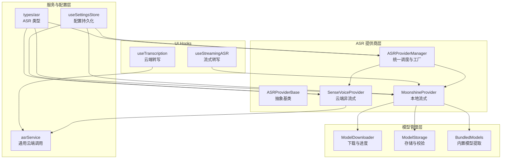
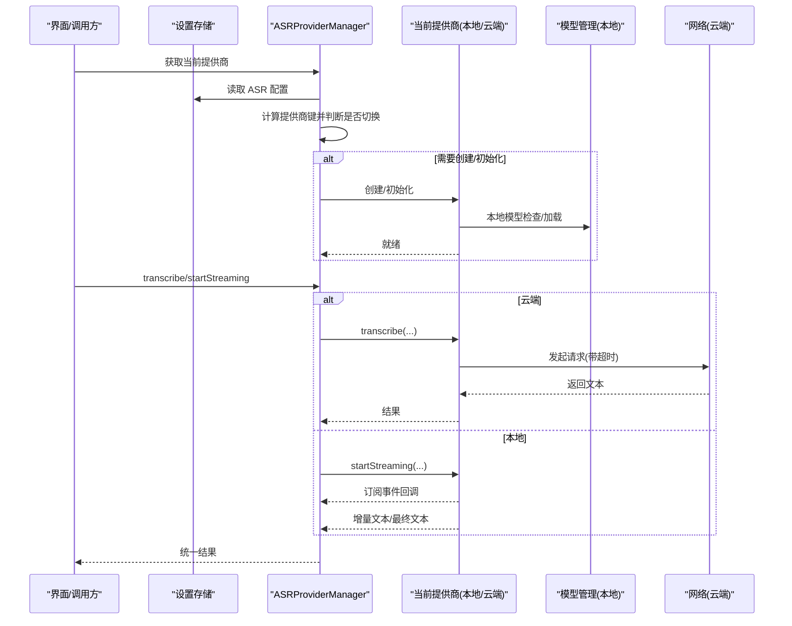
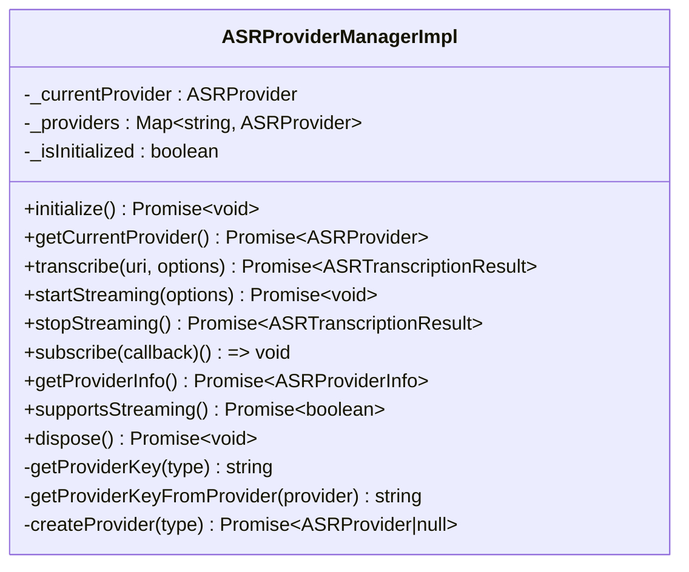
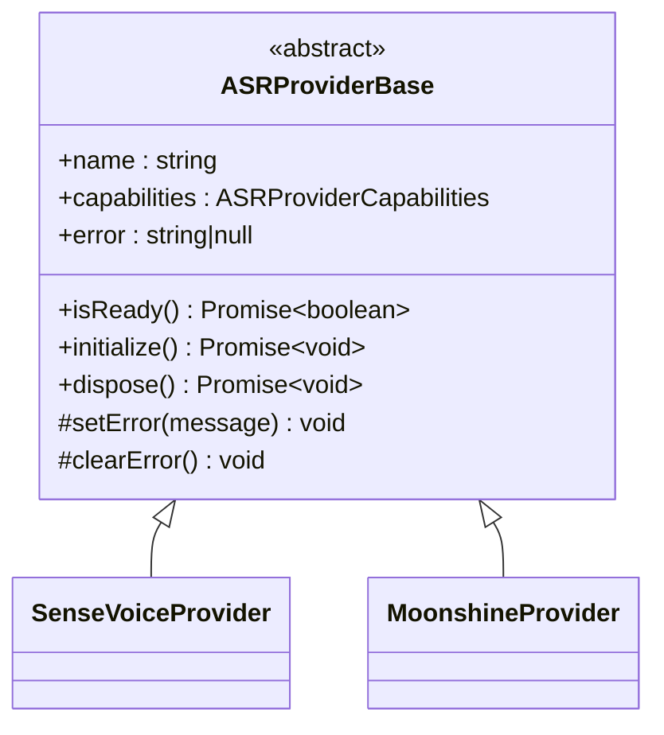
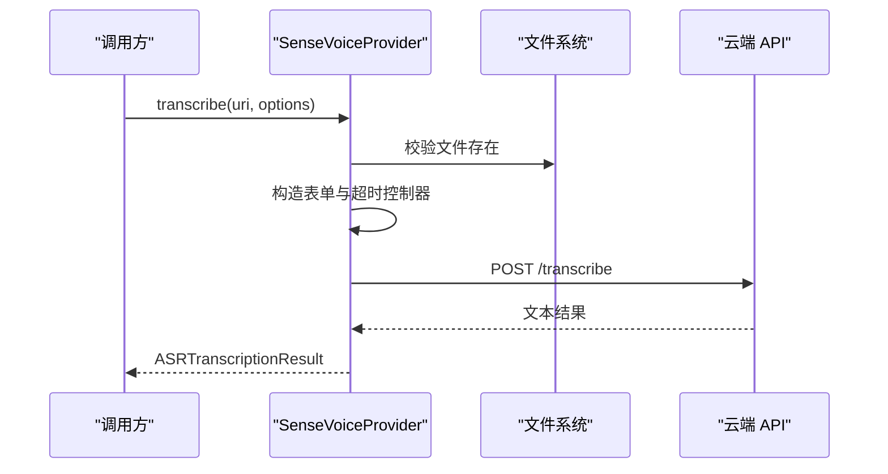
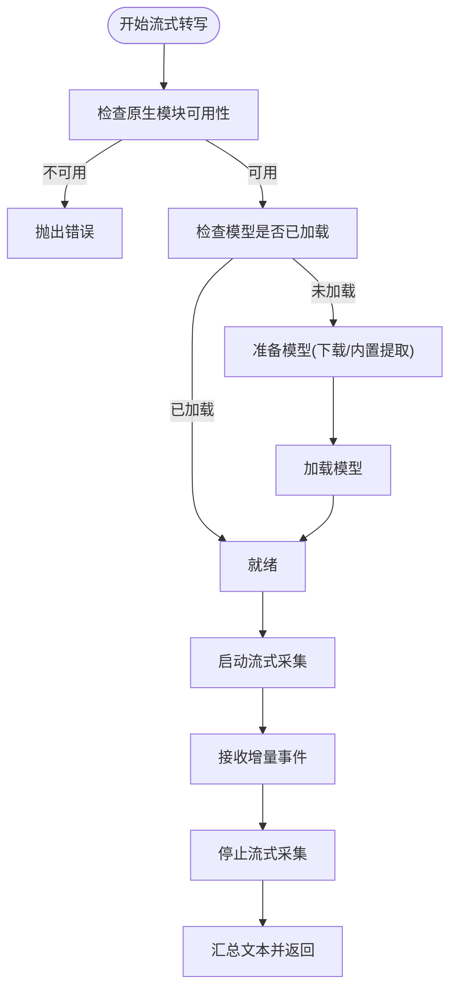
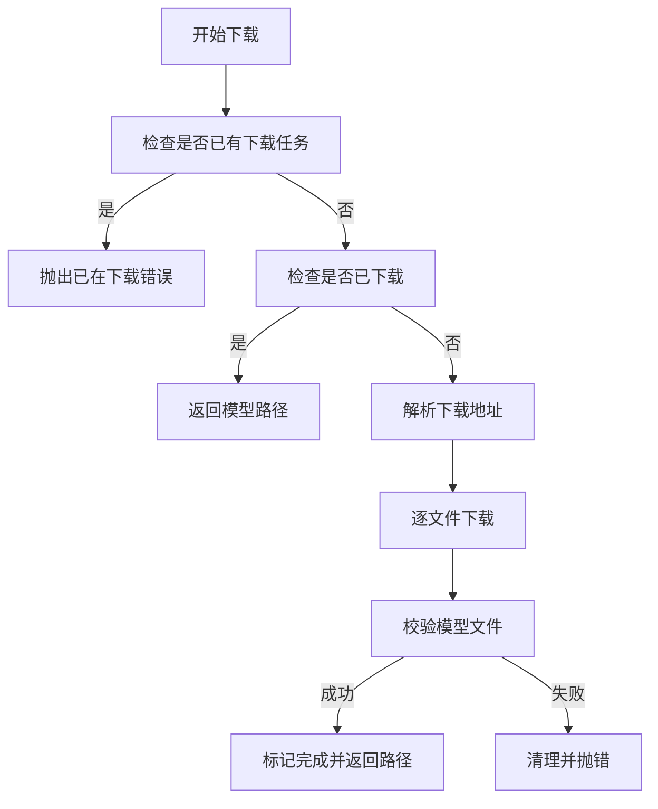
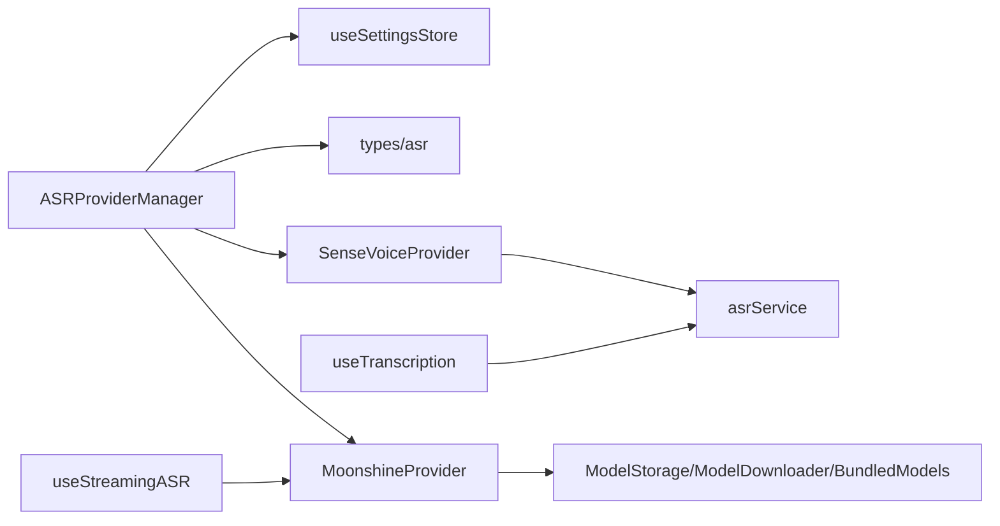

# ASR 服务管理

<cite>
**本文引用的文件**
- [ASRProviderManager.ts](file://services/asr/providers/ASRProviderManager.ts)
- [ASRProviderBase.ts](file://services/asr/providers/base/ASRProviderBase.ts)
- [types.ts（提供商接口）](file://services/asr/providers/types.ts)
- [SenseVoiceProvider.ts](file://services/asr/providers/cloud/SenseVoiceProvider.ts)
- [MoonshineProvider.ts](file://services/asr/providers/local/MoonshineProvider.ts)
- [asrService.ts](file://services/asr/asrService.ts)
- [types.ts（ASR 类型）](file://types/asr.ts)
- [useSettingsStore.ts](file://store/useSettingsStore.ts)
- [ModelDownloader.ts](file://services/asr/modelManager/ModelDownloader.ts)
- [ModelStorage.ts](file://services/asr/modelManager/ModelStorage.ts)
- [BundledModels.ts](file://services/asr/modelManager/BundledModels.ts)
- [types.ts（模型管理类型）](file://services/asr/modelManager/types.ts)
- [useStreamingASR.ts](file://hooks/useStreamingASR.ts)
- [useTranscription.ts](file://hooks/useTranscription.ts)
</cite>

## 目录
1. [简介](#简介)
2. [项目结构](#项目结构)
3. [核心组件](#核心组件)
4. [架构总览](#架构总览)
5. [详细组件分析](#详细组件分析)
6. [依赖关系分析](#依赖关系分析)
7. [性能考量](#性能考量)
8. [故障排查指南](#故障排查指南)
9. [结论](#结论)
10. [附录：集成与定制指南](#附录集成与定制指南)

## 简介
本文件系统性阐述 ASR（自动语音识别）服务管理的设计与实现，重点覆盖以下方面：
- ASRProviderManager 的职责与工厂模式实现
- ASRProviderBase 抽象基类的设计原则与扩展机制
- 本地 Moonshine 与云端 SenseVoice 提供商的统一管理
- 服务配置加载、提供商选择策略与运行时切换
- 超时管理、错误处理与重试建议
- 面向开发者的集成与定制化实践

## 项目结构
ASR 服务相关代码主要位于 services/asr 目录下，按“提供商层”“模型管理层”“服务层”“类型与配置层”组织，配合 hooks 层在 UI 中消费。

图表来源
- [ASRProviderManager.ts:30-262](file://services/asr/providers/ASRProviderManager.ts#L30-L262)
- [ASRProviderBase.ts:13-65](file://services/asr/providers/base/ASRProviderBase.ts#L13-L65)
- [SenseVoiceProvider.ts:27-153](file://services/asr/providers/cloud/SenseVoiceProvider.ts#L27-L153)
- [MoonshineProvider.ts:42-306](file://services/asr/providers/local/MoonshineProvider.ts#L42-L306)
- [ModelDownloader.ts:37-165](file://services/asr/modelManager/ModelDownloader.ts#L37-L165)
- [ModelStorage.ts:49-131](file://services/asr/modelManager/ModelStorage.ts#L49-L131)
- [BundledModels.ts:96-201](file://services/asr/modelManager/BundledModels.ts#L96-L201)
- [asrService.ts:24-73](file://services/asr/asrService.ts#L24-L73)
- [useSettingsStore.ts:134-217](file://store/useSettingsStore.ts#L134-L217)
- [types.ts（ASR 类型）:112-144](file://types/asr.ts#L112-L144)
- [useStreamingASR.ts:67-268](file://hooks/useStreamingASR.ts#L67-L268)
- [useTranscription.ts:22-103](file://hooks/useTranscription.ts#L22-L103)

章节来源
- [ASRProviderManager.ts:30-262](file://services/asr/providers/ASRProviderManager.ts#L30-L262)
- [useSettingsStore.ts:134-217](file://store/useSettingsStore.ts#L134-L217)

## 核心组件
- ASRProviderManager：单例管理器，负责提供商注册、选择、生命周期与状态查询；支持云端与本地提供商的动态切换。
- ASRProviderBase：抽象基类，统一提供 isReady、initialize、dispose、错误状态等能力。
- SenseVoiceProvider：云端非流式提供商，基于 HTTP API 执行音频转写。
- MoonshineProvider：本地流式提供商，通过原生模块进行实时转写，支持增量事件回调。
- 模型管理层：负责模型下载、存储、校验与内置模型提取。
- 配置与类型：集中定义提供商类型、能力、结果结构与设置项。

章节来源
- [ASRProviderManager.ts:30-262](file://services/asr/providers/ASRProviderManager.ts#L30-L262)
- [ASRProviderBase.ts:13-65](file://services/asr/providers/base/ASRProviderBase.ts#L13-L65)
- [SenseVoiceProvider.ts:27-153](file://services/asr/providers/cloud/SenseVoiceProvider.ts#L27-L153)
- [MoonshineProvider.ts:42-306](file://services/asr/providers/local/MoonshineProvider.ts#L42-L306)
- [types.ts（ASR 类型）:112-144](file://types/asr.ts#L112-L144)

## 架构总览
ASRProviderManager 作为统一入口，依据设置选择当前提供商实例，并在需要时创建或初始化。MoonshineProvider 支持流式实时转写并订阅原生事件；SenseVoiceProvider 提供云端一次性转写能力。模型管理模块为本地提供商提供模型准备与可用性保障。

图表来源
- [ASRProviderManager.ts:63-100](file://services/asr/providers/ASRProviderManager.ts#L63-L100)
- [MoonshineProvider.ts:192-259](file://services/asr/providers/local/MoonshineProvider.ts#L192-L259)
- [SenseVoiceProvider.ts:82-152](file://services/asr/providers/cloud/SenseVoiceProvider.ts#L82-L152)
- [ModelStorage.ts:60-66](file://services/asr/modelManager/ModelStorage.ts#L60-L66)

## 详细组件分析

### ASRProviderManager：统一调度与工厂
- 单例设计，内部维护提供商映射与当前实例，避免重复初始化。
- 工厂方法：根据配置动态创建云端或本地提供商实例。
- 选择策略：依据设置中的 provider/cloudProvider/localProvider 决定键名，支持运行时切换。
- 生命周期：惰性初始化，首次使用时创建并初始化；dispose 时清理当前与所有实例。
- 运行时能力：提供 getProviderInfo、supportsStreaming、subscribe 等统一接口。

图表来源
- [ASRProviderManager.ts:30-262](file://services/asr/providers/ASRProviderManager.ts#L30-L262)

章节来源
- [ASRProviderManager.ts:38-137](file://services/asr/providers/ASRProviderManager.ts#L38-L137)

### ASRProviderBase：抽象基类与扩展机制
- 统一能力：isReady、initialize、dispose、error 状态管理。
- 子类扩展点：覆盖 initialize/dispose 完成资源准备与清理；setError/clearError 处理错误传播。
- 设计原则：最小接口、强内聚、低耦合；通过子类实现差异化行为。

图表来源
- [ASRProviderBase.ts:13-65](file://services/asr/providers/base/ASRProviderBase.ts#L13-L65)
- [SenseVoiceProvider.ts:27-77](file://services/asr/providers/cloud/SenseVoiceProvider.ts#L27-L77)
- [MoonshineProvider.ts:42-135](file://services/asr/providers/local/MoonshineProvider.ts#L42-L135)

章节来源
- [ASRProviderBase.ts:23-64](file://services/asr/providers/base/ASRProviderBase.ts#L23-L64)

### SenseVoiceProvider：云端非流式提供商
- 能力声明：requiresNetwork=true，不支持流式。
- 初始化：校验配置（API 地址与密钥），未配置则抛错。
- 转写流程：构造表单数据，发起 HTTP 请求，支持可选超时；对响应状态与异常进行处理。
- 错误处理：AbortError 映射到超时错误；其他错误统一抛出。

图表来源
- [SenseVoiceProvider.ts:82-152](file://services/asr/providers/cloud/SenseVoiceProvider.ts#L82-L152)

章节来源
- [SenseVoiceProvider.ts:82-152](file://services/asr/providers/cloud/SenseVoiceProvider.ts#L82-L152)

### MoonshineProvider：本地流式提供商
- 能力声明：supportsStreaming=true，supportsRealTime=true，requiresModelDownload=true。
- 就绪判定：检查原生模块可用性、模型已加载或已下载/内置。
- 初始化：若未加载，尝试从下载目录或内置模型提取路径加载；失败则记录错误。
- 流式转写：startStreaming 订阅原生事件，stopStreaming 收尾并返回最终文本。
- 事件分发：将原生事件转发给所有订阅者，并在 error 事件时更新错误状态。

图表来源
- [MoonshineProvider.ts:63-135](file://services/asr/providers/local/MoonshineProvider.ts#L63-L135)
- [MoonshineProvider.ts:192-259](file://services/asr/providers/local/MoonshineProvider.ts#L192-L259)

章节来源
- [MoonshineProvider.ts:63-135](file://services/asr/providers/local/MoonshineProvider.ts#L63-L135)
- [MoonshineProvider.ts:192-259](file://services/asr/providers/local/MoonshineProvider.ts#L192-L259)

### 模型管理：下载、存储与内置模型
- 下载器：支持并发检测、进度回调、分文件下载与校验、失败清理。
- 存储器：统一模型目录、文件校验、大小统计、删除与枚举。
- 内置模型：支持在应用构建阶段将常用模型打包，首次运行时提取至文档目录。

图表来源
- [ModelDownloader.ts:37-165](file://services/asr/modelManager/ModelDownloader.ts#L37-L165)
- [ModelStorage.ts:49-84](file://services/asr/modelManager/ModelStorage.ts#L49-L84)
- [BundledModels.ts:96-201](file://services/asr/modelManager/BundledModels.ts#L96-L201)

章节来源
- [ModelDownloader.ts:37-165](file://services/asr/modelManager/ModelDownloader.ts#L37-L165)
- [ModelStorage.ts:49-131](file://services/asr/modelManager/ModelStorage.ts#L49-L131)
- [BundledModels.ts:96-201](file://services/asr/modelManager/BundledModels.ts#L96-L201)

### 配置加载与提供商选择策略
- 设置来源：默认值来自环境变量与本地默认配置；用户可在设置页修改。
- 选择键：云端以 cloudProvider 为准，本地以 localProvider/defaultLanguage/defaultModelArch 为准。
- 切换逻辑：当当前实例与目标键不一致时，先 dispose 旧实例，再创建/初始化新实例。
- 运行时能力查询：getProviderInfo 返回类型、名称、状态、能力与错误信息。

章节来源
- [useSettingsStore.ts:73-88](file://store/useSettingsStore.ts#L73-L88)
- [ASRProviderManager.ts:105-137](file://services/asr/providers/ASRProviderManager.ts#L105-L137)
- [ASRProviderManager.ts:197-233](file://services/asr/providers/ASRProviderManager.ts#L197-L233)

### 超时管理与错误处理
- 云端超时：SenseVoiceProvider 与通用 asrService 均使用 AbortController 控制超时，超时抛出特定错误。
- 本地错误：MoonshineProvider 在事件中捕获错误并设置 provider.error，调用方可通过 getProviderInfo 获取。
- UI 层：useTranscription/useStreamingASR 对错误进行捕获与提示，支持重试与状态恢复。

章节来源
- [asrService.ts:42-73](file://services/asr/asrService.ts#L42-L73)
- [SenseVoiceProvider.ts:110-151](file://services/asr/providers/cloud/SenseVoiceProvider.ts#L110-L151)
- [MoonshineProvider.ts:286-290](file://services/asr/providers/local/MoonshineProvider.ts#L286-L290)
- [useTranscription.ts:33-65](file://hooks/useTranscription.ts#L33-L65)
- [useStreamingASR.ts:180-185](file://hooks/useStreamingASR.ts#L180-L185)

## 依赖关系分析
- 管理器依赖设置存储与提供商工厂函数，间接依赖类型定义。
- 云端提供商依赖通用服务封装与文件系统。
- 本地提供商依赖模型管理与原生模块。
- UI Hook 依赖提供商与设置存储。

图表来源
- [ASRProviderManager.ts:8-23](file://services/asr/providers/ASRProviderManager.ts#L8-L23)
- [SenseVoiceProvider.ts:10-13](file://services/asr/providers/cloud/SenseVoiceProvider.ts#L10-L13)
- [MoonshineProvider.ts:16-30](file://services/asr/providers/local/MoonshineProvider.ts#L16-L30)
- [useStreamingASR.ts:10-11](file://hooks/useStreamingASR.ts#L10-L11)
- [useTranscription.ts:2-4](file://hooks/useTranscription.ts#L2-L4)

章节来源
- [ASRProviderManager.ts:8-23](file://services/asr/providers/ASRProviderManager.ts#L8-L23)
- [types.ts（ASR 类型）:112-144](file://types/asr.ts#L112-L144)

## 性能考量
- 本地流式转写：增量事件减少 UI 渲染压力，适合实时交互场景。
- 模型预加载：优先使用已下载或内置模型，避免首帧等待。
- 并发控制：下载器对同一模型的并发下载进行保护，防止重复任务。
- 资源释放：Provider dispose 时卸载模型、取消事件订阅，避免内存泄漏。

## 故障排查指南
- Provider 不可用
  - 检查 getProviderInfo 的状态与错误字段，确认 isReady、error 是否为空。
  - 本地：确认原生模块可用、模型已加载或已下载/内置。
  - 云端：确认 API 地址与密钥配置正确。
- 超时问题
  - 云端：调整超时时间或检查网络状况；关注 AbortError。
  - 本地：检查麦克风权限（Android 需要显式通知）、流式状态。
- 事件未回调
  - 确认已 subscribe 并保持引用；停止流式后需重新订阅。
- 模型下载失败
  - 检查下载进度回调与错误信息；清理部分文件后重试。

章节来源
- [ASRProviderManager.ts:197-233](file://services/asr/providers/ASRProviderManager.ts#L197-L233)
- [MoonshineProvider.ts:210-227](file://services/asr/providers/local/MoonshineProvider.ts#L210-L227)
- [ModelDownloader.ts:144-165](file://services/asr/modelManager/ModelDownloader.ts#L144-L165)

## 结论
该 ASR 服务管理方案通过统一的管理器与抽象基类，实现了云端与本地提供商的一致化接入；结合模型管理与设置持久化，提供了灵活的运行时选择与优化空间。开发者可基于现有接口快速扩展新的提供商或增强错误处理与重试策略。

## 附录：集成与定制指南

### 注册新的 ASR 提供商
- 实现提供商接口
  - 参考接口定义与类型守卫，确保提供 name、capabilities、type、isReady、initialize、dispose、transcribe/startStreaming/subscribe 等方法。
  - 参考路径：[types.ts（提供商接口）:53-128](file://services/asr/providers/types.ts#L53-L128)
- 继承抽象基类
  - 复用 ASRProviderBase 的状态与错误管理，仅实现差异化逻辑。
  - 参考路径：[ASRProviderBase.ts:13-65](file://services/asr/providers/base/ASRProviderBase.ts#L13-L65)
- 工厂与注册
  - 在 ASRProviderManager 的工厂方法中添加新提供商的创建分支，并在 initialize 中注册到 _providers 映射。
  - 参考路径：[ASRProviderManager.ts:41-47](file://services/asr/providers/ASRProviderManager.ts#L41-L47), [ASRProviderManager.ts:129-137](file://services/asr/providers/ASRProviderManager.ts#L129-L137)

### 配置服务参数
- 云端提供商
  - 在设置存储中更新 apiUrl、apiKey、cloudProvider；或通过 setASRCloudConfig 更新。
  - 参考路径：[useSettingsStore.ts:150-157](file://store/useSettingsStore.ts#L150-L157)
- 本地提供商
  - 设置 defaultLanguage、defaultModelArch；必要时通过 ModelDownloader 下载模型。
  - 参考路径：[useSettingsStore.ts:154-157](file://store/useSettingsStore.ts#L154-L157), [ModelDownloader.ts:37-165](file://services/asr/modelManager/ModelDownloader.ts#L37-L165)

### 使用示例（步骤说明）
- 云端转写
  - 调用 transcribeAudio（通用云端封装），或通过 ASRProviderManager.getCurrentProvider() 获取 SenseVoiceProvider 后调用 transcribe。
  - 参考路径：[asrService.ts:24-73](file://services/asr/asrService.ts#L24-L73), [SenseVoiceProvider.ts:82-152](file://services/asr/providers/cloud/SenseVoiceProvider.ts#L82-L152)
- 本地流式转写
  - 通过 useStreamingASR Hook 管理流式生命周期，或直接使用 MoonshineProvider 的 startStreaming/stopStreaming。
  - 参考路径：[useStreamingASR.ts:67-268](file://hooks/useStreamingASR.ts#L67-L268), [MoonshineProvider.ts:192-259](file://services/asr/providers/local/MoonshineProvider.ts#L192-L259)

### 错误处理与重试建议
- 云端
  - 捕获超时与网络错误，提供重试按钮；必要时切换到本地提供商。
  - 参考路径：[asrService.ts:66-73](file://services/asr/asrService.ts#L66-L73), [useTranscription.ts:33-65](file://hooks/useTranscription.ts#L33-L65)
- 本地
  - 监听 error 事件并提示用户；在 UI 中提供“重试加载模型/权限检查”等操作。
  - 参考路径：[MoonshineProvider.ts:286-290](file://services/asr/providers/local/MoonshineProvider.ts#L286-L290), [useStreamingASR.ts:180-185](file://hooks/useStreamingASR.ts#L180-L185)