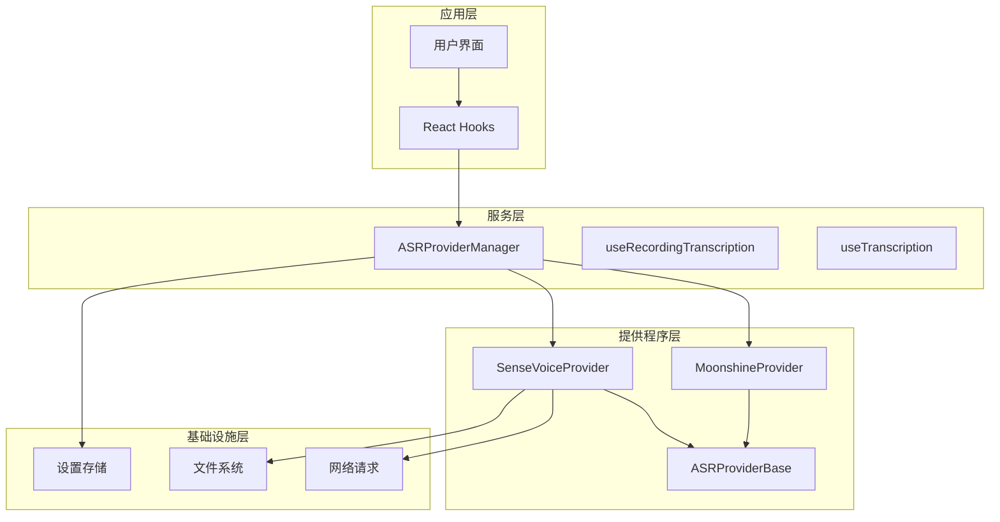
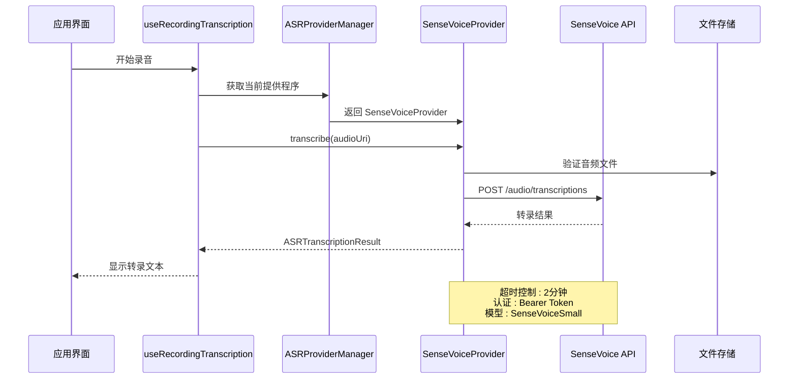
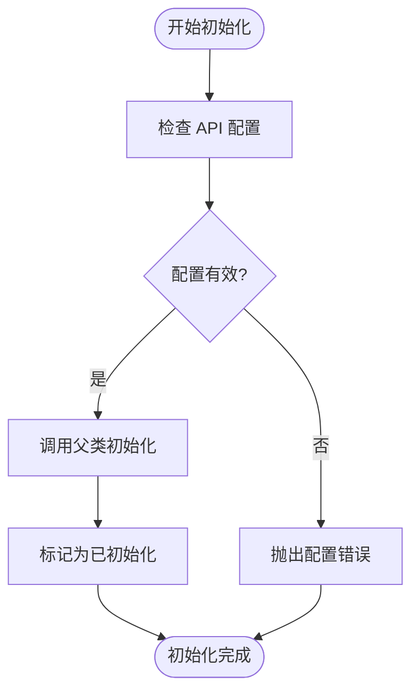
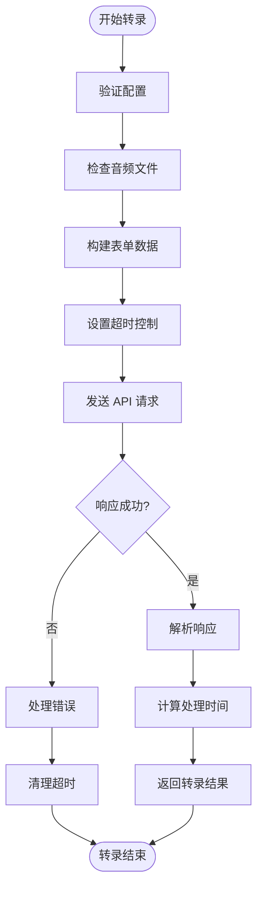
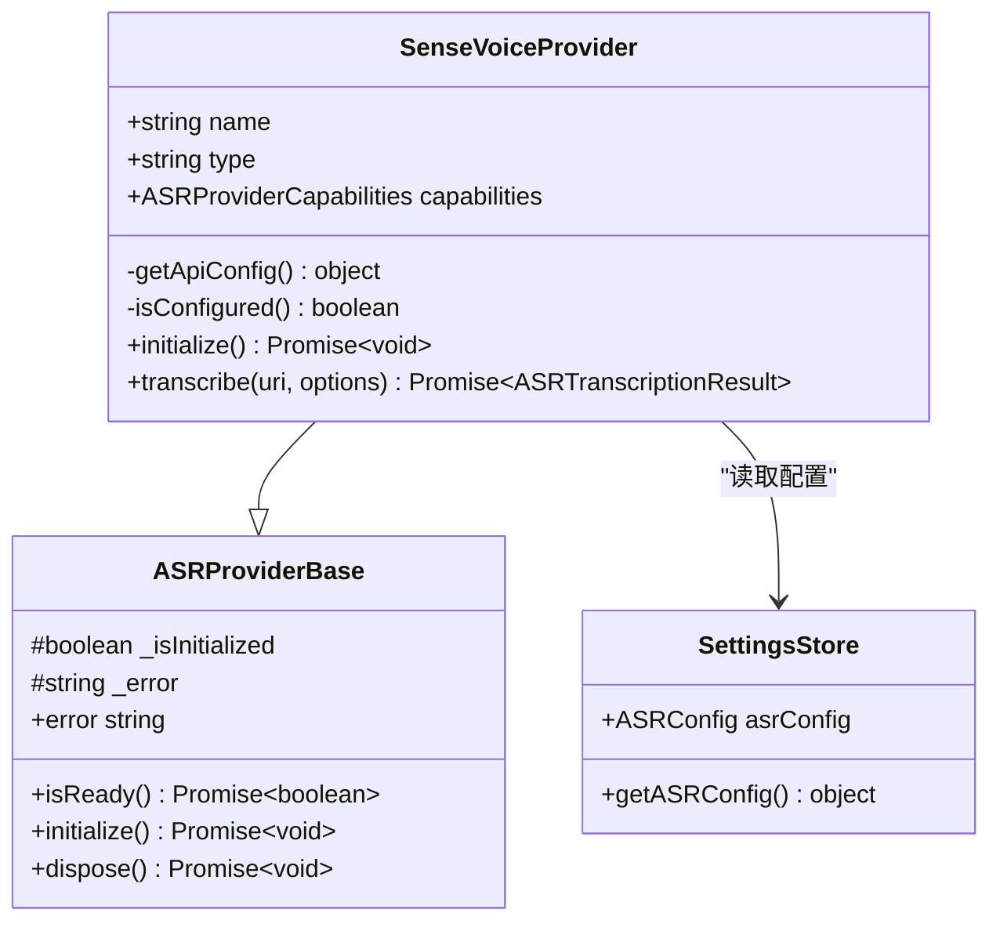
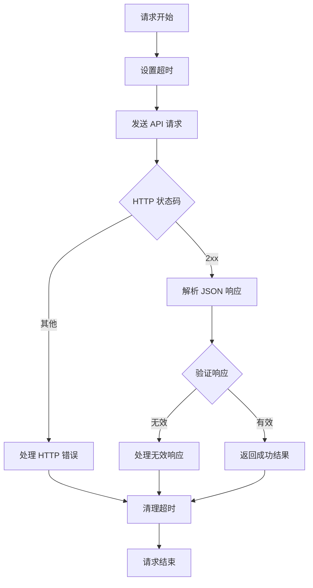
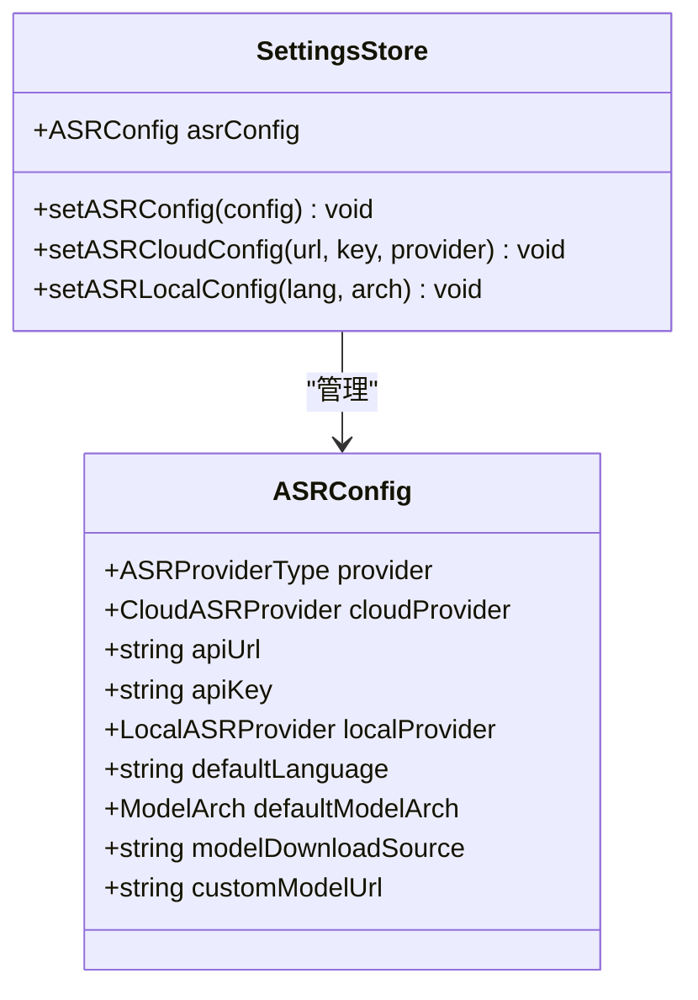
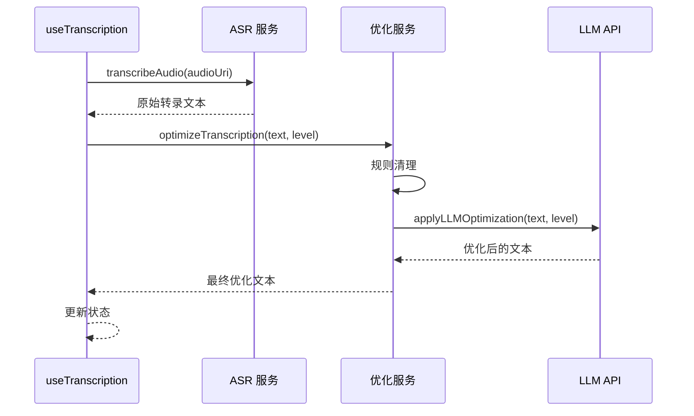
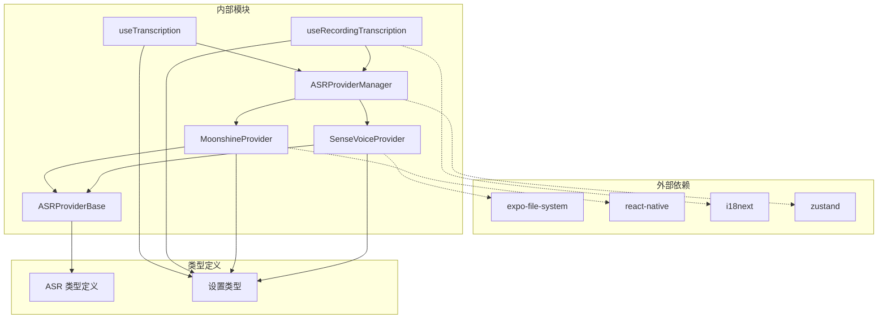

# 云端语音转录

<cite>
**本文档引用的文件**
- [SenseVoiceProvider.ts](file://services/asr/providers/cloud/SenseVoiceProvider.ts)
- [ASRProviderBase.ts](file://services/asr/providers/base/ASRProviderBase.ts)
- [asrService.ts](file://services/asr/asrService.ts)
- [useRecordingTranscription.ts](file://hooks/useRecordingTranscription.ts)
- [useTranscription.ts](file://hooks/useTranscription.ts)
- [types.ts](file://types/asr.ts)
- [ASRProviderManager.ts](file://services/asr/providers/ASRProviderManager.ts)
- [MoonshineProvider.ts](file://services/asr/providers/local/MoonshineProvider.ts)
- [useSettingsStore.ts](file://store/useSettingsStore.ts)
- [prompts.ts](file://services/transcription/prompts.ts)
- [transcriptionOptimizationService.ts](file://services/transcription/transcriptionOptimizationService.ts)
</cite>

## 目录
1. [简介](#简介)
2. [项目结构](#项目结构)
3. [核心组件](#核心组件)
4. [架构概览](#架构概览)
5. [详细组件分析](#详细组件分析)
6. [依赖关系分析](#依赖关系分析)
7. [性能考虑](#性能考虑)
8. [故障排除指南](#故障排除指南)
9. [结论](#结论)
10. [附录](#附录)

## 简介

VoiceNote 应用提供了完整的语音转录解决方案，支持云端和本地两种模式。本文档专注于云端语音转录功能，特别是 SenseVoiceProvider 的实现架构和云端转录流程。

云端语音转录通过 SenseVoice API 实现高质量的语音识别，支持多种语言（中文、英文、日文、韩文），具有以下特点：
- 基于云端的非流式转录
- 支持实时音频文件上传
- 完整的错误处理和超时控制
- 与本地 Moonshine 提供程序的无缝切换
- 智能文本优化功能

## 项目结构

VoiceNote 的 ASR（自动语音识别）系统采用模块化设计，主要分为以下几个层次：



**图表来源**
- [ASRProviderManager.ts:30-100](file://services/asr/providers/ASRProviderManager.ts#L30-L100)
- [SenseVoiceProvider.ts:27-77](file://services/asr/providers/cloud/SenseVoiceProvider.ts#L27-L77)
- [MoonshineProvider.ts:42-135](file://services/asr/providers/local/MoonshineProvider.ts#L42-L135)

**章节来源**
- [ASRProviderManager.ts:1-263](file://services/asr/providers/ASRProviderManager.ts#L1-L263)
- [types.ts:1-164](file://types/asr.ts#L1-L164)

## 核心组件

### SenseVoiceProvider - 云端语音转录提供程序

SenseVoiceProvider 是云端语音转录的核心实现，继承自 ASRProviderBase 基类，专门处理非流式语音识别任务。

#### 主要特性
- **非流式转录**：适用于录音完成后的批量转录
- **多语言支持**：支持中文、英文、日文、韩文
- **网络依赖**：需要稳定的互联网连接
- **模型选择**：使用 FunAudioLLM/SenseVoiceSmall 模型

#### 关键方法
- `initialize()`: 初始化提供程序并验证配置
- `transcribe()`: 执行音频文件转录
- `isReady()`: 检查提供程序是否准备就绪
- `isConfigured()`: 验证 API 配置完整性

**章节来源**
- [SenseVoiceProvider.ts:27-153](file://services/asr/providers/cloud/SenseVoiceProvider.ts#L27-L153)

### ASRProviderBase - 提供程序基类

ASRProviderBase 提供了所有 ASR 提供程序的基础功能，包括状态管理和错误处理。

#### 核心功能
- 统一的生命周期管理
- 错误状态跟踪
- 能力描述接口
- 初始化和清理机制

**章节来源**
- [ASRProviderBase.ts:13-65](file://services/asr/providers/base/ASRProviderBase.ts#L13-L65)

### ASRProviderManager - 提供程序管理器

ASRProviderManager 是整个 ASR 系统的协调中心，负责在云端和本地提供程序之间进行切换。

#### 主要职责
- 动态提供程序选择
- 生命周期管理
- 状态同步
- 错误传播

**章节来源**
- [ASRProviderManager.ts:30-263](file://services/asr/providers/ASRProviderManager.ts#L30-L263)

## 架构概览

VoiceNote 的云端语音转录架构采用了分层设计，确保了良好的可维护性和扩展性：



**图表来源**
- [useRecordingTranscription.ts:124-139](file://hooks/useRecordingTranscription.ts#L124-L139)
- [SenseVoiceProvider.ts:82-152](file://services/asr/providers/cloud/SenseVoiceProvider.ts#L82-L152)

## 详细组件分析

### SenseVoiceProvider 实现详解

#### 初始化流程



**图表来源**
- [SenseVoiceProvider.ts:71-77](file://services/asr/providers/cloud/SenseVoiceProvider.ts#L71-L77)

#### 转录流程



**图表来源**
- [SenseVoiceProvider.ts:82-152](file://services/asr/providers/cloud/SenseVoiceProvider.ts#L82-L152)

#### 认证机制

SenseVoiceProvider 使用 Bearer Token 认证方式，从设置存储中获取 API 密钥：



**图表来源**
- [SenseVoiceProvider.ts:27-51](file://services/asr/providers/cloud/SenseVoiceProvider.ts#L27-L51)
- [useSettingsStore.ts:73-88](file://store/useSettingsStore.ts#L73-L88)

**章节来源**
- [SenseVoiceProvider.ts:45-152](file://services/asr/providers/cloud/SenseVoiceProvider.ts#L45-L152)

### 超时控制和错误处理

#### 超时机制

云端转录实现了双重超时保护：

1. **请求超时**：默认 2 分钟（120,000 毫秒）
2. **AbortController**：用于优雅地取消长时间运行的请求

#### 错误处理策略



**图表来源**
- [SenseVoiceProvider.ts:114-151](file://services/asr/providers/cloud/SenseVoiceProvider.ts#L114-L151)

**章节来源**
- [SenseVoiceProvider.ts:15-152](file://services/asr/providers/cloud/SenseVoiceProvider.ts#L15-L152)

### 配置管理

#### 设置存储结构

ASR 配置存储在全局状态中，支持云端和本地两种模式：



**图表来源**
- [useSettingsStore.ts:73-88](file://store/useSettingsStore.ts#L73-L88)
- [types.ts:15-164](file://types/asr.ts#L15-L164)

**章节来源**
- [useSettingsStore.ts:73-88](file://store/useSettingsStore.ts#L73-L88)

### 文本优化集成

云端转录完成后，系统会自动进行文本优化处理：



**图表来源**
- [useTranscription.ts:33-65](file://hooks/useTranscription.ts#L33-L65)
- [transcriptionOptimizationService.ts:35-39](file://services/transcription/transcriptionOptimizationService.ts#L35-L39)

**章节来源**
- [useTranscription.ts:22-104](file://hooks/useTranscription.ts#L22-L104)
- [transcriptionOptimizationService.ts:1-39](file://services/transcription/transcriptionOptimizationService.ts#L1-L39)

## 依赖关系分析

### 组件依赖图



**图表来源**
- [SenseVoiceProvider.ts:8-13](file://services/asr/providers/cloud/SenseVoiceProvider.ts#L8-L13)
- [MoonshineProvider.ts:8-30](file://services/asr/providers/local/MoonshineProvider.ts#L8-L30)

### 循环依赖检测

经过分析，系统中不存在循环依赖：
- SenseVoiceProvider 和 MoonshineProvider 都依赖 ASRProviderBase
- ASRProviderManager 单向依赖具体提供程序实现
- Hook 层只依赖管理器，不反向依赖具体实现

**章节来源**
- [ASRProviderManager.ts:1-263](file://services/asr/providers/ASRProviderManager.ts#L1-L263)

## 性能考虑

### 云端转录性能特点

#### 优势
- **高准确性**：基于大型预训练模型，识别准确率高
- **多语言支持**：支持 4 种主要语言的高质量转录
- **实时处理**：音频文件上传后立即开始处理
- **智能优化**：自动进行文本清理和优化

#### 性能指标
- **默认超时**：2 分钟（可根据需要调整）
- **并发限制**：单个提供程序实例串行处理
- **内存占用**：主要受音频文件大小影响
- **网络开销**：与音频文件大小和网络质量相关

### 本地转录对比

为了帮助开发者理解云端转录的优势，以下是与本地转录的对比：

| 特性 | 云端 SenseVoice | 本地 Moonshine |
|------|----------------|----------------|
| 准确性 | 高（大型模型） | 中等（设备模型） |
| 速度 | 取决于网络 | 设备本地处理 |
| 语言支持 | 4种语言 | 8种语言 |
| 首次启动 | 立即可用 | 需要下载模型 |
| 后续使用 | 无额外成本 | 需要存储空间 |
| 离线支持 | 不支持 | 支持 |

**章节来源**
- [MoonshineProvider.ts:46-52](file://services/asr/providers/local/MoonshineProvider.ts#L46-L52)

## 故障排除指南

### 常见问题及解决方案

#### 1. API 配置错误

**症状**：初始化时抛出配置错误
**原因**：缺少 API URL 或 API Key
**解决方法**：
- 检查设置中的 API 配置
- 确认环境变量正确设置
- 验证 API 凭据有效性

#### 2. 网络超时

**症状**：转录过程中出现超时错误
**原因**：网络连接不稳定或服务器响应慢
**解决方法**：
- 检查网络连接质量
- 增加超时时间配置
- 尝试在更稳定的网络环境下重试

#### 3. 文件访问错误

**症状**：音频文件不存在或无法访问
**原因**：文件路径错误或权限问题
**解决方法**：
- 验证音频文件 URI
- 检查文件是否存在
- 确认应用有文件访问权限

#### 4. 认证失败

**症状**：API 响应 401 或 403 错误
**原因**：API Key 无效或过期
**解决方法**：
- 重新生成 API Key
- 检查 API Key 权限范围
- 验证 API 端点 URL

### 调试技巧

#### 启用详细日志
```typescript
// 在开发环境中启用详细错误信息
console.log('ASR Error:', error);
console.log('Error Cause:', error.cause);
```

#### 检查配置状态
```typescript
// 验证提供程序配置
const provider = await asrProviderManager.getCurrentProvider();
console.log('Provider Capabilities:', provider.capabilities);
console.log('Provider Status:', await provider.isReady());
```

**章节来源**
- [SenseVoiceProvider.ts:72-77](file://services/asr/providers/cloud/SenseVoiceProvider.ts#L72-L77)
- [ASRProviderManager.ts:197-233](file://services/asr/providers/ASRProviderManager.ts#L197-L233)

## 结论

VoiceNote 的云端语音转录系统提供了企业级的语音识别解决方案。通过 SenseVoiceProvider 的精心设计，系统实现了：

1. **可靠的云端集成**：基于 SenseVoice API 的稳定连接
2. **完善的错误处理**：多层次的超时和错误恢复机制
3. **灵活的配置管理**：支持运行时配置和环境变量
4. **智能的文本优化**：自动化的文本清理和改进
5. **无缝的用户体验**：与本地转录方案的平滑切换

该系统特别适合需要高质量语音识别和多语言支持的应用场景，为开发者提供了清晰的扩展接口和完善的错误处理机制。

## 附录

### API 集成最佳实践

#### 1. 配置管理
- 使用环境变量存储敏感信息
- 实现配置验证和回退机制
- 支持运行时配置更新

#### 2. 错误处理
- 实现指数退避重试策略
- 提供详细的错误诊断信息
- 实现优雅降级机制

#### 3. 性能优化
- 实现请求缓存机制
- 优化音频文件格式和大小
- 实现并发请求限制

#### 4. 安全考虑
- 使用 HTTPS 和安全传输
- 实现 API Key 管理和轮换
- 实施请求频率限制

### 代码示例路径

#### 基本配置示例
[配置设置函数:45-51](file://services/asr/providers/cloud/SenseVoiceProvider.ts#L45-L51)

#### 转录调用示例
[转录方法实现:82-152](file://services/asr/providers/cloud/SenseVoiceProvider.ts#L82-L152)

#### 错误处理示例
[超时和错误处理:143-151](file://services/asr/providers/cloud/SenseVoiceProvider.ts#L143-L151)

#### 配置验证示例
[配置检查逻辑:56-59](file://services/asr/providers/cloud/SenseVoiceProvider.ts#L56-L59)