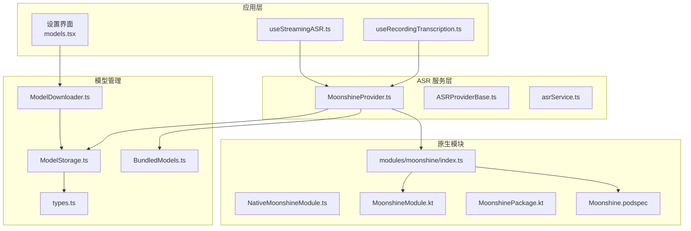
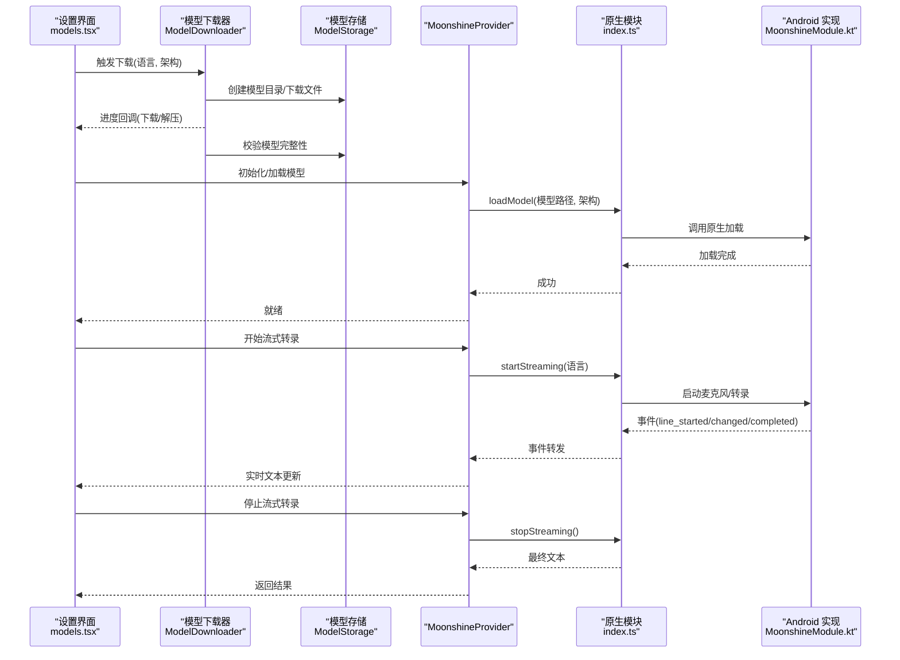
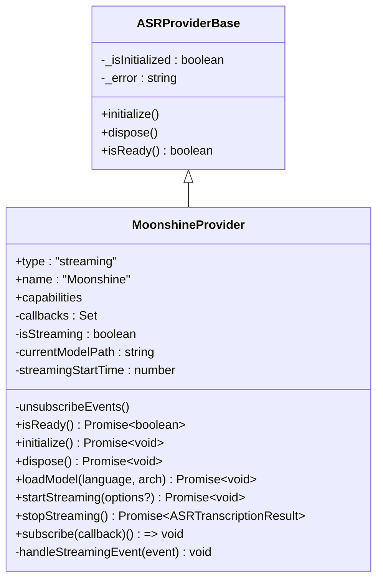
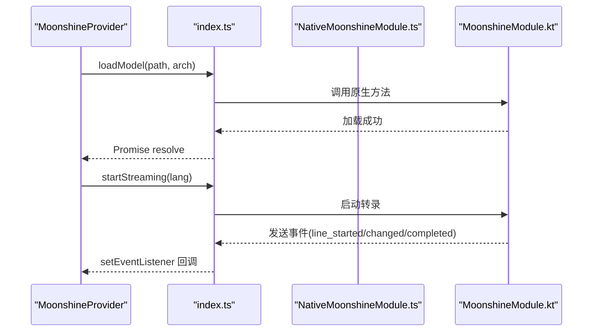
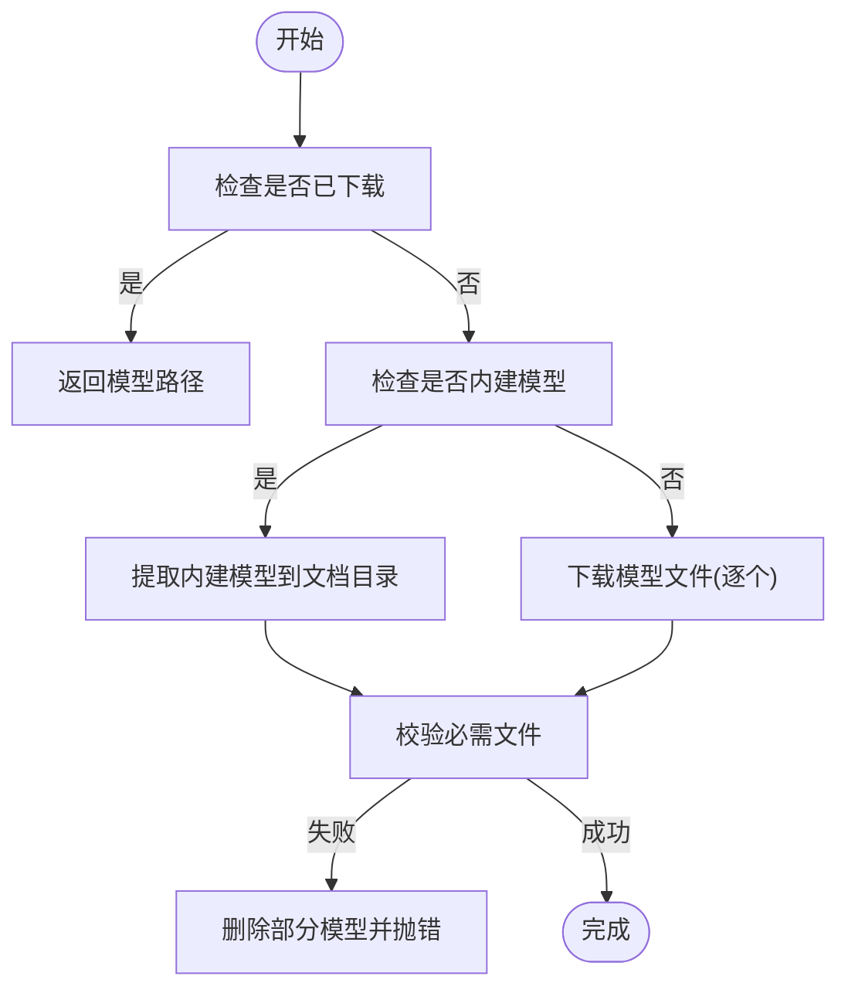
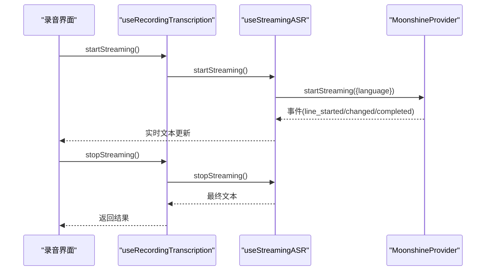
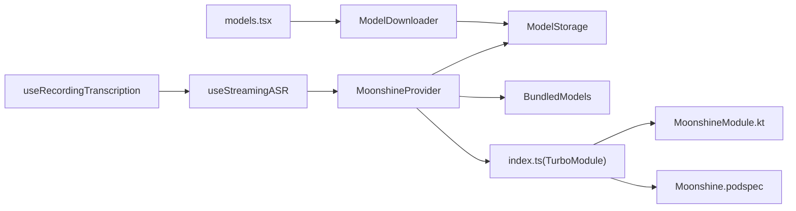

# 本地语音转录

<cite>
**本文引用的文件**
- [MoonshineProvider.ts](file://services/asr/providers/local/MoonshineProvider.ts)
- [NativeMoonshineModule.ts](file://modules/moonshine/src/NativeMoonshineModule.ts)
- [ModelDownloader.ts](file://services/asr/modelManager/ModelDownloader.ts)
- [ModelStorage.ts](file://services/asr/modelManager/ModelStorage.ts)
- [BundledModels.ts](file://services/asr/modelManager/BundledModels.ts)
- [types.ts](file://services/asr/modelManager/types.ts)
- [index.ts](file://modules/moonshine/index.ts)
- [MoonshineModule.kt](file://modules/moonshine/android/MoonshineModule.kt)
- [MoonshinePackage.kt](file://modules/moonshine/android/MoonshinePackage.kt)
- [Moonshine.podspec](file://modules/moonshine/Moonshine.podspec)
- [ASRProviderBase.ts](file://services/asr/providers/base/ASRProviderBase.ts)
- [asrService.ts](file://services/asr/asrService.ts)
- [useStreamingASR.ts](file://hooks/useStreamingASR.ts)
- [useRecordingTranscription.ts](file://hooks/useRecordingTranscription.ts)
- [models.tsx](file://app/settings/models.tsx)
- [asr.ts](file://types/asr.ts)
- [useSettingsStore.ts](file://store/useSettingsStore.ts)
</cite>

## 目录
1. [简介](#简介)
2. [项目结构](#项目结构)
3. [核心组件](#核心组件)
4. [架构总览](#架构总览)
5. [组件详解](#组件详解)
6. [依赖关系分析](#依赖关系分析)
7. [性能与内存优化](#性能与内存优化)
8. [故障排查指南](#故障排查指南)
9. [结论](#结论)
10. [附录：使用示例与最佳实践](#附录使用示例与最佳实践)

## 简介
本文件面向希望在应用中集成本地语音转录（离线 ASR）能力的开发者，系统性讲解 MoonshineProvider 的实现原理、本地转录流程、原生模块 Moonshine 的集成方式与平台差异、模型打包与版本管理机制、模型下载器与存储管理器的工作原理，并提供初始化与结果处理的参考路径、性能优化策略、内存管理最佳实践以及离线转录的限制与适用场景。

## 项目结构
围绕本地语音转录的关键目录与文件如下：
- 服务层：ASR 提供者、模型管理器、ASR 服务
- 原生模块：Moonshine TurboModule 接口与平台实现
- Hooks：统一录音转录接口，支持本地流式与云端文件式两种模式
- 设置界面：模型下载、删除、进度展示
- 类型定义：语言、模型架构、状态、事件等

**图表来源**
- [MoonshineProvider.ts:1-307](file://services/asr/providers/local/MoonshineProvider.ts#L1-L307)
- [ModelDownloader.ts:1-207](file://services/asr/modelManager/ModelDownloader.ts#L1-L207)
- [ModelStorage.ts:1-186](file://services/asr/modelManager/ModelStorage.ts#L1-L186)
- [BundledModels.ts:1-258](file://services/asr/modelManager/BundledModels.ts#L1-L258)
- [NativeMoonshineModule.ts:1-34](file://modules/moonshine/src/NativeMoonshineModule.ts#L1-L34)
- [index.ts:1-94](file://modules/moonshine/index.ts#L1-L94)
- [MoonshineModule.kt:1-322](file://modules/moonshine/android/MoonshineModule.kt#L1-L322)
- [MoonshinePackage.kt:1-22](file://modules/moonshine/android/MoonshinePackage.kt#L1-L22)
- [Moonshine.podspec:1-32](file://modules/moonshine/Moonshine.podspec#L1-L32)
- [useStreamingASR.ts:1-269](file://hooks/useStreamingASR.ts#L1-L269)
- [useRecordingTranscription.ts:1-199](file://hooks/useRecordingTranscription.ts#L1-L199)
- [models.tsx:1-289](file://app/settings/models.tsx#L1-L289)

**章节来源**
- [MoonshineProvider.ts:1-307](file://services/asr/providers/local/MoonshineProvider.ts#L1-L307)
- [index.ts:1-94](file://modules/moonshine/index.ts#L1-L94)

## 核心组件
- MoonshineProvider：本地流式 ASR 提供者，负责模型加载、事件订阅、开始/停止流式转录、错误处理与资源释放。
- 模型管理器：下载器（ModelDownloader）、存储（ModelStorage）、内建模型提取（BundledModels），统一管理模型生命周期。
- 原生模块 Moonshine：通过 TurboModule 暴露 isAvailable、loadModel、startStreaming、stopStreaming 等方法；Android 使用 MicTranscriber 实现流式转录。
- Hooks：useStreamingASR 统一本地流式体验；useRecordingTranscription 在本地/云端之间自动切换。
- 类型与配置：语言、模型架构、状态、事件、默认模型大小、显示名等。

**章节来源**
- [MoonshineProvider.ts:42-291](file://services/asr/providers/local/MoonshineProvider.ts#L42-L291)
- [ModelDownloader.ts:37-165](file://services/asr/modelManager/ModelDownloader.ts#L37-L165)
- [ModelStorage.ts:49-131](file://services/asr/modelManager/ModelStorage.ts#L49-L131)
- [BundledModels.ts:96-201](file://services/asr/modelManager/BundledModels.ts#L96-L201)
- [NativeMoonshineModule.ts:16-34](file://modules/moonshine/src/NativeMoonshineModule.ts#L16-L34)
- [MoonshineModule.kt:46-230](file://modules/moonshine/android/MoonshineModule.kt#L46-L230)
- [useStreamingASR.ts:67-269](file://hooks/useStreamingASR.ts#L67-L269)
- [useRecordingTranscription.ts:74-195](file://hooks/useRecordingTranscription.ts#L74-L195)
- [asr.ts:15-164](file://types/asr.ts#L15-L164)

## 架构总览
本地转录从“模型准备”到“实时流式转录”的端到端流程如下：

**图表来源**
- [models.tsx:98-128](file://app/settings/models.tsx#L98-L128)
- [ModelDownloader.ts:37-165](file://services/asr/modelManager/ModelDownloader.ts#L37-L165)
- [ModelStorage.ts:49-84](file://services/asr/modelManager/ModelStorage.ts#L49-L84)
- [MoonshineProvider.ts:88-135](file://services/asr/providers/local/MoonshineProvider.ts#L88-L135)
- [index.ts:17-40](file://modules/moonshine/index.ts#L17-L40)
- [MoonshineModule.kt:175-230](file://modules/moonshine/android/MoonshineModule.kt#L175-L230)

## 组件详解

### MoonshineProvider：本地流式 ASR 提供者
- 能力声明：支持流式、实时转录，不需网络，需要模型下载。
- 初始化流程：检查可用性 → 若未加载则尝试加载默认模型；若未下载但为内建模型则先提取；最终调用原生 loadModel。
- 流式控制：startStreaming 前 Android 需要先通知麦克风权限；事件通过 setEventListener 订阅，内部转发给所有回调；stopStreaming 收集处理耗时并返回最终文本。
- 资源管理：dispose 时停止流、卸载模型、清理事件订阅与回调集合。

**图表来源**
- [ASRProviderBase.ts:13-65](file://services/asr/providers/base/ASRProviderBase.ts#L13-L65)
- [MoonshineProvider.ts:42-291](file://services/asr/providers/local/MoonshineProvider.ts#L42-L291)

**章节来源**
- [MoonshineProvider.ts:42-291](file://services/asr/providers/local/MoonshineProvider.ts#L42-L291)

### 原生模块 Moonshine：TurboModule 接口与平台实现
- 接口规范：NativeMoonshineModule 定义了 isAvailable、loadModel、unloadModel、isModelLoaded、startStreaming、stopStreaming、事件监听等方法。
- 自动适配：index.ts 动态选择 TurboModule 或旧版 NativeModules，兼容新旧架构；同时使用 NativeEventEmitter 确保事件正确传递。
- Android 实现：MoonshineModule.kt 通过 MicTranscriber 执行流式转录，支持 line_started/changed/completed 事件；startStreaming 前必须已授予麦克风权限；提供 addListener/removeListeners 以配合 NativeEventEmitter。
- iOS 实现：Moonshine.podspec 注释说明 iOS 实现在主工程目标中，通过 Swift Package Manager 引入 MoonshineVoice SDK。

**图表来源**
- [index.ts:17-94](file://modules/moonshine/index.ts#L17-L94)
- [NativeMoonshineModule.ts:16-34](file://modules/moonshine/src/NativeMoonshineModule.ts#L16-L34)
- [MoonshineModule.kt:46-230](file://modules/moonshine/android/MoonshineModule.kt#L46-L230)

**章节来源**
- [index.ts:17-94](file://modules/moonshine/index.ts#L17-L94)
- [NativeMoonshineModule.ts:16-34](file://modules/moonshine/src/NativeMoonshineModule.ts#L16-L34)
- [MoonshineModule.kt:46-230](file://modules/moonshine/android/MoonshineModule.kt#L46-L230)
- [Moonshine.podspec:15-23](file://modules/moonshine/Moonshine.podspec#L15-L23)

### 模型管理器：下载、存储与内建模型
- 下载器 ModelDownloader：支持单文件逐个下载（替代 tar.gz 解压）、进度回调、错误清理（删除部分模型）、状态跟踪（下载中/解压中/完成/错误）。
- 存储 ModelStorage：统一模型根目录 moonshine-models，按 moonshine-{arch}-{lang} 命名子目录；校验必需文件（encoder/decoder/tokenizer）；计算模型大小；列出已下载模型。
- 内建模型 BundledModels：支持将默认模型（如 moonshine-base-zh）随应用打包，首次启动自动提取至文档目录；使用 AsyncStorage 防止重复提取；提供检查可用性与批量提取接口。
- 类型与常量 types：模型 ID、下载 URL、显示名、大小估算、解析/生成工具函数。

**图表来源**
- [ModelDownloader.ts:37-165](file://services/asr/modelManager/ModelDownloader.ts#L37-L165)
- [ModelStorage.ts:49-84](file://services/asr/modelManager/ModelStorage.ts#L49-L84)
- [BundledModels.ts:96-201](file://services/asr/modelManager/BundledModels.ts#L96-L201)
- [types.ts:75-129](file://services/asr/modelManager/types.ts#L75-L129)

**章节来源**
- [ModelDownloader.ts:37-165](file://services/asr/modelManager/ModelDownloader.ts#L37-L165)
- [ModelStorage.ts:49-131](file://services/asr/modelManager/ModelStorage.ts#L49-L131)
- [BundledModels.ts:96-201](file://services/asr/modelManager/BundledModels.ts#L96-L201)
- [types.ts:75-129](file://services/asr/modelManager/types.ts#L75-L129)

### Hooks：统一录音转录接口
- useStreamingASR：本地流式转录钩子，维护 lines/text/isStreaming/isReady/error，订阅 Provider 事件，合并最终文本。
- useRecordingTranscription：根据 ASR 配置自动在本地流式与云端文件式之间切换，统一对外暴露 start/stop/transcribe/reset/retry 等方法。

**图表来源**
- [useRecordingTranscription.ts:98-120](file://hooks/useRecordingTranscription.ts#L98-L120)
- [useStreamingASR.ts:190-241](file://hooks/useStreamingASR.ts#L190-L241)
- [MoonshineProvider.ts:192-259](file://services/asr/providers/local/MoonshineProvider.ts#L192-L259)

**章节来源**
- [useRecordingTranscription.ts:74-195](file://hooks/useRecordingTranscription.ts#L74-L195)
- [useStreamingASR.ts:67-269](file://hooks/useStreamingASR.ts#L67-L269)

## 依赖关系分析
- Provider 依赖：模型管理器（下载/存储/内建）、原生模块（TurboModule）、设置存储（默认语言/架构）。
- 原生模块依赖：Android 平台使用 MicTranscriber；iOS 通过 Swift Package Manager 引入 MoonshineVoice SDK。
- UI 依赖：设置界面 models.tsx 依赖模型管理器进行下载/删除/进度展示。

**图表来源**
- [MoonshineProvider.ts:24-29](file://services/asr/providers/local/MoonshineProvider.ts#L24-L29)
- [index.ts:17-40](file://modules/moonshine/index.ts#L17-L40)
- [MoonshineModule.kt:46-230](file://modules/moonshine/android/MoonshineModule.kt#L46-L230)
- [Moonshine.podspec:15-23](file://modules/moonshine/Moonshine.podspec#L15-L23)
- [models.tsx:13-22](file://app/settings/models.tsx#L13-L22)

**章节来源**
- [MoonshineProvider.ts:24-29](file://services/asr/providers/local/MoonshineProvider.ts#L24-L29)
- [index.ts:17-40](file://modules/moonshine/index.ts#L17-L40)
- [MoonshineModule.kt:46-230](file://modules/moonshine/android/MoonshineModule.kt#L46-L230)
- [Moonshine.podspec:15-23](file://modules/moonshine/Moonshine.podspec#L15-L23)
- [models.tsx:13-22](file://app/settings/models.tsx#L13-L22)

## 性能与内存优化
- 模型选择与体积权衡
  - small/arch 约 50MB，base/arch 约 150MB；优先选择目标语言的 base 以提升准确率，空间充足时再考虑 small。
  - 参考：[types.ts:125-128](file://services/asr/modelManager/types.ts#L125-L128)
- 流式转录优化
  - 事件去重：原生模块侧已做去重，前端仍建议对高频事件进行节流/去抖，避免 UI 抖动。
  - 文本拼接：stopStreaming 合并 lines 中的文本，减少多次渲染。
  - 参考：[useStreamingASR.ts:118-185](file://hooks/useStreamingASR.ts#L118-L185)
- 内存与资源管理
  - Provider.dispose 会卸载模型、清理事件订阅与回调集合，确保无泄漏。
  - 参考：[MoonshineProvider.ts:140-164](file://services/asr/providers/local/MoonshineProvider.ts#L140-L164)
- Android 权限与稳定性
  - 必须先授予麦克风权限再 startStreaming，否则会报错；Provider 已在 Android 上显式调用 onMicPermissionGranted。
  - 参考：[MoonshineProvider.ts:212-214](file://services/asr/providers/local/MoonshineProvider.ts#L212-L214)，[MoonshineModule.kt:188-191](file://modules/moonshine/android/MoonshineModule.kt#L188-L191)
- 下载与存储
  - 下载采用逐文件方式，便于进度上报与断点续传；下载失败自动清理部分模型。
  - 参考：[ModelDownloader.ts:100-137](file://services/asr/modelManager/ModelDownloader.ts#L100-L137)

**章节来源**
- [types.ts:125-128](file://services/asr/modelManager/types.ts#L125-L128)
- [useStreamingASR.ts:118-185](file://hooks/useStreamingASR.ts#L118-L185)
- [MoonshineProvider.ts:140-164](file://services/asr/providers/local/MoonshineProvider.ts#L140-L164)
- [MoonshineProvider.ts:212-214](file://services/asr/providers/local/MoonshineProvider.ts#L212-L214)
- [MoonshineModule.kt:188-191](file://modules/moonshine/android/MoonshineModule.kt#L188-L191)
- [ModelDownloader.ts:100-137](file://services/asr/modelManager/ModelDownloader.ts#L100-L137)

## 故障排查指南
- 无法初始化 Provider
  - 症状：提示 Moonshine 原生模块不可用或模型未下载。
  - 处理：确认构建包含 Moonshine 原生模块；检查 isReady 逻辑与错误信息；确保已下载或提取内建模型。
  - 参考：[MoonshineProvider.ts:63-83](file://services/asr/providers/local/MoonshineProvider.ts#L63-L83)
- 下载失败/中断
  - 症状：下载状态停留在 downloading/extracting 或报错。
  - 处理：查看 activeDownloads 状态与错误消息；清理部分模型后重试；检查缓存目录可用性。
  - 参考：[ModelDownloader.ts:144-164](file://services/asr/modelManager/ModelDownloader.ts#L144-L164)
- Android 权限问题
  - 症状：startStreaming 报 NO_PERMISSION。
  - 处理：先请求并获得 RECORD_AUDIO 权限，再调用 onMicPermissionGranted，最后 startStreaming。
  - 参考：[MoonshineModule.kt:188-191](file://modules/moonshine/android/MoonshineModule.kt#L188-L191)
- 事件未到达前端
  - 症状：UI 无实时文本更新。
  - 处理：确认 setEventListener 已正确订阅；检查去重逻辑与回调异常捕获。
  - 参考：[index.ts:52-84](file://modules/moonshine/index.ts#L52-L84)，[MoonshineProvider.ts:276-290](file://services/asr/providers/local/MoonshineProvider.ts#L276-L290)
- 模型损坏或缺失
  - 症状：isModelLoaded 返回 false 或加载失败。
  - 处理：verifyModelFiles 校验失败时删除并重新下载；检查必需文件是否存在。
  - 参考：[ModelStorage.ts:71-84](file://services/asr/modelManager/ModelStorage.ts#L71-L84)

**章节来源**
- [MoonshineProvider.ts:63-83](file://services/asr/providers/local/MoonshineProvider.ts#L63-L83)
- [ModelDownloader.ts:144-164](file://services/asr/modelManager/ModelDownloader.ts#L144-L164)
- [MoonshineModule.kt:188-191](file://modules/moonshine/android/MoonshineModule.kt#L188-L191)
- [index.ts:52-84](file://modules/moonshine/index.ts#L52-L84)
- [MoonshineProvider.ts:276-290](file://services/asr/providers/local/MoonshineProvider.ts#L276-L290)
- [ModelStorage.ts:71-84](file://services/asr/modelManager/ModelStorage.ts#L71-L84)

## 结论
本方案通过 MoonshineProvider 将本地 ONNX 模型与 React Native 原生模块无缝集成，提供稳定可靠的流式转录体验。模型管理器覆盖下载、存储与内建模型提取，满足不同部署场景；Hooks 层抽象出统一的录音转录接口，简化上层业务接入。结合合理的性能与内存优化策略，可在移动端实现低延迟、高准确率的本地语音转录。

## 附录：使用示例与最佳实践

### 初始化本地转录服务（参考路径）
- 设置默认语言与模型架构
  - 参考：[useSettingsStore.ts:73-88](file://store/useSettingsStore.ts#L73-L88)
- 下载/提取模型
  - 下载：[models.tsx:111-116](file://app/settings/models.tsx#L111-L116)
  - 提取内建模型：[BundledModels.ts:208-219](file://services/asr/modelManager/BundledModels.ts#L208-L219)
- 初始化 Provider
  - [MoonshineProvider.ts:88-135](file://services/asr/providers/local/MoonshineProvider.ts#L88-L135)

### 处理转录结果（参考路径）
- 本地流式：useStreamingASR 订阅事件并合并文本，stopStreaming 后返回最终文本
  - [useStreamingASR.ts:118-241](file://hooks/useStreamingASR.ts#L118-L241)
- 录音转录统一接口：根据配置自动选择本地/云端
  - [useRecordingTranscription.ts:98-139](file://hooks/useRecordingTranscription.ts#L98-L139)

### 离线转录的限制与适用场景
- 限制
  - 需要预先下载或提取模型，占用设备存储空间。
  - 准确率与模型架构/语言有关，小模型在复杂场景可能不如大模型。
  - Android 需要麦克风权限，iOS 需要相应权限与隐私配置。
- 适用场景
  - 强隐私要求的本地处理、弱网或无网环境、对延迟敏感的实时转录。

### 开发者调试要点
- 检查 Provider 就绪状态与错误信息
  - [MoonshineProvider.ts:63-83](file://services/asr/providers/local/MoonshineProvider.ts#L63-L83)
- 监听原生事件与去重
  - [index.ts:52-84](file://modules/moonshine/index.ts#L52-L84)
- Android 权限链路
  - [MoonshineProvider.ts:212-214](file://services/asr/providers/local/MoonshineProvider.ts#L212-L214)，[MoonshineModule.kt:135-140](file://modules/moonshine/android/MoonshineModule.kt#L135-L140)