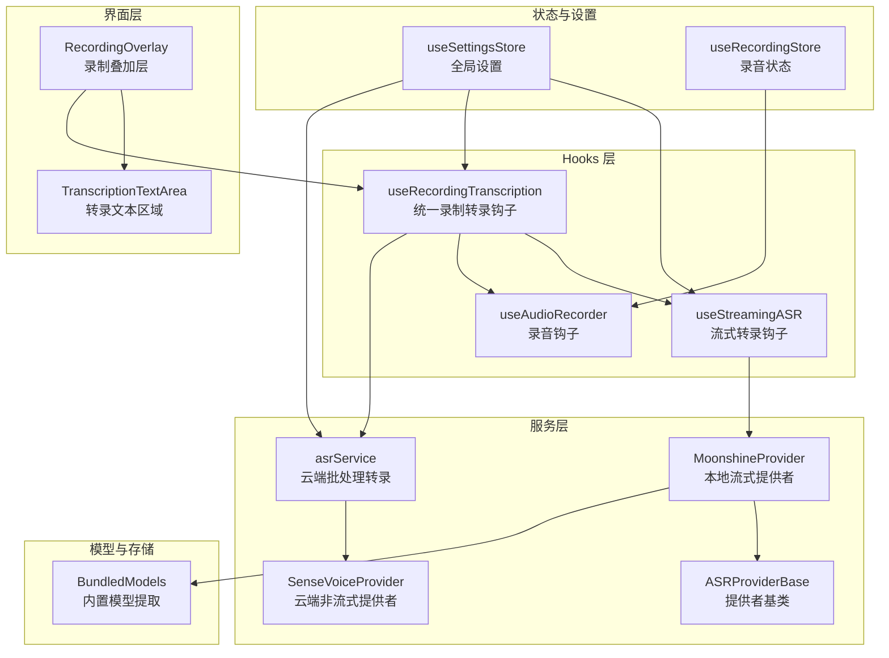
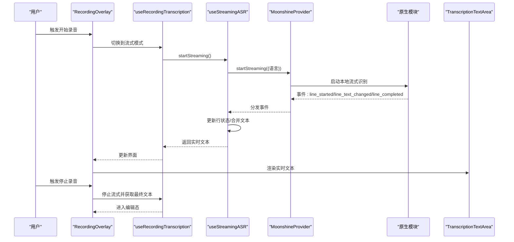
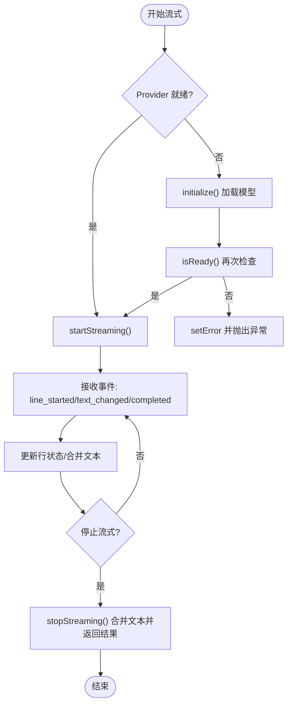
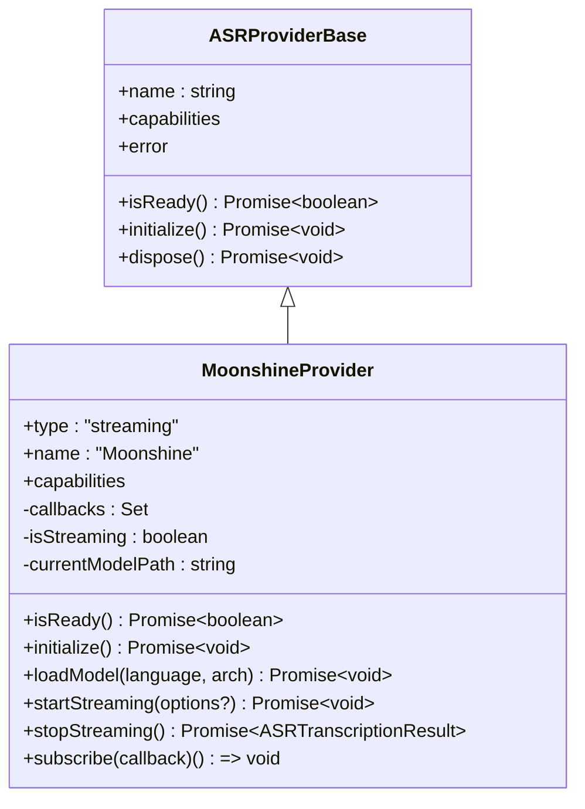
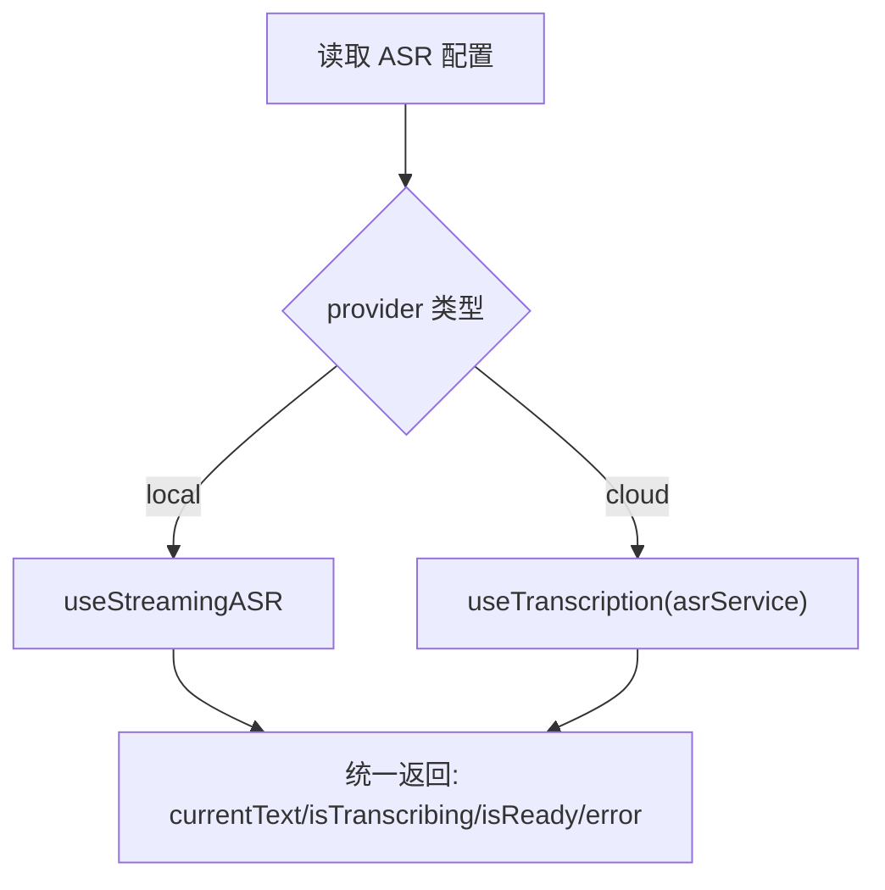
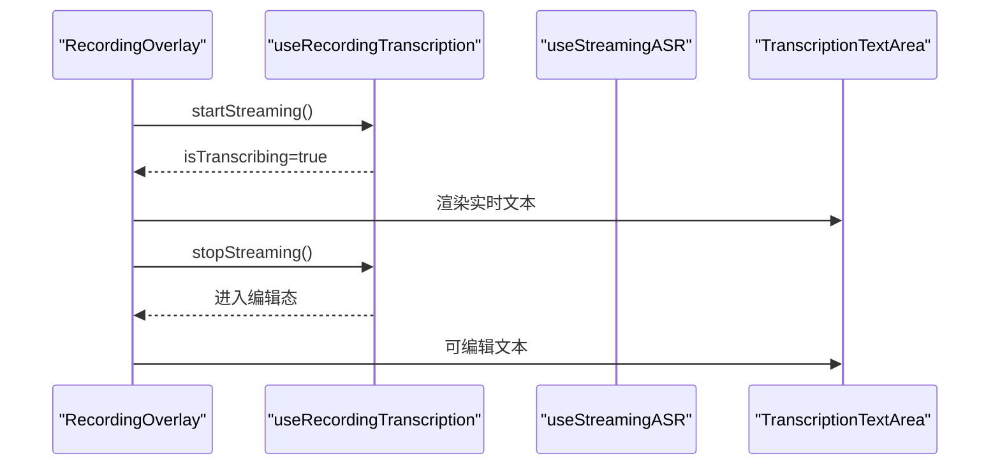
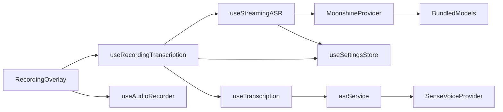

# 流式语音转录

<cite>
**本文引用的文件**
- [hooks/useStreamingASR.ts](file://hooks/useStreamingASR.ts)
- [services/asr/providers/local/MoonshineProvider.ts](file://services/asr/providers/local/MoonshineProvider.ts)
- [services/asr/providers/base/ASRProviderBase.ts](file://services/asr/providers/base/ASRProviderBase.ts)
- [services/asr/providers/cloud/SenseVoiceProvider.ts](file://services/asr/providers/cloud/SenseVoiceProvider.ts)
- [services/asr/asrService.ts](file://services/asr/asrService.ts)
- [types/asr.ts](file://types/asr.ts)
- [services/asr/modelManager/BundledModels.ts](file://services/asr/modelManager/BundledModels.ts)
- [hooks/useRecordingTranscription.ts](file://hooks/useRecordingTranscription.ts)
- [components/input/RecordingOverlay.tsx](file://components/input/RecordingOverlay.tsx)
- [components/input/TranscriptionTextArea.tsx](file://components/input/TranscriptionTextArea.tsx)
- [hooks/useAudioRecorder.ts](file://hooks/useAudioRecorder.ts)
- [store/useSettingsStore.ts](file://store/useSettingsStore.ts)
- [store/useRecordingStore.ts](file://store/useRecordingStore.ts)
- [hooks/useTranscription.ts](file://hooks/useTranscription.ts)
</cite>

## 目录
1. [简介](#简介)
2. [项目结构](#项目结构)
3. [核心组件](#核心组件)
4. [架构总览](#架构总览)
5. [详细组件分析](#详细组件分析)
6. [依赖关系分析](#依赖关系分析)
7. [性能考量](#性能考量)
8. [故障排查指南](#故障排查指南)
9. [结论](#结论)
10. [附录](#附录)

## 简介
本文件面向开发者，系统性阐述本项目中的流式语音转录（Streaming ASR）能力：从技术原理、实时转录实现到状态管理、错误恢复、性能优化与调试实践。重点覆盖以下方面：
- 流式 ASR 的工作原理与实时转录流程
- 流式数据传输、缓冲与延迟控制机制
- 实时转录的状态管理与错误恢复策略
- 流式转录与传统批处理转录的差异与适用场景
- 如何在应用中集成流式转录界面与处理实时结果
- 网络稳定性处理、断线重连与数据同步机制
- 资源消耗与性能优化技巧
- 面向开发者的实现与调试指导

## 项目结构
围绕流式语音转录的关键模块与文件如下图所示：

**图表来源**
- [components/input/RecordingOverlay.tsx:75-200](file://components/input/RecordingOverlay.tsx#L75-L200)
- [hooks/useRecordingTranscription.ts:1-198](file://hooks/useRecordingTranscription.ts#L1-L198)
- [hooks/useStreamingASR.ts:67-269](file://hooks/useStreamingASR.ts#L67-L269)
- [hooks/useAudioRecorder.ts:26-270](file://hooks/useAudioRecorder.ts#L26-L270)
- [services/asr/providers/local/MoonshineProvider.ts:42-291](file://services/asr/providers/local/MoonshineProvider.ts#L42-L291)
- [services/asr/providers/base/ASRProviderBase.ts:13-66](file://services/asr/providers/base/ASRProviderBase.ts#L13-L66)
- [services/asr/providers/cloud/SenseVoiceProvider.ts:27-153](file://services/asr/providers/cloud/SenseVoiceProvider.ts#L27-L153)
- [services/asr/asrService.ts:24-74](file://services/asr/asrService.ts#L24-L74)
- [services/asr/modelManager/BundledModels.ts:96-201](file://services/asr/modelManager/BundledModels.ts#L96-L201)
- [store/useSettingsStore.ts:73-88](file://store/useSettingsStore.ts#L73-L88)
- [store/useRecordingStore.ts:25-33](file://store/useRecordingStore.ts#L25-L33)

**章节来源**
- [components/input/RecordingOverlay.tsx:75-200](file://components/input/RecordingOverlay.tsx#L75-L200)
- [hooks/useRecordingTranscription.ts:1-198](file://hooks/useRecordingTranscription.ts#L1-L198)
- [hooks/useStreamingASR.ts:67-269](file://hooks/useStreamingASR.ts#L67-L269)
- [hooks/useAudioRecorder.ts:26-270](file://hooks/useAudioRecorder.ts#L26-L270)
- [services/asr/providers/local/MoonshineProvider.ts:42-291](file://services/asr/providers/local/MoonshineProvider.ts#L42-L291)
- [services/asr/providers/base/ASRProviderBase.ts:13-66](file://services/asr/providers/base/ASRProviderBase.ts#L13-L66)
- [services/asr/providers/cloud/SenseVoiceProvider.ts:27-153](file://services/asr/providers/cloud/SenseVoiceProvider.ts#L27-L153)
- [services/asr/asrService.ts:24-74](file://services/asr/asrService.ts#L24-L74)
- [services/asr/modelManager/BundledModels.ts:96-201](file://services/asr/modelManager/BundledModels.ts#L96-L201)
- [store/useSettingsStore.ts:73-88](file://store/useSettingsStore.ts#L73-L88)
- [store/useRecordingStore.ts:25-33](file://store/useRecordingStore.ts#L25-L33)

## 核心组件
- 流式转录钩子：负责订阅本地 Moonshine 提供者的实时事件、维护行级文本状态、暴露启动/停止/重置等接口，并将最终结果合并为完整文本。
- Moonshine 本地提供者：封装本地 ONNX 模型加载、事件监听、开始/停止流式转录、回调分发与错误上报。
- 统一录制转录钩子：根据当前 ASR 提供者类型（本地流式或云端非流式）路由到对应逻辑，统一对外暴露一致的 API。
- 录音钩子：提供录音生命周期管理（开始/暂停/恢复/停止）、权限请求与播放控制。
- 云端批处理转录服务：面向 SenseVoice 等云端提供者，支持超时控制与错误处理。
- 内置模型管理：负责将内置模型从应用资源解压到设备存储，确保首次使用无需联网下载。

**章节来源**
- [hooks/useStreamingASR.ts:67-269](file://hooks/useStreamingASR.ts#L67-L269)
- [services/asr/providers/local/MoonshineProvider.ts:42-291](file://services/asr/providers/local/MoonshineProvider.ts#L42-L291)
- [hooks/useRecordingTranscription.ts:1-198](file://hooks/useRecordingTranscription.ts#L1-L198)
- [hooks/useAudioRecorder.ts:26-270](file://hooks/useAudioRecorder.ts#L26-L270)
- [services/asr/asrService.ts:24-74](file://services/asr/asrService.ts#L24-L74)
- [services/asr/modelManager/BundledModels.ts:96-201](file://services/asr/modelManager/BundledModels.ts#L96-L201)

## 架构总览
下图展示了从用户触发录音到实时显示转录文本的整体流程，以及云端批处理路径的对比。

**图表来源**
- [components/input/RecordingOverlay.tsx:161-200](file://components/input/RecordingOverlay.tsx#L161-L200)
- [hooks/useRecordingTranscription.ts:163-165](file://hooks/useRecordingTranscription.ts#L163-L165)
- [hooks/useStreamingASR.ts:190-216](file://hooks/useStreamingASR.ts#L190-L216)
- [services/asr/providers/local/MoonshineProvider.ts:192-227](file://services/asr/providers/local/MoonshineProvider.ts#L192-L227)

## 详细组件分析

### 流式转录钩子 useStreamingASR
- 职责
  - 订阅 MoonshineProvider 的流式事件，维护行级文本列表与最终文本
  - 暴露启动/停止/重置接口，提供就绪状态与错误信息
  - 将多行文本合并为完整文本，用于后续保存或优化
- 关键行为
  - 初始化与就绪检查：通过 provider.isReady() 与 provider.initialize() 确保模型可用
  - 事件处理：line_started 新增行；line_text_changed 更新当前行；line_completed 标记完成并可移除空行
  - 停止流式：调用 provider.stopStreaming() 获取最终文本并合并历史行
- 状态与引用
  - 使用 ref 维护 lines 与 nextLineId，保证 stopStreaming 时能拿到最终文本
  - 使用 useMemo 缓存返回对象，避免不必要的重渲染

**图表来源**
- [hooks/useStreamingASR.ts:190-241](file://hooks/useStreamingASR.ts#L190-L241)

**章节来源**
- [hooks/useStreamingASR.ts:67-269](file://hooks/useStreamingASR.ts#L67-L269)

### Moonshine 本地流式提供者 MoonshineProvider
- 能力与特性
  - 支持本地流式识别，无需网络
  - 支持多种语言与模型架构（small/base）
  - 通过原生模块与事件系统驱动实时转录
- 关键流程
  - 就绪检查：检测原生模块可用性、模型是否已加载/下载/内置
  - 初始化：若未加载则加载默认模型（支持内置模型解压）
  - 开始流式：注册事件监听，调用原生模块启动识别
  - 停止流式：获取最终结果并清理事件监听
  - 错误处理：事件错误与初始化错误均通过 setError 上报
- 与设置联动
  - 默认语言与模型架构来自 useSettingsStore.asrConfig

**图表来源**
- [services/asr/providers/base/ASRProviderBase.ts:13-66](file://services/asr/providers/base/ASRProviderBase.ts#L13-L66)
- [services/asr/providers/local/MoonshineProvider.ts:42-291](file://services/asr/providers/local/MoonshineProvider.ts#L42-L291)

**章节来源**
- [services/asr/providers/local/MoonshineProvider.ts:63-135](file://services/asr/providers/local/MoonshineProvider.ts#L63-L135)
- [services/asr/providers/local/MoonshineProvider.ts:192-259](file://services/asr/providers/local/MoonshineProvider.ts#L192-L259)

### 统一录制转录 useRecordingTranscription
- 设计目标
  - 对外暴露统一 API：无论本地流式还是云端非流式，都以相同接口呈现
- 工作方式
  - 读取 useSettingsStore 中的 provider 类型
  - 若为本地流式：委托 useStreamingASR；若为云端：委托 useTranscription（asrService）
  - 在流式模式下，当正在转录时优先使用实时文本，否则使用最后一次停止时的结果
- 文本模式与优化
  - 流式模式不参与优化流程，优化仅在云端非流式模式生效

**图表来源**
- [hooks/useRecordingTranscription.ts:163-175](file://hooks/useRecordingTranscription.ts#L163-L175)

**章节来源**
- [hooks/useRecordingTranscription.ts:1-198](file://hooks/useRecordingTranscription.ts#L1-L198)

### 录音与界面交互 RecordingOverlay 与 TranscriptionTextArea
- 录制叠加层
  - 负责录音生命周期与流式/非流式的切换
  - 在流式模式下，开始录音即启动流式转录，停止录音即停止流式并进入编辑态
  - 显示转录文本区域与优化指示器
- 转录文本区域
  - 自动滚动到底部，保持最新内容可见
  - 支持编辑态与只读态，流式模式下在录音时显示闪烁光标

**图表来源**
- [components/input/RecordingOverlay.tsx:161-200](file://components/input/RecordingOverlay.tsx#L161-L200)
- [components/input/TranscriptionTextArea.tsx:64-145](file://components/input/TranscriptionTextArea.tsx#L64-L145)

**章节来源**
- [components/input/RecordingOverlay.tsx:75-200](file://components/input/RecordingOverlay.tsx#L75-L200)
- [components/input/TranscriptionTextArea.tsx:64-145](file://components/input/TranscriptionTextArea.tsx#L64-L145)

### 云端批处理转录（对比参考）
- SenseVoiceProvider
  - 非流式提供者，适合录音结束后进行离线转录
  - 支持超时控制与错误处理
- asrService
  - 通用云端转录服务，封装请求、超时与错误转换

**章节来源**
- [services/asr/providers/cloud/SenseVoiceProvider.ts:27-153](file://services/asr/providers/cloud/SenseVoiceProvider.ts#L27-L153)
- [services/asr/asrService.ts:24-74](file://services/asr/asrService.ts#L24-L74)

## 依赖关系分析
- 组件耦合
  - RecordingOverlay 依赖 useRecordingTranscription 与 useAudioRecorder
  - useRecordingTranscription 依赖 useStreamingASR 或 useTranscription
  - useStreamingASR 依赖 MoonshineProvider 与设置存储
  - MoonshineProvider 依赖原生模块与模型管理
- 外部依赖
  - 原生模块（Android/iOS）提供本地推理能力
  - Expo 文件系统与资产系统用于模型解压与文件操作
- 循环依赖
  - 未发现直接循环依赖；各层职责清晰，通过 Hooks 与服务层解耦

**图表来源**
- [components/input/RecordingOverlay.tsx:75-102](file://components/input/RecordingOverlay.tsx#L75-L102)
- [hooks/useRecordingTranscription.ts:1-198](file://hooks/useRecordingTranscription.ts#L1-L198)
- [hooks/useStreamingASR.ts:77-78](file://hooks/useStreamingASR.ts#L77-L78)
- [services/asr/providers/local/MoonshineProvider.ts:29-30](file://services/asr/providers/local/MoonshineProvider.ts#L29-L30)
- [services/asr/modelManager/BundledModels.ts:96-201](file://services/asr/modelManager/BundledModels.ts#L96-L201)
- [hooks/useTranscription.ts:1-104](file://hooks/useTranscription.ts#L1-L104)
- [services/asr/asrService.ts:1-74](file://services/asr/asrService.ts#L1-L74)
- [services/asr/providers/cloud/SenseVoiceProvider.ts:1-167](file://services/asr/providers/cloud/SenseVoiceProvider.ts#L1-L167)

**章节来源**
- [components/input/RecordingOverlay.tsx:75-102](file://components/input/RecordingOverlay.tsx#L75-L102)
- [hooks/useRecordingTranscription.ts:1-198](file://hooks/useRecordingTranscription.ts#L1-L198)
- [hooks/useStreamingASR.ts:77-78](file://hooks/useStreamingASR.ts#L77-L78)
- [services/asr/providers/local/MoonshineProvider.ts:29-30](file://services/asr/providers/local/MoonshineProvider.ts#L29-L30)
- [services/asr/modelManager/BundledModels.ts:96-201](file://services/asr/modelManager/BundledModels.ts#L96-L201)
- [hooks/useTranscription.ts:1-104](file://hooks/useTranscription.ts#L1-L104)
- [services/asr/asrService.ts:1-74](file://services/asr/asrService.ts#L1-L74)
- [services/asr/providers/cloud/SenseVoiceProvider.ts:1-167](file://services/asr/providers/cloud/SenseVoiceProvider.ts#L1-L167)

## 性能考量
- 本地流式的优势
  - 低延迟、无网络依赖、隐私安全
  - 适合实时会议记录、课堂笔记等场景
- 云端批处理的优势
  - 通常识别更准确、支持更多语言与领域
  - 适合离线后处理与高质量归档
- 资源消耗与优化建议
  - 模型大小：small 约 50MB，base 约 150MB；优先选择合适架构平衡质量与体积
  - 首次启动：内置模型解压一次即可长期使用，减少重复下载
  - UI 更新：useMemo 与局部状态管理降低重渲染开销
  - 事件频率：合理节流 UI 更新，避免频繁滚动与布局计算
  - 存储与缓存：利用内置模型与本地缓存，减少网络请求与 IO

[本节为通用性能建议，不直接分析具体文件]

## 故障排查指南
- 常见问题与定位
  - Provider 未就绪：检查 Moonshine 是否可用、模型是否已加载/下载/内置
  - 事件错误：MoonshineProvider 会将事件中的 error 设置到内部错误状态，可在 useStreamingASR 中读取
  - 初始化失败：查看 initialize 抛出的错误信息，确认模型路径与权限
  - 停止流式无结果：确认 stopStreaming 是否被正确调用，以及原生模块是否返回最终文本
- 网络稳定性与断线重连
  - 云端批处理：asrService 已内置超时与 AbortController，可根据需要调整超时时间
  - 断线重试：可在上层 UI 层实现“重试”按钮，重新调用 transcribe
  - 数据同步：云端批处理完成后，将结果写入本地状态，再进入优化流程
- 调试建议
  - 打印事件日志：在 handleStreamingEvent 中输出事件类型与文本
  - 检查设置：确认 useSettingsStore 中的 provider、语言与模型架构配置
  - 模型状态：通过 isReady 与 error 字段判断模型加载状态

**章节来源**
- [hooks/useStreamingASR.ts:180-185](file://hooks/useStreamingASR.ts#L180-L185)
- [services/asr/providers/local/MoonshineProvider.ts:286-290](file://services/asr/providers/local/MoonshineProvider.ts#L286-L290)
- [services/asr/asrService.ts:42-73](file://services/asr/asrService.ts#L42-L73)
- [hooks/useTranscription.ts:33-65](file://hooks/useTranscription.ts#L33-L65)

## 结论
本项目通过 useStreamingASR 与 MoonshineProvider 实现了本地实时流式语音转录，结合 RecordingOverlay 与 TranscriptionTextArea 提供了直观的录制与编辑体验。配合云端批处理方案，开发者可以在不同场景下灵活选择：追求低延迟与隐私的本地流式，或追求高精度与多语言支持的云端批处理。通过合理的状态管理、事件处理与性能优化，可满足大多数移动端语音转录需求。

[本节为总结性内容，不直接分析具体文件]

## 附录

### 流式事件与数据模型
- 事件类型
  - line_started：新增一行
  - line_text_changed：当前行文本变更
  - line_completed：行完成（可标记为空则移除）
  - error：错误事件
- 行状态
  - id：行唯一标识
  - text：行文本
  - isFinal：是否已完成

**章节来源**
- [types/asr.ts:66-81](file://types/asr.ts#L66-L81)
- [hooks/useStreamingASR.ts:118-185](file://hooks/useStreamingASR.ts#L118-L185)

### 设置与模型配置
- 默认配置
  - provider 默认为 cloud
  - 本地默认语言为 zh，模型架构为 base
- 模型下载与内置
  - 支持内置模型解压至本地目录
  - 支持自定义下载源与进度回调

**章节来源**
- [store/useSettingsStore.ts:73-88](file://store/useSettingsStore.ts#L73-L88)
- [services/asr/modelManager/BundledModels.ts:96-201](file://services/asr/modelManager/BundledModels.ts#L96-L201)