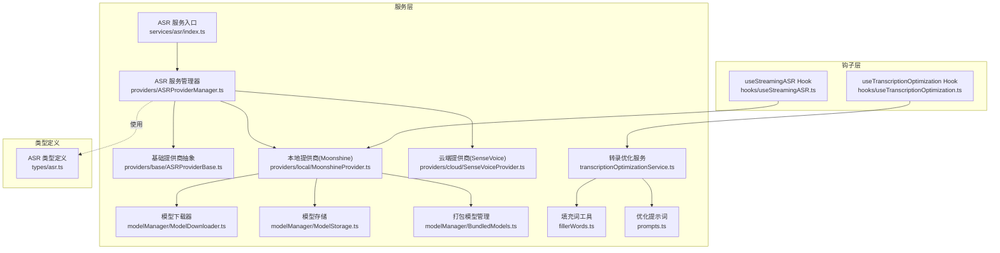
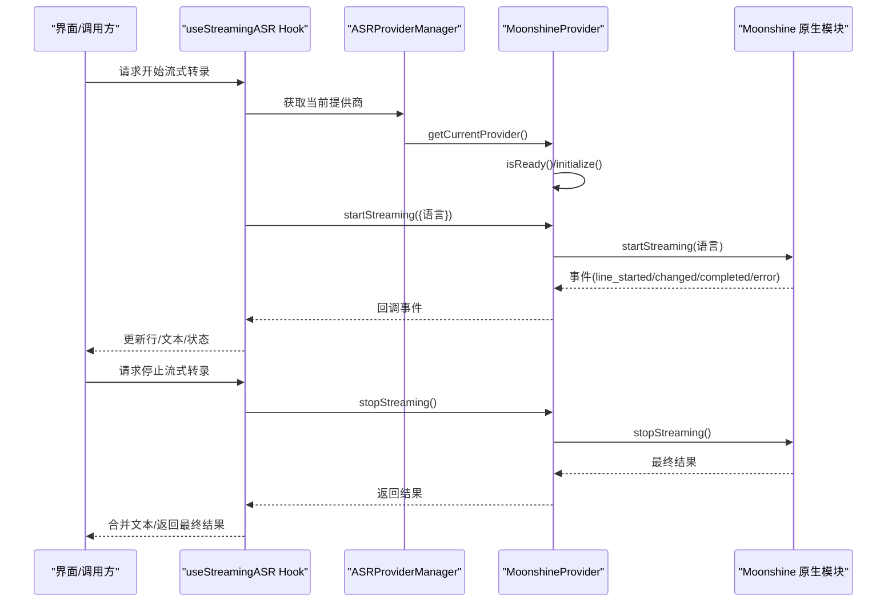
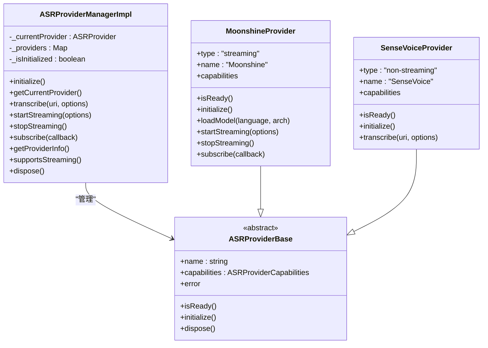
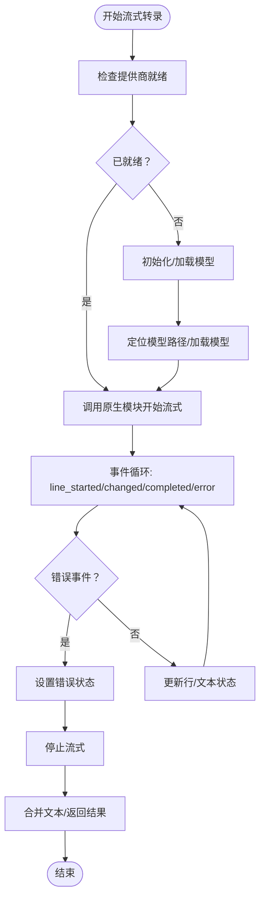
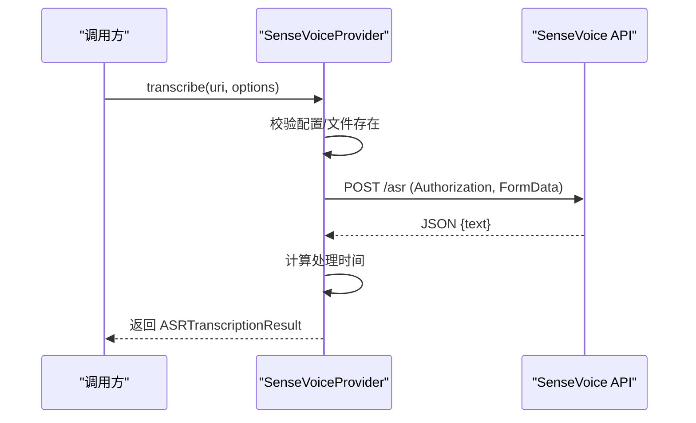
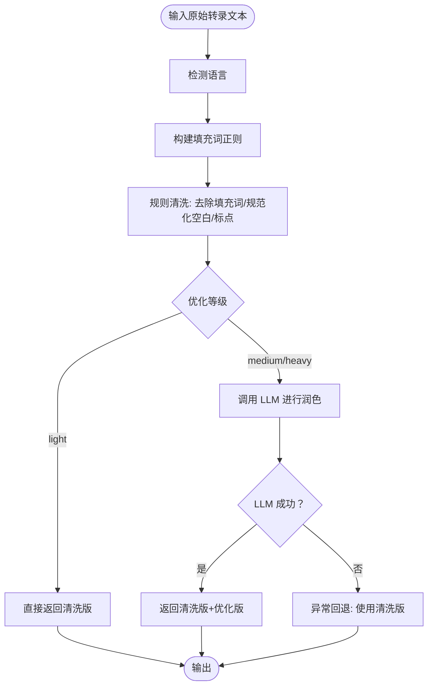
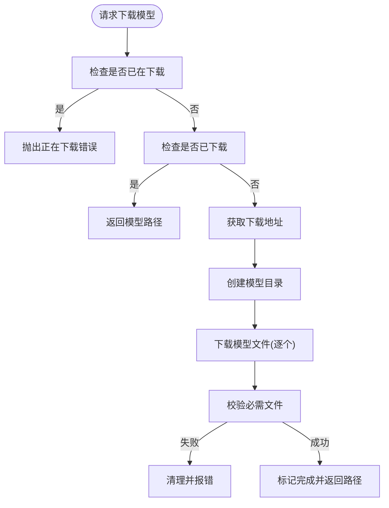
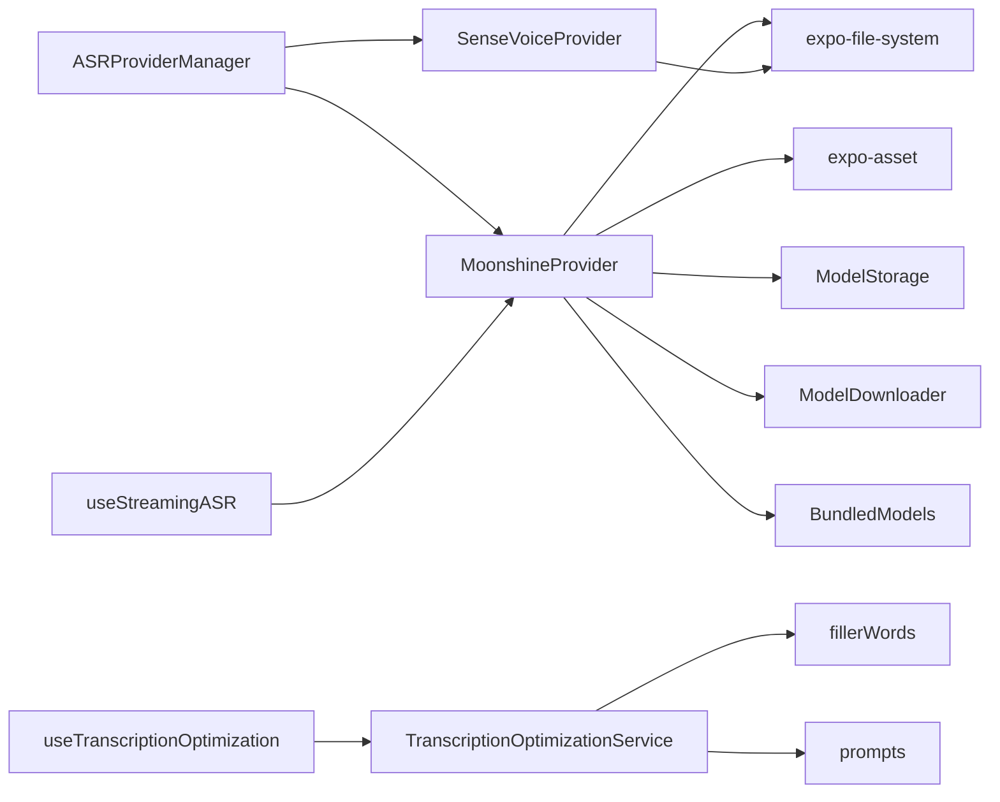

# 语音转录模块

<cite>
**本文档引用的文件**
- [services/asr/index.ts](file://services/asr/index.ts)
- [services/asr/asrService.ts](file://services/asr/asrService.ts)
- [services/asr/providers/ASRProviderManager.ts](file://services/asr/providers/ASRProviderManager.ts)
- [services/asr/providers/base/ASRProviderBase.ts](file://services/asr/providers/base/ASRProviderBase.ts)
- [services/asr/providers/local/MoonshineProvider.ts](file://services/asr/providers/local/MoonshineProvider.ts)
- [services/asr/providers/cloud/SenseVoiceProvider.ts](file://services/asr/providers/cloud/SenseVoiceProvider.ts)
- [services/asr/modelManager/ModelDownloader.ts](file://services/asr/modelManager/ModelDownloader.ts)
- [services/asr/modelManager/ModelStorage.ts](file://services/asr/modelManager/ModelStorage.ts)
- [services/asr/modelManager/BundledModels.ts](file://services/asr/modelManager/BundledModels.ts)
- [services/transcription/transcriptionOptimizationService.ts](file://services/transcription/transcriptionOptimizationService.ts)
- [services/transcription/fillerWords.ts](file://services/transcription/fillerWords.ts)
- [services/transcription/prompts.ts](file://services/transcription/prompts.ts)
- [hooks/useStreamingASR.ts](file://hooks/useStreamingASR.ts)
- [hooks/useTranscriptionOptimization.ts](file://hooks/useTranscriptionOptimization.ts)
- [types/asr.ts](file://types/asr.ts)
</cite>

## 目录
1. [简介](#简介)
2. [项目结构](#项目结构)
3. [核心组件](#核心组件)
4. [架构总览](#架构总览)
5. [详细组件分析](#详细组件分析)
6. [依赖关系分析](#依赖关系分析)
7. [性能考虑](#性能考虑)
8. [故障排除指南](#故障排除指南)
9. [结论](#结论)
10. [附录](#附录)

## 简介
本文件系统性梳理语音转录模块的整体架构与实现细节，覆盖本地转录（Moonshine）与云端转录（SenseVoice）两大路径；阐述 ASR 服务管理器的设计模式与扩展机制；详解转录优化服务（填充词过滤、文本格式化、LLM 后处理）的工作流程；说明流式 ASR 的实现技术与实时转录能力；给出模型下载与管理机制（本地模型存储与更新策略）；并提供转录质量优化与错误处理的最佳实践，以及面向开发者的定制与性能调优指导。

## 项目结构
语音转录模块主要分布在以下目录与文件中：
- 服务层：ASR 服务与提供商、模型管理、转录优化
- 钩子层：React Hooks 封装流式 ASR 与转录优化
- 类型定义：ASR 与转录相关的类型与能力描述
- 资源与模型：ONNX 模型资源与打包模型提取

**图表来源**
- [services/asr/index.ts:1-70](file://services/asr/index.ts#L1-L70)
- [services/asr/providers/ASRProviderManager.ts:1-263](file://services/asr/providers/ASRProviderManager.ts#L1-L263)
- [services/asr/providers/base/ASRProviderBase.ts:1-66](file://services/asr/providers/base/ASRProviderBase.ts#L1-L66)
- [services/asr/providers/local/MoonshineProvider.ts:1-307](file://services/asr/providers/local/MoonshineProvider.ts#L1-L307)
- [services/asr/providers/cloud/SenseVoiceProvider.ts:1-167](file://services/asr/providers/cloud/SenseVoiceProvider.ts#L1-L167)
- [services/asr/modelManager/ModelDownloader.ts:1-207](file://services/asr/modelManager/ModelDownloader.ts#L1-L207)
- [services/asr/modelManager/ModelStorage.ts:1-186](file://services/asr/modelManager/ModelStorage.ts#L1-L186)
- [services/asr/modelManager/BundledModels.ts:1-258](file://services/asr/modelManager/BundledModels.ts#L1-L258)
- [services/transcription/transcriptionOptimizationService.ts:1-88](file://services/transcription/transcriptionOptimizationService.ts#L1-L88)
- [services/transcription/fillerWords.ts:1-21](file://services/transcription/fillerWords.ts#L1-L21)
- [services/transcription/prompts.ts:1-24](file://services/transcription/prompts.ts#L1-L24)
- [hooks/useStreamingASR.ts:1-269](file://hooks/useStreamingASR.ts#L1-L269)
- [hooks/useTranscriptionOptimization.ts:1-61](file://hooks/useTranscriptionOptimization.ts#L1-L61)
- [types/asr.ts:1-164](file://types/asr.ts#L1-L164)

**章节来源**
- [services/asr/index.ts:1-70](file://services/asr/index.ts#L1-L70)
- [types/asr.ts:1-164](file://types/asr.ts#L1-L164)

## 核心组件
- ASR 服务管理器：统一协调本地与云端提供商，负责提供商生命周期、状态检查、能力查询与事件订阅。
- 本地提供商（Moonshine）：基于 ONNX 模型的本地流式 ASR，支持实时转录与增量结果。
- 云端提供商（SenseVoice）：非流式的云端 API 调用，适合网络环境稳定场景。
- 模型管理：负责模型下载、存储、校验、删除与打包模型提取。
- 转录优化服务：规则清洗（填充词过滤、标点与空格规范化）与 LLM 后处理（轻/重两级优化）。
- React 钩子：useStreamingASR 与 useTranscriptionOptimization 将复杂逻辑封装为易用接口。

**章节来源**
- [services/asr/providers/ASRProviderManager.ts:30-263](file://services/asr/providers/ASRProviderManager.ts#L30-L263)
- [services/asr/providers/local/MoonshineProvider.ts:42-291](file://services/asr/providers/local/MoonshineProvider.ts#L42-L291)
- [services/asr/providers/cloud/SenseVoiceProvider.ts:27-153](file://services/asr/providers/cloud/SenseVoiceProvider.ts#L27-L153)
- [services/asr/modelManager/ModelDownloader.ts:37-165](file://services/asr/modelManager/ModelDownloader.ts#L37-L165)
- [services/transcription/transcriptionOptimizationService.ts:22-87](file://services/transcription/transcriptionOptimizationService.ts#L22-L87)
- [hooks/useStreamingASR.ts:67-269](file://hooks/useStreamingASR.ts#L67-L269)
- [hooks/useTranscriptionOptimization.ts:15-61](file://hooks/useTranscriptionOptimization.ts#L15-L61)

## 架构总览
语音转录模块采用“服务管理器 + 多提供商 + 模型管理 + 优化服务”的分层架构。服务管理器根据设置动态选择本地或云端提供商，并在需要时初始化与加载模型。流式 ASR 通过 Moonshine 提供实时增量结果，非流式 ASR 通过 SenseVoice 完成一次性识别。转录优化服务在规则清洗后可选地进行 LLM 后处理，提升文本质量。

**图表来源**
- [hooks/useStreamingASR.ts:190-241](file://hooks/useStreamingASR.ts#L190-L241)
- [services/asr/providers/ASRProviderManager.ts:63-100](file://services/asr/providers/ASRProviderManager.ts#L63-L100)
- [services/asr/providers/local/MoonshineProvider.ts:192-259](file://services/asr/providers/local/MoonshineProvider.ts#L192-L259)

## 详细组件分析

### ASR 服务管理器设计与扩展机制
- 设计模式：单例 + 工厂/注册表模式。管理器维护提供商映射，按需创建与初始化提供商实例；通过 isStreamingProvider 类型守卫区分流式与非流式提供商。
- 生命周期：支持初始化、就绪检查、释放资源；在切换提供商或配置变更时自动处置旧实例并创建新实例。
- 扩展机制：新增提供商只需实现统一接口（继承基础类或实现相应接口），并在管理器中注册键值与创建逻辑；通过设置中的提供商类型字段即可无缝接入。

**图表来源**
- [services/asr/providers/ASRProviderManager.ts:30-263](file://services/asr/providers/ASRProviderManager.ts#L30-L263)
- [services/asr/providers/base/ASRProviderBase.ts:13-66](file://services/asr/providers/base/ASRProviderBase.ts#L13-L66)
- [services/asr/providers/local/MoonshineProvider.ts:42-291](file://services/asr/providers/local/MoonshineProvider.ts#L42-L291)
- [services/asr/providers/cloud/SenseVoiceProvider.ts:27-153](file://services/asr/providers/cloud/SenseVoiceProvider.ts#L27-L153)

**章节来源**
- [services/asr/providers/ASRProviderManager.ts:30-263](file://services/asr/providers/ASRProviderManager.ts#L30-L263)
- [services/asr/providers/base/ASRProviderBase.ts:13-66](file://services/asr/providers/base/ASRProviderBase.ts#L13-L66)

### 本地转录（Moonshine）实现
- 流式能力：支持实时转录与增量文本推送，事件类型包括行开始、文本变更、行完成与错误。
- 初始化策略：优先检查原生模块可用性，再检查模型是否已加载；若未加载则尝试下载或从打包模型提取到目标路径后再加载。
- 事件处理：订阅原生事件，转发给所有回调；错误事件会同步更新提供商内部错误状态。
- 资源管理：启动前确保无活动流；停止时卸载模型并清理事件订阅。

**图表来源**
- [services/asr/providers/local/MoonshineProvider.ts:192-259](file://services/asr/providers/local/MoonshineProvider.ts#L192-L259)
- [hooks/useStreamingASR.ts:118-185](file://hooks/useStreamingASR.ts#L118-L185)

**章节来源**
- [services/asr/providers/local/MoonshineProvider.ts:42-291](file://services/asr/providers/local/MoonshineProvider.ts#L42-L291)
- [hooks/useStreamingASR.ts:67-269](file://hooks/useStreamingASR.ts#L67-L269)

### 云端转录（SenseVoice）实现
- 非流式调用：通过表单上传音频文件与指定模型，支持超时控制与错误处理。
- 配置校验：读取设置中的 API 地址与密钥，未配置时抛出明确错误。
- 结果封装：计算处理耗时并返回统一的转录结果对象。

**图表来源**
- [services/asr/providers/cloud/SenseVoiceProvider.ts:82-152](file://services/asr/providers/cloud/SenseVoiceProvider.ts#L82-L152)

**章节来源**
- [services/asr/providers/cloud/SenseVoiceProvider.ts:27-153](file://services/asr/providers/cloud/SenseVoiceProvider.ts#L27-L153)

### 转录优化服务工作流程
- 规则清洗：检测语言、构建填充词正则、去除填充词、规范化空白与标点、去首尾空格。
- LLM 后处理：根据优化等级构建系统提示词与用户提示，调用 LLM 接口进行文本润色；失败时回退到清洗版本。
- 统一入口：optimizeTranscription 返回清洗版与优化版文本，便于 UI 展示与选择。

**图表来源**
- [services/transcription/transcriptionOptimizationService.ts:62-87](file://services/transcription/transcriptionOptimizationService.ts#L62-L87)
- [services/transcription/fillerWords.ts:8-21](file://services/transcription/fillerWords.ts#L8-L21)
- [services/transcription/prompts.ts:3-23](file://services/transcription/prompts.ts#L3-L23)

**章节来源**
- [services/transcription/transcriptionOptimizationService.ts:18-87](file://services/transcription/transcriptionOptimizationService.ts#L18-L87)
- [services/transcription/fillerWords.ts:1-21](file://services/transcription/fillerWords.ts#L1-L21)
- [services/transcription/prompts.ts:1-24](file://services/transcription/prompts.ts#L1-L24)

### 模型下载与管理机制
- 存储结构：模型按语言与架构命名，存放在应用文档目录下的专用文件夹；必需文件包括编码器、解码器与分词器。
- 下载流程：支持自定义下载地址或默认地址；先下载压缩包，再逐个文件解压；验证必需文件完整性；失败时清理部分下载产物。
- 打包模型：在首次启动时可从应用资源中提取预置模型到本地，避免首次使用网络下载。
- 状态跟踪：记录下载状态与进度，支持取消下载与清理状态。

**图表来源**
- [services/asr/modelManager/ModelDownloader.ts:37-165](file://services/asr/modelManager/ModelDownloader.ts#L37-L165)
- [services/asr/modelManager/ModelStorage.ts:49-131](file://services/asr/modelManager/ModelStorage.ts#L49-L131)
- [services/asr/modelManager/BundledModels.ts:96-201](file://services/asr/modelManager/BundledModels.ts#L96-L201)

**章节来源**
- [services/asr/modelManager/ModelDownloader.ts:1-207](file://services/asr/modelManager/ModelDownloader.ts#L1-L207)
- [services/asr/modelManager/ModelStorage.ts:1-186](file://services/asr/modelManager/ModelStorage.ts#L1-L186)
- [services/asr/modelManager/BundledModels.ts:1-258](file://services/asr/modelManager/BundledModels.ts#L1-L258)

### 传统 ASR 服务与遗留 API
- 传统接口：提供 transcribeAudio 与 isASRConfigured 等函数，兼容旧版本调用方式。
- 配置与错误：读取设置或环境变量中的 API 地址与密钥；对文件不存在、超时、HTTP 错误等进行分类处理。

**章节来源**
- [services/asr/asrService.ts:1-74](file://services/asr/asrService.ts#L1-L74)

## 依赖关系分析
- 组件耦合：服务管理器与提供商之间通过统一接口解耦；提供商与原生模块之间通过适配器封装。
- 外部依赖：网络请求（fetch）、文件系统（expo-file-system）、资产加载（expo-asset）、异步存储（AsyncStorage）。
- 类型契约：ASRProviderType、ASRProviderCapabilities、StreamingEvent 等类型贯穿服务层与钩子层，保证跨模块一致性。

**图表来源**
- [services/asr/providers/ASRProviderManager.ts:38-137](file://services/asr/providers/ASRProviderManager.ts#L38-L137)
- [services/asr/providers/local/MoonshineProvider.ts:19-30](file://services/asr/providers/local/MoonshineProvider.ts#L19-L30)
- [services/asr/providers/cloud/SenseVoiceProvider.ts:8-13](file://services/asr/providers/cloud/SenseVoiceProvider.ts#L8-L13)
- [services/transcription/transcriptionOptimizationService.ts:1-6](file://services/transcription/transcriptionOptimizationService.ts#L1-L6)
- [hooks/useStreamingASR.ts:8-11](file://hooks/useStreamingASR.ts#L8-L11)
- [hooks/useTranscriptionOptimization.ts:1-4](file://hooks/useTranscriptionOptimization.ts#L1-L4)

**章节来源**
- [services/asr/providers/ASRProviderManager.ts:1-263](file://services/asr/providers/ASRProviderManager.ts#L1-L263)
- [hooks/useStreamingASR.ts:1-269](file://hooks/useStreamingASR.ts#L1-L269)
- [hooks/useTranscriptionOptimization.ts:1-61](file://hooks/useTranscriptionOptimization.ts#L1-L61)

## 性能考虑
- 本地转录优势：无需网络，延迟低，适合离线场景；但模型体积较大，首次加载耗时较长。
- 云端转录优势：识别准确度高，适合多语言与复杂场景；受网络与 API 限流影响。
- 模型优化：优先使用打包模型减少首次加载；合理选择模型架构（small/base）平衡精度与体积。
- 事件处理：流式事件频繁，注意去抖与最小化渲染开销；合并文本时避免不必要的字符串拼接。
- 超时与重试：为网络请求设置合理超时；对临时错误进行指数退避重试（建议在上层业务中实现）。

## 故障排除指南
- 未配置 ASR：检查设置中的 API 地址与密钥；确保环境变量正确。
- 文件不存在：确认音频 URI 指向有效文件；在上传后再次触发转录。
- 超时错误：增大超时阈值或在网络状况良好时重试；检查服务端响应时间。
- 本地模型未就绪：确认模型已下载或打包模型已提取；检查必需文件完整性。
- 原生模块不可用：确认平台支持与构建包含原生模块；Android 需要麦克风权限。
- LLM 优化失败：检查 LLM 配置与网络连通性；出现异常时回退到清洗版本。

**章节来源**
- [services/asr/asrService.ts:19-73](file://services/asr/asrService.ts#L19-L73)
- [services/asr/providers/local/MoonshineProvider.ts:63-135](file://services/asr/providers/local/MoonshineProvider.ts#L63-L135)
- [services/asr/providers/cloud/SenseVoiceProvider.ts:56-152](file://services/asr/providers/cloud/SenseVoiceProvider.ts#L56-L152)
- [services/transcription/transcriptionOptimizationService.ts:18-87](file://services/transcription/transcriptionOptimizationService.ts#L18-L87)

## 结论
该语音转录模块以服务管理器为核心，结合本地 Moonshine 与云端 SenseVoice 提供商，实现了灵活、可扩展且高性能的语音转录能力。配合完善的模型管理与转录优化服务，既能满足离线与实时场景，也能在云端场景下获得高质量文本。通过合理的错误处理与性能优化策略，开发者可以在此基础上快速定制与调优，满足不同业务需求。

## 附录
- 集成与使用示例（路径参考）
  - 本地流式转录：参考 [hooks/useStreamingASR.ts:67-269](file://hooks/useStreamingASR.ts#L67-L269)，通过 MoonshineProvider 实现 startStreaming/stopStreaming 与事件订阅。
  - 云端转录：参考 [services/asr/providers/cloud/SenseVoiceProvider.ts:82-152](file://services/asr/providers/cloud/SenseVoiceProvider.ts#L82-L152)，调用 transcribe 完成一次性识别。
  - 转录优化：参考 [services/transcription/transcriptionOptimizationService.ts:62-87](file://services/transcription/transcriptionOptimizationService.ts#L62-L87)，结合 [hooks/useTranscriptionOptimization.ts:15-61](file://hooks/useTranscriptionOptimization.ts#L15-L61) 在 UI 中使用。
  - 模型下载与管理：参考 [services/asr/modelManager/ModelDownloader.ts:37-165](file://services/asr/modelManager/ModelDownloader.ts#L37-L165)、[services/asr/modelManager/ModelStorage.ts:49-131](file://services/asr/modelManager/ModelStorage.ts#L49-L131)、[services/asr/modelManager/BundledModels.ts:96-201](file://services/asr/modelManager/BundledModels.ts#L96-L201)。
- 类型定义参考：[types/asr.ts:1-164](file://types/asr.ts#L1-L164)