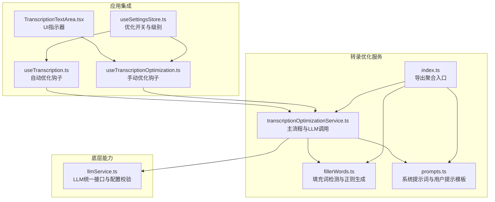
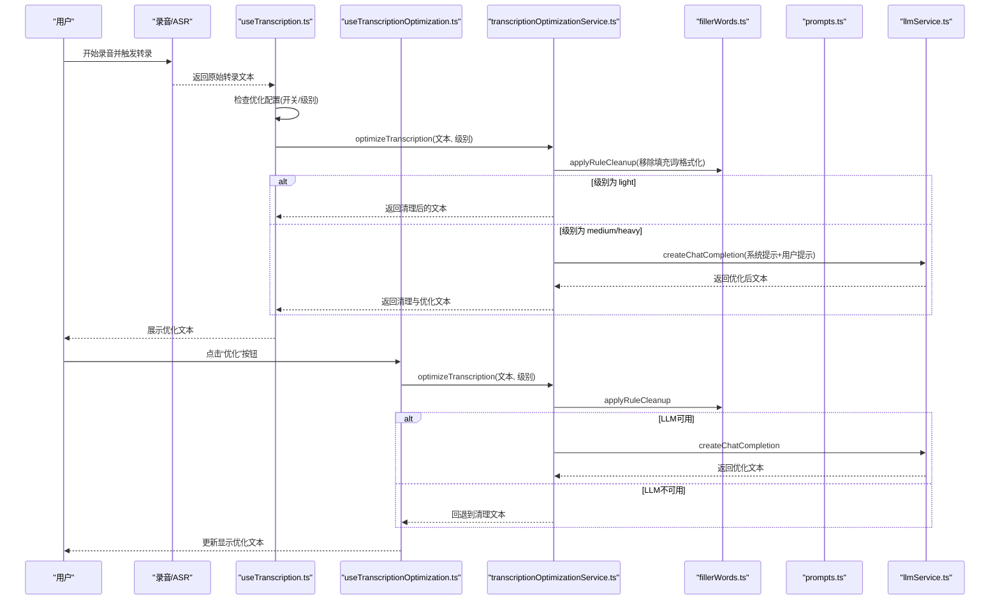
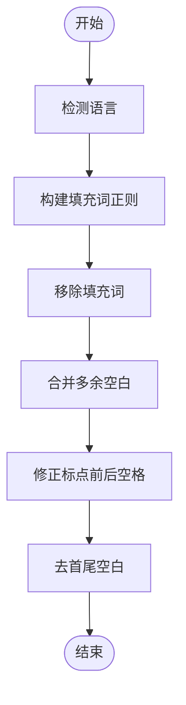
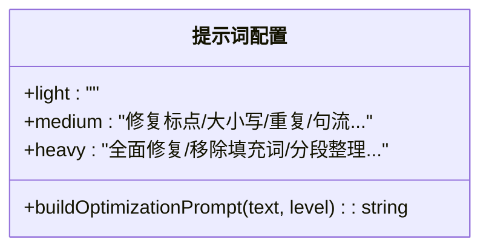
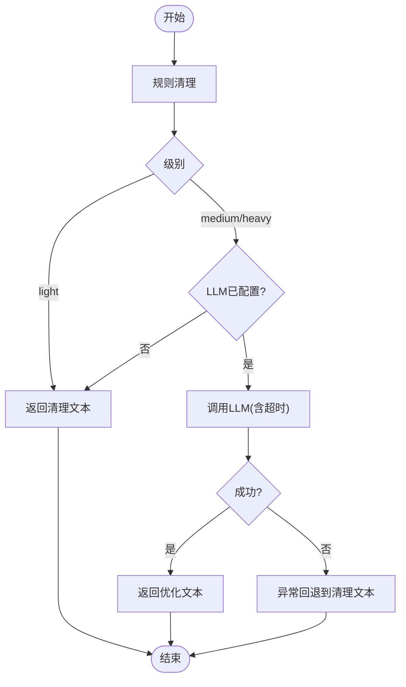
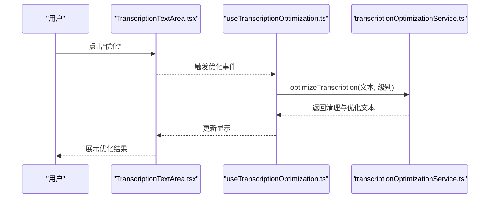
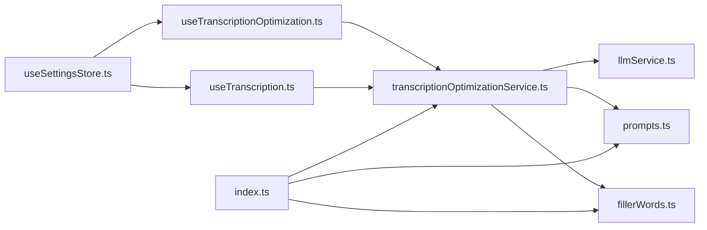

# 转录优化服务

<cite>
**本文档引用的文件**
- [transcriptionOptimizationService.ts](file://services/transcription/transcriptionOptimizationService.ts)
- [fillerWords.ts](file://services/transcription/fillerWords.ts)
- [prompts.ts](file://services/transcription/prompts.ts)
- [useTranscriptionOptimization.ts](file://hooks/useTranscriptionOptimization.ts)
- [useTranscription.ts](file://hooks/useTranscription.ts)
- [transcription.ts](file://types/transcription.ts)
- [llmService.ts](file://services/llm/llmService.ts)
- [useSettingsStore.ts](file://store/useSettingsStore.ts)
- [index.ts](file://services/transcription/index.ts)
- [TranscriptionTextArea.tsx](file://components/input/TranscriptionTextArea.tsx)
- [recording/[id].tsx](file://app/recording/[id].tsx)
- [note/[id].tsx](file://app/note/[id].tsx)
- [optimization.json](file://i18n/locales/en/optimization.json)
</cite>

## 目录
1. [简介](#简介)
2. [项目结构](#项目结构)
3. [核心组件](#核心组件)
4. [架构总览](#架构总览)
5. [详细组件分析](#详细组件分析)
6. [依赖关系分析](#依赖关系分析)
7. [性能考虑](#性能考虑)
8. [故障排除指南](#故障排除指南)
9. [结论](#结论)
10. [附录](#附录)

## 简介
本文件面向转录优化服务的开发者与使用者，系统性介绍服务的整体架构、处理流程与关键算法。内容涵盖填充词过滤机制、文本格式化与标点修复、大小写调整、优化提示词设计与自定义、错误回退与超时控制、以及在应用中的集成方式（包括自动优化与手动优化）。同时提供性能优化建议、缓存与批量处理思路，以及质量评估与用户反馈的可扩展方案。

## 项目结构
转录优化服务位于 services/transcription 目录，围绕规则清理与大模型增强两条路径构建，并通过 hooks/useTranscriptionOptimization.ts 提供 React Hook 接口，配合 store/useSettingsStore.ts 的全局设置进行启用与级别控制。

**图表来源**
- [transcriptionOptimizationService.ts:1-88](file://services/transcription/transcriptionOptimizationService.ts#L1-L88)
- [fillerWords.ts:1-21](file://services/transcription/fillerWords.ts#L1-L21)
- [prompts.ts:1-24](file://services/transcription/prompts.ts#L1-L24)
- [index.ts:1-8](file://services/transcription/index.ts#L1-L8)
- [useTranscription.ts:1-103](file://hooks/useTranscription.ts#L1-L103)
- [useTranscriptionOptimization.ts:1-61](file://hooks/useTranscriptionOptimization.ts#L1-L61)
- [TranscriptionTextArea.tsx:1-156](file://components/input/TranscriptionTextArea.tsx#L1-L156)
- [useSettingsStore.ts:1-218](file://store/useSettingsStore.ts#L1-L218)
- [llmService.ts:1-61](file://services/llm/llmService.ts#L1-L61)

**章节来源**
- [transcriptionOptimizationService.ts:1-88](file://services/transcription/transcriptionOptimizationService.ts#L1-L88)
- [useTranscription.ts:1-103](file://hooks/useTranscription.ts#L1-L103)
- [useTranscriptionOptimization.ts:1-61](file://hooks/useTranscriptionOptimization.ts#L1-L61)
- [useSettingsStore.ts:112-115](file://store/useSettingsStore.ts#L112-L115)

## 核心组件
- 规则清理函数：applyRuleCleanup，负责移除填充词、规范化空白与标点间距、去除多余空格并修剪两端。
- LLM 优化函数：applyLLMOptimization，基于系统提示词与用户提示构造对话消息，带超时控制与错误回退。
- 主流程函数：optimizeTranscription，按优化级别执行规则清理或规则+LLM优化，并在异常时回退到清理版本。
- 填充词模块：fillerWords.ts，提供多语言填充词表、语言检测与正则构建。
- 提示词模块：prompts.ts，定义不同级别的系统提示词与通用用户提示模板。
- 集成钩子：useTranscription.ts（自动优化）、useTranscriptionOptimization.ts（手动优化），管理状态与错误。
- 设置存储：useSettingsStore.ts，维护优化开关与级别等全局配置。

**章节来源**
- [transcriptionOptimizationService.ts:22-87](file://services/transcription/transcriptionOptimizationService.ts#L22-L87)
- [fillerWords.ts:1-21](file://services/transcription/fillerWords.ts#L1-L21)
- [prompts.ts:1-24](file://services/transcription/prompts.ts#L1-L24)
- [useTranscription.ts:22-65](file://hooks/useTranscription.ts#L22-L65)
- [useTranscriptionOptimization.ts:15-60](file://hooks/useTranscriptionOptimization.ts#L15-L60)
- [useSettingsStore.ts:112-115](file://store/useSettingsStore.ts#L112-L115)

## 架构总览
下图展示了从录音到优化再到界面呈现的端到端流程，包括自动优化与手动优化两条路径。

**图表来源**
- [useTranscription.ts:33-65](file://hooks/useTranscription.ts#L33-L65)
- [useTranscriptionOptimization.ts:23-43](file://hooks/useTranscriptionOptimization.ts#L23-L43)
- [transcriptionOptimizationService.ts:62-87](file://services/transcription/transcriptionOptimizationService.ts#L62-L87)
- [fillerWords.ts:22-33](file://services/transcription/fillerWords.ts#L22-L33)
- [prompts.ts:3-23](file://services/transcription/prompts.ts#L3-L23)
- [llmService.ts:32-37](file://services/llm/llmService.ts#L32-L37)

## 详细组件分析

### 规则清理与填充词过滤机制
- 多语言填充词表：支持中文、英文、日文、韩文，覆盖常见口语停顿与连接词。
- 语言检测：基于 Unicode 范围快速判断文本所属语言。
- 正则构建：对词表进行转义拼接，生成单词边界匹配的正则表达式，确保精确替换。
- 清理步骤：移除填充词 → 合并多余空白 → 修正标点前后空格 → 去除首尾空白。

**图表来源**
- [fillerWords.ts:8-20](file://services/transcription/fillerWords.ts#L8-L20)
- [transcriptionOptimizationService.ts:22-33](file://services/transcription/transcriptionOptimizationService.ts#L22-L33)

**章节来源**
- [fillerWords.ts:1-21](file://services/transcription/fillerWords.ts#L1-L21)
- [transcriptionOptimizationService.ts:22-33](file://services/transcription/transcriptionOptimizationService.ts#L22-L33)

### 文本格式化、标点添加与大小写调整
- 标点修复：统一标点前后空格，避免“文本,标点”或“文本 ,标点”的不规范形式。
- 大小写调整：由 LLM 在系统提示中明确要求“修复大小写”，确保句子首字母与专有名词等符合规范。
- 句子连贯性：在 medium/heavy 级别中，LLM 会改善句子流畅度与段落组织。

**章节来源**
- [prompts.ts:5-18](file://services/transcription/prompts.ts#L5-L18)
- [transcriptionOptimizationService.ts:22-33](file://services/transcription/transcriptionOptimizationService.ts#L22-L33)

### 优化提示词设计与自定义
- light 级别：无 LLM，仅规则清理。
- medium 级别：要求修复标点与大小写、去除冗余重复、轻微改善句流，保持原意与语调。
- heavy 级别：要求全面语法与标点修复、移除填充词与口误、提升清晰度与流畅度、分段整理、保持原意。
- 用户提示：统一模板“请优化以下转录文本”，便于注入原始文本。

**图表来源**
- [prompts.ts:3-23](file://services/transcription/prompts.ts#L3-L23)

**章节来源**
- [prompts.ts:1-24](file://services/transcription/prompts.ts#L1-L24)

### 优化流程与错误回退
- 流程：规则清理 → light 直接返回 → medium/heavy 进入 LLM → 成功返回优化文本 → 异常回退到清理版本。
- 超时控制：为 LLM 请求设置 15 秒超时，防止长时间等待。
- 配置检查：若未配置 LLM，直接回退到规则清理版本。

**图表来源**
- [transcriptionOptimizationService.ts:62-87](file://services/transcription/transcriptionOptimizationService.ts#L62-L87)
- [llmService.ts:18-30](file://services/llm/llmService.ts#L18-L30)

**章节来源**
- [transcriptionOptimizationService.ts:7-87](file://services/transcription/transcriptionOptimizationService.ts#L7-L87)
- [llmService.ts:18-30](file://services/llm/llmService.ts#L18-L30)

### 应用集成与用户交互
- 自动优化：在录音完成后根据设置自动触发优化，切换到优化视图。
- 手动优化：提供独立 Hook，允许用户随时对任意文本进行优化。
- UI 指示：在输入区域右上角显示“优化中”加载动画与文案，提升用户体验。
- 设置项：在设置中开启/关闭优化，并选择 light/medium/heavy 级别。

**图表来源**
- [TranscriptionTextArea.tsx:90-95](file://components/input/TranscriptionTextArea.tsx#L90-L95)
- [useTranscriptionOptimization.ts:23-43](file://hooks/useTranscriptionOptimization.ts#L23-L43)
- [transcriptionOptimizationService.ts:62-87](file://services/transcription/transcriptionOptimizationService.ts#L62-L87)

**章节来源**
- [useTranscription.ts:42-55](file://hooks/useTranscription.ts#L42-L55)
- [useTranscriptionOptimization.ts:15-60](file://hooks/useTranscriptionOptimization.ts#L15-L60)
- [TranscriptionTextArea.tsx:90-95](file://components/input/TranscriptionTextArea.tsx#L90-L95)
- [useSettingsStore.ts:179-186](file://store/useSettingsStore.ts#L179-L186)
- [optimization.json:1-10](file://i18n/locales/en/optimization.json#L1-L10)

## 依赖关系分析
- 组件耦合：transcriptionOptimizationService.ts 依赖 fillerWords.ts 与 prompts.ts；useTranscription.ts 与 useTranscriptionOptimization.ts 依赖 optimizeTranscription 并受 useSettingsStore.ts 控制。
- 外部依赖：llmService.ts 提供统一的 LLM 能力与配置校验，支持本地与云端提供商。
- 导出聚合：index.ts 将常用工具导出，便于上层模块按需引入。

**图表来源**
- [useTranscriptionOptimization.ts:1-61](file://hooks/useTranscriptionOptimization.ts#L1-L61)
- [useTranscription.ts:1-103](file://hooks/useTranscription.ts#L1-L103)
- [transcriptionOptimizationService.ts:1-8](file://services/transcription/transcriptionOptimizationService.ts#L1-L8)
- [fillerWords.ts:1-3](file://services/transcription/fillerWords.ts#L1-L3)
- [prompts.ts:1-3](file://services/transcription/prompts.ts#L1-L3)
- [llmService.ts:1-17](file://services/llm/llmService.ts#L1-L17)
- [useSettingsStore.ts:1-22](file://store/useSettingsStore.ts#L1-L22)
- [index.ts:1-8](file://services/transcription/index.ts#L1-L8)

**章节来源**
- [index.ts:1-8](file://services/transcription/index.ts#L1-L8)
- [useSettingsStore.ts:1-22](file://store/useSettingsStore.ts#L1-L22)

## 性能考虑
- 规则清理阶段：时间复杂度近似 O(n)，主要为一次字符串扫描与替换，开销极低。
- LLM 调用阶段：受网络与模型响应影响，设置 15 秒超时以保障交互流畅；建议在弱网环境下优先使用 light 级别。
- 缓存机制：当前未实现服务端/本地缓存。可在业务层引入基于输入指纹的内存缓存，避免重复优化相同文本。
- 批量处理：可在上层 UI 或服务端实现队列化批处理，合并多个优化请求，减少初始化成本与网络往返。
- UI 体验：在优化过程中显示加载指示，避免用户重复点击；优化完成后再更新显示，减少不必要的重渲染。

[本节为通用性能建议，无需特定文件引用]

## 故障排除指南
- LLM 未配置：isLLMConfigured 返回 false 时，优化将直接回退到规则清理版本。请检查设置中的提供商、API 地址与密钥。
- 优化超时：LLM 请求超过 15 秒将被中断，返回清理版本。建议在网络不佳时降低级别或启用本地模型。
- 错误回退：任何异常都会回退到清理版本并保留原始文本，确保不会丢失数据。
- UI 不更新：确认是否正确调用了优化钩子的 reset 与 optimize 方法，并检查 isOptimizing 状态变化。

**章节来源**
- [llmService.ts:18-30](file://services/llm/llmService.ts#L18-L30)
- [transcriptionOptimizationService.ts:76-86](file://services/transcription/transcriptionOptimizationService.ts#L76-L86)
- [useTranscriptionOptimization.ts:35-42](file://hooks/useTranscriptionOptimization.ts#L35-L42)

## 结论
该转录优化服务采用“规则清理 + LLM 增强”的双轨策略，在保证性能的同时提供了可扩展的文本优化能力。通过清晰的级别划分、完善的错误回退与超时控制，以及良好的 UI 集成，能够满足从轻量清理到深度润色的不同需求。未来可在缓存、批量处理与质量评估方面进一步增强，以提升大规模使用场景下的稳定性与效率。

[本节为总结性内容，无需特定文件引用]

## 附录

### 如何调用优化服务与处理结果
- 自动优化（录音完成后）：在 useTranscription.ts 中调用 optimizeTranscription，根据设置自动切换到优化视图。
- 手动优化（用户点击）：在 useTranscriptionOptimization.ts 中调用 optimize，实时获取清理与优化文本。
- 结果字段：cleaned 为规则清理后的文本，optimized 为最终优化文本；若 LLM 失败则两者相同。

**章节来源**
- [useTranscription.ts:42-55](file://hooks/useTranscription.ts#L42-L55)
- [useTranscriptionOptimization.ts:31-34](file://hooks/useTranscriptionOptimization.ts#L31-L34)
- [transcriptionOptimizationService.ts:62-87](file://services/transcription/transcriptionOptimizationService.ts#L62-L87)

### 优化质量评估与用户反馈
- 质量评估：可基于预设规则（如标点修复命中率、填充词移除率）与人工抽样评估，结合用户偏好统计（轻/中/重度选比）。
- 用户反馈：在设置页增加“优化效果评分”与“改进建议”入口，收集用户对优化结果的主观评价，持续迭代提示词与阈值。

[本节为概念性建议，无需特定文件引用]

### 扩展与定制指南
- 新增语言支持：在 fillerWords.ts 的 FILLER_WORDS 中添加新语言条目，并在 detectLanguage 中加入对应字符范围。
- 定制提示词：在 prompts.ts 中新增或修改系统提示词，明确优化目标与输出约束。
- 自定义清理规则：在 applyRuleCleanup 中追加新的正则替换或格式化步骤。
- 批量优化：在上层服务或后台任务中实现队列与并发控制，结合缓存减少重复计算。

**章节来源**
- [fillerWords.ts:1-21](file://services/transcription/fillerWords.ts#L1-L21)
- [prompts.ts:1-24](file://services/transcription/prompts.ts#L1-L24)
- [transcriptionOptimizationService.ts:22-33](file://services/transcription/transcriptionOptimizationService.ts#L22-L33)