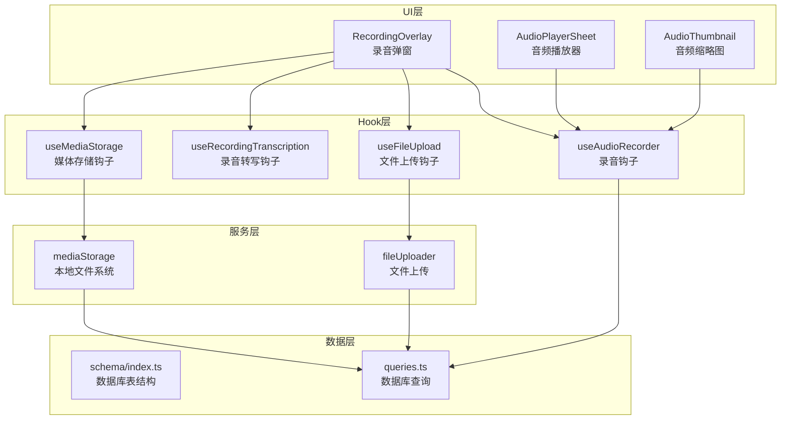
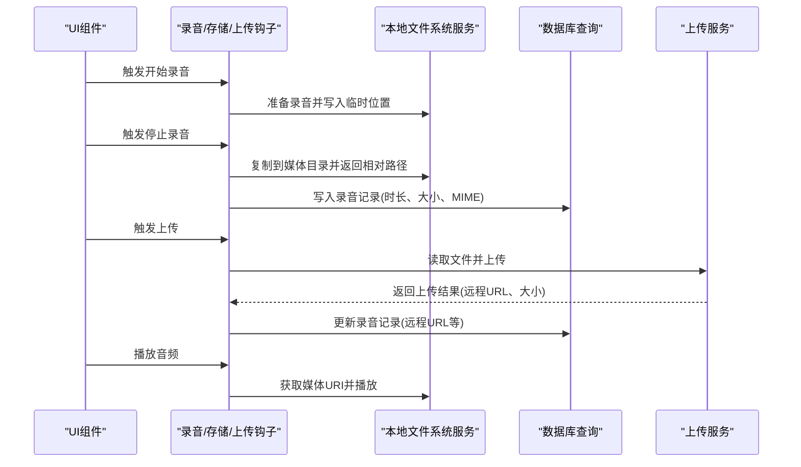
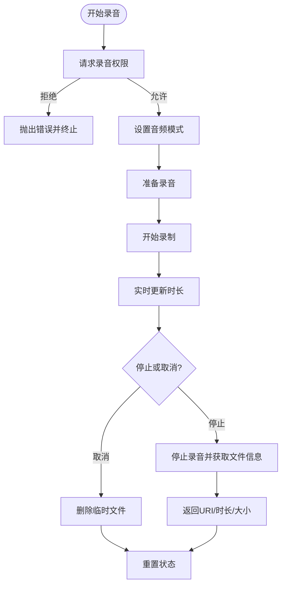
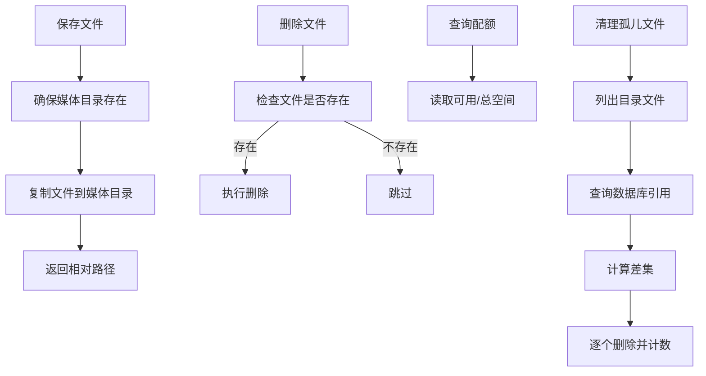
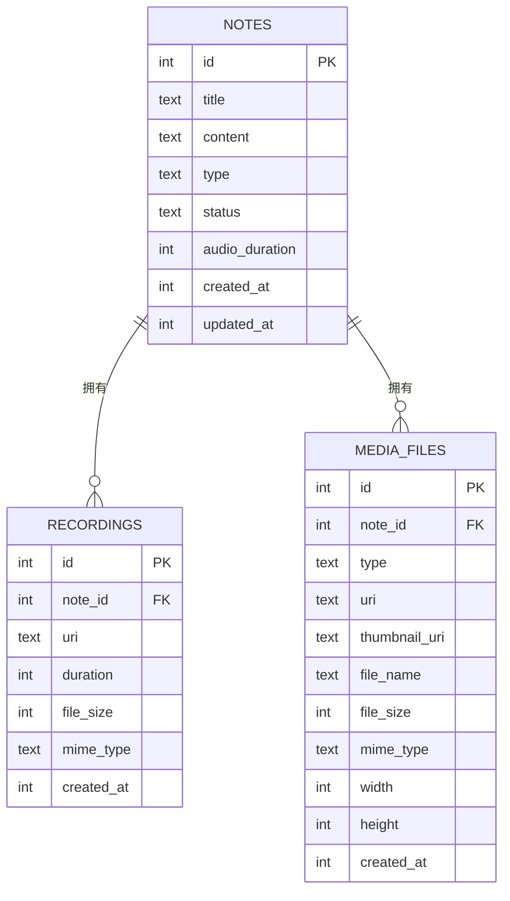
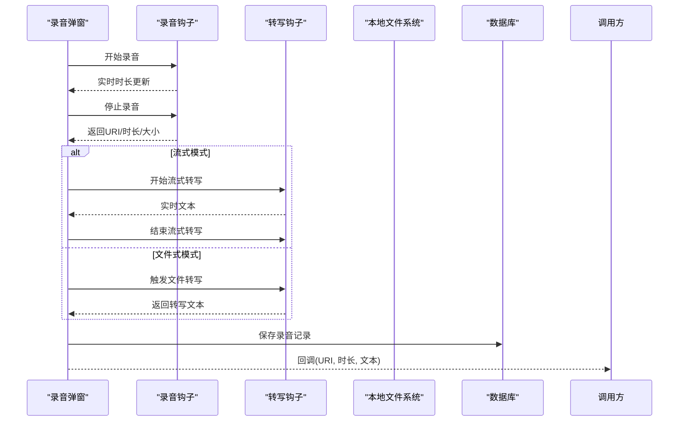
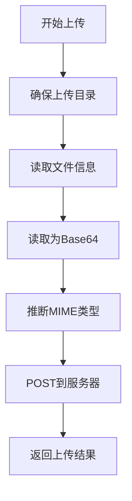
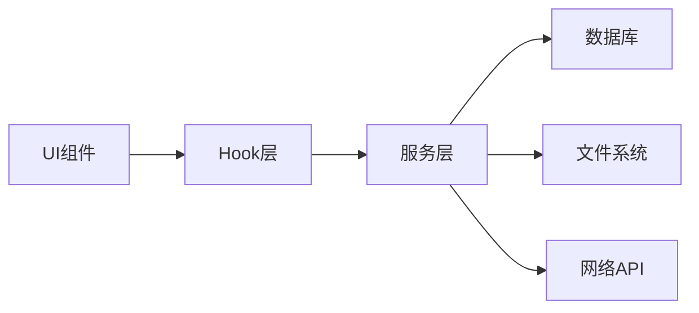

# 录音文件管理

<cite>
**本文档引用的文件**
- [useAudioRecorder.ts](file://hooks/useAudioRecorder.ts)
- [useMediaStorage.ts](file://hooks/useMediaStorage.ts)
- [mediaStorage.ts](file://services/mediaStorage.ts)
- [schema/index.ts](file://db/schema/index.ts)
- [queries.ts](file://db/queries.ts)
- [useRecordingStore.ts](file://store/useRecordingStore.ts)
- [RecordingOverlay.tsx](file://components/input/RecordingOverlay.tsx)
- [AudioPlayerSheet.tsx](file://components/note/viewer/AudioPlayerSheet.tsx)
- [useFileUpload.ts](file://hooks/useFileUpload.ts)
- [upload/index.ts](file://services/upload/index.ts)
- [useRecordingTranscription.ts](file://hooks/useRecordingTranscription.ts)
- [AudioThumbnail.tsx](file://components/note/preview/AudioThumbnail.tsx)
</cite>

## 目录
1. [简介](#简介)
2. [项目结构](#项目结构)
3. [核心组件](#核心组件)
4. [架构总览](#架构总览)
5. [详细组件分析](#详细组件分析)
6. [依赖关系分析](#依赖关系分析)
7. [性能考量](#性能考量)
8. [故障排除指南](#故障排除指南)
9. [结论](#结论)
10. [附录](#附录)

## 简介
本文件面向录音文件管理功能，系统性阐述以下内容：
- 存储策略：本地存储位置、文件命名规则、目录结构
- 元数据管理：文件大小、时长、创建时间、修改时间等的记录与查询
- 生命周期管理：文件创建、更新、删除、清理等操作
- 与笔记系统的关联：文件绑定、引用关系、数据同步
- 使用示例：文件上传、下载、删除、查询等操作的代码路径
- 安全考虑：文件权限、访问控制、数据保护
- 扩展与定制：如何基于现有架构进行二次开发

## 项目结构
录音文件管理涉及多个层次：
- UI层：录音弹窗、播放器面板、缩略图等组件
- Hook层：录音状态管理、媒体存储封装、文件上传、转写集成
- 服务层：本地文件系统操作、网络上传、ASR集成
- 数据层：SQLite表结构与查询接口（Drizzle ORM）

图表来源
- [RecordingOverlay.tsx:75-419](file://components/input/RecordingOverlay.tsx#L75-L419)
- [AudioPlayerSheet.tsx:24-84](file://components/note/viewer/AudioPlayerSheet.tsx#L24-L84)
- [AudioThumbnail.tsx:12-53](file://components/note/preview/AudioThumbnail.tsx#L12-L53)
- [useAudioRecorder.ts:26-270](file://hooks/useAudioRecorder.ts#L26-L270)
- [useMediaStorage.ts:15-99](file://hooks/useMediaStorage.ts#L15-L99)
- [useFileUpload.ts:13-123](file://hooks/useFileUpload.ts#L13-L123)
- [useRecordingTranscription.ts:74-199](file://hooks/useRecordingTranscription.ts#L74-L199)
- [mediaStorage.ts:22-123](file://services/mediaStorage.ts#L22-L123)
- [upload/index.ts:29-130](file://services/upload/index.ts#L29-L130)
- [schema/index.ts:3-41](file://db/schema/index.ts#L3-L41)
- [queries.ts:66-133](file://db/queries.ts#L66-L133)

章节来源
- [useAudioRecorder.ts:26-270](file://hooks/useAudioRecorder.ts#L26-L270)
- [useMediaStorage.ts:15-99](file://hooks/useMediaStorage.ts#L15-L99)
- [mediaStorage.ts:22-123](file://services/mediaStorage.ts#L22-L123)
- [schema/index.ts:3-41](file://db/schema/index.ts#L3-L41)
- [queries.ts:66-133](file://db/queries.ts#L66-L133)
- [useRecordingStore.ts:1-71](file://store/useRecordingStore.ts#L1-L71)
- [RecordingOverlay.tsx:75-419](file://components/input/RecordingOverlay.tsx#L75-L419)
- [AudioPlayerSheet.tsx:24-84](file://components/note/viewer/AudioPlayerSheet.tsx#L24-L84)
- [useFileUpload.ts:13-123](file://hooks/useFileUpload.ts#L13-L123)
- [upload/index.ts:29-130](file://services/upload/index.ts#L29-L130)
- [useRecordingTranscription.ts:74-199](file://hooks/useRecordingTranscription.ts#L74-L199)
- [AudioThumbnail.tsx:12-53](file://components/note/preview/AudioThumbnail.tsx#L12-L53)

## 核心组件
- 录音钩子：负责录音状态、时长、权限请求、播放控制等
- 媒体存储钩子：封装本地文件保存、URI获取、删除、配额查询、孤儿文件清理
- 本地文件系统服务：确保媒体目录存在、复制文件、计算磁盘配额、清理未引用文件
- 文件上传钩子与服务：读取本地文件、编码上传、多文件批量上传、进度回调
- 数据库表与查询：录音记录表、媒体文件表、笔记表之间的外键关联与查询

章节来源
- [useAudioRecorder.ts:26-270](file://hooks/useAudioRecorder.ts#L26-L270)
- [useMediaStorage.ts:15-99](file://hooks/useMediaStorage.ts#L15-L99)
- [mediaStorage.ts:22-123](file://services/mediaStorage.ts#L22-L123)
- [useFileUpload.ts:13-123](file://hooks/useFileUpload.ts#L13-L123)
- [upload/index.ts:29-130](file://services/upload/index.ts#L29-L130)
- [schema/index.ts:3-41](file://db/schema/index.ts#L3-L41)
- [queries.ts:66-133](file://db/queries.ts#L66-L133)

## 架构总览
录音文件管理采用“UI层-Hook层-服务层-数据层”的分层架构：
- UI层通过组件触发录音、播放、转写、上传等动作
- Hook层统一管理状态与副作用，屏蔽底层差异
- 服务层处理本地文件系统与网络上传
- 数据层通过ORM维护录音记录与媒体文件的持久化

图表来源
- [RecordingOverlay.tsx:161-222](file://components/input/RecordingOverlay.tsx#L161-L222)
- [useAudioRecorder.ts:79-175](file://hooks/useAudioRecorder.ts#L79-L175)
- [mediaStorage.ts:22-36](file://services/mediaStorage.ts#L22-L36)
- [queries.ts:77-87](file://db/queries.ts#L77-L87)
- [useFileUpload.ts:21-62](file://hooks/useFileUpload.ts#L21-L62)
- [upload/index.ts:29-66](file://services/upload/index.ts#L29-L66)

## 详细组件分析

### 组件A：录音与播放控制（useAudioRecorder）
- 职责：录音状态跟踪、时长更新、权限申请、播放控制（加载、播放、暂停、跳转）
- 关键点：
  - 使用外部录音库的状态驱动时长更新
  - 录音停止后读取文件大小，构造返回结果
  - 支持取消录音并删除临时文件
  - 播放器状态与UI联动

图表来源
- [useAudioRecorder.ts:74-175](file://hooks/useAudioRecorder.ts#L74-L175)

章节来源
- [useAudioRecorder.ts:26-270](file://hooks/useAudioRecorder.ts#L26-L270)

### 组件B：媒体存储与生命周期（useMediaStorage + mediaStorage）
- 职责：保存媒体文件、获取URI、删除文件、查询存储配额、清理孤儿文件
- 关键点：
  - 本地目录：应用文档目录下的媒体子目录
  - 文件命名：以原始文件名作为最终存储名
  - 清理策略：扫描目录与数据库引用比对，删除未被引用的文件

图表来源
- [useMediaStorage.ts:21-83](file://hooks/useMediaStorage.ts#L21-L83)
- [mediaStorage.ts:10-114](file://services/mediaStorage.ts#L10-L114)

章节来源
- [useMediaStorage.ts:15-99](file://hooks/useMediaStorage.ts#L15-L99)
- [mediaStorage.ts:22-123](file://services/mediaStorage.ts#L22-L123)

### 组件C：数据库模型与查询（schema + queries）
- 表结构要点：
  - notes：笔记主表，包含音频时长字段
  - recordings：录音记录表，外键关联笔记，记录URI、时长、大小、MIME类型、创建时间
  - mediaFiles：媒体文件表（非录音），用于图片/视频/文档等
- 查询要点：
  - 按笔记ID查询录音列表
  - 创建/删除录音记录
  - 统计某组笔记的媒体数量

图表来源
- [schema/index.ts:3-41](file://db/schema/index.ts#L3-L41)
- [queries.ts:66-133](file://db/queries.ts#L66-L133)

章节来源
- [schema/index.ts:3-41](file://db/schema/index.ts#L3-L41)
- [queries.ts:66-133](file://db/queries.ts#L66-L133)

### 组件D：录音弹窗与转写（RecordingOverlay + useRecordingTranscription）
- 录音弹窗职责：
  - 控制录音/暂停/停止/取消流程
  - 集成转写（流式/文件式）与文本编辑
  - 提供保存回调，携带URI、时长、转写文本
- 转写钩子职责：
  - 自动选择流式（本地）或文件式（云端）转写
  - 统一当前文本、优化文本、错误处理、重试等

图表来源
- [RecordingOverlay.tsx:161-222](file://components/input/RecordingOverlay.tsx#L161-L222)
- [useRecordingTranscription.ts:98-139](file://hooks/useRecordingTranscription.ts#L98-L139)

章节来源
- [RecordingOverlay.tsx:75-419](file://components/input/RecordingOverlay.tsx#L75-L419)
- [useRecordingTranscription.ts:74-199](file://hooks/useRecordingTranscription.ts#L74-L199)

### 组件E：文件上传（useFileUpload + fileUploader）
- 职责：读取本地文件、编码为Base64、上传至服务器、支持单文件与多文件、进度回调
- 关键点：
  - 上传前确保本地上传目录存在
  - 自动推断MIME类型
  - 上传成功后返回远程URL与文件信息

图表来源
- [useFileUpload.ts:21-62](file://hooks/useFileUpload.ts#L21-L62)
- [upload/index.ts:29-66](file://services/upload/index.ts#L29-L66)

章节来源
- [useFileUpload.ts:13-123](file://hooks/useFileUpload.ts#L13-L123)
- [upload/index.ts:29-130](file://services/upload/index.ts#L29-L130)

### 组件F：播放器与缩略图（AudioPlayerSheet + AudioThumbnail）
- 职责：显示音频名称、时长、进度条、播放/暂停/跳过控制
- 关键点：格式化时间、进度计算、按钮交互

章节来源
- [AudioPlayerSheet.tsx:24-84](file://components/note/viewer/AudioPlayerSheet.tsx#L24-L84)
- [AudioThumbnail.tsx:12-53](file://components/note/preview/AudioThumbnail.tsx#L12-L53)

## 依赖关系分析
- 组件耦合：
  - UI组件依赖Hook层；Hook层依赖服务层；服务层依赖数据层
  - 录音弹窗同时依赖录音钩子与转写钩子，体现“录音-转写-保存”的业务闭环
- 外部依赖：
  - 本地文件系统（Expo FileSystem）
  - 数据库（Drizzle ORM + SQLite）
  - 网络上传（API客户端）
- 可能的循环依赖：
  - 当前结构清晰分层，未发现直接循环依赖

图表来源
- [useAudioRecorder.ts:26-270](file://hooks/useAudioRecorder.ts#L26-L270)
- [useMediaStorage.ts:15-99](file://hooks/useMediaStorage.ts#L15-L99)
- [mediaStorage.ts:22-123](file://services/mediaStorage.ts#L22-L123)
- [useFileUpload.ts:13-123](file://hooks/useFileUpload.ts#L13-L123)
- [upload/index.ts:29-130](file://services/upload/index.ts#L29-L130)
- [queries.ts:66-133](file://db/queries.ts#L66-L133)

章节来源
- [useAudioRecorder.ts:26-270](file://hooks/useAudioRecorder.ts#L26-L270)
- [useMediaStorage.ts:15-99](file://hooks/useMediaStorage.ts#L15-L99)
- [mediaStorage.ts:22-123](file://services/mediaStorage.ts#L22-L123)
- [useFileUpload.ts:13-123](file://hooks/useFileUpload.ts#L13-L123)
- [upload/index.ts:29-130](file://services/upload/index.ts#L29-L130)
- [queries.ts:66-133](file://db/queries.ts#L66-L133)

## 性能考量
- 录音时长与播放进度：
  - 使用定时器轮询播放器状态，建议在组件卸载时清理定时器，避免内存泄漏
- 文件I/O：
  - 保存与删除文件为同步阻塞操作，建议在后台线程或异步任务中执行
- 上传性能：
  - 大文件上传建议采用分片或断点续传策略（当前实现为一次性Base64上传）
- 数据库查询：
  - 按笔记ID查询录音列表与统计媒体数量，建议在大数据量场景下增加索引与分页

## 故障排除指南
- 录音权限被拒：
  - 检查权限请求逻辑与用户授权状态
- 录音停止后无文件：
  - 确认录音URI是否正确生成，文件是否存在
- 上传失败：
  - 检查本地文件是否存在、网络状态、服务器端点配置
- 媒体目录不可用：
  - 确保已调用“确保目录存在”逻辑
- 孤儿文件清理失败：
  - 检查数据库连接与文件名解析逻辑

章节来源
- [useAudioRecorder.ts:74-108](file://hooks/useAudioRecorder.ts#L74-L108)
- [mediaStorage.ts:10-14](file://services/mediaStorage.ts#L10-L14)
- [upload/index.ts:36-40](file://services/upload/index.ts#L36-L40)
- [useMediaStorage.ts:70-83](file://hooks/useMediaStorage.ts#L70-L83)

## 结论
录音文件管理功能通过清晰的分层设计实现了从录音、转写、存储到上传与播放的完整闭环。其核心优势在于：
- 本地存储与数据库双轨记录，保证数据一致性
- 统一的Hook层封装，降低上层复杂度
- 可扩展的上传与转写机制，便于接入不同提供商

## 附录

### A. 存储策略与命名规则
- 存储位置：应用文档目录下的媒体子目录
- 文件命名：以原始文件名为最终存储名
- 目录结构：单一媒体目录，按文件名组织

章节来源
- [mediaStorage.ts:5-36](file://services/mediaStorage.ts#L5-L36)

### B. 元数据管理
- 录音记录字段：URI、时长（毫秒）、文件大小、MIME类型、创建时间
- 笔记表字段：音频时长（毫秒）
- 查询能力：按笔记ID查询录音列表、创建/删除录音记录、统计媒体数量

章节来源
- [schema/index.ts:19-27](file://db/schema/index.ts#L19-L27)
- [queries.ts:66-92](file://db/queries.ts#L66-L92)
- [queries.ts:117-132](file://db/queries.ts#L117-L132)

### C. 生命周期管理
- 创建：录音停止后复制到媒体目录并写入数据库
- 更新：上传完成后更新远程URL等字段
- 删除：删除本地文件并清理数据库记录
- 清理：定期扫描并删除未被引用的孤儿文件

章节来源
- [useAudioRecorder.ts:136-175](file://hooks/useAudioRecorder.ts#L136-L175)
- [mediaStorage.ts:52-58](file://services/mediaStorage.ts#L52-L58)
- [mediaStorage.ts:80-114](file://services/mediaStorage.ts#L80-L114)
- [queries.ts:77-87](file://db/queries.ts#L77-L87)

### D. 与笔记系统的关联
- 关联机制：录音记录通过外键绑定到笔记
- 数据同步：录音完成即写入数据库；上传完成后可更新远程URL
- 查询方式：按笔记ID查询录音列表，支持批量统计

章节来源
- [schema/index.ts:19-27](file://db/schema/index.ts#L19-L27)
- [queries.ts:68-70](file://db/queries.ts#L68-L70)
- [queries.ts:117-132](file://db/queries.ts#L117-L132)

### E. 使用示例（代码路径）
- 开始录音：[useAudioRecorder.ts:79-109](file://hooks/useAudioRecorder.ts#L79-L109)
- 停止录音并获取文件信息：[useAudioRecorder.ts:136-175](file://hooks/useAudioRecorder.ts#L136-L175)
- 保存到本地媒体目录：[mediaStorage.ts:22-36](file://services/mediaStorage.ts#L22-L36)
- 获取媒体URI：[mediaStorage.ts:43-46](file://services/mediaStorage.ts#L43-L46)
- 删除媒体文件：[mediaStorage.ts:52-58](file://services/mediaStorage.ts#L52-L58)
- 查询存储配额：[mediaStorage.ts:64-74](file://services/mediaStorage.ts#L64-L74)
- 清理孤儿文件：[mediaStorage.ts:80-114](file://services/mediaStorage.ts#L80-L114)
- 单文件上传：[useFileUpload.ts:21-62](file://hooks/useFileUpload.ts#L21-L62)
- 多文件上传：[useFileUpload.ts:64-105](file://hooks/useFileUpload.ts#L64-L105)
- 推断MIME类型：[upload/index.ts:86-111](file://services/upload/index.ts#L86-L111)
- 播放音频：[useAudioRecorder.ts:207-246](file://hooks/useAudioRecorder.ts#L207-L246)

### F. 安全考虑
- 权限控制：录音前必须获得录音权限
- 访问控制：本地文件仅在应用内访问，避免暴露给其他应用
- 数据保护：上传前可考虑加密或签名；服务端需校验文件类型与大小
- 隐私合规：遵循平台隐私政策，提供用户撤销与删除机制

章节来源
- [useAudioRecorder.ts:74-77](file://hooks/useAudioRecorder.ts#L74-L77)
- [upload/index.ts:36-40](file://services/upload/index.ts#L36-L40)

### G. 扩展与定制
- 新增转写提供商：在转写钩子中新增分支，保持统一接口
- 自定义存储策略：替换媒体目录或引入CDN直传
- 批量操作：在上传钩子中扩展批量上传与失败重试
- UI定制：替换播放器样式与交互，保持与Hook层解耦

章节来源
- [useRecordingTranscription.ts:74-199](file://hooks/useRecordingTranscription.ts#L74-L199)
- [useFileUpload.ts:64-105](file://hooks/useFileUpload.ts#L64-L105)
- [AudioPlayerSheet.tsx:24-84](file://components/note/viewer/AudioPlayerSheet.tsx#L24-L84)