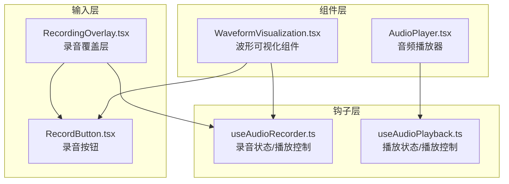
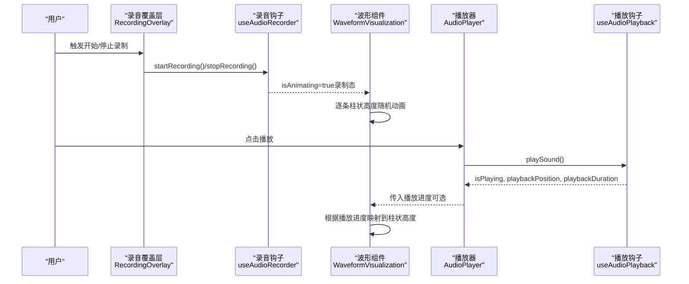
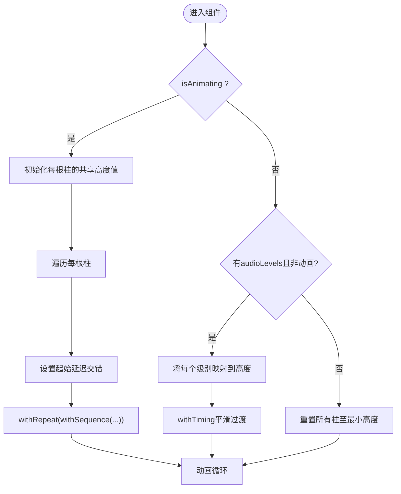
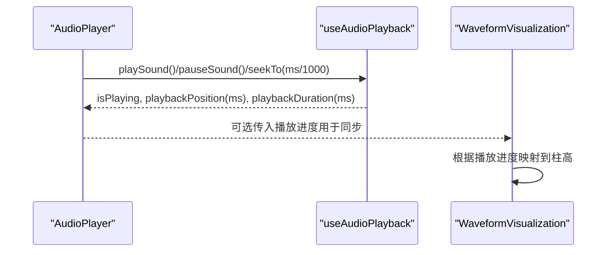
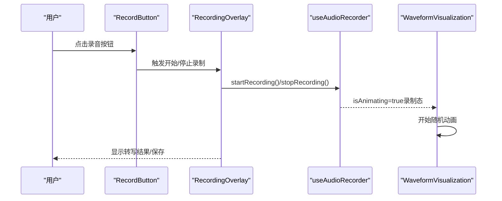
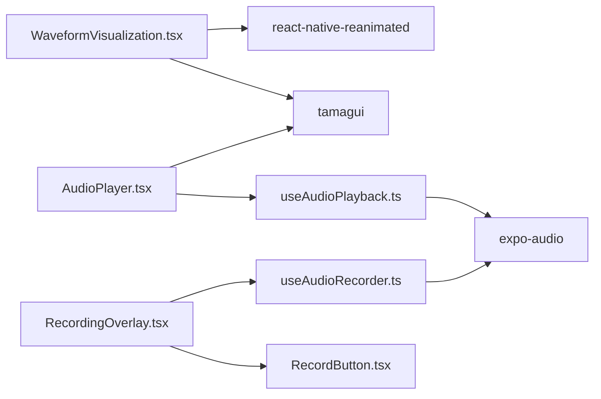

# 波形可视化

<cite>
**本文引用的文件**
- [WaveformVisualization.tsx](file://components/audio/WaveformVisualization.tsx)
- [AudioPlayer.tsx](file://components/audio/AudioPlayer.tsx)
- [useAudioRecorder.ts](file://hooks/useAudioRecorder.ts)
- [useAudioPlayback.ts](file://hooks/useAudioPlayback.ts)
- [RecordingOverlay.tsx](file://components/input/RecordingOverlay.tsx)
- [RecordButton.tsx](file://components/input/RecordButton.tsx)
- [index.ts（音频导出）](file://components/audio/index.ts)
- [package.json](file://package.json)
</cite>

## 目录
1. [简介](#简介)
2. [项目结构](#项目结构)
3. [核心组件](#核心组件)
4. [架构总览](#架构总览)
5. [详细组件分析](#详细组件分析)
6. [依赖关系分析](#依赖关系分析)
7. [性能考量](#性能考量)
8. [故障排查指南](#故障排查指南)
9. [结论](#结论)
10. [附录：使用示例与自定义选项](#附录使用示例与自定义选项)

## 简介
本文件围绕语音笔记应用中的“波形可视化”能力进行系统化技术文档整理。内容涵盖：
- 音频数据获取与处理机制：采样、振幅计算、数据点生成
- 波形渲染算法：Canvas 替代方案（基于 React Native 的 Animated + Tamagui）、线条绘制、颜色与动画
- 性能优化策略：采样频率、渲染频率、内存管理
- 同步机制：与播放进度联动、点击跳转、触摸交互
- 使用示例与自定义选项：颜色主题、线条粗细、背景样式等
- 扩展与定制建议：如何接入外部音频数据、如何扩展渲染样式

## 项目结构
与波形可视化直接相关的模块主要分布在以下位置：
- 组件层：波形组件与音频播放器
- 钩子层：录音与播放状态管理
- 输入层：录音覆盖层与录音按钮，用于触发录制态下的波形动画

图表来源
- [WaveformVisualization.tsx:1-120](file://components/audio/WaveformVisualization.tsx#L1-L120)
- [AudioPlayer.tsx:1-132](file://components/audio/AudioPlayer.tsx#L1-L132)
- [useAudioRecorder.ts:1-270](file://hooks/useAudioRecorder.ts#L1-L270)
- [useAudioPlayback.ts:1-90](file://hooks/useAudioPlayback.ts#L1-L90)
- [RecordingOverlay.tsx:1-419](file://components/input/RecordingOverlay.tsx#L1-L419)
- [RecordButton.tsx:1-131](file://components/input/RecordButton.tsx#L1-L131)

章节来源
- [WaveformVisualization.tsx:1-120](file://components/audio/WaveformVisualization.tsx#L1-L120)
- [AudioPlayer.tsx:1-132](file://components/audio/AudioPlayer.tsx#L1-L132)
- [useAudioRecorder.ts:1-270](file://hooks/useAudioRecorder.ts#L1-L270)
- [useAudioPlayback.ts:1-90](file://hooks/useAudioPlayback.ts#L1-L90)
- [RecordingOverlay.tsx:1-419](file://components/input/RecordingOverlay.tsx#L1-L419)
- [RecordButton.tsx:1-131](file://components/input/RecordButton.tsx#L1-L131)

## 核心组件
- WaveformVisualization：负责在录制态或播放态下以柱状条呈现波形，支持随机动画与按音频级别驱动的高度变化。
- AudioPlayer：提供播放控制、进度条与时间显示，配合播放状态驱动波形同步。
- useAudioRecorder/useAudioPlayback：提供录音与播放的状态与控制函数，供上层组件调用。
- RecordingOverlay/RecordButton：录音流程入口，触发录制态并在录制时驱动波形动画。

章节来源
- [WaveformVisualization.tsx:23-120](file://components/audio/WaveformVisualization.tsx#L23-L120)
- [AudioPlayer.tsx:9-132](file://components/audio/AudioPlayer.tsx#L9-L132)
- [useAudioRecorder.ts:13-270](file://hooks/useAudioRecorder.ts#L13-L270)
- [useAudioPlayback.ts:4-90](file://hooks/useAudioPlayback.ts#L4-L90)
- [RecordingOverlay.tsx:75-419](file://components/input/RecordingOverlay.tsx#L75-L419)
- [RecordButton.tsx:43-131](file://components/input/RecordButton.tsx#L43-L131)

## 架构总览
波形可视化由“数据源 + 渲染组件 + 动画引擎 + 控制层”构成。数据源可来自：
- 录制态：通过录音钩子提供的实时状态驱动波形动画
- 播放态：通过播放钩子提供的播放进度与持续时间驱动波形同步

图表来源
- [RecordingOverlay.tsx:161-222](file://components/input/RecordingOverlay.tsx#L161-L222)
- [useAudioRecorder.ts:79-175](file://hooks/useAudioRecorder.ts#L79-L175)
- [WaveformVisualization.tsx:50-93](file://components/audio/WaveformVisualization.tsx#L50-L93)
- [AudioPlayer.tsx:19-47](file://components/audio/AudioPlayer.tsx#L19-L47)
- [useAudioPlayback.ts:23-87](file://hooks/useAudioPlayback.ts#L23-L87)

## 详细组件分析

### 组件一：WaveformVisualization（波形可视化）
- 职责
  - 在录制态显示随机波动动画
  - 在非录制态根据传入的音频级别数组动态调整柱状高度
  - 支持颜色、柱数、最小/最大高度等参数化配置
- 关键实现要点
  - 使用 Animated + useSharedValue 为每根柱维护独立的动画值
  - 使用 useAnimatedStyle 将动画值绑定到高度属性
  - 录制态：对每个柱设置 withDelay + withRepeat + withSequence 实现交错随机动画
  - 非录制态：若提供 audioLevels，则将每个级别线性映射到高度并 withTiming 平滑过渡
  - 主题适配：根据系统深浅色自动选择默认颜色
- 参数与行为
  - isAnimating：是否启用录制态动画
  - audioLevels：长度为柱数的数值数组，取值范围通常为 [0,1]
  - barCount/minHeight/maxHeight：柱数与高度范围
  - color：自定义颜色优先于主题色

图表来源
- [WaveformVisualization.tsx:44-93](file://components/audio/WaveformVisualization.tsx#L44-L93)

章节来源
- [WaveformVisualization.tsx:23-120](file://components/audio/WaveformVisualization.tsx#L23-L120)

### 组件二：AudioPlayer（音频播放器）
- 职责
  - 提供播放/暂停/停止/跳转控件
  - 展示播放进度与总时长
  - 通过播放钩子暴露播放状态与控制函数
- 与波形同步
  - 可将播放进度（秒级）转换为毫秒传递给波形组件，用于驱动同步显示
  - 进度条支持拖动跳转，从而实现点击跳转

图表来源
- [AudioPlayer.tsx:19-47](file://components/audio/AudioPlayer.tsx#L19-L47)
- [useAudioPlayback.ts:23-87](file://hooks/useAudioPlayback.ts#L23-L87)
- [WaveformVisualization.tsx:83-93](file://components/audio/WaveformVisualization.tsx#L83-L93)

章节来源
- [AudioPlayer.tsx:9-132](file://components/audio/AudioPlayer.tsx#L9-L132)
- [useAudioPlayback.ts:4-90](file://hooks/useAudioPlayback.ts#L4-L90)

### 组件三：录音覆盖层与录音按钮
- 录音覆盖层
  - 管理录音生命周期：开始/暂停/恢复/停止/取消
  - 在流式模式下，启动/停止本地流式转写，并在停止后生成文本
  - 在文件模式下，完成录音后触发文件转写
- 录音按钮
  - 提供录制态的视觉反馈（脉冲、缩放、圆角变化）
  - 与波形组件联动，在录制态开启动画

图表来源
- [RecordButton.tsx:86-99](file://components/input/RecordButton.tsx#L86-L99)
- [RecordingOverlay.tsx:161-222](file://components/input/RecordingOverlay.tsx#L161-L222)
- [useAudioRecorder.ts:79-175](file://hooks/useAudioRecorder.ts#L79-L175)
- [WaveformVisualization.tsx:50-81](file://components/audio/WaveformVisualization.tsx#L50-L81)

章节来源
- [RecordingOverlay.tsx:75-419](file://components/input/RecordingOverlay.tsx#L75-L419)
- [RecordButton.tsx:43-131](file://components/input/RecordButton.tsx#L43-L131)
- [useAudioRecorder.ts:26-270](file://hooks/useAudioRecorder.ts#L26-L270)

## 依赖关系分析
- 组件导出
  - 音频相关组件通过统一导出入口提供给上层页面使用
- 外部库
  - react-native-reanimated：用于高性能动画
  - @tamagui/*：用于跨平台 UI 与主题系统
  - expo-audio：录音与播放的基础能力

图表来源
- [WaveformVisualization.tsx:1-12](file://components/audio/WaveformVisualization.tsx#L1-L12)
- [AudioPlayer.tsx:1-8](file://components/audio/AudioPlayer.tsx#L1-L8)
- [useAudioRecorder.ts:1-12](file://hooks/useAudioRecorder.ts#L1-L12)
- [useAudioPlayback.ts:1-4](file://hooks/useAudioPlayback.ts#L1-L4)
- [RecordingOverlay.tsx:1-16](file://components/input/RecordingOverlay.tsx#L1-L16)
- [RecordButton.tsx:1-13](file://components/input/RecordButton.tsx#L1-L13)
- [index.ts（音频导出）:1-2](file://components/audio/index.ts#L1-L2)
- [package.json:20-62](file://package.json#L20-L62)

章节来源
- [index.ts（音频导出）:1-2](file://components/audio/index.ts#L1-L2)
- [package.json:20-62](file://package.json#L20-L62)

## 性能考量
- 数据采样频率
  - 建议将音频级别数组的采样频率控制在 10–30Hz，避免过度频繁的重渲染
  - 若直接从麦克风实时采样，建议在钩子里做节流（例如每 100–200ms 计算一次）
- 渲染频率
  - 柱状数量与宽度应平衡：barCount 过大将导致大量 Animated 节点开销
  - 使用 withTiming 的过渡时长建议在 50–200ms，兼顾流畅与性能
- 内存管理
  - 每根柱使用 useSharedValue，组件卸载时应避免残留动画回调
  - 在非录制态关闭 isAnimating，及时重置高度，释放动画资源
- 主题与样式
  - 使用主题色可减少硬编码颜色带来的维护成本
  - 圆角与间距使用 Tamagui 间距常量，确保跨设备一致性

## 故障排查指南
- 录制态波形不显示
  - 确认 isAnimating 已设为 true，且 audioLevels 未同时传入（二者互斥）
  - 检查 barCount 与 audioLevels 长度是否一致
- 播放态不同步
  - 确认播放钩子返回的 playbackPosition 单位为毫秒，需转换为秒级再使用
  - 检查进度条拖动是否正确调用 seekTo
- 动画卡顿
  - 减少 barCount 或增加 withTiming 的 duration
  - 避免在动画过程中频繁创建新节点（复用已有的 useSharedValue 数组）

章节来源
- [WaveformVisualization.tsx:50-93](file://components/audio/WaveformVisualization.tsx#L50-L93)
- [useAudioPlayback.ts:67-70](file://hooks/useAudioPlayback.ts#L67-L70)
- [AudioPlayer.tsx:45-47](file://components/audio/AudioPlayer.tsx#L45-L47)

## 结论
本项目的波形可视化采用“轻量级柱状图 + Reanimated”的组合方案，既满足录制态的动态反馈，又能在播放态与进度联动。通过参数化配置与主题系统，具备良好的可定制性；结合录音/播放钩子，实现了与音频数据的自然衔接。后续可在采样策略、渲染粒度与动画参数上进一步优化，以适配更复杂的场景。

## 附录：使用示例与自定义选项

### 使用示例（路径指引）
- 在录音覆盖层中启用录制态波形
  - 参考路径：[RecordingOverlay.tsx:161-222](file://components/input/RecordingOverlay.tsx#L161-L222)
- 在播放器中展示播放进度对应的波形
  - 参考路径：[AudioPlayer.tsx:45-47](file://components/audio/AudioPlayer.tsx#L45-L47)、[useAudioPlayback.ts:23-87](file://hooks/useAudioPlayback.ts#L23-L87)
- 直接使用波形组件
  - 参考路径：[WaveformVisualization.tsx:32-120](file://components/audio/WaveformVisualization.tsx#L32-L120)
  - 导出入口：[index.ts（音频导出）:1-2](file://components/audio/index.ts#L1-L2)

### 自定义选项
- 颜色主题
  - 通过 color 参数覆盖默认颜色；未设置时根据系统深浅色自动选择
  - 参考路径：[WaveformVisualization.tsx:40-42](file://components/audio/WaveformVisualization.tsx#L40-L42)
- 线条粗细与间距
  - 修改柱宽与柱间距（Tamagui 的 XStack gap），参考路径：[WaveformVisualization.tsx:16-21](file://components/audio/WaveformVisualization.tsx#L16-L21)、[WaveformVisualization.tsx:96-100](file://components/audio/WaveformVisualization.tsx#L96-L100)
- 高度范围与柱数
  - 通过 minHeight、maxHeight、barCount 调整视觉密度与幅度范围，参考路径：[WaveformVisualization.tsx:35-38](file://components/audio/WaveformVisualization.tsx#L35-L38)
- 动画参数
  - 调整随机动画的延迟、重复次数与缓动曲线，参考路径：[WaveformVisualization.tsx:55-73](file://components/audio/WaveformVisualization.tsx#L55-L73)

### 扩展与定制建议
- 接入外部音频数据
  - 将外部音频的分帧振幅数组作为 audioLevels 传入，组件会自动映射到柱高
  - 参考路径：[WaveformVisualization.tsx:84-93](file://components/audio/WaveformVisualization.tsx#L84-L93)
- 与播放进度联动
  - 将播放钩子的 playbackPosition 与 playbackDuration 转换为比例，映射到柱高或颜色渐变
  - 参考路径：[useAudioPlayback.ts:23-25](file://hooks/useAudioPlayback.ts#L23-L25)
- 渐变与背景
  - 可通过主题系统或自定义样式为容器添加渐变背景，提升视觉层次
  - 参考路径：[AudioPlayer.tsx:50-56](file://components/audio/AudioPlayer.tsx#L50-L56)