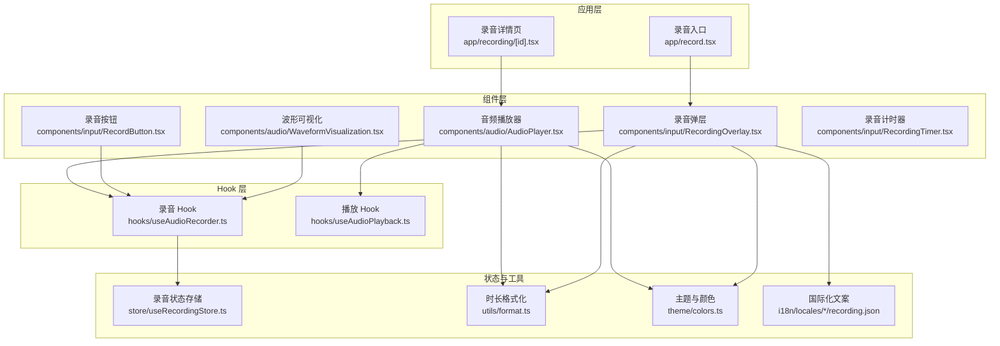
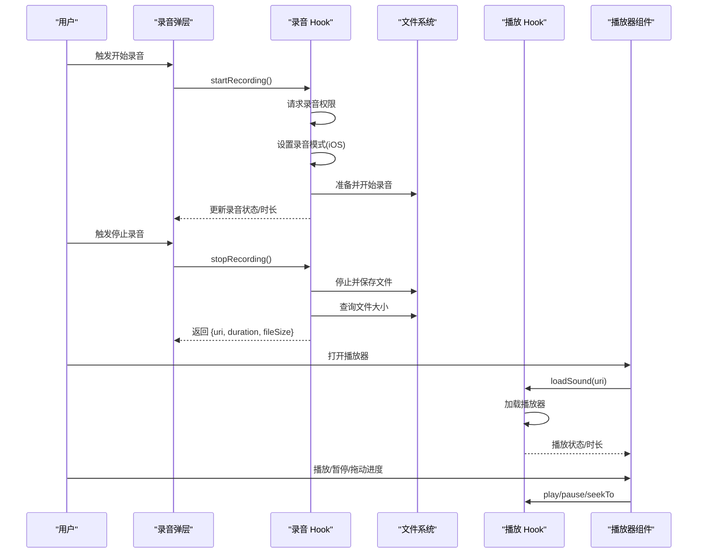
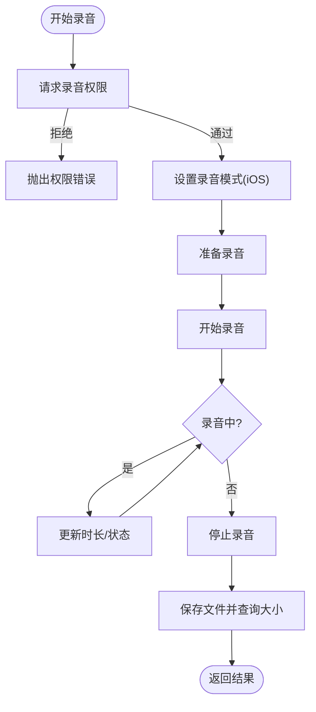
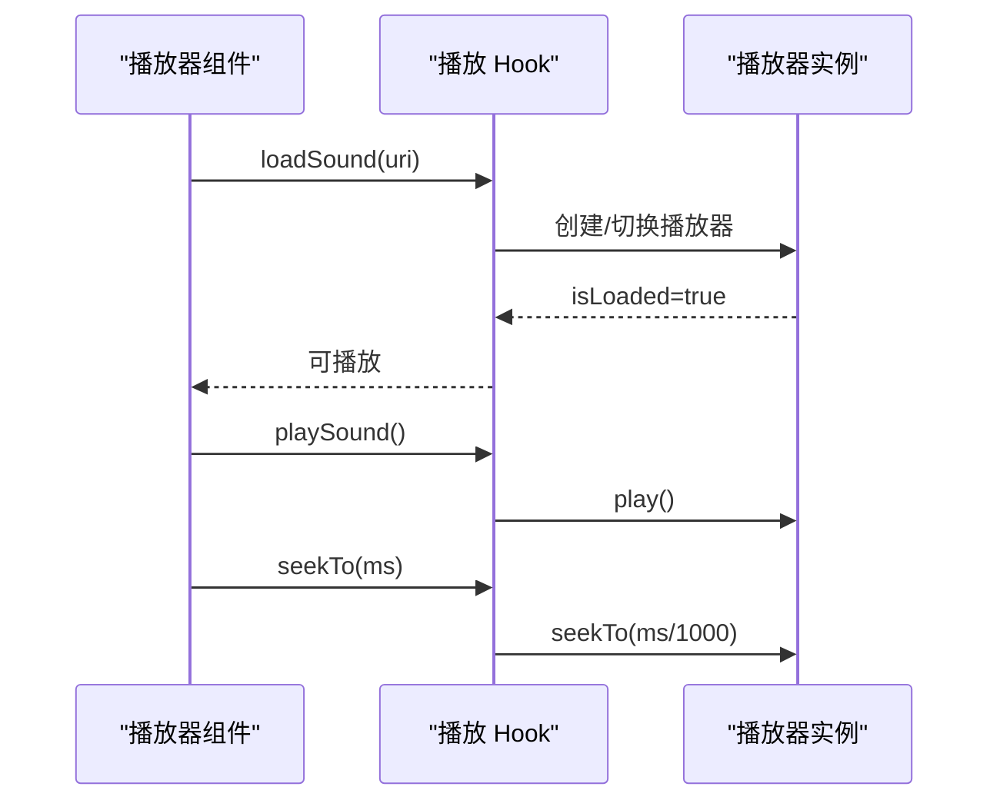
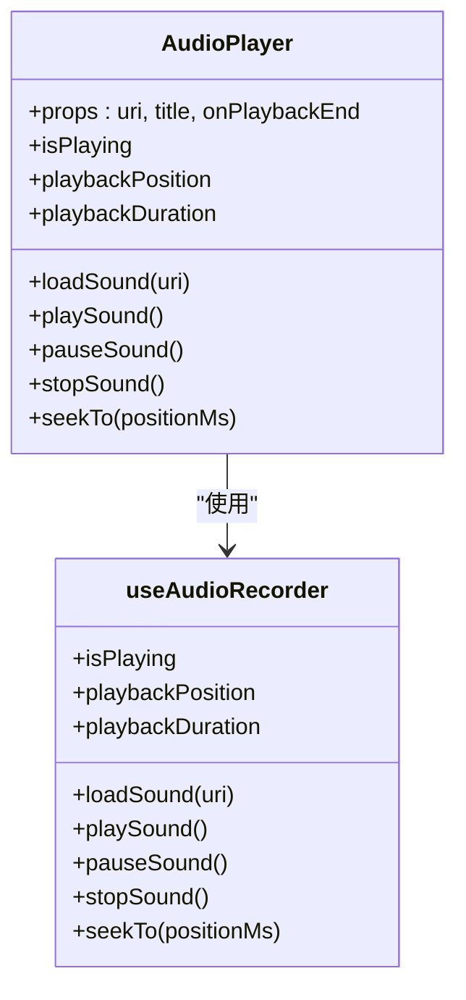
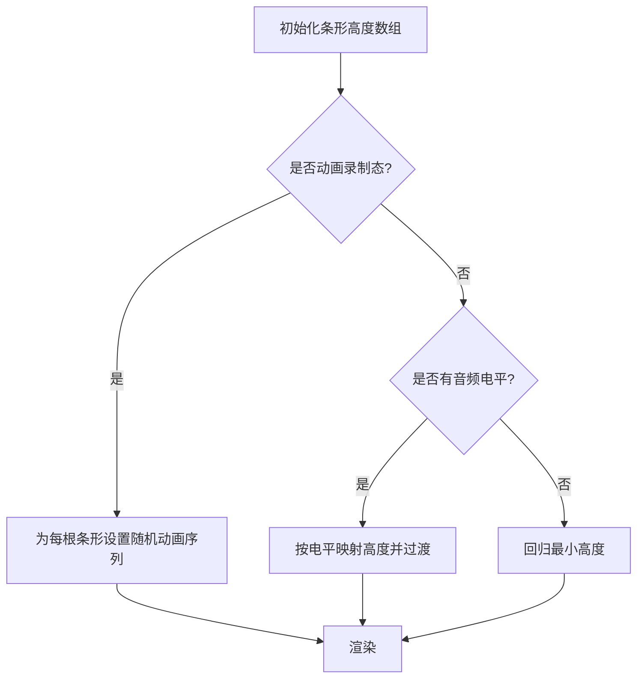
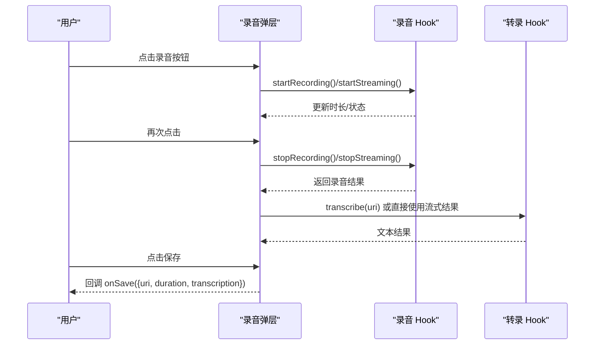
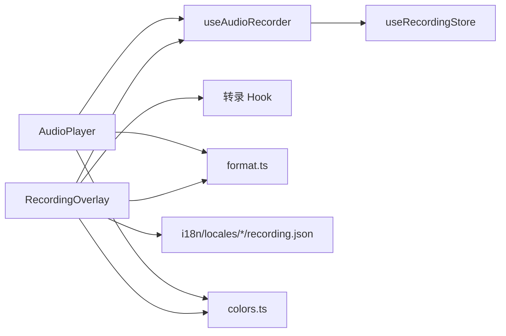

# 音频处理模块

<cite>
**本文引用的文件**
- [AudioPlayer.tsx](file://components/audio/AudioPlayer.tsx)
- [WaveformVisualization.tsx](file://components/audio/WaveformVisualization.tsx)
- [useAudioRecorder.ts](file://hooks/useAudioRecorder.ts)
- [useAudioPlayback.ts](file://hooks/useAudioPlayback.ts)
- [RecordButton.tsx](file://components/input/RecordButton.tsx)
- [RecordingOverlay.tsx](file://components/input/RecordingOverlay.tsx)
- [RecordingTimer.tsx](file://components/input/RecordingTimer.tsx)
- [recording.json（简体中文）](file://i18n/locales/zh-CN/recording.json)
- [recording.json（英语）](file://i18n/locales/en/recording.json)
- [colors.ts](file://theme/colors.ts)
- [format.ts](file://utils/format.ts)
- [useRecordingStore.ts](file://store/useRecordingStore.ts)
- [app/record.tsx](file://app/record.tsx)
- [app/recording/[id].tsx](file://app/recording/[id].tsx)
</cite>

## 目录
1. [简介](#简介)
2. [项目结构](#项目结构)
3. [核心组件](#核心组件)
4. [架构总览](#架构总览)
5. [详细组件分析](#详细组件分析)
6. [依赖关系分析](#依赖关系分析)
7. [性能考虑](#性能考虑)
8. [故障排查指南](#故障排查指南)
9. [结论](#结论)
10. [附录：使用示例与最佳实践](#附录使用示例与最佳实践)

## 简介
本文件系统性梳理并解释音频处理模块的设计与实现，覆盖录音权限管理、录音状态控制、录音质量设置、播放器状态与进度控制、音频格式支持、波形可视化渲染、录音文件生命周期与存储策略，以及扩展与优化建议。文档以渐进方式呈现，既适合初学者快速上手，也为高级开发者提供深入的技术细节与可操作的改进建议。

## 项目结构
音频处理模块主要由以下层次构成：
- 组件层：音频播放器、波形可视化、录音按钮与录音弹层等 UI 组件
- Hook 层：封装录音与播放能力的状态与动作
- 存储层：Zustand 状态管理，用于记录录音与播放状态
- 工具与主题：时长格式化、颜色主题、国际化文案
- 应用路由与页面：录音入口重定向、录音详情页占位

图表来源
- [app/record.tsx:1-6](file://app/record.tsx#L1-L6)
- [app/recording/[id].tsx:1-115](file://app/recording/[id].tsx#L1-L115)
- [components/audio/AudioPlayer.tsx:1-132](file://components/audio/AudioPlayer.tsx#L1-L132)
- [components/audio/WaveformVisualization.tsx:1-120](file://components/audio/WaveformVisualization.tsx#L1-L120)
- [components/input/RecordButton.tsx:1-131](file://components/input/RecordButton.tsx#L1-L131)
- [components/input/RecordingOverlay.tsx:1-419](file://components/input/RecordingOverlay.tsx#L1-L419)
- [components/input/RecordingTimer.tsx:1-43](file://components/input/RecordingTimer.tsx#L1-L43)
- [hooks/useAudioRecorder.ts:1-270](file://hooks/useAudioRecorder.ts#L1-L270)
- [hooks/useAudioPlayback.ts:1-90](file://hooks/useAudioPlayback.ts#L1-L90)
- [store/useRecordingStore.ts:1-71](file://store/useRecordingStore.ts#L1-L71)
- [utils/format.ts:1-126](file://utils/format.ts#L1-L126)
- [theme/colors.ts:1-102](file://theme/colors.ts#L1-L102)
- [i18n/locales/zh-CN/recording.json:1-16](file://i18n/locales/zh-CN/recording.json#L1-L16)
- [i18n/locales/en/recording.json:1-16](file://i18n/locales/en/recording.json#L1-L16)

章节来源
- [app/record.tsx:1-6](file://app/record.tsx#L1-L6)
- [app/recording/[id].tsx:1-115](file://app/recording/[id].tsx#L1-L115)

## 核心组件
- 录音 Hook（useAudioRecorder）
  - 负责录音权限请求、录音状态更新、录音文件元信息获取、播放器状态同步、播放控制（加载/播放/暂停/停止/跳转）
  - 使用高音质预设进行录音，并在 iOS 上启用录音模式以确保播放正常工作
- 播放 Hook（useAudioPlayback）
  - 提供统一的播放器状态与动作接口，自动处理加载完成后自动播放
- 音频播放器组件（AudioPlayer）
  - 基于录音 Hook 的状态与动作，渲染进度条、播放控制按钮与标题
- 波形可视化组件（WaveformVisualization）
  - 支持动画录制态与静态音频电平态，通过共享值驱动条形高度动画
- 录音弹层（RecordingOverlay）
  - 封装录音流程：开始/暂停/恢复/停止、取消、转录、保存、手势操作
- 录音按钮（RecordButton）
  - 提供录制态脉冲动画与按下反馈，适配深色/浅色主题
- 计时器（RecordingTimer）
  - 格式化显示录音时长（分:秒）

章节来源
- [hooks/useAudioRecorder.ts:1-270](file://hooks/useAudioRecorder.ts#L1-L270)
- [hooks/useAudioPlayback.ts:1-90](file://hooks/useAudioPlayback.ts#L1-L90)
- [components/audio/AudioPlayer.tsx:1-132](file://components/audio/AudioPlayer.tsx#L1-L132)
- [components/audio/WaveformVisualization.tsx:1-120](file://components/audio/WaveformVisualization.tsx#L1-L120)
- [components/input/RecordingOverlay.tsx:1-419](file://components/input/RecordingOverlay.tsx#L1-L419)
- [components/input/RecordButton.tsx:1-131](file://components/input/RecordButton.tsx#L1-L131)
- [components/input/RecordingTimer.tsx:1-43](file://components/input/RecordingTimer.tsx#L1-L43)

## 架构总览
录音与播放的端到端流程如下：

图表来源
- [components/input/RecordingOverlay.tsx:161-222](file://components/input/RecordingOverlay.tsx#L161-L222)
- [hooks/useAudioRecorder.ts:79-175](file://hooks/useAudioRecorder.ts#L79-L175)
- [hooks/useAudioPlayback.ts:27-47](file://hooks/useAudioPlayback.ts#L27-L47)
- [components/audio/AudioPlayer.tsx:19-47](file://components/audio/AudioPlayer.tsx#L19-L47)

## 详细组件分析

### 录音 Hook（useAudioRecorder）
- 权限与模式
  - 启动录音前请求录音权限；iOS 上设置允许录音模式，避免录音占用导致播放异常
- 录音状态
  - 实时从录音状态中读取录音中/暂停/时长，保持本地状态与外部状态一致
- 文件信息
  - 停止录音后查询文件存在性与大小，返回给调用方
- 播放集成
  - 通过变更播放源触发新播放器创建，统一播放状态与进度轮询
- 错误处理
  - 对启动/暂停/停止/取消等操作捕获错误并抛出，便于上层提示

图表来源
- [hooks/useAudioRecorder.ts:74-109](file://hooks/useAudioRecorder.ts#L74-L109)
- [hooks/useAudioRecorder.ts:51-59](file://hooks/useAudioRecorder.ts#L51-L59)
- [hooks/useAudioRecorder.ts:135-175](file://hooks/useAudioRecorder.ts#L135-L175)

章节来源
- [hooks/useAudioRecorder.ts:1-270](file://hooks/useAudioRecorder.ts#L1-L270)

### 播放 Hook（useAudioPlayback）
- 自动播放
  - 当播放源变更且播放器加载完成后自动播放
- 状态同步
  - 通过播放器状态钩子暴露播放中/位置/时长，统一毫秒级时间单位
- 安全操作
  - 在未加载完成时忽略播放/暂停/跳转等操作，避免异常

图表来源
- [hooks/useAudioPlayback.ts:27-47](file://hooks/useAudioPlayback.ts#L27-L47)
- [hooks/useAudioPlayback.ts:49-70](file://hooks/useAudioPlayback.ts#L49-L70)

章节来源
- [hooks/useAudioPlayback.ts:1-90](file://hooks/useAudioPlayback.ts#L1-L90)

### 音频播放器组件（AudioPlayer）
- 进度条
  - 基于播放位置与总时长渲染，支持拖动跳转
- 控制按钮
  - 停止、播放/暂停、快进等基础控制
- 主题适配
  - 根据系统深色/浅色模式切换背景与文字颜色

图表来源
- [components/audio/AudioPlayer.tsx:9-28](file://components/audio/AudioPlayer.tsx#L9-L28)
- [hooks/useAudioRecorder.ts:248-268](file://hooks/useAudioRecorder.ts#L248-L268)

章节来源
- [components/audio/AudioPlayer.tsx:1-132](file://components/audio/AudioPlayer.tsx#L1-L132)

### 波形可视化组件（WaveformVisualization）
- 动画录制态
  - 录音时对每个条形随机设定动画序列，形成脉动效果
- 静态电平态
  - 接收音频电平数组，按最小/最大高度映射为条形高度
- 性能
  - 使用共享值与动画库进行批量更新，避免逐帧重排

图表来源
- [components/audio/WaveformVisualization.tsx:44-93](file://components/audio/WaveformVisualization.tsx#L44-L93)

章节来源
- [components/audio/WaveformVisualization.tsx:1-120](file://components/audio/WaveformVisualization.tsx#L1-L120)

### 录音弹层（RecordingOverlay）
- 流程编排
  - 开始/暂停/恢复/停止录音、取消、转录、保存、手势取消与发送
- 状态管理
  - 结合录音 Hook 与转录 Hook，根据流式/文件两种模式切换 UI 与逻辑
- 国际化与主题
  - 使用国际化文案与主题颜色，适配深色/浅色模式

图表来源
- [components/input/RecordingOverlay.tsx:161-222](file://components/input/RecordingOverlay.tsx#L161-L222)
- [components/input/RecordingOverlay.tsx:256-282](file://components/input/RecordingOverlay.tsx#L256-L282)

章节来源
- [components/input/RecordingOverlay.tsx:1-419](file://components/input/RecordingOverlay.tsx#L1-L419)

### 录音按钮（RecordButton）
- 动画反馈
  - 录制态脉冲与缩放动画，非录制态圆角/圆角变化
- 触觉反馈
  - 按下时触发中等力度触觉反馈

章节来源
- [components/input/RecordButton.tsx:1-131](file://components/input/RecordButton.tsx#L1-L131)

### 计时器（RecordingTimer）
- 时间格式化
  - 将秒数格式化为 MM:SS 显示

章节来源
- [components/input/RecordingTimer.tsx:1-43](file://components/input/RecordingTimer.tsx#L1-L43)

## 依赖关系分析
- 组件与 Hook
  - AudioPlayer 依赖 useAudioRecorder 提供的播放状态与动作
  - RecordingOverlay 依赖 useAudioRecorder 与转录 Hook，协调录音与转录流程
- 工具与主题
  - format.ts 提供时长格式化；colors.ts 提供主题色板；i18n 提供多语言文案
- 状态存储
  - useRecordingStore 作为独立状态容器，与 Hook 中的本地状态互补

图表来源
- [components/audio/AudioPlayer.tsx:19-28](file://components/audio/AudioPlayer.tsx#L19-L28)
- [components/input/RecordingOverlay.tsx:77-102](file://components/input/RecordingOverlay.tsx#L77-L102)
- [hooks/useAudioRecorder.ts:26-46](file://hooks/useAudioRecorder.ts#L26-L46)
- [store/useRecordingStore.ts:25-33](file://store/useRecordingStore.ts#L25-L33)
- [utils/format.ts:4](file://utils/format.ts#L4)
- [theme/colors.ts:79-99](file://theme/colors.ts#L79-L99)
- [i18n/locales/zh-CN/recording.json:1-16](file://i18n/locales/zh-CN/recording.json#L1-L16)

章节来源
- [store/useRecordingStore.ts:1-71](file://store/useRecordingStore.ts#L1-L71)

## 性能考虑
- 动画与渲染
  - 波形可视化使用共享值与动画库，避免频繁重排；建议限制条形数量或降低动画频率以节省 CPU/GPU
- 播放器轮询
  - 播放状态轮询间隔为 100ms，建议在后台或不活跃界面时适当增大间隔或暂停轮询
- 文件访问
  - 停止录音后查询文件大小，建议在主线程外执行或异步处理，避免阻塞 UI
- 状态同步
  - 录音状态与播放状态分别维护，注意避免重复订阅与竞态条件；必要时合并状态或引入去抖

## 故障排查指南
- 录音权限被拒
  - 现象：启动录音时报错
  - 处理：检查权限请求逻辑与错误提示文案，引导用户在系统设置中开启
- iOS 播放异常
  - 现象：录音结束后无法播放
  - 处理：确认已设置录音模式并在停止录音后禁用录音模式
- 播放器未加载
  - 现象：播放/暂停/跳转无效
  - 处理：等待 isLoaded 后再执行播放动作，或使用自动播放逻辑
- 文件删除失败
  - 现象：取消录音后残留文件
  - 处理：确认文件存在性后再删除，捕获异常并记录日志

章节来源
- [hooks/useAudioRecorder.ts:74-85](file://hooks/useAudioRecorder.ts#L74-L85)
- [hooks/useAudioRecorder.ts:141-143](file://hooks/useAudioRecorder.ts#L141-L143)
- [hooks/useAudioPlayback.ts:12-21](file://hooks/useAudioPlayback.ts#L12-L21)

## 结论
该音频处理模块以 Hook 为核心，将录音与播放能力抽象为可复用的接口，配合 UI 组件与状态存储，实现了从录音到播放、从可视化到交互的完整闭环。模块具备良好的扩展性：可在 Hook 层增加新的录音预设与播放速率控制，在组件层扩展更多可视化与交互元素，并通过状态存储与工具函数提升可维护性与用户体验。

## 附录：使用示例与最佳实践

### 录音与播放使用示例（路径指引）
- 在录音弹层中启动/停止录音并获取结果
  - 示例路径：[RecordingOverlay 启停逻辑:161-222](file://components/input/RecordingOverlay.tsx#L161-L222)
- 在播放器中加载并控制播放
  - 示例路径：[AudioPlayer 控制逻辑:37-47](file://components/audio/AudioPlayer.tsx#L37-L47)
- 通过播放 Hook 实现自动播放与跳转
  - 示例路径：[useAudioPlayback 自动播放与 seekTo:27-47](file://hooks/useAudioPlayback.ts#L27-L47)

### 录音文件生命周期与存储策略
- 生命周期
  - 创建：录音开始 → 文件写入
  - 暂停/恢复：仅暂停/恢复写入，不删除文件
  - 完成：停止录音 → 保存文件 → 查询文件大小
  - 取消：停止录音 → 删除临时文件
- 存储策略
  - 建议将录音文件存放在应用专属目录，结合清理策略定期删除过期文件
  - 对大文件建议压缩或分段存储，减少磁盘占用与传输成本

章节来源
- [hooks/useAudioRecorder.ts:135-204](file://hooks/useAudioRecorder.ts#L135-L204)

### 最佳实践与性能优化建议
- 权限与模式
  - 在进入录音前主动请求权限，避免运行时中断
  - iOS 必须在录音模式与播放模式间切换，确保播放可用
- 动画与渲染
  - 控制波形条数与动画频率，避免过度消耗资源
- 状态与轮询
  - 合理设置播放状态轮询间隔；在后台时暂停轮询
- 错误处理
  - 对录音/播放/文件操作进行统一错误捕获与用户提示

### 扩展与自定义技术指导
- 新增录音质量预设
  - 在 Hook 中新增预设并暴露选择接口，同时更新 UI 与存储
- 自定义播放器控件
  - 基于播放 Hook 的状态与动作扩展播放器 UI，如倍速播放、均衡器等
- 可视化增强
  - 引入频谱图、节拍可视化等，结合 Web Audio API 或第三方库
- 国际化与主题
  - 通过现有 i18n 与 colors 抽象，新增语言包与主题变量