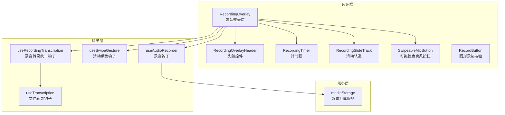
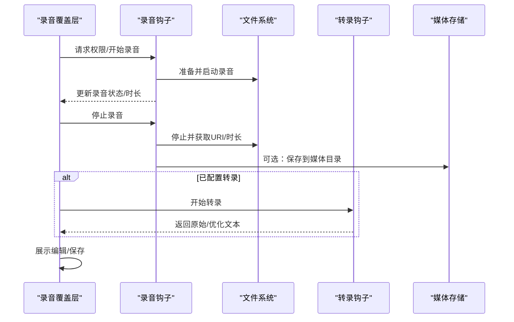
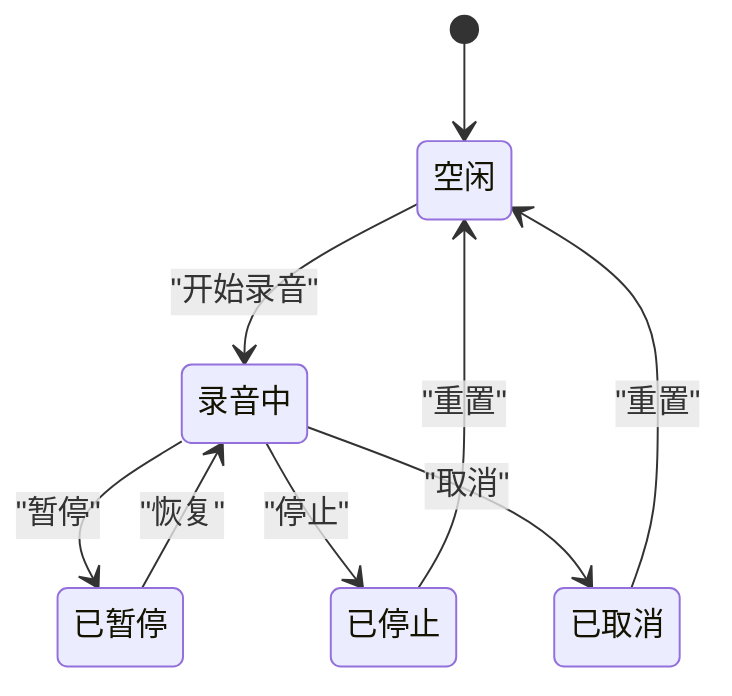
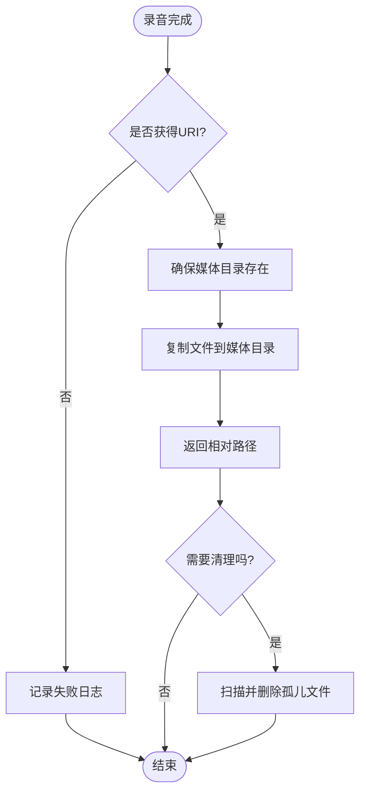
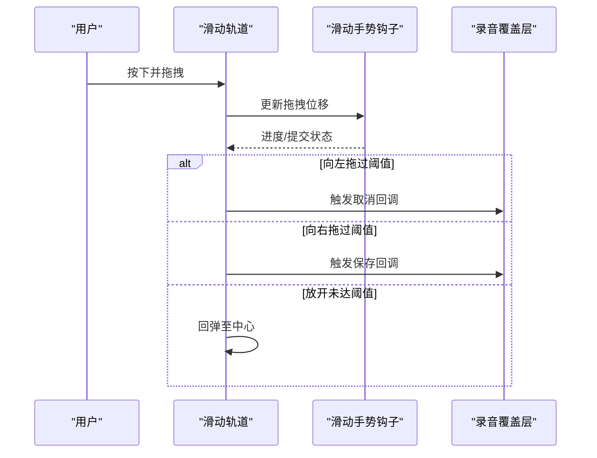
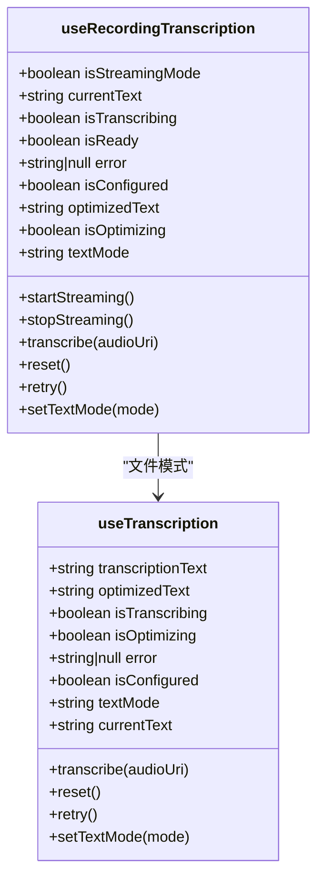
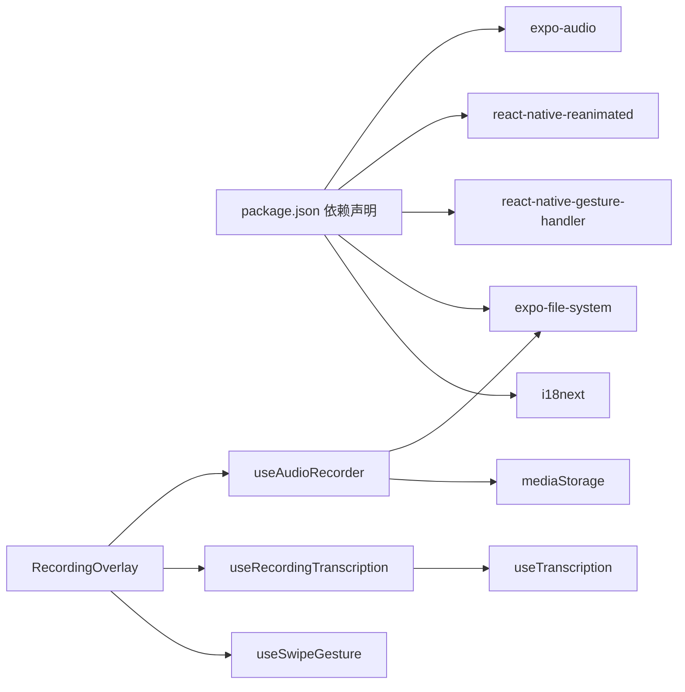

# 音频录制功能

<cite>
**本文档引用的文件**
- [useAudioRecorder.ts](file://hooks/useAudioRecorder.ts)
- [useRecordingStore.ts](file://store/useRecordingStore.ts)
- [RecordingOverlay.tsx](file://components/input/RecordingOverlay.tsx)
- [RecordingOverlayHeader.tsx](file://components/input/RecordingOverlayHeader.tsx)
- [RecordingTimer.tsx](file://components/input/RecordingTimer.tsx)
- [RecordingSlideTrack.tsx](file://components/input/RecordingSlideTrack.tsx)
- [SwipeableMicButton.tsx](file://components/input/SwipeableMicButton.tsx)
- [RecordButton.tsx](file://components/input/RecordButton.tsx)
- [useSwipeGesture.ts](file://hooks/useSwipeGesture.ts)
- [useRecordingTranscription.ts](file://hooks/useRecordingTranscription.ts)
- [useTranscription.ts](file://hooks/useTranscription.ts)
- [mediaStorage.ts](file://services/mediaStorage.ts)
- [recording.json](file://i18n/locales/zh-CN/recording.json)
- [package.json](file://package.json)
</cite>

## 目录
1. [简介](#简介)
2. [项目结构](#项目结构)
3. [核心组件](#核心组件)
4. [架构总览](#架构总览)
5. [详细组件分析](#详细组件分析)
6. [依赖关系分析](#依赖关系分析)
7. [性能考虑](#性能考虑)
8. [故障排除指南](#故障排除指南)
9. [结论](#结论)
10. [附录](#附录)

## 简介
本文件面向开发者与产品团队，系统性阐述音频录制功能的设计与实现，涵盖权限管理、状态机模型、录音质量与预设、文件生命周期、用户交互体验以及扩展与定制建议。通过分层解析核心模块与组件，帮助读者快速理解并高效集成或二次开发。

## 项目结构
录音功能由「钩子层」（状态与业务逻辑）、「UI 组件层」（交互与动画）与「服务层」（文件存储与转录）三部分协同构成。整体采用 React Hooks + Expo 生态 + Tamagui 样式体系，配合 Reanimated/Gesture Handler 实现流畅的交互体验。

**图表来源**
- [RecordingOverlay.tsx:75-418](file://components/input/RecordingOverlay.tsx#L75-L418)
- [useAudioRecorder.ts:26-269](file://hooks/useAudioRecorder.ts#L26-L269)
- [useSwipeGesture.ts:38-121](file://hooks/useSwipeGesture.ts#L38-L121)
- [useRecordingTranscription.ts:74-195](file://hooks/useRecordingTranscription.ts#L74-L195)
- [mediaStorage.ts:22-36](file://services/mediaStorage.ts#L22-L36)

**章节来源**
- [RecordingOverlay.tsx:75-418](file://components/input/RecordingOverlay.tsx#L75-L418)
- [useAudioRecorder.ts:26-269](file://hooks/useAudioRecorder.ts#L26-L269)
- [useSwipeGesture.ts:38-121](file://hooks/useSwipeGesture.ts#L38-L121)
- [useRecordingTranscription.ts:74-195](file://hooks/useRecordingTranscription.ts#L74-L195)
- [mediaStorage.ts:22-36](file://services/mediaStorage.ts#L22-L36)

## 核心组件
- 录音钩子：封装权限请求、录音控制（开始/暂停/恢复/停止/取消）、播放控制与状态同步。
- 转录钩子：统一处理流式（本地）与文件（云端）两种模式，自动切换并暴露一致接口。
- 滑动手势钩子：实现「取消/保存」的滑动交互，提供触觉反馈与视觉进度。
- 存储服务：负责媒体目录确保、文件复制、URI 解析、清理与配额查询。
- UI 组件：覆盖层、计时器、滑动轨道、可拖拽按钮、圆形按钮等，提供完整的录制界面与交互。

**章节来源**
- [useAudioRecorder.ts:26-269](file://hooks/useAudioRecorder.ts#L26-L269)
- [useRecordingTranscription.ts:74-195](file://hooks/useRecordingTranscription.ts#L74-L195)
- [useSwipeGesture.ts:38-121](file://hooks/useSwipeGesture.ts#L38-L121)
- [mediaStorage.ts:22-36](file://services/mediaStorage.ts#L22-L36)

## 架构总览
录音流程从 UI 触发开始，经过权限校验、录音状态机推进、文件落盘与可选的转录优化，最终进入保存阶段。滑动手势贯穿「取消/保存」决策，计时器与播放器提供实时反馈。

**图表来源**
- [RecordingOverlay.tsx:161-222](file://components/input/RecordingOverlay.tsx#L161-L222)
- [useAudioRecorder.ts:79-175](file://hooks/useAudioRecorder.ts#L79-L175)
- [mediaStorage.ts:22-36](file://services/mediaStorage.ts#L22-L36)
- [useRecordingTranscription.ts:124-139](file://hooks/useRecordingTranscription.ts#L124-L139)

## 详细组件分析

### 权限管理与状态机
- 权限请求：在开始录音前调用权限请求函数，仅当授权成功才允许录音。
- 状态机：录音状态包含「录音中/已暂停/时长/URI」；通过 Ref 记录外部状态，避免闭包陷阱。
- 模式切换：iOS 下启用录音模式以保证录音与播放互不冲突。

**图表来源**
- [useAudioRecorder.ts:27-32](file://hooks/useAudioRecorder.ts#L27-L32)
- [useAudioRecorder.ts:79-175](file://hooks/useAudioRecorder.ts#L79-L175)

**章节来源**
- [useAudioRecorder.ts:73-109](file://hooks/useAudioRecorder.ts#L73-L109)
- [useAudioRecorder.ts:111-133](file://hooks/useAudioRecorder.ts#L111-L133)
- [useAudioRecorder.ts:135-175](file://hooks/useAudioRecorder.ts#L135-L175)

### 录音质量与预设
- 预设选择：当前使用高音质预设，适用于大多数场景；如需更小体积或更低延迟，可在初始化时替换为其他预设。
- 性能权衡：高音质带来更高 CPU 占用与更大文件体积；低音质则相反。可根据设备性能与网络条件动态调整。

**章节来源**
- [useAudioRecorder.ts:39-39](file://hooks/useAudioRecorder.ts#L39-L39)

### 文件生命周期管理
- 创建与存储：录音完成后返回 URI，可选择复制到应用媒体目录，返回相对路径便于数据库持久化。
- 命名规则：默认使用文件名作为相对路径；如需自定义命名策略，可在保存时传入目标文件名。
- 清理策略：提供孤儿文件清理能力，定期扫描并删除数据库未引用的媒体文件。

**图表来源**
- [useAudioRecorder.ts:135-175](file://hooks/useAudioRecorder.ts#L135-L175)
- [mediaStorage.ts:10-36](file://services/mediaStorage.ts#L10-L36)
- [mediaStorage.ts:80-114](file://services/mediaStorage.ts#L80-L114)

**章节来源**
- [mediaStorage.ts:22-36](file://services/mediaStorage.ts#L22-L36)
- [mediaStorage.ts:52-58](file://services/mediaStorage.ts#L52-L58)
- [mediaStorage.ts:80-114](file://services/mediaStorage.ts#L80-L114)

### 用户体验设计
- 录制界面：底部弹出式覆盖层，支持标题、取消/保存按钮、转录文本区域与计时器。
- 计时器：以 MM:SS 显示时长，支持流式与文件两种模式。
- 滑动取消：向左滑动显示「取消」区域，松手触发取消并删除文件。
- 保存交互：向右滑动显示「保存」区域，松手触发保存并进入编辑/优化流程。
- 动画与触觉：按钮脉冲、缩放、旋转加载、轻/成功/警告触觉反馈增强交互感知。

**图表来源**
- [RecordingSlideTrack.tsx:24-139](file://components/input/RecordingSlideTrack.tsx#L24-L139)
- [useSwipeGesture.ts:67-114](file://hooks/useSwipeGesture.ts#L67-L114)
- [RecordingOverlay.tsx:299-303](file://components/input/RecordingOverlay.tsx#L299-L303)

**章节来源**
- [RecordingOverlay.tsx:398-412](file://components/input/RecordingOverlay.tsx#L398-L412)
- [RecordingOverlay.tsx:299-303](file://components/input/RecordingOverlay.tsx#L299-L303)
- [SwipeableMicButton.tsx:39-72](file://components/input/SwipeableMicButton.tsx#L39-L72)
- [RecordingTimer.tsx:26-42](file://components/input/RecordingTimer.tsx#L26-L42)

### 转录与优化
- 模式选择：本地 Provider 使用流式转录（边录边得），云端 Provider 使用文件转录（录后再得）。
- 优化开关：可按「轻/中/重」级别开启优化，优化后自动切换到优化视图。
- 错误处理：提供重试与错误提示，无配置时显示提示信息。

**图表来源**
- [useRecordingTranscription.ts:74-195](file://hooks/useRecordingTranscription.ts#L74-L195)
- [useTranscription.ts:22-86](file://hooks/useTranscription.ts#L22-L86)

**章节来源**
- [useRecordingTranscription.ts:74-195](file://hooks/useRecordingTranscription.ts#L74-L195)
- [useTranscription.ts:33-65](file://hooks/useTranscription.ts#L33-L65)

## 依赖关系分析
- 外部依赖：expo-audio 提供录音与播放能力；expo-file-system 提供文件操作；react-native-reanimated 与 react-native-gesture-handler 提供动画与手势；i18n 提供多语言。
- 内部依赖：录音覆盖层依赖录音钩子、转录钩子与手势钩子；媒体存储服务被录音钩子与覆盖层调用。

**图表来源**
- [package.json:32-56](file://package.json#L32-L56)
- [RecordingOverlay.tsx:7-15](file://components/input/RecordingOverlay.tsx#L7-L15)
- [useAudioRecorder.ts:2-11](file://hooks/useAudioRecorder.ts#L2-L11)
- [mediaStorage.ts:1-5](file://services/mediaStorage.ts#L1-L5)

**章节来源**
- [package.json:32-56](file://package.json#L32-L56)

## 性能考虑
- 预设选择：根据设备性能与网络状况选择合适预设，平衡音质与体积。
- 定时更新：播放器状态轮询周期适中，避免频繁重渲染。
- 文件清理：定期执行孤儿文件清理，释放存储空间。
- 动画帧率：Reanimated 使用原生驱动，减少 JS 线程压力。

[本节为通用指导，无需特定文件引用]

## 故障排除指南
- 权限被拒：检查权限请求返回状态，提示用户前往设置授权。
- 录音失败：捕获异常并记录日志，提供重试入口。
- 转录错误：显示错误提示与重试按钮，必要时回退到空文本。
- 存储异常：确认媒体目录存在与可用空间，清理后重试。

**章节来源**
- [useAudioRecorder.ts:82-84](file://hooks/useAudioRecorder.ts#L82-L84)
- [RecordingOverlay.tsx:178-180](file://components/input/RecordingOverlay.tsx#L178-L180)
- [RecordingOverlay.tsx:367-385](file://components/input/RecordingOverlay.tsx#L367-L385)

## 结论
该录音功能以清晰的模块划分与完善的交互设计实现了从权限到文件管理的全链路闭环。通过统一的钩子抽象与可插拔的转录策略，既满足本地实时转录，也兼容云端离线转录。建议在生产环境中结合设备能力动态调整预设，并完善错误上报与用户引导。

[本节为总结性内容，无需特定文件引用]

## 附录

### 代码示例路径（不含具体代码）
- 权限检查与录音控制
  - [权限请求与录音控制:73-109](file://hooks/useAudioRecorder.ts#L73-L109)
  - [暂停/恢复/停止/取消:111-204](file://hooks/useAudioRecorder.ts#L111-L204)
- 录音状态与播放控制
  - [录音状态与播放状态同步:50-71](file://hooks/useAudioRecorder.ts#L50-L71)
  - [播放控制:206-246](file://hooks/useAudioRecorder.ts#L206-L246)
- 文件处理与存储
  - [保存媒体文件:22-36](file://services/mediaStorage.ts#L22-L36)
  - [删除媒体文件:52-58](file://services/mediaStorage.ts#L52-L58)
  - [清理孤儿文件:80-114](file://services/mediaStorage.ts#L80-L114)
- 转录与优化
  - [统一转录钩子:74-195](file://hooks/useRecordingTranscription.ts#L74-L195)
  - [文件转录与优化:33-65](file://hooks/useTranscription.ts#L33-L65)
- 用户交互
  - [录音覆盖层主流程:161-222](file://components/input/RecordingOverlay.tsx#L161-L222)
  - [滑动手势与回调:67-114](file://hooks/useSwipeGesture.ts#L67-L114)
  - [计时器显示:26-42](file://components/input/RecordingTimer.tsx#L26-L42)
  - [滑动轨道与图标动画:24-139](file://components/input/RecordingSlideTrack.tsx#L24-L139)
  - [可拖拽麦克风按钮:27-121](file://components/input/SwipeableMicButton.tsx#L27-L121)
  - [圆形录制按钮:49-131](file://components/input/RecordButton.tsx#L49-L131)

### 国际化词条
- 录音相关词条参考：[录音词条:1-16](file://i18n/locales/zh-CN/recording.json#L1-L16)