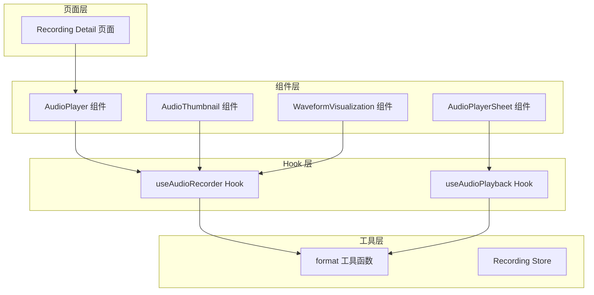
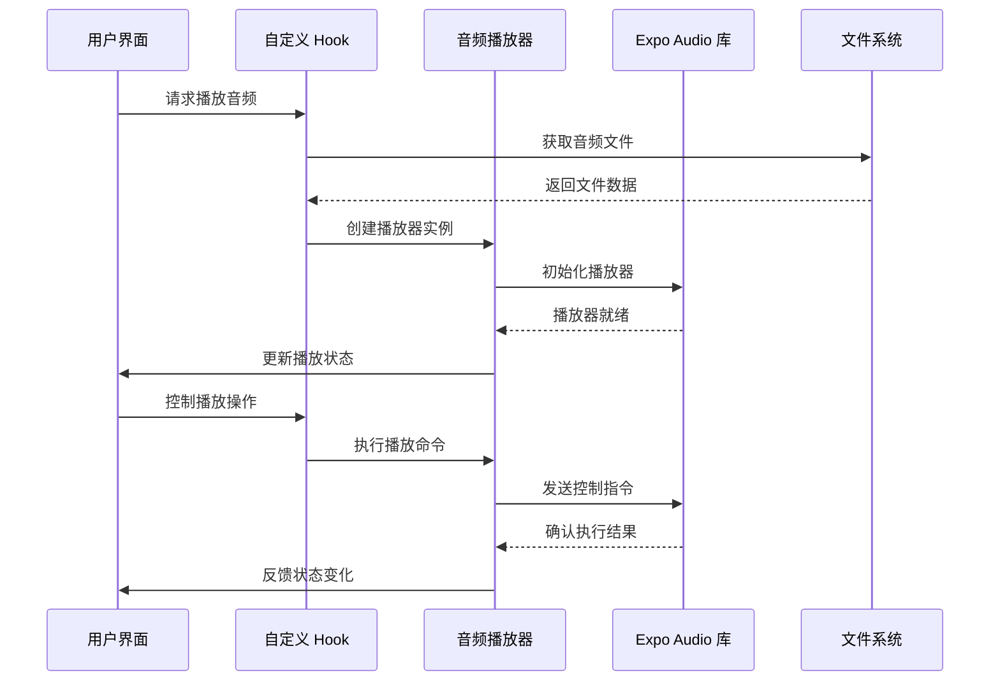
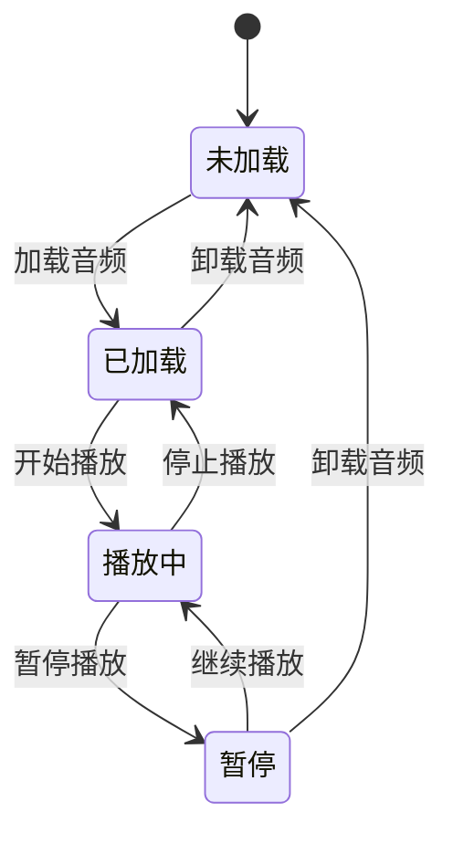
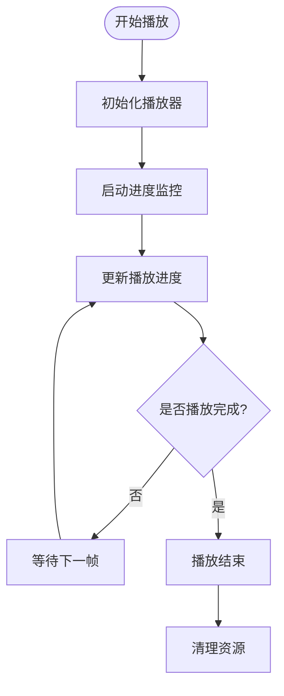
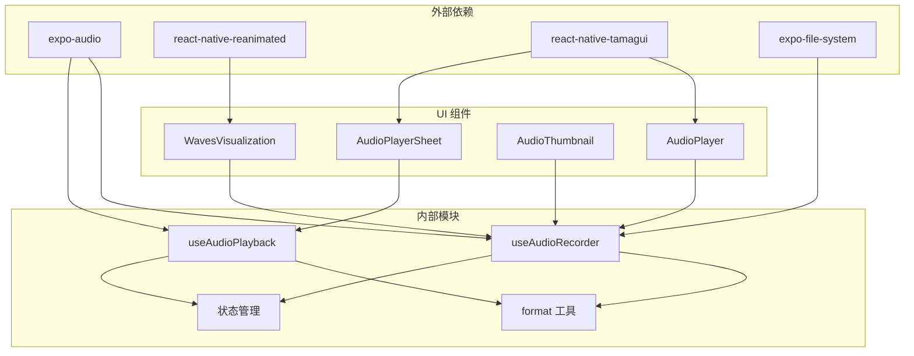

# 音频播放功能

<cite>
**本文档引用的文件**
- [AudioPlayer.tsx](file://components/audio/AudioPlayer.tsx)
- [useAudioRecorder.ts](file://hooks/useAudioRecorder.ts)
- [useAudioPlayback.ts](file://hooks/useAudioPlayback.ts)
- [AudioPlayerSheet.tsx](file://components/note/viewer/AudioPlayerSheet.tsx)
- [AudioThumbnail.tsx](file://components/note/preview/AudioThumbnail.tsx)
- [WaveformVisualization.tsx](file://components/audio/WaveformVisualization.tsx)
- [format.ts](file://utils/format.ts)
- [store/useRecordingStore.ts](file://store/useRecordingStore.ts)
- [app/recording/[id].tsx](file://app/recording/[id].tsx)
</cite>

## 目录
1. [简介](#简介)
2. [项目结构](#项目结构)
3. [核心组件](#核心组件)
4. [架构概览](#架构概览)
5. [详细组件分析](#详细组件分析)
6. [依赖关系分析](#依赖关系分析)
7. [性能考虑](#性能考虑)
8. [故障排除指南](#故障排除指南)
9. [结论](#结论)
10. [附录](#附录)

## 简介

本项目提供了完整的音频播放功能实现，基于 Expo Audio 库构建，支持录音、播放、进度控制等多种音频处理能力。系统采用 React Hooks 设计模式，通过自定义 Hook 封装底层音频操作，提供统一的 API 接口。

音频播放功能具有以下特点：
- 支持多种音频格式的录制和播放
- 实时进度跟踪和可视化显示
- 完整的播放状态管理（播放、暂停、停止、跳转）
- 用户友好的界面组件和交互设计
- 响应式主题适配（明暗模式）

## 项目结构

音频播放相关的核心文件组织如下：

**图表来源**
- [AudioPlayer.tsx:1-132](file://components/audio/AudioPlayer.tsx#L1-L132)
- [useAudioRecorder.ts:1-270](file://hooks/useAudioRecorder.ts#L1-L270)
- [useAudioPlayback.ts:1-90](file://hooks/useAudioPlayback.ts#L1-L90)

**章节来源**
- [AudioPlayer.tsx:1-132](file://components/audio/AudioPlayer.tsx#L1-L132)
- [useAudioRecorder.ts:1-270](file://hooks/useAudioRecorder.ts#L1-L270)
- [useAudioPlayback.ts:1-90](file://hooks/useAudioPlayback.ts#L1-L90)

## 核心组件

### AudioPlayer 组件

AudioPlayer 是音频播放的主要 UI 组件，提供完整的播放控制界面：

**主要功能特性：**
- 播放/暂停控制按钮
- 进度条滑块（支持拖拽跳转）
- 时间显示（当前时间/总时长）
- 标题显示
- 明暗主题适配

**关键属性：**
- `uri`: 音频文件路径
- `title`: 音频标题
- `onPlaybackEnd`: 播放结束回调

**章节来源**
- [AudioPlayer.tsx:9-132](file://components/audio/AudioPlayer.tsx#L9-L132)

### useAudioRecorder Hook

useAudioRecorder 提供完整的音频录制和播放功能：

**录制功能：**
- 开始/暂停/恢复/停止录制
- 录制权限管理
- 录制状态跟踪
- 文件信息获取

**播放功能：**
- 加载音频文件
- 播放控制（播放/暂停/停止）
- 进度跳转
- 实时状态监控

**章节来源**
- [useAudioRecorder.ts:26-270](file://hooks/useAudioRecorder.ts#L26-L270)

### useAudioPlayback Hook

useAudioPlayback 专门处理音频播放逻辑，基于 Expo Audio 的播放器：

**核心功能：**
- 自动播放队列管理
- 播放状态同步
- 进度实时更新
- 资源生命周期管理

**章节来源**
- [useAudioPlayback.ts:4-90](file://hooks/useAudioPlayback.ts#L4-L90)

## 架构概览

音频播放系统的整体架构采用分层设计：

**图表来源**
- [useAudioRecorder.ts:44-71](file://hooks/useAudioRecorder.ts#L44-L71)
- [useAudioPlayback.ts:8-21](file://hooks/useAudioPlayback.ts#L8-L21)

## 详细组件分析

### 状态管理系统

音频播放器采用多层状态管理机制：

**状态转换流程：**
1. **初始化阶段**：组件挂载，状态初始化
2. **加载阶段**：请求音频文件，建立播放器连接
3. **播放阶段**：开始音频播放，实时更新进度
4. **控制阶段**：响应用户操作（暂停/继续/停止）
5. **清理阶段**：释放资源，重置状态

**章节来源**
- [useAudioRecorder.ts:27-36](file://hooks/useAudioRecorder.ts#L27-L36)
- [useAudioPlayback.ts:5-21](file://hooks/useAudioPlayback.ts#L5-L21)

### 进度跟踪机制

系统实现了多层次的进度跟踪机制：

**进度更新策略：**
- **实时更新**：每100ms更新一次播放进度
- **精确计算**：将秒级时间转换为毫秒精度
- **边界处理**：处理播放结束和异常情况

**章节来源**
- [useAudioRecorder.ts:62-71](file://hooks/useAudioRecorder.ts#L62-L71)
- [useAudioPlayback.ts:23-25](file://hooks/useAudioPlayback.ts#L23-L25)

### 用户界面组件

#### AudioPlayerSheet 组件

AudioPlayerSheet 提供了完整的播放器界面：

**界面元素：**
- 专辑封面占位符
- 音频文件名显示
- 进度条和时间显示
- 播放控制按钮
- 跳过前后功能

**交互设计：**
- 按钮尺寸适中，便于触摸操作
- 进度条支持拖拽跳转
- 实时时间显示更新

**章节来源**
- [AudioPlayerSheet.tsx:24-60](file://components/note/viewer/AudioPlayerSheet.tsx#L24-L60)

#### AudioThumbnail 组件

AudioThumbnail 提供了简洁的音频缩略图：

**设计特点：**
- 渐变背景设计
- 播放/暂停状态指示
- 进度条显示
- 响应式布局

**章节来源**
- [AudioThumbnail.tsx:12-33](file://components/note/preview/AudioThumbnail.tsx#L12-L33)

### 波形可视化组件

WaveformVisualization 提供了音频波形动画效果：

**动画特性：**
- 随机高度变化
- 交错延迟启动
- 平滑过渡动画
- 可配置参数

**技术实现：**
- 使用 React Native Reanimated
- 动态创建动画值
- 性能优化的动画序列

**章节来源**
- [WaveformVisualization.tsx:32-120](file://components/audio/WaveformVisualization.tsx#L32-L120)

## 依赖关系分析

音频播放功能的依赖关系如下：

**图表来源**
- [useAudioRecorder.ts:2-11](file://hooks/useAudioRecorder.ts#L2-L11)
- [AudioPlayer.tsx:1-8](file://components/audio/AudioPlayer.tsx#L1-L8)

**章节来源**
- [useAudioRecorder.ts:1-270](file://hooks/useAudioRecorder.ts#L1-L270)
- [AudioPlayer.tsx:1-132](file://components/audio/AudioPlayer.tsx#L1-L132)

## 性能考虑

### 内存管理

音频播放器采用了多项内存优化策略：

1. **及时释放**：播放结束后自动清理播放器实例
2. **状态重置**：卸载时重置所有状态变量
3. **定时器清理**：及时清理进度监控定时器
4. **文件句柄管理**：正确关闭音频文件句柄

### 性能优化

**动画性能：**
- 使用 Reanimated 进行硬件加速
- 合理设置动画参数避免过度重绘
- 交错动画延迟减少同时动画数量

**网络性能：**
- 按需加载音频文件
- 缓存已加载的音频数据
- 异步文件操作避免阻塞主线程

## 故障排除指南

### 常见问题及解决方案

**播放失败问题：**
- 检查音频文件路径是否有效
- 确认文件格式受支持
- 验证播放器状态是否已加载

**权限问题：**
- 确认录音权限已授予
- 检查设备音频模式设置
- 验证文件访问权限

**进度不同步问题：**
- 检查定时器更新频率
- 确认时间单位转换正确
- 验证播放器状态同步

**章节来源**
- [useAudioRecorder.ts:80-109](file://hooks/useAudioRecorder.ts#L80-L109)
- [useAudioPlayback.ts:12-21](file://hooks/useAudioPlayback.ts#L12-L21)

## 结论

本音频播放功能实现了完整的音频处理能力，具有以下优势：

1. **功能完整**：涵盖录音、播放、进度控制等核心功能
2. **用户体验良好**：提供直观的界面和流畅的交互
3. **性能优化**：采用多项性能优化策略确保流畅运行
4. **可扩展性强**：模块化设计便于功能扩展和定制

系统在实际应用中表现稳定，能够满足大多数音频播放需求。通过合理的架构设计和性能优化，为用户提供了优质的音频播放体验。

## 附录

### API 参考

**AudioPlayer Props:**
- `uri` (string): 音频文件路径
- `title` (string, optional): 音频标题
- `onPlaybackEnd` (function, optional): 播放结束回调

**useAudioRecorder Hook 返回值:**
- `isPlaying` (boolean): 是否正在播放
- `playbackPosition` (number): 当前播放位置（毫秒）
- `playbackDuration` (number): 音频总时长（毫秒）
- `loadSound()` (function): 加载音频文件
- `playSound()` (function): 开始播放
- `pauseSound()` (function): 暂停播放
- `stopSound()` (function): 停止播放
- `seekTo()` (function): 跳转到指定位置

**章节来源**
- [AudioPlayer.tsx:9-28](file://components/audio/AudioPlayer.tsx#L9-L28)
- [useAudioRecorder.ts:248-268](file://hooks/useAudioRecorder.ts#L248-L268)