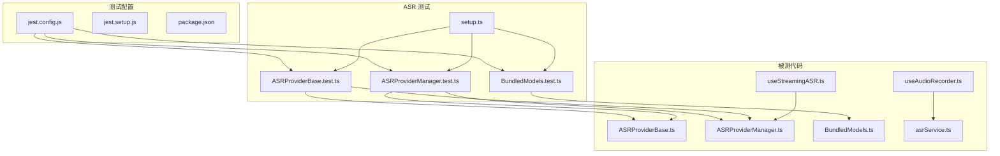
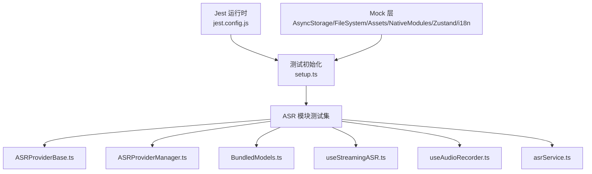
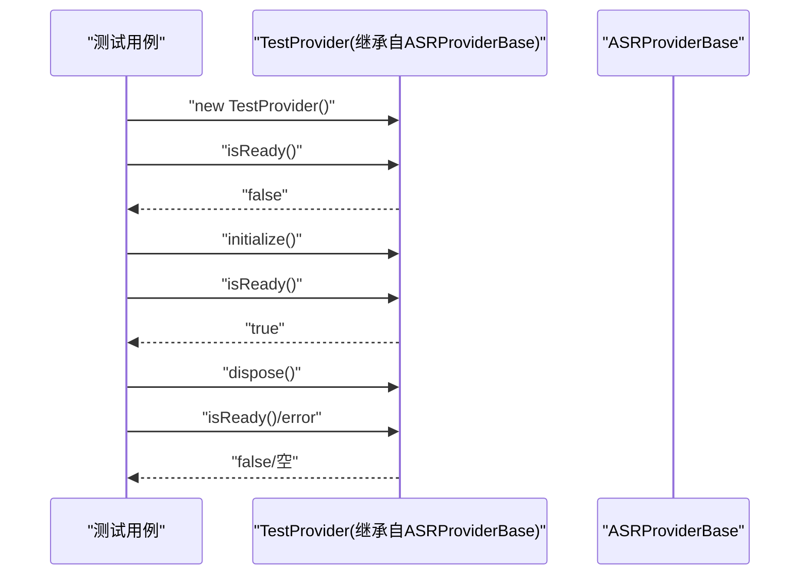
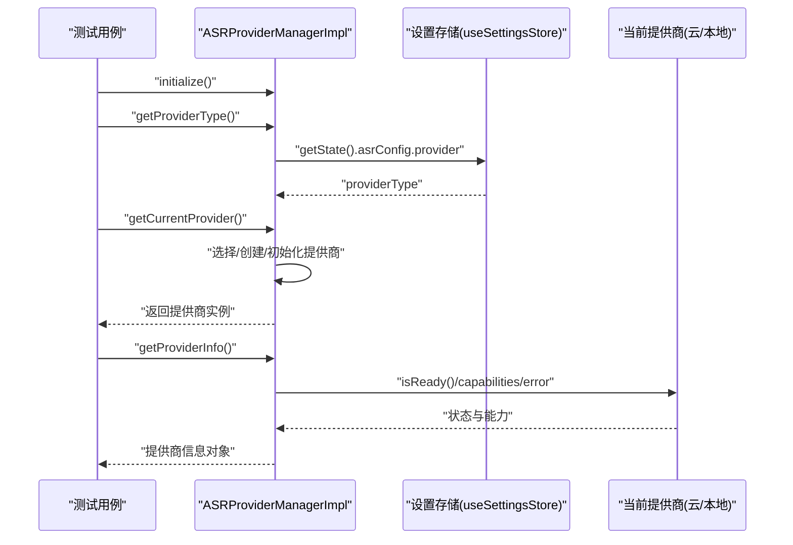
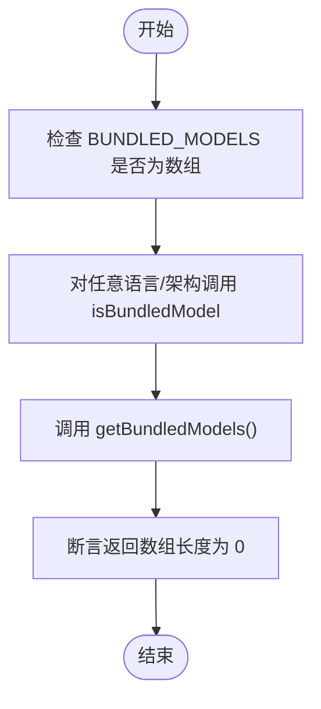
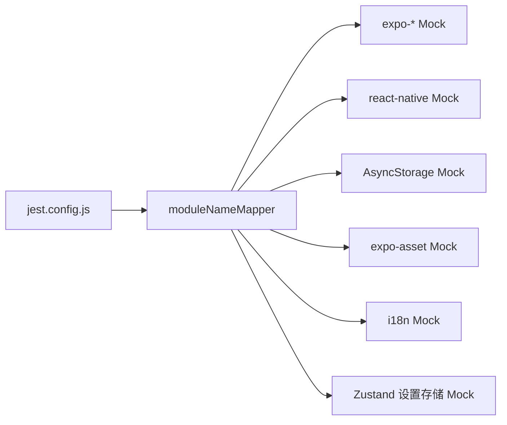

# 单元测试

<cite>
**本文引用的文件**
- [jest.config.js](file://jest.config.js)
- [jest.setup.js](file://jest.setup.js)
- [package.json](file://package.json)
- [services/asr/__tests__/setup.ts](file://services/asr/__tests__/setup.ts)
- [services/asr/__tests__/ASRProviderBase.test.ts](file://services/asr/__tests__/ASRProviderBase.test.ts)
- [services/asr/__tests__/ASRProviderManager.test.ts](file://services/asr/__tests__/ASRProviderManager.test.ts)
- [services/asr/__tests__/BundledModels.test.ts](file://services/asr/__tests__/BundledModels.test.ts)
- [services/asr/providers/base/ASRProviderBase.ts](file://services/asr/providers/base/ASRProviderBase.ts)
- [services/asr/providers/ASRProviderManager.ts](file://services/asr/providers/ASRProviderManager.ts)
- [services/asr/modelManager/BundledModels.ts](file://services/asr/modelManager/BundledModels.ts)
- [services/asr/asrService.ts](file://services/asr/asrService.ts)
- [hooks/useStreamingASR.ts](file://hooks/useStreamingASR.ts)
- [hooks/useAudioRecorder.ts](file://hooks/useAudioRecorder.ts)
</cite>

## 目录
1. [简介](#简介)
2. [项目结构](#项目结构)
3. [核心组件](#核心组件)
4. [架构总览](#架构总览)
5. [详细组件分析](#详细组件分析)
6. [依赖分析](#依赖分析)
7. [性能考虑](#性能考虑)
8. [故障排查指南](#故障排查指南)
9. [结论](#结论)
10. [附录](#附录)

## 简介
本文件面向 VoiceNote 项目的单元测试体系，系统性阐述基于 Jest 的测试架构与配置，覆盖 ASR 提供商基类、提供商管理器、本地模型打包与提取、以及录音与流式转写等核心业务逻辑的测试设计与最佳实践。文档同时给出断言策略、异步测试（Promise/async-await）策略、服务层数据处理测试方法、覆盖率与质量标准建议，帮助开发者在不深入源码细节的前提下高效开展测试工作。

## 项目结构
VoiceNote 的测试采用 Jest + TypeScript + Testing Library 的组合，测试目录按功能模块划分，ASR 模块的测试集中在 services/asr/__tests__ 下，配合统一的 Jest 配置与模块别名映射，确保可测试性与隔离性。

图表来源
- [jest.config.js:1-47](file://jest.config.js#L1-L47)
- [jest.setup.js:1-11](file://jest.setup.js#L1-L11)
- [services/asr/__tests__/setup.ts:1-99](file://services/asr/__tests__/setup.ts#L1-L99)
- [services/asr/__tests__/ASRProviderBase.test.ts:1-90](file://services/asr/__tests__/ASRProviderBase.test.ts#L1-L90)
- [services/asr/__tests__/ASRProviderManager.test.ts:1-133](file://services/asr/__tests__/ASRProviderManager.test.ts#L1-L133)
- [services/asr/__tests__/BundledModels.test.ts:1-35](file://services/asr/__tests__/BundledModels.test.ts#L1-L35)
- [services/asr/providers/base/ASRProviderBase.ts:1-66](file://services/asr/providers/base/ASRProviderBase.ts#L1-L66)
- [services/asr/providers/ASRProviderManager.ts:1-263](file://services/asr/providers/ASRProviderManager.ts#L1-L263)
- [services/asr/modelManager/BundledModels.ts:1-258](file://services/asr/modelManager/BundledModels.ts#L1-L258)
- [services/asr/asrService.ts:1-74](file://services/asr/asrService.ts#L1-L74)
- [hooks/useStreamingASR.ts:1-269](file://hooks/useStreamingASR.ts#L1-L269)
- [hooks/useAudioRecorder.ts:1-270](file://hooks/useAudioRecorder.ts#L1-L270)

章节来源
- [jest.config.js:1-47](file://jest.config.js#L1-L47)
- [jest.setup.js:1-11](file://jest.setup.js#L1-L11)
- [package.json:1-83](file://package.json#L1-L83)

## 核心组件
- 测试运行时与环境
  - 使用 Node 环境运行测试，避免与 Expo 预设冲突；通过 setupFilesAfterEnv 引入 Testing Library 扩展断言与自定义初始化脚本。
  - 覆盖收集范围聚焦于 ASR 服务层与关键 Hook，排除类型声明与测试目录本身。
- 模块别名与 Mock
  - 通过 moduleNameMapper 将 @/、@hooks/、@services/ 等路径映射到实际源码，保证导入一致性。
  - 对原生模块（expo-*、react-native）、i18n、AsyncStorage、文件系统等进行集中 Mock，屏蔽平台差异与外部依赖。
- 测试初始化
  - 在 ASR 模块测试中，优先执行 setup.ts 完成 AsyncStorage、文件系统、资产加载、原生 Moonshine 模块、Zustand 设置存储等 Mock，确保后续测试稳定。

章节来源
- [jest.config.js:1-47](file://jest.config.js#L1-L47)
- [jest.setup.js:1-11](file://jest.setup.js#L1-L11)
- [services/asr/__tests__/setup.ts:1-99](file://services/asr/__tests__/setup.ts#L1-L99)
- [package.json:1-83](file://package.json#L1-L83)

## 架构总览
下图展示了测试架构与被测模块之间的关系：Jest 配置驱动测试发现与执行；各模块测试通过 setup.ts 注入 Mock；被测模块包括 ASR 提供商基类、提供商管理器、本地模型打包工具、录音 Hook、流式转写 Hook 与云端 ASR 服务。

图表来源
- [jest.config.js:1-47](file://jest.config.js#L1-L47)
- [services/asr/__tests__/setup.ts:1-99](file://services/asr/__tests__/setup.ts#L1-L99)
- [services/asr/providers/base/ASRProviderBase.ts:1-66](file://services/asr/providers/base/ASRProviderBase.ts#L1-L66)
- [services/asr/providers/ASRProviderManager.ts:1-263](file://services/asr/providers/ASRProviderManager.ts#L1-L263)
- [services/asr/modelManager/BundledModels.ts:1-258](file://services/asr/modelManager/BundledModels.ts#L1-L258)
- [hooks/useStreamingASR.ts:1-269](file://hooks/useStreamingASR.ts#L1-L269)
- [hooks/useAudioRecorder.ts:1-270](file://hooks/useAudioRecorder.ts#L1-L270)
- [services/asr/asrService.ts:1-74](file://services/asr/asrService.ts#L1-L74)

## 详细组件分析

### ASR 提供商基类测试
- 测试目标
  - 验证初始化状态、重复初始化安全、错误状态暴露与清理、能力信息暴露等基础行为。
- 关键断言
  - 初始化前 isReady 返回 false；initialize 后 isReady 返回 true；重复 initialize 不抛错。
  - 错误初始为空，dispose 后错误清空且 isReady 失效。
  - capabilities 字段存在且包含支持语言等信息。
- 设计要点
  - 通过继承抽象基类创建具体实现以进行实例化测试，避免直接测试抽象类。
  - 在 afterEach 中调用 dispose，确保资源释放与状态复位。

图表来源
- [services/asr/__tests__/ASRProviderBase.test.ts:1-90](file://services/asr/__tests__/ASRProviderBase.test.ts#L1-L90)
- [services/asr/providers/base/ASRProviderBase.ts:1-66](file://services/asr/providers/base/ASRProviderBase.ts#L1-L66)

章节来源
- [services/asr/__tests__/ASRProviderBase.test.ts:1-90](file://services/asr/__tests__/ASRProviderBase.test.ts#L1-L90)
- [services/asr/providers/base/ASRProviderBase.ts:1-66](file://services/asr/providers/base/ASRProviderBase.ts#L1-L66)

### ASR 提供商管理器测试
- 测试目标
  - 验证提供商选择、类型判断、当前提供商获取、信息查询、流式支持检测、生命周期管理等。
- 关键断言
  - 双重 initialize 不抛错；提供商类型来自设置；getCurrentProvider 返回具备名称与能力的对象；getProviderInfo 返回类型/名称/状态/能力/错误等字段。
  - 类型守卫 isStreamingProvider/isNonStreamingProvider 正确区分流式与非流式提供商。
- 设计要点
  - 通过 asrProviderManager 单例进行初始化与销毁，确保测试前后状态一致。
  - 利用类型守卫函数验证提供商接口一致性。

图表来源
- [services/asr/__tests__/ASRProviderManager.test.ts:1-133](file://services/asr/__tests__/ASRProviderManager.test.ts#L1-L133)
- [services/asr/providers/ASRProviderManager.ts:1-263](file://services/asr/providers/ASRProviderManager.ts#L1-L263)

章节来源
- [services/asr/__tests__/ASRProviderManager.test.ts:1-133](file://services/asr/__tests__/ASRProviderManager.test.ts#L1-L133)
- [services/asr/providers/ASRProviderManager.ts:1-263](file://services/asr/providers/ASRProviderManager.ts#L1-L263)

### 本地模型打包与提取测试
- 测试目标
  - 验证打包模型常量、是否打包模型判断、打包模型列表获取等工具函数的行为。
- 关键断言
  - BUNDLED_MODELS 为数组；默认情况下 isBundledModel 返回 false；getBundledModels 返回空数组。
- 设计要点
  - 该测试关注纯函数与常量，无需复杂 Mock；通过断言默认行为验证逻辑分支。

图表来源
- [services/asr/__tests__/BundledModels.test.ts:1-35](file://services/asr/__tests__/BundledModels.test.ts#L1-L35)
- [services/asr/modelManager/BundledModels.ts:1-258](file://services/asr/modelManager/BundledModels.ts#L1-L258)

章节来源
- [services/asr/__tests__/BundledModels.test.ts:1-35](file://services/asr/__tests__/BundledModels.test.ts#L1-L35)
- [services/asr/modelManager/BundledModels.ts:1-258](file://services/asr/modelManager/BundledModels.ts#L1-L258)

### 录音 Hook 测试
- 测试目标
  - 验证录音权限请求、录音状态更新、暂停/恢复、停止/取消、播放控制、文件大小读取等流程。
- 异步测试策略
  - 使用 async/await 确保异步操作完成后再断言；对定时器与播放轮询进行最小化模拟或跳过。
- 断言方法
  - 断言状态变化（isRecording/isPaused/duration/uri），断言文件存在与大小读取，断言错误消息国际化键值。
- 最佳实践
  - 对外部库（expo-audio、expo-file-system）进行 Mock，避免真实设备/文件系统依赖。
  - 在测试间隔离状态，使用独立的测试夹具或 beforeEach/afterEach 清理。

章节来源
- [hooks/useAudioRecorder.ts:1-270](file://hooks/useAudioRecorder.ts#L1-L270)

### 流式转写 Hook 测试
- 测试目标
  - 验证流式提供商单例、就绪状态检查、事件订阅与处理、开始/停止流式转写、错误传播、文本合并等。
- 异步测试策略
  - Mock Moonshine 提供商的 isReady/startStreaming/stopStreaming/subscribe 等方法，模拟事件回调。
  - 使用 ref 保存中间状态（如 lines），在 stopStreaming 后断言最终文本拼接结果。
- 断言方法
  - 断言 lines 文本变更与完成标记，断言 isStreaming/isReady/error 的状态流转，断言 providerName。
- 最佳实践
  - 保持 provider 单例稳定，避免每次渲染产生新实例导致订阅丢失。
  - 对设置存储（useSettingsStore）进行 Mock，确保语言与模型参数可控。

章节来源
- [hooks/useStreamingASR.ts:1-269](file://hooks/useStreamingASR.ts#L1-L269)

### 云端 ASR 服务测试
- 测试目标
  - 验证配置检查、文件存在性校验、超时控制、错误处理与国际化错误消息。
- 异步测试策略
  - Mock fetch 行为，分别测试正常响应、非 OK 响应、AbortError 场景。
  - 使用 AbortController 控制超时，断言超时错误与普通网络错误的区分。
- 断言方法
  - 断言配置缺失时抛出错误；断言文件不存在时抛出错误；断言 API 响应异常时抛出带状态信息的错误；断言超时时抛出特定错误。

章节来源
- [services/asr/asrService.ts:1-74](file://services/asr/asrService.ts#L1-L74)

## 依赖分析
- 测试耦合与内聚
  - ASR 模块测试高度内聚于被测模块（基类、管理器、模型工具、Hook、服务），通过 setup.ts 统一注入 Mock，降低跨模块耦合。
- 外部依赖与集成点
  - AsyncStorage、expo-file-system、expo-asset、react-native 原生模块、i18n、Zustand 设置存储等均被 Mock，确保测试可在无设备环境下稳定运行。
- 循环依赖与边界
  - 测试未发现循环依赖；Mock 层清晰界定，避免真实调用链路。

图表来源
- [jest.config.js:18-38](file://jest.config.js#L18-L38)
- [services/asr/__tests__/setup.ts:5-83](file://services/asr/__tests__/setup.ts#L5-L83)

章节来源
- [jest.config.js:18-38](file://jest.config.js#L18-L38)
- [services/asr/__tests__/setup.ts:5-83](file://services/asr/__tests__/setup.ts#L5-L83)

## 性能考虑
- 测试执行效率
  - 使用 moduleNameMapper 与集中 Mock 减少模块解析与外部 I/O 开销。
  - 通过 setup.ts 在测试前一次性注入 Mock，避免每个用例重复配置。
- 覆盖率与质量
  - 当前覆盖率收集范围聚焦于 ASR 服务层与 useStreamingASR，建议逐步扩展至更多业务模块，确保关键路径与边界条件被覆盖。
  - 对异步流程（Promise/async-await）采用合理的时间控制与超时设置，避免测试执行时间过长。

## 故障排查指南
- 常见问题
  - Mock 未生效：检查 moduleNameMapper 与 Mock 文件命名是否匹配；确认 jest.setup.js 与测试入口顺序正确。
  - 设置存储读取不到：确保 setup.ts 中对 useSettingsStore 的 Mock 已在测试前执行。
  - 流式事件未触发：检查 provider.subscribe 回调是否正确注册，事件分发逻辑是否被 Mock。
  - 超时错误：确认 AbortController 的超时 ID 清理逻辑，避免影响其他测试。
- 排查步骤
  - 逐个注释掉 Mock，定位真实依赖导致的问题。
  - 使用最小化用例复现问题，缩小范围后逐步添加断言。
  - 对异步流程增加日志输出（仅限调试），确认事件与状态流转。

章节来源
- [jest.setup.js:1-11](file://jest.setup.js#L1-L11)
- [services/asr/__tests__/setup.ts:85-99](file://services/asr/__tests__/setup.ts#L85-L99)
- [hooks/useStreamingASR.ts:101-185](file://hooks/useStreamingASR.ts#L101-L185)
- [services/asr/asrService.ts:42-73](file://services/asr/asrService.ts#L42-L73)

## 结论
VoiceNote 的单元测试体系以 Jest 为核心，结合 TypeScript 与 Testing Library，通过集中 Mock 与模块别名映射，实现了对 ASR 提供商基类、提供商管理器、本地模型打包工具、录音与流式转写 Hook、云端 ASR 服务等关键模块的稳定测试。遵循本文的断言策略与异步测试最佳实践，可进一步提升测试覆盖率与质量，保障核心业务逻辑的正确性与鲁棒性。

## 附录
- 测试命令
  - 运行所有测试：npm test
  - 监听模式：npm run test:watch
  - 生成覆盖率：npm run test:coverage
- 覆盖率与质量标准建议
  - 覆盖率目标：关键业务模块（ASR 服务层、Hook、工具函数）行覆盖率不低于 80%，分支覆盖率不低于 60%。
  - 质量标准：每个公共函数至少包含一个成功路径与一个失败路径的测试；异步流程必须覆盖超时、网络错误、资源释放等场景；对 Mock 的有效性进行回归验证。

章节来源
- [package.json:5-18](file://package.json#L5-L18)
- [jest.config.js:40-46](file://jest.config.js#L40-L46)