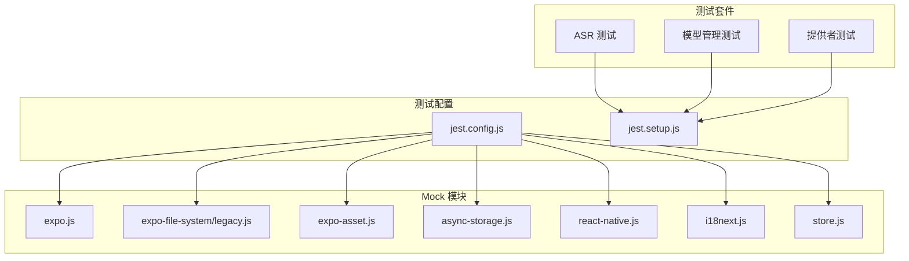
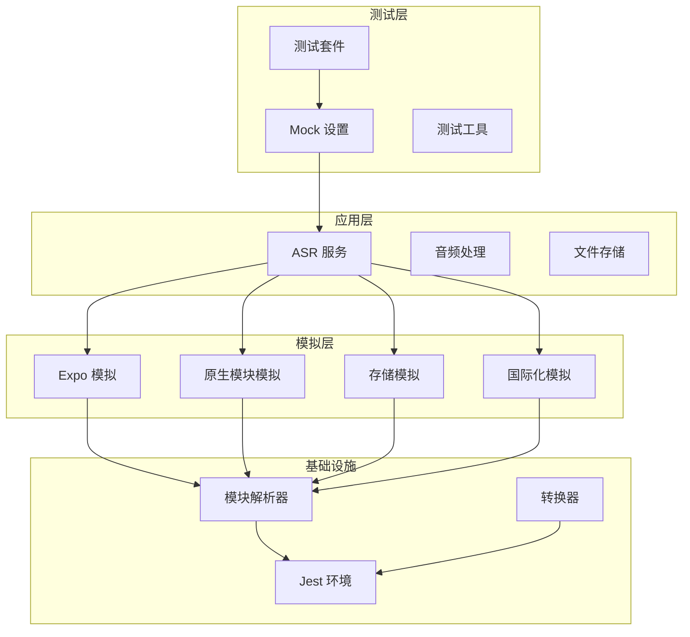
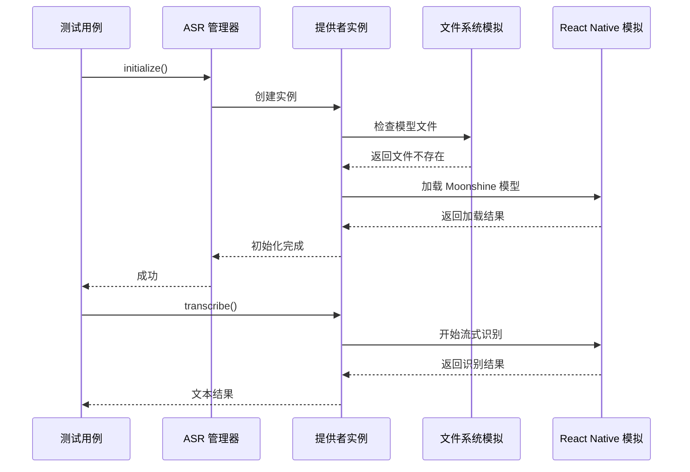

# 测试模拟实现

<cite>
**本文档引用的文件**
- [jest.config.js](file://jest.config.js)
- [jest.setup.js](file://jest.setup.js)
- [__mocks__/expo-file-system/legacy.js](file://__mocks__/expo-file-system/legacy.js)
- [__mocks__/async-storage.js](file://__mocks__/async-storage.js)
- [__mocks__/i18next.js](file://__mocks__/i18next.js)
- [__mocks__/expo.js](file://__mocks__/expo.js)
- [__mocks__/expo-asset.js](file://__mocks__/expo-asset.js)
- [__mocks__/react-native.js](file://__mocks__/react-native.js)
- [__mocks__/store.js](file://__mocks__/store.js)
- [services/asr/__tests__/setup.ts](file://services/asr/__tests__/setup.ts)
- [services/asr/__tests__/ASRProviderBase.test.ts](file://services/asr/__tests__/ASRProviderBase.test.ts)
- [services/asr/__tests__/ASRProviderManager.test.ts](file://services/asr/__tests__/ASRProviderManager.test.ts)
- [services/asr/__tests__/BundledModels.test.ts](file://services/asr/__tests__/BundledModels.test.ts)
- [store/useSettingsStore.ts](file://store/useSettingsStore.ts)
- [package.json](file://package.json)
</cite>

## 目录
1. [简介](#简介)
2. [项目结构](#项目结构)
3. [核心组件](#核心组件)
4. [架构概览](#架构概览)
5. [详细组件分析](#详细组件分析)
6. [依赖分析](#依赖分析)
7. [性能考虑](#性能考虑)
8. [故障排除指南](#故障排除指南)
9. [结论](#结论)

## 简介

VoiceNote 项目采用 Jest 测试框架实现了全面的测试模拟机制，专门针对 React Native 和 Expo 环境进行测试。该项目展示了如何在不依赖真实设备或网络连接的情况下，通过精心设计的 mock 实现来测试复杂的语音识别和音频处理功能。

测试模拟实现的核心目标是：
- 模拟原生模块行为，如文件系统、异步存储、国际化等
- 提供可预测的测试环境，确保测试结果的一致性
- 支持离线测试，提高测试执行速度
- 维护测试数据的完整性和可追溯性

## 项目结构

VoiceNote 项目的测试基础设施采用了模块化的组织方式，主要包含以下关键目录和文件：



**图表来源**
- [jest.config.js:18-38](file://jest.config.js#L18-L38)
- [__mocks__/expo.js:1-9](file://__mocks__/expo.js#L1-L9)

**章节来源**
- [jest.config.js:1-47](file://jest.config.js#L1-L47)
- [jest.setup.js:1-11](file://jest.setup.js#L1-L11)

## 核心组件

### Jest 配置系统

Jest 配置系统是整个测试模拟实现的基础，它定义了测试环境、模块映射和转换规则。

**模块名称映射策略**：
- 使用正则表达式精确匹配特定模块
- 优先级处理：具体模块的 mock 应该在通用模式之前
- 支持路径别名映射，便于模块导入

**测试环境配置**：
- 使用 Node.js 环境而非浏览器环境
- 集成 Testing Library 扩展
- TypeScript 转换器配置

**章节来源**
- [jest.config.js:18-38](file://jest.config.js#L18-L38)
- [jest.config.js:5-8](file://jest.config.js#L5-L8)

### Expo 模块模拟

Expo 相关模块的模拟实现了完整的文件系统、资产管理和平台抽象功能。

**文件系统模拟**：
- 提供标准的文件操作接口
- 支持目录信息查询、文件读写、下载等功能
- 返回预定义的模拟数据结构

**资产管理系统**：
- 模拟资源加载和缓存机制
- 支持从模块中获取资源
- 提供本地 URI 映射

**章节来源**
- [__mocks__/expo-file-system/legacy.js:1-12](file://__mocks__/expo-file-system/legacy.js#L1-L12)
- [__mocks__/expo-asset.js:1-10](file://__mocks__/expo-asset.js#L1-L10)

### React Native 平台模拟

React Native 模拟提供了完整的原生模块抽象，特别是 Moonshine 语音处理模块。

**原生模块接口**：
- MoonshineModule：支持可用性检查、模型加载、流式处理
- NativeEventEmitter：事件监听和订阅管理
- Platform：平台选择和条件渲染

**UI 组件模拟**：
- 基础 React Native 组件的字符串表示
- 保持组件树结构的完整性
- 支持样式系统的简化实现

**章节来源**
- [__mocks__/react-native.js:1-37](file://__mocks__/react-native.js#L1-L37)

### 状态管理模拟

Zustand 状态管理的模拟实现了完整的状态持久化和响应式更新机制。

**状态存储结构**：
- ASR 配置管理
- 设置项的增删改查操作
- 状态订阅和销毁机制

**持久化存储**：
- 模拟 AsyncStorage 行为
- 支持状态序列化和反序列化
- 合并策略处理版本兼容性

**章节来源**
- [__mocks__/store.js:1-24](file://__mocks__/store.js#L1-L24)
- [store/useSettingsStore.ts:134-218](file://store/useSettingsStore.ts#L134-L218)

## 架构概览

VoiceNote 的测试架构采用了分层的设计模式，确保各个组件之间的解耦和可测试性。



**图表来源**
- [jest.config.js:18-38](file://jest.config.js#L18-L38)
- [services/asr/__tests__/setup.ts:5-83](file://services/asr/__tests__/setup.ts#L5-L83)

## 详细组件分析

### ASR Provider 测试架构

ASR（自动语音识别）提供者的测试展示了如何模拟复杂的语音处理流程。



**图表来源**
- [services/asr/__tests__/ASRProviderManager.test.ts:10-58](file://services/asr/__tests__/ASRProviderManager.test.ts#L10-L58)
- [services/asr/__tests__/setup.ts:39-59](file://services/asr/__tests__/setup.ts#L39-L59)

**章节来源**
- [services/asr/__tests__/ASRProviderBase.test.ts:1-90](file://services/asr/__tests__/ASRProviderBase.test.ts#L1-L90)
- [services/asr/__tests__/ASRProviderManager.test.ts:1-133](file://services/asr/__tests__/ASRProviderManager.test.ts#L1-L133)

### Mock 注入策略

Mock 注入策略采用了多种技术来确保测试环境的隔离性和可控性。

**模块级别注入**：
- 使用 `jest.mock()` 在模块级别替换实现
- 支持动态导入和静态导入
- 保证 mock 的作用域隔离

**全局设置注入**：
- 通过 `jest.setup.js` 进行全局配置
- 控制控制台输出和警告消息
- 设置测试前后的清理逻辑

**章节来源**
- [services/asr/__tests__/setup.ts:5-83](file://services/asr/__tests__/setup.ts#L5-L83)
- [jest.setup.js:3-10](file://jest.setup.js#L3-L10)

### 国际化模拟实现

i18n 模拟实现了基本的翻译功能，支持多语言环境测试。

**翻译功能模拟**：
- 翻译函数返回键名本身
- 支持语言列表和当前语言设置
- 提供语言切换和初始化方法

**测试场景支持**：
- 多语言界面的正确显示
- 国际化资源的加载验证
- 语言切换功能的测试

**章节来源**
- [__mocks__/i18next.js:1-11](file://__mocks__/i18next.js#L1-L11)

### 异步存储模拟

AsyncStorage 模拟提供了完整的键值存储功能，支持状态持久化测试。

**存储操作模拟**：
- 基本的 CRUD 操作
- 批量操作支持
- 键值对管理

**状态恢复测试**：
- 应用重启后的状态恢复
- 存储数据的序列化和反序列化
- 兼容性处理

**章节来源**
- [__mocks__/async-storage.js:1-12](file://__mocks__/async-storage.js#L1-L12)

## 依赖分析

VoiceNote 项目的测试依赖关系展现了清晰的模块化架构。

```mermaid
graph TB
subgraph "测试运行时"
JEST[jest]
TS_JEST[ts-jest]
TESTING_LIBRARY[@testing-library]
end
subgraph "应用依赖"
EXPONATIVE[expo]
REACT_NATIVE[react-native]
ASYNC_STORAGE[@react-native-async-storage]
I18NEXT[i18next]
end
subgraph "测试依赖"
JEST_EXPLOIT[jest-expo]
MOCK_MODULES[自定义 Mock 模块]
end
JEST --> TS_JEST
JEST --> TESTING_LIBRARY
JEST --> JEST_EXPLOIT
EXPONATIVE --> JEST
REACT_NATIVE --> JEST
ASYNC_STORAGE --> JEST
I18NEXT --> JEST
JEST --> MOCK_MODULES
```

**图表来源**
- [package.json:64-82](file://package.json#L64-L82)
- [package.json:20-62](file://package.json#L20-L62)

**章节来源**
- [package.json:1-83](file://package.json#L1-L83)

## 性能考虑

测试模拟实现的性能优化策略：

### Mock 对象的内存管理
- 使用 `jest.fn()` 创建轻量级的模拟函数
- 避免在 mock 中创建大型对象
- 及时清理不需要的模拟状态

### 测试执行效率
- 使用 `jest.mock()` 进行模块级别的替换
- 避免在单个测试文件中创建过多的 mock
- 合理使用 `beforeEach` 和 `afterEach` 钩子

### 数据访问优化
- 缓存常用的 mock 数据
- 使用简单的数据结构减少序列化开销
- 避免深度嵌套的对象结构

## 故障排除指南

### 常见问题和解决方案

**模块解析错误**：
- 确保 `moduleNameMapper` 配置正确
- 检查文件路径是否与实际项目结构匹配
- 验证 mock 文件的导出格式

**Mock 不生效**：
- 确认 mock 文件位于正确的 `__mocks__` 目录
- 检查模块导入路径是否与 mock 配置一致
- 验证 Jest 的模块解析顺序

**测试超时问题**：
- 检查异步操作的 Promise 处理
- 确保所有异步调用都有适当的超时设置
- 验证 mock 函数的返回值类型

**章节来源**
- [jest.config.js:18-38](file://jest.config.js#L18-L38)
- [services/asr/__tests__/setup.ts:85-99](file://services/asr/__tests__/setup.ts#L85-L99)

## 结论

VoiceNote 项目的测试模拟实现展示了现代 React Native 应用测试的最佳实践。通过精心设计的 mock 系统，项目成功地解决了跨平台测试的挑战，提供了稳定、可预测且高效的测试环境。

**主要成就**：
- 完整的 Expo 生态系统模拟
- 高度可定制的状态管理模拟
- 灵活的模块替换机制
- 优秀的测试数据管理策略

**未来改进方向**：
- 扩展更多的原生模块模拟
- 实现更复杂的交互场景测试
- 优化测试覆盖率和质量指标
- 建立自动化测试报告系统

这个测试框架为类似的应用程序提供了宝贵的参考，展示了如何在复杂的移动应用环境中实现可靠的测试策略。